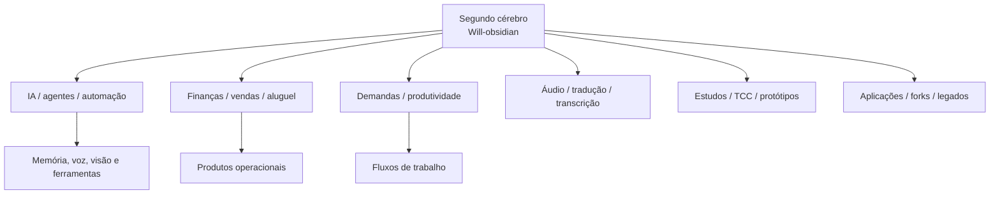
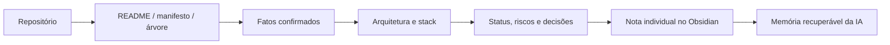

# Mapa Cognitivo Real dos 80 Repositórios

> Esta versão foi gerada consultando diretamente README, package.json, requirements.txt ou pyproject.toml de cada repositório disponível.
> Campos sem evidência foram explicitamente marcados; não são inferências apresentadas como fatos.

## Mapa geral



## Fluxo de conhecimento para a IA



## Padrões técnicos e interesses confirmados

- Interesse recorrente em IA aplicada, agentes pessoais, IA local, memória, voz, visão e automação.
- Interesse em produtos reais de finanças, vendas, aluguel, demandas e produtividade.
- Uso recorrente de Python, TypeScript/JavaScript, React/Next.js, NestJS, FastAPI, Prisma, PostgreSQL, Docker, Ollama e modelos de IA.
- Interesse em ferramentas próprias, execução local, privacidade, interfaces web e automação de tarefas.
- Existência de uma linha acadêmica com TCCs, atividades, estudos de LLM/deep learning e experimentos.
- Existência de forks, legados e protótipos que devem ser separados dos projetos ativos.

## Regra para futuras notas

Cada projeto importante deve ter uma nota individual com propósito, usuários, stack, arquitetura, comandos, dependências, status, riscos, decisões, roadmap, relações e evidências por arquivo/commit.

## Produtos, finanças e gestão

### Domni

- **Repositório:** [William-kelvem94/Domni](https://github.com/William-kelvem94/Domni)
- **Branch padrão:** `main`
- **Visibilidade:** private
- **Tamanho:** 23820 KB
- **Evidência encontrada em:** `README.md`
- **Descrição/propósito confirmado:** # Domni [](#) [](#) [](https://nextjs.org) [](https://react.dev) [](https://www.typescriptlang.org) [](https://www.prisma.io) Plataforma SaaS multi-tenant para gestao imobiliaria com foco em operacao, rastreabilidade e entregas de producao. O projeto cobre imoveis, contratos, inquilinos, pagamentos, manutencao, documentos, notificacoes, assistente de IA e portal exclusivo do inquilino. > [!NOTE] > Este README concentra a visao do projeto e os caminhos principais para setup, operacao e documentacao. A referencia detalhada fica em [docs/README.md](./docs/README.md). --- ## Visao Geral O Domni organiza a operacao imobiliaria em um monolito modular com: - isolamento multi-tenant por `saasTenantId` - autenticao baseada em NextAuth - regras de negocio desacopladas em `src/lib/services` - portal publi
- **Estado documental:** Baseado em evidência textual do repositório.
- **Próximo enriquecimento:** confirmar arquitetura, stack completa, comandos, dependências, status, riscos, último commit, relações e roadmap.

### CRUD_VENDAS_WILL

- **Repositório:** [William-kelvem94/CRUD_VENDAS_WILL](https://github.com/William-kelvem94/CRUD_VENDAS_WILL)
- **Branch padrão:** `main`
- **Visibilidade:** private
- **Tamanho:** 73 KB
- **Evidência encontrada em:** `README.md`
- **Descrição/propósito confirmado:** # CRUD_VENDAS_WILL
- **Estado documental:** Baseado em evidência textual do repositório.
- **Próximo enriquecimento:** confirmar arquitetura, stack completa, comandos, dependências, status, riscos, último commit, relações e roadmap.

### Dev.Finances

- **Repositório:** [William-kelvem94/Dev.Finances](https://github.com/William-kelvem94/Dev.Finances)
- **Branch padrão:** `main`
- **Visibilidade:** private
- **Tamanho:** 681 KB
- **Evidência encontrada em:** `README.md`
- **Descrição/propósito confirmado:** <h1 align="center"> <br>  </h1> <p align="center">    <a href="https://github.com/NyctibiusVII/Dev.Finances/blob/master/LICENSE">  </a> <a href="https://picpay.me/Matheus_nyctibius_vii">  </a> </p> <p align="center"> <a href="#devfinances-">Projeto</a>&nbsp;&nbsp;&nbsp;|&nbsp;&nbsp;&nbsp; <a href="#tecnologias-">Tecnologias</a>&nbsp;&nbsp;&nbsp;|&nbsp;&nbsp;&nbsp; <a href="#layout-">Layout</a>&nbsp;&nbsp;&nbsp;|&nbsp;&nbsp;&nbsp; <a href="#licença-%EF%B8%8F">Licença</a> </p> # Dev.Finances Projeto des
- **Estado documental:** Baseado em evidência textual do repositório.
- **Próximo enriquecimento:** confirmar arquitetura, stack completa, comandos, dependências, status, riscos, último commit, relações e roadmap.

### Gestor_Aluguel

- **Repositório:** [William-kelvem94/Gestor_Aluguel](https://github.com/William-kelvem94/Gestor_Aluguel)
- **Branch padrão:** `main`
- **Visibilidade:** private
- **Tamanho:** 100887 KB
- **Evidência encontrada em:** `README.md`
- **Descrição/propósito confirmado:** # 🏢 Gestor de Aluguel Enterprise v3.0.0 Sistema profissional de gestão imobiliária com arquitetura enterprise, incluindo automação de workflows, arquitetura modular, logging avançado e integração com banco de dados. ## 🚀 Instalação ### Usuários 1. Execute `setup.bat` do instalador 2. Siga as instruções 3. ✅ Pronto! ### Desenvolvedores ```bash git clone <repo> cd Gestor_Aluguel python -m venv venv venv\Scripts\activate pip install -r requirements.txt python src/main.py ``` > Para ambiente completo de desenvolvimento, execute: > ```bash > python setup_dev.py > ``` ## 💼 Funcionalidades - 🏠 **Propriedades** - Gestão de imóveis - 👥 **Inquilinos** - Cadastro, contratos e renda - 📋 **Contratos** - Controle digital e vencimentos - 💰 **Financeiro** - Pagamentos, relatórios e integração bancária - 🔐 **Segurança** - Logs, validações e auditoria - 🤖 **Workflows Automatizados** - Lembretes, onboarding, manutenção, feedback - 📊 **Analytics** - Métricas de uso e sucesso dos workflows ## 🏗️ Arquitetura Enterprise - **Repository Pattern** - Abstração de dados - **Dependency Injection** - Baixo acoplamento - **Service Layer** - Lógica de negócio isolada - **Strategy/Observer Pattern** - V
- **Estado documental:** Baseado em evidência textual do repositório.
- **Próximo enriquecimento:** confirmar arquitetura, stack completa, comandos, dependências, status, riscos, último commit, relações e roadmap.

### WILLFINANCE-9.0

- **Repositório:** [William-kelvem94/WILLFINANCE-9.0](https://github.com/William-kelvem94/WILLFINANCE-9.0)
- **Branch padrão:** `main`
- **Visibilidade:** private
- **Tamanho:** 170 KB
- **Evidência encontrada em:** `README.md`
- **Descrição/propósito confirmado:** # FinanceApp - Gerenciador Financeiro Completo Gerenciador financeiro moderno, responsivo e inteligente com IA integrada, OCR de documentos e automação completa. Desenvolvido com Next.js 16, React 19, TypeScript e PostgreSQL. ## Destaques - **Multi-usuário com Autenticação Segura** - Registro/login com bcrypt, sessões HTTP-only - **Animações Fluidas** - Transições suaves em todos os elementos - **Tema Claro/Escuro** - Com troca dinâmica sem reload - **Foto de Perfil** - Upload e armazenamento de avatares - **OCR de Documentos** - Processamento de recibos, notas fiscais e comprovantes - **Consultor IA Local** - Chat conversacional sobre finanças sem APIs externas - **Sistema de Notificações** - Alertas de orçamento, metas e transações - **Responsivo** - Desktop e mobile otimizados - **Gráficos Interativos** - Análises visuais com Recharts - **Exportação de Dados** - Download em JSON ## Stack Tecnológico | Camada | Tecnologias | |--------|------------| | **Frontend** | Next.js 16, React 19, TypeScript, Tailwind CSS 4 | | **UI Components** | shadcn/ui, Radix UI, Lucide Icons | | **Banco de Dados** | PostgreSQL (Neon, local ou Docker) | | **Autenticação** | bcryptjs, sessões HTTP-only,
- **Estado documental:** Baseado em evidência textual do repositório.
- **Próximo enriquecimento:** confirmar arquitetura, stack completa, comandos, dependências, status, riscos, último commit, relações e roadmap.

### rentai-manager

- **Repositório:** [William-kelvem94/rentai-manager](https://github.com/William-kelvem94/rentai-manager)
- **Branch padrão:** `main`
- **Visibilidade:** private
- **Tamanho:** 214 KB
- **Evidência encontrada em:** `README.md`
- **Descrição/propósito confirmado:** # Welcome to your Lovable project ## Project info **URL**: https://lovable.dev/projects/e671a10f-3871-4cdd-abd9-40521b51c7ee ## How can I edit this code? There are several ways of editing your application. **Use Lovable** Simply visit the [Lovable Project](https://lovable.dev/projects/e671a10f-3871-4cdd-abd9-40521b51c7ee) and start prompting. Changes made via Lovable will be committed automatically to this repo. **Use your preferred IDE** If you want to work locally using your own IDE, you can clone this repo and push changes. Pushed changes will also be reflected in Lovable. The only requirement is having Node.js & npm installed - [install with nvm](https://github.com/nvm-sh/nvm#installing-and-updating) Follow these steps: ```sh # Step 1: Clone the repository using the project's Git URL. git clone <YOUR_GIT_URL> # Step 2: Navigate to the project directory. cd <YOUR_PROJECT_NAME> # Step 3: Install the necessary dependencies. npm i # Step 4: Start the development server with auto-reloading and an instant preview. npm run dev ``` **Edit a file directly in GitHub** - Navigate to the desired file(s). - Click the "Edit" button (pencil icon) at the top right of the file view. - Make your
- **Estado documental:** Baseado em evidência textual do repositório.
- **Próximo enriquecimento:** confirmar arquitetura, stack completa, comandos, dependências, status, riscos, último commit, relações e roadmap.

### willethub-legacy

- **Repositório:** [William-kelvem94/willethub-legacy](https://github.com/William-kelvem94/willethub-legacy)
- **Branch padrão:** `main`
- **Visibilidade:** private
- **Tamanho:** 1104 KB
- **Evidência encontrada em:** `README.md`
- **Descrição/propósito confirmado:** # WilletHub Separate Notion-style workspace project. ## Status - Independent product line - Not part of the Demandas Organizadas family - Keep it separate from the demand management repos ## How to read this repo - Use it as the history for the Notion-like workspace direction - Do not merge it into the Demandas Organizadas version line - The current active version for that line should live in a new, clean repository ## Notes - This README is intentionally short so the project role is obvious - If the repo is kept, it should be treated as a distinct product, not a branch of the demand system 
- **Estado documental:** Baseado em evidência textual do repositório.
- **Próximo enriquecimento:** confirmar arquitetura, stack completa, comandos, dependências, status, riscos, último commit, relações e roadmap.

### WilletHub

- **Repositório:** [William-kelvem94/WilletHub](https://github.com/William-kelvem94/WilletHub)
- **Branch padrão:** `main`
- **Visibilidade:** private
- **Tamanho:** 58 KB
- **Evidência encontrada em:** `README.md`
- **Descrição/propósito confirmado:** # WilletHub Plataforma para organizar demandas e vagas em um hub unico com visoes de documento, kanban, operacao e canvas, com persistencia local e opcao de sincronizacao remota. ## O que existe hoje - Dashboard web local com terminal em tempo real. - Hub sincronizado com criacao e edicao de itens. - Backend Express com rotas para config, perfil, vagas e workspace. - Persistencia local em arquivos JSON/CSV. - Persistencia remota preparada para Supabase. - Deploy preparado para Vercel no modo web/API. - Container Docker para execucao completa com Playwright. ## Como rodar ### Local ```bash npm install npm run build npm run dashboard ``` Abra: ```text http://localhost:3000 ``` ### Desenvolvimento ```bash npm run dashboard:dev ``` ### Docker ```bash docker compose up --build -d ``` Use caminhos relativos na `.env` para `PDF_RESUME_PATH`, `CSV_OUTPUT_PATH` e `USER_DATA_DIR` para manter o container portavel entre Windows e Linux. Para parar: ```bash docker compose down ``` ## Deploy ### Docker - Roda o bot completo com Playwright. - Usa o codigo compilado em `dist/`. ### Vercel - Hospeda o painel web e as rotas HTTP. - A execucao do bot fica desabilitada nesse runtime. - Requer Supabase
- **Estado documental:** Baseado em evidência textual do repositório.
- **Próximo enriquecimento:** confirmar arquitetura, stack completa, comandos, dependências, status, riscos, último commit, relações e roadmap.

### Auto-boletos

- **Repositório:** [William-kelvem94/Auto-boletos](https://github.com/William-kelvem94/Auto-boletos)
- **Branch padrão:** `main`
- **Visibilidade:** private
- **Tamanho:** 342 KB
- **Evidência encontrada em:** `README.md`
- **Descrição/propósito confirmado:** # Auto-boletos [](https://github.com/William-kelvem94/Auto-boletos/actions/workflows/ci.yml) Sistema moderno e completo que associa imóveis cadastrados aos dados oficiais da plataforma Equatorial Energy, **com Sistema de IA Local integrado**. ## 🎯 Funcionalidades Implementadas e Funcionando **✅ TUDO ESTÁ REALMENTE FUNCIONANDO - NÃO É SÓ DOCUMENTAÇÃO!** - **🌓 Dark/Light/System Theme** - Sistema completo de temas com persistência - **🤖 AI Chat Assistant** - Assistente com linguagem natural integrado - **🎨 UI/UX Melhorada** - Tooltips, animações e feedback visual - **⚡ Timeout Fixes** - Correções críticas para melhor confiabilidade - **📊 Dual AI Modes** - Modo Light (regex) + Advanced (Ollama) operacionais - **🔒 CAPTCHA Handling** - Detecção e tratamento automático implementado - **📱 Mobile Optimized** - Interface responsiva e touch-friendly - **🔄 CI/CD** - Pipeline automatizado com GitHub Actions 👉 **[Ver Guia de Novos Recursos →](docs/GUIA_NOVOS_RECURSOS.md)** ## 🆕 Novidades (Janeiro 2026) ### Sistema de Temas - ☀️ Tema Claro para uso diurno - 🌙 Tema Escuro para reduzir cansaço visua
- **Estado documental:** Baseado em evidência textual do repositório.
- **Próximo enriquecimento:** confirmar arquitetura, stack completa, comandos, dependências, status, riscos, último commit, relações e roadmap.

## IA, agentes e automação

### Gerenciador_Financeiro-5.0

- **Repositório:** [William-kelvem94/Gerenciador_Financeiro-5.0](https://github.com/William-kelvem94/Gerenciador_Financeiro-5.0)
- **Branch padrão:** `main`
- **Visibilidade:** private
- **Tamanho:** 333445 KB
- **Evidência encontrada em:** `README.md`
- **Descrição/propósito confirmado:** # 🚀 Will Finance 6.0 - Complete Cyberpunk Financial Management System > **Enterprise-grade financial management system** with cutting-edge cyberpunk design, AI-powered insights, and full-stack modern architecture. .png>) ## 🎯 What's New in Version 6.0 ### ✨ **Complete Technology Stack Upgrade** - **🛡️ Backend**: Migrated from Express to **NestJS** with modular architecture - **⚡ Frontend**: Enhanced **React 18 + Vite + TypeScript + Zustand** - **🤖 AI Module**: Dedicated **FastAPI** service with ML capabilities - **🐳 Infrastructure**: Production-ready **Docker** configuration - **📱 PWA**: Progressive Web App with offline capabilities ### 🎨 **Enhanced Cyberpunk Interface** - **Matrix Rain Effects**: Animated background visuals - **Neon Glow Components**: Interactive UI elements with cyberpunk aesthetics - **Advanced Animations**: Framer Motion powered micro-interactions - **Responsive Design**: Mobile-first approach with PWA support - **Dark Theme Optimization**: Enhanced contrast and visual hierarchy ### 🤖 **Integrated AI Capabilities** - **Smart Transaction Classification**: Automatic expense categorization - **Savings Suggestions**
- **Estado documental:** Baseado em evidência textual do repositório.
- **Próximo enriquecimento:** confirmar arquitetura, stack completa, comandos, dependências, status, riscos, último commit, relações e roadmap.

### Gerenciador_Financeiro-6.0

- **Repositório:** [William-kelvem94/Gerenciador_Financeiro-6.0](https://github.com/William-kelvem94/Gerenciador_Financeiro-6.0)
- **Branch padrão:** `devops`
- **Visibilidade:** private
- **Tamanho:** 201 KB
- **Evidência encontrada em:** `README.md`
- **Descrição/propósito confirmado:** # Gerenciador Financeiro 5.0 Sistema completo para controle de finanças pessoais e empresariais de micro e pequenas empresas. ## 🎯 Visão Geral O Gerenciador Financeiro 5.0 é uma solução completa que permite: - ✅ Organizar a saúde financeira em minutos - ✅ Automatizar rotinas contábeis - ✅ Proporcionar previsibilidade de caixa - ✅ Tomadas de decisão mais inteligentes ## 🚀 Funcionalidades Principais ### Fase 1 (MVP - Implementado) - ✅ Cadastro e autenticação de usuários - ✅ Gestão de empresas e configurações - ✅ Cadastro de contas bancárias e cartões - ✅ Categorias de receitas e despesas - ✅ Centros de custo - ✅ Lançamentos financeiros (receitas/despesas) - ✅ Lançamentos recorrentes - ✅ Contas a pagar e a receber - ✅ Fluxo de caixa e previsões - ✅ Orçamentos e controle de metas - ✅ Dashboard com KPIs - ✅ Relatórios (DRE, Fluxo de Caixa) - ✅ Exportação para CSV/Excel - ✅ Conciliação bancária manual - ✅ Gestão de usuários e permissões ### Roadmap Futuro - 🔄 Fase 2: Conciliação automática, importação de extratos OFX/CSV - 🔄 Fase 3: Integrações bancárias, emissão de documentos fiscais - 🔄 Fase 4: Previsões com IA, apps móveis dedicados - 🔄 Fase 5: Recursos enterprise, BI avançado #
- **Estado documental:** Baseado em evidência textual do repositório.
- **Próximo enriquecimento:** confirmar arquitetura, stack completa, comandos, dependências, status, riscos, último commit, relações e roadmap.

### DEEPSEEK-JARVIS-LOCAL

- **Repositório:** [William-kelvem94/DEEPSEEK-JARVIS-LOCAL](https://github.com/William-kelvem94/DEEPSEEK-JARVIS-LOCAL)
- **Branch padrão:** `main`
- **Visibilidade:** private
- **Tamanho:** 609 KB
- **Evidência encontrada em:** `nenhum README/manifesto consultável`
- **Descrição/propósito confirmado:** Não foi possível obter descrição ou manifesto por esta integração; requer inspeção local.
- **Estado documental:** Inventariado, mas ainda sem evidência textual suficiente.
- **Próximo enriquecimento:** confirmar arquitetura, stack completa, comandos, dependências, status, riscos, último commit, relações e roadmap.

### webflash-intermediador-de-demandas

- **Repositório:** [William-kelvem94/webflash-intermediador-de-demandas](https://github.com/William-kelvem94/webflash-intermediador-de-demandas)
- **Branch padrão:** `main`
- **Visibilidade:** private
- **Tamanho:** 19317 KB
- **Evidência encontrada em:** `README.md`
- **Descrição/propósito confirmado:** # WebFlash - Intermediador de Demandas Separate WebFlash-oriented project for demand mediation experiments. ## Status - Independent project line - Not part of the canonical Demandas Organizadas history - Kept as a separate experiment/reference ## How to read this repo - Use it when you need the WebFlash-specific implementation history - Do not mix it with the Demandas Organizadas version line - Prefer a clean active repository for any new product work ## Notes - The README was simplified to make the repo role explicit - This repository should be treated as a parallel product branch, not a version tag 
- **Estado documental:** Baseado em evidência textual do repositório.
- **Próximo enriquecimento:** confirmar arquitetura, stack completa, comandos, dependências, status, riscos, último commit, relações e roadmap.

### hermes-agent-pinokio-wk

- **Repositório:** [William-kelvem94/hermes-agent-pinokio-wk](https://github.com/William-kelvem94/hermes-agent-pinokio-wk)
- **Branch padrão:** `main`
- **Visibilidade:** private
- **Tamanho:** 0 KB
- **Evidência encontrada em:** `nenhum README/manifesto consultável`
- **Descrição/propósito confirmado:** Não foi possível obter descrição ou manifesto por esta integração; requer inspeção local.
- **Estado documental:** Inventariado, mas ainda sem evidência textual suficiente.
- **Próximo enriquecimento:** confirmar arquitetura, stack completa, comandos, dependências, status, riscos, último commit, relações e roadmap.

### openclaude-wk

- **Repositório:** [William-kelvem94/openclaude-wk](https://github.com/William-kelvem94/openclaude-wk)
- **Branch padrão:** `main`
- **Visibilidade:** public
- **Tamanho:** 29772 KB
- **Evidência encontrada em:** `README.md`
- **Descrição/propósito confirmado:** # OpenClaude OpenClaude is an open-source coding-agent CLI for cloud and local model providers. Use OpenAI-compatible APIs, Gemini, GitHub Models, Codex OAuth, Codex, Ollama, Atomic Chat, and other supported backends while keeping one terminal-first workflow: prompts, tools, agents, MCP, slash commands, and streaming output. [](https://github.com/Gitlawb/openclaude/actions/workflows/pr-checks.yml) [](https://github.com/Gitlawb/openclaude/tags) [](https://github.com/Gitlawb/openclaude/discussions) [](https://discord.gg/k68zFR6AcB) [](https://x.com/gitlawb) [](SECURITY.md) [](LICENSE) OpenClaude is also mirrored to GitLawb: [gitlawb.c
- **Estado documental:** Baseado em evidência textual do repositório.
- **Próximo enriquecimento:** confirmar arquitetura, stack completa, comandos, dependências, status, riscos, último commit, relações e roadmap.

### IA-POTENTE

- **Repositório:** [William-kelvem94/IA-POTENTE](https://github.com/William-kelvem94/IA-POTENTE)
- **Branch padrão:** `main`
- **Visibilidade:** private
- **Tamanho:** 4207 KB
- **Evidência encontrada em:** `README.md`
- **Descrição/propósito confirmado:** TESTE ALEATORIO DE UM "JARVIS" O MODELO E ESTRUTURA TA FEITO, NÃO TA FUNCIONANDO E TEM UM CODIGO DE TREINAMENTO DE UM MODELO IA TAMBÉM NÃO FUNCIONANDO FICA SALVO AQUI PARA QUEM SABE UM DIA MELHORAR OU FAZER FUNCIONAR 
- **Estado documental:** Baseado em evidência textual do repositório.
- **Próximo enriquecimento:** confirmar arquitetura, stack completa, comandos, dependências, status, riscos, último commit, relações e roadmap.

### pixel-agents

- **Repositório:** [William-kelvem94/pixel-agents](https://github.com/William-kelvem94/pixel-agents)
- **Branch padrão:** `main`
- **Visibilidade:** public
- **Tamanho:** 1402 KB
- **Evidência encontrada em:** `README.md`
- **Descrição/propósito confirmado:** <h1 align="center"> <a href="https://github.com/pablodelucca/pixel-agents/discussions">  </a> </h1> <h2 align="center" style="padding-bottom: 20px;"> The game interface where AI agents build real things </h2> <div align="center" style="margin-top: 25px;"> [](https://github.com/pablodelucca/pixel-agents/releases) [](https://marketplace.visualstudio.com/items?itemName=pablodelucca.pixel-agents) [](https://github.com/pablodelucca/pixel-agents/stargazers) [](https://github.com/pablodelucca/pixel-agents/blob/main/LICENSE) [
- **Branch padrão:** `main`
- **Visibilidade:** private
- **Tamanho:** 392 KB
- **Evidência encontrada em:** `README.md`
- **Descrição/propósito confirmado:** # NEXUS VENDAS (Modern Platform) Projeto moderno e funcional para gestão de vendas, estoque, clientes, recebíveis, despesas e relatórios. Foco em experiência responsiva (desktop e mobile) e arquitetura escalável. ## 🚀 Stack Tecnológica - **Backend**: NestJS + Prisma + PostgreSQL - **Frontend**: Next.js 14 (App Router) + TypeScript + TailwindCSS - **Containerização**: Docker + Docker Compose - **Validação**: class-validator (backend), Zod (frontend - futuro) ## ✅ Status Atual - ✅ Schema completo (produtos, clientes, vendas, parcelas, despesas) - ✅ CRUD Produtos e Clientes funcionais - ✅ Registro de Vendas (itens, parcelas, estoque, orçamento) - ✅ Relatórios básicos (resumo financeiro) - ✅ Frontend responsivo com páginas iniciais - ✅ Docker pronto para dev e produção - ✅ Build testado (backend + frontend) ## 📦 Estrutura do Projeto ``` NEXUS-VENDAS/ ├── backend/ # API NestJS │ ├── prisma/ │ │ └── schema.prisma # Modelo de dados │ ├── src/ │ │ ├── modules/ # Módulos (products, clients, sales, reports) │ │ └── main.ts # Entry point │ ├── Dockerfile │ └── package.json ├── frontend/ # App Next.js │ ├── src/app/ # Pages (/, /dashboard, /products, etc) │ ├── Dockerfile │ └── package.json 
- **Estado documental:** Baseado em evidência textual do repositório.
- **Próximo enriquecimento:** confirmar arquitetura, stack completa, comandos, dependências, status, riscos, último commit, relações e roadmap.

### PROJECT-JARVIS

- **Repositório:** [William-kelvem94/PROJECT-JARVIS](https://github.com/William-kelvem94/PROJECT-JARVIS)
- **Branch padrão:** `main`
- **Visibilidade:** private
- **Tamanho:** 107039 KB
- **Evidência encontrada em:** `nenhum README/manifesto consultável`
- **Descrição/propósito confirmado:** Não foi possível obter descrição ou manifesto por esta integração; requer inspeção local.
- **Estado documental:** Inventariado, mas ainda sem evidência textual suficiente.
- **Próximo enriquecimento:** confirmar arquitetura, stack completa, comandos, dependências, status, riscos, último commit, relações e roadmap.

### William-kelvem94

- **Repositório:** [William-kelvem94/William-kelvem94](https://github.com/William-kelvem94/William-kelvem94)
- **Branch padrão:** `main`
- **Visibilidade:** public
- **Tamanho:** 2 KB
- **Evidência encontrada em:** `README.md`
- **Descrição/propósito confirmado:** <div align="center"> # William-kelvem94 ### IA local, automação, web apps e ferramentas práticas <p> Construo sistemas com foco em utilidade real, execução local e interfaces limpas. Privacidade, organização e simplicidade operacional vêm antes de enfeite. </p> <p> <a href="https://github.com/William-kelvem94">  </a>   </p> </div> ## Sobre mim - Desenvolvedor focado em soluções locais e integradas - Interesse forte em IA aplicada, automação e assistentes pessoais - Gosto de transformar ideias em ferramentas usáveis, não só em protótipos - Prefiro mostrar resultado, não exposição desnecessária ## O que eu faço - Assistentes locais com contexto e fluxo de conhecimento - Automação de tarefas repetitivas e organização de arquivos - Interfaces web e painéis de operação - Ferramentas para produtividade pessoal e estudo ## Stack `P
- **Estado documental:** Baseado em evidência textual do repositório.
- **Próximo enriquecimento:** confirmar arquitetura, stack completa, comandos, dependências, status, riscos, último commit, relações e roadmap.

### Empresa-de-Agentes

- **Repositório:** [William-kelvem94/Empresa-de-Agentes](https://github.com/William-kelvem94/Empresa-de-Agentes)
- **Branch padrão:** `main`
- **Visibilidade:** private
- **Tamanho:** 3262 KB
- **Evidência encontrada em:** `README.md`
- **Descrição/propósito confirmado:** # Empresa Local de Agentes Bem-vindo(a) ao universo da Empresa de Agentes! ## Navegue pelo Projeto - [Visão Geral do Projeto](./visao_geral.md) — descrição, conceitos, ideias e planos completos. - [Cultura Organizacional](./cultura.md) — valores, práticas, inclusão, feedback e inovação. - [Estrutura Organizacional](./estrutura.md) — áreas, funções e composição da empresa. - [Agentes (pessoas/cargos)](./agentes/) — documentação de cada papel, responsabilidades e interfaces. - [Fluxos e Processos](./fluxos/) — passo a passo e detalhamento operacional. - [Templates](./templates/) — modelos para criação de novos agentes, projetos e processos. ## Exemplo Resumido do Novo Padrão de Agente ``` # Nome do Papel ## Objetivo do Cargo Breve resumo do propósito estratégico. ## Atribuições Principais - Item 1 - Item 2 ## Requisitos Desejáveis - Técnico: ex: Python, Excel, etc. - Comportamental: proatividade, colaboração, etc. ## Ferramentas Utilizadas - Slack, Notion, Excel, GitHub... ## Indicadores de Resultado (KPIs) - Tempo médio de entrega; Satisfação do cliente; Taxa de retrabalho. ## Principais Desafios - Exemplo de desafio da função. ## Oportunidades de Crescimento - Exemplos de evolução 
- **Estado documental:** Baseado em evidência textual do repositório.
- **Próximo enriquecimento:** confirmar arquitetura, stack completa, comandos, dependências, status, riscos, último commit, relações e roadmap.

### Criador_de_audios

- **Repositório:** [William-kelvem94/Criador_de_audios](https://github.com/William-kelvem94/Criador_de_audios)
- **Branch padrão:** `main`
- **Visibilidade:** private
- **Tamanho:** 17372 KB
- **Evidência encontrada em:** `README.md`
- **Descrição/propósito confirmado:** # 🚀 Criador de Áudios v3.0 **Sistema Completo de Geração e Clonagem de Áudio com Inteligência Artificial** [](https://docker.com) [](https://python.org) [](https://reactjs.org) [](https://fastapi.tiangolo.com) [](https://www.typescriptlang.org) ## 📋 Visão Geral O **Criador de Áudios v3.0** é um sistema profissional e completo para **geração, clonagem e manipulação de áudios** usando inteligência artificial, com interface dual (modo simples para iniciantes e modo avançado para profissionais). ### ✨ Funcionalidades Principais #### 🎵 **Geração de Áudio (Text-to-Speech)** - Conversão de texto em áudio com vozes clonadas ou pré-definidas - Suporte para textos longos (até 5000 caracteres) - Preview em tempo real com player integrado - Múltiplos formatos de exportação (WAV, MP3, OGG, FLAC) #### 🎭 **Clonagem de Voz** - Upload de arquivos de áudio (MP3, WAV, OGG, FLAC) - Treinamento de modelo de voz a 
- **Estado documental:** Baseado em evidência textual do repositório.
- **Próximo enriquecimento:** confirmar arquitetura, stack completa, comandos, dependências, status, riscos, último commit, relações e roadmap.

### PROJECT_JARVIS_3.0

- **Repositório:** [William-kelvem94/PROJECT_JARVIS_3.0](https://github.com/William-kelvem94/PROJECT_JARVIS_3.0)
- **Branch padrão:** `main`
- **Visibilidade:** private
- **Tamanho:** 27800 KB
- **Evidência encontrada em:** `README.md`
- **Descrição/propósito confirmado:** # 🤖 JARVIS 3.0 - Assistente Virtual Inteligente Completo [](https://github.com) [](https://github.com) [](https://github.com) Sistema de assistente virtual avançado com **monitoramento em tempo real**, **IA local/remota**, **interface web moderna** e funcionalidades completas de automação - **TOTALMENTE INTEGRADO** na pasta principal. ## ✨ Principais Características ### 🧠 **IA Híbrida** - **IA Local**: Ollama integrado (LLaMA 3.2, modelos personalizados) - **IA Remota**: OpenAI API com fallback inteligente - **Personalidades**: 3 modos configuráveis (Assistente, Técnico, Amigável) - **Contexto Inteligente**: Processamento com dados do sistema em tempo real ### 📊 **Dashboard Avançado** - **Monitoramento Real-time**: CPU, RAM, Disco, Rede, Temperatura, Bateria - **Gráficos Interativos**: Chart.js com WebSocket para atualizações instantâneas - **Interf
- **Estado documental:** Baseado em evidência textual do repositório.
- **Próximo enriquecimento:** confirmar arquitetura, stack completa, comandos, dependências, status, riscos, último commit, relações e roadmap.

### Personal-Voice-Assistent

- **Repositório:** [William-kelvem94/Personal-Voice-Assistent](https://github.com/William-kelvem94/Personal-Voice-Assistent)
- **Branch padrão:** `main`
- **Visibilidade:** private
- **Tamanho:** 904 KB
- **Evidência encontrada em:** `README.md`
- **Descrição/propósito confirmado:** > /* > > PVA is coded by Marius Schwarz in 2021-2024 > > with help of the contributors on GitHub. > > */ Hi, "What is PVA" you may ask. PVA is an Open Source Voice Assistent for Linux/Unix, which runs 100% local if you install it. As it's java and python based, you will find a lot of people who can supply code or do code audits and improvements. PVA listens to a Keyword, which you can redefine on the fly if needed. It's also not language depended, which means, YOU can modify the scripts and configs to reflect any language VOSK supports. See next chapter. Feel free to adopt it to your perfect assistent or your best friend, as there is next to no limit. PVA is capable of reading emails, making calls, answering phone calls, plays music & videos, searches for documents and media files, does a personal TOP list of favorite music ( requires genre metadata in your mp3 files -> Picard is your friend ), survails your pc for you or writes email if needed. Nothing of this requires any AI. If used in default mode, it won't rat your personal data out to a company, except for the weatherreport, which you can disable. **On what it depends** This project depends on the AlphaCephei Software VOSK, w
- **Estado documental:** Baseado em evidência textual do repositório.
- **Próximo enriquecimento:** confirmar arquitetura, stack completa, comandos, dependências, status, riscos, último commit, relações e roadmap.

### AUTOBOT

- **Repositório:** [William-kelvem94/AUTOBOT](https://github.com/William-kelvem94/AUTOBOT)
- **Branch padrão:** `main`
- **Visibilidade:** private
- **Tamanho:** 149930 KB
- **Evidência encontrada em:** `README.md`
- **Descrição/propósito confirmado:** # 🤖 AUTOBOT - Sistema de Automação Corporativa [](https://python.org) [](/) [](LICENSE) [](/) > **Sistema completo de automação corporativa otimizado, funcional e pronto para uso imediato** Sistema robusto de automação corporativa com inteligência artificial local, integrando múltiplos sistemas corporativos com instalação simplificada e funcionamento garantido em qualquer ambiente. ## 🚀 Características Principais ### ✅ **Sistema Otimizado e Funcional** - **100% Funcional**: Testado e validado em Windows e Linux - **Zero Erros**: Sistema robusto com tratamento completo de erros - **Instalação Automática**: Scripts de setup para todos os ambientes - **Cross-Platform**: Compatibilidade garantida Windows/Linux/macOS - **Containerizado**: Docker otimizado para produção ### 🤖 **Funcionalidades Core** - **7 Integrações Corporativas**: Bitrix24, IXCSOFT, Locaweb, Fluctus, Newave, Uzera,
- **Estado documental:** Baseado em evidência textual do repositório.
- **Próximo enriquecimento:** confirmar arquitetura, stack completa, comandos, dependências, status, riscos, último commit, relações e roadmap.

### DIA-DAS-MULHERES

- **Repositório:** [William-kelvem94/DIA-DAS-MULHERES](https://github.com/William-kelvem94/DIA-DAS-MULHERES)
- **Branch padrão:** `main`
- **Visibilidade:** private
- **Tamanho:** 62388 KB
- **Evidência encontrada em:** `README.md`
- **Descrição/propósito confirmado:** # 💖 Feliz Dia das Mulheres — Página Personalizada > Uma página web feita com amor para celebrar o Dia Internacional da Mulher, dedicada à pessoa mais especial da vida. 🌐 **Acesse ao vivo:** [william-kelvem94.github.io/DIA-DAS-MULHERES](https://william-kelvem94.github.io/DIA-DAS-MULHERES/) --- ## ✨ O que tem na página | Recurso | Descrição | |---|---| | 💌 **Hero animado** | Título em caligrafia, emoji com heartbeat e subtítulo suave | | ⌨️ **Typewriter** | Frases se digitam e apagam em loop automático | | 💫 **Sparkles no clique** | Todo toque/clique na tela explode em emojis animados | | 📊 **Barra de progresso** | Barra rosa/roxa no topo que cresce ao rolar a página | | 🖼️ **Momentos foto + frase** | 5 fotos em destaque, cada uma com uma mensagem personalizada | | 🎀 **Banners de destaque** | Frases especiais com fundo degradê rosa/roxo | | 🖼️ **Galeria mosaico** | Todas as fotos do casal em layout de colagem clicável | | 🔍 **Lightbox com navegação** | Abre qualquer foto em tela cheia; navega com setas ou teclado | | 💜 **Carta final** | Mensagem íntima e humanizada escrita de coração | | 💕 **Partículas flutuantes** | Corações rosas e estrelas douradas subindo em loop no fu
- **Estado documental:** Baseado em evidência textual do repositório.
- **Próximo enriquecimento:** confirmar arquitetura, stack completa, comandos, dependências, status, riscos, último commit, relações e roadmap.

### ruflo

- **Repositório:** [William-kelvem94/ruflo](https://github.com/William-kelvem94/ruflo)
- **Branch padrão:** `main`
- **Visibilidade:** public
- **Tamanho:** 527530 KB
- **Evidência encontrada em:** `README.md`
- **Descrição/propósito confirmado:** <div align="center"> [](https://cognitum.one/agentic-engineering) [](https://flo.ruv.io/) [](https://goal.ruv.io/) [](https://goal.ruv.io/agents) [](https://www.npmjs.com/package/ruflo) [](https://github.com/ruvnet/ruflo/blob/main/data/clone-data.proof.json) [](https://github.com/ruvnet/ruflo/blob/main/data/clone-data.ledger.json) [
- **Branch padrão:** `main`
- **Visibilidade:** private
- **Tamanho:** 583716 KB
- **Evidência encontrada em:** `README.md`
- **Descrição/propósito confirmado:** # JARVIS 5.0 — Core Local-First Assistente pessoal local-first, gratuito por padrao e estruturado em camadas. ## Comandos principais ```bat scripts\install-lite.bat scripts\start-core.bat scripts\test-core.bat ``` Veja tambem: `COMANDOS.md`, `docs/ARQUITETURA_CORE.md`, `docs/ROTINA_DE_TESTES.md` e `docs/ORGANIZACAO_DO_REPOSITORIO.md`. ## Regra principal O Core deve responder sempre que o usuario mandar texto no cockpit ou no endpoint `/chat`. Ele nao pode depender de GPU, camera, Whisper, YOLO, Obsidian ou chave cloud para iniciar. ## Camadas ```text JARVIS Core - FastAPI - /health - /chat - SQLite local - memoria markdown interna - fallback sem LLM Brains opcionais - Ollama - LM Studio Plugins opcionais - voz offline - percepcao/camera - Obsidian graph - autonomous brain ``` ## Arquivos centrais ```text backend/app/main.py entrada do app, core-first backend/app/core/router.py rotas estaveis do Core backend/app/routes.py ponte para o Core backend/app/engineer_brain.py cerebro local-first backend/app/unified_memory.py memoria local ``` ## Modo Lite Instala apenas dependencias pequenas: ```bash python -m pip install -r backend\app\requirements.txt ``` O modo Lite sobe em PC com ou se
- **Estado documental:** Baseado em evidência textual do repositório.
- **Próximo enriquecimento:** confirmar arquitetura, stack completa, comandos, dependências, status, riscos, último commit, relações e roadmap.

### IA.IDE

- **Repositório:** [William-kelvem94/IA.IDE](https://github.com/William-kelvem94/IA.IDE)
- **Branch padrão:** `main`
- **Visibilidade:** private
- **Tamanho:** 104 KB
- **Evidência encontrada em:** `README.md`
- **Descrição/propósito confirmado:** # 🤖 IA Local Completa - Projeto Profissional **IA completa estilo ChatGPT/DeepSeek, 100% local, gratuita, com API própria para VS Code, Docker, n8n e mais.** Este projeto oferece uma stack completa de IA local com: - ✅ **Detecção automática de memória** - configura os melhores modelos para seu hardware - ✅ Modelos fortes (32B, 14B, 7B, 3B) - otimizados automaticamente - ✅ API OpenAI-compatible com autenticação por chaves - ✅ Interface Web estilo ChatGPT (Open WebUI) - ✅ Integração pronta para VS Code, Docker, n8n - ✅ Suporte CPU e GPU automático - ✅ Scripts PowerShell inteligentes e fáceis de usar - ✅ Limites de memória configurados automaticamente no Docker --- ## 🚀 Início Rápido ### ⚡ INSTALAÇÃO AUTOMÁTICA (1 COMANDO) **Execute apenas isto e tudo será configurado automaticamente:** ```powershell .\INSTALAR.ps1 ``` OU: ```powershell .\scripts\setup-completo.ps1 ``` **Este script faz TUDO:** - ✅ Detecta hardware - ✅ Configura `.env` otimizado - ✅ Sobe stack Docker - ✅ Aguarda serviços ficarem prontos - ✅ Oferece baixar modelos recomendados **Pronto!** Acesse http://localhost:3000 e comece a usar! 🎉 --- ### 🔧 Método Manual (Se Preferir) Se preferir configurar passo a passo: ```p
- **Estado documental:** Baseado em evidência textual do repositório.
- **Próximo enriquecimento:** confirmar arquitetura, stack completa, comandos, dependências, status, riscos, último commit, relações e roadmap.

### AGENTE-IA

- **Repositório:** [William-kelvem94/AGENTE-IA](https://github.com/William-kelvem94/AGENTE-IA)
- **Branch padrão:** `main`
- **Visibilidade:** private
- **Tamanho:** 242 KB
- **Evidência encontrada em:** `README.md`
- **Descrição/propósito confirmado:** # AGENTE-IA — Agente programador local (scaffold) Agente de IA local para programar, debugar, testar e revisar código usando modelos rodando localmente (ex.: Ollama). Principais componentes: - `agent/` — núcleo (CLI, API, integração com Ollama, gerenciador de recursos). - `tests/` — testes unitários básicos. Pré-requisitos - Python 3.10+ - Ollama instalado e rodando localmente (daemon) Quickstart 1. Criar e ativar venv: Windows (PowerShell): ```powershell python -m venv .venv .\.venv\Scripts\Activate.ps1 pip install -r requirements.txt ``` 2. Iniciar Ollama e baixar um modelo leve (ex.: `code-llama-small`): - Abra um terminal e execute (exemplo): ollama pull code-llama-small - Certifique-se que o daemon do Ollama está ativo (porta padrão: 11434). 3. Rodar o servidor API: ```powershell python -m agent.cli start-server ``` 4. Usar a CLI para gerar código: ```powershell python -m agent.cli gen "Escreva uma função em Python que ordena uma lista" ``` Notas - O agente escolhe modelos de forma adaptativa com base na memória/CPU disponível. - Interface web minimal, controle por voz (navegador), CLI e integração Git local. - Suporta execução local de modelos via Ollama; o agente funciona of
- **Estado documental:** Baseado em evidência textual do repositório.
- **Próximo enriquecimento:** confirmar arquitetura, stack completa, comandos, dependências, status, riscos, último commit, relações e roadmap.

### Will-obsidian

- **Repositório:** [William-kelvem94/Will-obsidian](https://github.com/William-kelvem94/Will-obsidian)
- **Branch padrão:** `main`
- **Visibilidade:** public
- **Tamanho:** 28331 KB
- **Evidência encontrada em:** `README.md`
- **Descrição/propósito confirmado:** # Will Vault - Obsidian Neural Hub Este repositorio e o vault principal do Obsidian do Will. A estrutura numerada abaixo e a fonte canonica para navegacao, conhecimento, projetos, JARVIS, skills, vida pessoal, operacoes do vault, interfaces, sistema tecnico, dados brutos e templates. Para navegar, comece por: - [[Bem-vindo|Neural Hub]] - [[INDEX|INDEX global]] - [[01-Hubs/README|Hubs Centrais do Vault]] - [[10-Interfaces/Painel-Cockpit-Operacional|Painel Cockpit Operacional]] - [[07-Operacoes-do-Vault/README|Operacoes do Vault]] - [[03-Projetos/04-Master-Plan/Mapa-Cognitivo-Completo-dos-Repositorios|Mapa Cognitivo Completo dos Repositórios]] ## Estrutura fisica canonica ```txt Will-obsidian/ ├── 00-Inbox/ <- Entrada e triagem ├── 01-Hubs/ <- Navegacao superior e mapas ├── 02-JARVIS/ <- Identidade, memoria, arquitetura e playbooks ├── 03-Projetos/ <- Projetos ativos, estudo, documentos e arquivo de projeto ├── 04-Conhecimentos/ <- Conhecimento curado e wiki de dominio ├── 05-Skills/ <- Skills, capacidades e indices por dominio ├── 06-Will-Pessoal/ <- Contexto pessoal, rotina e informacoes sensiveis ├── 07-Operacoes-do-Vault/ <- Inventarios, migracao, auditoria e manutencao ├── 08-Ar
- **Estado documental:** Baseado em evidência textual do repositório.
- **Próximo enriquecimento:** confirmar arquitetura, stack completa, comandos, dependências, status, riscos, último commit, relações e roadmap.

### Gerenciador_Financeiro-4.0

- **Repositório:** [William-kelvem94/Gerenciador_Financeiro-4.0](https://github.com/William-kelvem94/Gerenciador_Financeiro-4.0)
- **Branch padrão:** `main`
- **Visibilidade:** private
- **Tamanho:** 816 KB
- **Evidência encontrada em:** `README.md`
- **Descrição/propósito confirmado:** # Gerenciador Financeiro 4.0 Projeto completo e multiplataforma para gestão financeira pessoal e empresarial. ## Tecnologias Utilizadas - **Frontend:** React + Vite + TypeScript (pronto para expansão para Electron e React Native) - **Backend:** NestJS (Node.js) - **Banco de Dados:** PostgreSQL (dockerizado, gerenciado via TypeORM) - **Containerização:** Docker e Docker Compose ## Estrutura do Projeto ``` Gerenciador_Financeiro-4.0/ ├── backend/ # Backend NestJS │ ├── src/ │ │ ├── transaction/ # CRUD de transações │ │ ├── dashboard.controller.ts # Endpoint de dashboard │ │ └── ... │ ├── package.json │ └── Dockerfile ├── frontend/ # Frontend React + Vite │ ├── src/ # Código-fonte principal │ ├── package.json │ └── Dockerfile (usado via Dockerfile.frontend na raiz) ├── docker-compose.yml # Orquestração dos serviços ├── Dockerfile.frontend # Dockerfile para desenvolvimento do frontend ├── Dockerfile.frontend.prod# Dockerfile para produção do frontend └── ... ``` ## Como rodar o projeto (desenvolvimento) 1. **Pré-requisitos:** - Docker e Docker Compose instalados 2. **Suba todos os serviços:** ```sh docker compose up -d --build ``` 3. **Acesse os serviços:** - Frontend: http://localhost
- **Estado documental:** Baseado em evidência textual do repositório.
- **Próximo enriquecimento:** confirmar arquitetura, stack completa, comandos, dependências, status, riscos, último commit, relações e roadmap.

### IA_MUSIC

- **Repositório:** [William-kelvem94/IA_MUSIC](https://github.com/William-kelvem94/IA_MUSIC)
- **Branch padrão:** `main`
- **Visibilidade:** private
- **Tamanho:** 8260 KB
- **Evidência encontrada em:** `README.md`
- **Descrição/propósito confirmado:** # 🎵 IA MUSICAL - Conversor de Estilo Musical com IA     Sistema avançado de conversão de estilo musical usando **Inteligência Artificial**. Converte qualquer música do YouTube para diferentes estilos musicais brasileiros e internacionais. ## 🚀 **INSTALAÇÃO RÁPIDA** ### **1. Clone o Repositório** ```bash git clone https://github.com/William-kelvem94/IA_MUSIC.git cd IA_MUSIC ``` ### **2. Instalação Automática (Recomendado)** ```bash # Windows python quick_install.py # Ou execução super rápida super_fast_start.bat ``` ### **3. Instalação Manual** ```bash # Instalar dependências pip install -r requirements.txt # Baixar modelos de IA python download_models.py # Instalar FFmpeg (se necessário) install_ffmpeg.bat ``` ### **4. Iniciar Servidor** ```bash python start_server.py ``` ## 🎯 **FUNCIONALIDADES** ### **🎶 Estilos Musicais Suportados** - **🇧🇷 Brasileiros**: Sertanejo, Funk, Forró, Bossa Nova, MPB - **🌎 Internacionais**
- **Estado documental:** Baseado em evidência textual do repositório.
- **Próximo enriquecimento:** confirmar arquitetura, stack completa, comandos, dependências, status, riscos, último commit, relações e roadmap.

### STUDY_LLMS

- **Repositório:** [William-kelvem94/STUDY_LLMS](https://github.com/William-kelvem94/STUDY_LLMS)
- **Branch padrão:** `main`
- **Visibilidade:** private
- **Tamanho:** 32382 KB
- **Evidência encontrada em:** `README.md`
- **Descrição/propósito confirmado:** # 🧠 STUDY_LLMS (Projeto WILL-JARVIS) Bem-vindo ao laboratório local de montagem, estudo e aperfeiçoamento arquitetural de Large Language Models do Projeto JARVIS 5.0. ## 🎯 Objetivo Este repositório consolidou-se como a fábrica primária para a **Destilação de Conhecimento (Knowledge Distillation)** e **Fine-Tuning (Treinamento)** do nosso modelo Local. O objetivo central é lapidar o modelo *Qwen2.5-Coder* para que ele incorpore as metodologias de raciocínio, segurança e formato da Persona "WILL-JARVIS". ## 📂 Arquitetura do Laboratório Todo o trabalho ativo da linha de montagem da IA encontra-se isolado e protegido na pasta `LAB_DEVELOPMENT`: * **`01_Datasets/`**: Recebe os arquivos `.jsonl` com centenas de amostras criadas (Knowledge Distillation) que ensinam a IA a responder profissionalmente e estruturar raciocínios Chain-of-Thought (CoT). * **`02_Training/`**: O reator do projeto. Contém as instruções de engenharia restritas, injetando o otimizador *Paged_AdamW_8Bit* para acoplar treinamentos complexos fisicamente dentro de placas de vídeo limitadas (VRAM WDDM Bypass). ## 🗃️ Arquivos de Documentação 1. **`SESSION_LOG.md`**: Diário tático e de bordo da nossa trajetória montand
- **Estado documental:** Baseado em evidência textual do repositório.
- **Próximo enriquecimento:** confirmar arquitetura, stack completa, comandos, dependências, status, riscos, último commit, relações e roadmap.

### hermes-agent-pinokio

- **Repositório:** [William-kelvem94/hermes-agent-pinokio](https://github.com/William-kelvem94/hermes-agent-pinokio)
- **Branch padrão:** `main`
- **Visibilidade:** private
- **Tamanho:** 92169 KB
- **Evidência encontrada em:** `README.md`
- **Descrição/propósito confirmado:** # Hermes Agent for Pinokio This project adds a 1-click Pinokio launcher for [Hermes Agent](https://github.com/NousResearch/hermes-agent), the terminal-first AI agent from Nous Research. The launcher installs Hermes into `app/`, uses Hermes' default home directory at `~/.hermes`, and exposes setup plus multiple launch modes directly from the Pinokio UI. ## What This Launcher Does - Clones the Hermes Agent repository into `app/` - Creates a Pinokio-managed Python 3.11 virtual environment at `app/env` - Installs the main Hermes package from the repository root with Hermes' current `.[all]` extras set - Runs `npm install` in the app root for browser tooling support - Uses Hermes' default config, auth, memory, and session storage under `~/.hermes` ## How To Use 1. Click `Install` to clone and install Hermes Agent. 2. Click `Setup` to run `hermes setup` and configure your provider, model, tools, and optional messaging integrations. 3. Click `Launch` to start Hermes Gateway and then open the Hermes interactive terminal inside the same Pinokio launcher session. 4. Click `Launch Without Gateway` to open the Hermes interactive terminal only. 5. If an older standalone `Gateway` helper is stil
- **Estado documental:** Baseado em evidência textual do repositório.
- **Próximo enriquecimento:** confirmar arquitetura, stack completa, comandos, dependências, status, riscos, último commit, relações e roadmap.

### C.A.I.N.E

- **Repositório:** [William-kelvem94/C.A.I.N.E](https://github.com/William-kelvem94/C.A.I.N.E)
- **Branch padrão:** `main`
- **Visibilidade:** private
- **Tamanho:** 366 KB
- **Evidência encontrada em:** `nenhum README/manifesto consultável`
- **Descrição/propósito confirmado:** Não foi possível obter descrição ou manifesto por esta integração; requer inspeção local.
- **Estado documental:** Inventariado, mas ainda sem evidência textual suficiente.
- **Próximo enriquecimento:** confirmar arquitetura, stack completa, comandos, dependências, status, riscos, último commit, relações e roadmap.

### Gerenciador_Financeiro-7.0

- **Repositório:** [William-kelvem94/Gerenciador_Financeiro-7.0](https://github.com/William-kelvem94/Gerenciador_Financeiro-7.0)
- **Branch padrão:** `main`
- **Visibilidade:** private
- **Tamanho:** 171419 KB
- **Evidência encontrada em:** `README.md`
- **Descrição/propósito confirmado:** # 💰 Gerenciador Financeiro 7.0 <div align="center">      **Sistema completo de gestão financeira pessoal com Inteligência Artificial** [Documentação](#-documentação) • [Instalação](#-instalação-rápida) • [Docker](#-docker) • [Recursos](#-recursos) </div> --- ## 📋 Sobre o Projeto Gerenciador Financeiro 7.0 é uma aplicação web moderna e completa para gestão financeira pessoal, desenvolvida com as melhores tecnologias do mercado. O sistema oferece controle total sobre suas finanças com recursos avançados de análise e inteligência artificial. ### 🎯 Principais Funcionalidades - 💳 **Gestão de Transações**: Controle completo de receitas e despesas - 🏦 **Múltiplas Contas**: Gerencie várias contas bancárias e cartões - 📊 **Relatórios Detalhados**: Análises visuais e insights financeiros - 🎯 **Metas Financeiras**: Defina e acompanhe seus objetivos - 📈 **Orçamentos**: Planej
- **Estado documental:** Baseado em evidência textual do repositório.
- **Próximo enriquecimento:** confirmar arquitetura, stack completa, comandos, dependências, status, riscos, último commit, relações e roadmap.

### extra-o-de-ideias

- **Repositório:** [William-kelvem94/extra-o-de-ideias](https://github.com/William-kelvem94/extra-o-de-ideias)
- **Branch padrão:** `main`
- **Visibilidade:** private
- **Tamanho:** 2449 KB
- **Evidência encontrada em:** `nenhum README/manifesto consultável`
- **Descrição/propósito confirmado:** Não foi possível obter descrição ou manifesto por esta integração; requer inspeção local.
- **Estado documental:** Inventariado, mas ainda sem evidência textual suficiente.
- **Próximo enriquecimento:** confirmar arquitetura, stack completa, comandos, dependências, status, riscos, último commit, relações e roadmap.

### MEU_NECTAR_JARVIS

- **Repositório:** [William-kelvem94/MEU_NECTAR_JARVIS](https://github.com/William-kelvem94/MEU_NECTAR_JARVIS)
- **Branch padrão:** `main`
- **Visibilidade:** private
- **Tamanho:** 427 KB
- **Evidência encontrada em:** `README.md`
- **Descrição/propósito confirmado:** # 🤖 Néctar - Seu Jarvis Pessoal com IA Local **Assistente pessoal inteligente estilo Jarvis com IA 100% LOCAL e GRATUITA** --- ## 🎯 O que é o Néctar? Conversa naturalmente e o Néctar organiza sua vida: - ✅ Cria tarefas automaticamente - 🎯 Organiza hábitos - 💰 Registra finanças - 🔔 Agenda lembretes - 🧠 **APRENDE com você** (IA com aprendizado contínuo) - 🚀 Roda **100% localmente** no seu PC (sem custos!) ### 🆕 IA Local com Aprendizado Contínuo Néctar usa **IA local gratuita** rodando no seu computador: - **Llama 3.2** (Meta) - Rápido e eficiente - **Mistral 7B** - Poderoso para tarefas complexas - **ChromaDB** - Memória de longo prazo - **Aprendizado Contínuo** - Melhora quanto mais você usa! **💸 Zero custos • 🔒 100% privado • ⚡ Offline** --- ## 🚀 Início Rápido ### 1. Clone e Configure ```powershell git clone https://github.com/William-kelvem94/Meu_Nectar.git cd Meu_Nectar ``` ### 2. Suba os Containers ```powershell docker-compose up -d ``` ### 3. Aguarde Download dos Modelos (primeira vez - 10-15 min) ```powershell docker logs -f nectar-ai-local ``` Você verá: - 📥 Baixando Llama 3.2 (~2GB) - 📥 Baixando Mistral 7B (~4.1GB) - ✅ Modelos prontos! ### 4. Acesse - **Frontend
- **Estado documental:** Baseado em evidência textual do repositório.
- **Próximo enriquecimento:** confirmar arquitetura, stack completa, comandos, dependências, status, riscos, último commit, relações e roadmap.

### JARVIS-2.0

- **Repositório:** [William-kelvem94/JARVIS-2.0](https://github.com/William-kelvem94/JARVIS-2.0)
- **Branch padrão:** `main`
- **Visibilidade:** private
- **Tamanho:** 7929 KB
- **Evidência encontrada em:** `README.md`
- **Descrição/propósito confirmado:** <p align="center"> <a href="https://getleon.ai"></a> </p> <h1 align="center"> <a href="https://getleon.ai"></a><br> Leon </h1> _<p align="center">Your open-source personal assistant.</p>_ <p align="center"> <a href="https://github.com/leon-ai/leon/blob/develop/LICENSE.md"></a> <a href="https://github.com/leon-ai/leon/blob/develop/.github/CONTRIBUTING.md"></a> <br> <a href="https://github.com/leon-ai/leon/actions/workflows/build.yml"></a> <a href="https://github.com/leon-ai/leon/actions/workflows/tests.yml"></a> <a href="https://github.com/leon-ai/leon/actions/workflows/lint.yml"></a> <br> <a href="h
- **Estado documental:** Baseado em evidência textual do repositório.
- **Próximo enriquecimento:** confirmar arquitetura, stack completa, comandos, dependências, status, riscos, último commit, relações e roadmap.

### DeepSeek-V3---C-PIA

- **Repositório:** [William-kelvem94/DeepSeek-V3---C-PIA](https://github.com/William-kelvem94/DeepSeek-V3---C-PIA)
- **Branch padrão:** `main`
- **Visibilidade:** public
- **Tamanho:** 1699 KB
- **Evidência encontrada em:** `README.md`
- **Descrição/propósito confirmado:** <!-- markdownlint-disable first-line-h1 --> <!-- markdownlint-disable html --> <!-- markdownlint-disable no-duplicate-header --> <div align="center">  </div> <hr> <div align="center" style="line-height: 1;"> <a href="https://www.deepseek.com/" target="_blank" style="margin: 2px;">  </a> <a href="https://chat.deepseek.com/" target="_blank" style="margin: 2px;">  </a> <a href="https://huggingface.co/deepseek-ai" target="_blank" style="margin: 2px;">  </a> </div> <div align="center" style="line-height: 1;"> <a href="https://discord.gg/Tc7c45Zzu5" targ
- **Estado documental:** Baseado em evidência textual do repositório.
- **Próximo enriquecimento:** confirmar arquitetura, stack completa, comandos, dependências, status, riscos, último commit, relações e roadmap.

### ada_v2---jarvis

- **Repositório:** [William-kelvem94/ada_v2---jarvis](https://github.com/William-kelvem94/ada_v2---jarvis)
- **Branch padrão:** `main`
- **Visibilidade:** private
- **Tamanho:** 0 KB
- **Evidência encontrada em:** `nenhum README/manifesto consultável`
- **Descrição/propósito confirmado:** Não foi possível obter descrição ou manifesto por esta integração; requer inspeção local.
- **Estado documental:** Inventariado, mas ainda sem evidência textual suficiente.
- **Próximo enriquecimento:** confirmar arquitetura, stack completa, comandos, dependências, status, riscos, último commit, relações e roadmap.

### slack-agent-template

- **Repositório:** [William-kelvem94/slack-agent-template](https://github.com/William-kelvem94/slack-agent-template)
- **Branch padrão:** `main`
- **Visibilidade:** private
- **Tamanho:** 190 KB
- **Evidência encontrada em:** `README.md`
- **Descrição/propósito confirmado:** # Slack Agent Template [](<https://vercel.com/new/clone?demo-description=This%20is%20a%20Slack%20Agent%20template%20built%20with%20Bolt%20for%20JavaScript%20(TypeScript)%20and%20the%20Nitro%20server%20framework.&demo-image=%2F%2Fimages.ctfassets.net%2Fe5382hct74si%2FSs9t7RkKlPtProrbDhZFM%2F0d11b9095ecf84c87a68fbdef6f12ad1%2FFrame__1_.png&demo-title=Slack%20Agent%20Template&demo-url=https%3A%2F%2Fgithub.com%2Fvercel-partner-solutions%2Fslack-agent-template&env=SLACK_SIGNING_SECRET%2CSLACK_BOT_TOKEN&envDescription=These%20environment%20variables%20are%20required%20to%20deploy%20your%20Slack%20app%20to%20Vercel&envLink=https%3A%2F%2Fapi.slack.com%2Fapps&from=templates&project-name=Slack%20Agent%20Template&project-names=Comma%20separated%20list%20of%20project%20names%2Cto%20match%20the%20root-directories&repository-name=slack-agent-template&repository-url=https%3A%2F%2Fgithub.com%2Fvercel-partner-solutions%2Fslack-agent-template&root-directories=List%20of%20directory%20paths%20for%20the%20directories%20to%20clone%20into%20projects&skippable-integrations=1>) A Slack Agent template built with [Workflow DevKit](https://useworkflow.dev)'s `Du
- **Estado documental:** Baseado em evidência textual do repositório.
- **Próximo enriquecimento:** confirmar arquitetura, stack completa, comandos, dependências, status, riscos, último commit, relações e roadmap.

## Estudos e experimentos

### Atividade-03

- **Repositório:** [William-kelvem94/Atividade-03](https://github.com/William-kelvem94/Atividade-03)
- **Branch padrão:** `main`
- **Visibilidade:** private
- **Tamanho:** 11 KB
- **Evidência encontrada em:** `README.md`
- **Descrição/propósito confirmado:** # Atividade-03
- **Estado documental:** Baseado em evidência textual do repositório.
- **Próximo enriquecimento:** confirmar arquitetura, stack completa, comandos, dependências, status, riscos, último commit, relações e roadmap.

### TESTER

- **Repositório:** [William-kelvem94/TESTER](https://github.com/William-kelvem94/TESTER)
- **Branch padrão:** `main`
- **Visibilidade:** private
- **Tamanho:** 67 KB
- **Evidência encontrada em:** `README.md`
- **Descrição/propósito confirmado:** # 🧪 Testador Automatizado de Sites Um sistema completo para testar sites simulando comportamento de usuário real. O testador automatiza navegação, interação com formulários, busca e outras ações que um usuário comum realizaria. ## ✨ Características - **🤖 Simulação Realista**: Comporta-se como um usuário real com delays, movimentos do mouse e digitação natural - **📱 Multiplataforma**: Suporte a desktop e mobile - **🌐 Múltiplos Navegadores**: Chrome e Firefox - **🎯 Testes Abrangentes**: Login, navegação, formulários, busca - **📊 Relatórios Detalhados**: HTML com screenshots e métricas - **⚡ Performance**: Execução headless e paralela - **🔧 Configurável**: Fácil configuração via JSON - **📈 Escalável**: Suporte a múltiplos sites e cenários - **🎨 Interface Gráfica**: GUI intuitiva para configuração e controle - **🧠 Detecção Inteligente**: Identifica automaticamente tarefas, chat, formulários ## 🎬 SISTEMA DE SEQUÊNCIAS DE AUTOMAÇÃO Crie **processos personalizados** de automação com interface visual: ### ✏️ Criador de Sequências - **Interface Visual**: Arraste e solte ações para criar fluxos - **Gravador de Ações**: Clique "Gravar" e faça as ações manualmente - **Editor de Pass
- **Estado documental:** Baseado em evidência textual do repositório.
- **Próximo enriquecimento:** confirmar arquitetura, stack completa, comandos, dependências, status, riscos, último commit, relações e roadmap.

### AULA_PROG_AVAN

- **Repositório:** [William-kelvem94/AULA_PROG_AVAN](https://github.com/William-kelvem94/AULA_PROG_AVAN)
- **Branch padrão:** `main`
- **Visibilidade:** private
- **Tamanho:** 0 KB
- **Evidência encontrada em:** `nenhum README/manifesto consultável`
- **Descrição/propósito confirmado:** Não foi possível obter descrição ou manifesto por esta integração; requer inspeção local.
- **Estado documental:** Inventariado, mas ainda sem evidência textual suficiente.
- **Próximo enriquecimento:** confirmar arquitetura, stack completa, comandos, dependências, status, riscos, último commit, relações e roadmap.

### TCC_FINAL

- **Repositório:** [William-kelvem94/TCC_FINAL](https://github.com/William-kelvem94/TCC_FINAL)
- **Branch padrão:** `main`
- **Visibilidade:** private
- **Tamanho:** 21906 KB
- **Evidência encontrada em:** `README.md`
- **Descrição/propósito confirmado:**  # SICOMUV: Sistema de Comunicação Multifuncional com Reconhecimento de Texto e Assistência por Voz para Inclusão Digital ## Descrição Este projeto realiza o reconhecimento de texto extraído de imagens, traduz o texto para diferentes idiomas e converte o texto traduzido em fala. O sistema utiliza modelos de aprendizado de máquina para essas tarefas, além de incluir módulos para captura de vídeo, processamento de imagens e reconhecimento de voz. O objetivo principal é promover a inclusão digital, facilitando o acesso à informação para pessoas com deficiência visual e física. ## Estrutura do Projeto - **data/**: Contém arquivos de dados usados no projeto. - **test_image.jpg**: Imagem de teste para reconhecimento de texto. - **voice_output.mp3**: Arquivo de saída de áudio gerado pelo sistema. - **examples/**: Scripts de exemplo que demonstram o uso de módulos específicos do projeto. - **translate_example.py**: Exemplo de uso do módulo de tradução para converter texto entre idiomas. - **src/**: Código-fonte do projeto, dividido em módulos específicos para cada funcionalidade. - **camera_service.py**: Serviço para captura de vídeo e imagens em tempo real. - **image_processing.py**: Módu
- **Estado documental:** Baseado em evidência textual do repositório.
- **Próximo enriquecimento:** confirmar arquitetura, stack completa, comandos, dependências, status, riscos, último commit, relações e roadmap.

### DEEP-LEARNING

- **Repositório:** [William-kelvem94/DEEP-LEARNING](https://github.com/William-kelvem94/DEEP-LEARNING)
- **Branch padrão:** `main`
- **Visibilidade:** private
- **Tamanho:** 909 KB
- **Evidência encontrada em:** `README.md`
- **Descrição/propósito confirmado:** # Deep Learning Project - Sumário ## Projeto - **Objetivo**: Implementar um sistema de deep learning para automatizar processos de negócios, como análise de sentimentos em textos, previsão de vendas e suporte a chatbots personalizados. - **Metrificações**: * Acurácia mínima de 95% em classificação de imagens * Processamento de 10.000 transações por segundo * Tempo de resposta inferior a 200ms para consultas em tempo real ## Funcionalidades Principais - Gerenciamento de dados de entrada (ETL) - Treinamento de modelos com TensorFlow e PyTorch - Predições com precisão alta - Análise em tempo real de dados estruturados e não estruturados - Interface gráfica interativa para monitoramento ## Requisitos - Python 3.10+ - Frameworks: TensorFlow 2.15, PyTorch 2.3 - Ambiente virtualizado (venv ou conda) - Banco de dados MySQL 8.0 ou MongoDB 5.0 - GPU compatível com CUDA 12.0 ## Instalação ```bash # Criar ambiente virtual python -m venv venv source venv/bin/activate # Linux/macOS venv\Scripts\activate # Windows # Instalar dependências pip install -r requirements.txt # Configurar variáveis de ambiente cp .env.example .env # Preencher .env com as credenciais necessárias # Executar o projeto pyth
- **Estado documental:** Baseado em evidência textual do repositório.
- **Próximo enriquecimento:** confirmar arquitetura, stack completa, comandos, dependências, status, riscos, último commit, relações e roadmap.

### TCC1---Modelo-Antigo

- **Repositório:** [William-kelvem94/TCC1---Modelo-Antigo](https://github.com/William-kelvem94/TCC1---Modelo-Antigo)
- **Branch padrão:** `main`
- **Visibilidade:** private
- **Tamanho:** 3 KB
- **Evidência encontrada em:** `README.md`
- **Descrição/propósito confirmado:**  # TCC1---Modelo-Antigo 
- **Estado documental:** Baseado em evidência textual do repositório.
- **Próximo enriquecimento:** confirmar arquitetura, stack completa, comandos, dependências, status, riscos, último commit, relações e roadmap.

### Atividade-01

- **Repositório:** [William-kelvem94/Atividade-01](https://github.com/William-kelvem94/Atividade-01)
- **Branch padrão:** `main`
- **Visibilidade:** private
- **Tamanho:** 5 KB
- **Evidência encontrada em:** `README.md`
- **Descrição/propósito confirmado:** # Atividade-01
- **Estado documental:** Baseado em evidência textual do repositório.
- **Próximo enriquecimento:** confirmar arquitetura, stack completa, comandos, dependências, status, riscos, último commit, relações e roadmap.

### teste

- **Repositório:** [William-kelvem94/teste](https://github.com/William-kelvem94/teste)
- **Branch padrão:** `main`
- **Visibilidade:** private
- **Tamanho:** 0 KB
- **Evidência encontrada em:** `nenhum README/manifesto consultável`
- **Descrição/propósito confirmado:** Não foi possível obter descrição ou manifesto por esta integração; requer inspeção local.
- **Estado documental:** Inventariado, mas ainda sem evidência textual suficiente.
- **Próximo enriquecimento:** confirmar arquitetura, stack completa, comandos, dependências, status, riscos, último commit, relações e roadmap.

### TCC2_FINAL

- **Repositório:** [William-kelvem94/TCC2_FINAL](https://github.com/William-kelvem94/TCC2_FINAL)
- **Branch padrão:** `main`
- **Visibilidade:** private
- **Tamanho:** 746 KB
- **Evidência encontrada em:** `README.md`
- **Descrição/propósito confirmado:** # Projeto SICOMUV Este repositório contém o projeto SICOMUV, um assistente de comunicação e tradução desenvolvido para facilitar a interação com diversos idiomas através de processamento de imagem, reconhecimento de texto e tradução automática. ## Estrutura do Repositório - **H5/** - `H5.h5`: Modelo treinado usado para processamento de imagem e reconhecimento de padrões. - **.gitattributes**: Arquivo de configuração para atributos específicos do Git, garantindo consistência ao lidar com diferentes sistemas operacionais. - **Apresentação.py**: Script principal que implementa as funcionalidades do SICOMUV, incluindo reconhecimento de voz, tradução de texto e interação com o usuário. - **Apresentação.txt**: Arquivo de texto complementar que pode conter informações adicionais ou logs gerados pelo script. - **README.md**: Este arquivo, que fornece uma visão geral do projeto, suas funcionalidades e instruções de uso. - **requirements.txt**: Lista de dependências Python necessárias para executar o projeto. Inclui bibliotecas como OpenCV, pytesseract, Keras, entre outras. ## Funcionalidades do `Apresentação.py` O script `Apresentação.py` é o núcleo do projeto SICOMUV e oferece as seguintes
- **Estado documental:** Baseado em evidência textual do repositório.
- **Próximo enriquecimento:** confirmar arquitetura, stack completa, comandos, dependências, status, riscos, último commit, relações e roadmap.

## Aplicações, interfaces, forks e legados

### JOGO-SANDBOX

- **Repositório:** [William-kelvem94/JOGO-SANDBOX](https://github.com/William-kelvem94/JOGO-SANDBOX)
- **Branch padrão:** `main`
- **Visibilidade:** private
- **Tamanho:** 49 KB
- **Evidência encontrada em:** `README.md`
- **Descrição/propósito confirmado:** # Nature's Canvas - Jogo Sandbox de Elementos Um jogo sandbox inovador onde você controla as forças fundamentais da natureza em um mundo infinito. Manipule gravidade, direção e elementos naturais em tempo real! ## 🎮 Funcionalidades Principais ### Sistema de Física Dinâmica - **Gravidade Controlável**: Direção, intensidade e tipo customizáveis - Gravidade direcional (baixo, cima, lateral) - Gravidade radial (efeito planetário) - Gravidade pontual (buracos negros) - Gravidade zero e reversa - **Controle de Direção**: Vetores de força personalizáveis ### Elementos da Natureza 1. **Terra** - Sólida, pesada, forma estruturas 2. **Água** - Líquida, fluida, interage com fogo 3. **Ar** - Gasosa, leve, cria ventos 4. **Fogo** - Energia térmica, consome combustível 5. **Planta** - Orgânica, cresce, consome água 6. **Luz** - Energia luminosa, refrata, reflete 7. **Eletricidade** - Campo elétrico, condutora 8. **Som** - Ondas sonoras, vibração 9. **Tempo** - Controle temporal 10. **Espaço** - Manipulação dimensional 11. **Vida** - Organismos, ecossistemas 12. **Energia** - Campos de força ## 🎨 Controles ### Mouse - **Botão Esquerdo**: Pintar elementos - **Botão Direito**: Apagar elementos - 
- **Estado documental:** Baseado em evidência textual do repositório.
- **Próximo enriquecimento:** confirmar arquitetura, stack completa, comandos, dependências, status, riscos, último commit, relações e roadmap.

### crud_basico

- **Repositório:** [William-kelvem94/crud_basico](https://github.com/William-kelvem94/crud_basico)
- **Branch padrão:** `master`
- **Visibilidade:** private
- **Tamanho:** 71 KB
- **Evidência encontrada em:** `README.md`
- **Descrição/propósito confirmado:** <p align="center"><a href="https://laravel.com" target="_blank"></a></p> <p align="center"> <a href="https://github.com/laravel/framework/actions"></a> <a href="https://packagist.org/packages/laravel/framework"></a> <a href="https://packagist.org/packages/laravel/framework"></a> <a href="https://packagist.org/packages/laravel/framework"></a> </p> ## About Laravel Laravel is a web application framework with expressive, elegant syntax. We believe development must be an enjoyable and creative experience to be truly fulfilling. Laravel takes the pain out of development by easing common tasks used in many web projects, such as: - [Simple, fast routing engine](https://larave
- **Estado documental:** Baseado em evidência textual do repositório.
- **Próximo enriquecimento:** confirmar arquitetura, stack completa, comandos, dependências, status, riscos, último commit, relações e roadmap.

### postifolio-will

- **Repositório:** [William-kelvem94/postifolio-will](https://github.com/William-kelvem94/postifolio-will)
- **Branch padrão:** `master`
- **Visibilidade:** private
- **Tamanho:** 428 KB
- **Evidência encontrada em:** `README.md`
- **Descrição/propósito confirmado:** # postifolio-will 
- **Estado documental:** Baseado em evidência textual do repositório.
- **Próximo enriquecimento:** confirmar arquitetura, stack completa, comandos, dependências, status, riscos, último commit, relações e roadmap.

### CRUD_BASICO-3.0

- **Repositório:** [William-kelvem94/CRUD_BASICO-3.0](https://github.com/William-kelvem94/CRUD_BASICO-3.0)
- **Branch padrão:** `master`
- **Visibilidade:** private
- **Tamanho:** 71 KB
- **Evidência encontrada em:** `README.md`
- **Descrição/propósito confirmado:** <p align="center"><a href="https://laravel.com" target="_blank"></a></p> <p align="center"> <a href="https://github.com/laravel/framework/actions"></a> <a href="https://packagist.org/packages/laravel/framework"></a> <a href="https://packagist.org/packages/laravel/framework"></a> <a href="https://packagist.org/packages/laravel/framework"></a> </p> ## About Laravel Laravel is a web application framework with expressive, elegant syntax. We believe development must be an enjoyable and creative experience to be truly fulfilling. Laravel takes the pain out of development by easing common tasks used in many web projects, such as: - [Simple, fast routing engine](https://larave
- **Estado documental:** Baseado em evidência textual do repositório.
- **Próximo enriquecimento:** confirmar arquitetura, stack completa, comandos, dependências, status, riscos, último commit, relações e roadmap.

### CRUD_BASICO4.0

- **Repositório:** [William-kelvem94/CRUD_BASICO4.0](https://github.com/William-kelvem94/CRUD_BASICO4.0)
- **Branch padrão:** `master`
- **Visibilidade:** private
- **Tamanho:** 71 KB
- **Evidência encontrada em:** `README.md`
- **Descrição/propósito confirmado:** <p align="center"><a href="https://laravel.com" target="_blank"></a></p> <p align="center"> <a href="https://github.com/laravel/framework/actions"></a> <a href="https://packagist.org/packages/laravel/framework"></a> <a href="https://packagist.org/packages/laravel/framework"></a> <a href="https://packagist.org/packages/laravel/framework"></a> </p> ## About Laravel Laravel is a web application framework with expressive, elegant syntax. We believe development must be an enjoyable and creative experience to be truly fulfilling. Laravel takes the pain out of development by easing common tasks used in many web projects, such as: - [Simple, fast routing engine](https://larave
- **Estado documental:** Baseado em evidência textual do repositório.
- **Próximo enriquecimento:** confirmar arquitetura, stack completa, comandos, dependências, status, riscos, último commit, relações e roadmap.

### vibe-coding-platform

- **Repositório:** [William-kelvem94/vibe-coding-platform](https://github.com/William-kelvem94/vibe-coding-platform)
- **Branch padrão:** `main`
- **Visibilidade:** private
- **Tamanho:** 0 KB
- **Evidência encontrada em:** `nenhum README/manifesto consultável`
- **Descrição/propósito confirmado:** Não foi possível obter descrição ou manifesto por esta integração; requer inspeção local.
- **Estado documental:** Inventariado, mas ainda sem evidência textual suficiente.
- **Próximo enriquecimento:** confirmar arquitetura, stack completa, comandos, dependências, status, riscos, último commit, relações e roadmap.

### AppFlowy-Will

- **Repositório:** [William-kelvem94/AppFlowy-Will](https://github.com/William-kelvem94/AppFlowy-Will)
- **Branch padrão:** `main`
- **Visibilidade:** public
- **Tamanho:** 93896 KB
- **Evidência encontrada em:** `README.md`
- **Descrição/propósito confirmado:** <h1 align="center" style="border-bottom: none"> <b> <a href="https://www.appflowy.com">AppFlowy</a><br> </b> ⭐️ The Open Source Alternative To Notion ⭐️ <br> </h1> <p align="center"> AppFlowy is the AI workspace where you achieve more without losing control of your data </p> <p align="center"> <a href="https://discord.gg/9Q2xaN37tV"></a> <a href="https://github.com/AppFlowy-IO/appflowy"></a> <a href="https://github.com/AppFlowy-IO/appflowy"></a> <a href="https://opensource.org/licenses/AGPL-3.0"></a> </p> <p align="center"> <a href="https://www.appflowy.com"><b>Website</b></a> • <a href="https://forum.appflowy.io/"><b>Forum</b></a> • <a href="https://discord.gg/9Q2xaN37tV"><b>Discord</b></a> • <a href="https://www.reddit.com/r/AppFlowy"><b>Reddit</b></a> • <a href="https://twitter.com/appflowy"><b>Twitter</b></a> </p> <p align="center">.onrender.com` 3. Configura chaves no Shell do Render: `openclaw setup` ## Local (WSL + Ollama + GPU) Roda modelo local na sua 1050 Ti. 1. Segue o guia em [`docs/SETUP_WSL_LOCAL.md`](docs/SETUP_WSL_LOCAL.md) 2. Ou executa o script: `bash scripts/setup_wsl.sh` (dentro do WSL) ## Scripts - `scripts/install_openclaw.sh` — fallback manual - `scripts/setup_wsl.sh` — setup completo WSL + Ollama + OpenClaw 
- **Estado documental:** Baseado em evidência textual do repositório.
- **Próximo enriquecimento:** confirmar arquitetura, stack completa, comandos, dependências, status, riscos, último commit, relações e roadmap.

### CLONNER

- **Repositório:** [William-kelvem94/CLONNER](https://github.com/William-kelvem94/CLONNER)
- **Branch padrão:** `main`
- **Visibilidade:** private
- **Tamanho:** 26654 KB
- **Evidência encontrada em:** `README.md`
- **Descrição/propósito confirmado:** # 🔥 CLONNER - Sistema Profissional de Clonagem de Sites [](https://www.python.org/) [](https://flask.palletsprojects.com/) [](https://www.docker.com/) [](LICENSE) Sistema completo e profissional para clonagem de sites com comportamento humano realístico, anti-detecção avançado e arquitetura de microserviços. ## ✨ Funcionalidades ### 🎯 Funcionalidades Principais - **Clonagem Completa**: Clona páginas HTML, CSS, JavaScript, imagens, fontes e outros assets - **Comportamento Humano**: Simula movimentos de mouse, digitação humanizada, scrolls naturais - **Anti-Detecção**: Sistema avançado de stealth para evitar detecção como bot - **Captura de Dados**: Captura respostas de APIs, formulários e dados de sessão - **Interface Web Moderna**: Dashboard intuitivo com visualização em tempo real - **Arquitetura Microserviços**: Sistema escalável e modular ### 🛡️ Segurança e Stealth - Remoção de flags de webdriver - Spoofing de plugins e idiomas - Proteç
- **Estado documental:** Baseado em evidência textual do repositório.
- **Próximo enriquecimento:** confirmar arquitetura, stack completa, comandos, dependências, status, riscos, último commit, relações e roadmap.

### crud_basico-2.0

- **Repositório:** [William-kelvem94/crud_basico-2.0](https://github.com/William-kelvem94/crud_basico-2.0)
- **Branch padrão:** `master`
- **Visibilidade:** private
- **Tamanho:** 0 KB
- **Evidência encontrada em:** `README.md`
- **Descrição/propósito confirmado:** <p align="center"><a href="https://laravel.com" target="_blank"></a></p> <p align="center"> <a href="https://github.com/laravel/framework/actions"></a> <a href="https://packagist.org/packages/laravel/framework"></a> <a href="https://packagist.org/packages/laravel/framework"></a> <a href="https://packagist.org/packages/laravel/framework"></a> </p> ## About Laravel Laravel is a web application framework with expressive, elegant syntax. We believe development must be an enjoyable and creative experience to be truly fulfilling. Laravel takes the pain out of development by easing common tasks used in many web projects, such as: - [Simple, fast routing engine](https://larave
- **Estado documental:** Baseado em evidência textual do repositório.
- **Próximo enriquecimento:** confirmar arquitetura, stack completa, comandos, dependências, status, riscos, último commit, relações e roadmap.

### att_18_ago

- **Repositório:** [William-kelvem94/att_18_ago](https://github.com/William-kelvem94/att_18_ago)
- **Branch padrão:** `main`
- **Visibilidade:** private
- **Tamanho:** 5 KB
- **Evidência encontrada em:** `nenhum README/manifesto consultável`
- **Descrição/propósito confirmado:** Não foi possível obter descrição ou manifesto por esta integração; requer inspeção local.
- **Estado documental:** Inventariado, mas ainda sem evidência textual suficiente.
- **Próximo enriquecimento:** confirmar arquitetura, stack completa, comandos, dependências, status, riscos, último commit, relações e roadmap.

### SuperProjeto

- **Repositório:** [William-kelvem94/SuperProjeto](https://github.com/William-kelvem94/SuperProjeto)
- **Branch padrão:** `main`
- **Visibilidade:** private
- **Tamanho:** 0 KB
- **Evidência encontrada em:** `nenhum README/manifesto consultável`
- **Descrição/propósito confirmado:** Não foi possível obter descrição ou manifesto por esta integração; requer inspeção local.
- **Estado documental:** Inventariado, mas ainda sem evidência textual suficiente.
- **Próximo enriquecimento:** confirmar arquitetura, stack completa, comandos, dependências, status, riscos, último commit, relações e roadmap.

### CORETEMP-SOUNDPAD

- **Repositório:** [William-kelvem94/CORETEMP-SOUNDPAD](https://github.com/William-kelvem94/CORETEMP-SOUNDPAD)
- **Branch padrão:** `main`
- **Visibilidade:** private
- **Tamanho:** 9002 KB
- **Evidência encontrada em:** `README.md`
- **Descrição/propósito confirmado:** # TempSound TempSound é um aplicativo WinForms para Windows que monitora a temperatura da CPU usando a biblioteca LibreHardwareMonitor e toca áudios personalizados (usando NAudio) ao atingir um limite configurável. ## Funcionalidades - Monitoramento em tempo real da temperatura da CPU - Seleção de pasta de áudios personalizados (.mp3) - Reprodução automática de áudio ao atingir o limite de temperatura - Interface moderna e intuitiva ## Como usar 1. Abra o TempSound. 2. Escolha a pasta de áudios ou utilize a pasta padrão `audios`. 3. Selecione o áudio desejado. 4. Defina o limite de temperatura. 5. Inicie o monitoramento. ## Tecnologias - .NET 9.0 - Windows Forms - LibreHardwareMonitorLib - NAudio --- Projeto renomeado de CoreTempSoundpad para TempSound. 
- **Estado documental:** Baseado em evidência textual do repositório.
- **Próximo enriquecimento:** confirmar arquitetura, stack completa, comandos, dependências, status, riscos, último commit, relações e roadmap.

### MONITORADOR-ANTIGRAVITY

- **Repositório:** [William-kelvem94/MONITORADOR-ANTIGRAVITY](https://github.com/William-kelvem94/MONITORADOR-ANTIGRAVITY)
- **Branch padrão:** `main`
- **Visibilidade:** private
- **Tamanho:** 26 KB
- **Evidência encontrada em:** `package.json`
- **Descrição/propósito confirmado:** { "name": "monitorador-antigravity", "private": true, "version": "0.0.0", "type": "module", "scripts": { "dev": "vite", "build": "vite build", "start": "node server/index.js", "preview": "vite preview" }, "devDependencies": { "vite": "^7.3.1" }, "dependencies": { "axios": "^1.13.5", "cors": "^2.8.6", "dotenv": "^17.3.1", "express": "^5.2.1", "fs-extra": "^11.3.3", "os-utils": "^0.0.14", "path-browserify": "^1.0.1", "systeminformation": "^5.31.1" } } 
- **Estado documental:** Baseado em evidência textual do repositório.
- **Próximo enriquecimento:** confirmar arquitetura, stack completa, comandos, dependências, status, riscos, último commit, relações e roadmap.

### AFFiNE-Will

- **Repositório:** [William-kelvem94/AFFiNE-Will](https://github.com/William-kelvem94/AFFiNE-Will)
- **Branch padrão:** `canary`
- **Visibilidade:** public
- **Tamanho:** 434950 KB
- **Evidência encontrada em:** `README.md`
- **Descrição/propósito confirmado:** <div align="center"> <h1 style="border-bottom: none"> <b><a href="https://affine.pro">AFFiNE.Pro</a></b><br /> Write, Draw and Plan All at Once <br> </h1> <a href="https://affine.pro/download">  </a> <br/> <p align="center"> A privacy-focused, local-first, open-source, and ready-to-use alternative for Notion & Miro. <br /> One hyper-fused platform for wildly creative minds. </p> <br/> <br/> <a href="https://www.producthunt.com/posts/affine-3?utm_source=badge-featured&utm_medium=badge&utm_souce=badge-affine&#0045;3" target="_blank"></a> <br/> <br/> <div align="center"> <a href="https://affine.pro">Home Page</a> | <a href="https://affine.pro/redirect/discord">Discord</a> | <a href="https://app.affine.pro">Live Demo</a> | <a href="https://affine.pro/blog/">Blog</a> | <a href="https://docs.affine.pro/">Docum
- **Estado documental:** Baseado em evidência textual do repositório.
- **Próximo enriquecimento:** confirmar arquitetura, stack completa, comandos, dependências, status, riscos, último commit, relações e roadmap.

### GAMMAAP

- **Repositório:** [William-kelvem94/GAMMAAP](https://github.com/William-kelvem94/GAMMAAP)
- **Branch padrão:** `main`
- **Visibilidade:** private
- **Tamanho:** 125 KB
- **Evidência encontrada em:** `README.md`
- **Descrição/propósito confirmado:** # GammaAP - Plataforma de Criação de Conteúdo com IA Uma plataforma completa e profissional para criar apresentações, sites, documentos e posts para redes sociais usando Inteligência Artificial. ## 🚀 Funcionalidades ### ✨ Geração com IA - **Apresentações**: Crie slides profissionais em minutos com GPT-4 - **Websites**: Sites completos sem escrever código - **Documentos**: PDFs, relatórios e propostas - **Redes Sociais**: Posts otimizados para Instagram, LinkedIn, Twitter e Facebook ### 🎨 Editor Visual - Editor de arrastar e soltar (drag-and-drop) - Edição em tempo real - Mais de 100 temas personalizáveis - Sistema de cores e fontes - Histórico de alterações (Undo/Redo) ### 🤝 Colaboração - Edição colaborativa em tempo real (WebSocket) - Múltiplos usuários simultâneos - Sistema de permissões (Viewer, Editor, Admin) - Chat integrado - Cursores em tempo real ### 📊 Analytics - Visualizações e visitantes únicos - Tempo médio de visualização - Compartilhamentos - Gráficos e relatórios detalhados ### 📤 Exportação - PowerPoint (PPTX) - PDF - PNG (screenshots) - HTML - Google Slides (integração) ### 🔐 Autenticação - Sistema completo de login/registro - JWT tokens - Recuperação de senha
- **Estado documental:** Baseado em evidência textual do repositório.
- **Próximo enriquecimento:** confirmar arquitetura, stack completa, comandos, dependências, status, riscos, último commit, relações e roadmap.

## Produtividade e operações

### search_works

- **Repositório:** [William-kelvem94/search_works](https://github.com/William-kelvem94/search_works)
- **Branch padrão:** `main`
- **Visibilidade:** private
- **Tamanho:** 10284 KB
- **Evidência encontrada em:** `README.md`
- **Descrição/propósito confirmado:** # JobSeeker Bot & Dashboard Uma plataforma completa desenvolvida para automatizar a busca, realizar a triagem de vagas com Inteligência Artificial e gerenciar as candidaturas a empregos de forma assistida, segura e personalizada para o perfil de **William Kelvem de Sousa Pereira (Engenheiro de Computação | Analista de Sistemas & Operações)**. --- ## 🚀 Funcionalidades Core 1. **Dashboard Web Local (Interface Gráfica):** * **Controle:** Botões simples para iniciar a rotina de busca de vagas ou testar a conexão com a IA. * **Terminal em Tempo Real:** Visualização dinâmica de logs do processo através de Server-Sent Events (SSE). * **Gerenciador de Configurações:** Interface para alterar variáveis do `.env` diretamente no navegador. * **Tabela de Acompanhamento:** Exibição das vagas coletadas, score de compatibilidade, justificativa da IA e links diretos para conclusão manual das candidaturas. 2. **Triagem Inteligente (IA Híbrida):** * Avaliação automática do nível de match (0 a 100) extraindo dinamicamente o texto do currículo (.pdf ou .txt) configurado e comparando com a descrição da vaga. * Suporte para IA local (LM Studio / Ollama via porta `localhost`) ou APIs em nuvem (Google Gem
- **Estado documental:** Baseado em evidência textual do repositório.
- **Próximo enriquecimento:** confirmar arquitetura, stack completa, comandos, dependências, status, riscos, último commit, relações e roadmap.

### demandas-organizadas-v3-experimental

- **Repositório:** [William-kelvem94/demandas-organizadas-v3-experimental](https://github.com/William-kelvem94/demandas-organizadas-v3-experimental)
- **Branch padrão:** `main`
- **Visibilidade:** private
- **Tamanho:** 67 KB
- **Evidência encontrada em:** `README.md`
- **Descrição/propósito confirmado:** # Demandas Organizadas 3.0 Experimental prototype for the Demandas Organizadas line. ## Status - Experimental and non-canonical - Kept for reference only - Not the source of truth for the active product ## How to read this repo - Use it as a snapshot of an older experiment - Do not use it as the main development line - The canonical line should live in the umbrella repository ## Notes - If this repo is kept, it should be treated as archive material - Future active work should move to a clean, separate repository 
- **Estado documental:** Baseado em evidência textual do repositório.
- **Próximo enriquecimento:** confirmar arquitetura, stack completa, comandos, dependências, status, riscos, último commit, relações e roadmap.

### demandas-organizadas-v2-legacy

- **Repositório:** [William-kelvem94/demandas-organizadas-v2-legacy](https://github.com/William-kelvem94/demandas-organizadas-v2-legacy)
- **Branch padrão:** `main`
- **Visibilidade:** private
- **Tamanho:** 128150 KB
- **Evidência encontrada em:** `README.md`
- **Descrição/propósito confirmado:** # Demandas Organizadas 2.0 Legacy snapshot of the second generation of the Demandas Organizadas line. ## Status - Historical reference only - Not the active implementation - Should not receive new product work ## How to read this repo - Use it as a preserved version for reference - Keep the active line in the umbrella repository - Move future active work to the new repository when it is created ## Notes - This repository is part of the legacy history - Branches and releases should be used only for maintenance or reference 
- **Estado documental:** Baseado em evidência textual do repositório.
- **Próximo enriquecimento:** confirmar arquitetura, stack completa, comandos, dependências, status, riscos, último commit, relações e roadmap.

### BITRIX-DADOS

- **Repositório:** [William-kelvem94/BITRIX-DADOS](https://github.com/William-kelvem94/BITRIX-DADOS)
- **Branch padrão:** `main`
- **Visibilidade:** private
- **Tamanho:** 50 KB
- **Evidência encontrada em:** `README.md`
- **Descrição/propósito confirmado:** # Bitrix24 Data Extractor Sistema completo para extração de dados do Bitrix24 através da API REST usando webhooks/integrações. ## 🚀 Funcionalidades - ✅ Extração completa de dados do CRM (Leads, Negociações, Contatos, Empresas) - 👥 Extração de dados organizacionais (Usuários, Departamentos) - 📋 Extração de tarefas com filtros avançados - 📝 **Extração de templates/modelos de tarefas** - 📅 Extração de eventos do calendário - ⏰ Extração de registros de ponto (Timeman) - 📁 Extração de arquivos do Drive - 📝 Extração de listas e blocos de informação - 🏪 Extração de catálogo comercial - 💬 **Interface de chat interativa para consultas** - 📄 **Exportação em múltiplos formatos: PDF, DOCX, TXT** - 📊 **Relatórios estruturados e profissionais** - 🔄 Paginação automática - 🔁 Sistema de retry para conexões instáveis - 💾 Salvamento automático em JSON ## 📋 Pré-requisitos - Node.js 16+ - Webhook URL do Bitrix24 com permissões necessárias ## 🛠️ Instalação 1. Clone ou baixe este repositório 2. Instale as dependências: ```bash npm install ``` 3. Compile o TypeScript: ```bash npm run build ``` ## ⚙️ Configuração O webhook URL já está configurado no código (`src/config.ts`). Se precisar alt
- **Estado documental:** Baseado em evidência textual do repositório.
- **Próximo enriquecimento:** confirmar arquitetura, stack completa, comandos, dependências, status, riscos, último commit, relações e roadmap.

### Movimentador_de_arquivo

- **Repositório:** [William-kelvem94/Movimentador_de_arquivo](https://github.com/William-kelvem94/Movimentador_de_arquivo)
- **Branch padrão:** `main`
- **Visibilidade:** private
- **Tamanho:** 92552 KB
- **Evidência encontrada em:** `README.md`
- **Descrição/propósito confirmado:** # Organizador Inteligente de Arquivos Aplicativo desktop para organizar pastas bagunçadas de forma rápida, visual e prática. O projeto nasceu como um movimentador de arquivos, mas evoluiu para um organizador inteligente que pode: - separar arquivos por tipo; - organizar por data, nome ou contexto; - identificar duplicados por hash; - permitir mover ou copiar arquivos; - aplicar regras inteligentes para casos comuns; - oferecer um painel separado para limpeza de pastas; - expor uma camada de estratégia organizacional inspirada em organização conservadora. - registrar operações para permitir desfazer a ultima execucao quando necessario. ## O que ele faz ### Organização automática Classifica arquivos em categorias como: - PDFs; - imagens; - vídeos; - planilhas; - documentos; - compactados; - executáveis; - outros. ### Organização por contexto O app também pode estruturar arquivos por: - data de modificação; - nome da pasta de origem; - nome do arquivo; - regras inteligentes; - estratégia de organização. ### Regras inteligentes Alguns padrões comuns são reconhecidos automaticamente: - WhatsApp; - notas fiscais; - trabalho; - estudos. Essas regras ajudam a criar uma organização mais úti
- **Estado documental:** Baseado em evidência textual do repositório.
- **Próximo enriquecimento:** confirmar arquitetura, stack completa, comandos, dependências, status, riscos, último commit, relações e roadmap.

### Automatizador

- **Repositório:** [William-kelvem94/Automatizador](https://github.com/William-kelvem94/Automatizador)
- **Branch padrão:** `master`
- **Visibilidade:** private
- **Tamanho:** 487 KB
- **Evidência encontrada em:** `README.md`
- **Descrição/propósito confirmado:** # 🚀 Automatizador IA - Sistema Inteligente v5.0 <div align="center">      </div> --- ## 🤖 O Que É O Automatizador IA? **Uma revolução na automação de login!** O Automatizador IA é um sistema inteligente de última geração que vai além da simples automação. Usando inteligência artificial avançada, ele aprende com cada interação, adapta-se a diferentes sites e fornece uma experiência de automação nunca vista antes. ### 🎯 Características Principais #### 🎨 Interface Revolucionária v5.0 - **Design System Avançado**: Paleta de cores profissional com 25+ cores harmoniosas - **Componentes Modulares**: Cards, botões e inputs com design system consistente - **Layout Responsivo**: Sidebar inteligente e áreas de conteúdo adaptáveis - **Animações Suaves**: Transições e efeitos visu
- **Estado documental:** Baseado em evidência textual do repositório.
- **Próximo enriquecimento:** confirmar arquitetura, stack completa, comandos, dependências, status, riscos, último commit, relações e roadmap.

### demandas-organizadas

- **Repositório:** [William-kelvem94/demandas-organizadas](https://github.com/William-kelvem94/demandas-organizadas)
- **Branch padrão:** `main`
- **Visibilidade:** private
- **Tamanho:** 96353 KB
- **Evidência encontrada em:** `README.md`
- **Descrição/propósito confirmado:** # Demandas Organizadas Umbrella repository for the Demandas Organizadas family. ## Status - Canonical legacy line for the historical Demandas Organizadas project family - Best candidate to keep version history by branch and tag - Active current work should move to a new repository with a clean name ## Repository map - `demandas-organizadas` - umbrella history and stable reference - `demandas-organizadas-v2-legacy` - legacy snapshot of version 2.0 - `demandas-organizadas-v3-experimental` - experimental prototype - `webflash-intermediador-de-demandas` - separate WebFlash line - `willethub-legacy` - separate Notion-style workspace project ## Branch intent - `main` should remain the stable reference line - `devops` can hold infrastructure and deployment work - Future historical versions should be represented by branches or tags here, not by new duplicate repos ## Notes - This repo is the best place to keep the historical demand line organized - The current active version should eventually live in a new repository 
- **Estado documental:** Baseado em evidência textual do repositório.
- **Próximo enriquecimento:** confirmar arquitetura, stack completa, comandos, dependências, status, riscos, último commit, relações e roadmap.

## Mídia e linguagem

### TRANSCRITOR

- **Repositório:** [William-kelvem94/TRANSCRITOR](https://github.com/William-kelvem94/TRANSCRITOR)
- **Branch padrão:** `main`
- **Visibilidade:** private
- **Tamanho:** 46879 KB
- **Evidência encontrada em:** `README.md`
- **Descrição/propósito confirmado:** # 🎥 TRANSCRITOR Sistema completo de transcrição e resumo de áudios/vídeos usando IA, com arquitetura de microserviços. ## 🚀 Características - ✅ **Transcrição precisa** com Whisper AI - ✅ **Resumos inteligentes** com modelos BART/T5 - ✅ **Arquitetura de microserviços** escalável - ✅ **Processamento assíncrono** com RabbitMQ - ✅ **Cache inteligente** com Redis - ✅ **Interface Web moderna** (React + TypeScript) - ✅ **Aplicação desktop** (Tkinter) - ✅ **CLI tool** para automação - ✅ **Processamento em lote** - ✅ **Múltiplos formatos de exportação** (TXT, JSON, PDF, DOCX, SRT, VTT) ## 📋 Pré-requisitos - Docker 20.10+ - Docker Compose 2.0+ - 8GB+ RAM recomendado - 20GB+ espaço em disco - GPU NVIDIA (opcional, para aceleração) ## 🛠️ Instalação Rápida ### 1. Clone o repositório ```bash git clone https://github.com/seu-usuario/TRANSCRITOR.git cd TRANSCRITOR ``` ### 2. Configure variáveis de ambiente Crie arquivo `.env` na raiz: ```env POSTGRES_DB=transcritor POSTGRES_USER=transcritor POSTGRES_PASSWORD=senha_segura_aqui RABBITMQ_USER=transcritor RABBITMQ_PASSWORD=senha_segura_aqui WHISPER_MODEL=base USE_GPU=false ``` ### 3. Inicie os serviços ```bash docker-compose up -d ``` ### 4. Acess
- **Estado documental:** Baseado em evidência textual do repositório.
- **Próximo enriquecimento:** confirmar arquitetura, stack completa, comandos, dependências, status, riscos, último commit, relações e roadmap.

### TRADUTOR-WKP

- **Repositório:** [William-kelvem94/TRADUTOR-WKP](https://github.com/William-kelvem94/TRADUTOR-WKP)
- **Branch padrão:** `main`
- **Visibilidade:** private
- **Tamanho:** 143 KB
- **Evidência encontrada em:** `requirements.txt`
- **Descrição/propósito confirmado:**  certifi==2024.8.30 charset-normalizer==3.4.0 click==8.1.7 colorama==0.4.6 comtypes==1.4.8 filelock==3.16.1 fsspec==2024.10.0 huggingface-hub==0.26.5 idna==3.10 Jinja2==3.1.4 joblib==1.4.2 MarkupSafe==3.0.2 mpmath==1.3.0 networkx==3.4.2 nltk==3.9.1 numpy==2.1.3 opencv-python==4.10.0.84 packaging==24.2 pillow==11.0.0 PyAudio==0.2.14 pypiwin32==223 pytesseract==0.3.13 pyttsx3==2.98 pywin32==308 PyYAML==6.0.2 regex==2024.11.6 requests==2.32.3 sacremoses==0.1.1 safetensors==0.4.5 sentencepiece==0.2.0 setuptools==75.6.0 SpeechRecognition==3.11.0 sympy==1.13.1 tokenizers==0.21.0 torch==2.5.1 tqdm==4.67.1 transformers==4.47.0 typing_extensions==4.12.2 urllib3==2.2.3 
- **Estado documental:** Baseado em evidência textual do repositório.
- **Próximo enriquecimento:** confirmar arquitetura, stack completa, comandos, dependências, status, riscos, último commit, relações e roadmap.

### CONVERSOR-DE-FORMATO-DE-ARQUIVO

- **Repositório:** [William-kelvem94/CONVERSOR-DE-FORMATO-DE-ARQUIVO](https://github.com/William-kelvem94/CONVERSOR-DE-FORMATO-DE-ARQUIVO)
- **Branch padrão:** `main`
- **Visibilidade:** private
- **Tamanho:** 193 KB
- **Evidência encontrada em:** `README.md`
- **Descrição/propósito confirmado:** # 🚀 Conversor de Arquivos - Interface Moderna Uma aplicação web moderna para conversão de arquivos com interface espetacular, animações fluidas e efeitos visuais incríveis. Funciona tanto no navegador quanto como aplicativo desktop (Electron). ## ✨ Características - 🎨 **Interface Moderna**: Design glassmorphism com gradientes e efeitos visuais - ⚡ **Animações Fluidas**: Framer Motion para transições suaves e interativas - 📱 **Responsivo**: Funciona perfeitamente em desktop e mobile - 🎯 **Drag & Drop**: Upload intuitivo de arquivos - 🔄 **Múltiplos Formatos**: Suporte para vídeo, áudio, imagem e documentos - 📊 **Progresso Visual**: Barras de progresso animadas com feedback em tempo real - 💻 **Desktop App**: Versão Electron com FFmpeg nativo para melhor performance - 🔧 **Configurações Avançadas**: Controle de qualidade, bitrate, resolução e codec - 📦 **Conversão em Lote**: Converta múltiplos arquivos de uma vez - 👁️ **Preview**: Visualize arquivos antes e depois da conversão ## 🛠️ Tecnologias Utilizadas - **React 18** + **TypeScript** - **Next.js 14** (App Router) - **Framer Motion** (Animações) - **TailwindCSS** (Estilização) - **Lucide React** (Ícones) - **React Dropzone*
- **Estado documental:** Baseado em evidência textual do repositório.
- **Próximo enriquecimento:** confirmar arquitetura, stack completa, comandos, dependências, status, riscos, último commit, relações e roadmap.

### LEITOR-TELA

- **Repositório:** [William-kelvem94/LEITOR-TELA](https://github.com/William-kelvem94/LEITOR-TELA)
- **Branch padrão:** `master`
- **Visibilidade:** private
- **Tamanho:** 144 KB
- **Evidência encontrada em:** `README.md`
- **Descrição/propósito confirmado:** # Leitor de Tela Inteligente [](https://www.python.org/downloads/) [](https://opensource.org/licenses/MIT) []() Um sistema avançado e completo para **captura**, **processamento** e **análise inteligente** de dados da tela do computador. Desenvolvido especificamente para extrair informações estruturadas de qualquer conteúdo visual, funcionando mesmo quando APIs/sites bloqueiam extração tradicional. ## 🎯 **Visão Geral** O **Leitor de Tela Inteligente** é uma ferramenta desktop que roda localmente no Windows e permite: - 📸 **Capturar** screenshots e gravações de tela - 🔍 **Extrair** texto via OCR multilíngue (Tesseract + EasyOCR) - 🧠 **Analisar** dados com IA e regras inteligentes - 📊 **Organizar** informações em formatos estruturados - 💾 **Exportar** dados para JSON, CSV, Excel, PDF e TXT **Ideal para:** extrair dados de sistemas legados, aplicações web que bloqueiam APIs, documentos digitalizados, formulários e qualquer conteúdo visual. ## ✨ **Características Principais** ### 📸 **
- **Estado documental:** Baseado em evidência textual do repositório.
- **Próximo enriquecimento:** confirmar arquitetura, stack completa, comandos, dependências, status, riscos, último commit, relações e roadmap.

### Tradutor-2.0

- **Repositório:** [William-kelvem94/Tradutor-2.0](https://github.com/William-kelvem94/Tradutor-2.0)
- **Branch padrão:** `main`
- **Visibilidade:** private
- **Tamanho:** 142 KB
- **Evidência encontrada em:** `requirements.txt`
- **Descrição/propósito confirmado:**  certifi==2024.8.30 charset-normalizer==3.4.0 click==8.1.7 colorama==0.4.6 comtypes==1.4.8 filelock==3.16.1 fsspec==2024.10.0 huggingface-hub==0.26.5 idna==3.10 Jinja2==3.1.4 joblib==1.4.2 MarkupSafe==3.0.2 mpmath==1.3.0 networkx==3.4.2 nltk==3.9.1 numpy==2.1.3 opencv-python==4.10.0.84 packaging==24.2 pillow==11.0.0 PyAudio==0.2.14 pypiwin32==223 pytesseract==0.3.13 pyttsx3==2.98 pywin32==308 PyYAML==6.0.2 regex==2024.11.6 requests==2.32.3 sacremoses==0.1.1 safetensors==0.4.5 sentencepiece==0.2.0 setuptools==75.6.0 SpeechRecognition==3.11.0 sympy==1.13.1 tokenizers==0.21.0 torch==2.5.1 tqdm==4.67.1 transformers==4.47.0 typing_extensions==4.12.2 urllib3==2.2.3 
- **Estado documental:** Baseado em evidência textual do repositório.
- **Próximo enriquecimento:** confirmar arquitetura, stack completa, comandos, dependências, status, riscos, último commit, relações e roadmap.

