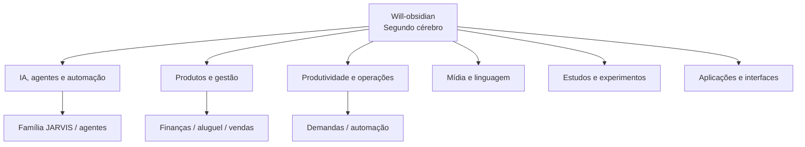
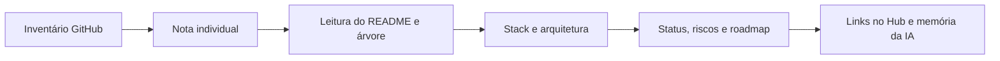

# Mapa Cognitivo Completo dos Repositórios

> Documento gerado a partir dos **80 repositórios atuais** da conta GitHub em 2026-07-13.
> Metadados objetivos vêm do GitHub. Qualquer interpretação marcada como **inferida** não deve ser tratada como fato sem inspeção do código.

## Como a IA deve usar este mapa

1. Use o nome, link, visibilidade, branch e tamanho como fatos de identificação.
2. Use a categoria como uma hipótese de domínio.
3. Não invente stack, funcionalidades, status ou relação entre projetos quando o GitHub não fornecer esses dados.
4. Para responder sobre um projeto, consulte primeiro esta nota, depois a nota individual do projeto e, por fim, o repositório.
5. Registre novas evidências em notas individuais, mantendo este mapa como índice.

## Visão geral

- **Total:** 80 repositórios.
- **Branch padrão:** registrada individualmente abaixo; a maioria usa `main`, alguns usam `master`, `devops` ou `canary`.
- **Projetos centrais inferidos:** famílias JARVIS/IA, gerenciadores financeiros e de aluguel, automações de demandas, ferramentas de mídia/linguagem e estudos.
- **Padrão técnico observado pelos nomes:** interesse recorrente em IA local, agentes, voz, visão, automação, sistemas web, finanças, aluguel, produtividade e experimentação.

## Relações cognitivas entre projetos

- **Família de IA:** JARVIS, DeepSeek, agentes, AUTOBOT, CAINE, Hermes, OpenClaude, Ruflo, IA.IDE e projetos relacionados.
- **Família de produtos:** Gerenciadores financeiros, WILLFINANCE, WilletHub, Gestor_Aluguel, rentai-manager, vendas e boletos.
- **Família operacional:** demandas organizadas, WebFlash, Bitrix, busca e movimentação de arquivos.
- **Família de linguagem/mídia:** transcrição, tradução, áudio, música, leitor de tela e conversão de arquivos.
- **Família acadêmica:** TCCs, atividades, estudos de LLMs, Deep Learning e testes.
- **Legado e experimentos:** CRUDs, forks, protótipos, sandboxes e repositórios sem descrição.

## Fluxo recomendado de enriquecimento

## Modelo de nota individual recomendado

Cada projeto relevante deve ganhar uma nota em `03-Projetos/01-Ativos/Privados/` contendo:

- identidade e propósito;
- problema que resolve;
- usuários e contexto;
- stack confirmada;
- arquitetura e fluxo de dados;
- comandos de execução;
- dependências e integrações;
- estado atual e último commit;
- riscos, vulnerabilidades e dívidas;
- decisões e alternativas rejeitadas;
- roadmap e próximos passos;
- relação com outros projetos;
- perguntas em aberto;
- evidências com links para arquivos e commits.

## Produtos, finanças, vendas e gestão

**Quantidade:** 9

### [[Domni]] — Domni

- **GitHub:** [William-kelvem94/Domni](https://github.com/William-kelvem94/Domni)
- **Visibilidade:** private
- **Branch padrão:** `main`
- **Tamanho informado pelo GitHub:** 23820 KB
- **Arquivado:** não
- **Descrição oficial:** não informada no GitHub
- **Linguagem oficial:** não informada no GitHub
- **Interpretação operacional (inferida pelo nome):** Projeto de produto ou gestão financeira, comercial, aluguel ou operação; confirmar domínio e estágio no código.
- **Estado de conhecimento no Obsidian:** inventário sincronizado; análise de stack, arquitetura, dependências e roadmap ainda precisa ser confirmada diretamente no conteúdo do repositório.
- **Perguntas para a IA:** qual problema resolve? qual stack real? quais entradas/saídas? está ativo, pausado, legado ou substituído? quais projetos se relacionam?

### [[CRUD_VENDAS_WILL]] — CRUD_VENDAS_WILL

- **GitHub:** [William-kelvem94/CRUD_VENDAS_WILL](https://github.com/William-kelvem94/CRUD_VENDAS_WILL)
- **Visibilidade:** private
- **Branch padrão:** `main`
- **Tamanho informado pelo GitHub:** 73 KB
- **Arquivado:** não
- **Descrição oficial:** não informada no GitHub
- **Linguagem oficial:** não informada no GitHub
- **Interpretação operacional (inferida pelo nome):** Projeto de produto ou gestão financeira, comercial, aluguel ou operação; confirmar domínio e estágio no código.
- **Estado de conhecimento no Obsidian:** inventário sincronizado; análise de stack, arquitetura, dependências e roadmap ainda precisa ser confirmada diretamente no conteúdo do repositório.
- **Perguntas para a IA:** qual problema resolve? qual stack real? quais entradas/saídas? está ativo, pausado, legado ou substituído? quais projetos se relacionam?

### [[Dev.Finances]] — Dev.Finances

- **GitHub:** [William-kelvem94/Dev.Finances](https://github.com/William-kelvem94/Dev.Finances)
- **Visibilidade:** private
- **Branch padrão:** `main`
- **Tamanho informado pelo GitHub:** 681 KB
- **Arquivado:** não
- **Descrição oficial:** não informada no GitHub
- **Linguagem oficial:** não informada no GitHub
- **Interpretação operacional (inferida pelo nome):** Projeto de produto ou gestão financeira, comercial, aluguel ou operação; confirmar domínio e estágio no código.
- **Estado de conhecimento no Obsidian:** inventário sincronizado; análise de stack, arquitetura, dependências e roadmap ainda precisa ser confirmada diretamente no conteúdo do repositório.
- **Perguntas para a IA:** qual problema resolve? qual stack real? quais entradas/saídas? está ativo, pausado, legado ou substituído? quais projetos se relacionam?

### [[Gestor_Aluguel]] — Gestor_Aluguel

- **GitHub:** [William-kelvem94/Gestor_Aluguel](https://github.com/William-kelvem94/Gestor_Aluguel)
- **Visibilidade:** private
- **Branch padrão:** `main`
- **Tamanho informado pelo GitHub:** 100887 KB
- **Arquivado:** não
- **Descrição oficial:** não informada no GitHub
- **Linguagem oficial:** não informada no GitHub
- **Interpretação operacional (inferida pelo nome):** Projeto de produto ou gestão financeira, comercial, aluguel ou operação; confirmar domínio e estágio no código.
- **Estado de conhecimento no Obsidian:** inventário sincronizado; análise de stack, arquitetura, dependências e roadmap ainda precisa ser confirmada diretamente no conteúdo do repositório.
- **Perguntas para a IA:** qual problema resolve? qual stack real? quais entradas/saídas? está ativo, pausado, legado ou substituído? quais projetos se relacionam?

### [[WILLFINANCE-9.0]] — WILLFINANCE-9.0

- **GitHub:** [William-kelvem94/WILLFINANCE-9.0](https://github.com/William-kelvem94/WILLFINANCE-9.0)
- **Visibilidade:** private
- **Branch padrão:** `main`
- **Tamanho informado pelo GitHub:** 170 KB
- **Arquivado:** não
- **Descrição oficial:** não informada no GitHub
- **Linguagem oficial:** não informada no GitHub
- **Interpretação operacional (inferida pelo nome):** Projeto de produto ou gestão financeira, comercial, aluguel ou operação; confirmar domínio e estágio no código.
- **Estado de conhecimento no Obsidian:** inventário sincronizado; análise de stack, arquitetura, dependências e roadmap ainda precisa ser confirmada diretamente no conteúdo do repositório.
- **Perguntas para a IA:** qual problema resolve? qual stack real? quais entradas/saídas? está ativo, pausado, legado ou substituído? quais projetos se relacionam?

### [[rentai-manager]] — rentai-manager

- **GitHub:** [William-kelvem94/rentai-manager](https://github.com/William-kelvem94/rentai-manager)
- **Visibilidade:** private
- **Branch padrão:** `main`
- **Tamanho informado pelo GitHub:** 214 KB
- **Arquivado:** não
- **Descrição oficial:** não informada no GitHub
- **Linguagem oficial:** não informada no GitHub
- **Interpretação operacional (inferida pelo nome):** Projeto de produto ou gestão financeira, comercial, aluguel ou operação; confirmar domínio e estágio no código.
- **Estado de conhecimento no Obsidian:** inventário sincronizado; análise de stack, arquitetura, dependências e roadmap ainda precisa ser confirmada diretamente no conteúdo do repositório.
- **Perguntas para a IA:** qual problema resolve? qual stack real? quais entradas/saídas? está ativo, pausado, legado ou substituído? quais projetos se relacionam?

### [[willethub-legacy]] — willethub-legacy

- **GitHub:** [William-kelvem94/willethub-legacy](https://github.com/William-kelvem94/willethub-legacy)
- **Visibilidade:** private
- **Branch padrão:** `main`
- **Tamanho informado pelo GitHub:** 1104 KB
- **Arquivado:** não
- **Descrição oficial:** não informada no GitHub
- **Linguagem oficial:** não informada no GitHub
- **Interpretação operacional (inferida pelo nome):** Projeto de produto ou gestão financeira, comercial, aluguel ou operação; confirmar domínio e estágio no código.
- **Estado de conhecimento no Obsidian:** inventário sincronizado; análise de stack, arquitetura, dependências e roadmap ainda precisa ser confirmada diretamente no conteúdo do repositório.
- **Perguntas para a IA:** qual problema resolve? qual stack real? quais entradas/saídas? está ativo, pausado, legado ou substituído? quais projetos se relacionam?

### [[WilletHub]] — WilletHub

- **GitHub:** [William-kelvem94/WilletHub](https://github.com/William-kelvem94/WilletHub)
- **Visibilidade:** private
- **Branch padrão:** `main`
- **Tamanho informado pelo GitHub:** 58 KB
- **Arquivado:** não
- **Descrição oficial:** não informada no GitHub
- **Linguagem oficial:** não informada no GitHub
- **Interpretação operacional (inferida pelo nome):** Projeto de produto ou gestão financeira, comercial, aluguel ou operação; confirmar domínio e estágio no código.
- **Estado de conhecimento no Obsidian:** inventário sincronizado; análise de stack, arquitetura, dependências e roadmap ainda precisa ser confirmada diretamente no conteúdo do repositório.
- **Perguntas para a IA:** qual problema resolve? qual stack real? quais entradas/saídas? está ativo, pausado, legado ou substituído? quais projetos se relacionam?

### [[Auto-boletos]] — Auto-boletos

- **GitHub:** [William-kelvem94/Auto-boletos](https://github.com/William-kelvem94/Auto-boletos)
- **Visibilidade:** private
- **Branch padrão:** `main`
- **Tamanho informado pelo GitHub:** 342 KB
- **Arquivado:** não
- **Descrição oficial:** não informada no GitHub
- **Linguagem oficial:** não informada no GitHub
- **Interpretação operacional (inferida pelo nome):** Projeto de produto ou gestão financeira, comercial, aluguel ou operação; confirmar domínio e estágio no código.
- **Estado de conhecimento no Obsidian:** inventário sincronizado; análise de stack, arquitetura, dependências e roadmap ainda precisa ser confirmada diretamente no conteúdo do repositório.
- **Perguntas para a IA:** qual problema resolve? qual stack real? quais entradas/saídas? está ativo, pausado, legado ou substituído? quais projetos se relacionam?

## IA, agentes e automação

**Quantidade:** 35

### [[Gerenciador_Financeiro-5.0]] — Gerenciador_Financeiro-5.0

- **GitHub:** [William-kelvem94/Gerenciador_Financeiro-5.0](https://github.com/William-kelvem94/Gerenciador_Financeiro-5.0)
- **Visibilidade:** private
- **Branch padrão:** `main`
- **Tamanho informado pelo GitHub:** 333445 KB
- **Arquivado:** não
- **Descrição oficial:** não informada no GitHub
- **Linguagem oficial:** não informada no GitHub
- **Interpretação operacional (inferida pelo nome):** Projeto relacionado a inteligência artificial, agente, assistente ou automação; confirmar escopo no código.
- **Estado de conhecimento no Obsidian:** inventário sincronizado; análise de stack, arquitetura, dependências e roadmap ainda precisa ser confirmada diretamente no conteúdo do repositório.
- **Perguntas para a IA:** qual problema resolve? qual stack real? quais entradas/saídas? está ativo, pausado, legado ou substituído? quais projetos se relacionam?

### [[Gerenciador_Financeiro-6.0]] — Gerenciador_Financeiro-6.0

- **GitHub:** [William-kelvem94/Gerenciador_Financeiro-6.0](https://github.com/William-kelvem94/Gerenciador_Financeiro-6.0)
- **Visibilidade:** private
- **Branch padrão:** `devops`
- **Tamanho informado pelo GitHub:** 201 KB
- **Arquivado:** não
- **Descrição oficial:** não informada no GitHub
- **Linguagem oficial:** não informada no GitHub
- **Interpretação operacional (inferida pelo nome):** Projeto relacionado a inteligência artificial, agente, assistente ou automação; confirmar escopo no código.
- **Estado de conhecimento no Obsidian:** inventário sincronizado; análise de stack, arquitetura, dependências e roadmap ainda precisa ser confirmada diretamente no conteúdo do repositório.
- **Perguntas para a IA:** qual problema resolve? qual stack real? quais entradas/saídas? está ativo, pausado, legado ou substituído? quais projetos se relacionam?

### [[DEEPSEEK-JARVIS-LOCAL]] — DEEPSEEK-JARVIS-LOCAL

- **GitHub:** [William-kelvem94/DEEPSEEK-JARVIS-LOCAL](https://github.com/William-kelvem94/DEEPSEEK-JARVIS-LOCAL)
- **Visibilidade:** private
- **Branch padrão:** `main`
- **Tamanho informado pelo GitHub:** 609 KB
- **Arquivado:** não
- **Descrição oficial:** não informada no GitHub
- **Linguagem oficial:** não informada no GitHub
- **Interpretação operacional (inferida pelo nome):** Projeto relacionado a inteligência artificial, agente, assistente ou automação; confirmar escopo no código.
- **Estado de conhecimento no Obsidian:** inventário sincronizado; análise de stack, arquitetura, dependências e roadmap ainda precisa ser confirmada diretamente no conteúdo do repositório.
- **Perguntas para a IA:** qual problema resolve? qual stack real? quais entradas/saídas? está ativo, pausado, legado ou substituído? quais projetos se relacionam?

### [[webflash-intermediador-de-demandas]] — webflash-intermediador-de-demandas

- **GitHub:** [William-kelvem94/webflash-intermediador-de-demandas](https://github.com/William-kelvem94/webflash-intermediador-de-demandas)
- **Visibilidade:** private
- **Branch padrão:** `main`
- **Tamanho informado pelo GitHub:** 19317 KB
- **Arquivado:** não
- **Descrição oficial:** não informada no GitHub
- **Linguagem oficial:** não informada no GitHub
- **Interpretação operacional (inferida pelo nome):** Projeto relacionado a inteligência artificial, agente, assistente ou automação; confirmar escopo no código.
- **Estado de conhecimento no Obsidian:** inventário sincronizado; análise de stack, arquitetura, dependências e roadmap ainda precisa ser confirmada diretamente no conteúdo do repositório.
- **Perguntas para a IA:** qual problema resolve? qual stack real? quais entradas/saídas? está ativo, pausado, legado ou substituído? quais projetos se relacionam?

### [[hermes-agent-pinokio-wk]] — hermes-agent-pinokio-wk

- **GitHub:** [William-kelvem94/hermes-agent-pinokio-wk](https://github.com/William-kelvem94/hermes-agent-pinokio-wk)
- **Visibilidade:** private
- **Branch padrão:** `main`
- **Tamanho informado pelo GitHub:** 0 KB
- **Arquivado:** não
- **Descrição oficial:** não informada no GitHub
- **Linguagem oficial:** não informada no GitHub
- **Interpretação operacional (inferida pelo nome):** Projeto relacionado a inteligência artificial, agente, assistente ou automação; confirmar escopo no código.
- **Estado de conhecimento no Obsidian:** inventário sincronizado; análise de stack, arquitetura, dependências e roadmap ainda precisa ser confirmada diretamente no conteúdo do repositório.
- **Perguntas para a IA:** qual problema resolve? qual stack real? quais entradas/saídas? está ativo, pausado, legado ou substituído? quais projetos se relacionam?

### [[openclaude-wk]] — openclaude-wk

- **GitHub:** [William-kelvem94/openclaude-wk](https://github.com/William-kelvem94/openclaude-wk)
- **Visibilidade:** public
- **Branch padrão:** `main`
- **Tamanho informado pelo GitHub:** 29772 KB
- **Arquivado:** não
- **Descrição oficial:** não informada no GitHub
- **Linguagem oficial:** não informada no GitHub
- **Interpretação operacional (inferida pelo nome):** Projeto relacionado a inteligência artificial, agente, assistente ou automação; confirmar escopo no código.
- **Estado de conhecimento no Obsidian:** inventário sincronizado; análise de stack, arquitetura, dependências e roadmap ainda precisa ser confirmada diretamente no conteúdo do repositório.
- **Perguntas para a IA:** qual problema resolve? qual stack real? quais entradas/saídas? está ativo, pausado, legado ou substituído? quais projetos se relacionam?

### [[IA-POTENTE]] — IA-POTENTE

- **GitHub:** [William-kelvem94/IA-POTENTE](https://github.com/William-kelvem94/IA-POTENTE)
- **Visibilidade:** private
- **Branch padrão:** `main`
- **Tamanho informado pelo GitHub:** 4207 KB
- **Arquivado:** não
- **Descrição oficial:** não informada no GitHub
- **Linguagem oficial:** não informada no GitHub
- **Interpretação operacional (inferida pelo nome):** Projeto relacionado a inteligência artificial, agente, assistente ou automação; confirmar escopo no código.
- **Estado de conhecimento no Obsidian:** inventário sincronizado; análise de stack, arquitetura, dependências e roadmap ainda precisa ser confirmada diretamente no conteúdo do repositório.
- **Perguntas para a IA:** qual problema resolve? qual stack real? quais entradas/saídas? está ativo, pausado, legado ou substituído? quais projetos se relacionam?

### [[pixel-agents]] — pixel-agents

- **GitHub:** [William-kelvem94/pixel-agents](https://github.com/William-kelvem94/pixel-agents)
- **Visibilidade:** public
- **Branch padrão:** `main`
- **Tamanho informado pelo GitHub:** 1402 KB
- **Arquivado:** não
- **Descrição oficial:** não informada no GitHub
- **Linguagem oficial:** não informada no GitHub
- **Interpretação operacional (inferida pelo nome):** Projeto relacionado a inteligência artificial, agente, assistente ou automação; confirmar escopo no código.
- **Estado de conhecimento no Obsidian:** inventário sincronizado; análise de stack, arquitetura, dependências e roadmap ainda precisa ser confirmada diretamente no conteúdo do repositório.
- **Perguntas para a IA:** qual problema resolve? qual stack real? quais entradas/saídas? está ativo, pausado, legado ou substituído? quais projetos se relacionam?

### [[NEXUS-VENDAS]] — NEXUS-VENDAS

- **GitHub:** [William-kelvem94/NEXUS-VENDAS](https://github.com/William-kelvem94/NEXUS-VENDAS)
- **Visibilidade:** private
- **Branch padrão:** `main`
- **Tamanho informado pelo GitHub:** 392 KB
- **Arquivado:** não
- **Descrição oficial:** não informada no GitHub
- **Linguagem oficial:** não informada no GitHub
- **Interpretação operacional (inferida pelo nome):** Projeto de produto ou gestão financeira, comercial, aluguel ou operação; confirmar domínio e estágio no código.
- **Estado de conhecimento no Obsidian:** inventário sincronizado; análise de stack, arquitetura, dependências e roadmap ainda precisa ser confirmada diretamente no conteúdo do repositório.
- **Perguntas para a IA:** qual problema resolve? qual stack real? quais entradas/saídas? está ativo, pausado, legado ou substituído? quais projetos se relacionam?

### [[PROJECT-JARVIS]] — PROJECT-JARVIS

- **GitHub:** [William-kelvem94/PROJECT-JARVIS](https://github.com/William-kelvem94/PROJECT-JARVIS)
- **Visibilidade:** private
- **Branch padrão:** `main`
- **Tamanho informado pelo GitHub:** 107039 KB
- **Arquivado:** não
- **Descrição oficial:** não informada no GitHub
- **Linguagem oficial:** não informada no GitHub
- **Interpretação operacional (inferida pelo nome):** Projeto relacionado a inteligência artificial, agente, assistente ou automação; confirmar escopo no código.
- **Estado de conhecimento no Obsidian:** inventário sincronizado; análise de stack, arquitetura, dependências e roadmap ainda precisa ser confirmada diretamente no conteúdo do repositório.
- **Perguntas para a IA:** qual problema resolve? qual stack real? quais entradas/saídas? está ativo, pausado, legado ou substituído? quais projetos se relacionam?

### [[William-kelvem94]] — William-kelvem94

- **GitHub:** [William-kelvem94/William-kelvem94](https://github.com/William-kelvem94/William-kelvem94)
- **Visibilidade:** public
- **Branch padrão:** `main`
- **Tamanho informado pelo GitHub:** 2 KB
- **Arquivado:** não
- **Descrição oficial:** não informada no GitHub
- **Linguagem oficial:** não informada no GitHub
- **Interpretação operacional (inferida pelo nome):** Projeto relacionado a inteligência artificial, agente, assistente ou automação; confirmar escopo no código.
- **Estado de conhecimento no Obsidian:** inventário sincronizado; análise de stack, arquitetura, dependências e roadmap ainda precisa ser confirmada diretamente no conteúdo do repositório.
- **Perguntas para a IA:** qual problema resolve? qual stack real? quais entradas/saídas? está ativo, pausado, legado ou substituído? quais projetos se relacionam?

### [[Empresa-de-Agentes]] — Empresa-de-Agentes

- **GitHub:** [William-kelvem94/Empresa-de-Agentes](https://github.com/William-kelvem94/Empresa-de-Agentes)
- **Visibilidade:** private
- **Branch padrão:** `main`
- **Tamanho informado pelo GitHub:** 3262 KB
- **Arquivado:** não
- **Descrição oficial:** não informada no GitHub
- **Linguagem oficial:** não informada no GitHub
- **Interpretação operacional (inferida pelo nome):** Projeto relacionado a inteligência artificial, agente, assistente ou automação; confirmar escopo no código.
- **Estado de conhecimento no Obsidian:** inventário sincronizado; análise de stack, arquitetura, dependências e roadmap ainda precisa ser confirmada diretamente no conteúdo do repositório.
- **Perguntas para a IA:** qual problema resolve? qual stack real? quais entradas/saídas? está ativo, pausado, legado ou substituído? quais projetos se relacionam?

### [[Criador_de_audios]] — Criador_de_audios

- **GitHub:** [William-kelvem94/Criador_de_audios](https://github.com/William-kelvem94/Criador_de_audios)
- **Visibilidade:** private
- **Branch padrão:** `main`
- **Tamanho informado pelo GitHub:** 17372 KB
- **Arquivado:** não
- **Descrição oficial:** não informada no GitHub
- **Linguagem oficial:** não informada no GitHub
- **Interpretação operacional (inferida pelo nome):** Projeto relacionado a inteligência artificial, agente, assistente ou automação; confirmar escopo no código.
- **Estado de conhecimento no Obsidian:** inventário sincronizado; análise de stack, arquitetura, dependências e roadmap ainda precisa ser confirmada diretamente no conteúdo do repositório.
- **Perguntas para a IA:** qual problema resolve? qual stack real? quais entradas/saídas? está ativo, pausado, legado ou substituído? quais projetos se relacionam?

### [[PROJECT_JARVIS_3.0]] — PROJECT_JARVIS_3.0

- **GitHub:** [William-kelvem94/PROJECT_JARVIS_3.0](https://github.com/William-kelvem94/PROJECT_JARVIS_3.0)
- **Visibilidade:** private
- **Branch padrão:** `main`
- **Tamanho informado pelo GitHub:** 27800 KB
- **Arquivado:** não
- **Descrição oficial:** não informada no GitHub
- **Linguagem oficial:** não informada no GitHub
- **Interpretação operacional (inferida pelo nome):** Projeto relacionado a inteligência artificial, agente, assistente ou automação; confirmar escopo no código.
- **Estado de conhecimento no Obsidian:** inventário sincronizado; análise de stack, arquitetura, dependências e roadmap ainda precisa ser confirmada diretamente no conteúdo do repositório.
- **Perguntas para a IA:** qual problema resolve? qual stack real? quais entradas/saídas? está ativo, pausado, legado ou substituído? quais projetos se relacionam?

### [[Personal-Voice-Assistent]] — Personal-Voice-Assistent

- **GitHub:** [William-kelvem94/Personal-Voice-Assistent](https://github.com/William-kelvem94/Personal-Voice-Assistent)
- **Visibilidade:** private
- **Branch padrão:** `main`
- **Tamanho informado pelo GitHub:** 904 KB
- **Arquivado:** não
- **Descrição oficial:** não informada no GitHub
- **Linguagem oficial:** não informada no GitHub
- **Interpretação operacional (inferida pelo nome):** Repositório de aplicação, interface, fork, legado ou experimento; escopo precisa ser confirmado.
- **Estado de conhecimento no Obsidian:** inventário sincronizado; análise de stack, arquitetura, dependências e roadmap ainda precisa ser confirmada diretamente no conteúdo do repositório.
- **Perguntas para a IA:** qual problema resolve? qual stack real? quais entradas/saídas? está ativo, pausado, legado ou substituído? quais projetos se relacionam?

### [[AUTOBOT]] — AUTOBOT

- **GitHub:** [William-kelvem94/AUTOBOT](https://github.com/William-kelvem94/AUTOBOT)
- **Visibilidade:** private
- **Branch padrão:** `main`
- **Tamanho informado pelo GitHub:** 149930 KB
- **Arquivado:** não
- **Descrição oficial:** não informada no GitHub
- **Linguagem oficial:** não informada no GitHub
- **Interpretação operacional (inferida pelo nome):** Projeto relacionado a inteligência artificial, agente, assistente ou automação; confirmar escopo no código.
- **Estado de conhecimento no Obsidian:** inventário sincronizado; análise de stack, arquitetura, dependências e roadmap ainda precisa ser confirmada diretamente no conteúdo do repositório.
- **Perguntas para a IA:** qual problema resolve? qual stack real? quais entradas/saídas? está ativo, pausado, legado ou substituído? quais projetos se relacionam?

### [[DIA-DAS-MULHERES]] — DIA-DAS-MULHERES

- **GitHub:** [William-kelvem94/DIA-DAS-MULHERES](https://github.com/William-kelvem94/DIA-DAS-MULHERES)
- **Visibilidade:** private
- **Branch padrão:** `main`
- **Tamanho informado pelo GitHub:** 62388 KB
- **Arquivado:** não
- **Descrição oficial:** não informada no GitHub
- **Linguagem oficial:** não informada no GitHub
- **Interpretação operacional (inferida pelo nome):** Projeto relacionado a inteligência artificial, agente, assistente ou automação; confirmar escopo no código.
- **Estado de conhecimento no Obsidian:** inventário sincronizado; análise de stack, arquitetura, dependências e roadmap ainda precisa ser confirmada diretamente no conteúdo do repositório.
- **Perguntas para a IA:** qual problema resolve? qual stack real? quais entradas/saídas? está ativo, pausado, legado ou substituído? quais projetos se relacionam?

### [[ruflo]] — ruflo

- **GitHub:** [William-kelvem94/ruflo](https://github.com/William-kelvem94/ruflo)
- **Visibilidade:** public
- **Branch padrão:** `main`
- **Tamanho informado pelo GitHub:** 527530 KB
- **Arquivado:** não
- **Descrição oficial:** não informada no GitHub
- **Linguagem oficial:** não informada no GitHub
- **Interpretação operacional (inferida pelo nome):** Projeto relacionado a inteligência artificial, agente, assistente ou automação; confirmar escopo no código.
- **Estado de conhecimento no Obsidian:** inventário sincronizado; análise de stack, arquitetura, dependências e roadmap ainda precisa ser confirmada diretamente no conteúdo do repositório.
- **Perguntas para a IA:** qual problema resolve? qual stack real? quais entradas/saídas? está ativo, pausado, legado ou substituído? quais projetos se relacionam?

### [[PROJECT_JARVIS_5.0]] — PROJECT_JARVIS_5.0

- **GitHub:** [William-kelvem94/PROJECT_JARVIS_5.0](https://github.com/William-kelvem94/PROJECT_JARVIS_5.0)
- **Visibilidade:** private
- **Branch padrão:** `main`
- **Tamanho informado pelo GitHub:** 583716 KB
- **Arquivado:** não
- **Descrição oficial:** não informada no GitHub
- **Linguagem oficial:** não informada no GitHub
- **Interpretação operacional (inferida pelo nome):** Projeto relacionado a inteligência artificial, agente, assistente ou automação; confirmar escopo no código.
- **Estado de conhecimento no Obsidian:** inventário sincronizado; análise de stack, arquitetura, dependências e roadmap ainda precisa ser confirmada diretamente no conteúdo do repositório.
- **Perguntas para a IA:** qual problema resolve? qual stack real? quais entradas/saídas? está ativo, pausado, legado ou substituído? quais projetos se relacionam?

### [[IA.IDE]] — IA.IDE

- **GitHub:** [William-kelvem94/IA.IDE](https://github.com/William-kelvem94/IA.IDE)
- **Visibilidade:** private
- **Branch padrão:** `main`
- **Tamanho informado pelo GitHub:** 104 KB
- **Arquivado:** não
- **Descrição oficial:** não informada no GitHub
- **Linguagem oficial:** não informada no GitHub
- **Interpretação operacional (inferida pelo nome):** Projeto relacionado a inteligência artificial, agente, assistente ou automação; confirmar escopo no código.
- **Estado de conhecimento no Obsidian:** inventário sincronizado; análise de stack, arquitetura, dependências e roadmap ainda precisa ser confirmada diretamente no conteúdo do repositório.
- **Perguntas para a IA:** qual problema resolve? qual stack real? quais entradas/saídas? está ativo, pausado, legado ou substituído? quais projetos se relacionam?

### [[AGENTE-IA]] — AGENTE-IA

- **GitHub:** [William-kelvem94/AGENTE-IA](https://github.com/William-kelvem94/AGENTE-IA)
- **Visibilidade:** private
- **Branch padrão:** `main`
- **Tamanho informado pelo GitHub:** 242 KB
- **Arquivado:** não
- **Descrição oficial:** não informada no GitHub
- **Linguagem oficial:** não informada no GitHub
- **Interpretação operacional (inferida pelo nome):** Projeto relacionado a inteligência artificial, agente, assistente ou automação; confirmar escopo no código.
- **Estado de conhecimento no Obsidian:** inventário sincronizado; análise de stack, arquitetura, dependências e roadmap ainda precisa ser confirmada diretamente no conteúdo do repositório.
- **Perguntas para a IA:** qual problema resolve? qual stack real? quais entradas/saídas? está ativo, pausado, legado ou substituído? quais projetos se relacionam?

### [[Will-obsidian]] — Will-obsidian

- **GitHub:** [William-kelvem94/Will-obsidian](https://github.com/William-kelvem94/Will-obsidian)
- **Visibilidade:** public
- **Branch padrão:** `main`
- **Tamanho informado pelo GitHub:** 28331 KB
- **Arquivado:** não
- **Descrição oficial:** não informada no GitHub
- **Linguagem oficial:** não informada no GitHub
- **Interpretação operacional (inferida pelo nome):** Projeto relacionado a inteligência artificial, agente, assistente ou automação; confirmar escopo no código.
- **Estado de conhecimento no Obsidian:** inventário sincronizado; análise de stack, arquitetura, dependências e roadmap ainda precisa ser confirmada diretamente no conteúdo do repositório.
- **Perguntas para a IA:** qual problema resolve? qual stack real? quais entradas/saídas? está ativo, pausado, legado ou substituído? quais projetos se relacionam?

### [[Gerenciador_Financeiro-4.0]] — Gerenciador_Financeiro-4.0

- **GitHub:** [William-kelvem94/Gerenciador_Financeiro-4.0](https://github.com/William-kelvem94/Gerenciador_Financeiro-4.0)
- **Visibilidade:** private
- **Branch padrão:** `main`
- **Tamanho informado pelo GitHub:** 816 KB
- **Arquivado:** não
- **Descrição oficial:** não informada no GitHub
- **Linguagem oficial:** não informada no GitHub
- **Interpretação operacional (inferida pelo nome):** Projeto relacionado a inteligência artificial, agente, assistente ou automação; confirmar escopo no código.
- **Estado de conhecimento no Obsidian:** inventário sincronizado; análise de stack, arquitetura, dependências e roadmap ainda precisa ser confirmada diretamente no conteúdo do repositório.
- **Perguntas para a IA:** qual problema resolve? qual stack real? quais entradas/saídas? está ativo, pausado, legado ou substituído? quais projetos se relacionam?

### [[IA_MUSIC]] — IA_MUSIC

- **GitHub:** [William-kelvem94/IA_MUSIC](https://github.com/William-kelvem94/IA_MUSIC)
- **Visibilidade:** private
- **Branch padrão:** `main`
- **Tamanho informado pelo GitHub:** 8260 KB
- **Arquivado:** não
- **Descrição oficial:** não informada no GitHub
- **Linguagem oficial:** não informada no GitHub
- **Interpretação operacional (inferida pelo nome):** Projeto relacionado a inteligência artificial, agente, assistente ou automação; confirmar escopo no código.
- **Estado de conhecimento no Obsidian:** inventário sincronizado; análise de stack, arquitetura, dependências e roadmap ainda precisa ser confirmada diretamente no conteúdo do repositório.
- **Perguntas para a IA:** qual problema resolve? qual stack real? quais entradas/saídas? está ativo, pausado, legado ou substituído? quais projetos se relacionam?

### [[STUDY_LLMS]] — STUDY_LLMS

- **GitHub:** [William-kelvem94/STUDY_LLMS](https://github.com/William-kelvem94/STUDY_LLMS)
- **Visibilidade:** private
- **Branch padrão:** `main`
- **Tamanho informado pelo GitHub:** 32382 KB
- **Arquivado:** não
- **Descrição oficial:** não informada no GitHub
- **Linguagem oficial:** não informada no GitHub
- **Interpretação operacional (inferida pelo nome):** Projeto acadêmico, estudo, protótipo ou validação.
- **Estado de conhecimento no Obsidian:** inventário sincronizado; análise de stack, arquitetura, dependências e roadmap ainda precisa ser confirmada diretamente no conteúdo do repositório.
- **Perguntas para a IA:** qual problema resolve? qual stack real? quais entradas/saídas? está ativo, pausado, legado ou substituído? quais projetos se relacionam?

### [[hermes-agent-pinokio]] — hermes-agent-pinokio

- **GitHub:** [William-kelvem94/hermes-agent-pinokio](https://github.com/William-kelvem94/hermes-agent-pinokio)
- **Visibilidade:** private
- **Branch padrão:** `main`
- **Tamanho informado pelo GitHub:** 92169 KB
- **Arquivado:** não
- **Descrição oficial:** não informada no GitHub
- **Linguagem oficial:** não informada no GitHub
- **Interpretação operacional (inferida pelo nome):** Projeto relacionado a inteligência artificial, agente, assistente ou automação; confirmar escopo no código.
- **Estado de conhecimento no Obsidian:** inventário sincronizado; análise de stack, arquitetura, dependências e roadmap ainda precisa ser confirmada diretamente no conteúdo do repositório.
- **Perguntas para a IA:** qual problema resolve? qual stack real? quais entradas/saídas? está ativo, pausado, legado ou substituído? quais projetos se relacionam?

### [[C.A.I.N.E]] — C.A.I.N.E

- **GitHub:** [William-kelvem94/C.A.I.N.E](https://github.com/William-kelvem94/C.A.I.N.E)
- **Visibilidade:** private
- **Branch padrão:** `main`
- **Tamanho informado pelo GitHub:** 366 KB
- **Arquivado:** não
- **Descrição oficial:** não informada no GitHub
- **Linguagem oficial:** não informada no GitHub
- **Interpretação operacional (inferida pelo nome):** Projeto relacionado a inteligência artificial, agente, assistente ou automação; confirmar escopo no código.
- **Estado de conhecimento no Obsidian:** inventário sincronizado; análise de stack, arquitetura, dependências e roadmap ainda precisa ser confirmada diretamente no conteúdo do repositório.
- **Perguntas para a IA:** qual problema resolve? qual stack real? quais entradas/saídas? está ativo, pausado, legado ou substituído? quais projetos se relacionam?

### [[CLONNER]] — CLONNER

- **GitHub:** [William-kelvem94/CLONNER](https://github.com/William-kelvem94/CLONNER)
- **Visibilidade:** private
- **Branch padrão:** `main`
- **Tamanho informado pelo GitHub:** 26654 KB
- **Arquivado:** não
- **Descrição oficial:** não informada no GitHub
- **Linguagem oficial:** não informada no GitHub
- **Interpretação operacional (inferida pelo nome):** Repositório de aplicação, interface, fork, legado ou experimento; escopo precisa ser confirmado.
- **Estado de conhecimento no Obsidian:** inventário sincronizado; análise de stack, arquitetura, dependências e roadmap ainda precisa ser confirmada diretamente no conteúdo do repositório.
- **Perguntas para a IA:** qual problema resolve? qual stack real? quais entradas/saídas? está ativo, pausado, legado ou substituído? quais projetos se relacionam?

### [[Gerenciador_Financeiro-7.0]] — Gerenciador_Financeiro-7.0

- **GitHub:** [William-kelvem94/Gerenciador_Financeiro-7.0](https://github.com/William-kelvem94/Gerenciador_Financeiro-7.0)
- **Visibilidade:** private
- **Branch padrão:** `main`
- **Tamanho informado pelo GitHub:** 171419 KB
- **Arquivado:** não
- **Descrição oficial:** não informada no GitHub
- **Linguagem oficial:** não informada no GitHub
- **Interpretação operacional (inferida pelo nome):** Projeto relacionado a inteligência artificial, agente, assistente ou automação; confirmar escopo no código.
- **Estado de conhecimento no Obsidian:** inventário sincronizado; análise de stack, arquitetura, dependências e roadmap ainda precisa ser confirmada diretamente no conteúdo do repositório.
- **Perguntas para a IA:** qual problema resolve? qual stack real? quais entradas/saídas? está ativo, pausado, legado ou substituído? quais projetos se relacionam?

### [[extra-o-de-ideias]] — extra-o-de-ideias

- **GitHub:** [William-kelvem94/extra-o-de-ideias](https://github.com/William-kelvem94/extra-o-de-ideias)
- **Visibilidade:** private
- **Branch padrão:** `main`
- **Tamanho informado pelo GitHub:** 2449 KB
- **Arquivado:** não
- **Descrição oficial:** não informada no GitHub
- **Linguagem oficial:** não informada no GitHub
- **Interpretação operacional (inferida pelo nome):** Projeto relacionado a inteligência artificial, agente, assistente ou automação; confirmar escopo no código.
- **Estado de conhecimento no Obsidian:** inventário sincronizado; análise de stack, arquitetura, dependências e roadmap ainda precisa ser confirmada diretamente no conteúdo do repositório.
- **Perguntas para a IA:** qual problema resolve? qual stack real? quais entradas/saídas? está ativo, pausado, legado ou substituído? quais projetos se relacionam?

### [[MEU_NECTAR_JARVIS]] — MEU_NECTAR_JARVIS

- **GitHub:** [William-kelvem94/MEU_NECTAR_JARVIS](https://github.com/William-kelvem94/MEU_NECTAR_JARVIS)
- **Visibilidade:** private
- **Branch padrão:** `main`
- **Tamanho informado pelo GitHub:** 427 KB
- **Arquivado:** não
- **Descrição oficial:** não informada no GitHub
- **Linguagem oficial:** não informada no GitHub
- **Interpretação operacional (inferida pelo nome):** Projeto relacionado a inteligência artificial, agente, assistente ou automação; confirmar escopo no código.
- **Estado de conhecimento no Obsidian:** inventário sincronizado; análise de stack, arquitetura, dependências e roadmap ainda precisa ser confirmada diretamente no conteúdo do repositório.
- **Perguntas para a IA:** qual problema resolve? qual stack real? quais entradas/saídas? está ativo, pausado, legado ou substituído? quais projetos se relacionam?

### [[JARVIS-2.0]] — JARVIS-2.0

- **GitHub:** [William-kelvem94/JARVIS-2.0](https://github.com/William-kelvem94/JARVIS-2.0)
- **Visibilidade:** private
- **Branch padrão:** `main`
- **Tamanho informado pelo GitHub:** 7929 KB
- **Arquivado:** não
- **Descrição oficial:** não informada no GitHub
- **Linguagem oficial:** não informada no GitHub
- **Interpretação operacional (inferida pelo nome):** Projeto relacionado a inteligência artificial, agente, assistente ou automação; confirmar escopo no código.
- **Estado de conhecimento no Obsidian:** inventário sincronizado; análise de stack, arquitetura, dependências e roadmap ainda precisa ser confirmada diretamente no conteúdo do repositório.
- **Perguntas para a IA:** qual problema resolve? qual stack real? quais entradas/saídas? está ativo, pausado, legado ou substituído? quais projetos se relacionam?

### [[DeepSeek-V3---C-PIA]] — DeepSeek-V3---C-PIA

- **GitHub:** [William-kelvem94/DeepSeek-V3---C-PIA](https://github.com/William-kelvem94/DeepSeek-V3---C-PIA)
- **Visibilidade:** public
- **Branch padrão:** `main`
- **Tamanho informado pelo GitHub:** 1699 KB
- **Arquivado:** não
- **Descrição oficial:** não informada no GitHub
- **Linguagem oficial:** não informada no GitHub
- **Interpretação operacional (inferida pelo nome):** Projeto relacionado a inteligência artificial, agente, assistente ou automação; confirmar escopo no código.
- **Estado de conhecimento no Obsidian:** inventário sincronizado; análise de stack, arquitetura, dependências e roadmap ainda precisa ser confirmada diretamente no conteúdo do repositório.
- **Perguntas para a IA:** qual problema resolve? qual stack real? quais entradas/saídas? está ativo, pausado, legado ou substituído? quais projetos se relacionam?

### [[ada_v2---jarvis]] — ada_v2---jarvis

- **GitHub:** [William-kelvem94/ada_v2---jarvis](https://github.com/William-kelvem94/ada_v2---jarvis)
- **Visibilidade:** private
- **Branch padrão:** `main`
- **Tamanho informado pelo GitHub:** 0 KB
- **Arquivado:** não
- **Descrição oficial:** não informada no GitHub
- **Linguagem oficial:** não informada no GitHub
- **Interpretação operacional (inferida pelo nome):** Projeto relacionado a inteligência artificial, agente, assistente ou automação; confirmar escopo no código.
- **Estado de conhecimento no Obsidian:** inventário sincronizado; análise de stack, arquitetura, dependências e roadmap ainda precisa ser confirmada diretamente no conteúdo do repositório.
- **Perguntas para a IA:** qual problema resolve? qual stack real? quais entradas/saídas? está ativo, pausado, legado ou substituído? quais projetos se relacionam?

### [[slack-agent-template]] — slack-agent-template

- **GitHub:** [William-kelvem94/slack-agent-template](https://github.com/William-kelvem94/slack-agent-template)
- **Visibilidade:** private
- **Branch padrão:** `main`
- **Tamanho informado pelo GitHub:** 190 KB
- **Arquivado:** não
- **Descrição oficial:** não informada no GitHub
- **Linguagem oficial:** não informada no GitHub
- **Interpretação operacional (inferida pelo nome):** Projeto relacionado a inteligência artificial, agente, assistente ou automação; confirmar escopo no código.
- **Estado de conhecimento no Obsidian:** inventário sincronizado; análise de stack, arquitetura, dependências e roadmap ainda precisa ser confirmada diretamente no conteúdo do repositório.
- **Perguntas para a IA:** qual problema resolve? qual stack real? quais entradas/saídas? está ativo, pausado, legado ou substituído? quais projetos se relacionam?

## Estudos e experimentos

**Quantidade:** 9

### [[Atividade-03]] — Atividade-03

- **GitHub:** [William-kelvem94/Atividade-03](https://github.com/William-kelvem94/Atividade-03)
- **Visibilidade:** private
- **Branch padrão:** `main`
- **Tamanho informado pelo GitHub:** 11 KB
- **Arquivado:** não
- **Descrição oficial:** não informada no GitHub
- **Linguagem oficial:** não informada no GitHub
- **Interpretação operacional (inferida pelo nome):** Projeto acadêmico, estudo, protótipo ou validação.
- **Estado de conhecimento no Obsidian:** inventário sincronizado; análise de stack, arquitetura, dependências e roadmap ainda precisa ser confirmada diretamente no conteúdo do repositório.
- **Perguntas para a IA:** qual problema resolve? qual stack real? quais entradas/saídas? está ativo, pausado, legado ou substituído? quais projetos se relacionam?

### [[TESTER]] — TESTER

- **GitHub:** [William-kelvem94/TESTER](https://github.com/William-kelvem94/TESTER)
- **Visibilidade:** private
- **Branch padrão:** `main`
- **Tamanho informado pelo GitHub:** 67 KB
- **Arquivado:** não
- **Descrição oficial:** não informada no GitHub
- **Linguagem oficial:** não informada no GitHub
- **Interpretação operacional (inferida pelo nome):** Projeto acadêmico, estudo, protótipo ou validação.
- **Estado de conhecimento no Obsidian:** inventário sincronizado; análise de stack, arquitetura, dependências e roadmap ainda precisa ser confirmada diretamente no conteúdo do repositório.
- **Perguntas para a IA:** qual problema resolve? qual stack real? quais entradas/saídas? está ativo, pausado, legado ou substituído? quais projetos se relacionam?

### [[AULA_PROG_AVAN]] — AULA_PROG_AVAN

- **GitHub:** [William-kelvem94/AULA_PROG_AVAN](https://github.com/William-kelvem94/AULA_PROG_AVAN)
- **Visibilidade:** private
- **Branch padrão:** `main`
- **Tamanho informado pelo GitHub:** 0 KB
- **Arquivado:** não
- **Descrição oficial:** não informada no GitHub
- **Linguagem oficial:** não informada no GitHub
- **Interpretação operacional (inferida pelo nome):** Projeto acadêmico, estudo, protótipo ou validação.
- **Estado de conhecimento no Obsidian:** inventário sincronizado; análise de stack, arquitetura, dependências e roadmap ainda precisa ser confirmada diretamente no conteúdo do repositório.
- **Perguntas para a IA:** qual problema resolve? qual stack real? quais entradas/saídas? está ativo, pausado, legado ou substituído? quais projetos se relacionam?

### [[TCC_FINAL]] — TCC_FINAL

- **GitHub:** [William-kelvem94/TCC_FINAL](https://github.com/William-kelvem94/TCC_FINAL)
- **Visibilidade:** private
- **Branch padrão:** `main`
- **Tamanho informado pelo GitHub:** 21906 KB
- **Arquivado:** não
- **Descrição oficial:** não informada no GitHub
- **Linguagem oficial:** não informada no GitHub
- **Interpretação operacional (inferida pelo nome):** Projeto acadêmico, estudo, protótipo ou validação.
- **Estado de conhecimento no Obsidian:** inventário sincronizado; análise de stack, arquitetura, dependências e roadmap ainda precisa ser confirmada diretamente no conteúdo do repositório.
- **Perguntas para a IA:** qual problema resolve? qual stack real? quais entradas/saídas? está ativo, pausado, legado ou substituído? quais projetos se relacionam?

### [[DEEP-LEARNING]] — DEEP-LEARNING

- **GitHub:** [William-kelvem94/DEEP-LEARNING](https://github.com/William-kelvem94/DEEP-LEARNING)
- **Visibilidade:** private
- **Branch padrão:** `main`
- **Tamanho informado pelo GitHub:** 909 KB
- **Arquivado:** não
- **Descrição oficial:** não informada no GitHub
- **Linguagem oficial:** não informada no GitHub
- **Interpretação operacional (inferida pelo nome):** Projeto acadêmico, estudo, protótipo ou validação.
- **Estado de conhecimento no Obsidian:** inventário sincronizado; análise de stack, arquitetura, dependências e roadmap ainda precisa ser confirmada diretamente no conteúdo do repositório.
- **Perguntas para a IA:** qual problema resolve? qual stack real? quais entradas/saídas? está ativo, pausado, legado ou substituído? quais projetos se relacionam?

### [[TCC1---Modelo-Antigo]] — TCC1---Modelo-Antigo

- **GitHub:** [William-kelvem94/TCC1---Modelo-Antigo](https://github.com/William-kelvem94/TCC1---Modelo-Antigo)
- **Visibilidade:** private
- **Branch padrão:** `main`
- **Tamanho informado pelo GitHub:** 3 KB
- **Arquivado:** não
- **Descrição oficial:** não informada no GitHub
- **Linguagem oficial:** não informada no GitHub
- **Interpretação operacional (inferida pelo nome):** Projeto acadêmico, estudo, protótipo ou validação.
- **Estado de conhecimento no Obsidian:** inventário sincronizado; análise de stack, arquitetura, dependências e roadmap ainda precisa ser confirmada diretamente no conteúdo do repositório.
- **Perguntas para a IA:** qual problema resolve? qual stack real? quais entradas/saídas? está ativo, pausado, legado ou substituído? quais projetos se relacionam?

### [[Atividade-01]] — Atividade-01

- **GitHub:** [William-kelvem94/Atividade-01](https://github.com/William-kelvem94/Atividade-01)
- **Visibilidade:** private
- **Branch padrão:** `main`
- **Tamanho informado pelo GitHub:** 5 KB
- **Arquivado:** não
- **Descrição oficial:** não informada no GitHub
- **Linguagem oficial:** não informada no GitHub
- **Interpretação operacional (inferida pelo nome):** Projeto acadêmico, estudo, protótipo ou validação.
- **Estado de conhecimento no Obsidian:** inventário sincronizado; análise de stack, arquitetura, dependências e roadmap ainda precisa ser confirmada diretamente no conteúdo do repositório.
- **Perguntas para a IA:** qual problema resolve? qual stack real? quais entradas/saídas? está ativo, pausado, legado ou substituído? quais projetos se relacionam?

### [[teste]] — teste

- **GitHub:** [William-kelvem94/teste](https://github.com/William-kelvem94/teste)
- **Visibilidade:** private
- **Branch padrão:** `main`
- **Tamanho informado pelo GitHub:** 0 KB
- **Arquivado:** não
- **Descrição oficial:** não informada no GitHub
- **Linguagem oficial:** não informada no GitHub
- **Interpretação operacional (inferida pelo nome):** Projeto acadêmico, estudo, protótipo ou validação.
- **Estado de conhecimento no Obsidian:** inventário sincronizado; análise de stack, arquitetura, dependências e roadmap ainda precisa ser confirmada diretamente no conteúdo do repositório.
- **Perguntas para a IA:** qual problema resolve? qual stack real? quais entradas/saídas? está ativo, pausado, legado ou substituído? quais projetos se relacionam?

### [[TCC2_FINAL]] — TCC2_FINAL

- **GitHub:** [William-kelvem94/TCC2_FINAL](https://github.com/William-kelvem94/TCC2_FINAL)
- **Visibilidade:** private
- **Branch padrão:** `main`
- **Tamanho informado pelo GitHub:** 746 KB
- **Arquivado:** não
- **Descrição oficial:** não informada no GitHub
- **Linguagem oficial:** não informada no GitHub
- **Interpretação operacional (inferida pelo nome):** Projeto acadêmico, estudo, protótipo ou validação.
- **Estado de conhecimento no Obsidian:** inventário sincronizado; análise de stack, arquitetura, dependências e roadmap ainda precisa ser confirmada diretamente no conteúdo do repositório.
- **Perguntas para a IA:** qual problema resolve? qual stack real? quais entradas/saídas? está ativo, pausado, legado ou substituído? quais projetos se relacionam?

## Aplicações, interfaces e estudos

**Quantidade:** 10

### [[JOGO-SANDBOX]] — JOGO-SANDBOX

- **GitHub:** [William-kelvem94/JOGO-SANDBOX](https://github.com/William-kelvem94/JOGO-SANDBOX)
- **Visibilidade:** private
- **Branch padrão:** `main`
- **Tamanho informado pelo GitHub:** 49 KB
- **Arquivado:** não
- **Descrição oficial:** não informada no GitHub
- **Linguagem oficial:** não informada no GitHub
- **Interpretação operacional (inferida pelo nome):** Repositório de aplicação, interface, fork, legado ou experimento; escopo precisa ser confirmado.
- **Estado de conhecimento no Obsidian:** inventário sincronizado; análise de stack, arquitetura, dependências e roadmap ainda precisa ser confirmada diretamente no conteúdo do repositório.
- **Perguntas para a IA:** qual problema resolve? qual stack real? quais entradas/saídas? está ativo, pausado, legado ou substituído? quais projetos se relacionam?

### [[crud_basico]] — crud_basico

- **GitHub:** [William-kelvem94/crud_basico](https://github.com/William-kelvem94/crud_basico)
- **Visibilidade:** private
- **Branch padrão:** `master`
- **Tamanho informado pelo GitHub:** 71 KB
- **Arquivado:** não
- **Descrição oficial:** não informada no GitHub
- **Linguagem oficial:** não informada no GitHub
- **Interpretação operacional (inferida pelo nome):** Repositório de aplicação, interface, fork, legado ou experimento; escopo precisa ser confirmado.
- **Estado de conhecimento no Obsidian:** inventário sincronizado; análise de stack, arquitetura, dependências e roadmap ainda precisa ser confirmada diretamente no conteúdo do repositório.
- **Perguntas para a IA:** qual problema resolve? qual stack real? quais entradas/saídas? está ativo, pausado, legado ou substituído? quais projetos se relacionam?

### [[CRUD_BASICO-3.0]] — CRUD_BASICO-3.0

- **GitHub:** [William-kelvem94/CRUD_BASICO-3.0](https://github.com/William-kelvem94/CRUD_BASICO-3.0)
- **Visibilidade:** private
- **Branch padrão:** `master`
- **Tamanho informado pelo GitHub:** 71 KB
- **Arquivado:** não
- **Descrição oficial:** não informada no GitHub
- **Linguagem oficial:** não informada no GitHub
- **Interpretação operacional (inferida pelo nome):** Repositório de aplicação, interface, fork, legado ou experimento; escopo precisa ser confirmado.
- **Estado de conhecimento no Obsidian:** inventário sincronizado; análise de stack, arquitetura, dependências e roadmap ainda precisa ser confirmada diretamente no conteúdo do repositório.
- **Perguntas para a IA:** qual problema resolve? qual stack real? quais entradas/saídas? está ativo, pausado, legado ou substituído? quais projetos se relacionam?

### [[CRUD_BASICO4.0]] — CRUD_BASICO4.0

- **GitHub:** [William-kelvem94/CRUD_BASICO4.0](https://github.com/William-kelvem94/CRUD_BASICO4.0)
- **Visibilidade:** private
- **Branch padrão:** `master`
- **Tamanho informado pelo GitHub:** 71 KB
- **Arquivado:** não
- **Descrição oficial:** não informada no GitHub
- **Linguagem oficial:** não informada no GitHub
- **Interpretação operacional (inferida pelo nome):** Repositório de aplicação, interface, fork, legado ou experimento; escopo precisa ser confirmado.
- **Estado de conhecimento no Obsidian:** inventário sincronizado; análise de stack, arquitetura, dependências e roadmap ainda precisa ser confirmada diretamente no conteúdo do repositório.
- **Perguntas para a IA:** qual problema resolve? qual stack real? quais entradas/saídas? está ativo, pausado, legado ou substituído? quais projetos se relacionam?

### [[vibe-coding-platform]] — vibe-coding-platform

- **GitHub:** [William-kelvem94/vibe-coding-platform](https://github.com/William-kelvem94/vibe-coding-platform)
- **Visibilidade:** private
- **Branch padrão:** `main`
- **Tamanho informado pelo GitHub:** 0 KB
- **Arquivado:** não
- **Descrição oficial:** não informada no GitHub
- **Linguagem oficial:** não informada no GitHub
- **Interpretação operacional (inferida pelo nome):** Repositório de aplicação, interface, fork, legado ou experimento; escopo precisa ser confirmado.
- **Estado de conhecimento no Obsidian:** inventário sincronizado; análise de stack, arquitetura, dependências e roadmap ainda precisa ser confirmada diretamente no conteúdo do repositório.
- **Perguntas para a IA:** qual problema resolve? qual stack real? quais entradas/saídas? está ativo, pausado, legado ou substituído? quais projetos se relacionam?

### [[AppFlowy-Will]] — AppFlowy-Will

- **GitHub:** [William-kelvem94/AppFlowy-Will](https://github.com/William-kelvem94/AppFlowy-Will)
- **Visibilidade:** public
- **Branch padrão:** `main`
- **Tamanho informado pelo GitHub:** 93896 KB
- **Arquivado:** não
- **Descrição oficial:** não informada no GitHub
- **Linguagem oficial:** não informada no GitHub
- **Interpretação operacional (inferida pelo nome):** Repositório de aplicação, interface, fork, legado ou experimento; escopo precisa ser confirmado.
- **Estado de conhecimento no Obsidian:** inventário sincronizado; análise de stack, arquitetura, dependências e roadmap ainda precisa ser confirmada diretamente no conteúdo do repositório.
- **Perguntas para a IA:** qual problema resolve? qual stack real? quais entradas/saídas? está ativo, pausado, legado ou substituído? quais projetos se relacionam?

### [[crud_basico-2.0]] — crud_basico-2.0

- **GitHub:** [William-kelvem94/crud_basico-2.0](https://github.com/William-kelvem94/crud_basico-2.0)
- **Visibilidade:** private
- **Branch padrão:** `master`
- **Tamanho informado pelo GitHub:** 0 KB
- **Arquivado:** não
- **Descrição oficial:** não informada no GitHub
- **Linguagem oficial:** não informada no GitHub
- **Interpretação operacional (inferida pelo nome):** Repositório de aplicação, interface, fork, legado ou experimento; escopo precisa ser confirmado.
- **Estado de conhecimento no Obsidian:** inventário sincronizado; análise de stack, arquitetura, dependências e roadmap ainda precisa ser confirmada diretamente no conteúdo do repositório.
- **Perguntas para a IA:** qual problema resolve? qual stack real? quais entradas/saídas? está ativo, pausado, legado ou substituído? quais projetos se relacionam?

### [[CORETEMP-SOUNDPAD]] — CORETEMP-SOUNDPAD

- **GitHub:** [William-kelvem94/CORETEMP-SOUNDPAD](https://github.com/William-kelvem94/CORETEMP-SOUNDPAD)
- **Visibilidade:** private
- **Branch padrão:** `main`
- **Tamanho informado pelo GitHub:** 9002 KB
- **Arquivado:** não
- **Descrição oficial:** não informada no GitHub
- **Linguagem oficial:** não informada no GitHub
- **Interpretação operacional (inferida pelo nome):** Repositório de aplicação, interface, fork, legado ou experimento; escopo precisa ser confirmado.
- **Estado de conhecimento no Obsidian:** inventário sincronizado; análise de stack, arquitetura, dependências e roadmap ainda precisa ser confirmada diretamente no conteúdo do repositório.
- **Perguntas para a IA:** qual problema resolve? qual stack real? quais entradas/saídas? está ativo, pausado, legado ou substituído? quais projetos se relacionam?

### [[MONITORADOR-ANTIGRAVITY]] — MONITORADOR-ANTIGRAVITY

- **GitHub:** [William-kelvem94/MONITORADOR-ANTIGRAVITY](https://github.com/William-kelvem94/MONITORADOR-ANTIGRAVITY)
- **Visibilidade:** private
- **Branch padrão:** `main`
- **Tamanho informado pelo GitHub:** 26 KB
- **Arquivado:** não
- **Descrição oficial:** não informada no GitHub
- **Linguagem oficial:** não informada no GitHub
- **Interpretação operacional (inferida pelo nome):** Repositório de aplicação, interface, fork, legado ou experimento; escopo precisa ser confirmado.
- **Estado de conhecimento no Obsidian:** inventário sincronizado; análise de stack, arquitetura, dependências e roadmap ainda precisa ser confirmada diretamente no conteúdo do repositório.
- **Perguntas para a IA:** qual problema resolve? qual stack real? quais entradas/saídas? está ativo, pausado, legado ou substituído? quais projetos se relacionam?

### [[AFFiNE-Will]] — AFFiNE-Will

- **GitHub:** [William-kelvem94/AFFiNE-Will](https://github.com/William-kelvem94/AFFiNE-Will)
- **Visibilidade:** public
- **Branch padrão:** `canary`
- **Tamanho informado pelo GitHub:** 434950 KB
- **Arquivado:** não
- **Descrição oficial:** não informada no GitHub
- **Linguagem oficial:** não informada no GitHub
- **Interpretação operacional (inferida pelo nome):** Repositório de aplicação, interface, fork, legado ou experimento; escopo precisa ser confirmado.
- **Estado de conhecimento no Obsidian:** inventário sincronizado; análise de stack, arquitetura, dependências e roadmap ainda precisa ser confirmada diretamente no conteúdo do repositório.
- **Perguntas para a IA:** qual problema resolve? qual stack real? quais entradas/saídas? está ativo, pausado, legado ou substituído? quais projetos se relacionam?

## Arquivo, base ou experimento não classificado

**Quantidade:** 5

### [[postifolio-will]] — postifolio-will

- **GitHub:** [William-kelvem94/postifolio-will](https://github.com/William-kelvem94/postifolio-will)
- **Visibilidade:** private
- **Branch padrão:** `master`
- **Tamanho informado pelo GitHub:** 428 KB
- **Arquivado:** não
- **Descrição oficial:** não informada no GitHub
- **Linguagem oficial:** não informada no GitHub
- **Interpretação operacional (inferida pelo nome):** Repositório de aplicação, interface, fork, legado ou experimento; escopo precisa ser confirmado.
- **Estado de conhecimento no Obsidian:** inventário sincronizado; análise de stack, arquitetura, dependências e roadmap ainda precisa ser confirmada diretamente no conteúdo do repositório.
- **Perguntas para a IA:** qual problema resolve? qual stack real? quais entradas/saídas? está ativo, pausado, legado ou substituído? quais projetos se relacionam?

### [[Openclaw_Docker_Will]] — Openclaw_Docker_Will

- **GitHub:** [William-kelvem94/Openclaw_Docker_Will](https://github.com/William-kelvem94/Openclaw_Docker_Will)
- **Visibilidade:** private
- **Branch padrão:** `main`
- **Tamanho informado pelo GitHub:** 1805 KB
- **Arquivado:** não
- **Descrição oficial:** não informada no GitHub
- **Linguagem oficial:** não informada no GitHub
- **Interpretação operacional (inferida pelo nome):** Repositório de aplicação, interface, fork, legado ou experimento; escopo precisa ser confirmado.
- **Estado de conhecimento no Obsidian:** inventário sincronizado; análise de stack, arquitetura, dependências e roadmap ainda precisa ser confirmada diretamente no conteúdo do repositório.
- **Perguntas para a IA:** qual problema resolve? qual stack real? quais entradas/saídas? está ativo, pausado, legado ou substituído? quais projetos se relacionam?

### [[att_18_ago]] — att_18_ago

- **GitHub:** [William-kelvem94/att_18_ago](https://github.com/William-kelvem94/att_18_ago)
- **Visibilidade:** private
- **Branch padrão:** `main`
- **Tamanho informado pelo GitHub:** 5 KB
- **Arquivado:** não
- **Descrição oficial:** não informada no GitHub
- **Linguagem oficial:** não informada no GitHub
- **Interpretação operacional (inferida pelo nome):** Repositório de aplicação, interface, fork, legado ou experimento; escopo precisa ser confirmado.
- **Estado de conhecimento no Obsidian:** inventário sincronizado; análise de stack, arquitetura, dependências e roadmap ainda precisa ser confirmada diretamente no conteúdo do repositório.
- **Perguntas para a IA:** qual problema resolve? qual stack real? quais entradas/saídas? está ativo, pausado, legado ou substituído? quais projetos se relacionam?

### [[SuperProjeto]] — SuperProjeto

- **GitHub:** [William-kelvem94/SuperProjeto](https://github.com/William-kelvem94/SuperProjeto)
- **Visibilidade:** private
- **Branch padrão:** `main`
- **Tamanho informado pelo GitHub:** 0 KB
- **Arquivado:** não
- **Descrição oficial:** não informada no GitHub
- **Linguagem oficial:** não informada no GitHub
- **Interpretação operacional (inferida pelo nome):** Repositório de aplicação, interface, fork, legado ou experimento; escopo precisa ser confirmado.
- **Estado de conhecimento no Obsidian:** inventário sincronizado; análise de stack, arquitetura, dependências e roadmap ainda precisa ser confirmada diretamente no conteúdo do repositório.
- **Perguntas para a IA:** qual problema resolve? qual stack real? quais entradas/saídas? está ativo, pausado, legado ou substituído? quais projetos se relacionam?

### [[GAMMAAP]] — GAMMAAP

- **GitHub:** [William-kelvem94/GAMMAAP](https://github.com/William-kelvem94/GAMMAAP)
- **Visibilidade:** private
- **Branch padrão:** `main`
- **Tamanho informado pelo GitHub:** 125 KB
- **Arquivado:** não
- **Descrição oficial:** não informada no GitHub
- **Linguagem oficial:** não informada no GitHub
- **Interpretação operacional (inferida pelo nome):** Repositório de aplicação, interface, fork, legado ou experimento; escopo precisa ser confirmado.
- **Estado de conhecimento no Obsidian:** inventário sincronizado; análise de stack, arquitetura, dependências e roadmap ainda precisa ser confirmada diretamente no conteúdo do repositório.
- **Perguntas para a IA:** qual problema resolve? qual stack real? quais entradas/saídas? está ativo, pausado, legado ou substituído? quais projetos se relacionam?

## Produtividade e operações

**Quantidade:** 7

### [[search_works]] — search_works

- **GitHub:** [William-kelvem94/search_works](https://github.com/William-kelvem94/search_works)
- **Visibilidade:** private
- **Branch padrão:** `main`
- **Tamanho informado pelo GitHub:** 10284 KB
- **Arquivado:** não
- **Descrição oficial:** não informada no GitHub
- **Linguagem oficial:** não informada no GitHub
- **Interpretação operacional (inferida pelo nome):** Projeto de organização, integração ou automação operacional.
- **Estado de conhecimento no Obsidian:** inventário sincronizado; análise de stack, arquitetura, dependências e roadmap ainda precisa ser confirmada diretamente no conteúdo do repositório.
- **Perguntas para a IA:** qual problema resolve? qual stack real? quais entradas/saídas? está ativo, pausado, legado ou substituído? quais projetos se relacionam?

### [[demandas-organizadas-v3-experimental]] — demandas-organizadas-v3-experimental

- **GitHub:** [William-kelvem94/demandas-organizadas-v3-experimental](https://github.com/William-kelvem94/demandas-organizadas-v3-experimental)
- **Visibilidade:** private
- **Branch padrão:** `main`
- **Tamanho informado pelo GitHub:** 67 KB
- **Arquivado:** não
- **Descrição oficial:** não informada no GitHub
- **Linguagem oficial:** não informada no GitHub
- **Interpretação operacional (inferida pelo nome):** Projeto de organização, integração ou automação operacional.
- **Estado de conhecimento no Obsidian:** inventário sincronizado; análise de stack, arquitetura, dependências e roadmap ainda precisa ser confirmada diretamente no conteúdo do repositório.
- **Perguntas para a IA:** qual problema resolve? qual stack real? quais entradas/saídas? está ativo, pausado, legado ou substituído? quais projetos se relacionam?

### [[demandas-organizadas-v2-legacy]] — demandas-organizadas-v2-legacy

- **GitHub:** [William-kelvem94/demandas-organizadas-v2-legacy](https://github.com/William-kelvem94/demandas-organizadas-v2-legacy)
- **Visibilidade:** private
- **Branch padrão:** `main`
- **Tamanho informado pelo GitHub:** 128150 KB
- **Arquivado:** não
- **Descrição oficial:** não informada no GitHub
- **Linguagem oficial:** não informada no GitHub
- **Interpretação operacional (inferida pelo nome):** Projeto de organização, integração ou automação operacional.
- **Estado de conhecimento no Obsidian:** inventário sincronizado; análise de stack, arquitetura, dependências e roadmap ainda precisa ser confirmada diretamente no conteúdo do repositório.
- **Perguntas para a IA:** qual problema resolve? qual stack real? quais entradas/saídas? está ativo, pausado, legado ou substituído? quais projetos se relacionam?

### [[BITRIX-DADOS]] — BITRIX-DADOS

- **GitHub:** [William-kelvem94/BITRIX-DADOS](https://github.com/William-kelvem94/BITRIX-DADOS)
- **Visibilidade:** private
- **Branch padrão:** `main`
- **Tamanho informado pelo GitHub:** 50 KB
- **Arquivado:** não
- **Descrição oficial:** não informada no GitHub
- **Linguagem oficial:** não informada no GitHub
- **Interpretação operacional (inferida pelo nome):** Projeto de organização, integração ou automação operacional.
- **Estado de conhecimento no Obsidian:** inventário sincronizado; análise de stack, arquitetura, dependências e roadmap ainda precisa ser confirmada diretamente no conteúdo do repositório.
- **Perguntas para a IA:** qual problema resolve? qual stack real? quais entradas/saídas? está ativo, pausado, legado ou substituído? quais projetos se relacionam?

### [[Movimentador_de_arquivo]] — Movimentador_de_arquivo

- **GitHub:** [William-kelvem94/Movimentador_de_arquivo](https://github.com/William-kelvem94/Movimentador_de_arquivo)
- **Visibilidade:** private
- **Branch padrão:** `main`
- **Tamanho informado pelo GitHub:** 92552 KB
- **Arquivado:** não
- **Descrição oficial:** não informada no GitHub
- **Linguagem oficial:** não informada no GitHub
- **Interpretação operacional (inferida pelo nome):** Projeto de organização, integração ou automação operacional.
- **Estado de conhecimento no Obsidian:** inventário sincronizado; análise de stack, arquitetura, dependências e roadmap ainda precisa ser confirmada diretamente no conteúdo do repositório.
- **Perguntas para a IA:** qual problema resolve? qual stack real? quais entradas/saídas? está ativo, pausado, legado ou substituído? quais projetos se relacionam?

### [[Automatizador]] — Automatizador

- **GitHub:** [William-kelvem94/Automatizador](https://github.com/William-kelvem94/Automatizador)
- **Visibilidade:** private
- **Branch padrão:** `master`
- **Tamanho informado pelo GitHub:** 487 KB
- **Arquivado:** não
- **Descrição oficial:** não informada no GitHub
- **Linguagem oficial:** não informada no GitHub
- **Interpretação operacional (inferida pelo nome):** Projeto de organização, integração ou automação operacional.
- **Estado de conhecimento no Obsidian:** inventário sincronizado; análise de stack, arquitetura, dependências e roadmap ainda precisa ser confirmada diretamente no conteúdo do repositório.
- **Perguntas para a IA:** qual problema resolve? qual stack real? quais entradas/saídas? está ativo, pausado, legado ou substituído? quais projetos se relacionam?

### [[demandas-organizadas]] — demandas-organizadas

- **GitHub:** [William-kelvem94/demandas-organizadas](https://github.com/William-kelvem94/demandas-organizadas)
- **Visibilidade:** private
- **Branch padrão:** `main`
- **Tamanho informado pelo GitHub:** 96353 KB
- **Arquivado:** não
- **Descrição oficial:** não informada no GitHub
- **Linguagem oficial:** não informada no GitHub
- **Interpretação operacional (inferida pelo nome):** Projeto de organização, integração ou automação operacional.
- **Estado de conhecimento no Obsidian:** inventário sincronizado; análise de stack, arquitetura, dependências e roadmap ainda precisa ser confirmada diretamente no conteúdo do repositório.
- **Perguntas para a IA:** qual problema resolve? qual stack real? quais entradas/saídas? está ativo, pausado, legado ou substituído? quais projetos se relacionam?

## Mídia, linguagem e processamento

**Quantidade:** 5

### [[TRANSCRITOR]] — TRANSCRITOR

- **GitHub:** [William-kelvem94/TRANSCRITOR](https://github.com/William-kelvem94/TRANSCRITOR)
- **Visibilidade:** private
- **Branch padrão:** `main`
- **Tamanho informado pelo GitHub:** 46879 KB
- **Arquivado:** não
- **Descrição oficial:** não informada no GitHub
- **Linguagem oficial:** não informada no GitHub
- **Interpretação operacional (inferida pelo nome):** Projeto de linguagem, áudio, transcrição ou transformação de arquivos.
- **Estado de conhecimento no Obsidian:** inventário sincronizado; análise de stack, arquitetura, dependências e roadmap ainda precisa ser confirmada diretamente no conteúdo do repositório.
- **Perguntas para a IA:** qual problema resolve? qual stack real? quais entradas/saídas? está ativo, pausado, legado ou substituído? quais projetos se relacionam?

### [[TRADUTOR-WKP]] — TRADUTOR-WKP

- **GitHub:** [William-kelvem94/TRADUTOR-WKP](https://github.com/William-kelvem94/TRADUTOR-WKP)
- **Visibilidade:** private
- **Branch padrão:** `main`
- **Tamanho informado pelo GitHub:** 143 KB
- **Arquivado:** não
- **Descrição oficial:** não informada no GitHub
- **Linguagem oficial:** não informada no GitHub
- **Interpretação operacional (inferida pelo nome):** Projeto de linguagem, áudio, transcrição ou transformação de arquivos.
- **Estado de conhecimento no Obsidian:** inventário sincronizado; análise de stack, arquitetura, dependências e roadmap ainda precisa ser confirmada diretamente no conteúdo do repositório.
- **Perguntas para a IA:** qual problema resolve? qual stack real? quais entradas/saídas? está ativo, pausado, legado ou substituído? quais projetos se relacionam?

### [[CONVERSOR-DE-FORMATO-DE-ARQUIVO]] — CONVERSOR-DE-FORMATO-DE-ARQUIVO

- **GitHub:** [William-kelvem94/CONVERSOR-DE-FORMATO-DE-ARQUIVO](https://github.com/William-kelvem94/CONVERSOR-DE-FORMATO-DE-ARQUIVO)
- **Visibilidade:** private
- **Branch padrão:** `main`
- **Tamanho informado pelo GitHub:** 193 KB
- **Arquivado:** não
- **Descrição oficial:** não informada no GitHub
- **Linguagem oficial:** não informada no GitHub
- **Interpretação operacional (inferida pelo nome):** Projeto de linguagem, áudio, transcrição ou transformação de arquivos.
- **Estado de conhecimento no Obsidian:** inventário sincronizado; análise de stack, arquitetura, dependências e roadmap ainda precisa ser confirmada diretamente no conteúdo do repositório.
- **Perguntas para a IA:** qual problema resolve? qual stack real? quais entradas/saídas? está ativo, pausado, legado ou substituído? quais projetos se relacionam?

### [[LEITOR-TELA]] — LEITOR-TELA

- **GitHub:** [William-kelvem94/LEITOR-TELA](https://github.com/William-kelvem94/LEITOR-TELA)
- **Visibilidade:** private
- **Branch padrão:** `master`
- **Tamanho informado pelo GitHub:** 144 KB
- **Arquivado:** não
- **Descrição oficial:** não informada no GitHub
- **Linguagem oficial:** não informada no GitHub
- **Interpretação operacional (inferida pelo nome):** Projeto de linguagem, áudio, transcrição ou transformação de arquivos.
- **Estado de conhecimento no Obsidian:** inventário sincronizado; análise de stack, arquitetura, dependências e roadmap ainda precisa ser confirmada diretamente no conteúdo do repositório.
- **Perguntas para a IA:** qual problema resolve? qual stack real? quais entradas/saídas? está ativo, pausado, legado ou substituído? quais projetos se relacionam?

### [[Tradutor-2.0]] — Tradutor-2.0

- **GitHub:** [William-kelvem94/Tradutor-2.0](https://github.com/William-kelvem94/Tradutor-2.0)
- **Visibilidade:** private
- **Branch padrão:** `main`
- **Tamanho informado pelo GitHub:** 142 KB
- **Arquivado:** não
- **Descrição oficial:** não informada no GitHub
- **Linguagem oficial:** não informada no GitHub
- **Interpretação operacional (inferida pelo nome):** Projeto de linguagem, áudio, transcrição ou transformação de arquivos.
- **Estado de conhecimento no Obsidian:** inventário sincronizado; análise de stack, arquitetura, dependências e roadmap ainda precisa ser confirmada diretamente no conteúdo do repositório.
- **Perguntas para a IA:** qual problema resolve? qual stack real? quais entradas/saídas? está ativo, pausado, legado ou substituído? quais projetos se relacionam?

## Próxima atualização

Ao alterar um repositório importante, atualize a nota individual e depois este mapa. A sincronização deve registrar data, branch, commit analisado e evidências utilizadas.
