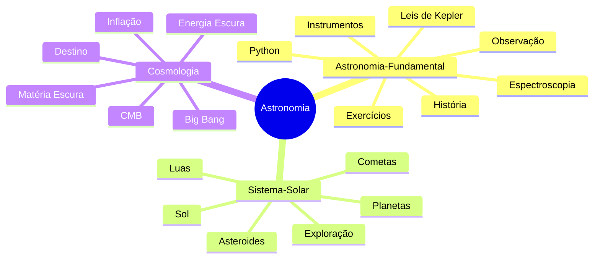
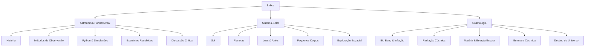
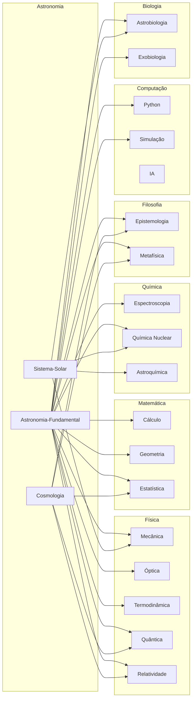
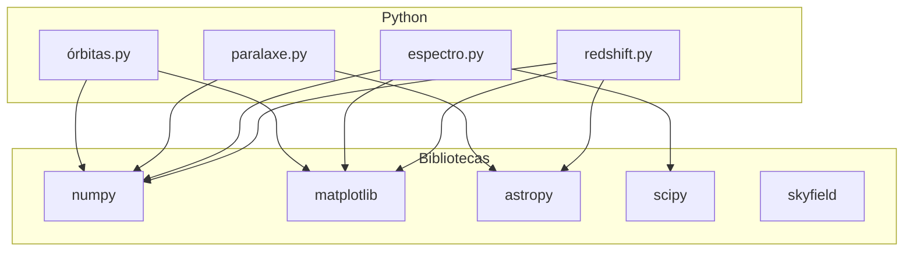

# 🌌 Astronomia — Índice Navegável

> *"O cosmos é tudo o que existe, tudo o que já existiu e tudo o que ever existirá."* — Carl Sagan

---

## 📚 Estrutura do Conhecimento

Este índice organiza todo o conteúdo de Astronomia do vault. Cada arquivo é auto-contido e interligado por referências cruzadas.

---

## 🧭 Mapas de Navegação

---

## 📄 Arquivos

| # | Arquivo | Descrição | Linhas | Tags |
|---|---------|-----------|--------|------|
| 1 | [[Astronomia-Fundamental]] | Fundamentos teóricos, história, instrumentos, simulações Python, exercícios, discussão crítica | ~800+ | `#fundamental` `#teoria` `#python` `#exercicios` |
| 2 | [[Sistema-Solar]] | Sol, planetas, luas, asteroides, cometas, exploração espacial | ~500+ | `#sistema-solar` `#planetas` `#exploração` |
| 3 | [[Cosmologia]] | Big Bang, inflação, CMB, matéria/energia escura, estrutura, destino | ~500+ | `#cosmologia` `#bigbang` `#universo` |

---

## 🔗 Referências Cruzadas por Disciplina

---

## 📖 Guia de Leitura Recomendada

| Nível | Leitura | Arquivo |
|-------|---------|---------|
| ⭐ Iniciante | O que é Astronomia? | [[Astronomia-Fundamental#Introdução]] |
| ⭐ Iniciante | Nosso lugar no Sistema Solar | [[Sistema-Solar#Visão Geral]] |
| ⭐⭐ Intermediário | Leis de Kepler & Mecânica Celeste | [[Astronomia-Fundamental#Leis de Kepler]] |
| ⭐⭐ Intermediário | Formação do Sistema Solar | [[Sistema-Solar#Formação]] |
| ⭐⭐⭐ Avançado | Cosmologia — Big Bang ao Fim | [[Cosmologia]] |
| ⭐⭐⭐ Avançado | Simulações Python em Astronomia | [[Astronomia-Fundamental#Código Python]] |

---

## 🐍 Ferramentas Computacionais

---

## 🏛️ Timeline Histórica

| Período | Evento | Referência |
|---------|--------|------------|
| ~300 a.C. | Aristarco propõe modelo heliocêntrico | [[Astronomia-Fundamental#História]] |
| ~150 d.C. | Ptolomeu — Almagesto | [[Astronomia-Fundamental#Ptolomeu]] |
| 1543 | Copérnico — Revolução | [[Astronomia-Fundamental#Copérnico]] |
| 1609 | Galileu — Lua & luas de Júpiter | [[Astronomia-Fundamental#Galileu]] |
| 1609-1619 | Kepler — Três Leis | [[Astronomia-Fundamental#Kepler]] |
| 1687 | Newton — Gravitação | [[Astronomia-Fundamental#Newton]] |
| 1929 | Hubble — Expansão | [[Astronomia-Fundamental#Hubble]] |
| 1915 | Einstein — Relatividade Geral | [[Astronomia-Fundamental#Einstein]] |
| 1964 | Penzias & Wilson — CMB | [[Cosmologia#Radiação Cósmica de Fundo]] |
| 1990 | Hubble — Lançamento | [[Astronomia-Fundamental#Telescópio Hubble]] |
| 1998 | Aceleração — Energia Escura | [[Cosmologia#Energia Escura]] |
| 2021 | James Webb — Lançamento | [[Astronomia-Fundamental#James Webb]] |

---

## 🚀 Missões Espaciais Relevantes

| Missão | Ano | Alvo | Arquivo |
|--------|-----|------|---------|
| Voyager 1 & 2 | 1977 | Sistema Solar exterior | [[Sistema-Solar#Voyager]] |
| Cassini-Huygens | 1997 | Saturno/Titã | [[Sistema-Solar#Cassini]] |
| New Horizons | 2006 | Plutão/Cinturão Kuiper | [[Sistema-Solar#New Horizons]] |
| Perseverance | 2020 | Marte | [[Sistema-Solar#Perseverance]] |
| Artemis I-III | 2022-2025 | Lua | [[Sistema-Solar#Artemis]] |
| Euclid | 2023 | Matéria escura | [[Cosmologia#Missões]] |
| JWST | 2021 | Universo profundo | [[Astronomia-Fundamental#James Webb]] |

---

## 🧪 Exercícios Disponíveis

| # | Exercício | Dificuldade | Arquivo |
|---|-----------|-------------|---------|
| 1 | Distância estelar por paralaxe | ⭐⭐ | [[Astronomia-Fundamental#Exercício 1]] |
| 2 | Órbita elíptica de Marte | ⭐⭐⭐ | [[Astronomia-Fundamental#Exercício 2]] |
| 3 | Redshift de galáxia | ⭐⭐⭐ | [[Astronomia-Fundamental#Exercício 3]] |
| 4 | Massa de exoplaneta por trânsito | ⭐⭐⭐⭐ | [[Astronomia-Fundamental#Exercício 4]] |

---

## 📡 Recursos Online

| Recurso | Tipo | Link |
|---------|------|------|
| NASA | Agência espacial | [nasa.gov](https://nasa.gov) |
| ESA | Agência espacial europeia | [esa.int](https://esa.int) |
| James Webb Space Telescope | Telescópio | [jwst.nasa.gov](https://jwst.nasa.gov) |
| Hubble Space Telescope | Telescópio | [hubblesite.org](https://hubblesite.org) |
| Sky & Telescope | Revista | [skyandtelescope.org](https://skyandtelescope.org) |
| arXiv astro-ph | Papers | [arxiv.org/astro-ph](https://arxiv.org) |
| NASA Exoplanet Archive | Dados | [exoplanetarchive.ipac.caltech.edu](https://exoplanetarchive.ipac.caltech.edu) |

---

## 🧭 Como Navegar

1. **Comece por** [[Astronomia-Fundamental]] para entender os conceitos básicos
2. **Explore** [[Sistema-Solar]] para conhecer nosso sistema planetário
3. **Aprofunde-se** em [[Cosmologia]] para as grandes questões do universo

> Este índice é mantido como parte do vault de Conhecimento-Geral. Atualizações e correções são bem-vindas.

---

*Última atualização: 18 de maio de 2026*
