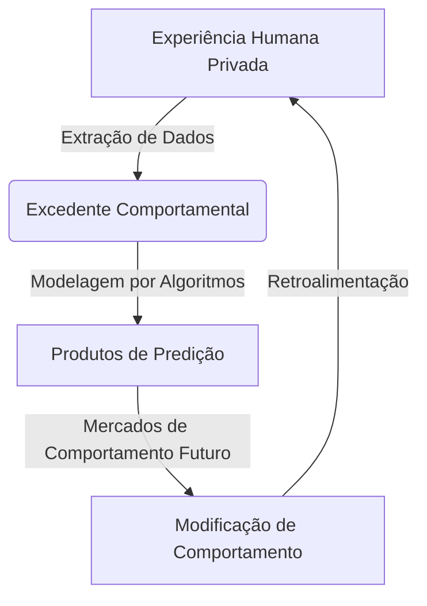

# Sociologia da Era Digital

A Sociologia da Era Digital investiga como as tecnologias de informação e comunicação reconfiguram as instituições sociais, a subjetividade, as relações de trabalho e a própria democracia. 

---

## 1. A Sociedade em Rede (Manuel Castells)
O conceito de **Sociedade em Rede** define uma estrutura social cuja dinâmica central é organizada em torno de redes de informação processadas eletronicamente por tecnologias microeletrônicas.

* **Descentralização Espacial:** O "espaço de fluxos" substitui o "espaço de lugares". O tempo e a distância física deixam de ser barreiras para transações financeiras, interações sociais e trabalho (Ex: *Home Office* e nômades digitais).
* **Morfologia de Rede:** Qualquer ponto da rede (nó) é vital se agregar valor, mas pode ser sumariamente contornado ou excluído se perder utilidade. Isso gera novos padrões de inclusão e exclusão social.

---

## 2. Capitalismo de Vigilância (Shoshana Zuboff)
Teorizado pela socióloga Shoshana Zuboff, o **Capitalismo de Vigilância** descreve uma nova mutação do sistema econômico global que reivindica a experiência humana privada como matéria-prima gratuita para tradução em dados de comportamento.

### Características Centrais:
* **Excedente Comportamental:** Dados de navegação, cliques, tempo de tela, tom de voz e expressões faciais que vão além da necessidade técnica de melhoria do serviço, sendo usados para prever o comportamento futuro dos usuários.
* **Arquiteturas de Persuasão:** Interfaces desenhadas especificamente para reter o usuário (ex: rolagem infinita, notificações push de alta frequência) e induzir ações de consumo de forma subliminar.
* **Privação de Direitos Epistêmicos:** A assimetria de poder onde as grandes plataformas sabem tudo sobre os usuários, mas os usuários não sabem como os algoritmos os interpretam e manipulam.

---

## 3. Loops Algorítmicos e Câmaras de Eco
Os algoritmos de recomendação buscam maximizar o *engajamento* (tempo gasto e interação). Esse imperativo cria fenômenos sociais nocivos:

> [!WARNING]
> Os loops algorítmicos direcionam conteúdo cada vez mais polarizado aos usuários para reter a atenção, explorando gatilhos emocionais como a indignação moral e o medo.

* **Filtros Bolha (*Filter Bubbles*):** A personalização extrema oculta opiniões divergentes, expondo o indivíduo a uma única visão de mundo autoconsistente.
* **Câmaras de Eco (*Echo Chambers*):** Comunidades virtuais onde ideias são repetidas, amplificadas e validadas de forma endógena, promovendo o viés de confirmação e erodindo a confiança em instituições de fatos e ciência (Veja [[Logica-e-Pensamento-Critico|Lógica e Pensamento Crítico]]).
* **Vício Dopaminérgico:** O design de recompensa variável intermitente ativa a liberação pulsátil de dopamina no cérebro, mimetizando o mecanismo neural de jogos de azar e comprometendo a saúde mental (Veja [[Saude-Mental-e-Manejo-de-Estresse|Saúde Mental e Manejo de Estresse]] e [[Sono-e-Ritmo-Circadiano|Sono e Ritmo Circadiano]]).

---

## 4. Plataformização e o Impacto no Trabalho
A plataformização da economia (*Platformization*) altera profundamente as relações produtivas e o mercado laboral.

* **A *Gig Economy* e a Uberização:** Relações de trabalho intermediadas por aplicativos móveis que se eximem de encargos trabalhistas clássicos, transferindo todos os riscos operacionais para o trabalhador (autonomia ilusória vs. precarização extrema).
* **Gestão Algorítmica:** O uso de algoritmos para monitorar, direcionar, avaliar e, em última instância, demitir trabalhadores de plataforma sem intervenção humana direta.
* **A Espetacularização do Eu:** A mercantilização da própria identidade nas plataformas sociais (*influencers*), onde a privacidade é sacrificada em nome do capital social e financeiro.

---
**Próximos Passos de Estudo:**
* Analisar como o excesso de estimulação digital desregula o [[Sono-e-Ritmo-Circadiano|Sono e o Ritmo Circadiano]].
* Explorar os efeitos do estresse provocado pelas plataformas em [[Saude-Mental-e-Manejo-de-Estresse|Saúde Mental e Manejo de Estresse]].
