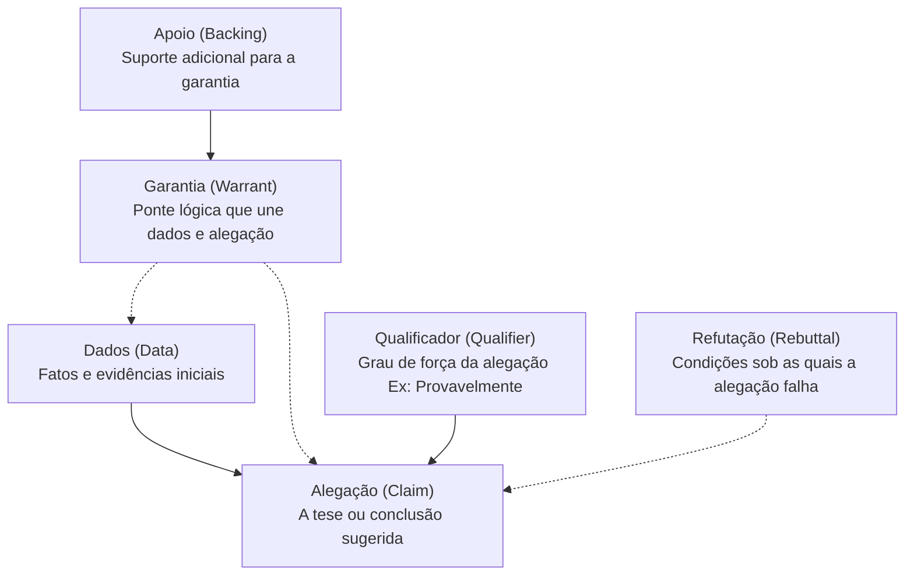

# Lógica e Pensamento Crítico

O pensamento crítico é a habilidade de analisar informações de maneira objetiva e racional, avaliando a validade de argumentos através das regras da lógica. Na era da sobrecarga informacional, essa competência serve como um filtro epistemológico indispensável.

---

## 1. Lógica Formal vs. Lógica Informal

A divisão básica da lógica reside no método e no objeto de análise:

| Critério | Lógica Formal (Simbólica) | Lógica Informal (Retórica/Argumentação) |
| :--- | :--- | :--- |
| **Foco** | A estrutura sintática do argumento (Validade). | O conteúdo semântico e o contexto do argumento (Solidez). |
| **Linguagem** | Símbolos matemáticos e fórmulas rígidas (Ex: $P \rightarrow Q$). | Linguagem natural, diálogo cotidiano e debates públicos. |
| **Verdade** | Independe do mundo empírico. A verdade é condicional. | Depende da verdade das premissas e da persuasão racional. |
| **Exemplo** | Modus Ponens: Se chove, a terra molha. Choveu. Logo, molhou. | Aumento de impostos sob certas condições econômicas. |

---

## 2. Catálogo de Falácias Comuns

Falácias são falhas de raciocínio que invalidam um argumento ou o tornam semanticamente frágil. Compreendê-las é crucial para evitar manipulações retóricas.

| Nome da Falácia | Descrição | Exemplo Prático |
| :--- | :--- | :--- |
| ***Ad Hominem*** | Atacar a pessoa que faz a alegação em vez de refutar o argumento em si. | "Você não tem autoridade para falar sobre economia porque nunca administrou uma empresa." |
| **Espantalho (*Strawman*)** | Distorcer ou exagerar o argumento do oponente para torná-lo mais fácil de atacar. | "Você quer reduzir o orçamento de segurança pública? Então você quer deixar a cidade à mercê dos criminosos." |
| **Apelo à Ignorância (*Ad Ignorantiam*)** | Argumentar que algo é verdadeiro simplesmente porque não foi provado que é falso (ou vice-versa). | "Ninguém conseguiu provar que fantasmas não existem, logo, eles existem." |
| **Falsa Dicotomia** | Apresentar apenas duas alternativas limitadas quando existem outras opções viáveis. | "Ou nós proibimos as redes sociais inteiramente, ou aceitamos o fim da privacidade." |
| **Ladeira Escorregadia** | Afirmar que um pequeno passo inicial levará inevitavelmente a consequências extremas e catastróficas. | "Se permitirmos que os alunos usem celulares na sala de aula, em breve ninguém mais prestará atenção e as escolas entrarão em colapso." |
| **Falso Apelo à Autoridade** | Sustentar a validade de um argumento com base na opinião de alguém que não é especialista na área. | "Um famoso ator de cinema declarou que a nova dieta detox cura qualquer tipo de câncer." |
| ***Cum Hoc Ergo Propter Hoc*** | Assumir que a correlação entre dois eventos implica necessariamente que um causou o outro. | "As vendas de sorvete aumentaram no mesmo mês em que os ataques de tubarão cresceram. Portanto, comer sorvete atrai tubarões." |

---

## 3. O Modelo de Toulmin para Argumentação

Desenvolvido pelo filósofo Stephen Toulmin, este modelo decompõe argumentos práticos em seis elementos estruturais para analisar sua robustez real no mundo físico.

### Exemplo Prático do Modelo de Toulmin:
* **Dados (D):** O paciente apresenta glicemia de jejum de $126 \text{ mg/dL}$ em dois exames distintos.
* **Alegação (C):** O paciente provavelmente é portador de diabetes mellitus.
* **Garantia (G):** Clínicas médicas estabelecem que níveis repetidos de glicose de jejum iguais ou superiores a $126 \text{ mg/dL}$ indicam diabetes.
* **Apoio (A):** As diretrizes da Sociedade Brasileira de Diabetes confirmam este critério diagnóstico.
* **Qualificador (Q):** "Provavelmente", dependendo da confirmação de outros sintomas ou testes secundários.
* **Refutação (R):** A menos que o paciente estivesse sob uso agudo de corticoides ou tenha tido erro laboratorial.

---

## 4. Relevância da Lógica na Engenharia de Prompts (*Prompt Reasoning*)

Na interação com Modelos de Linguagem de Grande Porte (LLMs), a lógica informal e formal dita a qualidade do processamento de respostas complexas.

> [!TIP]
> A engenharia de prompts é a aplicação prática de regras lógicas estruturadas sobre o processamento de linguagem natural.

### Técnicas de Raciocínio Lógico em LLMs
1. **Cadeia de Pensamento (*Chain of Thought - CoT*):** Instruir o modelo a explicitar passo a passo suas premissas lógicas intermediárias antes de apresentar a conclusão final. Isso reduz alucinações e ativa capacidades de dedução matemática.
2. **Árvore de Pensamentos (*Tree of Thoughts - ToT*):** Forçar o LLM a simular múltiplos caminhos argumentativos divergentes, avaliar a viabilidade lógica de cada ramificação e podar os caminhos inválidos ou falaciosos antes de consolidar a resposta.
3. **Delimitação de Contexto e Constrições:** A utilização de regras do tipo *Se-Então* (*If-Then*) e restrições formais na instrução de prompts atua como um sistema axiomático fechado, garantindo que o agente mantenha consistência lógica estrita.

---
**Próximos Passos de Estudo:**
* Compreender como falácias informais operam em larga escala na [[Sociologia-da-Era-Digital|Sociologia da Era Digital]].
* Aplicar o modelo de Toulmin para avaliar alegações científicas em [[Fisiologia-do-Exercicio|Fisiologia do Exercício]] ou [[Nutricao-e-Metabolismo|Nutrição e Metabolismo]].
