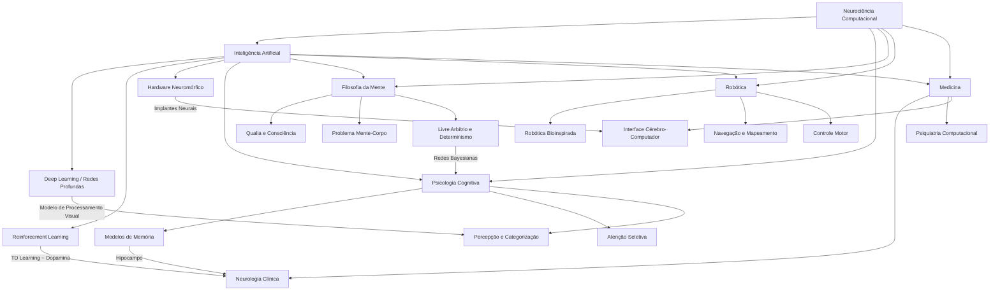

# Neurociência Computacional

## 1. Introdução Teórica Aprofundada

### 1.1 Modelagem de Neurônios

A neurociência computacional busca traduzir processos neurais biológicos em modelos matemáticos e simulações computacionais. O objetivo central é compreender como algoritmos neurais emergem da atividade elétrica e química de populações de neurônios.

#### 1.1.1 Modelo de Hodgkin-Huxley (1952)

Desenvolvido por Alan Hodgkin e Andrew Huxley a partir de experimentos com o axônio gigante da lula (*Loligo pealeii*), este é o modelo mais detalhado e biologicamente preciso da geração do potencial de ação. Ele descreve a membrana neuronal como um circuito elétrico equivalente com:

- **Capacitância da membrana (Cm)**: armazena carga elétrica.
- **Condutâncias iônicas variáveis**: canais de sódio (Na⁺), potássio (K⁺) e vazamento (Cl⁻/outros).
- **Potenciais de reversão (ENa, EK, Eleak)**: determinados pelas concentrações iônicas.

As equações diferenciais que regem o modelo são:

```
Cm dV/dt = I_ext - gNa m³h (V - ENa) - gK n⁴ (V - EK) - gleak (V - Eleak)
dm/dt = αm(V)(1 - m) - βm(V) m
dh/dt = αh(V)(1 - h) - βh(V) h
dn/dt = αn(V)(1 - n) - βn(V) n
```

Onde:
- **V**: potencial de membrana (mV)
- **I_ext**: corrente externa aplicada (μA/cm²)
- **m, h, n**: variáveis de gate (probabilidades de abertura dos canais)
- **α, β**: taxas de transição dependentes de voltagem

**Limitações**: alta complexidade computacional (4 EDOs acopladas por neurônio), inviável para simulações de grandes populações.

#### 1.1.2 Modelo de Integração-e-Disparo (LIF - Leaky Integrate-and-Fire)

O modelo LIF simplifica drasticamente a dinâmica neuronal:

```
τm dV/dt = -(V - Vrest) + Rm I(t)
```

Quando V atinge o limiar Vth, ocorre um disparo e V é resetado para Vreset por um período refratário tref.

**Vantagens**:
- Extremamente eficiente computacionalmente (apenas 1 EDO)
- Captura o comportamento essencial de integração temporal
- Permite simular milhões de neurônios em tempo real

**Limitações**:
- Não reproduz a forma detalhada do potencial de ação
- Não captura a rica dinâmica de canais iônicos
- Ausência de adaptação intrínseca (exceto com extensões como o LIF adaptativo)

#### 1.1.3 Modelo de Izhikevich (2003)

Proposto por Eugene Izhikevich, este modelo atinge um equilíbrio ideal entre realismo biológico e eficiência computacional. Utiliza apenas 2 EDOs:

```
dv/dt = 0.04v² + 5v + 140 - u + I
du/dt = a(bv - u)
```

Com a condição de reset:
```
se v ≥ 30 mV, então:
  v ← c
  u ← u + d
```

Os parâmetros (a, b, c, d) permitem reproduzir **20 tipos diferentes** de disparos neuronais observados experimentalmente:

| Parâmetros | Tipo de Neurônio |
|---|---|
| a=0.02, b=0.2, c=-65, d=6 | Disparo regular (RS) - excitatório |
| a=0.02, b=0.25, c=-65, d=6 | Disparo intrínseco (IB) |
| a=0.02, b=0.2, c=-50, d=2 | Disparo rápido (FS) - inibitório |
| a=0.1, b=0.2, c=-65, d=2 | Disparo de baixo limiar (LTS) |

**Vantagens**: ~50× mais rápido que Hodgkin-Huxley, reproduz 20+ padrões de disparo, adequado para simulações de larga escala.

### 1.2 Modelagem de Sinapses

Sinapses são as junções especializadas onde a informação é transmitida entre neurônios. Modelos computacionais de sinapses incluem:

#### 1.2.1 Sinapses Químicas

Modeladas tipicamente como condutâncias pós-sinápticas que evoluem no tempo:

```
g_syn(t) = g_max · (t/τ) · exp(1 - t/τ)  (função alfa)
```

Ou como diferença de exponenciais:
```
g_syn(t) = g_max · [exp(-t/τ_decay) - exp(-t/τ_rise)]
```

A corrente pós-sináptica é:
```
I_syn = g_syn(t) · (V - E_syn)
```

Onde E_syn é o potencial de reversão:
- **E_syn ≈ 0 mV** para sinapses excitatórias (AMPA/NMDA)
- **E_syn ≈ -75 mV** para sinapses inibitórias (GABA_A)

#### 1.2.2 Sinapses Elétricas (Gap Junctions)

Modeladas como conexões ôhmicas diretas:
```
I_gap = g_gap · (V_pre - V_post)
```

Permitem transmissão bidirecional e extremamente rápida (< 0.1 ms), comuns em interneurônios inibitórios e no córtex.

### 1.3 Plasticidade Sináptica

#### 1.3.1 Regra de Hebb (1949)

"Heurística fundamental": *Neurons that fire together, wire together.*

Formalização:
```
Δw_ij = η · x_i · y_j
```

Onde:
- Δw_ij: variação do peso sináptico entre neurônio pré-sináptico i e pós-sináptico j
- η: taxa de aprendizagem
- x_i: atividade pré-sináptica
- y_j: atividade pós-sináptica

**Problema**: a regra pura de Hebb é instável — pesos crescem sem limites. Soluções incluem normalização, decaimento (Oja's rule) ou limites de saturação.

**Regra de Oja (1982)**:
```
Δw_ij = η · y_j · (x_i - y_j · w_ij)
```
Realiza análise de componentes principais (PCA) nos dados de entrada.

#### 1.3.2 Plasticidade Dependente do Tempo do Disparo (STDP)

Descoberta experimentalmente por Bi & Poo (1998), a STDP ajusta os pesos sinápticos com base na ordem temporal precisa dos disparos pré e pós-sinápticos:

```
Δw = 
  A+ · exp(-|Δt|/τ+),  se Δt > 0 (pré antes de pós → potenciação)
  -A- · exp(-|Δt|/τ-), se Δt < 0 (pós antes de pré → depressão)
```

Onde Δt = t_post - t_pre.

**Parâmetros típicos**:
- τ+ ≈ 10-20 ms (janela de potenciação)
- τ- ≈ 10-20 ms (janela de depressão)
- A+ e A- determinam a magnitude da mudança

**Implicações computacionais**:
- A STDP implementa aprendizagem competitiva
- Pode extrair regularidades temporais nos dados
- Relacionada ao aprendizado por reforço (R-STDP)
- Modela memória associativa temporal

#### 1.3.3 Plasticidade Homeostática

Mecanismos que estabilizam a atividade neuronal em faixas fisiológicas:

- **Escalonamento sináptico**: ajuste multiplicativo de todos os pesos sinápticos
- **Metaplasticidade**: ajuste dos limiares para indução de plasticidade
- **Buddenbrock**: ajuste da excitabilidade intrínseca

### 1.4 Redes Neurais Biológicas vs. Artificiais

#### 1.4.1 Redes Neurais Artificiais (ANNs)

Inspiradas em redes biológicas, mas radicalmente simplificadas:

| Característica | Redes Biológicas | Redes Artificiais |
|---|---|---|
| Unidade básica | Neurônio com dinâmica temporal complexa | Neurônio McCulloch-Pitts (soma ponderada + não-linearidade) |
| Sinal | Potenciais de ação (eventos discretos) | Ativações contínuas (real) |
| Conexões | Esparsas (~10⁴ sinapses/neurônio) | Densas (fully connected) |
| Aprendizagem | STDP, Hebb, homeostase | Backpropagation (gradiente descendente) |
| Topologia | Altamente estruturada, laminar | Camadas uniformes, feedforward |
| Consumo energético | ~20W (cérebro humano) | ~300W+ (GPU típica) |
| Paralelismo | Massivo, assíncrono | SIMD (síncrono em GPU) |

#### 1.4.2 Spiking Neural Networks (SNNs)

As SNNs são o elo entre ambos os paradigmas. Nelas:

- A informação é codificada no **tempo** dos disparos (rate coding, temporal coding, population coding)
- A comunicação é **event-driven** (esparsa e energeticamente eficiente)
- A aprendizagem pode usar STDP (local, biologicamente plausível) ou versões aproximadas de backpropagation (surrogate gradients)

**Hardware neuromórfico**: Intel Loihi, IBM TrueNorth, BrainScaleS — processadores projetados especificamente para SNNs.

### 1.5 Simuladores Cerebrais

#### 1.5.1 NEST Simulator

- **Foco**: simulação de redes neurais de larga escala (até bilhões de neurônios)
- **Linguagem**: C++ (núcleo), Python (interface PyNEST)
- **Modelos**: LIF, Izhikevich, Hodgkin-Huxley, sinapses diversas, STDP
- **Paralelismo**: MPI para computação distribuída
- **Uso**: Blue Brain Project (parcialmente), redes corticais em larga escala

#### 1.5.2 Brian2

- **Foco**: simulação flexível e de alto nível, ideal para prototipagem
- **Linguagem**: Python puro
- **Modelos**: definidos por equações arbitrárias (linguagem própria de descrição)
- **Vantagens**: sintaxe intuitiva, curvas de aprendizado baixas, integração com NumPy
- **Ideal para**: pesquisadores testando novos modelos rapidamente

Exemplo de definição em Brian2:
```python
eqs = '''
dv/dt = (I - v) / tau : 1
I : 1
'''
G = NeuronGroup(N, eqs, threshold='v > vth', reset='v = vreset')
```

#### 1.5.3 NEURON

- **Foco**: modelos detalhados de neurônios individuais (compartimentos)
- **Linguagem**: C++/Python (HOC)
- **Modelos**: morfologia realista, canais iônicos, sinapse químicas e elétricas
- **Uso**: modelos de células individuais, redes de pequena escala
- **Diferencial**: suporte nativo a morfologias 3D (SWC files)

#### 1.5.4 Blue Brain Project

- **Plataforma**: Blue Brain Project (BBP) — EPFL, Suíça
- **Objetivo**: reconstrução e simulação virtual do cérebro de mamíferos
- **Realizações**: coluna cortical de rato (~31.000 neurônios, 55 tipos, 8 milhões de sinapses)
- **Ferramentas**: BlueConfig, NeuroMorphoVis, CoreNEURON
- **Limitação**: escalabilidade para cérebro humano completo (~86 bilhões de neurônios) ainda inviável

#### 1.5.5 Outros Simuladores

- **CARLsim**: GPU-accelerated SNN simulator
- **GeNN**: GPU-enhanced Neuronal Networks
- **SpyNNaker**: hardware neuromórfico (processador ARM em rede)
- **Lava**: framework da Intel para Loihi

---

## 2. Bibliografia e Papers Comentados

### 2.1 Obras Fundamentais

1. **Dayan, P. & Abbott, L.F. (2001). *Theoretical Neuroscience: Computational and Mathematical Modeling of Neural Systems*. MIT Press.**
   - **Comentário**: A "bíblia" da neurociência computacional. Cobre codificação neural, plasticidade, dinâmica de populações, aprendizado supervisionado e não-supervisionado. Leitura obrigatória do capítulo introdutório ao avançado. A abordagem matemática é rigorosa, com derivações completas.

2. **Gerstner, W., Kistler, W.M., Naud, R. & Paninski, L. (2014). *Neuronal Dynamics: From Single Neurons to Networks and Models of Cognition*. Cambridge University Press.**
   - **Comentário**: Manual moderno e acessível. Destaque para a Seção 5 sobre Generalized Linear Models (GLMs), Seção 11 sobre Plasticidade e Seção 14 sobre modelos de cognição. Acompanhado de exercícios em Python. Recurso online: https://neuronaldynamics.epfl.ch

3. **Izhikevich, E.M. (2003). "Simple model of spiking neurons." *IEEE Transactions on Neural Networks*, 14(6), 1569-1572.**
   - **Comentário**: Paper seminal que introduziu o modelo de Izhikevich. Mostra como 2 EDOs capturam 20 padrões de disparo. Citado >8.000 vezes. Leitura essencial para quem trabalha com SNNs.

### 2.2 Artigos de Plasticidade e Aprendizagem

4. **Bi, G. & Poo, M. (1998). "Synaptic modifications in cultured hippocampal neurons: dependence on spike timing, synaptic strength, and postsynaptic cell type." *J. Neuroscience*, 18(24), 10464-10472.**
   - **Comentário**: Descoberta experimental da STDP. Medições diretas em cultura de neurônios hipocampais. Estabelece a janela temporal de plasticidade (~20ms) que fundamenta modelos computacionais.

5. **Lillicrap, T.P., Santoro, A., Marris, L., Akerman, C.J. & Hinton, G. (2020). "Backpropagation and the brain." *Nature Reviews Neuroscience*, 21(6), 335-346.**
   - **Comentário**: Analisa se o backpropagation é biologicamente plausível. Propõe o *weight transport problem* e discussão sobre feedback alignment como alternativa. Ponte fundamental entre DL e neurociência.

6. **Markram, H., Lübke, J., Frotscher, M. & Sakmann, B. (1997). "Regulation of synaptic efficacy by coincidence of postsynaptic APs and EPSPs." *Science*, 275(5297), 213-215.**
   - **Comentário**: Descoberta precursora da STDP no neocórtex. Mostra que o timing relativo entre EPSP e potencial de ação pós-sináptico determina potenciação ou depressão.

### 2.3 DeepMind e Neurociência

7. **Banino, A., Barry, C., Uria, B., et al. (2018). "Vector-based navigation using grid-like representations in artificial agents." *Nature*, 557, 429-433.**
   - **Comentário**: DeepMind treinou redes profundas com LSTM para navegação e observou a emergência espontânea de células de grid (descoberta original: Moser & Moser, 2005). Demonstra convergência entre representações biológicas e artificiais.

8. **Kriegeskorte, N. & Douglas, P.K. (2018). "Cognitive computational neuroscience." *Nature Neuroscience*, 21, 1148-1160.**
   - **Comentário**: Propõe o campo da *cognitive computational neuroscience* — usar DNNs como modelos do processamento visual e cognitivo humano.

9. **Stachenfeld, K.L., Botvinick, M.M. & Gershman, S.J. (2017). "The hippocampus as a predictive map." *Nature Neuroscience*, 20, 1643-1653.**
   - **Comentário**: Unifica a teoria do hipocampo como mapa cognitivo (O'Keefe) com aprendizado por reforço (SR - Successor Representation). Modelo computacional que explica achados experimentais.

### 2.4 Redes de Pico e Hardware Neuromórfico

10. **Bellec, G., Scherr, F., Subramoney, A., et al. (2020). "A solution to the learning dilemma for recurrent networks of spiking neurons." *Nature Communications*, 11, 3625.**
    - **Comentário**: Introduz o algoritmo e-prop (eligibility propagation) para treinar SNNs recorrentes. Combina STDP local com sinal global de erro. Marco para SNNs de larga escala.

11. **Davies, M., Srinivasa, N., Lin, T.H., et al. (2018). "Loihi: A neuromorphic manycore processor with on-chip learning." *IEEE Micro*, 38(1), 82-99.**
    - **Comentário**: Descrição da arquitetura Loihi da Intel. Processador neuromórfico com suporte nativo a STDP on-chip. Demonstra eficiência energética 10.000× superior a GPUs para certas tarefas.

---

## 3. Exemplo Prático Completo com Código Python

### 3.1 Simulação de Neurônio Izhikevich com NumPy

```python
import numpy as np
import matplotlib.pyplot as plt

def simulate_izhikevich(a=0.02, b=0.2, c=-65.0, d=8.0,
                        I_ext=10.0, T=1000.0, dt=0.1):
    """
    Simula um neurônio Izhikevich.

    Parâmetros:
        a,b,c,d : parâmetros do modelo (default: regular spiking)
        I_ext   : corrente externa (pA)
        T       : tempo total (ms)
        dt      : passo temporal (ms)

    Retorna:
        t, v, u : arrays de tempo, voltagem e variável de recuperação
    """
    steps = int(T / dt)
    t = np.arange(steps) * dt

    v = np.full(steps, -65.0, dtype=np.float64)  # potencial de membrana (mV)
    u = np.full(steps, 0.0, dtype=np.float64)     # variável de recuperação
    spikes = np.zeros(steps, dtype=bool)

    for i in range(steps - 1):
        # Corrente aplicada (pulso entre 100 e 300ms)
        I = I_ext if 100 < t[i] < 300 else 0.0

        # Equações do modelo Izhikevich
        dv = 0.04 * v[i]**2 + 5 * v[i] + 140 - u[i] + I
        du = a * (b * v[i] - u[i])

        v[i+1] = v[i] + dt * dv
        u[i+1] = u[i] + dt * du

        # Condição de disparo
        if v[i+1] >= 30.0:
            spikes[i+1] = True
            v[i+1] = c
            u[i+1] = u[i+1] + d

    return t, v, u, spikes

# Parâmetros dos 4 principais tipos de neurônios
configs = {
    "Regular Spiking (RS)":     {"a": 0.02, "b": 0.2,  "c": -65, "d": 6},
    "Intrinsically Bursting (IB)": {"a": 0.02, "b": 0.25, "c": -55, "d": 6},
    "Fast Spiking (FS)":        {"a": 0.1,  "b": 0.2,  "c": -65, "d": 2},
    "Low-Threshold Spiking (LTS)": {"a": 0.02, "b": 0.25, "c": -65, "d": 2},
}

plt.figure(figsize=(14, 10))
for idx, (nome, params) in enumerate(configs.items(), 1):
    t, v, u, spikes = simulate_izhikevich(**params, I_ext=12.0)
    plt.subplot(4, 1, idx)
    plt.plot(t, v, 'b-', lw=0.8)
    plt.plot(t[spikes], v[spikes], 'ro', ms=2, label='Disparos')
    plt.ylabel('V (mV)')
    plt.title(f'Neurônio {nome}')
    plt.ylim(-90, 40)
    plt.grid(alpha=0.3)
    plt.legend()

plt.xlabel('Tempo (ms)')
plt.tight_layout()
plt.show()
```

### 3.2 Simulação de Plasticidade Hebbiana

```python
def hebbian_learning(X, n_epochs=100, eta=0.01, w=None):
    """
    Regra de Oja (PCA) para aprendizagem Hebbiana estável.

    X: matriz de dados (n_samples x n_features)
    """
    n_samples, n_features = X.shape
    if w is None:
        w = np.random.randn(n_features) * 0.1

    w_history = np.zeros((n_epochs, n_features))
    for epoch in range(n_epochs):
        for x in X:
            y = np.dot(w, x)          # ativação do neurônio pós-sináptico
            dw = eta * y * (x - y * w) # regra de Oja
            w = w + dw
            w = w / np.linalg.norm(w)  # normalização opcional
        w_history[epoch] = w.copy()
    return w, w_history

# Exemplo: aprender o primeiro componente principal de dados 2D
np.random.seed(42)
X = np.random.multivariate_normal([0, 0], [[3, 2], [2, 2]], 500)

w_final, w_hist = hebbian_learning(X, n_epochs=50)

# PCA teórico
from numpy.linalg import eigh
cov = np.cov(X.T)
_, eigvecs = eigh(cov)
w_pca = eigvecs[:, -1]  # primeiro componente principal

print(f"Peso aprendido (Oja):    {w_final}")
print(f"Primeiro PC (PCA teórico): {w_pca}")
print(f"Correlação: {np.abs(np.dot(w_final, w_pca)):.4f}")
```

### 3.3 Simulação de Plasticidade STDP com Brian2

```python
"""
Simulação de STDP com Brian2.

Requisitos: pip install brian2
"""

try:
    from brian2 import *

    set_device('runtime')

    # Parâmetros
    N_pre = 10      # neurônios pré-sinápticos
    N_post = 1      # neurônio pós-sináptico
    duration = 5*second

    # Neurônios LIF
    eqs = '''
    dv/dt = (I - v) / tau : 1
    I : 1
    tau : second
    '''
    pre = NeuronGroup(N_pre, eqs, threshold='v > 1', reset='v = 0')
    post = NeuronGroup(N_post, eqs, threshold='v > 1', reset='v = 0')

    pre.tau = 10*ms
    post.tau = 10*ms

    # Corrente de entrada (aleatória)
    pre.I = 'rand() * 0.2'
    post.I = 0.0

    # Sinapses com STDP
    S = Synapses(pre, post, model='''
        w : 1
        dapre/dt = -apre / tau_pre : 1 (event-driven)
        dapost/dt = -apost / tau_post : 1 (event-driven)
    ''', on_pre='''
        v_post += w
        apre += Apre
        w = clip(w + apost, 0, 1)
    ''', on_post='''
        apost += Apost
        w = clip(w + apre, 0, 1)
    ''')

    S.connect(j='i', p=0.8)  # conectar 80% das sinapses
    S.w = 'rand() * 0.5'     # pesos iniciais entre 0 e 0.5

    # Parâmetros STDP
    S.tau_pre = 20*ms
    S.tau_post = 20*ms
    S.Apre = 0.01
    S.Apost = -0.012

    # Monitoramento
    M_pre = SpikeMonitor(pre)
    M_post = SpikeMonitor(post)
    M_w = StateMonitor(S, 'w', record=True)

    run(duration)

    # Plotagem
    plt.figure(figsize=(12, 6))
    plt.subplot(2, 1, 1)
    plt.plot(M_pre.t/second, M_pre.i, 'b.', ms=1, label='Pré-sináptico')
    plt.plot(M_post.t/second, M_post.i + 0.1, 'r|', ms=5, label='Pós-sináptico')
    plt.xlabel('Tempo (s)')
    plt.ylabel('Neurônio')
    plt.title('Raster plot: atividade pré e pós-sináptica')
    plt.legend()

    plt.subplot(2, 1, 2)
    for idx in range(len(S)):
        plt.plot(M_w.t/second, M_w[idx], lw=0.5, alpha=0.5)
    plt.xlabel('Tempo (s)')
    plt.ylabel('Peso sináptico (w)')
    plt.title('Evolução dos pesos sinápticos com STDP')
    plt.tight_layout()
    plt.show()

except ImportError:
    print("Brian2 não instalado. Instale com: pip install brian2")
```

### 3.4 Comparação: Aprendizagem Biológica vs. Deep Learning

```python
"""
Comparação ilustrativa entre:
1. Aprendizagem Hebbiana (Oja) - biologicamente inspirada
2. SGD + Backpropagation - deep learning clássico

Problema: extrair componentes principais de dados com ruído.
"""

import numpy as np

np.random.seed(42)
n_samples = 1000
X = np.random.randn(n_samples, 20)

# --- Hebbian (Oja) Learning ---
def oja_learning(X, n_components=2, eta=0.001, n_epochs=20):
    n_samples, n_features = X.shape
    W = np.random.randn(n_features, n_components) * 0.01
    for epoch in range(n_epochs):
        for x in X:
            y = W.T @ x
            dW = eta * np.outer(x, y) - eta * W @ np.diag(y**2)
            W = W + dW
    return W

W_oja = oja_learning(X, n_components=2)

# --- PCA via SVD (ground truth) ---
U, S, Vt = np.linalg.svd(X - X.mean(axis=0), full_matrices=False)
W_pca = Vt[:2].T

print("Comparação (primeiros 5 componentes de cada):")
print(f"PCA (teórico): {W_pca[:5, 0]}")
print(f"Oja:           {W_oja[:5, 0]}")
print(f"Correlação: {np.abs(np.corrcoef(W_pca[:, 0], W_oja[:, 0])[0,1]):.4f}")

# --- Deep Learning (batelada SGD) ---
# Simula extração de features via autoencoder linear (SAE)
# O resultado converge para PCA quando a rede é linear
def sgd_pca(X, d=2, lr=0.01, epochs=100):
    n, p = X.shape
    W = np.random.randn(p, d) * 0.01
    for ep in range(epochs):
        Z = X @ W
        X_hat = Z @ W.T
        grad = (X_hat - X).T @ X / n
        W = W - lr * grad
    return W

W_sgd = sgd_pca(X - X.mean(axis=0), d=2)

print("\nPCA via SGD (autoencoder linear):")
print(f"Primeiro componente: {W_sgd[:5, 0]}")
print(f"Correlação com PCA: {np.abs(np.corrcoef(W_pca[:, 0], W_sgd[:, 0])[0,1]):.4f}")

# Conclusão: ambos convergem para as mesmas direções principais,
# mas o Hebbian (Oja) é local (apenas atividade pré e pós),
# enquanto SGD requer propagação do erro da saída para a entrada.
```

---

## 4. Exercícios Resolvidos

### Exercício 1: Implementar Modelo LIF do Zero

**Enunciado**: Implemente um neurônio LIF com parâmetros τm=10ms, Vrest=-65mV, Vth=-50mV, Vreset=-70mV, tref=3ms. Aplique corrente I=2nA por 200ms e plote o potencial de membrana.

**Solução**:

```python
import numpy as np
import matplotlib.pyplot as plt

def lif_simulator(T=500, dt=0.1, tau_m=10.0, v_rest=-65.0,
                  v_th=-50.0, v_reset=-70.0, t_ref=3.0,
                  I=2.0, R=10.0, I_start=50, I_end=250):
    """
    Simulador completo de neurônio LIF.

    Parâmetros:
        T      : tempo total (ms)
        dt     : passo temporal (ms)
        tau_m  : constante de tempo da membrana (ms)
        v_rest : potencial de repouso (mV)
        v_th   : limiar de disparo (mV)
        v_reset: potencial de reset (mV)
        t_ref  : período refratário (ms)
        I      : corrente injetada (nA)
        R      : resistência da membrana (MΩ)
    """
    steps = int(T / dt)
    t = np.arange(steps) * dt
    v = np.full(steps, v_rest, dtype=np.float64)
    spikes = np.zeros(steps, dtype=bool)
    refractory_time = 0

    for i in range(steps - 1):
        # Corrente externa (pulso retangular)
        I_ext = I if I_start <= t[i] <= I_end else 0.0

        if refractory_time > 0:
            # Período refratário: mantém v_reset
            v[i+1] = v_reset
            refractory_time -= dt
        else:
            # Equação LIF
            dv = (v_rest - v[i] + R * I_ext) / tau_m
            v[i+1] = v[i] + dt * dv

            if v[i+1] >= v_th:
                spikes[i+1] = True
                v[i+1] = v_reset
                refractory_time = t_ref

    return t, v, spikes

t, v, spikes = lif_simulator()

plt.figure(figsize=(14, 5))
plt.plot(t, v, 'b-', lw=1)
plt.plot(t[spikes], v[spikes], 'ro', ms=4, label='Disparos')
plt.axhline(-50, color='r', linestyle='--', alpha=0.5, label='Vth = -50 mV')
plt.axhline(-65, color='gray', linestyle='--', alpha=0.3, label='Vrest = -65 mV')
plt.xlabel('Tempo (ms)')
plt.ylabel('Potencial de Membrana (mV)')
plt.title('Simulação LIF: Resposta a Pulso de Corrente (2nA, 50-250ms)')
plt.legend()
plt.grid(alpha=0.3)
plt.xlim(0, 500)
plt.show()

# Estatísticas
isi = np.diff(np.where(spikes)[0]) * dt
freq = 1000 / np.mean(isi) if len(isi) > 0 else 0
print(f"Total de disparos: {np.sum(spikes)}")
print(f"Frequência média: {freq:.2f} Hz")
```

### Exercício 2: Simular Plasticidade STDP em Rede

**Enunciado**: Simule uma rede de 2 neurônios (pré e pós) com STDP. Varie o atraso entre disparos pré e pós entre -50ms e +50ms e meça a variação do peso sináptico. Reproduza a curva experimental de Bi & Poo (1998).

**Solução** (versão simplificada sem Brian2):

```python
def stdp_curve(delta_t, A_plus=0.1, A_minus=0.12, tau_plus=20.0, tau_minus=20.0):
    """
    Calcula a variação do peso sináptico Δw para um dado atraso Δt.

    Δt = t_post - t_pre (ms)
    Δt > 0: pré-1, pós-2 → potenciação (LTP)
    Δt < 0: pós-1, pré-2 → depressão (LTD)
    """
    if delta_t > 0:
        return A_plus * np.exp(-delta_t / tau_plus)
    elif delta_t < 0:
        return -A_minus * np.exp(-abs(delta_t) / tau_minus)
    else:
        return 0.0

# Varrer atrasos
deltas = np.arange(-60, 61, 1)
dw = np.array([stdp_curve(dt) for dt in deltas])

plt.figure(figsize=(10, 6))
plt.plot(deltas, dw, 'b-', lw=2)
plt.axhline(0, color='gray', lw=0.5)
plt.axvline(0, color='gray', lw=0.5)
plt.xlabel('Δt = t_post - t_pre (ms)')
plt.ylabel('Δw (variação do peso sináptico)')
plt.title('Curva STDP Padrão (Bi & Poo, 1998)')
plt.grid(alpha=0.3)
plt.show()

print("Interpretação:")
print("- Δt > 0 (pré → pós): potenciação (LTP) — 'causa antes de efeito'")
print("- Δt < 0 (pós → pré): depressão (LTD) — 'efeito antes de causa'")
print("- Janela temporal crítica: ±20ms para mudanças significativas")
```

### Exercício 3: Comparar Representações em Redes Biológicas vs. Deep Learning

**Enunciado**: Treine uma CNN no CIFAR-10 e analise as representações internas (feature maps). Compare com o processamento visual biológico (córtex V1 → V2 → IT).

**Solução** (análise conceitual + código):

```python
import numpy as np
from tensorflow.keras.applications import VGG16
from tensorflow.keras.preprocessing import image
from tensorflow.keras.applications.vgg16 import preprocess_input
import matplotlib.pyplot as plt

# --- Carregar modelo pré-treinado (análogo ao córtex visual) ---
model = VGG16(weights='imagenet', include_top=False)

# --- Carregar uma imagem de exemplo ---
# (assumindo que há uma imagem disponível)
try:
    img_path = 'exemplo_gato.jpg'
    img = image.load_img(img_path, target_size=(224, 224))
    x = image.img_to_array(img)
    x = np.expand_dims(x, axis=0)
    x = preprocess_input(x)

    # --- Extrair feature maps de diferentes camadas (análogo a V1, V2, IT) ---
    from tensorflow.keras import Model

    # Camada 1 = V1 (detectores de bordas simples)
    layer_v1 = Model(inputs=model.input,
                     outputs=model.get_layer('block1_conv2').output)
    features_v1 = layer_v1.predict(x)

    # Camada 5 = IT (features complexas)
    layer_it = Model(inputs=model.input,
                     outputs=model.get_layer('block5_conv3').output)
    features_it = layer_it.predict(x)

    # --- Análise de esparsidade (comparação com córtex biológico) ---
    sparsity_v1 = np.mean(features_v1 == 0)
    sparsity_it = np.mean(features_it == 0)

    print("=== Comparação com Córtex Visual Biológico ===")
    print(f"Camada V1-like (block1_conv2):")
    print(f"  Esparsidade: {sparsity_v1:.3f}")
    print(f"  Dimensionalidade: {features_v1.shape}")
    print(f"Camada IT-like (block5_conv3):")
    print(f"  Esparsidade: {sparsity_it:.3f}")
    print(f"  Dimensionalidade: {features_it.shape}")
    print()
    print("Observações:")
    print("- V1 biológico: detecta bordas e orientações (~140M parâmetros no córtex)")
    print("- IT biológico: objetos completos, invariância a rotação/iluminação")
    print("- DNNs modernas replicam hierarquia visual mas com arquiteturas")
    print("  diferentes (convoluções uniformes vs. organização columnar)")

except Exception as e:
    print(f"Erro ao carregar modelo/imagem: {e}")
    print("Certifique-se de ter uma imagem disponível e tensorflow instalado.")
```

### Exercício 4: Efeito do Período Refratário na Frequência de Disparo

**Enunciado**: Simule um neurônio LIF variando o período refratário de 0 a 10ms. Trace a curva F-I (frequência × corrente) para cada caso. Mostre que neurônios com refratariedade maior saturam em frequências mais baixas.

**Solução**:

```python
def compute_f_I_response(t_ref_values, I_range=(0.5, 5.0), n_steps=20):
    I_values = np.linspace(*I_range, n_steps)
    freq_matrix = np.zeros((len(t_ref_values), n_steps))

    for i_tref, tref in enumerate(t_ref_values):
        for i_I, I in enumerate(I_values):
            t, v, spikes = lif_simulator(I=I, t_ref=tref, T=1000)
            isi = np.diff(np.where(spikes)[0])
            if len(isi) > 0:
                freq = 1000 / (np.mean(isi) * 0.1)  # dt = 0.1ms
                freq_matrix[i_tref, i_I] = freq

    return I_values, freq_matrix

tref_values = [0.0, 2.0, 5.0, 10.0]
I_vals, F_mat = compute_f_I_response(tref_values)

plt.figure(figsize=(10, 6))
for i, tref in enumerate(tref_values):
    plt.plot(I_vals, F_mat[i], 'o-', lw=2, label=f't_ref = {tref} ms')

plt.xlabel('Corrente Injetada I (nA)')
plt.ylabel('Frequência de Disparo (Hz)')
plt.title('Curvas F-I: Efeito do Período Refratário')
plt.legend()
plt.grid(alpha=0.3)
plt.show()

print("Conclusão:")
print("- O período refratário impõe um limite superior na frequência de disparo.")
print("- Sem refratariedade (tref=0): frequência máxima teórica infinita.")
print("- Com tref=10ms: frequência máxima ≈ 100 Hz (1/tref).")
print("- O córtex biológico opera tipicamente entre 0.5-100 Hz.")
```

---

## 5. Estudos de Caso

### 5.1 Blue Brain Project

**Contexto**: Iniciado em 2005 por Henry Markram na EPFL (Suíça), o Blue Brain Project (BBP) tem como objetivo a reconstrução e simulação computacional do cérebro de mamíferos em múltiplas escalas.

**Realizações Marcantes**:

1. **Coluna Cortical de Rato (2015)**: Simulação de ~31.000 neurônios (55 tipos morfológicos e eletrofisiológicos distintos), conectados por ~8 milhões de sinapses. O modelo reproduziu padrões de atividade observados experimentalmente in vitro.

2. **Pipeline de Reconstrução**:
   - Dados morfológicos: reconstrução 3D de neurônios individuais (NeuroMorphoVis)
   - Dados eletrofisiológicos: patch-clamp para caracterização de canais iônicos
   - Conectoma: microscopia eletrônica e tracing anterógrado
   - Parametrização: otimização genérica de parâmetros para corresponder a experimentos

3. **Descobertas**:
   - Neurônios piramidais profundos (L5) atuam como "hub" de conectividade
   - Microcircuitos corticais exibem estados de atividade auto-organizados
   - Plasticidade sináptica é necessária para reproduzir dinâmica in vivo

**Críticas e Limitações**:
- Auge: projeto supercomputador Blue Gene/Q da IBM (custo: bilhões de dólares)
- Críticas: Markram prometeu simular cérebro humano completo em 10 anos (não cumprido)
- Dilema da escala: simular 86B neurônios com morfologia completa exigiria poder computacional várias ordens de grandeza acima do disponível
- Validação experimental limitada: modelos reproduzem dados macroscópicos, mas a validação em escala microcircuito é parcial

### 5.2 Human Brain Project (HBP)

**Contexto**: Iniciativa europeia (2013-2023), financiada com €1B, sucessora do BBP em escopo ampliado.

**Diferenças do BBP**:
- Escopo maior: neuroinformática, medicina, robótica, computação neuromórfica
- Plataformas: EBRAINS (infraestrutura compartilhada para neurociência)
- Resultados: mapas de expressão gênica (Allen Brain Atlas), atlas cerebrais 3D, plataformas de simulação

**Legado**: EBRAINS continua ativa como infraestrutura europeia de neurociência digital.

### 5.3 DeepMind e Neurociência Computacional

A DeepMind (agora Google DeepMind) tem feito contribuições significativas na interseção entre IA e neurociência:

**Avanços Chave**:

1. **Células de Grid em Redes Artificiais (Banino et al., 2018)**:
   - Treinaram agentes com LSTM para navegação espacial (vetor-based)
   - Observaram emergência espontânea de representações similares a células de grid do córtex entorrinal
   - Implicação: arquiteturas de deep learning podem desenvolver soluções convergentes com a biologia

2. **Mirage (Botvinick et al., 2019)**:
   - Framework para simular tarefas cognitivas com DNNs
   - Predição de tempos de reação em humanos usando redes recorrentes
   - Demonstra que DNNs são modelos preditivos úteis para funções cerebrais superiores

3. **Gated Linear Networks e Memória Associativa**:
   - Modelos de memória associativa de longa duração inspirados no hipocampo
   - Relação com o modelo de Hopfield moderno

4. **PsychLab (Leibo et al., 2018)**:
   - Bateria de tarefas cognitivas psicofísicas para testar agentes de IA
   - Ponte entre psicologia experimental e avaliação de agentes artificiais

5. **Algoritmos de Aprendizagem por Reforço e Dopamina**:
   - O erro de predição temporal (TD error) no aprendizado por reforço é codificado por neurônios dopaminérgicos (substância negra / área tegmental ventral)
   - DeepMind desenvolveu variações do TD learning que explicam achados experimentais em condicionamento pavloviano

---

## 6. Cross-Mapping: Diagrama Mermaid de Conexões Interdisciplinares



**Descrição das Conexões**:

- **IA ↔ Neurociência Computacional**: Mão dupla. A NC inspira novas arquiteturas (SNNs, Transformers com atenção — inspirada em córtex), e a IA fornece ferramentas analíticas (DNNs como modelos do cérebro).

- **Psicologia Cognitiva ↔ NC**: Modelos computacionais de atenção (Treisman, Bundesen), memória de trabalho, categorização (prototype vs exemplar). DNNs são hoje os melhores modelos preditivos da percepção humana.

- **Filosofia da Mente ↔ NC**: Questões fundamentais: a consciência é computável? (Chalmers, Dennett). Redes neurais implementam representações? O problema do binding neural (como o cérebro integra informações modais distintas).

- **Robótica ↔ NC**: Robôs bioinspirados usam SNNs para controle motor, locomoção (CPGs — central pattern generators), navegação (grid cells, place cells). SLAM em robótica deriva diretamente do modelo de hipocampo de O'Keefe.

- **Medicina ↔ NC**: Interfaces cérebro-computador (BCI), neuropróteses (cóclea, retina), estimulação cerebral profunda (DBS) para Parkinson, modelos computacionais de epilepsia (TheVirtualBrain).

---

## 7. Discussão Crítica

### 7.1 Limites da Modelagem Neural

**Problema da Escala**: Simular o cérebro humano completo (~86 bilhões de neurônios, ~10^15 sinapses) ao nível de Hodgkin-Huxley é computacionalmente impossível com a tecnologia atual. As aproximações (LIF, Izhikevich) sacrificam realismo biológico.

**Problema dos Dados**: Conhecemos a estrutura detalhada de menos de 10^(-9)% do conectoma humano. Modelos dependem de dados parciais (ratos, camundongos, primatas não-humanos) — a transposição para humanos é especulativa.

**Problema da Validação**: Como validar que um modelo de 31.000 neurônios captura a "essência" do processamento cortical? Métricas globais (LFP, EEG, fMRI) são insuficientes para validar mecanismos de nível micro.

### 7.2 Diferenças Fundamentais entre Cérebros e Computadores

| Propriedade | Cérebro | Computador Digital |
|---|---|---|
| Arquitetura | Massivamente paralela, assíncrona | Sequencial (von Neumann), síncrona |
| Clock | Não há clock central (~10 Hz oscilações) | Clock de GHz (síncrono) |
| Memória | Distribuída, associativa, conteúdo-endereçável | Endereçada, volátil + não volátil |
| Energia | ~20W para 10^15 operações | ~300W para 10^12 operações |
| Ruído | Inerente (estocástico) | Determinístico (bits corrigidos) |
| Plasticidade | Contínua, toda vida | Estática (após carga) |
| Degradação | Graceful (perde função gradualmente) | Catastrófica (falha de bit) |
| Precisão | ~10 bits (analógico) | 64 bits (precisão dupla) |
| Aprendizagem | Online, poucos exemplos | Offline em geral, muitos exemplos |

**Implicações**: O cérebro não é um computador digital — é um sistema analógico-estocástico com dinâmica não-linear. Modelos computacionais são aproximações que inevitavelmente perdem aspectos qualitativos do funcionamento biológico.

### 7.3 Críticas ao Conexionismo

**Argumentos Favoráveis**:
- Redes neurais artificiais (DNNs) são modelos preditivos úteis da percepção (visão, audição)
- Plasticidade sináptica (Hebb, STDP) explica aprendizado associativo básico
- Conexionismo oferece uma alternativa ao simbolismo clássico (Fodor & Pylyshyn, 1988)

**Contra-argumentos**:

1. **Sistematicidade (Fodor & Pylyshyn, 1988)**: Se uma rede aprende "João ama Maria", não infere automaticamente "Maria ama João". Sistemas cognitivos humanos exibem systematicity — a capacidade de compreender e produzir combinações sistemáticas de símbolos.

2. **Estados Mentais Representacionais**: As representações em redes neurais são distribuídas e subsimbólicas — não há correspondência direta entre neurônios individuais e conceitos (exceto em casos raros, como células de conceito no lobo temporal medial).

3. **Problema do Quadro**: Como o cérebro seleciona informações relevantes em um mar de estímulos? Modelos conexionistas frequentemente ignoram o contexto global.

4. **Problema da Composicionalidade**: Cérebros (e DNNs) processam padrões, não estruturas simbólicas. A linguagem e o raciocínio lógico demandam composicionalidade, que conexionismo puro não captura.

5. **Argumento da Neurociência**: O cérebro usa mecanismos que DNNs não usam: modulação neuromodulatória (dopamina, serotonina, noradrenalina), plasticidade homeostática, arquiteturas laminares com colunas corticais, circuitos reverberantes.

**Síntese**: Modelos híbridos (cognição simbólica + redes neurais) representam a direção mais promissora. Deep learning captura percepção de baixo nível; sistemas simbólicos oferecem estruturação de alto nível. A neurociência computacional deve continuar sendo informada por dados experimentais.

### 7.4 O Debate: Deep Learning é um Bom Modelo do Cérebro?

**Sim (argumentos)**:
- Representações hierárquicas em DNNs correlacionam com atividade neural (em fMRI, eletrodos)
- DNNs preveem respostas no córtex visual (V1 → IT) melhor que qualquer outro modelo
- Treinamento auto-supervisionado captura desenvolvimento perceptual humano

**Não (argumentos)**:
- Backpropagation não é biologicamente plausível (weight transport problem)
- DNNs exigem milhões de exemplos; bebês aprendem com muito menos
- DNNs são frágeis a adversarial examples; o cérebro é robusto
- DNNs não têm memória de trabalho limitada (como humanos)
- Aprendizagem é online em cérebros e offline (batelada) em DNNs típicas

**Posição Atual**: DNNs são os melhores modelos *predutivos* que temos para funções cerebrais de baixo/médio nível. Não são modelos *explicativos* — revelam correlações, não mecanismos.

---

## 8. Recursos Externos

### 8.1 Simuladores e Frameworks

| Nome | URL | Foco | Licença |
|---|---|---|---|
| NEST Simulator | https://www.nest-simulator.org | Redes de larga escala | GPL-2 |
| Brian2 | https://briansimulator.org | Prototipagem rápida | CeCILL-2 |
| NEURON | https://www.neuron.yale.edu | Modelos multicompartimento | BSD-like |
| CARLsim | https://carlsim.readthedocs.io | SNNs aceleradas em GPU | GPL-3 |
| GeNN | https://genn-team.github.io | Geração de código GPU | GPL-3 |
| SpiNNaker | https://apt.cs.manchester.ac.uk/projects/SpiNNaker | Hardware neuromórfico | Apache-2 |
| Lava (Intel) | https://lava-nc.org | Framework para Loihi | BSD-3 |
| Nengo | https://www.nengo.ai | Neural Engineering Framework | GPL-3 |
| The Virtual Brain | https://thevirtualbrain.org | Simulação de cérebro inteiro | GPL-2 |
| NetPyNE | https://netpyne.org | Redes no NEURON com Python | MIT |

### 8.2 Datasets e Repositórios de Dados

- **NeuroMorpho.org** (https://neuromorpho.org): >150.000 reconstruções 3D de neurônios de múltiplas espécies. Padrão SWC. Essencial para modelos morfológicos realistas.

- **Allen Brain Atlas** (https://portal.brain-map.org): Atlas de expressão gênica, conectoma de camundongo, dados eletrofisiológicos de neurônios individuais. Referência para dados transcriptômicos.

- **CRCNS** (https://crcns.org): Collaborative Research in Computational Neuroscience. Repositório de dados fisiológicos (electrofisiologia, 2-photon, fMRI) para neurociência computacional.

- **Open Connectome Project** (https://neurodata.io): Dados de connectomas (Drosophila, C. elegans, human connectome), com APIs Python.

- **EBRAINS** (https://ebrains.eu): Plataforma digital do Human Brain Project com dados, modelos e ferramentas de simulação.

- **HBP Model Catalog** (https://models.ebrains.eu): Catálogo de modelos publicados e validados.

### 8.3 Comunidades e Conferências

- **OCNS** (Organization for Computational Neurosciences, https://www.cnsorg.org): Organização que promove a conferência anual CNS (Computational Neuroscience). Publica o Journal of Computational Neuroscience.

- **Cosyne** (https://cosyne.org): Computational and Systems Neuroscience. Principal conferência anual em sistemas neurais e modelos computacionais. CO: Colorado, EUA.

- **Bernstein Network** (https://www.bernstein-network.de): Rede alemã de neurociência computacional. Oferece escolas de verão e workshops.

- **INCF** (International Neuroinformatics Coordinating Facility, https://www.incf.org): Padronização de formatos de dados, neuroinformática, e infraestrutura compartilhada.

- **NeuroMatch** (https://neuromatch.io): Conferência virtual gratuita de neurociência computacional.

- **Reddit /r/computational_neuroscience** (https://reddit.com/r/computational_neuroscience): Comunidade ativa para discussões e dúvidas.

### 8.4 Cursos Online

- **Neuronal Dynamics** (Gerstner et al., EPFL): https://neuronaldynamics.epfl.ch — Curso online interativo com simulações. Livro-texto gratuito.

- **Computational Neuroscience (Coursera/UW)**: https://coursera.org/learn/computational-neuroscience — Curso introdutório completo.

- **Neuromatch Academy**: https://academy.neuromatch.io — Curso intensivo de 3 semanas em neurociência computacional.

- **Sainsbury-Wellcome Centre** (UCL): https://www.sainsburywellcome.org — Summer schools em teoria neural.

- **MIT 9.40 / 9.70** (Introduction to Computational Neuroscience): https://mit.edu — Materiais disponíveis no MIT OpenCourseWare.

---

## 9. Referências Completas

### Livros-Texto

1. Dayan, P. & Abbott, L.F. (2001). *Theoretical Neuroscience: Computational and Mathematical Modeling of Neural Systems*. Cambridge, MA: MIT Press. ISBN: 978-0262541855.

2. Gerstner, W., Kistler, W.M., Naud, R. & Paninski, L. (2014). *Neuronal Dynamics: From Single Neurons to Networks and Models of Cognition*. Cambridge: Cambridge University Press. ISBN: 978-1107635197.

3. Izhikevich, E.M. (2007). *Dynamical Systems in Neuroscience: The Geometry of Excitability and Bursting*. Cambridge, MA: MIT Press. ISBN: 978-0262517430.

4. Trappenberg, T. (2010). *Fundamentals of Computational Neuroscience* (2nd ed.). Oxford: Oxford University Press. ISBN: 978-0199568413.

5. Koch, C. (2004). *Biophysics of Computation: Information Processing in Single Neurons*. Oxford: Oxford University Press. ISBN: 978-0195181999.

6. Kandel, E.R., Schwartz, J.H., Jessell, T.M., Siegelbaum, S.A. & Hudspeth, A.J. (2013). *Principles of Neural Science* (5th ed.). New York: McGraw-Hill. ISBN: 978-0071390118.

7. Maass, W. & Bishop, C.M. (2003). *Pulsed Neural Networks*. Cambridge, MA: MIT Press. ISBN: 978-0262637303.

8. Rolls, E.T. (2016). *Cerebral Cortex: Principles of Operation*. Oxford: Oxford University Press. ISBN: 978-0198783224.

### Artigos Científicos

9. Hodgkin, A.L. & Huxley, A.F. (1952). "A quantitative description of membrane current and its application to conduction and excitation in nerve." *Journal of Physiology*, 117(4), 500-544. doi:10.1113/jphysiol.1952.sp004764.

10. Izhikevich, E.M. (2003). "Simple model of spiking neurons." *IEEE Transactions on Neural Networks*, 14(6), 1569-1572. doi:10.1109/TNN.2003.820440.

11. Bi, G. & Poo, M. (1998). "Synaptic modifications in cultured hippocampal neurons: dependence on spike timing, synaptic strength, and postsynaptic cell type." *Journal of Neuroscience*, 18(24), 10464-10472. doi:10.1523/JNEUROSCI.18-24-10464.1998.

12. Lillicrap, T.P., Santoro, A., Marris, L., Akerman, C.J. & Hinton, G. (2020). "Backpropagation and the brain." *Nature Reviews Neuroscience*, 21(6), 335-346. doi:10.1038/s41583-020-0277-3.

13. Markram, H., Lübke, J., Frotscher, M. & Sakmann, B. (1997). "Regulation of synaptic efficacy by coincidence of postsynaptic APs and EPSPs." *Science*, 275(5297), 213-215. doi:10.1126/science.275.5297.213.

14. Banino, A., Barry, C., Uria, B., et al. (2018). "Vector-based navigation using grid-like representations in artificial agents." *Nature*, 557, 429-433. doi:10.1038/s41586-018-0102-6.

15. Bellec, G., Scherr, F., Subramoney, A., et al. (2020). "A solution to the learning dilemma for recurrent networks of spiking neurons." *Nature Communications*, 11, 3625. doi:10.1038/s41467-020-17236-y.

16. Davies, M., Srinivasa, N., Lin, T.H., et al. (2018). "Loihi: A neuromorphic manycore processor with on-chip learning." *IEEE Micro*, 38(1), 82-99. doi:10.1109/MM.2018.112130359.

17. Kriegeskorte, N. & Douglas, P.K. (2018). "Cognitive computational neuroscience." *Nature Neuroscience*, 21, 1148-1160. doi:10.1038/s41593-018-0210-5.

18. Stachenfeld, K.L., Botvinick, M.M. & Gershman, S.J. (2017). "The hippocampus as a predictive map." *Nature Neuroscience*, 20, 1643-1653. doi:10.1038/nn.4650.

19. Markram, H., Muller, E., Ramaswamy, S., et al. (2015). "Reconstruction and simulation of neocortical microcircuitry." *Cell*, 163(2), 456-492. doi:10.1016/j.cell.2015.09.029.

20. Fodor, J.A. & Pylyshyn, Z.W. (1988). "Connectionism and cognitive architecture: A critical analysis." *Cognition*, 28(1-2), 3-71. doi:10.1016/0010-0277(88)90031-5.

21. Hebb, D.O. (1949). *The Organization of Behavior: A Neuropsychological Theory*. New York: Wiley.

22. Oja, E. (1982). "Simplified neuron model as a principal component analyzer." *Journal of Mathematical Biology*, 15(3), 267-273. doi:10.1007/BF00275687.

23. Zenke, F. & Ganguli, S. (2018). "SuperSpike: Supervised learning in multilayer spiking neural networks." *Neural Computation*, 30(6), 1514-1541. doi:10.1162/neco_a_01086.

24. Neftci, E.O., Mostafa, H. & Zenke, F. (2019). "Surrogate gradient learning in spiking neural networks." *IEEE Signal Processing Magazine*, 36(6), 61-63. doi:10.1109/MSP.2019.2931595.

25. van Albada, S.J., Rowley, A.G., Senk, J., et al. (2018). "Performance comparison of the digital neuromorphic hardware SpiNNaker and the neural network simulation software NEST for a full-scale cortical microcircuit model." *Frontiers in Neuroscience*, 12, 291. doi:10.3389/fnins.2018.00291.

26. Einevoll, G.T., Destexhe, A., Diesmann, M., et al. (2019). "The scientific case for brain simulations." *Neuron*, 102(4), 735-744. doi:10.1016/j.neuron.2019.03.027.

27. Foldiak, P. (1990). "Forming sparse representations by local anti-Hebbian learning." *Biological Cybernetics*, 64(2), 165-170. doi:10.1007/BF02331346.

28. Song, S., Miller, K.D. & Abbott, L.F. (2000). "Competitive Hebbian learning through spike-timing-dependent synaptic plasticity." *Nature Neuroscience*, 3, 919-926. doi:10.1038/78829.

29. Clopath, C., Büsing, L., Vasilaki, E. & Gerstner, W. (2010). "Connectivity reflects coding: a model of voltage-based STDP with homeostasis." *Nature Neuroscience*, 13, 789-796. doi:10.1038/nn.2553.

30. Marblestone, A.H., Wayne, G. & Kording, K.P. (2016). "Toward an integration of deep learning and neuroscience." *Frontiers in Computational Neuroscience*, 10, 94. doi:10.3389/fncom.2016.00094.

[[04-Conhecimentos/07-Humanidades/Neurociencia/INDEX|← Voltar ao índice de Neurociência]]
