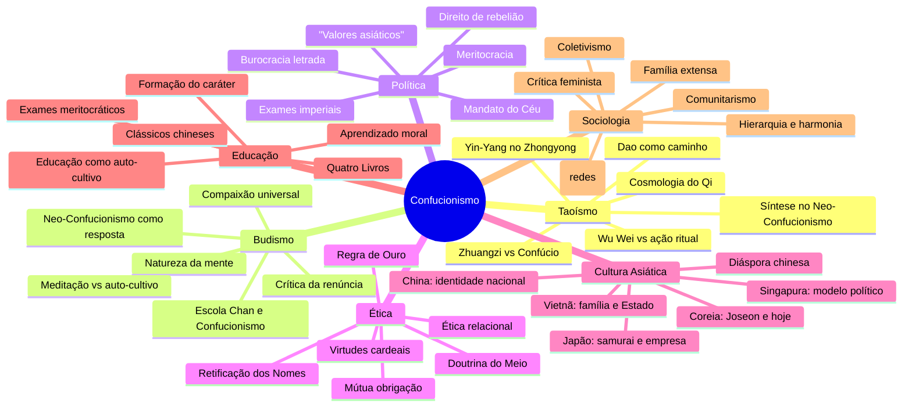
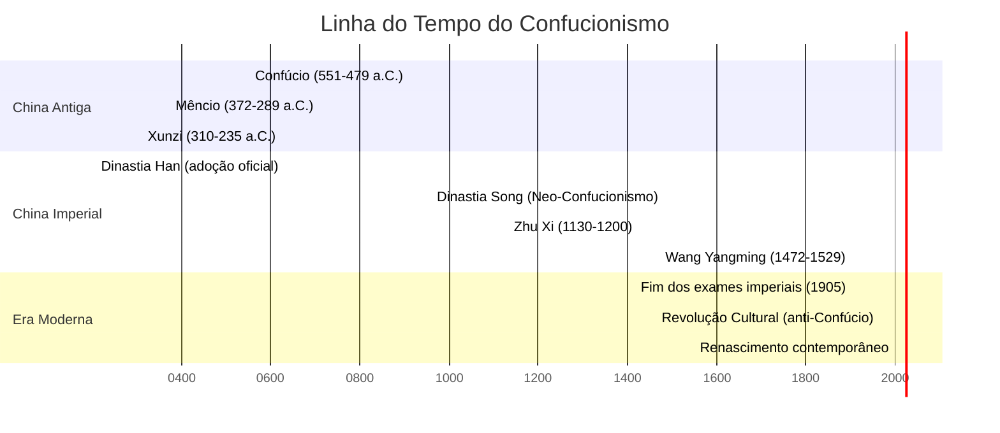

# Confucionismo

## 1. Introdução

### 1.1 O que é o Confucionismo?

O Confucionismo (ou **Ruismo** — 儒家, *Rújiā*, "Escola dos Eruditos") é um sistema filosófico, ético e político que se originou na China durante o **Período das Primaveras e Outonos** (771–476 a.C.). Diferentemente do que muitos no Ocidente supõem, o Confucionismo não é uma religião no sentido ocidental do termo: não possui um deus pessoal, nem uma igreja institucionalizada, nem clero, nem doutrina da salvação sobrenatural. Trata-se, antes, de uma **filosofia prática** centrada na vida terrena, nas relações humanas, na ordem social e na cultivação moral do indivíduo.

O termo "Confucionismo" foi cunhado por missionários jesuítas no século XVI, que latinizaram o nome **Kong Fuzi** (孔夫子, "Mestre Kong") para "Confúcio". Na China, o sistema sempre foi conhecido simplesmente como *Rújiā* — a escola dos letrados ou eruditos.

### 1.2 Kongzi (Confúcio) — 551–479 a.C.

Confúcio nasceu no estado de **Lu** (atualmente província de Shandong, leste da China) em uma família aristocrática empobrecida. Seu nome de família era **Kong Qiu** (孔丘), e seu nome de cortesia era **Zhongni** (仲尼). Desde jovem, demonstrou grande paixão pelo estudo dos ritos, da história e da música.

Sua biografia é relativamente modesta: serviu como funcionário público menor, curador de celeiros e supervisor de pastagens, antes de se tornar professor. Insatisfeito com a corrupção e a violência de sua época — um período de guerra e declínio moral dos reinos chineses —, Confúcio passou a viajar entre os estados feudais, oferecendo conselhos aos governantes sobre como restaurar a ordem e a harmonia por meio da virtude e do mérito.

Ele nunca obteve um cargo de alto escalão duradouro. Passou os últimos anos de sua vida de volta a Lu, ensinando um círculo de discípulos e compilando e editando os clássicos chineses. Morreu acreditando que havia fracassado. Seu legado, no entanto, transformaria a Ásia Oriental para sempre.

### 1.3 Os Analectos (Lunyu — 論語)

Os **Analectos** (*Lunyu*, "Diálogos Selecionados") são a principal fonte do pensamento de Confúcio. Trata-se de uma coleção de fragmentos, diálogos e aforismos compilados por seus discípulos e pelas gerações seguintes. O livro não é um tratado sistemático: é um registro vivo de conversas, observações e respostas a perguntas específicas.

O estilo é lacônico, elíptico e aberto a múltiplas interpretações. Um exemplo típico:

> "O Mestre disse: 'Não se aflija com o fato de as pessoas não o conhecerem; aflija-se por não conhecer as pessoas.'" (Analectos 1.16)

> "O Mestre disse: 'Aprender sem pensar é trabalho perdido; pensar sem aprender é perigoso.'" (Analectos 2.15)

Os Analectos foram por dois milênios o texto fundamental da educação chinesa e dos exames imperiais. Decorá-los era requisito para qualquer aspirante a funcionário público.

### 1.4 Influência na Ásia Oriental

O Confucionismo transcendeu a China e moldou profundamente toda a Ásia Oriental:

- **Coreia**: Introduzido já no período dos Três Reinos (século IV), tornou-se a ideologia oficial da Dinastia Joseon (1392–1910). O neoconfucionismo coreano, influenciado por Zhu Xi, produziu figuras como **Yi Hwang** (Toegye) e **Yi I** (Yulgok). Até hoje, valores confucionistas como respeito aos mais velhos e ênfase na educação permeiam a sociedade coreana.

- **Japão**: Introduzido via Coreia no século VI, o Confucionismo influenciou o código moral dos samurais (*Bushidô*). Durante o Período Edo (1603–1868), o neoconfucionismo de Zhu Xi foi adotado como ortodoxia oficial pelo Xogunato Tokugawa. O pensador **Ogyū Sorai** realizou uma importante releitura dos clássicos.

- **Vietnã**: O Confucionismo chegou durante a dominação chinesa (111 a.C.–939 d.C.) e tornou-se a base do sistema educacional e dos exames imperiais vietnamitas até o século XX. A influência é visível na estrutura familiar, no culto aos ancestrais e na burocracia estatal.

---

## 2. Conceitos Centrais

### 2.1 Ren (仁) — Humanidade, Benevolência, Bondade

*Ren* é a **virtude cardinal** do Confucionismo, a suma de todas as qualidades morais. O caractere chinês 仁 combina o radical "pessoa" (亻) com o numeral "dois" (二), indicando que a humanidade se realiza **na relação com o outro**. Não existe *Ren* no isolamento; ele é intrinsecamente relacional.

Confúcio define *Ren* de maneiras variadas nos Analectos:

> "Amar as pessoas." (Analectos 12.22)

> "Não faça aos outros o que não deseja para si mesmo." (Analectos 15.24) — a **Regra de Ouro** confucionista, anterior ao Cristianismo.

> "Dominar a si mesmo e retornar aos rituais (*li*) é *Ren*." (Analectos 12.1)

*Ren* não é um dom inato, mas algo que se cultiva ao longo da vida. Confúcio insistia que *Ren* estava ao alcance de qualquer pessoa que se esforçasse:

> "Está *Ren* longe? Quando desejo *Ren*, eis que *Ren* chega." (Analectos 7.30)

Mêncio, o grande herdeiro de Confúcio, desenvolveu a teoria de que todos os seres humanos possuem as **"quatro sementes"** (*siduan*) da virtude: compaixão, vergonha, deferência e discernimento moral, que, se cultivadas, levam a *Ren*, *Yi*, *Li* e *Zhi*.

### 2.2 Li (禮) — Rituais, Etiqueta, Normas Sociais

*Li* (禮) é o conceito que **externaliza** *Ren*. Se *Ren* é a virtude interna, *Li* é a expressão concreta dessa virtude no comportamento cotidiano. Abrange desde rituais religiosos (cerimônias aos ancestrais) até normas de etiqueta (como cumprimentar um superior, como servir chá, como sentar-se à mesa).

*Li* não é mero formalismo vazio. Confúcio ensinava que a prática correta dos rituais **molda o caráter**: ao agir de forma correta, a pessoa internaliza os valores que o ritual expressa.

> "Olhar sem *Li* é cegueira; ouvir sem *Li* é surdez; falar sem *Li* é traição; mover-se sem *Li* é crueldade." (Analectos 12.1)

Um exemplo paradigmático: Confúcio, quando servia como oficial, mudava expressão facial ao receber uma ordem do príncipe. Quando presenciava uma cerimônia, fazia questão de cada gesto. Sua atenção aos detalhes não era afetação — era a crença de que **a forma correta produz a substância correta**.

A crítica moderna ao *Li* é que ele pode se tornar opressivo e hierárquico. Confúcio, no entanto, alertava contra o excesso de formalismo:

> "Se uma pessoa não tem *Ren*, de que adianta os rituais?" (Analectos 3.3)

### 2.3 Xiao (孝) — Piedade Filial

*Xiao* (孝) é a **devoção e o respeito aos pais e ancestrais**. Na China confucionista, a piedade filial era considerada a raiz de todas as virtudes:

> "O estudioso que serve seus pais com piedade filial pode ser chamado de fundamento da virtude." (Clássico da Piedade Filial)

*Xiao* envolve:
- Cuidar dos pais na velhice
- Obedecê-los (dentro dos limites da retidão — *Yi*)
- Honrar sua memória após a morte
- Realizar os rituais ancestrais
- Não desonrar o nome da família

A piedade filial, no Confucionismo, não é cega. Confúcio ensinava que, se o pai erra, o filho deve **admoestá-lo com respeito**:

> "Servindo a seu pai, se ele não segue o Caminho, o filho deve admoestá-lo com deferência." (Analectos 4.18)

A ênfase em *Xiao* gerou críticas de que o Confucionismo sufoca a individualidade e perpetua hierarquias geracionais. Por outro lado, defende-se que ele fortalece os laços familiares e a coesão social.

### 2.4 Yi (義) — Retidão, Justiça, Dever Moral

*Yi* (義) é o senso de **retidão moral**, a capacidade de discernir o que é certo e agir de acordo com princípios éticos, independentemente do ganho pessoal. Confúcio distingue claramente entre o "homem superior" (*Junzi*), que age por *Yi*, e o "homem pequeno" (*Xiaoren*), que age por benefício (*Li* — lucro):

> "O homem superior compreende o que é correto (*Yi*); o homem inferior compreende o que é lucrativo." (Analectos 4.16)

Yi é o que **dá substância moral** às outras virtudes. Não basta ser benevolente (*Ren*) ou ritualmente correto (*Li*) se isso não estiver ancorado no compromisso com a justiça.

Mêncio (Mengzi) foi quem mais desenvolveu o conceito, argumentando que *Yi* é uma das quatro sementes inatas da virtude. Ele rejeitou a ideia de que o governante deve buscar apenas o benefício do Estado; o governante deve buscar o **reto**.

### 2.5 Zhi (智) — Sabedoria, Conhecimento

*Zhi* (智) é a **sabedoria prática** — a capacidade de aplicar o conhecimento moral nas situações concretas. Não se trata de erudição livresca, mas de discernimento.

Para Confúcio, o conhecimento verdadeiro é um **conhecimento moral e relacional**: conhecer alguém é saber como tratá-lo; conhecer uma situação é saber como agir nela.

> "Saber o que se sabe e saber o que não se sabe: isso é conhecimento." (Analectos 2.17)

Na hierarquia confucionista das virtudes, *Zhi* completa o conjunto: o homem sábio é aquele que cultiva *Ren*, pratica *Yi*, respeita *Li* e, com isso, adquire a capacidade de julgar corretamente.

### 2.6 Xin (信) — Confiança, Integridade, Honestidade

*Xin* (信) é a **confiança e a integridade** nas palavras e ações. O caractere combina "pessoa" (人) com "fala" (言), significando literalmente "uma pessoa de palavra".

> "Se um homem não tem confiança (*Xin*), não sei como pode funcionar." (Analectos 2.22)

É a virtude que sustenta as relações sociais e políticas: um governante sem *Xin* perde o direito de governar; um amigo sem *Xin* não é verdadeiramente amigo.

### 2.7 Junzi (君子) — O Homem Nobre / Superior

*Junzi* (君子) originalmente significava "filho do governante" (nobreza hereditária). Confúcio **transformou radicalmente** o termo, tornando-o uma categoria **moral**, não hereditária. Para Confúcio, *Junzi* é aquele que cultiva as virtudes, age por retidão (*Yi*), pratica a humanidade (*Ren*) e segue os rituais (*Li*).

Características do *Junzi*:
- Age por princípio, não por vantagem pessoal
- É justo, equânime e imparcial
- Cultiva o autoconhecimento e a humildade
- Não se apega cegamente a opiniões
- É consciente de suas limitações
- Aperfeiçoa-se continuamente

> "O homem superior é vagaroso no falar e rápido no agir." (Analectos 4.24)

Em oposição ao *Junzi* está o *Xiaoren* (小人), o "homem pequeno", que age por interesse, queixa-se, culpa os outros e não busca o autodesenvolvimento.

> "O homem superior é compreensivo, não partidário; o homem pequeno é partidário, não compreensivo." (Analectos 2.14)

---

## 3. As 5 Relações (Wulun — 五倫)

O Confucionismo é uma **ética relacional**. Não parte de um indivíduo abstrato, mas de **relações concretas** que definem quem somos. As *Cinco Relações* (Wulun) são os eixos fundamentais da vida social:

### 3.1 Soberano — Súdito

- **Virtudes**: Lealdade (*Zhong* 忠) e Justiça (*Yi* 義)
- **Mútua obrigação**: O soberano deve governar com benevolência (*Ren*); o súdito deve servir com lealdade. Não é uma via de mão única: se o soberano for tirânico, o povo tem o direito de se rebelar (Mêncio).
- **Reflexão moderna**: O que significa lealdade em uma democracia? Em uma empresa? O soberano hoje pode ser o Estado, o chefe, a instituição.

### 3.2 Pai — Filho

- **Virtudes**: Amor e Piedade Filial (*Xiao* 孝)
- **Mútua obrigação**: O pai ama e educa; o filho respeita e cuida na velhice. A autoridade parental é contrabalançada pelo dever de admoestação respeitosa.
- **Reflexão moderna**: Como equilibrar autonomia individual e respeito aos pais em uma cultura ocidentalizada?

### 3.3 Marido — Mulher

- **Virtudes**: Respeito e Harmonia
- **Mútua obrigação**: O marido deve respeitar a esposa; a esposa deve apoiar o marido. A tradição confucionista clássica era patriarcal, mas textos como os *Analectos* sugerem uma relação mais equilibrada do que a prática posterior estabeleceu.
- **Reflexão moderna**: Esta é a relação mais criticada do sistema confucionista. O movimento feminista asiático tem trabalhado para reinterpretar ou rejeitar a hierarquia de gênero confucionista.

### 3.4 Irmão mais Velho — Irmão mais Novo

- **Virtudes**: Ordem e Fraternidade
- **Mútua obrigação**: O mais velho protege e guia; o mais novo respeita e segue. A ordem não é opressão: é a ideia de que a harmonia requer estrutura.
- **Reflexão moderna**: Em famílias contemporâneas, essa relação perdeu força, mas ainda ressoa em culturas asiáticas.

### 3.5 Amigo — Amigo

- **Virtudes**: Confiança (*Xin* 信) e Lealdade
- **Mútua obrigação**: Esta é a única relação entre iguais no sistema confucionista. A amizade é baseada na confiança e na retidão, e não no interesse.
- **Reflexão moderna**: A amizade como relação ética fundamental — sem hierarquia, pura confiança.

> "Que o soberano seja soberano, o súdito súdito, o pai pai, o filho filho." (Analectos 12.11) — **Retificação dos Nomes** aplicada às 5 Relações.

As 5 Relações não são simples hierarquias de poder. Cada relação envolve **mútua obrigação**: o superior deve ser virtuoso, ou perde a legitimidade. O Confucionismo não é um mero sistema de obediência cega.

---

## 4. A Escola de Confúcio

### 4.1 Mêncio (Mengzi — 孟子, 372–289 a.C.)

Mêncio é o segundo maior nome do Confucionismo, depois do próprio Confúcio. Sua grande contribuição foi a **teoria da natureza humana boa** (*Xing Shan* 性善):

- Todos os seres humanos nascem com as **quatro sementes** (*Si Duan* 四端):
  1. **Compaixão** — leva a *Ren*
  2. **Vergonha** — leva a *Yi*
  3. **Deferência** — leva a *Li*
  4. **Discernimento** — leva a *Zhi*

- Essas sementes são como brotos que **precisam ser cultivados**. O mal não é inato — é o resultado do não cultivo.

- Mêncio defendia o **direito de rebelião** contra tiranos. Se o governante perde o Mandato do Céu (*Tianming*) por sua má conduta, o povo pode depô-lo.

- Discutiu com os **utilitaristas** (escola de Mozi) e os **egoístas** (Yang Zhu), argumentando que a natureza humana tende naturalmente ao bem.

- Exemplo famoso: todos, ao ver uma criança prestes a cair em um poço, sentiriam **comoção e alarme** — essa reação espontânea prova que a compaixão é inata.

### 4.2 Xunzi (荀子, 310–235 a.C.)

Xunzi foi o **grande opositor de Mêncio** dentro do Confucionismo. Para ele, a **natureza humana é má** (*Xing E* 性恶):

- O ser humano nasce com desejos e impulsos que, se não controlados, levam ao conflito e ao caos.
- A **educação** e os **rituais** (*Li*) são necessários para refrear e transformar a natureza humana.
- O céu (*Tian*) não é uma força moral — é um processo natural indiferente.
- A autoridade do governante é fundamental para a ordem social.

Xunzi influenciou fortemente o **Legalismo** chinês (através de seu discípulo Han Feizi) e também o neo-confucionismo posterior. Sua ênfase no estudo e na disciplina ressoa até a educação asiática contemporânea.

### 4.3 Neo-Confucionismo (Song-Ming)

O Neo-Confucionismo é um movimento de **renovação e síntese** que surgiu durante a Dinastia Song (960–1279), em resposta aos desafios do Budismo e do Taoísmo. Seus principais expoentes:

#### Zhu Xi (朱熹, 1130–1200)

- Principal figura do Neo-Confucionismo. Sintetizou as ideias confucionistas com elementos cosmológicos budistas e taoístas.
- Desenvolveu a teoria do **Princípio** (*Li* 理) e da **Força Material** (*Qi* 氣): o *Li* é a estrutura racional do universo; o *Qi* é a energia que a concretiza.
- Enfatizou o **estudo dos clássicos** e a "investigação das coisas" (*Gewu* 格物) como caminho para o auto-cultivo.
- Seus comentários aos Quatro Livros tornaram-se a ortodoxia dos exames imperiais por 600 anos.

#### Wang Yangming (王阳明, 1472–1529)

- O grande **dissidente** do Neo-Confucionismo. Rejeitou a ênfase de Zhu Xi no estudo externo.
- Defendeu a **unidade do conhecimento e da ação** (*Zhi Xing He Yi* 知行合一): conhecer o bem é fazer o bem.
- Acreditava que o princípio (*Li*) está **na mente humana** (*Xin* 心), não nas coisas externas.
- Sua filosofia influenciou os samurais japoneses e revolucionários chineses como Sun Yat-sen.

### 4.4 Confucionismo Imperial

A partir da Dinastia Han (206 a.C.–220 d.C.), o Confucionismo tornou-se a **ideologia oficial do Estado chinês**:

- **Exames imperiais** (*Keju* 科舉): sistema meritocrático baseado no domínio dos clássicos confucionistas. Qualquer homem, independentemente de origem, podia se tornar funcionário público se passasse nos exames.
- **Burocracia letrada**: a elite governante chinesa era formada por eruditos confucionistas, não por nobres hereditários.
- **Síncrese com outras tradições**: embora oficial, o Confucionismo coexiste com Budismo e Taoísmo na vida religiosa chinesa.

O Confucionismo imperial foi abolido oficialmente com a queda da Dinastia Qing em 1911, mas sua influência persiste.

---

## 5. Educação e Auto-Cultivo

### 5.1 O Aprendizado como Caminho Moral

Para Confúcio, **aprender não é acumular informação** — é transformar o caráter. O aprendizado (*Xue* 學) é o processo pelo qual a pessoa se torna plenamente humana.

> "O Mestre disse: 'A única coisa que me preocupa é não cultivar a virtude, não aprofundar o aprendizado, não ser capaz de me manter na retidão ao ouvir o que é justo, e não ser capaz de corrigir meus defeitos.'" (Analectos 7.3)

### 5.2 Os Quatro Livros (*Si Shu* — 四書)

Durante o período neo-confucionista (Dinastia Song), Zhu Xi selecionou **quatro textos** como o núcleo do currículo educacional confucionista:

1. **Os Analectos** (*Lunyu*): os diálogos de Confúcio com seus discípulos.

2. **O Livro de Mêncio** (*Mengzi*): os ensinamentos do segundo grande mestre confucionista.

3. **A Grande Aprendizagem** (*Daxue*): originalmente um capítulo do *Livro dos Ritos*, apresenta o programa de auto-cultivo que vai do indivíduo ao império:
   - Cultivar a si mesmo → regular a família → governar o Estado → pacificar o mundo.

4. **A Doutrina do Meio** (*Zhongyong*): atribuída ao neto de Confúcio, Zisi, trata do equilíbrio e da harmonia como fundamentos cósmicos e éticos.

### 5.3 Retificação dos Nomes (*Zheng Ming* — 正名)

*Zheng Ming* é a doutrina de que **cada pessoa deve agir conforme seu papel e seu título**. Confúcio acreditava que o caos social surge quando as pessoas não correspondem às suas designações:

> "Que o soberano seja soberano, o súdito seja súdito, o pai seja pai, o filho seja filho." (Analectos 12.11)

Isso significa: se você é chamado de "pai", aja como pai — ame, eduque, proteja. Se você é chamado de "governante", governe com justiça. Não basta ter o título; é preciso **realizar** o papel.

A retificação dos nomes não é uma defesa do status quo. É uma **exigência ética**: se o título não corresponde à ação, o título perde o sentido. É um princípio de autenticidade e responsabilidade.

### 5.4 A Doutrina do Meio (*Zhongyong* — 中庸)

O *Zhongyong* é um dos textos mais sutis do Confucionismo. "Meio" (*Zhong*) não é mediocridade, mas **equilíbrio dinâmico** — a capacidade de agir com moderação e justeza em todas as situações.

Princípios-chave:
- Evitar extremos
- Buscara harmonia entre os contrários
- Agir sem excesso nem falta
- O equilíbrio como manifestação da virtude

> "O Meio é o fundamento do mundo; a harmonia é o caminho universal do mundo." (Doutrina do Meio, 1)

Na prática, o *Zhongyong* não significa ausência de paixão, mas a capacidade de **expressar emoções no momento certo, na medida certa, pela razão certa**.

---

## 6. Críticas e Legado

### 6.1 Crítica Feminista: O Confucionismo é Patriarcal?

Sim, em sua maior parte. A sociedade chinesa tradicional era rigidamente patriarcal, e o Confucionismo foi usado para justificar:

- Subordinação da mulher ao pai, ao marido e ao filho (as **três obediências**)
- Exclusão das mulheres dos exames imperiais e da vida pública
- Casamento arranjado e ênfase na linhagem masculina
- O culto aos ancestrais como privilégio masculino

Críticas contemporâneas:
- **Li (Lisa) Rofel**: mostra como o Confucionismo foi ressignificado no período pós-Mao para construir uma nova "essência" chinesa que ainda exclui a mulher.
- **The-ri Cheng**: argumenta que o Confucionismo clássico é mais flexível do que o neo-confucionismo imperial — o próprio Confúcio não excluiu mulheres de seu ensino.
- **Reinterpretações**: há estudiosas confucionistas feministas que buscam recuperar o potencial igualitário do *Ren* (humanidade compartilhada) contra a hierarquia patriarcal.

O Confucionismo pode ser reformado? A pergunta permanece em aberto.

### 6.2 Autoritarismo Confucionista

Críticos apontam que o Confucionismo serviu de base ideológica para **regimes autoritários** na Ásia:

- **Coreia do Sul (Park Chung-hee, 1961–1979)**: o governo usou o discurso confucionista de ordem, hierarquia e lealdade para justificar o desenvolvimento econômico sob ditadura.
- **Singapura (Lee Kuan Yew)**: o "modelo singapuriense" invocou valores confucionistas (disciplina, obediência à autoridade, coletivismo) como alternativa à democracia liberal ocidental. A tese dos "valores asiáticos" foi amplamente criticada como justificativa para repressão política.
- **China contemporânea**: o Partido Comunista Chinês, após décadas de condenação do Confucionismo como "feudal", passou a reabilitá-lo como parte do "sonho chinês" e como ideologia de harmonia social e lealdade ao Estado.

Lee Kuan Yew argumentava que "a sociedade asiática valoriza o grupo acima do indivíduo" — uma afirmação controversa que muitos consideram uma **essencialização** cultural.

### 6.3 O "Capitalismo Confucionista"

A tese do "capitalismo confucionista" (ou "capitalismo asiático") sustentou que o rápido desenvolvimento econômico do Leste Asiático (Japão, Coreia, Taiwan, Hong Kong, Singapura, depois China) se devia, em parte, a **valores confucionistas**:

- Ética do trabalho e disciplina
- Ênfase na educação e no mérito
- Lealdade à empresa e ao grupo
- Poupança e visão de longo prazo
- Redes de confiança (*guanxi*)

Críticas a essa tese:
- O desenvolvimento econômico pode ser explicado por fatores estruturais (Estado desenvolvimentista, geopolítica da Guerra Fria, investimento estrangeiro), não por "essência cultural".
- Valores "confucionistas" foram **inventados ou seletivamente enfatizados** para legitimar políticas econômicas.
- O Japão pré-industrial, confucionista, não se desenvolveu — foram **condições modernas** que ativaram certos valores.

### 6.4 Renascimento Confucionista no Século XXI

Desde os anos 2000, o Confucionismo experimenta um **renascimento global**:

- **Na China**: O governo promove institutos Confúcio no exterior (embora controversos), reabilita Confúcio como símbolo nacional, e incentiva o estudo dos clássicos nas escolas.
- **Acadêmico**: O "Confucionismo político" de **Jiang Qing** propõe uma câmara alta confucionista no sistema político chinês. **Daniel A. Bell** defende que valores confucionistas podem contribuir para uma teoria de direitos humanos e democracia.
- **Popular**: Cursos de leitura dos Analectos, livros de autoajuda baseados em Confúcio, e um interesse renovado nos rituais tradicionais (casamento, funerais, culto aos ancestrais).
- **Global**: Filósofos ocidentais como **Michael Sandel** dialogam com o Confucionismo sobre comunitarismo e virtude cívica.

O Confucionismo sobreviveu ao colapso do império, à Revolução Cultural, à modernização e à globalização. Sua capacidade de adaptação é talvez sua maior força.

---

## 7. Comparações

### 7.1 Confucionismo vs Estoicismo

| Aspecto | Confucionismo | Estoicismo |
|---------|--------------|------------|
| **Origem** | China (séc. VI a.C.) | Grécia/Roma (séc. III a.C.) |
| **Virtude central** | *Ren* (humanidade benevolente) | *Arete* (excelência racional) |
| **Foco** | Relações sociais e harmonia | Autocontrole e aceitação do destino |
| **Natureza humana** | Potencialmente boa (Mêncio) ou má (Xunzi) | Racional (capaz de virtude) |
| **Emoções** | Devem ser expressas no tempo e medida certa (*Zhongyong*) | Devem ser controladas pela razão (*apatheia*) |
| **Sociedade** | Engajamento ativo (servir ao Estado) | Cosmopolitismo; engajamento opcional |
| **Figura ideal** | *Junzi* (homem nobre, culto e virtuoso) | *Sábio estoico* (racional, imperturbável) |

**Semelhanças**: ambas são filosofias práticas centradas na virtude; ambas enfatizam o dever e a autodisciplina; ambas rejeitam o hedonismo.

**Diferenças**: o Estoicismo é mais individualista e cosmopolita; o Confucionismo é radicalmente relacional e enraizado em papéis sociais concretos.

### 7.2 Confucionismo vs Budismo

| Aspecto | Confucionismo | Budismo |
|---------|--------------|---------|
| **Realidade última** | O Dao (Caminho) na vida social | Vazio (*Sunyata*), Nirvana |
| **Foco** | Esta vida, este mundo | Transcendência do sofrimento |
| **Sociedade** | Engajamento ativo | Renúncia (monaquismo) |
| **Família** | Central, base da ética | Obstáculo à iluminação (monges celibatários) |
| **Virtude** | *Ren, Yi, Li, Zhi, Xin* | Compaixão (*Karuna*), Sabedoria (*Prajna*) |
| **Rituais** | Essenciais (*Li*) | Meditativos, devocionais |
| **Natureza do eu** | Relacional (não existe eu isolado) | Inexistência do eu fixo (*Anatman*) |
| **Pós-vida** | Culto aos ancestrais, não teologia | Renascimento, Karma |

O Confucionismo e o Budismo coexistiram na China por dois milênios com tensão e síntese. O Neo-Confucionismo é, em grande parte, uma **resposta confucionista ao Budismo** — incorporando sua profundidade metafísica e rejeitando sua renúncia ao mundo social.

O confucionista e o monge representam dois ideais opostos: o **engajamento total** na família e no Estado versus a **renúncia total** ao mundo. Ambos, no entanto, compartilham a ênfase na compaixão e no cultivo moral.

### 7.3 Confucionismo vs Ocidente (Individualismo vs Coletivismo)

| Aspecto | Confucionismo | Ocidente Liberal |
|---------|--------------|------------------|
| **Indivíduo** | Relacional; definido por papéis | Autônomo; anterior à sociedade |
| **Sociedade** | Hierarquia natural; harmonia | Contrato social; competição |
| **Direitos** | Subordinados ao dever | Fundamentais e inalienáveis |
| **Liberdade** | Liberdade responsável | Liberdade individual |
| **Justiça** | Distributiva; cada um conforme seu papel | Procedimental; igualdade formal |
| **Governo** | Meritocracia de sábios | Democracia representativa |
| **Lei** | Moral internalizada (*Li* > lei) | Lei positiva e impessoal |

**O que o Confucionismo pode oferecer ao Ocidente**:
- Uma crítica ao individualismo excessivo e à atomização social
- Uma ênfase na responsabilidade familiar e comunitária
- A ideia de que a educação é formação moral, não apenas técnica

**O que o Ocidente pode oferecer ao Confucionismo**:
- A crítica dos direitos humanos à hierarquia opressiva
- O feminismo e a igualdade de gênero
- A liberdade de expressão e a democracia

O diálogo não é sobre qual sistema é "superior", mas sobre como cada um pode **aprender com o outro** para enfrentar os desafios do século XXI.

---

## 8. Exercícios Práticos

### 8.1 Analise as 5 Relações na Sua Vida

Em uma tabela, liste cada uma das cinco relações na sua vida atual e avalie:

| Relação | Pessoa(s) | Como funciona? | Está saudável? | O que melhorar? |
|---------|-----------|---------------|----------------|-----------------|
| Soberano-súdito | Chefe / Estado | Hierarquia formal | ? | ? |
| Pai-filho | Pais / filhos | Cuidado, respeito | ? | ? |
| Marido-mulher | Cônjuge / parceiro | Parceria, respeito | ? | ? |
| Irmão mais velho-mais novo | Irmãos | Apoio mútuo | ? | ? |
| Amigo-amigo | Amigos | Confiança, lealdade | ? | ? |

**Pergunta central**: Em qual dessas relações a **mútua obrigação** (e não a hierarquia unilateral) está mais forte? Em qual está mais fraca?

### 8.2 Retificação dos Nomes

Liste seus principais **papéis** (profissional, familiar, social) e avalie:

1. **Qual é o nome/título do seu papel?** (ex.: "pai", "gestor", "amigo", "estudante")
2. **O que esse papel exige eticamente?** (quais deveres?)
3. **Você age de acordo com o que o título promete?**

**Exemplo**:
- Papel: "Professor"
- Exigências: preparar bem as aulas, ouvir os alunos, ser justo, inspirar
- Autoavaliação: "Às vezes preparo as aulas em cima da hora. Preciso melhorar."

**Reflexão**: Se você não age conforme o título, o título perde o sentido — e a confiança social se rompe.

### 8.3 A Doutrina do Meio Aplicada a um Dilema

Escolha um dilema real ou hipotético:

> "Preciso ajudar um colega de trabalho que está sobrecarregado, mas se eu ajudar, ficarei sobrecarregado também. O que fazer?"

Aplique o *Zhongyong*:
1. **Identifique os extremos**: (a) não ajudar nunca vs (b) ajudar sempre e se sacrificar.
2. **Busque o meio virtuoso**: ajudar na medida do possível, estabelecer limites, oferecer apoio sem auto-sacrifício completo.
3. **Avalie o contexto**: qual é a relação com o colega? Qual a urgência? Qual a cultura da empresa?
4. **Aja com equilíbrio**: a decisão não é "tudo ou nada", mas uma gradação.

**Pratique** com três dilemas diferentes ao longo da semana. Anote como o "meio" se parece em cada situação.

### 8.4 Leitura e Reflexão sobre um Trecho dos Analectos

Leia o trecho abaixo e reflita:

> "O Mestre disse: 'Aprender sem pensar é trabalho perdido; pensar sem aprender é perigoso.'" (Analectos 2.15)

**Perguntas para reflexão**:
1. O que Confúcio quer dizer com "aprender sem pensar"? Dê um exemplo da sua vida.
2. E "pensar sem aprender"? Quando você já pensou demais sem ter informação suficiente?
3. Como encontrar o equilíbrio entre ação reflexiva e reflexão sem ação?
4. Essa máxima se aplica ao seu trabalho/estudo atual?

**Outro trecho sugerido**:

> "O Mestre disse: 'Não desejo nada além de, ao fim do dia, ter um coração sem culpa.'" (Analectos 4.37)

> "O Mestre disse: 'O homem superior é lento no falar e rápido no agir.'" (Analectos 4.24)

### 8.5 Compare uma Virtude Confucionista com uma Virtude Ocidental

Escolha uma virtude confucionista e compare com uma virtude de uma tradição ocidental:

**Exemplo**: *Ren* (benevolência) vs *Caritas* (amor cristão)

| Aspecto | *Ren* | *Caritas* |
|---------|-------|-----------|
| **Fonte** | Cultivo moral pessoal | Graça divina |
| **Alcance** | Gradual: família → sociedade → mundo | Universal: amar o próximo e o inimigo |
| **Expressão** | Rituais (*Li*), respeito aos papéis | Caridade, perdão, sacrifício |
| **Fundamento** | Natureza humana compartilhada | Parentesco divino (todos são filhos de Deus) |

**Tente com outras combinações**:
- *Yi* (retidão) vs Justiça aristotélica
- *Xiao* (piedade filial) vs Dever kantiano
- *Zhi* (sabedoria) vs *Phronesis* aristotélica
- *Xin* (confiança) vs Honra romana (*Fides*)

### 8.6 Diário de Cultivo Confucionista

Mantenha um diário por uma semana com as seguintes seções diárias:

1. **Ren**: Aja com benevolência hoje. Registre um ato concreto de bondade que você realizou.
2. **Li**: Observe um ritual ou norma social que você seguiu. Que sentimento isso produziu?
3. **Xiao**: Que gesto de respeito você teve por seus pais ou ancestrais?
4. **Yi**: Você agiu por retidão ou por conveniência? Registre um dilema moral.
5. **Zheng Ming**: Você agiu de acordo com seus papéis hoje? Onde falhou?

### 8.7 Simulação: Conselho a um Governante

Imagine que você é um conselheiro confucionista de um governante (pode ser um presidente, CEO, reitor, etc.). Ele pede conselhos sobre:

1. Como lidar com a corrupção no governo?
2. Como educar a próxima geração de líderes?
3. Como equilibrar crescimento econômico e bem-estar social?

**Responda** usando os conceitos confucionistas: *Ren, Li, Yi, Zheng Ming, Zhongyong, Wulun*.

**Exemplo** (corrupção):
> "Soberano, a corrupção nasce quando os oficiais buscam o lucro (*Li* econômico) em vez da retidão (*Yi*). É preciso restaurar a Retificação dos Nomes: que cada cargo seja ocupado por quem realmente merece — não por conexões, mas por mérito moral e competência. Estabeleça rituais de transparência (*Li*) e punições justas. E, acima de tudo, o soberano deve dar o exemplo: se o governante é íntegro, quem ousará ser corrupto?"

### 8.8 Glossário Prático

| Termo | Chinês | Pronúncia aproximada | Significado |
|-------|--------|---------------------|-------------|
| Ren | 仁 | rén | Humanidade, benevolência |
| Li | 禮 | lǐ | Rituais, normas sociais |
| Xiao | 孝 | xiào | Piedade filial |
| Yi | 義 | yì | Retidão, justiça |
| Zhi | 智 | zhì | Sabedoria |
| Xin | 信 | xìn | Confiança, integridade |
| Junzi | 君子 | jūn zǐ | Homem nobre/superior |
| Xiaoren | 小人 | xiǎo rén | Homem pequeno/inferior |
| Dao | 道 | dào | Caminho |
| De | 德 | dé | Virtude, poder moral |
| Wen | 文 | wén | Cultura, letramento |
| Zhong | 忠 | zhōng | Lealdade |
| Shu | 恕 | shù | Reciprocidade, empatia |
| Tian | 天 | tiān | Céu, natureza |
| Tianming | 天命 | tiān mìng | Mandato do Céu |
| Zhengming | 正名 | zhèng míng | Retificação dos nomes |
| Zhongyong | 中庸 | zhōng yōng | Doutrina do Meio |
| Wulun | 五倫 | wǔ lún | Cinco relações |
| Siduan | 四端 | sì duān | Quatro sementes da virtude |
| Keju | 科舉 | kē jǔ | Exames imperiais |
| Qi | 氣 | qì | Energia vital |
| Li (princípio) | 理 | lǐ | Princípio, padrão |

---

## 9. Cross-Mapping

```mermaid
flowchart TD
    A[Confucionismo] --> B[Conceitos Centrais]
    A --> C[5 Relações]
    A --> D[Escola e História]
    A --> E[Educação]

    B --> B1[Ren: benevolência]
    B --> B2[Li: rituais]
    B --> B3[Xiao: piedade filial]
    B --> B4[Yi: retidão]
    B --> B5[Zhi: sabedoria]
    B --> B6[Xin: confiança]
    B --> B7[Junzi: homem nobre]

    C --> C1[Soberano-Súdito]
    C --> C2[Pai-Filho]
    C --> C3[Marido-Mulher]
    C --> C4[Irmão + / Irmão -]
    C --> C5[Amigo-Amigo]

    D --> D1[Confúcio . 551-479 a.C.]
    D --> D2[Mêncio . natureza boa]
    D --> D3[Xunzi . natureza má]
    D --> D4[Neo-Confucionismo]
    D --> D5[Confucionismo Imperial]

    D4 --> D4a[Zhu Xi . racionalismo]
    D4 --> D4b[Wang Yangming . intuição]

    E --> E1[Os Quatro Livros]
    E --> E2[Retificação dos Nomes]
    E --> E3[Doutrina do Meio]
```

---

## 10. Referências

### Fontes Primárias

- **CONFÚCIO**. *Os Analectos*. Tradução de D. C. Lau. Penguin Classics, 1979. / Tradução de Roger T. Ames e Henry Rosemont Jr. Ballantine Books, 1998.
- **MÊNCIO**. *Mencius*. Tradução de D. C. Lau. Penguin Classics, 1970.
- **XUNZI**. *Xunzi: Basic Writings*. Tradução de Burton Watson. Columbia University Press, 2003.
- **ZHU XI**. *Learning to Be a Sage: Selections from the Conversations of Master Chu, Arranged Topically*. Tradução de Daniel K. Gardner. University of California Press, 1990.
- **WANG YANGMING**. *Instructions for Practical Living and Other Neo-Confucian Writings*. Tradução de Wing-tsit Chan. Columbia University Press, 1963.

### Estudos Clássicos

- **CHAN, Wing-tsit**. *A Source Book in Chinese Philosophy*. Princeton University Press, 1963.
- **CREEL, Herrlee G. *Confucius and the Chinese Way*. Harper & Row, 1949.
- **FUNG, Yu-lan**. *A History of Chinese Philosophy* (2 vols). Princeton University Press, 1952–53.
- **GRAHAM, A. C. *Disputers of the Tao: Philosophical Argument in Ancient China*. Open Court, 1989.
- **SCHWARTZ, Benjamin I. *The World of Thought in Ancient China*. Harvard University Press, 1985.

### Estudos Contemporâneos

- **AMES, Roger T. & ROSEMONT, Henry Jr. *The Analects of Confucius: A Philosophical Translation*. Ballantine, 1998. [Tradução e comentário filosófico]
- **BELL, Daniel A. *China's New Confucianism: Politics and Everyday Life in a Changing Society*. Princeton University Press, 2008.
- **BELL, Daniel A. *The China Model: Political Meritocracy and the Limits of Democracy*. Princeton University Press, 2015.
- **BERLING, Judith A. *Understanding Confucianism*. Duncan Baird Publishers, 2005.
- **CHENG, Anne. *História do Pensamento Chinês*. Vozes, 2008. [Em português]
- **CSÍKSZENTMIHÁLYI, Mihaly & NAKAMURA, Junko. "Confucius and Happiness" em *The Oxford Handbook of Happiness*. OUP, 2013.
- **DE BARY, Wm. Theodore. *The Trouble with Confucianism*. Harvard University Press, 1991.
- **ELMAN, Benjamin A. *A Cultural History of Civil Examinations in Late Imperial China*. University of California Press, 2000.
- **GOLDMAN, Merle (org.). *The Harvard Contemporary China Series: Reform and Reaction in Post-Mao China*. Harvard, 1991.
- **HALL, David L. & AMES, Roger T. *Thinking Through Confucius*. SUNY Press, 1987.
- **IVANHOE, Philip J. *Confucian Moral Self Cultivation*. 2ª ed. Hackett, 2000.
- **JENSEN, Lionel M. *Manufacturing Confucianism: Chinese Traditions and Universal Civilization*. Duke University Press, 1997.
- **LI, Chenyang. *The Confucian Philosophy of Harmony*. Routledge, 2014.
- **LIU, JeeLoo. *An Introduction to Chinese Philosophy: From Ancient Philosophy to Chinese Buddhism*. Blackwell, 2006.
- **NIVISON, David S. *The Ways of Confucianism: Investigations in Chinese Philosophy*. Open Court, 1996.
- **NUSSBAUM, Martha. *The Fragility of Goodness: Luck and Ethics in Greek Tragedy and Philosophy*. Cambridge University Press, 1986. [Para comparação com ética grega]
- **PUETT, Michael. *The Ambivalence of Creation: Debates Concerning Innovation and Artifice in Early China*. Stanford University Press, 2001.
- **ROFEL, Lisa. *Desiring China: Experiments in Neoliberalism, Sexuality, and Public Culture*. Duke University Press, 2007.
- **ROSEMONT, Henry Jr. *A Chinese Mirror: Moral Reflections on Political Economy and Society*. Open Court, 1991.
- **ROSEMONT, Henry Jr. *Against Individualism: A Confucian Rethinking of the Foundations of Morality, Politics, Family, and Religion*. Lexington Books, 2015.
- **SANDEL, Michael. *Democracy's Discontent: America in Search of a Public Philosophy*. Harvard University Press, 1996. [Diálogo com comunitarismo]
- **SUN, Anna. *Confucianism as a World Religion: Contested Histories and Contemporary Realities*. Princeton University Press, 2013.
- **TU, Wei-Ming. *Confucian Thought: Selfhood as Creative Transformation*. SUNY Press, 1985.
- **TU, Wei-Ming. *Way, Learning, and Politics: Essays on the Confucian Intellectual*. SUNY Press, 1993.
- **TU, Wei-Ming (org.). *Confucian Traditions in East Asian Modernity: Moral Education and Economic Culture in Japan and the Four Mini-Dragons*. Harvard University Press, 1996.
- **YANG, C. K. *Religion in Chinese Society: A Study of Contemporary Social Functions of Religion and Some of Their Historical Factors*. University of California Press, 1961.
- **YAO, Xinzhong. *An Introduction to Confucianism*. Cambridge University Press, 2000.

### Artigos e Recursos Online

- **Stanford Encyclopedia of Philosophy**: "Confucius" (entry by Jeffrey Riegel), "Mencius", "Xunzi", "Neo-Confucianism".
- **Internet Encyclopedia of Philosophy**: "Confucius", "Chinese Philosophy".
- **China Heritage Quarterly**: publicação da Australian National University sobre estudos clássicos chineses.
- **Journal of Chinese Philosophy**: periódico acadêmico com artigos sobre filosofia confucionista.
- **Dao: A Journal of Comparative Philosophy**: periódico acadêmico com foco em filosofia chinesa comparada.

---

## Notas Finais

O Confucionismo não é um sistema monolítico ou estático. Ele é um **campo de debates** — entre Mêncio e Xunzi, entre Zhu Xi e Wang Yangming, entre tradicionalistas e reformistas, entre feministas e conservadores. Essa vitalidade interna é justamente o que permitiu ao Confucionismo sobreviver por 2.500 anos.

Ao estudar Confucionismo, o estudante ocidental deve evitar duas armadilhas:
1. **Exotizar**: pensar que o Confucionismo é "misterioso" ou "inscrutável" — é uma filosofia perfeitamente inteligível que dialoga com problemas humanos universais.
2. **Colonizar**: reduzir o Confucionismo a uma versão inferior de filosofias ocidentais — ele tem insights originais que o Ocidente ainda não alcançou.

O melhor caminho é o **diálogo genuíno**: entre Oriente e Ocidente, entre tradição e modernidade, entre dever e liberdade. Como o próprio Confúcio disse:

> "O Mestre disse: 'O aprendizado não tem fim.'" (Analectos, passim)

---

*Este documento foi criado como material de estudo e referência sobre o Confucionismo. Revisões e acréscimos são bem-vindos.*

[[04-Conhecimentos/07-Humanidades/Religiao/INDEX|← Voltar ao índice de Religião]]
