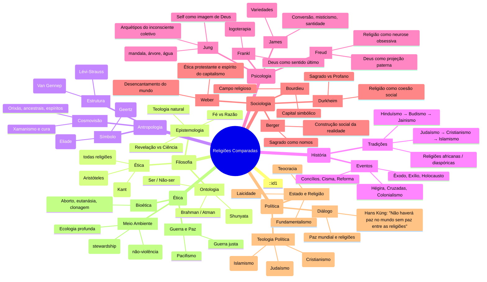
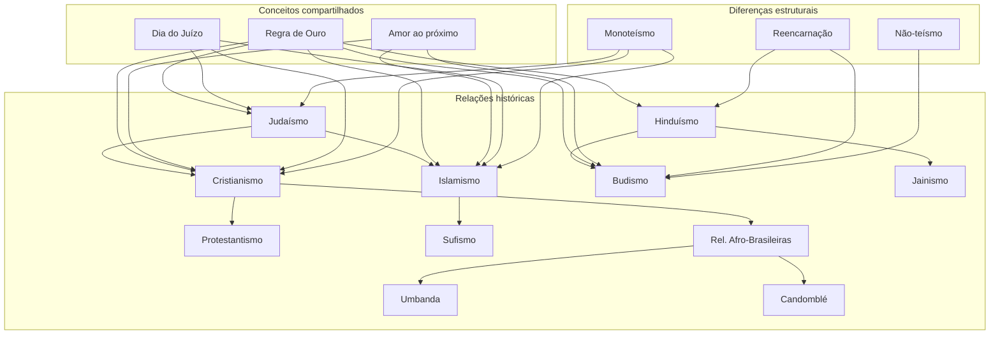

# Religiões Comparadas

## Sumário

1. [Introdução](#1-introdução)
2. [Cristianismo](#2-cristianismo)
3. [Islamismo](#3-islamismo)
4. [Hinduísmo](#4-hinduísmo)
5. [Judaísmo](#5-judaísmo)
6. [Budismo](#6-budismo)
7. [Religiões Africanas Tradicionais](#7-religiões-africanas-tradicionais)
8. [Xamanismo e Tradições Indígenas](#8-xamanismo-e-tradições-indígenas)
9. [Novos Movimentos Religiosos](#9-novos-movimentos-religiosos)
10. [Ateísmo, Agnosticismo e Humanismo Secular](#10-ateísmo-agnosticismo-e-humanismo-secular)
11. [Tabelas Comparativas](#11-tabelas-comparativas)
12. [Cross-Mapping Interdisciplinar](#12-cross-mapping-interdisciplinar)
13. [Exercícios e Reflexões](#13-exercícios-e-reflexões)
14. [Referências](#14-referências)

---

## 1. Introdução

### 1.1 O que é religião?

Definir "religião" é uma tarefa complexa. O termo vem do latim *religare* (religar) ou *relegere* (reler, tratar com cuidado). Ao longo da história, pensadores propuseram definições concorrentes:

- **Émile Durkheim** (*As Formas Elementares da Vida Religiosa*, 1912): "Religião é um sistema solidário de crenças e práticas relativas a coisas sagradas, isto é, separadas, proibidas, crenças e práticas que unem em uma mesma comunidade moral, chamada Igreja, todos os que a ela aderem." Para Durkheim, a religião é um fenômeno social que reflete a estrutura da sociedade.

- **Mircea Eliade** (*O Sagrado e o Profano*, 1957): Religião é a experiência do *sagrado* — algo radicalmente diferente do mundo profano. O ser humano religioso (*homo religiosus*) vive em um cosmos dotado de sentido, onde o sagrado se manifesta (*hierofania*) em símbolos, mitos e rituais.

- **Paul Tillich** (teólogo, *Dinâmica da Fé*, 1957): Religião é a "preocupação última" (*ultimate concern*) — aquilo que determina nosso ser ou não ser. Todos têm uma preocupação última, mesmo que não seja um deus pessoal.

### 1.2 Por que o ser humano é religioso?

Evidências arqueológicas (sepultamentos com rituais, pinturas rupestres com significado simbólico) sugerem que a religiosidade é tão antiga quanto a humanidade. As explicações variam:

- **Fenomenológica** (Eliade, Otto): o ser humano é naturalmente aberto ao transcendente. A experiência do *numinoso* (Rudolf Otto) — mysterium tremendum et fascinans — é universal.

- **Antropológica** (Geertz, Clifford): a religião cria sistemas de símbolos que dão sentido ao sofrimento, à morte e ao caos.

- **Psicológica** (Freud): religião como ilusão, projeção do pai; (Jung): arquétipos do inconsciente coletivo.

- **Sociológica** (Marx): "ópio do povo"; (Durkheim): coesão social.

- **Cognitiva** (Boyer, Atran): a religião é um subproduto evolutivo de módulos mentais (detecção de agência, teoria da mente, etc.).

### 1.3 Abordagem comparativa

A **fenomenologia da religião** busca descrever as estruturas universais da experiência religiosa sem reduzi-las a explicações externas. A **história das religiões** investiga o desenvolvimento concreto das tradições no tempo. A abordagem comparativa não busca hierarquizar ou julgar, mas compreender.

> "Quem conhece uma religião não conhece nenhuma." — Max Müller

---

## 2. Cristianismo

### 2.1 História

#### 2.1.1 Jesus de Nazaré (~4 a.C. — ~30 d.C.)

Jesus foi um judeu galileu que iniciou um movimento de renovação dentro do judaísmo. Pregava o Reino de Deus (basileia tou theou), amor ao próximo, perdão e justiça para os marginalizados. Foi crucificado pelo governador romano Pôncio Pilatos sob acusação de sedição. Seus seguidores afirmaram que ele ressuscitou ao terceiro dia.

#### 2.1.2 Paulo de Tarso

Fariseu convertido, Paulo foi o grande teórico e propagador do cristianismo entre os gentios (não-judeus). Suas cartas (Epístolas) são os textos mais antigos do Novo Testamento e estabeleceram doutrinas como justificação pela fé, graça e a nova comunidade em Cristo.

#### 2.1.3 Concílios Ecumênicos

- **Niceia (325)**: definiu a divindade de Cristo (contra Ário) — Credo Niceno.
- **Constantinopla (381)**: divindade do Espírito Santo.
- **Éfeso (431)**: Maria como Theotokos (Mãe de Deus).
- **Calcedônia (451)**: duas naturezas de Cristo (divina e humana).

#### 2.1.4 Cisma do Oriente (1054)

Divisão entre Igreja do Ocidente (Roma) e Igreja do Oriente (Constantinopla). Causas: primado papal, cláusula *Filioque*, diferenças culturais e políticas. Resultou no catolicismo romano e na ortodoxia oriental.

#### 2.1.5 Reforma Protestante (1517)

Martinho Lutero afixou as 95 Teses em Wittenberg, questionando indulgências e a autoridade papal. Princípios: *sola scriptura*, *sola fide*, *solus Christus*, *sola gratia*. Outros reformadores: João Calvino (predestinação), Ulrich Zuínglio, John Knox. A Reforma gerou o protestantismo e a Contrarreforma católica.

### 2.2 Ramos

| Ramo | Líder | Ênfase |
|------|-------|--------|
| Catolicismo Romano | Papa | Tradição + Escritura, 7 sacramentos |
| Ortodoxia Oriental | Patriarcas | Tradição patrística, liturgia, ícones |
| Protestantismo | Variável | Escritura apenas, fé, livre-exame |
| Anglicanismo | Arcebispo de Canterbury | Via média entre catolicismo e protestantismo |

### 2.3 Crenças centrais

- **Trindade**: Pai, Filho e Espírito Santo — um Deus em três pessoas.
- **Encarnação**: Deus se fez humano em Jesus Cristo.
- **Salvação**: pela graça mediante a fé (ou fé + obras, dependendo da tradição).
- **Ressurreição**: Cristo ressuscitou; os crentes também ressuscitarão.
- **Expiação**: a morte de Cristo como sacrifício pelos pecados da humanidade.

### 2.4 Textos

A **Bíblia** é dividida em:

- **Antigo Testamento** (Tanak judaico): Torá, Profetas, Escritos. 39 livros (cânon protestante), 46 (católico, com deuterocanônicos).
- **Novo Testamento**: 27 livros — Evangelhos (Mateus, Marcos, Lucas, João), Atos, Epístolas paulinas e gerais, Apocalipse.

### 2.5 Práticas

- **Sacramentos**: batismo, eucaristia (ceia do Senhor). Católicos e ortodoxos têm 7 sacramentos (batismo, eucaristia, crisma, penitência, unção dos enfermos, ordem, matrimônio).
- **Oração**: Pai-Nosso (oração dominical); lectio divina; oração contemplativa.
- **Culto**: liturgia eucarística (missa), pregação, hinos, louvor.
- **Calendário**: Advento, Natal, Quaresma, Páscoa, Pentecostes.

### 2.6 Demografia

Maior religião do mundo: ~2,4 bilhões de seguidores (católicos ~1,3 bi; protestantes ~900 mi; ortodoxos ~260 mi).

---

## 3. Islamismo

### 3.1 História

#### 3.1.1 Maomé (Muhammad, ~570–632)

Maomé nasceu em Meca, na Arábia. Aos 40 anos, recebeu a primeira revelação do anjo Jibril (Gabriel) na caverna de Hira. Pregou o monoteísmo radical (Tawhid), enfrentou oposição em Meca e migrou (Hégira, 622) para Medina, onde estabeleceu a primeira comunidade islâmica (ummah). Em 630, retornou a Meca e consolidou o islamismo na Arábia.

#### 3.1.2 Califas e expansão

- **Abu Bakr** (632–634): primeiro califa.
- **Umar** (634–644): expansão para Pérsia, Síria, Egito.
- **Uthman** (644–656): compilação do Alcorão.
- **Ali** (656–661): primo e genro de Maomé — seu assassinato gerou a divisão sunita-xiita.
- Dinastias: Omíadas (661–750), Abássidas (750–1258), Otomanos (1299–1924).

#### 3.1.3 Idade de Ouro Islâmica (séc. VIII–XIII)

Centrada em Bagdá (Casa da Sabedoria), Córdoba e Cairo. Avanços em matemática (algarismos arábicos, álgebra — Al-Khwarizmi), medicina (Avicena/Ibn Sina), filosofia (Averróis/Ibn Rushd), astronomia, química, ótica (Alhazen).

### 3.2 Ramos

| Ramo | % | Diferença principal |
|------|---|---------------------|
| **Sunismo** | 85% | Liderança baseada em consenso; califas eleitos |
| **Xiismo** | 15% | Liderança hereditária dos descendentes de Ali (imames) |
| **Sufismo** | Transversal | Misticismo, busca da união com Deus, poesia (Rumi, Hafiz) |
| **Kharijismo** | <1% | Visão rigorista; só Deus pode julgar |

### 3.3 Os 5 Pilares

1. **Shahada** — Profissão de fé: "Não há deus senão Deus (Alá), e Maomé é seu mensageiro."
2. **Salat** — Oração ritual cinco vezes ao dia (antes do nascer do sol, meio-dia, tarde, pôr do sol, noite).
3. **Zakat** — Caridade obrigatória (2,5% da riqueza anual).
4. **Sawm** — Jejum durante o Ramadã (do amanhecer ao pôr do sol).
5. **Hajj** — Peregrinação a Meca ao menos uma vez na vida (se possível).

### 3.4 Crenças

- **Tawhid**: unidade absoluta de Deus (Alá). O maior pecado é *shirk* (associar algo a Deus).
- **Profetas**: 25 mencionados no Alcorão — Adão, Noé, Abraão, Moisés, Jesus, Maomé (o último profeta).
- **Anjos**: Jibril (revelação), Mika'il (provedor), Israfil (trombeta do juízo), Azrail (morte).
- **Livros**: Torá (Tawrat), Salmos (Zabur), Evangelho (Injil), Alcorão (Qur'an — revelação final e perfeita).
- **Dia do Juízo** (Yawm al-Qiyamah): ressurreição dos mortos, julgamento, Paraíso (Jannah) e Inferno (Jahannam).
- **Decreto divino** (Qadr): predestinação — Deus sabe e determina tudo, mas o ser humano tem livre-arbítrio.

### 3.5 Textos

- **Alcorão**: 114 suras (capítulos), revelados em árabe. Considerado a palavra literal de Deus, incriada e eterna.
- **Hadith**: relatos dos ditos e feitos do Profeta. Os mais confiáveis são os de Bukhari e Muslim (hadith sahih).

### 3.6 Lei islâmica

- **Sharia**: caminho revelado por Deus — abrange lei religiosa, moral, familiar, penal.
- **Fiqh**: jurisprudência islâmica — interpretação humana da Sharia. Quatro escolas sunitas (Hanafi, Maliki, Shafi'i, Hanbali) e uma xiita (Ja'fari).
- Fontes: Alcorão, Sunnah (tradição do Profeta), Ijma (consenso), Qiyas (analogia).

### 3.7 Contribuições do islamismo

- **Matemática**: algarismos hindu-arábicos, conceito de zero, álgebra (Al-Khwarizmi, *Al-Jabr*).
- **Medicina**: Avicena (*O Cânon da Medicina*), hospitais públicos.
- **Filosofia**: Averróis (comentários sobre Aristóteles), Avicena (metafísica), Al-Farabi.
- **Astronomia**: observatórios, astrolábio, correções ao modelo ptolomaico.
- **Óptica**: Alhazen (*Livro da Óptica*), câmara escura.
- **Arquitetura**: mesquitas, palácios (Alhambra), cúpulas, arcos ogivais.

### 3.8 Demografia

~1,9 bilhão de seguidores (25% da população mundial). Maior população muçulmana: Indonésia, Paquistão, Índia, Bangladesh, Nigéria.

---

## 4. Hinduísmo

### 4.1 A religião mais antiga

O hinduísmo não tem fundador único nem data de origem precisa. Suas raízes remontam à **Civilização do Vale do Indo** (~2500 a.C.) e às tradições **védicas** dos arianos (a partir de ~1500 a.C.). O termo "hinduísmo" é ocidental; os hindus chamam sua tradição de *Sanatana Dharma* (a Ordem Eterna).

### 4.2 Conceitos fundamentais

- **Dharma**: dever moral, leis cósmicas, conduta correta. Varia conforme a pessoa (casta, idade, gênero).
- **Karma**: lei de causa e efeito. Toda ação gera consequências que determinam o futuro.
- **Samsara**: ciclo de nascimento, morte e renascimento (reencarnação).
- **Moksha**: libertação do ciclo de samsara — união com o divino ou dissolução do ego.
- **Atman**: alma individual, idêntica em essência ao Brahman (realidade última).
- **Brahman**: realidade suprema, impessoal, inefável — "Um sem segundo."

### 4.3 Deuses (Trimurti e outros)

| Deus | Papel | Consorte |
|------|-------|----------|
| **Brahma** | Criador | Sarasvati (sabedoria) |
| **Vishnu** | Preservador | Lakshmi (prosperidade) |
| **Shiva** | Destruidor/Transformador | Parvati (poder) |

Outras divindades importantes:

- **Devi** (Deusa-Mãe): Shakti, Durga, Kali, Lakshmi, Sarasvati.
- **Ganesha**: removedor de obstáculos, cabeça de elefante.
- **Hanuman**: deus-macaco, devoção a Rama.
- **Krishna**: oitavo avatar de Vishnu, figura central no Bhagavad Gita.
- **Rama**: sétimo avatar de Vishnu, protagonista do Ramayana.

### 4.4 Textos

- **Shruti** ("ouvido"): revelação direta.
  - **Vedas** (Rig, Sama, Yajur, Atharva) — hinos, rituais, sacrifícios.
  - **Upanishads** (~800–200 a.C.): filosofia, meditação, identidade Atman-Brahman.
- **Smriti** ("lembrado"): tradição humana.
  - **Mahabharata** (épico, ~100.000 versos); contém o **Bhagavad Gita**.
  - **Ramayana** (épico de Valmiki): história de Rama e Sita.
  - **Puranas**: mitologias dos deuses.
  - **Dharmashastras**: leis e deveres (ex.: Leis de Manu).

### 4.5 Escolas filosóficas (Darshanas)

Seis escolas ortodoxas (*astika*):

| Escola | Foco |
|--------|------|
| **Vedanta** | Conhecimento dos Upanishads |
| Samkhya | Dualidade purusha/prakriti |
| Yoga | Disciplina, meditação (Patanjali) |
| Nyaya | Lógica |
| Vaisheshika | Atomismo |
| Purva Mimamsa | Ritual védico |

#### Advaita Vedanta (Shankara, ~788–820)

Não-dualidade: Brahman é a única realidade; o mundo é ilusão (*maya*); a alma individual (atman) é idêntica a Brahman. Moksha é o reconhecimento dessa identidade.

#### Bhakti (devoção)

Movimento teísta que enfatiza o amor e a devoção a um deus pessoal (Vishnu, Shiva, Devi). Popular a partir do século VII. Poetas-santos: Mirabai, Tulsidas, Alvars.

#### Tantra

Práticas rituais, mantras, yantras, meditação nos chakras. Não dualista: o mundo é manifestação do divino, não ilusão.

### 4.6 Sistema de castas

- **Varna**: quatro categorias teóricas — Brâmanes (sacerdotes), Xátrias (guerreiros), Vaishyas (comerciantes), Shudras (servos). Fora: Dalits ("intocáveis").
- **Jati**: milhares de subcastas (comunidades profissionais/endógamas).
- O sistema foi abolido legalmente na Índia (1950), mas persiste socialmente.

### 4.7 Demografia

~1,2 bilhão (terceira maior religião). 95% dos hindus vivem na Índia.

---

## 5. Judaísmo

### 5.1 História

#### 5.1.1 Abraão (~2000 a.C.)

Considerado o primeiro patriarca. Deus fez uma aliança (*berit*) com ele: terra, descendência, bênção para todas as nações. Abraão é pai do monoteísmo ético.

#### 5.1.2 Moisés e o Êxodo (~1300 a.C.)

Moisés liderou os israelitas na saída do Egito (Êxodo). No monte Sinai, recebeu a Torá (Lei) — os 10 Mandamentos e 613 mitzvot (mandamentos). A aliança no Sinai define o povo de Israel.

#### 5.1.3 Reinados e exílio

- **Reino Unido**: Saul, Davi (Jerusalém), Salomão (Templo).
- **Divisão**: Israel (Norte) e Judá (Sul).
- **Exílio assírio** (722 a.C.) e **babilônico** (586 a.C.): destruição do Primeiro Templo; início da diáspora.
- **Segundo Templo** (516 a.C.–70 d.C.): reconstruído sob Ciro da Pérsia; destruído por Roma.

#### 5.1.4 Diáspora e Idade Média

Comunidades judaicas na Europa, Norte da África, Ásia. Períodos de florescimento (Espanha muçulmana) e perseguição (Cruzadas, Inquisição, pogroms no Leste Europeu).

#### 5.1.5 Holocausto (Shoah, 1941–1945)

Seis milhões de judeus assassinados pelo regime nazista. Trauma fundante na história judaica moderna.

#### 5.1.6 Estado de Israel (1948)

Criação do Estado judeu na Palestina histórica. Tensões com palestinos e vizinhos árabes. Significado religioso e político dividido.

### 5.2 Crenças

- **Um Deus**: monoteísmo radical — Shema Israel: "Ouve, Israel, o Senhor nosso Deus é o único Senhor."
- **Aliança**: Israel como povo eleito não por privilégio, mas por responsabilidade (ser "luz para as nações").
- **Torá**: revelação divina — instrução para a vida.
- **Mashiach** (Messias): ainda não veio (diferente do cristianismo). O Messias trará paz mundial e redenção.

### 5.3 Ramos

| Ramo | Origem | Características |
|------|--------|-----------------|
| **Ortodoxo** | Tradicional | Halakha (lei) vinculante, Torá revelada, sinagoga |
| **Conservador** | Séc. XIX | Lei vinculante mas adaptável, equilíbrio tradição/modernidade |
| **Reformista** | Séc. XIX | Lei não vinculante, ética acima do ritual |
| **Reconstrucionista** | Séc. XX | Judaísmo como civilização religiosa em evolução |
| **Secular/Cultural** | — | Identidade étnica/cultural sem crença religiosa |

### 5.4 Práticas

- **Shabat** (sábado): dia de descanso (do pôr do sol de sexta ao pôr do sol de sábado). Proibições de trabalho, acendimento de velas, Kidush, refeições festivas.
- **Cashrut** (kashrut): leis alimentares. Animais permitidos (mamíferos com casco fendido que ruminam; peixes com escamas e barbatanas). Proibição de misturar carne e leite. Abate ritual (*shechitá*).
- **Festivais**: Rosh Hashaná (Ano Novo), Yom Kipur (Dia do Perdão), Pessach (Páscoa), Sucot (Tabernáculos), Chanucá (Dedicatória), Purim.
- **Ciclo de vida**: Brit Milá (circuncisão no 8º dia), Bar/Bat Mitzvá (maioridade religiosa), casamento (*chupá*), luto (*shivá*).

### 5.5 Misticismo

- **Cabala** (Kabbalah): tradição mística judaica. A **Árvore da Vida** (10 sefirot — atributos divinos). Deus como *Ein Sof* (Infinito).
- **Zohar** (séc. XIII): texto central da Cabala (atribuído a Moisés de Leão, tradicionalmente a Shimon bar Yochai).
- **Hasidismo** (séc. XVIII): movimento de renovação espiritual, ênfase na alegria, na presença divina em tudo.

### 5.6 Demografia

~15 milhões de judeus no mundo (Israel: ~7 milhões; EUA: ~6 milhões; França, Canadá, Reino Unido).

---

## 6. Budismo

### 6.1 História

#### 6.1.1 Siddhartha Gautama (~563–483 a.C.)

Príncipe de Kapilavastu (atual Nepal), renunciou ao palácio e buscou a verdade. Após seis anos de ascetismo, alcançou a iluminação (*bodhi*) sob a árvore Bodhi em Bodhgaya. Tornou-se o **Buda** (O Desperto). Pregou o Darma (Dharma) por 45 anos até sua morte (*parinirvana*).

#### 6.1.2 Expansão

- Concílios budistas (Rajagriha, Vaishali, Pataliputra).
- Imperador **Ashoka** (séc. III a.C.): enviou missionários a todo o subcontinente.
- Rota da Seda: budismo chega à China (séc. I), Coreia, Japão, Tibete.
- Declínio na Índia após o século XII (invasões islâmicas, revivalismo hindu).

### 6.2 Ramos

| Ramo | Região | Ideal | Texto |
|------|--------|-------|-------|
| **Theravada** | Sri Lanka, Sudeste Asiático | Arhat (santo individual) | Cânone Páli (Tripitaka) |
| **Mahayana** | Leste Asiático (China, Japão, Coreia) | Bodhisattva (salvação de todos) | Sutras do Mahayana |
| **Vajrayana** | Tibete, Mongólia, Butão | Iluminação rápida, tântrico | Kangyur, Tengyur |

#### 6.2.1 Subescolas Mahayana

- **Zen** (Chan): meditação direta (*zazen*), koans, simplicidade.
- **Terra Pura**: devoção a Amitabha Buda, renascimento na Terra Pura.
- **Nitiren**: devoção ao Sutra de Lótus, canto do Nam-myoho-renge-kyo.

### 6.3 Crenças

- **As 4 Nobres Verdades**:
  1. Dukkha: a vida é sofrimento/insatisfação.
  2. Origem de dukkha: desejo (*tanha*), apego, ignorância.
  3. Cessação de dukkha: extinguir o desejo.
  4. Caminho: o Nobre Caminho Óctuplo.

- **O Nobre Caminho Óctuplo**: visão correta, intenção correta, fala correta, ação correta, meio de vida correto, esforço correto, atenção plena correta, concentração correta.

- **Anatman** (anatta): não-existência de um eu permanente (alma). O que chamamos de "eu" é um agregado impermanente (*skandhas*).

- **Samsara e Renascimento**: sem alma permanente, mas o carma passa de uma vida a outra como uma chama entre velas.

- **Nirvana** (Nibbana): extinção do desejo e da ignorância — cessação do sofrimento.

### 6.4 Textos

- **Tripitaka** (Cesto Triplo): Vinaya (disciplina monástica), Sutra (discursos), Abhidharma (filosofia).
- **Sutras Mahayana**: Sutra do Lótus, Sutra do Coração, Sutra Diamante, Avatamsaka.
- **Textos tibetanos**: Kangyur (tradução dos sutras) e Tengyur (comentários).

### 6.5 Práticas

- **Meditação**: samatha (calma) e vipassana (insight). Zazen, meditação andando, mindfulness.
- **Mantras**: Om Mani Padme Hum (Tibete).
- **Rituais**: oferendas, procissões, cerimônias em templos *stupa*.
- **Vida monástica**: monges e monjas; 227 regras (Vinaya).
- **Calendário**: Vesak (nascimento, iluminação e morte do Buda), Asalha (primeiro sermão).

### 6.6 Budismo e ciência

O budismo é frequentemente chamado de "religião científica" por sua ênfase na investigação empírica, na interdependência (*pratityasamutpada*) e na impermanência. O Dalai Lama apoia o diálogo entre budismo e neurociência.

### 6.7 Demografia

~520 milhões (5ª maior religião). Maiores populações: China, Tailândia, Japão, Mianmar, Sri Lanka.

---

## 7. Religiões Africanas Tradicionais

### 7.1 Diversidade

A África abriga centenas de tradições religiosas, cada uma com seu panteão, rituais e cosmologia. Não há uma "religião africana" unificada, mas família de tradições:

- **Iorubá** (Nigéria, Benim): Olorun (deus supremo), Orixás (divindades intermediárias: Xangô, Ogum, Oxum, Iemanjá, Exu).
- **Axânti** (Gana): Nyame (deus do céu), espíritos ancestrais.
- **Zulu** (África do Sul): Unkulunkulu (criador), ancestralidade.
- **Dogon** (Mali): Amma (criador), conhecimento astronômico.
- **Vodun** (Benim, Togo): divindades da natureza, origens do Vodu haitiano.

### 7.2 Características comuns

- **Ser Supremo**: geralmente um deus criador distante, acessível por divindades menores.
- **Orixás/Loas/Voduns**: divindades que medeiam o mundo humano e o divino. Associadas a forças da natureza e aspectos da vida.
- **Culto aos ancestrais**: os mortos continuam a influenciar a vida dos vivos. São honrados com oferendas e rituais.
- **Força vital**: conceito de energia ou poder que permeia tudo (axé, em iorubá; nyama, entre os dogon).
- **Adivinhação**: Ifá (iorubá), ossos, búzios — comunicação com o mundo espiritual.
- **Rituais de passagem**: nascimento, iniciação, casamento, morte.
- **Oralidade**: mitos, histórias e rituais transmitidos oralmente.

### 7.3 Diáspora africana

Religiões afro-americanas nasceram da resistência e criatividade dos africanos escravizados:

- **Candomblé** (Brasil): orixás, terreiros, iniciação, animais. Sincretismo com santos católicos foi estratégia de sobrevivência.
- **Santeria** (Cuba, Regla de Ocha): orixás associados a santos católicos.
- **Vodu** (Haiti): loas, possessão, serviço aos espíritos.
- **Umbanda** (Brasil): síntese de candomblé, espiritismo, catolicismo e tradições indígenas.

### 7.4 Demografia

Difícil mensurar. Muitos praticantes também se identificam como cristãos ou muçulmanos. Estima-se 100–300 milhões de seguidores de religiões tradicionais africanas e afro-diaspóricas.

---

## 8. Xamanismo e Tradições Indígenas

### 8.1 Xamanismo

O termo "xamã" vem do tungue siberiano *šaman* (aquele que vê/sabe). Xamãs são especialistas religiosos que entram em estados alterados de consciência (transe, êxtase) para se comunicar com o mundo espiritual, curar, adivinhar e guiar almas.

#### Características

- **Viagem xamânica**: ascensão ao céu ou descida ao submundo.
- **Poderes**: obtidos de espíritos auxiliares, animais de poder, plantas sagradas.
- **Curandeirismo**: diagnóstico e cura de doenças espirituais.
- **Instrumentos**: tambor, chocalho, maracá, cantos.
- **Iniciação**: morte e renascimento simbólicos; crise de doença ou visão.

### 8.2 Tradições indígenas

Não há uma "religião indígena" única. Cada povo tem sua cosmologia:

- **Tupi-Guarani** (Brasil): Nhanderu (deus criador), Terra Sem Mal, pajés.
- **Navajo** (EUA): Hózhó (beleza, harmonia), cerimônias de cura (*chantways*).
- **Inuit** (Ártico): Sedna (deusa do mar), xamãs (angakkuit).
- **Maya** (México/Guatemala): Popol Vuh, deuses da natureza, calendário sagrado.
- **Quechua/Aymara** (Andes): Pachamama (Mãe Terra), Inti (Sol), Coca como planta sagrada.

### 8.3 Plantas de poder

- **Ayahuasca** (Amazônia): mistura de Banisteriopsis caapi e Psychotria viridis — DMT. Usada em rituais de cura e visão. Hoje globalizada (Santo Daime, União do Vegetal).
- **Peyote** (México/EUA): Lophophora williamsii — mescalina. Usado pelos huichóis (Wixárikas) e pela Native American Church.
- **Sananga** (Amazônia): gotas oculares de Tabernaemontana — limpeza espiritual.
- **Tabaco**: planta sagrada em muitas tradições americanas.

### 8.4 Relação com a natureza

A espiritualidade indígena é profundamente ligada à terra. A natureza não é um recurso a ser explorado, mas uma comunidade de seres vivos com os quais se mantém relação de parentesco e reciprocidade. O conceito de "mundo vivo" — pedras, rios, animais, árvores — todos têm espírito.

### 8.5 Demografia

Cerca de 476 milhões de indígenas no mundo. Muitos praticam formas tradicionais de espiritualidade, muitas vezes em sincretismo com religiões dominantes.

---

## 9. Novos Movimentos Religiosos

### 9.1 Espiritismo (Kardecismo)

Fundado por **Allan Kardec** (Hippolyte Léon Denizard Rivail, 1804–1869). Doutrina baseada na comunicação com espíritos. Obra fundamental: *O Livro dos Espíritos* (1857).

Crenças: reencarnação, evolução espiritual, lei de causa e efeito, pluralidade dos mundos habitados, comunicação mediúnica. Muito popular no Brasil (maior país espírita do mundo).

### 9.2 Fé Bahá'í

Fundada por **Bahá'u'lláh** (1817–1892) na Pérsia. Princípios: unidade de Deus, unidade da humanidade, unidade das religiões (revelação progressiva). Fim dos preconceitos, igualdade de gênero, harmonia ciência-religião, paz mundial. Sede: Haifa (Israel). ~8 milhões de seguidores.

### 9.3 Wicca e neopaganismo

Wicca é uma religião neopagã moderna criada por **Gerald Gardner** (1954). Baseia-se em cultos pré-cristãos europeus, feitiçaria, rituais sazonais.

Crenças: Deusa e Deus (dualidade feminino/masculino), Lei do Triplo Retorno, Roda do Ano (8 sabás: Samhain, Beltane, Yule, etc.), magia natural. Não tem hierarquia centralizada. O neopaganismo inclui também reconstructionismo celta, nórdico (Ásatrú), helênico, etc.

### 9.4 Cientologia (Scientology)

Fundada por **L. Ron Hubbard** (1911–1986), autor de *Dianética*. O ser humano é um "thetan" (espírito imortal) que passou por trilhões de anos de trauma. A "audição" (counseling) visa limpar o thetan. Estrutura hierárquica, cursos pagos. Controvérsias: acusações de lavagem cerebral, exploração financeira. Sede: Clearwater (Flórida).

### 9.5 Movimento do Potencial Humano

Não é uma religião no sentido tradicional, mas um conjunto de práticas e filosofias que enfatizam o desenvolvimento do potencial humano:

- **Transcendental Meditation** (Maharishi Mahesh Yogi).
- **Eckhart Tolle** (*O Poder do Agora*).
- **Mindfulness** secularizado.
- **PNL** (Programação Neurolinguística).
- **Coaching** espiritual.

### 9.6 SBNR — Spiritual But Not Religious

Fenômeno crescente no Ocidente: pessoas que se consideram espirituais mas não se afiliam a instituições religiosas. Buscam experiências diretas do transcendente (meditação, natureza, arte), ecletismo de práticas (yoga, mindfulness, cristais, astrologia), autonomia espiritual. Críticas: individualismo, consumo espiritual, falta de comunidade.

---

## 10. Ateísmo, Agnosticismo e Humanismo Secular

### 10.1 Ateísmo filosófico

#### 10.1.1 Ludwig Feuerbach (1804–1872)

Em *A Essência do Cristianismo*, argumenta que Deus é uma projeção da essência humana. O homem cria Deus à sua imagem e semelhança. A teologia é antropologia invertida.

#### 10.1.2 Karl Marx (1818–1883)

"Religião é o suspiro da criatura oprimida, o coração de um mundo sem coração, o espírito de condições sem espírito. É o ópio do povo." A religião é sintoma da alienação econômica e social. Superada a opressão, a religião desaparece.

#### 10.1.3 Friedrich Nietzsche (1844–1900)

"Deus está morto" — a morte de Deus é a crise de valores do Ocidente. O cristianismo é uma "moral de escravos" que nega a vida, a vontade de poder, o além-homem (*Übermensch*). Contra o niilismo passivo, propõe a afirmação trágica da vida (*amor fati*).

#### 10.1.4 Bertrand Russell (1872–1970)

Em *Por Que Não Sou Cristão*, critica os argumentos clássicos para a existência de Deus (cosmológico, teleológico, moral) e defende o ceticismo racional. A moral independe da religião.

### 10.2 Novo Ateísmo (New Atheism)

- **Richard Dawkins** (*Deus, um Delírio*, 2006): a crença em Deus é um delírio; a religião é um meme perigoso. Ciência e evolução são suficientes para explicar o universo.

- **Christopher Hitchens** (*Deus Não É Grande*, 2007): a religião envenena tudo; é violenta, irracional, totalitária.

- **Sam Harris** (*A Morte da Fé*, 2004): o fundamentalismo é perigoso; a espiritualidade (meditação, misticismo) pode ser separada da religião e estudada cientificamente.

- **Daniel Dennett** (*Quebrando o Encanto*, 2006): religião como fenômeno natural evolutivo.

### 10.3 Agnosticismo

**Thomas Henry Huxley** (1825–1895) cunhou o termo. O agnóstico afirma que é impossível saber, com certeza, se Deus existe ou não. "Não saber" é a posição honesta quando não há evidências suficientes. Diferencia-se:
- Ateísmo fraco (não crê em deuses).
- Ateísmo forte (afirma que deuses não existem).
- Agnosticismo fraco (não sabe, mas acredita que se poderia saber).
- Agnosticismo forte (não sabe e não se pode saber).

### 10.4 Humanismo secular

O humanismo secular é uma posição ética, filosófica e política que afirma:
- A razão, a ciência e o método crítico como guias do conhecimento.
- A ética baseada na dignidade humana, direitos humanos, empatia, sem referência ao sobrenatural.
- A liberdade de pensamento, expressão, consciência.
- A separação entre igreja e estado.
- A responsabilidade humana pelo planeta e pelas gerações futuras.

Organizações: International Humanist and Ethical Union (Humanists International), Center for Inquiry, American Humanist Association.

### 10.5 Demografia

Estima-se que 16% da população mundial seja não religiosa (~1,3 bilhão). Destes, ~500 milhões seriam ateus ou agnósticos. Alta concentração na China, Japão, Europa (República Tcheca, Suécia, França), EUA (crescente). Dados imprecisos devido a repressão em alguns países.

---

## 11. Tabelas Comparativas

### 11.1 Dimensões teológicas e doutrinárias

| Dimensão | Cristianismo | Islamismo | Hinduísmo | Budismo | Judaísmo |
|----------|-------------|-----------|-----------|---------|----------|
| **Deus/Deuses** | Trindade (Pai, Filho, Espírito) | Tawhid (Um Deus) | Politeísta / Monismo | Não-teísta | Monoteísmo radical |
| **Fundador** | Jesus de Nazaré | Maomé | — (tradição védica) | Siddhartha Gautama (Buda) | Abraão / Moisés |
| **Texto sagrado** | Bíblia (AT + NT) | Alcorão | Vedas, Upanishads | Tripitaka | Torá (Tanak) |
| **Natureza humana** | Pecado original | Criatura boa, fraca | Atman divino coberto por maya | Anatta (não-eu), ignorância | Inclinação boa (yetzer hatov) e má (yetzer hara) |
| **Salvação** | Fé + Graça de Cristo | Submissão (islam) + Obras | Moksha (libertação) | Nirvana (despertar) | Aliança + Obras (mitzvot) |
| **Após a morte** | Céu / Inferno / Purgatório | Paraíso / Inferno | Reencarnação (samsara) | Renascimento (não reencarnação) | Sheol / Olam HaBa (visões variadas) |
| **Profeta/Revelação** | Jesus como Filho de Deus | Maomé como lacre dos profetas | Rishis (videntes) | Buda como Desperto | Profetas (Nevi'im) |
| **Missão** | Ide e fazei discípulos | Dawa (convocação) | Dharma universal | Karuna (compaixão) + sabedoria | Tikkun Olam (reparar o mundo) |

### 11.2 Práticas e rituais

| Dimensão | Cristianismo | Islamismo | Hinduísmo | Budismo | Judaísmo |
|----------|-------------|-----------|-----------|---------|----------|
| **Oração/Meditação** | Oração vocal e contemplativa | Salat (5x/dia) | Puja (adoração) | Meditação (samatha/vipassana) | Amidá, Shemá |
| **Ritual central** | Eucaristia (Missa) | Hajj (peregrinação) | Aarti, Yajna (fogo) | Refúgio nos Três Joias | Brit Milá, Bar Mitzvá |
| **Jejum** | Quaresma (católicos) | Ramadã (30 dias) | Ekadashi, Navaratri | Uposatha (lua cheia) | Yom Kipur |
| **Alimentar** | Sem restrições gerais | Halal (proibido porco, álcool) | Vegetarianismo (opcional) | Vegetarianismo (opcional) | Cashrut (kashrut) |
| **Vestuário** | Hábitos (monges/monjas), clerical | Hijab, turbante, barba | Sári, dhoti, tilaka | Toga monástica (kasaya) | Quipá, talit, tefilin |
| **Dia sagrado** | Domingo | Sexta-feira | — (dias de puja variam) | Lua cheia (Uposatha) | Sábado (Shabat) |

### 11.3 Origem e demografia

| Dimensão | Cristianismo | Islamismo | Hinduísmo | Budismo | Judaísmo |
|----------|-------------|-----------|-----------|---------|----------|
| **Origem** | Palestina (séc. I) | Arábia (séc. VII) | Vale do Indo (4000+ a.C.) | Nepal/Índia (séc. V a.C.) | Canaã/Israel (2000+ a.C.) |
| **Seguidores** | ~2,4 bilhões | ~1,9 bilhão | ~1,2 bilhão | ~520 milhões | ~15 milhões |
| **Maior país** | Brasil | Indonésia | Índia | China | Israel |
| **Segunda maior** | México | Paquistão | Nepal | Tailândia | EUA |
| **Difusão** | Global | África/Ásia | Sul da Ásia | Leste/Sudeste Asiático | Israel/Diáspora |

---

## 12. Cross-Mapping Interdisciplinar





```mermaid
quadrantChart
    title "Religiões por Ênfase: Transcendência vs Imanência"
    x-axis "Mais social/prático" --> "Mais contemplativo/místico"
    y-axis "Imanência (Deus no mundo)" --> "Transcendência (Deus além do mundo)"
    quadrant-1 "Misticismo transcendente"
    quadrant-2 "Misticismo imanente"
    quadrant-3 "Ética/prática imanente"
    quadrant-4 "Ética/prática transcendente"
    "Sufismo": [0.2, 0.8]
    "Vedanta": [0.3, 0.7]
    "Budismo Zen": [0.15, 0.5]
    "Catolicismo": [0.6, 0.7]
    "Protestantismo": [0.7, 0.6]
    "Islamismo: [0.65, 0.85]
    "Judaísmo Ortodoxo": [0.7, 0.8]
    "Candomblé": [0.3, 0.2]
    "Xamanismo": [0.1, 0.3]
    "Humanismo Secular": [0.85, 0.05]
    "Terra Pura": [0.4, 0.6]
```

---

## 13. Exercícios e Reflexões

### 13.1 Compare a Regra de Ouro

A Regra de Ouro ("não faça aos outros o que você não quer que façam a você") aparece de forma explícita ou implícita em praticamente todas as tradições religiosas e éticas.

| Tradição | Texto | Fonte |
|----------|-------|-------|
| **Cristianismo** | "Tudo quanto, pois, quereis que os homens vos façam, assim fazei-o vós também a eles." | Mateus 7:12 |
| **Judaísmo** | "O que é odioso para ti, não faças ao teu próximo." | Talmud (Shabat 31a) |
| **Islamismo** | "Nenhum de vós é crente até que deseje para o seu irmão o que deseja para si mesmo." | Hadith (Bukhari) |
| **Hinduísmo** | "Esta é a soma de todo o dever: não faças aos outros o que te causaria dor." | Mahabharata |
| **Budismo** | "Não firas os outros com o que te fere." | Udana-Varga 5:18 |
| **Confucionismo** | "Não imponhas aos outros o que não desejas para ti." | Analectos 15:24 |
| **Humanismo secular** | "Trate os outros como você gostaria de ser tratado." | Princípio universal |

**Questões para reflexão:**
1. Por que a Regra de Ouro é tão universal? Ela tem base biológica (empatia inata) ou é puramente cultural?
2. O que cada tradição acrescenta de específico ao princípio geral?
3. Há limitações na Regra de Ouro? (E se a pessoa tiver gostos autodestrutivos?)

### 13.2 Analise um mito de criação

Compare duas cosmogonias:

**Gênesis (Judaico-Cristão)**:
- Deus cria o mundo em 6 dias e descansa no 7º.
- Criação *ex nihilo* (do nada).
- Ser humano criado à imagem e semelhança de Deus.
- Mundo é bom ("E viu Deus que era bom").
- Narrativa linear (começo → desenvolvimento → fim).

**Popol Vuh (Maya-Quiché)**:
- Os deuses tentam criar seres que os louvem.
- Primeiras tentativas falham (animais, barro, madeira).
- Finalmente criam os humanos a partir do milho.
- A humanidade é feita do alimento sagrado.
- Narrativa cíclica, imperfeita, experimental.

**Questões:**
1. Que visões de divindade e humanidade emergem de cada mito?
2. Qual o papel do trabalho/experimentação em cada criação?
3. Como a relação humano-natureza é moldada por cada narrativa?

### 13.3 Como diferentes religiões tratam o sofrimento?

| Tradição | Explicação do sofrimento | Resposta ao sofrimento |
|----------|--------------------------|------------------------|
| **Budismo** | Dukkha: sofrimento inerente à existência, causado pelo desejo e ignorância | Seguir o Nobre Caminho Óctuplo; cessar o desejo; atingir o Nirvana |
| **Cristianismo** | Consequência do pecado original; prova; mistério | Fé em Cristo; oração; aceitação; oferta do sofrimento; caridade |
| **Hinduísmo** | Resultado do carma de vidas passadas | Aceitação do carma; dharma; devoção; yoga; busca da libertação |
| **Judaísmo** | Parte da condição humana; às vezes castigo; às vezes mistério | Lamento (tradição de questionar Deus); ação social (tikkun olam); comunidade |
| **Islamismo** | Vontade de Deus (qadr); teste; purificação | Paciência (sabr); submissão (tawakkul); caridade (zakat) |
| **Humanismo secular** | Fenômeno natural; sem sentido transcendente | Ciência (medicina); empatia; solidariedade; busca do bem-estar |
| **Xamanismo** | Perda da alma; intrusão espiritual; desequilíbrio | Viagem xamânica; extração; reposição da alma; ervas |

**Questões:**
1. Qual abordagem você considera mais convincente? Por quê?
2. Como a explicação do sofrimento afeta a maneira como a pessoa lida com ele?
3. O sofrimento tem "sentido" ou é apenas um fato biológico?

### 13.4 Diálogo inter-religioso imaginário

**O que Buda e Cristo diriam um ao outro?**

**Buda (Gautama)**: "Irmão Jesus, vejo que ensinas o amor e o perdão como caminho. Em meu Darma, a compaixão (*karuna*) e o amor bondade (*metta*) são fundamentais. Mas percebo que teus seguidores se apegam a uma doutrina de um eu eterno. Vês que o eu é ilusão, que o apego ao eu é a raiz do sofrimento?"

**Cristo**: "Bom mestre, também vejo que ensinas a compaixão. Mas o Pai celeste, que conhece cada fio de cabelo de vossa cabeça, criou cada alma à sua imagem. O amor ao Pai e ao próximo não é apego, mas o maior mandamento. Eu vim para que tenham vida em abundância. A vida eterna é conhecer o Pai."

**Buda**: "Talvez estejamos apontando para a mesma verdade com palavras diferentes. O nirvana e o reino de Deus... Não são o mesmo? Chamas ou não chamas o inefável de 'Pai' ou 'Vazio', ambos sabemos que o caminho exige desapego, compaixão e vigilância."

**Cristo**: "Sim, o caminho é estreito. Bem-aventurados os puros de coração. O que importa não é o nome, mas dar frutos de amor, justiça e misericórdia. 'Nem todo o que me diz Senhor, Senhor, entrará no reino dos céus, mas aquele que faz a vontade de meu Pai.'"

**Reflexão**: Embora haja diferenças teológicas irreconciliáveis, há espaço para diálogo profundo sobre prática, compaixão e o inefável.

### 13.5 Refletir

> **"O que sua visão sobre o transcendente (ou sua ausência) diz sobre você?"**

Toda visão de mundo revela algo sobre quem a sustenta:
- Quem crê em um Deus pessoal pode valorizar relação, propósito e ordem.
- Quem crê em um princípio impessoal pode valorizar unidade e dissolução do ego.
- Quem não crê em nada transcendente pode valorizar a vida presente, a liberdade e a responsabilidade humana.

Não há resposta certa. A pergunta é um convite à autorreflexão honesta.

### 13.6 Exercícios adicionais

1. **Compare dois rituais**: um casamento hindu e um casamento católico. Quais elementos se repetem? Quais são específicos?

2. **O que é sagrado para você?** Faça uma lista de objetos, lugares, momentos que você considera sagrados. Compare com as categorias de Eliade.

3. **Jung e os arquétipos**: Identifique a figura do "herói" no Ramayana, no Evangelho e na mitologia grega. O que têm em comum?

4. **Religião e política**: Como cada religião aborda a relação entre autoridade religiosa e poder político? Pesquise teocracias atuais.

5. **Sincretismo**: Pesquise como o catolicismo se adaptou em diferentes culturas (sincretismo no México, no Brasil, na África). Que elementos foram preservados? Quais foram transformados?

6. **O silêncio de Deus**: Leia o livro de Jó (Bíblia) e o poema *Os Doze* de Anna Akhmatova. Como a tradição judaico-cristã lida com o silêncio de Deus?

7. **Mística comparada**: Leia poemas de Rumi (sufismo), São João da Cruz (cristianismo) e Mirabai (bhakti hindu). Que linguagem comum você encontra?

8. **Demografia mundial**: Pesquise a distribuição religiosa no mundo em 2026. Que tendências você observa? (crescimento do islamismo, declínio do cristianismo na Europa, aumento dos "sem religião").

9. **Entrevista**: Entreviste alguém de uma religião diferente da sua. Pergunte sobre sua prática, suas crenças, o que dá sentido à vida dela. Ouça sem julgar.

10. **Redação**: "O que eu aprendi estudando religiões comparadas que eu não sabia antes?"

---

## 14. Referências

### 14.1 Obras fundamentais

- **ARMSTRONG, Karen.** *Uma História de Deus*. São Paulo: Companhia das Letras, 1994.
  — Tradução histórica do monoteísmo do judaísmo ao islamismo.

- **ARMSTRONG, Karen.** *Os Campos de Sangue: Religião e a História da Violência*. São Paulo: Companhia das Letras, 2015.

- **CAMPBELL, Joseph.** *O Herói de Mil Faces*. São Paulo: Pensamento, 2007.
  — A jornada do herói como monomito universal.

- **CAMPBELL, Joseph.** *As Máscaras de Deus* (4 vols.). São Paulo: Palas Athena, 1992.

- **DURKHEIM, Émile.** *As Formas Elementares da Vida Religiosa*. São Paulo: Martins Fontes, 1996.

- **ELIADE, Mircea.** *O Sagrado e o Profano*. São Paulo: Martins Fontes, 2001.
  — Essencial para a fenomenologia da religião.

- **ELIADE, Mircea.** *História das Crenças e das Ideias Religiosas* (3 vols.). Rio de Janeiro: Zahar, 2010.

- **FREUD, Sigmund.** *O Futuro de uma Ilusão*. Rio de Janeiro: Imago, 1927.

- **GEERTZ, Clifford.** *A Interpretação das Culturas*. Rio de Janeiro: LTC, 1989.
  — Capítulo sobre religião como sistema cultural.

- **JAMES, William.** *As Variedades da Experiência Religiosa*. São Paulo: Cultrix, 1991.

- **JUNG, Carl Gustav.** *Psicologia e Religião*. Petrópolis: Vozes, 2012.

- **OTTO, Rudolf.** *O Sagrado*. São Paulo: Novo Século, 2007.
  — O numinoso: mysterium tremendum et fascinans.

- **SMITH, Huston.** *The World's Religions*. New York: HarperOne, 1991.
  — Introdução clássica às grandes religiões.

- **TILLICH, Paul.** *Dinâmica da Fé*. São Leopoldo: Sinodal, 2002.

### 14.2 Obras específicas

#### Cristianismo
- **BROWN, Raymond.** *Introdução ao Novo Testamento*. São Paulo: Paulinas, 2005.
- **PAULO, João.** *A Bíblia de Jerusalém*. São Paulo: Paulus.
- **McGRATH, Alister.** *Teologia Sistemática, Histórica e Filosófica*. São Paulo: Shedd, 2015.

#### Islamismo
- **WATT, W. Montgomery.** *Muhammad: Prophet and Statesman*. Oxford: OUP, 1961.
- **ARMSTRONG, Karen.** *Maomé: Uma Biografia do Profeta*. São Paulo: Cia das Letras, 2002.
- **ESPOSITO, John.** *Islam: The Straight Path*. Oxford: OUP, 2010.

#### Hinduísmo
- **FLOOD, Gavin.** *An Introduction to Hinduism*. Cambridge: CUP, 1996.
- **ZIMMER, Heinrich.** *Filosofias da Índia*. São Paulo: Palas Athena, 1990.
- **BHAGAVAD GITA**. Trad. Huberto Rohden. São Paulo: Martin Claret.

#### Budismo
- **RAHULA, Walpola.** *O que o Buda Ensinou*. São Paulo: Cultrix, 1977.
- **CONZE, Edward.** *Buddhist Thought in India*. London: Routledge, 1962.
- **DALAI LAMA.** *A Arte da Felicidade*. São Paulo: Martins Fontes, 1999.

#### Judaísmo
- **HESCHEL, Abraham Joshua.** *Os Profetas*. São Paulo: Perspectiva, 2016.
- **TELUSHKIN, Joseph.** *Literatura Judaica*. São Paulo: Sefer, 2002.
- **JOHNSON, Paul.** *História dos Judeus*. Rio de Janeiro: Imago, 1990.

#### Religiões Africanas e Diáspora
- **PRANDI, Reginaldo.** *Os Mortos e os Vivos: Uma Introdução ao Espiritismo*. São Paulo: Três Estrelas, 2012.
- **VERGER, Pierre.** *Orixás*. Salvador: Corrupio, 2002.
- **BASTIDE, Roger.** *O Candomblé da Bahia*. São Paulo: Cia das Letras, 2001.

#### Xamanismo
- **ELIADE, Mircea.** *O Xamanismo e as Técnicas Arcaicas do Êxtase*. São Paulo: Martins Fontes, 2002.
- **HARNER, Michael.** *The Way of the Shaman*. New York: HarperOne, 1990.

#### Ateísmo e Humanismo
- **DAWKINS, Richard.** *Deus, um Delírio*. São Paulo: Cia das Letras, 2007.
- **HITCHENS, Christopher.** *Deus Não É Grande*. Rio de Janeiro: Ediouro, 2007.
- **HARRIS, Sam.** *A Morte da Fé*. São Paulo: Cia das Letras, 2006.
- **RUSSELL, Bertrand.** *Por Que Não Sou Cristão*. Porto Alegre: L&PM, 2008.

#### Diálogo inter-religioso
- **KÜNG, Hans.** *Projeto de Ética Mundial*. São Paulo: Paulinas, 2001.
- **HICK, John.** *God and the Universe of Faiths*. Oxford: Oneworld, 1993.
- **PANIKKAR, Raimon.** *O Diálogo Inter-Religioso*. Petrópolis: Vozes, 1997.

### 14.3 Documentários e cursos

- **"The World's Religions"** — Huston Smith (série PBS).
- **"O Poder do Mito"** — Joseph Campbell (entrevista com Bill Moyers).
- **"Religiões do Mundo"** — John Bellaimey (TED-Ed).
- **Harvard Divinity School** — *Religious Literacy* (cursos online).
- **Yale Open Courses** — *Philosophy of Religion*, Prof. K. Diller.

### 14.4 Sítios e organizações

- **The Pluralism Project** (Harvard) — pluralism.org
- **World Religions & Spirituality Project** — wrsp.vcu.edu
- **Pew Research Center — Religion & Public Life** — pewresearch.org
- **Associação Brasileira de História das Religiões** — abhr.org.br
- **International Association for the History of Religions** — iahr.com

---

> *"A religião não é uma crença em espíritos, algo que possa ser definido em uma frase. É uma vasta e variada área da experiência humana que encontra expressão em uma multiplicidade de formas."*
> — Ninian Smart

> *"O estudo comparativo das religiões é um convite à humildade, à curiosidade e ao respeito pelo mistério."*
> — Anônimo

---

**Última atualização:** 18 de maio de 2026

**Tags:** `#religião` `#filosofia` `#história` `#antropologia` `#teologia` `#comparativo` `#estudos-religiosos`

[[04-Conhecimentos/07-Humanidades/Religiao/INDEX|← Voltar ao índice de Religião]]
