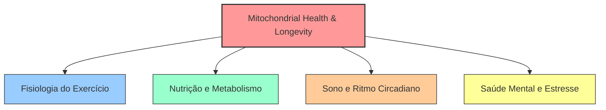

# Mapa de Conhecimento: Saúde Geral e Longevidade

Bem-vindo ao índice central de **Saúde e Fisiologia Humana**. Este espaço adota uma abordagem preventiva e proativa da saúde (Medicina 3.0), focada na otimização biológica, prevenção de doenças crônicas e extensão da expectativa de vida saudável (*healthspan*).

---

## 1. Pilares da Saúde e Integração Sistêmica

A saúde humana não é segmentada; suas bases são profundamente interdependentes e convergem na saúde mitocondrial, regulação hormonal e homeostase celular.

### I. [[Fisiologia-do-Exercicio|Fisiologia do Exercício]]
O exercício físico estruturado é a intervenção de maior impacto no aumento da expectativa de vida e na integridade funcional.
* **Foco:** Bioenergética celular (ATP-CP, glicólise, fosforilação oxidativa), VO2 Max como biomarcador preditivo de mortalidade, zonas de frequência cardíaca (Zona 2 e Zona 5), miocinas sistêmicas e mitogênese.

### II. [[Nutricao-e-Metabolismo|Nutrição e Metabolismo]]
A alimentação atua como sinalização química para o genoma e como substrato energético celular.
* **Foco:** Flexibilidade metabólica, regulação da insulina (resistência insulínica), oxidação lipídica (beta-oxidação) vs. glicólise, e os efeitos fisiológicos do jejum intermitente e restrição calórica na autofagia.

### III. [[Sono-e-Ritmo-Circadiano|Sono e Ritmo Circadiano]]
O sono é o principal processo neuroprotetor e reconstrutor do organismo.
* **Foco:** Arquitetura do sono (fases NREM e REM), o relógio circadiano no Núcleo Supraquiasmático (SCN), regulação hormonal do eixo cortisol-melatonina e práticas fundamentais de higiene do sono.

### IV. [[Saude-Mental-e-Manejo-de-Estresse|Saúde Mental e Manejo de Estresse]]
A saúde do sistema nervoso central e a regulação de estressores psicossociais regulam a homeostase somática.
* **Foco:** O eixo Hipotálamo-Pituitária-Adrenal (HPA), neurobiologia do cortisol e da adrenalina, neuroplasticidade mediada por BDNF, prevenção do esgotamento (Burnout) e regulação emocional cognitiva.

---

## 2. Métricas Clínicas e Biomarcadores de Longevidade

A avaliação da longevidade biológica baseia-se em parâmetros mensuráveis que indicam o estado cardiovascular, metabólico e inflamatório:

| Parâmetro / Biomarcador | O que Mede | Alvo de Otimização | Relevância Clínica |
| :--- | :--- | :--- | :--- |
| **VO2 Max** | Capacidade cardiorrespiratória máxima. | Superior a 75% da sua faixa etária. | O maior preditor independente de longevidade global. |
| **Glicemia de Jejum e HbA1c** | Controle glicêmico de curto e longo prazo. | Glicose $< 90 \text{ mg/dL}$; HbA1c $< 5.4\%$. | Prevenção da resistência insulínica e glicação proteica. |
| **Apolipoproteína B (ApoB)** | Quantidade total de partículas aterogênicas no sangue. | $< 80 \text{ mg/dL}$ (idealmente $< 60$). | Indicador preciso de risco de doença arterial coronariana. |
| **Variabilidade da Frequência Cardíaca (HRV)** | Equilíbrio entre o sistema nervoso simpático e parassimpático. | Tendência estável ou ascendente. | Marcador de resiliência ao estresse e recuperação autonômica. |
| **Eficiência do Sono** | Tempo real dormindo sobre o tempo gasto na cama. | $> 85\%$. | Associado à depuração de toxinas cerebrais via sistema glinfático. |
| **Proteína C-Reativa Ultrassensível (PCR-us)** | Inflamação sistêmica de baixo grau. | $< 1.0 \text{ mg/L}$. | Avaliação de aterosclerose e disfunção celular geral (*inflammaging*). |

---

## 3. A Teoria da Medicina 3.0 vs. Medicina 2.0
Enquanto a **Medicina 2.0** (a medicina tradicional moderna) foca no tratamento de patologias agudas e no manejo de doenças após seu aparecimento clínico, a **Medicina 3.0** foca na **prevenção personalizada**, na detecção precoce de doenças metabólicas e cardiovasculares silenciosas, e na otimização contínua da saúde celular. 

> [!TIP]
> A longevidade deve ser entendida como o produto entre **Lifespan** (anos de vida) e **Healthspan** (qualidade de vida física, cognitiva e emocional ao longo desses anos).

---
**Conexões Recomendadas:**
* Inicie compreendendo os mecanismos de produção de energia em [[Fisiologia-do-Exercicio|Fisiologia do Exercício]].
* Ajuste o fornecimento de energia a nível molecular com as diretrizes de [[Nutricao-e-Metabolismo|Nutrição e Metabolismo]].
