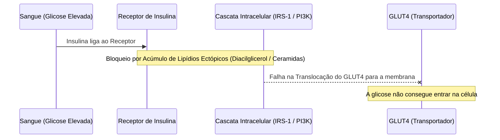

# Nutrição e Metabolismo

O metabolismo humano é o conjunto de reações bioquímicas integradas que transformam alimentos em energia estrutural e funcional celular. A otimização metabólica é a chave para a prevenção de doenças degenerativas crônicas e para o envelhecimento saudável.

---

## 1. Macronutrientes e Vias Bioquímicas

Cada macronutriente segue rotas metabólicas específicas para gerar adenosina trifosfato (ATP) ou constituir estruturas celulares:

| Macronutriente | Destino Fisiológico Primário | Via Catabólica Principal | Localização Celular |
| :--- | :--- | :--- | :--- |
| **Carboidratos** | Fonte de energia rápida e armazenamento de glicogênio. | Glicólise $\rightarrow$ Descarboxilação do Piruvato $\rightarrow$ Ciclo de Krebs | Citoplasma e Mitocôndria |
| **Lipídios** | Integridade de membranas, produção hormonal e reserva de energia de alta densidade. | Beta-oxidação $\rightarrow$ Ciclo de Krebs | Matriz Mitocondrial |
| **Proteínas** | Construção e reparo tecidual, síntese de enzimas e neurotransmissores. | Desaminação de Aminoácidos $\rightarrow$ Ciclo da Ureia / Gliconeogênese | Citoplasma e Mitocôndria |

```
Carboidratos ──> Glicose ──> Piruvato ──┐
                                       ├──> Acetil-CoA ──> Ciclo de Krebs ──> Fosforilação Oxidativa (ATP)
Lipídios ──────> Ácidos Graxos ────────┘
```

---

## 2. Flexibilidade Metabólica
A **flexibilidade metabólica** é a capacidade do organismo de adaptar a oxidação de combustíveis à disponibilidade de nutrientes específicos. 

* **Estado Alimentado (Predomínio de Insulina):** O organismo oxida preferencialmente carboidratos e armazena o excesso de lipídios no tecido adiposo.
* **Estado de Jejum (Predomínio de Glucagon):** O organismo realiza a transição para a oxidação de ácidos graxos (Beta-oxidação) e a produção de corpos cetônicos (acetoacetato, beta-hidroxibutirato).

A perda da flexibilidade metabólica (rigidez metabólica) é o marcador inicial da disfunção mitocondrial e está fortemente relacionada à obesidade e ao sedentarismo (Veja [[Fisiologia-do-Exercicio|Fisiologia do Exercício]]).

---

## 3. Fisiopatologia da Resistência à Insulina
A resistência à insulina é a diminuição da resposta biológica dos tecidos periféricos (especialmente músculo esquelético e fígado) à ação da insulina.



### O Mecanismo Molecular:
1. **Sobrecarga de Nutrientes:** O excesso calórico crônico leva ao acúmulo de lipídios ectópicos em tecidos não adiposos (músculos e fígado).
2. **Estresse Celular:** Metabólitos lipídicos (como diacilglicerol e ceramidas) ativam quinases de estresse (como JNK e PKC).
3. **Inibição do Receptor:** Estas quinases fosforilam o Substrato do Receptor de Insulina 1 (**IRS-1**) em resíduos de serina (em vez de tirosina), bloqueando a via de sinalização da **PI3K** (Fosfatidilinositol 3-quinase).
4. **Falha na Glicose:** A cascata que levaria à translocação de vesículas contendo o transportador **GLUT4** para a membrana celular falha. A glicose permanece na circulação, exigindo que o pâncreas produza ainda mais insulina (hiperinsulinemia compensatória), culminando no esgotamento das células beta e no Diabetes Tipo 2.

---

## 4. Benefícios Celulares do Jejum e Restrição Calórica

A ausência temporária de nutrientes exógenos induz adaptações evolutivas altamente conservadas associadas à longevidade celular:

> [!TIP]
> O jejum periódico sinaliza ao corpo para cessar as vias de crescimento e proliferação e focar em vias de manutenção celular e reparo do DNA.

### Vias de Sinalização de Longevidade
* **Inibição do mTOR:** A via mTOR (alvo da rapamicina em mamíferos), principal promotora de crescimento celular e síntese proteica, é desativada na ausência de aminoácidos, permitindo a limpeza celular.
* **Ativação da AMPK:** A carência energética eleva a razão AMP/ATP, ativando a AMPK, que estimula a queima de gorduras e a biogênese mitocondrial (Veja [[Fisiologia-do-Exercicio|Fisiologia do Exercício]]).
* **Ativação de Sirtuínas (SIRT1 e SIRT3):** Enzimas desacetilases dependentes de NAD+ que regulam a expressão gênica epigenética de reparo celular e resiliência ao estresse oxidativo.
* **Autofagia:** O processo de degradação e reciclagem lisossômica de organelas celulares danificadas (como mitocôndrias disfuncionais - *mitofagia*) e proteínas mal dobradas.

---
**Conexões Recomendadas:**
* Conecte o metabolismo energético com os ritmos diários em [[Sono-e-Ritmo-Circadiano|Sono e Ritmo Circadiano]] (a alimentação tardia perturba o relógio periférico).
* Otimize a queima de gorduras através de treinos em Zona 2 discutidos em [[Fisiologia-do-Exercicio|Fisiologia do Exercício]].
