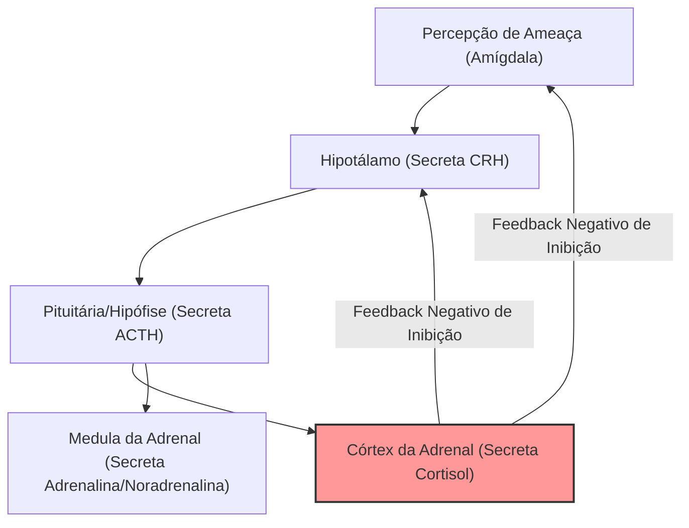

# Saúde Mental e Manejo de Estresse

A saúde mental e a resiliência psicológica apoiam-se na regulação de processos neurobiológicos e hormonais. Compreender a resposta ao estresse sob a ótica da neurociência permite a aplicação de intervenções comportamentais eficazes.

---

## 1. A Neurobiologia do Estresse: O Eixo HPA
A resposta ao estresse agudo é uma adaptação evolutiva de sobrevivência ("luta ou fuga"). No entanto, quando ativada de forma crônica, compromete a homeostase sistêmica.

### O Funcionamento do Eixo HPA:
1. **Ativação:** Diante de um estressor (físico ou psicossocial), a amígdala ativa o hipotálamo.
2. **Cascata Hormonal:** O hipotálamo libera o **Hormônio Liberador de Corticotrofina (CRH)**, que sinaliza à glândula hipófise (pituitária) para secretar o **Hormônio Adrenocorticotrófico (ACTH)** na corrente sanguínea.
3. **Liberação de Glucocorticoides:** O ACTH atua nas glândulas adrenais (sobre os rins), estimulando a liberação rápida de **cortisol** (no córtex adrenal) e **adrenalina** (na medula adrenal).
4. **Feedback Loops:** Em condições saudáveis, o cortisol circulante liga-se a receptores no hipocampo e no hipotálamo, gerando um sinal de *feedback negativo* para desligar o eixo HPA.

### O Estresse Crônico e a Resistência ao Cortisol:
Sob estresse psicológico contínuo (característico da modernidade), a ativação persistente do eixo HPA causa uma dessensibilização dos receptores de glicocorticoides. O ciclo de feedback falha, levando à inflamação sistêmica crônica, hipertensão e atrofia de conexões sinápticas.

---

## 2. Neuroplasticidade e o Papel do BDNF
O **BDNF** (*Brain-Derived Neurotrophic Factor* ou Fator Neurotrófico Derivado do Cérebro) é uma proteína vital para o crescimento, manutenção e plasticidade das células cerebrais.

* **Neuroplasticidade:** O BDNF estimula a neurogênese (nascimento de novos neurônios) no hipocampo, a área central da memória e do aprendizado.
* **O Efeito do Cortisol:** Níveis cronicamente elevados de cortisol suprimem diretamente a expressão gênica do BDNF. Como consequência, ocorre atrofia neuronal no hipocampo e no córtex pré-frontal, acompanhada por um crescimento dendrítico na amígdala. Isso aprisiona o cérebro em um estado hipervigilante, ansioso e depressivo.

> [!TIP]
> A prática regular de exercícios físicos aeróbicos (especialmente em Zona 2 ou HIIT) é o estímulo fisiológico mais potente para elevar os níveis sistêmicos de BDNF (Veja [[Fisiologia-do-Exercicio|Fisiologia do Exercício]]).

---

## 3. Práticas Clínicas de Manejo de Estresse

A regulação ativa do sistema nervoso autônomo pode ser realizada através de intervenções de baixo custo e baseadas em evidências:

### I. O Suspiro Fisiológico (*Physiological Sigh*)
Uma técnica respiratória rápida para reverter a hiperventilação e a ativação simpática associadas à ansiedade aguda:
* **Execução:** Duas inspirações profundas seguidas pelo nariz (a primeira longa, a segunda curta para inflar ao máximo os alvéolos pulmonares), seguidas por uma expiração longa e lenta pela boca.
* **Mecanismo:** O duplo influxo de ar expande os alvéolos colapsados. A expiração prolongada retém dióxido de carbono temporariamente no sangue, ativando o nervo vago e desacelerando a frequência cardíaca (via reflexo barorreceptor).

### II. Princípios da Terapia Cognitivo-Comportamental (TCC)
A reestruturação cognitiva busca interromper os loops de pensamentos automáticos disfuncionais:
* **Identificação de Distorções:** Perceber pensamentos como *catastrofização* ("tudo vai dar errado") ou *pensamento polarizado* ("se eu não for perfeito, sou um fracasso").
* **Desafio Empírico:** Confrontar a distorção perguntando: "Quais evidências reais apoiam este pensamento? Qual seria um cenário alternativo realista?".

---

## 4. Prevenção da Síndrome de Burnout
O *Burnout* é um estado crônico de estresse ocupacional não gerenciado com sucesso, caracterizado por três dimensões:

1. **Exaustão Emocional:** Esgotamento extremo de energia física e mental.
2. **Despersonalização:** Desenvolvimento de sentimentos de cinismo, indiferença e distanciamento em relação ao trabalho e às pessoas.
3. **Ineficácia Profissional:** Sensação de falta de realização e queda na produtividade.

### Estratégias de Prevenção:
* **Alinhamento do Sono:** O sono adequado (especialmente o sono REM) é o principal amortecedor emocional contra estressores diários (Veja [[Sono-e-Ritmo-Circadiano|Sono e Ritmo Circadiano]]).
* **Desconexão Digital Planejada:** Limitar o uso de dispositivos corporativos fora do horário de trabalho para evitar a ativação contínua do eixo HPA induzida por alertas algorítmicos (Veja [[Sociologia-da-Era-Digital|Sociologia da Era Digital]]).

---
**Conexões Recomendadas:**
* Explore como o exercício induz a secreção de BDNF em [[Fisiologia-do-Exercicio|Fisiologia do Exercício]].
* Proteja a qualidade de seu descanso e regulação do cortisol em [[Sono-e-Ritmo-Circadiano|Sono e Ritmo Circadiano]].
