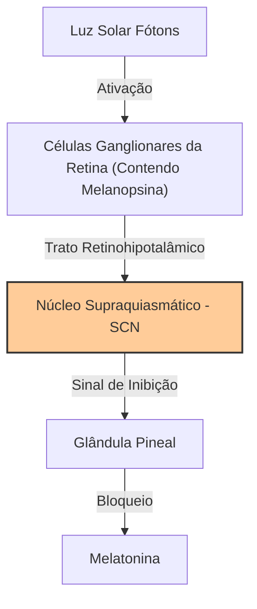

# Sono e Ritmo Circadiano

O sono e o ritmo circadiano constituem o sistema mestre de regeneração física e cognitiva do organismo humano. O desalinhamento desse sistema está diretamente associado a disfunções metabólicas, imunológicas e psiquiátricas.

---

## 1. Arquitetura do Sono: Os Ciclos NREM e REM

O sono noturno é estruturado em ciclos de aproximadamente 90 minutos, alternando entre o sono NREM (Não-REM) e o sono REM. Cada ciclo é composto por quatro estágios distintos:

```
[Vigília] ──> [N1: Transição] ──> [N2: Sono Leve] ──> [N3: Sono Profundo (Ondas Lentas)] ──> [REM: Sono Paradoxal]
```

### Sono NREM (Movimento Não Rápido dos Olhos)
* **Estágios N1 e N2:** Transição do estado de alerta para o sono leve. O N2 é caracterizado por fusos do sono e complexos K no eletroencefalograma (EEG), fundamentais para a consolidação inicial da memória motora.
* **Estágio N3 (Sono Profundo / Ondas Lentas):** O período de restauração física.
  * **Função Cardiovascular:** Pressão arterial e frequência cardíaca caem ao ponto mais baixo do dia.
  * **Hormônio do Crescimento (GH):** Liberação maciça do hormônio para reparo de tecidos periféricos.
  * **Sistema Glinfático:** Ativação de um fluxo de líquido cefalorraquidiano (LCR) que lava o espaço intersticial cerebral, depurando resíduos metabólicos como a proteína beta-amiloide (associada ao Alzheimer).

### Sono REM (Movimento Rápido dos Olhos)
* **Fisiologia:** O cérebro exibe ondas de alta frequência semelhantes às da vigília, mas o corpo entra em atonia muscular completa (paralisia temporária para evitar a execução física dos sonhos).
* **Função Cognitiva:** Consolidação de memórias emocionais, criatividade, associação de ideias complexas e regulação de neurotransmissores como a serotonina e dopamina.

---

## 2. O Relógio Central: O Núcleo Supraquiasmático (SCN)
O **Núcleo Supraquiasmático (SCN)**, localizado no hipotálamo anterior, é o marcapasso circadiano central do corpo humano. Ele sincroniza os relógios celulares periféricos presentes em todos os órgãos.



* **Melanopsina:** Proteína fotorreceptora presente nas células ganglionares da retina que é sensível especificamente ao comprimento de onda da **luz azul** (aproximadamente $480 \text{ nm}$, abundante no espectro solar matinal e em telas artificiais).
* **Ajuste Diário:** Ao receber fótons azuis, o SCN envia sinais neurais para interromper a produção de melatonina, regulando a temperatura corporal e estimulando o estado de vigília.

---

## 3. A Dinâmica Hormonal Cortisol-Melatonina
O alinhamento circadiano saudável requer uma oscilação recíproca entre o cortisol e a melatonina ao longo das 24 horas do dia:

```mermaid
gantt
    title Padrão Hormonal Circadiano (24 Horas)
    dateFormat  HH:mm
    axisFormat %H:%M
    section Cortisol (Alerta)
    Pico (CAR) :active, 06:00, 08:00
    Declínio Lento : 08:00, 22:00
    Nível Mínimo : 22:00, 04:00
    section Melatonina (Sono)
    Nível Baixo : 06:00, 20:00
    Início de Liberação : 20:00, 22:00
    Pico de Produção :active, 22:00, 03:00
```



* **Melatonina (O Hormônio da Escuridão):** Sintetizada na glândula pineal a partir do triptofano. Ela inicia sua secreção cerca de 2 horas antes do horário habitual de dormir, facilitando o início do sono ao sinalizar a redução da temperatura interna e do metabolismo celular.
* **Cortisol (O Hormônio do Alerta):** Apresenta a **Resposta de Despertar do Cortisol (CAR)**, um pico agudo cerca de 30 a 45 minutos após acordar, responsável por elevar a glicemia, a pressão arterial e a motivação matinal. Seu nível deve cair paulatinamente até a noite (Veja [[Saude-Mental-e-Manejo-de-Estresse|Saúde Mental e Manejo de Estresse]]).

---

## 4. Higiene do Sono Baseada em Evidências Científicas

Para otimizar a arquitetura do sono e garantir um ritmo circadiano robusto, as seguintes práticas clínicas devem ser implementadas:

1. **Visualização de Luz Solar Matinal:** Expor-se à luz solar direta (fora de janelas ou óculos escuros) por 10-15 minutos nos primeiros 60 minutos após acordar. Isso ativa o CAR e configura o cronômetro interno para a liberação de melatonina 16 horas depois.
2. **Restrição de Luz Azul Noturna:** Reduzir a exposição a luzes brilhantes e telas de LED a partir das 20h. O uso de luzes quentes indiretas (abaixur no nível do chão) reduz o estresse ocular e não bloqueia a melatonina.
3. **Controle de Temperatura:** Manter o quarto resfriado (idealmente entre $16^\circ\text{C}$ e $20^\circ\text{C}$). O corpo precisa reduzir sua temperatura interna em aproximadamente $1^\circ\text{C}$ para iniciar o sono profundo (N3).
4. **Alimentação Precoce:** Evitar refeições volumosas nas 3 horas anteriores ao sono. A digestão tardia perturba os relógios biológicos periféricos do estômago e fígado, desregulando o metabolismo (Veja [[Nutricao-e-Metabolismo|Nutrição e Metabolismo]]).
5. **Cuidado com Estimulantes:** Respeitar a meia-vida da cafeína (cerca de 5 a 7 horas, com tempo de eliminação total de até 10 horas). Interromper o consumo de cafeína no máximo até as 14h.

---
**Conexões Recomendadas:**
* Compreenda como o estresse noturno desregula o cortisol matinal em [[Saude-Mental-e-Manejo-de-Estresse|Saúde Mental e Manejo de Estresse]].
* Explore as influências sociais e o uso abusivo de telas na dinâmica circadiana em [[Sociologia-da-Era-Digital|Sociologia da Era Digital]].
