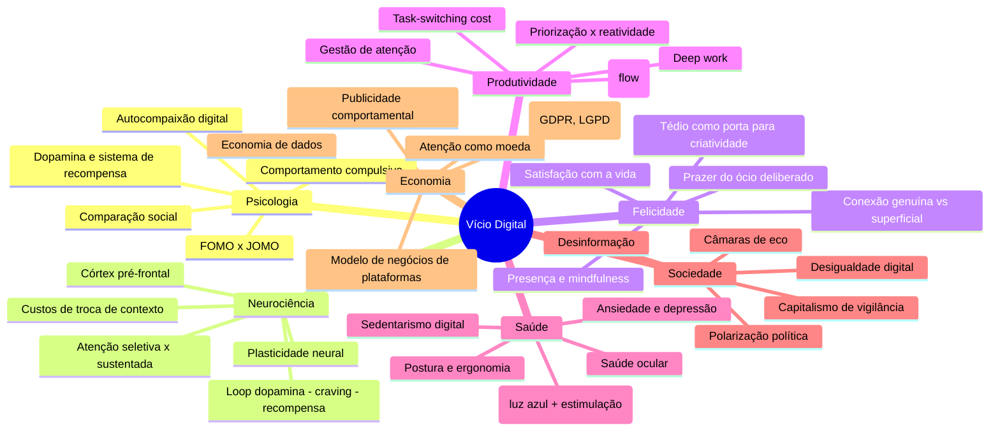

# Vício Digital e o Papel da Tecnologia na Vida

## 1. Introdução

A tecnologia digital é, simultaneamente, a maior ferramenta de libertação e a mais sofisticada gaiola já construída pela humanidade. Nunca antes tivemos acesso a tanto conhecimento, a tantas pessoas, a tantas possibilidades. E nunca antes nossa atenção foi tão sequestrada, nossa solidão tão mascarada por conexões superficiais, nosso tempo tão fragmentado por interrupções que não pedimos.

Vivemos o paradoxo central do século XXI: carregamos no bolso um dispositivo capaz de responder a qualquer pergunta, conectar-nos a qualquer pessoa, ensinar-nos qualquer habilidade — e passamos a maior parte do tempo usando-o para rolar uma tela infinita em busca de uma dopamina que nunca nos satisfaz por completo.

A atenção tornou-se o recurso mais escasso da era digital. Não o petróleo, não o ouro, não os dados. A atenção humana é finita, irreproduzível e frágil. E é exatamente por isso que se tornou a moeda mais valiosa do capitalismo contemporâneo.

Este documento não é um apelo ao apocalipse tecnológico. Também não é uma defesa ingênua do progresso. É um mapa para navegar o dilema: como extrair o melhor da tecnologia sem entregar a ela o que temos de mais precioso — nosso foco, nossa paz, nossa capacidade de simplesmente existir sem sermos interrompidos.

A pergunta que atravessa cada seção a seguir é simples e difícil: quem controla sua atenção? Você ou o sistema projetado para capturá-la?

## 2. A Economia da Atenção

### 2.1 De Herbert Simon ao Vale do Silício

Em 1971, Herbert Simon — economista, psicólogo e prêmio Nobel — escreveu uma frase que se tornaria profética:

> "O que a informação consome é bastante óbvio: ela consome a atenção de seus receptores. Portanto, uma riqueza de informação cria uma pobreza de atenção."

Simon anteviu com décadas de antecedência o problema fundamental da era digital. Informação não é um bem escasso — é abundante, barata e cresce exponencialmente. O recurso realmente escasso é a capacidade de processá-la. E, no mundo online, todo pixel, todo som, toda animação foi projetada para capturar exatamente esse recurso.

### 2.2 O modelo de negócios da atenção

O surgimento das plataformas digitais gratuitas (Google, Facebook, YouTube, Instagram, TikTok) criou um modelo de negócios inédito na história:

- O **produto** é a sua atenção.
- O **cliente** é o anunciante.
- A **matéria-prima** são seus dados comportamentais.
- O **processo industrial** é o refinamento contínuo do engajamento.

Esse modelo transformou a atenção humana em uma commodity negociada em leilões de publicidade em tempo real. Cada fração de segundo que você passa em uma plataforma é convertida em receita. Cada clique, cada pausa, cada hesitação é registrada e usada para prever seu comportamento futuro.

O resultado é que centenas das mentes mais brilhantes do planeta passam seus dias projetando sistemas cujo objetivo explícito é roubar sua atenção. Como Tristan Harris coloca: "Você não é o cliente. Você é o produto sendo extraído."

### 2.3 A corrida ao fundo do poço do cérebro

Johann Hari, em *Stolen Focus* (2022), descreve a "corrida ao fundo do poço do cérebro": as plataformas descobriram que, para maximizar o engajamento, precisam apelar aos instintos mais primitivos — medo, indignação, desejo sexual, novidade constante.

O conteúdo mais viral não é o mais informativo, o mais belo ou o mais útil. É o que provoca a reação emocional mais forte no menor tempo possível. E o que provoca a reação mais forte é, sistematicamente, o que nos divide, nos assusta ou nos ultraja.

Hari documenta como ex-engenheiros do Google, Facebook e Instagram relatam que as empresas sabem que estão amplificando polarização e ansiedade — mas não param porque o engajamento (e o lucro) dependem disso.

### 2.4 Design Persuasivo (Tristan Harris e o Center for Humane Technology)

Tristan Harris, ex-Engenheiro de Ética do Google e fundador do Center for Humane Technology, popularizou o conceito de que os aplicativos não são neutros — são projetados com técnicas de persuasão que exploram vulnerabilidades psicológicas humanas:

- **Variable Rewards (Recompensas Variáveis)**: O mesmo mecanismo das máquinas caça-níqueis — você não sabe se a próxima atualização trará algo interessante, então continua puxando a alavanca (atualizando o feed).
- **Social Reciprocity (Reciprocidade Social)**: Você se sente obrigado a responder à mensagem que recebeu, porque ignorar seria rude.
- **Fear of Missing Out (Medo de Ficar de Fora)**: Se você não verificar agora, pode perder algo importante — um convite, uma notícia, uma tendência.
- **Infinite Scroll (Rolagem Infinita)**: Não há ponto natural de parada. O feed nunca acaba, então seu cérebro não recebe o sinal de "satisfeito, podemos parar".

O documentário *The Social Dilemma* (2020) levou essas ideias ao grande público. Harris argumenta que estamos vivendo uma "crise de atenção" comparável à crise climática — um problema sistêmico que exige soluções sistêmicas, não apenas força de vontade individual.

### 2.5 O Loop da Dopamina

A dopamina é frequentemente chamada de "neurotransmissor do prazer", mas essa descrição é imprecisa. A dopamina está mais relacionada à **antecipação** e à **motivação** do que ao prazer em si.

O loop típico do vício digital funciona assim:

1. **Gatilho**: Uma notificação aparece (ou você antecipa que algo pode ter aparecido).
2. **Antecipação**: Seu cérebro libera dopamina — você sente uma ponta de excitação.
3. **Resposta**: Você pega o telefone e verifica.
4. **Recompensa variável**: Você encontra algo interessante (ou não). Se sim, há uma pequena liberação de prazer. Se não, a antecipação aumenta para a próxima vez.
5. **Repetição**: O ciclo se reforça. Cada notificação reforça o hábito de verificar.

O problema é que esse loop foi projetado para ser infinito. Não há saciedade. Ao contrário da comida ou do sexo, onde o corpo eventualmente diz "chega", o feed infinito nunca satisfaz — apenas alimenta o desejo por mais.

Como Neurônios espelham no cérebro as recompensas variáveis, o sistema se torna autossustentável. Você não precisa mais de notificações externas: a simples possibilidade de que algo possa ter aparecido já é suficiente para disparar o ciclo.

## 3. O Impacto na Cognição

### 3.1 Atenção: o declínio do foco sustentado

Estudos de rastreamento ocular e uso de dispositivos indicam que o tempo médio que uma pessoa mantém o foco em uma única tela caiu de cerca de 2,5 minutos (2004) para aproximadamente **47 segundos** (2022). Em ambientes de trabalho, a média é ainda menor: cerca de 40 segundos antes de uma interrupção voluntária (troca de aba) ou involuntária (notificação).

Isso não acontece por acaso. O design das interfaces digitais incentiva a alternância constante. Cada nova aba é uma pequena promessa de recompensa. Cada notificação é um desvio forçado de atenção.

O custo disso é a perda do que o psicólogo Mihaly Csikszentmihalyi chamou de **flow (fluxo)** : o estado de imersão total em uma atividade, caracterizado por prazer, produtividade elevada e perda da noção do tempo. O fluxo exige concentração ininterrupta por pelo menos 15-20 minutos. No ambiente digital atual, esse estado se torna cada vez mais raro.

### 3.2 Memória: o Efeito Google

O "Efeito Google" (também chamado de "amnésia digital") foi descrito por Betsy Sparrow e colegas em 2011. A pesquisa mostrou que, quando as pessoas sabem que uma informação está disponível online, têm menos probabilidade de memorizá-la. Em vez disso, lembram-se de **onde** encontrar a informação — não do conteúdo em si.

Isso tem implicações profundas para a educação, o trabalho e a vida intelectual. Se todo conhecimento está a um clique de distância, o cérebro humano pode estar terceirizando sua função mais fundamental: a construção de uma base de conhecimento internalizada.

Não se trata de nostalgia pré-internet. A capacidade de acessar informações rapidamente é obviamente valiosa. Mas há uma diferença entre acessar informação e integrá-la. A integração exige repetição, reflexão e conexão com conhecimento pré-existente — processos que o acesso instantâneo pode estar (paradoxalmente) enfraquecendo.

### 3.3 Pensamento profundo vs. pensamento raso

Nicholas Carr, em *The Shallows* (2010), argumenta que a internet está literalmente remodelando nossos circuitos neurais. Carr não é um tecnofóbico — ele reconhece os benefícios da rede. Mas alerta que o meio digital favorece um tipo específico de pensamento: rápido, superficial, multitarefa, orientado por estímulos externos.

O problema, segundo Carr, é que esse modo de pensar está **substituindo**, e não **complementando**, o modo mais lento e profundo de processamento de informações. A leitura de um livro — sequencial, focada, sem interrupções — ativa redes neurais diferentes da navegação por hiperlinks, abas e notificações.

O "pensamento raso" é excelente para escanear informações, identificar padrões e tomar decisões rápidas. Mas é insuficiente para:
- Compreensão profunda de textos complexos
- Raciocínio crítico e análise de argumentos
- Criatividade e insight
- Solução de problemas que exigem reflexão prolongada

A preocupação de Carr é que, quanto mais tempo passamos no modo raso, menos capacidade temos de acessar o modo profundo. O cérebro se adapta ao ambiente — e se o ambiente é fragmentado, o cérebro se torna fragmentado.

### 3.4 Multitasking: o mito e o custo da troca de contexto

O cérebro humano **não** faz múltiplas tarefas simultâneas. O que chamamos de multitasking é, na verdade, alternância rápida entre tarefas (task-switching). E essa alternância tem um custo cognitivo mensurável:

- **Custo de troca de contexto (switch cost)**: Cada vez que você alterna entre tarefas, leva de 15 a 25 minutos para retomar o nível anterior de concentração.
- **Queda de desempenho**: Em testes controlados, multitaskers crônicos cometem até 50% mais erros e levam até 50% mais tempo para completar tarefas.
- **Efeito duradouro**: Pessoas que se autodeclaram multitaskers frequentes têm pior desempenho até mesmo em tarefas únicas — porque treinaram o cérebro a ser facilmente distraído.

Estudos de neuroimagem mostram que alternar entre tarefas ativa a região pré-frontal dorsolateral (responsável pelo controle executivo), mas a ativação é curta e insuficiente para consolidar o foco. O cérebro trabalha mais e produz menos.

### 3.5 Leitura longa vs. leitura em tela

A leitura em tela difere da leitura em papel em aspectos neurológicos importantes:

- **Compreensão**: Múltiplos estudos (Mangen, 2013; Delgado, 2018) mostram que a compreensão de textos longos é consistentemente melhor em papel do que em tela, especialmente para textos narrativos ou argumentativos.
- **Retenção**: A memória de longo prazo para informações lidas em papel é superior. Hipótese: o cérebro associa conteúdo a contexto espacial (posição na página, sensação tátil), que é perdido na tela.
- **Navegação**: Em papel, a navegação não-linear (voltar, reler, saltar) é mais natural e menos disruptiva.
- **Metacognição**: Leitores em tela superestimam sua compreensão — acham que entenderam mais do que realmente entenderam.

Isso não significa que a leitura em tela seja inerentemente ruim. Significa que ela favorece um tipo diferente de processamento: mais rápido, mais superficial, mais orientado a escaneamento. O problema é que, com a migração de toda a leitura para telas, o processamento profundo está sendo gradualmente despriorizado.

## 4. Impacto Social e Psicológico

### 4.1 Redes sociais e comparação social

A teoria da comparação social (Festinger, 1954) propõe que os seres humanos avaliam a si mesmos em comparação com outros. As redes sociais amplificam esse mecanismo de forma quantitativa e qualitativa:

- **Quantitativamente**: Você não compara sua vida com 5 ou 10 pessoas — compara com centenas ou milhares.
- **Qualitativamente**: As redes exibem a "versão highlight" da vida alheia — os melhores momentos, as férias, as conquistas —, não o dia-a-dia normal.

Esse desequilíbrio cria uma percepção distorcida: a vida dos outros parece infinitamente mais interessante, bem-sucedida e feliz que a sua. Estudos mostram correlação consistente entre tempo em redes sociais e:
- Aumento da insatisfação com a própria vida
- Redução da autoestima
- Maior incidência de ansiedade social

Não coincidentemente, as plataformas que mais ativam comparação social (Instagram, Facebook) são as mais associadas a piores indicadores de saúde mental, especialmente entre jovens.

### 4.2 FOMO vs. JOMO

**FOMO (Fear of Missing Out)** : A ansiedade de que outras pessoas estão tendo experiências gratificantes das quais você está ausente. O FOMO é tanto causa quanto consequência do uso intensivo de redes sociais:
- As redes criam consciência constante do que os outros estão fazendo.
- Essa consciência gera ansiedade de estar perdendo algo.
- A ansiedade leva a verificações mais frequentes.
- A verificação frequente reforça a consciência do que os outros estão fazendo.

O FOMO está correlacionado com:
- Maior uso de smartphones
- Maior estresse percebido
- Menor satisfação com a vida
- Dificuldade de estar presente no momento atual

**JOMO (Joy of Missing Out)** : O prazer de deliberadamente optar por não participar. JOMO é a redescoberta de que não precisamos estar em todos os lugares, saber de tudo, responder a todos. É a libertação da obrigação implícita de estar sempre conectado.

O JOMO não é sobre isolamento. É sobre presença seletiva: escolher conscientemente onde investir sua atenção, em vez de deixar que o sistema decida por você.

### 4.3 Ansiedade, depressão e tempo de tela

A relação entre tempo de tela e saúde mental é uma das áreas mais estudadas e mais controversas da psicologia contemporânea.

**Evidências a favor da correlação:**
- Twenge (2017, *iGen*) mostra que adolescentes que passam 5+ horas por dia em redes sociais têm 71% mais risco de ter um episódio depressivo.
- O aumento súbito de depressão e ansiedade entre adolescentes nos EUA a partir de 2012 coincide com a adoção generalizada de smartphones.
- Estudos longitudinais mostram que o aumento do tempo de tela precede (não apenas acompanha) o aumento de sintomas depressivos.

**Controvérsias e ressalvas:**
- Efeitos são pequenos a moderados, não catastróficos (Orben & Przybylski, 2019).
- Correlação não é causalidade: jovens deprimidos podem usar mais telas (causalidade reversa).
- O contexto importa: uso passivo (rolar feed) é pior que uso ativo (conversar, criar).
- Efeitos são maiores para meninas que para meninos.

A interpretação mais equilibrada é que o tempo de tela excessivo não é a causa única, mas um **fator contribuinte** em um ecossistema mais amplo de fatores sociais, familiares e individuais.

### 4.4 O paradoxo da conexão: mais conectados, mais sós?

Sherry Turkle, no livro *Reclaiming Conversation* (2015), descreve um paradoxo: temos mais meios de comunicação do que nunca — e nunca nos sentimos tão sozinhos.

A superficialidade das interações digitais é o cerne do problema. Turkle argumenta que:
- Uma mensagem de texto não substitui uma conversa face a face.
- Uma videochamada não substitui a presença física.
- Um like não substitui o reconhecimento genuíno.

O que se perde: tom de voz, linguagem corporal, pausas, silêncios compartilhados, a "co-presença" que só a proximidade física proporciona.

Dados do General Social Survey mostram que:
- O número de americanos que relatam não ter amigos próximos quintuplicou entre 1985 e 2020.
- O tempo médio de interação face a face caiu drasticamente.
- A solidão crônica é declarada como epidemia de saúde pública por vários países.

As plataformas não criaram a solidão, mas Turkle sugere que elas a agravam ao oferecer um substituto empobrecedor para a conexão real — e ao ocupar o tempo que poderia ser dedicado a ela.

### 4.5 Polarização, câmaras de eco e bolhas algorítmicas

O design das plataformas de conteúdo tem um efeito colateral bem documentado na política e no discurso público:

- **Câmaras de eco**: Ambientes onde você só encontra opiniões semelhantes às suas. O algoritmo lhe mostra mais do que você já concorda, reforçando suas crenças.
- **Bolhas algorítmicas**: Filtros invisíveis que determinam o que você vê (e, portanto, o que você sabe). Duas pessoas podem viver realidades informacionais completamente diferentes.
- **Amplificação de conteúdo polarizador**: Conteúdo que gera indignação é o que mais engaja. Portanto, é o que mais é promovido.

O resultado é um cenário onde:
- O entendimento mútuo entre grupos opostos se deteriora.
- Versões extremas de posições políticas são super-representadas.
- A desinformação se espalha mais rápido que a correção.

Estudos mostram que a exposição a conteúdo polarizador em redes sociais está associada a:
- Aumento da hostilidade partidária
- Redução da confiança em instituições
- Maior dificuldade de distinguir fato de opinião

## 5. Vício Digital

### 5.1 É vício mesmo? Critérios DSM e comportamento compulsivo

O termo "vício digital" é controverso na literatura acadêmica. O DSM-5 (Manual Diagnóstico e Estatístico de Transtornos Mentais) inclui apenas o "Transtorno do Jogo pela Internet" (Internet Gaming Disorder) como condição que merece mais estudos — não como diagnóstico oficial.

No entanto, cresce o consenso de que, para um subconjunto de usuários, o uso da tecnologia apresenta características típicas de comportamentos aditivos:

- **Salience**: O comportamento domina pensamentos e prioridades.
- **Mood modification**: O comportamento é usado para alterar o estado emocional (escapar de ansiedade, tédio).
- **Tolerance**: É necessário cada vez mais tempo para obter o mesmo efeito.
- **Withdrawal**: Sintomas de abstinência (irritabilidade, ansiedade) quando o comportamento é impedido.
- **Conflict**: O comportamento causa conflito com outras atividades ou relacionamentos.
- **Relapse**: Tentativas repetidas de reduzir sem sucesso.

Aplicados ao uso de tecnologia: uma pessoa que tenta repetidamente reduzir o uso, sente ansiedade quando não pode acessar (abstinência), aumenta progressivamente o tempo gasto (tolerância) e negligencia trabalho/relacionamentos por causa das telas (conflito) — independentemente do diagnóstico formal, está experimentando um padrão clinicamente relevante.

### 5.2 Diferença entre uso excessivo, problemático e patológico

Nem todo uso excessivo é problemático, e nem todo uso problemático é vício:

- **Uso excessivo**: Grande quantidade de tempo gasto, mas sem prejuízo funcional significativo. Exemplo: um programador que passa 10h/dia no computador, mas tem uma vida social e emocional saudável.
- **Uso problemático**: O uso começa a causar prejuízos — queda no desempenho, conflitos, negligência de responsabilidades — mas a pessoa mantém algum controle.
- **Uso patológico (vício)**: Perda de controle, prejuízo grave, continuidade apesar de consequências negativas.

O espectro é contínuo. A maioria das pessoas que se preocupa com seu uso de tecnologia está na zona problemática, não na patológica. Isso não torna a preocupação inválida — é justamente a zona onde intervenções preventivas são mais eficazes.

### 5.3 O modelo de Clark

O modelo cognitivo-comportamental de Clark para comportamentos aditivos descreve o ciclo:

1. **Cue (Gatilho)**: Estímulo interno (tédio, ansiedade, solidão) ou externo (notificação, telefone à vista).
2. **Craving (Fissura)**: Desejo intenso de executar o comportamento — "preciso verificar".
3. **Response (Resposta)**: O comportamento em si — pegar o telefone, abrir o app.
4. **Reward (Recompensa)**: Alívio temporário da fissura + prazer da novidade ou conexão.
5. **Reforço**: O ciclo se fortalece — a associação entre gatilho e recompensa fica mais forte.

No caso da tecnologia, cada etapa é acelerada pelo design da interface. O gatilho é onipresente (notificações, ícones, vibrações). A fissura é imediata. A resposta requer segundos. A recompensa é variável (o que mantém o comportamento em extinção parcial — o padrão mais resistente ao desaparecimento).

### 5.4 Quem é mais vulnerável?

Nem todo mundo desenvolve o mesmo padrão de uso. Fatores de vulnerabilidade incluem:

- **Jovens e adolescentes**: O córtex pré-frontal (controle de impulsos, planejamento de longo prazo) ainda está em desenvolvimento. A recompensa imediata tem mais peso.
- **Baixa autoestima**: O reforço social das redes (likes, comentários) pode ser especialmente atraente para quem busca validação externa.
- **Solidão**: A tecnologia oferece a promessa de conexão para quem se sente isolado.
- **Ansiedade e depressão**: O comportamento digital funciona como fuga de estados emocionais negativos.
- **Tédio crônico**: A variedade infinita de estímulos é uma solução imediata para o desconforto do tédio.
- **Traços de personalidade**: Alta impulsividade, alta busca por novidade (novelty seeking) e baixa conscienciosidade são preditores.

Não se trata de culpa individual. A tecnologia foi projetada para ser maximamente atraente — e algumas pessoas, por circunstâncias ou biologia, são mais suscetíveis que outras.

## 6. Minimalismo Digital (Cal Newport)

### 6.1 Filosofia: tecnologia como ferramenta, não como modo de vida

Cal Newport, professor de ciência da computação em Georgetown e autor de *Deep Work* (2016) e *Digital Minimalism* (2019), propõe uma filosofia alternativa ao caos digital:

> "O minimalismo digital é uma filosofia de uso da tecnologia na qual você concentra seu tempo online em um pequeno número de atividades cuidadosamente selecionadas e otimizadas que fortemente apoiam as coisas que você mais valoriza — e então, felizmente, perde todo o resto."

A ideia central é que a tecnologia deve ser **ferramenta**, não **modo de vida**. Ferramentas são usadas intencionalmente para um fim específico. Um modo de vida é algo que nos envolve e define sem que necessariamente escolhamos.

Newport critica a "otimização incremental": a ideia de que você pode resolver o problema adicionando mais ferramentas, mais apps, mais configurações. Sua tese é que a solução não é técnica — é filosófica. É preciso redefinir o papel que a tecnologia ocupa na sua vida.

### 6.2 O processo: 30-day digital declutter

O método de Newport começa com um detox radical de 30 dias:

**Passo 1**: Identifique todas as tecnologias opcionais que você usa. "Opcional" é tudo que não é estritamente exigido pelo trabalho ou por obrigações essenciais.

**Passo 2**: Durante 30 dias, elimine completamente essas tecnologias. Sem redes sociais. Sem notícias online. Sem streaming como hábito. Sem aplicativos de mensagens não essenciais.

**Passo 3**: Durante esses 30 dias, explore ativamente alternativas analógicas: leia livros físicos, converse pessoalmente, caminhe sem fones, escreva à mão, pratique hobbies que não envolvam telas.

**Passo 4**: Após os 30 dias, reintroduza **seletivamente** as tecnologias que você realmente sentiu falta — e apenas aquelas que servem a um propósito claro alinhado com seus valores.

O resultado não é uma vida sem tecnologia, mas uma vida com menos tecnologia — e a que resta é usada de forma profundamente intencional.

### 6.3 O que manter: só o que serve aos seus valores

Newport propõe que a decisão de manter ou não uma tecnologia deve passar por três perguntas:

1. **Essa tecnologia serve diretamente a algo que eu valorizo profundamente?** (Não "é útil de vez em quando", mas "é essencial para o que considero importante".)
2. **É a melhor maneira de servir a esse valor?** (Existe uma alternativa analógica ou menos invasiva que funciona tão bem ou melhor?)
3. **Os benefícios superam os custos?** (Quanto tempo e atenção essa tecnologia consome? Quanto ela fragmenta seu foco?)

Tecnologias que passam nas três perguntas são mantidas e otimizadas. As que não passam são eliminadas sem culpa.

Exemplos:
- **Valor: Conexão com amigos próximos.** Melhor ferramenta: mensagens diretas e encontros presenciais. Redes sociais com timeline infinita? Não passa na pergunta 2.
- **Valor: Conhecimento e aprendizado.** Melhor ferramenta: livros, cursos, artigos selecionados. Feed de notícias algoritmico? Não passa na pergunta 3.
- **Valor: Expressão criativa.** Melhor ferramenta: plataforma específica para sua arte. Rolagem infinita no Instagram? Não passa na pergunta 1.

### 6.4 Alternativas práticas

Minimalismo digital frequentemente envolve substituições concretas:

- **Dumb phones**: Dispositivos que só fazem ligações e mensagens (Light Phone, Punkt, Nokia 3310). Cada vez mais populares entre profissionais de tecnologia.
- **App blockers**: Software que bloqueia aplicativos ou sites em horários determinados (Freedom, Cold Turkey, SelfControl).
- **Grayscale**: Colocar o telefone em escala de cinza. A ausência de cores torna a tela menos atraente para o cérebro — estudos mostram redução de 20-30% no tempo de tela.
- **Single-purpose devices**: Kindle só para ler, iPod só para música, câmera separada para fotos. A separação física de funções reduz a tentação do multitasking.
- **Desktop-first**: Usar redes sociais apenas no computador, nunca no celular. A barreira adicional reduz o uso impulsivo.

Nenhuma dessas alternativas é obrigatória ou universal. A ideia é experimentar e encontrar o que funciona para você.

## 7. Estratégias Práticas

### 7.1 Desintoxicação digital (30 dias)

Inspirado em Newport, mas adaptável:

**Semana 1: Consciência**
- Ative o monitoramento de tempo de tela (iOS Screen Time, Android Digital Wellbeing, RescueTime).
- Registre seu uso diário sem julgar. Apenas observe.
- Identifique seus padrões: quando, onde, por que você pega o telefone?

**Semana 2: Eliminação**
- Desative ou remova os 3 aplicativos que mais consomem seu tempo.
- Desative todas as notificações não essenciais.
- Estabeleça zonas livres de tela (quarto, mesa de jantar).

**Semana 3: Substituição**
- Identifique os gatilhos que levam ao uso automático.
- Prepare alternativas para cada gatilho: tédio → livro; ansiedade → respiração; solidão → ligar para alguém.
- Crie rituais que não envolvam telas.

**Semana 4: Reintrodução Seletiva**
- Reintroduza apenas o que realmente faz falta.
- Estabeleça regras claras para cada tecnologia reintroduzida.
- Crie um "contrato digital" pessoal com seus limites.

### 7.2 Regras de higiene digital

Regras testadas e recomendadas por especialistas:

- **Sem telas 1 hora antes de dormir**: A luz azul suprime a melatonina e prejudica o sono. Mas mais importante: o conteúdo estimulante (redes sociais, notícias) mantém o cérebro ativo.
- **Sem telefone na mesa de refeições**: Comer sem telas melhora a digestão e a conversa. A refeição vira um momento de conexão, não de consumo.
- **Telefone fora do quarto**: Carregue o telefone em outro cômodo. Use um despertador analógico. A ausência do telefão no quarto melhora o início e o fim do sono.
- **Notificações desativadas**: Notificações são o maior vilão da atenção. Cada notificação é uma interrupção forçada que leva em média 23 minutos para superar (custo de troca de contexto).
- **Caixa de entrada zero e notificações em lote**: Em vez de responder a cada notificação no momento em que chega, reserve horários específicos para processar mensagens (ex.: 10h, 14h, 17h).

### 7.3 App Blockers e ferramentas de foco

Ferramentas para reduzir a tentação e forçar limites:

- **Freedom (freedom.to)**: Bloqueia sites e apps em todos os dispositivos simultaneamente. Sessões programadas recorrentes.
- **Cold Turkey (getcoldturkey.com)**: Bloqueador implacável — uma vez ativado, não pode ser desativado nem desinstalando o programa.
- **SelfControl (macOS)**: Bloqueia sites por lista negra com timer. Mesmo que você reinicie o computador, o bloqueio continua.
- **Forest (forestapp.cc)**: App de foco que planta árvores virtuais. Se você sair do app, a árvore morre. Gamificação do foco.
- **OneSec**: App que força uma pausa de 5 segundos antes de abrir qualquer aplicativo. Parece pequeno, mas quebra o automatismo.
- **Opal**: Bloqueador para iOS com modos de foco e metas diárias.

### 7.4 Redes sociais: uso programado e intencional

As redes sociais não precisam ser eliminadas, mas precisam ser **domesticadas**:

- **Uso programado**: Defina horários fixos (ex.: 15 min depois do almoço). Fora disso, não abra.
- **Versão web, não app**: Use redes sociais apenas pelo navegador, nunca pelo aplicativo. A interface web é menos viciante e mais difícil de acessar por impulso.
- **Sem timeline infinita**: Use ferramentas como News Feed Eradicator (extensão de navegador) que substituem o feed por uma frase inspiradora. Ou siga apenas contas específicas via listas/feed RSS.
- **Feed cronológico**: Sempre que possível, use feed cronológico, não algorítmico. Você vê o que escolheu ver, não o que o algoritmo quer que você veja.
- **Unfollow em massa**: Periodicamente, revise quem você segue. O que você vê determina como você se sente. Curar seu feed é um ato de saúde mental.

### 7.5 O Phone Foyer e estações de carregamento

Uma das estratégias mais simples e mais eficazes: crie um **local físico dedicado** para o telefone, fora do quarto.

- Um cesto, uma gaveta, uma bandeja na entrada de casa.
- Todos os telefones da casa ficam lá durante refeições, conversas, trabalho focado.
- O telefone carrega lá durante a noite.

O princípio não é técnico, é ambiental. Se o telefone está fora de vista, o gatilho visual desaparece. Você não precisa de força de vontade para não pegar o telefone se ele não está ao alcance.

### 7.6 Respiração entre telas: a pausa consciente

Entre cada atividade digital — antes de abrir uma nova aba, antes de pegar o telefone — faça UMA respiração consciente. Um segundo.

Parece trivial, mas quebra o automatismo. O ato de pegar o telefone passa de "impulso inconsciente" para "escolha consciente". Com o tempo, esse micro-hábito reduz significativamente o uso impulsivo.

Versão avançada: a **Regra dos 5 Segundos** (Mel Robbins): Quando sentir o impulso de verificar o telefone, conte 5-4-3-2-1 antes de pegar. A contagem interrompe o loop automático e dá tempo ao córtex pré-frontal de intervir.

## 8. JOMO (Joy of Missing Out)

### 8.1 Reclaiming solitude

Na era digital, a solidão se tornou um território a ser evitado a todo custo. Preenchemos cada segundo vago com podcasts, música, rolagem. Mas a solidão não é vazio — é espaço.

A psicóloga Sherry Turkle observa que a capacidade de estar sozinho é um pré-requisito para a capacidade de se conectar genuinamente com os outros. Se não suportamos nossa própria companhia, nossa busca por conexão se torna dependência, não escolha.

Reclaiming solitude (recuperar a solidão) significa:
- Caminhar sem fones de ouvido.
- Esperar sem pegar o telefone.
- Sentar em silêncio sem buscar estímulo.
- Permitir que a mente vagueie sem direção.

É nesse espaço vazio que insights surgem, que emoções são processadas, que o self se reconecta consigo mesmo.

### 8.2 Tédio como criatividade

O tédio é um dos estados mais produtivos para a criatividade — e um dos mais ameaçados pela tecnologia.

Estudos mostram que:
- Pessoas entediadas têm mais insights criativos em testes posteriores.
- O tédio sinaliza ao cérebro que a situação atual não está sendo produtiva e que é hora de buscar alternativas.
- O tédio não preenchido leva a divagações mentais (mind-wandering), que é exatamente o estado onde a criatividade incuba.

Quando preenchemos cada momento de tédio com estímulo digital, estamos matando a criatividade no ovo. A ideia genial não vem enquanto você está rolando o feed — vem no banho, na caminhada, no olhar para o nada. E esses momentos estão sendo sistematicamente eliminados.

O JOMO é, nesse sentido, uma poderosa ferramenta de criatividade. Perder algo no digital é ganhar espaço no mental.

### 8.3 A arte de não fazer nada

*Niksen* (holandês) — a arte de não fazer nada. *Dolce far niente* (italiano) — a doçura de não fazer nada. Em várias culturas, o ócio deliberado é valorizado como prática de bem-estar.

Na cultura digital, "não fazer nada" é visto como improdutivo, desperdiçado. Mas não fazer nada não é ausência de atividade — é presença no momento presente.

Práticas simples:
- Sentar em um banco de parque por 10 minutos sem fazer nada.
- Olhar pela janela sem buscar entretenimento.
- Deitar no chão e sentir o próprio corpo.
- Observar o movimento das nuvens.

Essas atividades não geram dados, não produzem valor econômico, não aumentam seu capital social. E é exatamente por isso que são tão importantes: elas devolvem a você a posse do seu próprio tempo.

## 9. Exercícios Práticos

### 9.1 Audit Digital: Onde vai seu tempo de tela?

**Duração**: 7 dias
**Ferramenta**: Screen Time (iOS), Digital Wellbeing (Android), RescueTime (desktop)

**Passos:**
1. Ative o monitoramento em todos os seus dispositivos.
2. No final de cada dia, anote:
   - Tempo total de tela (de cada dispositivo).
   - Top 3 aplicativos mais usados.
   - Quantas vezes pegou o telefone (número de desbloqueios).
   - Qual foi o primeiro app aberto ao acordar.
   - Qual foi o último app antes de dormir.
3. Ao final de 7 dias, some e reflita:
   - Quantas horas por semana você gasta em telas?
   - Quanto disso é produtivo e intencional? Quanto é automático?
   - Se você tivesse esse tempo de volta, o que faria?

### 9.2 24h de Detox (sem redes sociais)

**Duração**: 24 horas (escolha um sábado ou domingo)

**Regras:**
- Nenhuma rede social (Instagram, Twitter/X, Facebook, TikTok, YouTube, Reddit, LinkedIn).
- Nenhum aplicativo de notícias.
- Mensagens pessoais apenas por SMS/WhatsApp (e apenas respostas essenciais).
- E-mail: uma única verificação programada no dia.
- Streaming de vídeo: apenas um filme ou episódio escolhido intencionalmente (sem rolagem).
- Música e podcasts: permitidos, mas sem troca constante.

**Alternativas preparadas:** Tenha à mão livros, cadernos, projetos manuais, jogos de tabuleiro, convites para amigos para atividades presenciais.

**Ao final:** Escreva um parágrafo sobre a experiência. O que foi difícil? O que foi surpreendentemente bom? O que você aprendeu sobre seus hábitos?

### 9.3 Desative notificações não críticas por 1 semana

**Regra**: Durante 7 dias, o telefone só vibra ou toca para:
- Chamadas de contatos favoritos (família próxima, parceiro(a)).
- Mensagens de aplicativos essenciais (e-mail de trabalho, se necessário — mas em horário comercial).
- Alarmes programados.

**Tudo mais desativado:**
- Notificações de redes sociais.
- Notificações de aplicativos de notícias.
- Notificações de jogos.
- Notificações de compras e promoções.
- Badges (ícones vermelhos) de aplicativos não essenciais.

**Resultado esperado**: Redução de 50-80% no número de interrupções diárias. Muitas pessoas relatam que o telefone se torna "menos interessante" — e, portanto, menos usado.

### 9.4 Monte sua Personal Technology Philosophy

Inspirado no processo de Newport, escreva um documento pessoal respondendo:

1. **Valores**: O que é mais importante para mim? (Saúde, família, trabalho significativo, criatividade, amizade, aprendizado, espiritualidade...)
2. **Tecnologias essenciais**: Quais tecnologias são necessárias para sustentar esses valores?
3. **Regras de uso**: Para cada tecnologia essencial, que regras vou seguir para garantir que ela sirva a meus valores e não os prejudique?
4. **Limites claros**: O que vou eliminar ou reduzir?
5. **Revisão periódica**: Quando e como vou revisar essa filosofia?

**Exemplo de entrada da filosofia pessoal:**

> **Valor**: Conexão com amigos próximos.
> **Tecnologia essencial**: WhatsApp.
> **Regra**: Mensagens respondidas em lote 3x/dia. Nada de grupos não essenciais. Chamada de voz para conversas importantes.
> **Limite**: Sem whatsapp no computador. Notificações desativadas à noite.
> **Revisão**: A cada 3 meses, verificar se as regras ainda funcionam.

O documento não precisa ser longo — meia página já basta. O importante é que ele exista e seja consultado quando a tentação de desviar aparecer.

### 9.5 Implemente 1 regra de higiene digital por 30 dias

Escolha UMA regra das listadas na seção 7 e mantenha por 30 dias. Exemplos:

- "Nada de telas 1 hora antes de dormir."
- "Telefone carregado fora do quarto."
- "Redes sociais apenas no computador."
- "Notificações desativadas (todas não essenciais)."
- "Uma refeição por dia sem telefone por perto."

**Por que apenas uma?** Mudança de hábito sustentável é incremental. Tentar mudar tudo de uma vez leva à sobrecarga e ao abandono.

**Registro diário**: Marque num calendário se você cumpriu a regra. Gráficos de sequência (streak) são motivadores.

**Após 30 dias**: Avalie o impacto. A regra melhorou sua qualidade de vida? Vale a pena mantê-la? Que regra adicionar em seguida?

## 10. Cross-mapping: Como este tema se conecta a outras áreas

## 11. Referências

### Livros

- **Alter, Adam.** *Irresistible: The Rise of Addictive Technology and the Business of Keeping Us Hooked*. Penguin Press, 2017.
  - Análise das técnicas de design aditivo usadas por grandes plataformas e como elas exploram vulnerabilidades psicológicas.
- **Carr, Nicholas.** *The Shallows: What the Internet Is Doing to Our Brains*. W. W. Norton, 2010.
  - A tese seminal de que a internet está remodelando nossos padrões neurais, favorecendo pensamento raso em detrimento do profundo.
- **Hari, Johann.** *Stolen Focus: Why You Can't Pay Attention — and How to Think Deeply Again*. Crown, 2022.
  - Investigação jornalística sobre as forças sociais, tecnológicas e econômicas que estão roubando nossa capacidade de atenção.
- **Newport, Cal.** *Deep Work: Rules for Focused Success in a Distracted World*. Grand Central, 2016.
  - Argumento de que o trabalho profundo (foco intenso sem interrupções) é o superpoder do século XXI, e como cultivá-lo.
- **Newport, Cal.** *Digital Minimalism: Choosing a Focused Life in a Noisy World*. Portfolio, 2019.
  - Filosofia prática de uso intencional da tecnologia, incluindo o processo de 30-day digital declutter.
- **Turkle, Sherry.** *Reclaiming Conversation: The Power of Talk in a Digital Age*. Penguin Press, 2015.
  - Como a substituição de conversas presenciais por interações digitais está empobrecendo nossa capacidade de empatia e conexão.
- **Twenge, Jean.** *iGen: Why Today's Super-Connected Kids Are Growing Up Less Rebellious, More Tolerant, Less Happy — and Completely Unprepared for Adulthood*. Atria, 2017.
  - Estudo de dados longitudinais mostrando como a geração nascida após 1995 é profundamente diferente das anteriores, em parte devido ao smartphone.
- **Zuboff, Shoshana.** *The Age of Surveillance Capitalism: The Fight for a Human Future at the New Frontier of Power*. PublicAffairs, 2019.
  - Análise crítica do modelo de negócios que transforma a experiência humana em matéria-prima para predição e venda comportamental.
- **Duhigg, Charles.** *The Power of Habit: Why We Do What We Do in Life and Business*. Random House, 2012.
  - Modelo do loop do hábito (cue, routine, reward) — base teórica para entender e modificar comportamentos digitais automáticos.
- **Odell, Jenny.** *How to Do Nothing: Resisting the Attention Economy*. Melville House, 2019.
  - Defesa filosófica e prática de recuperar a atenção como forma de resistência política e pessoal.

### Artigos e papers

- **Sparrow, B., Liu, J., & Wegner, D. M.** (2011). "Google Effects on Memory: Cognitive Consequences of Having Information at Our Fingertips." *Science*, 333(6043), 776-778.
- **Orben, A., & Przybylski, A. K.** (2019). "The association between adolescent well-being and digital technology use." *Nature Human Behaviour*, 3(2), 173-182.
- **Twenge, J. M., & Campbell, W. K.** (2018). "Associations between screen time and lower psychological well-being among children and adolescents." *Preventive Medicine Reports*, 12, 271-283.
- **Mangen, A., Walgermo, B. R., & Brønnick, K.** (2013). "Reading linear texts on paper versus computer screen." *International Journal of Educational Research*, 58, 61-68.
- **Delgado, P., et al.** (2018). "Don't throw away your printed books: A meta-analysis on the effects of reading media on reading comprehension." *Educational Research Review*, 25, 23-38.
- **Kahneman, D.** (1973). *Attention and Effort*. Prentice-Hall. — Obra fundamental sobre a psicologia da atenção.

### Documentários e palestras

- **The Social Dilemma** (2020), dir. Jeff Orlowski. Documentário da Netflix com depoimentos de ex-engenheiros do Google, Facebook e Twitter.
- **The Great Hack** (2019), dir. Karim Amer e Jehane Noujaim. Sobre o escândalo da Cambridge Analytica e o uso de dados para manipulação política.
- **Tristan Harris.** "How a handful of tech companies control billions of minds every day." TED Talk, 2017.
- **Adam Alter.** "Why our screens make us less happy." TED Talk, 2017.

### Organizações e recursos online

- **Center for Humane Technology** (humanetech.com) — Organização fundada por Tristan Harris e Aza Raskin. Produz pesquisas e advocacy por tecnologia mais ética.
- **Time Well Spent** — Movimento original de Tristan Harris que deu origem ao Center for Humane Technology.
- **Digital Wellness Collective** — Comunidade de pesquisadores e terapeutas focados em bem-estar digital.
- **Screen Time Action Network** — Coalizão de organizações que atuam para reduzir o impacto do excesso de telas em crianças.

### Leituras recomendadas (blogues e newsletters)

- **After Babel** (substack de Ezra Klein) — Análises sobre política e tecnologia.
- **Stratechery** (Ben Thompson) — Análise profunda dos modelos de negócios da tecnologia.
- **Your Undivided Attention** (podcast do Center for Humane Technology).
- **The Convivial Society** (L. M. Sacasas) — Reflexões sobre tecnologia e cultura.

---

> *"A pergunta não é se a tecnologia é boa ou ruim. A pergunta é: quem está no controle?"*
> — Tristan Harris

[[04-Conhecimentos/07-Humanidades/Tecnologia-e-Sociedade/INDEX|← Voltar ao índice de Tecnologia e Sociedade]]
