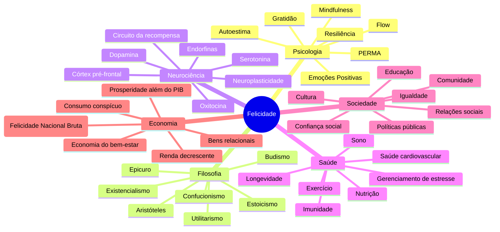
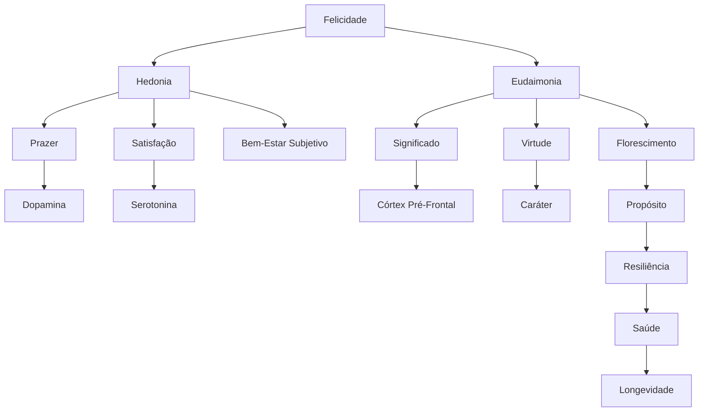
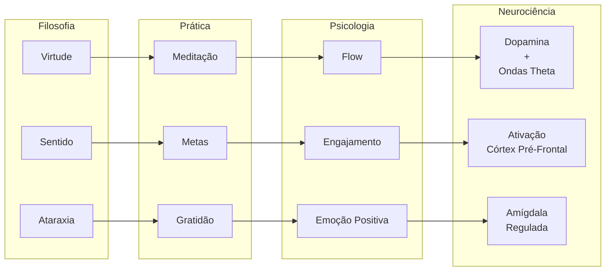
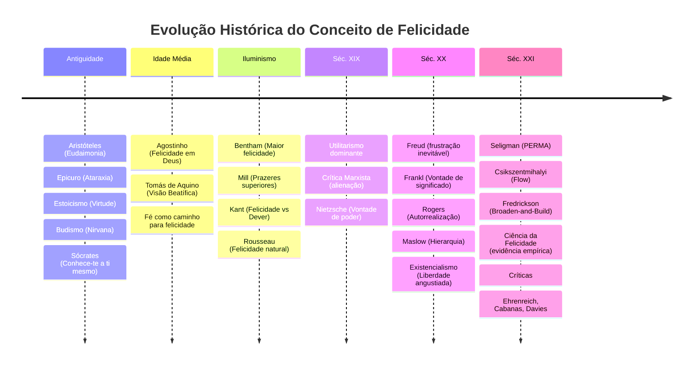

# Felicidade e Bem-Estar

## 1. Introdução

### 1.1 O que é felicidade?

Felicidade é um conceito multifacetado que tem ocupado a humanidade desde os primórdios da filosofia. Em termos gerais, felicidade pode ser definida como um estado de bem-estar subjetivo caracterizado por emoções positivas frequentes, satisfação com a vida e um senso de significado. No entanto, essa definição simples esconde uma complexidade imensa: o que significa "bem-estar" varia dramaticamente entre culturas, épocas históricas e indivíduos.

A pesquisa contemporânea distingue dois grandes eixos de compreensão da felicidade: a tradição hedônica e a tradição eudaimônica. Essa divisão não é meramente acadêmica — ela reflete duas maneiras fundamentalmente diferentes de conceber o que significa "viver bem".

### 1.2 Hedonia vs Eudaimonia

**Hedonia** (do grego *hedone*, prazer) refere-se à busca de prazer e à evitação da dor. Nessa visão, felicidade é essencialmente a maximização de experiências prazerosas e a minimização de experiências dolorosas. O hedonismo filosófico, defendido por pensadores como Aristipo de Cirene e posteriormente por Epicuro, coloca o prazer como o bem supremo. Na psicologia moderna, a hedonia é operacionalizada como *bem-estar subjetivo* (Subjective Well-Being, SWB), um constructo que inclui:

- Alta frequência de afeto positivo
- Baixa frequência de afeto negativo
- Satisfação global com a vida

**Eudaimonia** (do grego *eu* + *daimon*, "bom espírito" ou "viver de acordo com o verdadeiro eu") refere-se à realização do potencial humano, ao florescimento e à vida virtuosa. Para Aristóteles, a eudaimonia não é um estado subjetivo de sentir-se bem, mas um *modo de ser* — é a atividade da alma de acordo com a virtude, em uma vida completa. Na psicologia moderna, a eudaimonia é operacionalizada como *bem-estar psicológico* (Psychological Well-Being, PWB), que inclui dimensões como:

- Autonomia
- Domínio do ambiente
- Crescimento pessoal
- Relações positivas com outros
- Propósito na vida
- Autoaceitação

A grande descoberta da pesquisa empírica das últimas décadas é que hedonia e eudaimonia não são opostas, mas dimensões complementares. Pessoas que relatam altos níveis de ambos os tipos de bem-estar são as que apresentam os melhores indicadores de saúde mental, física e longevidade.

### 1.3 Por que felicidade é um tema central?

A felicidade é central para a vida humana por várias razões fundamentais:

1. **Teleológica**: A felicidade é frequentemente considerada o fim último (telos) da ação humana. Tudo o que fazemos — trabalhar, estudar, formar relacionamentos, criar arte — é, em última análise, em busca de uma vida que valha a pena ser vivida.

2. **Evolutiva**: As emoções positivas não são meramente subprodutos agradáveis da existência; elas têm funções evolutivas críticas. A Teoria da Ampliação e Construção (Broaden-and-Build Theory) de Barbara Fredrickson demonstra que emoções positivas ampliam nosso repertório de pensamento-ação e constroem recursos físicos, intelectuais, psicológicos e sociais duradouros.

3. **Sanitária**: Décadas de pesquisa epidemiológica mostram que pessoas felizes vivem mais, adoecem menos, têm sistemas imunológicos mais robustos e se recuperam mais rapidamente de doenças. O efeito da felicidade na longevidade é comparável ao de não fumar.

4. **Econômica e social**: Sociedades com maiores níveis de bem-estar subjetivo são mais produtivas, mais cooperativas, têm menos conflitos e melhor governança. Países como Butão substituíram o PIB pelo Felicidade Nacional Bruta como métrica de progresso.

5. **Existencial**: A busca por felicidade toca em questões fundamentais da condição humana — sentido, propósito, conexão, transcendência. Não é possível viver uma vida humana plena sem enfrentar a pergunta: "O que significa viver bem?"

---

## 2. Psicologia Positiva

### 2.1 O movimento da Psicologia Positiva

A Psicologia Positiva é um movimento científico formalizado por Martin Seligman em sua presidência da American Psychological Association (1998). Insatisfeito com o foco exclusivo da psicologia tradicional em patologias e disfunções, Seligman propôs que a psicologia também deveria estudar o que torna a vida digna de ser vivida. A Psicologia Positiva não nega o sofrimento — ela busca equilibrar o conhecimento sobre doença mental com conhecimento sobre saúde e florescimento.

### 2.2 O Modelo PERMA

Seligman, em seu livro *Flourish* (2011), propôs o modelo PERMA como uma teoria abrangente do bem-estar. PERMA é um acrônimo para cinco pilares que, juntos, constituem o florescimento humano:

#### 2.2.1 P — Positive Emotion (Emoção Positiva)

**Definição**: O pilar das emoções positivas inclui experiências subjetivas como alegria, gratidão, serenidade, interesse, esperança, orgulho, diversão, inspiração, admiração e amor. É a dimensão hedônica do bem-estar — sentir-se bem é um componente importante, embora não suficiente, do florescimento.

**Fundamento científico**: Fredrickson (2001) demonstrou que emoções positivas ampliam nossos horizontes cognitivos e comportamentais. Enquanto emoções negativas estreitam nosso foco (preparando-nos para lutar ou fugir), emoções positivas ampliam nosso repertório — nos tornamos mais criativos, mais abertos, mais conectados.

**A razão 3:1 de Losada**: Pesquisas sugerem que existe uma proporção mínima de 3 emoções positivas para cada 1 emoção negativa para que indivíduos e equipes floresçam. Isso não significa suprimir o negativo, mas cultivar intencionalmente o positivo.

**Exercícios práticos**:
- **Diário de emoções positivas**: Registre diariamente 3 momentos de emoção positiva, descrevendo o que aconteceu, como você se sentiu e o que contribuiu para a experiência.
- **Pasta de lembranças positivas**: Crie uma pasta física ou digital com fotos, bilhetes, lembranças que evocam momentos felizes. Recorra a ela em momentos difíceis.
- **Planeje prazer**: Agende intencionalmente atividades prazerosas em sua semana — um café com amigo, uma caminhada no parque, ouvir música.
- **Saboreie o positivo**: Quando algo bom acontecer, dedique pelo menos 20 segundos para realmente sentir a experiência. Respire, absorva, prolongue.

#### 2.2.2 E — Engagement (Engajamento)

**Definição**: Engajamento refere-se ao estado de absorção total em uma atividade, conhecido como *flow*. Quando engajados, perdemos a noção do tempo, o ego se aquieta e estamos completamente imersos no momento presente. Engajamento é diferente de prazer — podemos estar intensamente engajados em atividades difíceis e desafiadoras.

**Fundamento científico**: Mihaly Csikszentmihalyi, o pai do conceito de flow, descobriu que as pessoas relatam os níveis mais altos de satisfação não quando estão relaxando, mas quando estão profundamente envolvidas em atividades que equilibram desafio e habilidade.

**Exercícios práticos**:
- **Auditoria de flow**: Durante uma semana, registre suas atividades diárias e avalie (0-10) seu nível de engajamento em cada uma. Identifique padrões: o que gera flow para você?
- **Ajuste desafio/habilidade**: Para cada atividade importante, pergunte-se: o desafio é adequado à minha habilidade? Se muito desafiador, desenvolva novas habilidades; se pouco desafiador, aumente a complexidade.
- **Identifique forças de flow**: Em quais atividades você perde a noção do tempo? Essas são pistas para seu flow pessoal.
- **Crie rituais de imersão**: Estabeleça condições ambientais que favoreçam o flow — horário específico, local organizado, notificações desligadas.

#### 2.2.3 R — Relationships (Relacionamentos)

**Definição**: Relacionamentos positivos são o pilar mais robusto do bem-estar. Seres humanos são fundamentalmente sociais — nossa necessidade de pertencimento é tão básica quanto comida e abrigo. Relacionamentos não são apenas agradáveis; eles são constitutivos do bem-estar.

**Fundamento científico**: O Estudo do Desenvolvimento Adulto de Harvard (Grant Study), conduzido por mais de 80 anos, concluiu que a qualidade dos nossos relacionamentos é o preditor mais forte de felicidade, saúde e longevidade. Robert Waldinger, diretor do estudo, resume: "Boas relações nos mantêm mais felizes e mais saudáveis. Ponto."

**Exercícios práticos**:
- **Investimento ativo**: Relacionamentos requerem investimento. Entre em contato com alguém importante todos os dias — mesmo que seja uma mensagem curta.
- **Resposta ativa-construtiva**: Quando alguém compartilha uma boa notícia, responda com entusiasmo genuíno, fazendo perguntas e celebrando. Este é o padrão de resposta que mais fortalece relacionamentos.
- **Rituais de conexão**: Crie rituais regulares — jantar semanal com a família, café com um amigo, ligação para um parente.
- **Expressão de apreço**: Diga às pessoas o que você valoriza nelas. Não presuma que elas sabem.

#### 2.2.4 M — Meaning (Significado)

**Definição**: Significado é a sensação de que nossa vida faz parte de algo maior que nós mesmos. Não é sobre sentir-se bem, mas sobre servir a algo que transcende o eu — família, comunidade, causa, fé, legado. O significado pode vir acompanhado de dificuldade e sofrimento.

**Fundamento científico**: Viktor Frankl, psiquiatra e sobrevivente do Holocausto, argumentou em *Em Busca de Sentido* que a principal força motivadora dos seres humanos é a "vontade de significado" — a busca por sentido mesmo nas condições mais adversas. Pesquisas contemporâneas mostram que pessoas com alto senso de significado têm melhor saúde mental, maior resiliência e vivem mais.

**Exercícios práticos**:
- **Redação de propósito**: Escreva em uma página o que dá significado à sua vida. Revise periodicamente.
- **Conexão com valores**: Identifique seus 3 a 5 valores centrais e avalie se sua vida atual os reflete.
- **Serviço**: Engaje-se em atividades de voluntariado ou mentoria. Ajudar os outros é uma das fontes mais poderosas de significado.
- **Narrativa de vida**: Escreva sua história de vida como uma narrativa de herói — quais desafios você enfrentou, o que aprendeu, como cresceu.

#### 2.2.5 A — Accomplishment (Realização)

**Definição**: Realização é a busca por competência, mastery e conquista por si mesma. Sentimos bem-estar quando estabelecemos metas, nos esforçamos e alcançamos resultados. Realização não é sobre dinheiro ou status, mas sobre progredir em direção a objetivos que valorizamos.

**Fundamento científico**: Albert Bandura demonstrou que a autoeficácia — a crença em nossa capacidade de realizar tarefas — é um dos preditores mais fortes de bem-estar e desempenho. A cada pequena conquista, nossa autoeficácia cresce.

**Exercícios práticos**:
- **Metas SMART**: Estabeleça metas específicas, mensuráveis, alcançáveis, relevantes e com prazo definido. Acompanhe o progresso.
- **Diário de progresso**: Registre semanalmente 3 progressos em direção às suas metas (não importa quão pequenos).
- **Comemoração**: Celebre conquistas de forma significativa — não apenas as grandes, mas também os marcos intermediários.
- **Gerenciamento de energia vs tempo**: Foque em sustentar energia (sono, nutrição, movimento) e não apenas em gerenciar tempo.

### 2.3 Flow (Csikszentmihalyi)

#### 2.3.1 O que é flow?

Flow é um estado de experiência ótima caracterizado por:

- Concentração intensa e focada no momento presente
- Fusão entre ação e consciência
- Perda da autoconsciência reflexiva
- Sensação de controle sobre a atividade
- Distorção da percepção temporal (tempo passa rápido ou devagar)
- Experiência intrínsecamente gratificante (autotélica)
- Equilíbrio claro entre desafio e habilidade
- Feedback imediato e claro

#### 2.3.2 Condições para flow

A pesquisa de Csikszentmihalyi identificou condições essenciais para experimentar flow:

1. **Metas claras**: Saber exatamente o que precisa ser feito a cada momento.
2. **Feedback imediato**: Saber se você está indo bem ou precisa ajustar.
3. **Equilíbrio desafio-habilidade**: O desafio da atividade deve estar ligeiramente acima da sua habilidade média — nem tão fácil que gere tédio, nem tão difícil que gere ansiedade.

#### 2.3.3 Como alcançar flow

Para cultivar flow no dia a dia:

- **Escolha atividades que você intrinsicamente valoriza**: Flow não acontece em tarefas que fazemos por obrigação externa.
- **Reduza distrações**: Flow exige atenção sustentada. Desligue notificações, encontre um ambiente tranquilo.
- **Ajuste o desafio**: Se está entediado, aumente a complexidade; se está ansioso, desenvolva mais habilidades.
- **Busque feedback**: Crie sistemas de autoavaliação — métricas, listas de verificação, auto-observação.
- **Pratique presença**: O flow exige que você esteja totalmente no momento. Meditação de atenção plena fortalece essa capacidade.

---

## 3. Filosofia da Felicidade

### 3.1 Aristóteles — Eudaimonia e Virtude

Aristóteles, na *Ética a Nicômaco*, estabelece que a felicidade (eudaimonia) é o *summum bonum* — o bem supremo — da existência humana. Para ele, a felicidade não é um estado subjetivo passageiro, mas uma *atividade da alma de acordo com a virtude, em uma vida completa*.

**Pontos centrais**:
- **Função humana**: Aristóteles argumenta que cada coisa tem uma função (*ergon*) própria. A função do ser humano é a atividade racional. Portanto, viver bem é viver de acordo com a razão — exercendo as virtudes intelectuais e morais.
- **Virtude como meio-termo**: Cada virtude é o ponto médio entre dois extremos viciosos. A coragem, por exemplo, é o meio-termo entre a covardia (excesso de medo) e a temeridade (falta de medo).
- **Virtudes práticas e dianoéticas**: As virtudes morais (coragem, temperança, justiça) são hábitos cultivados pela prática. As virtudes intelectuais (sabedoria, inteligência, prudência) são desenvolvidas pelo ensino e pela reflexão.
- **Vida contemplativa**: O mais alto grau de eudaimonia é a vida contemplativa (*bios theoretikos*) — o exercício puro da razão em direção à verdade. No entanto, Aristóteles reconhece que isso é acessível apenas parcialmente a humanos, sendo mais próprio dos deuses.

**Para a vida prática**:
- Pergunte-se: "O que meu melhor eu faria nesta situação?"
- Cultive hábitos virtuosos — não porque são "certos", mas porque são constitutivos de uma vida florescente.
- Busque equilíbrio: evite extremos em todas as áreas da vida.
- Invista em amizade (*philia*): Aristóteles considerava a amizade virtuosa essencial para a eudaimonia.

### 3.2 Epicuro — Prazer, Ataraxia e Amizade

Epicuro (341-270 a.C.) propôs que o prazer é o bem supremo. Mas seu conceito de prazer era muito mais sutil do que hedonismo vulgar — ele distinguia entre prazeres catastemáticos (estáveis, ausência de dor) e prazeres cinéticos (momentâneos, ativos).

**Pontos centrais**:
- **Prazer catastemático**: O maior prazer é o estado de *ataraxia* — tranquilidade da alma, ausência de perturbação. Mais do que acumular prazeres intensos, a chave é remover as fontes de sofrimento e ansiedade.
- **Tetrapharmakos**: Os quatro remédios epicuristas: (1) Não tema os deuses (eles não se importam com humanos); (2) Não tema a morte (quando existimos, ela não existe; quando ela existe, não existimos); (3) O prazer é alcançável; (4) A dor é gerenciável.
- **Hierarquia dos prazeres**:
  - *Naturais e necessários*: comida, abrigo, amizade — devemos satisfazê-los.
  - *Naturais mas não necessários*: comida sofisticada, conforto luxuoso — podemos buscar moderadamente.
  - *Não naturais nem necessários*: fama, riqueza excessiva, poder — devem ser evitados, pois geram mais ansiedade que prazer.
- **Jardinagem epicurista**: Epicuro fundou uma comunidade filosófica, o Jardim, onde a amizade era o maior dos prazeres. "Antes da amizade, a sabedoria não escolheu nada", dizia ele.

**Para a vida prática**:
- Faça uma auditoria dos seus desejos: quais são realmente necessários? Quais geram mais ansiedade do que satisfação?
- Cultive a ataraxia: simplifique sua vida, reduza fontes de ansiedade desnecessárias.
- Invista profundamente em amizades verdadeiras — elas são, para Epicuro, o bem mais seguro e prazeroso.
- Aprenda a contentar-se com pouco: "Se quiser fazer um homem feliz, não aumente suas posses, mas reduza seus desejos."

### 3.3 Estoicismo — Tranquilidade, Virtude e Controle

O Estoicismo, fundado por Zenão de Cítio (séc. III a.C.) e desenvolvido por Sêneca, Epiteto e Marco Aurélio, é uma filosofia centrada na virtude como único bem verdadeiro e na tranquilidade da alma como resultado natural da vida virtuosa.

**Pontos centrais**:
- **Dicotomia do controle**: Epiteto, no *Encheiridion*, estabelece que algumas coisas estão sob nosso controle (julgamentos, valores, ações, desejos) e outras não (saúde, riqueza, reputação, morte). A felicidade está em focar exclusivamente no que controlamos e aceitar serenamente o que não controlamos.
- **Virtude como bem único**: Para os estoicos, virtude (sabedoria, justiça, coragem, temperança) é o único bem. Riqueza, saúde, prazer são "preferíveis" mas não bens; pobreza, doença, dor são "não preferíveis" mas não males.
- **Ataraxia e apatheia**: Não se trata de eliminar emoções, mas de eliminar paixões perturbadoras (*apatheia* = sem pathos negativo). O sábio estoico experimenta emoções mas não é dominado por elas.
- **Amor fati**: Amar o destino — não apenas aceitar, mas abraçar tudo o que acontece como necessário para o bem do todo.
- **Memento mori**: A consciência da morte não é mórbida, mas um lembrete para viver cada momento com presença e valor.

**Para a vida prática**:
- **Premeditatio malorum**: Antecipe mentalmente possíveis dificuldades — não para se preocupar, mas para se preparar e valorizar o presente.
- **Foque no que controla**: Quando algo angustiante acontecer, pergunte: "Isso está sob meu controle? Se não, deixe estar. Se sim, aja."
- **Veja os obstáculos como oportunidades**: "O fogo prova o ouro; a adversidade prova o homem forte." (Sêneca)
- **Journaling estoico**: Ao final do dia, revise: O que fiz bem? O que poderia fazer melhor? O que aprendi?

### 3.4 Utilitarismo — A Maior Felicidade

O Utilitarismo é uma teoria ética e política desenvolvida por Jeremy Bentham e John Stuart Mill que coloca a felicidade como o fundamento da moralidade. O princípio central é: "A maior felicidade para o maior número."

**Bentham**:
- **Cálculo hedônico**: Bentham propôs que podemos calcular moralidade medindo prazer e dor em sete dimensões: intensidade, duração, certeza, proximidade, fecundidade, pureza e extensão.
- **Quantidade sobre qualidade**: Para Bentham, todos os prazeres são equivalentes — "pushpin é tão bom quanto poesia".

**Mill**:
- **Qualidade sobre quantidade**: Mill respondeu a Bentham distinguindo prazeres superiores (intelectuais, morais, estéticos) de prazeres inferiores (meramente físicos). "É melhor ser um Sócrates insatisfeito do que um tolo satisfeito."
- **Liberdade individual**: Mill argumentou que a felicidade coletiva depende da liberdade individual — só podemos florescer quando temos liberdade para experimentar, errar e crescer.
- **Felicidade como bem-estar**: Mill antecipou a psicologia positiva moderna ao entender felicidade não como mero prazer, mas como desenvolvimento pleno das capacidades humanas.

**Críticas ao Utilitarismo**:
- Dificuldade de medir e comparar felicidade entre pessoas
- Potencial para justificar violações de direitos em nome do "bem maior"
- Ignora a importância de relacionamentos e projetos pessoais que não maximizam utilidade

### 3.5 Existencialismo — Liberdade e Absurdo

O Existencialismo, representado por Jean-Paul Sartre e Albert Camus, oferece uma perspectiva radicalmente diferente sobre felicidade.

**Sartre**:
- **Liberdade radical**: "Estamos condenados à liberdade." Não há essência humana pré-definida — existimos primeiro, e então nos definimos por nossas escolhas.
- **Angústia**: A liberdade total gera angústia, pois somos inteiramente responsáveis por nós mesmos e, através de nossas escolhas, pela humanidade inteira.
- **Má-fé**: A infelicidade surge quando negamos nossa liberdade e responsabilidade, fingindo que "não tivemos escolha".
- **Felicidade na autenticidade**: Viver autenticamente — reconhecendo nossa liberdade, assumindo responsabilidade por nossas escolhas — é a única via para uma vida significativa.

**Camus**:
- **O Absurdo**: O universo não tem significado inerente. O absurdo é o conflito entre nosso desejo humano de significado e o silêncio indiferente do cosmos.
- **Resposta ao absurdo**: Nem suicídio (escapismo) nem salto da fé (esperança irracional), mas revolta — continuar vivendo com paixão apesar do absurdo.
- **Sísifo feliz**: Camus conclui *O Mito de Sísifo* com a imagem de Sísifo feliz enquanto empurra seu rochedo. A felicidade está em abraçar a luta, encontrar significado no próprio ato de viver.
- **A liberdade absurda**: Livre de esperança por um significado transcendente, podemos nos dedicar plenamente às experiências terrenas — ao sol, ao mar, aos amores, à amizade, à revolta criativa.

**Para a vida prática**:
- Assuma responsabilidade: Sua vida é sua obra. Não terceirize escolhas.
- Viva com autenticidade: Alinhe suas ações com seus valores, mesmo que seja desconfortável.
- Encontre significado na jornada, não no destino.
- Cultive a revolta criativa: engaje-se em causas, crie arte, ame profundamente — apesar da ausência de garantias cósmicas.

### 3.6 Budismo — Sofrimento, Desapego e Compaixão

O Budismo, fundado por Siddhartha Gautama (Buda) no século V a.C., oferece uma análise profunda da natureza da felicidade e do sofrimento.

**As Quatro Nobres Verdades**:
1. **Dukkha (sofrimento)**: A vida envolve sofrimento — nascimento, doença, envelhecimento, morte, mas também a insatisfação fundamental de não obter o que queremos e de nos separar do que amamos.
2. **Samudaya (origem)**: O sofrimento surge do desejo (tanha) e do apego (upadana) — queremos que as coisas sejam diferentes do que são.
3. **Nirodha (cessação)**: É possível cessar o sofrimento — liberando o apego, alcançando o nirvana.
4. **Marga (caminho)**: O Nobre Caminho Óctuplo — visão correta, intenção correta, fala correta, ação correta, meio de vida correto, esforço correto, atenção plena correta, concentração correta.

**Conceitos-chave**:
- **Anicca (impermanência)**: Tudo muda. O apego a estados prazerosos gera sofrimento inevitável.
- **Anatta (não-eu)**: Não há um eu fixo e permanente. A ilusão de um eu separado é fonte de sofrimento.
- **Metta (compaixão amorosa)**: A felicidade genuína surge não da satisfação dos desejos pessoais, mas do cultivo da compaixão por todos os seres.
- **Mindfulness (sati)**: A atenção plena ao momento presente, sem julgamento, é a prática central para libertar-se do sofrimento.

**Para a vida prática**:
- Pratique meditação mindfulness diariamente — mesmo 10 minutos.
- Observe seus desejos sem agir impulsivamente. Pergunte: "Este desejo traz felicidade duradoura ou mais sofrimento?"
- Cultive compaixão — por você mesmo e pelos outros.
- Abrace a impermanência: valorize cada momento porque ele não durará.
- Pratique desapego — não de pessoas e coisas, mas da necessidade de controlá-las.

---

## 4. Práticas Baseadas em Evidência

### 4.1 Gratidão

A gratidão é uma das práticas mais estudadas e eficazes na psicologia positiva. Robert Emmons e Michael McCullough demonstraram que pessoas que praticam gratidão regularmente relatam níveis mais altos de bem-estar, melhor saúde física e mais resiliência.

**Mecanismos de ação**:
- Amplifica emoções positivas (o cérebro fica "sintonizado" para notar o que é bom)
- Reduz a hedônica adaptação (ajuda a não "acostumar-se" com o que é bom)
- Fortalece relacionamentos (expressar gratidão aprofunda vínculos)
- Reduz comparações sociais negativas (foco no que se tem, não no que falta)

**Exercício — Carta de Gratidão**:
- Escreva uma carta detalhada para alguém a quem você nunca agradeceu adequadamente
- Descreva especificamente o que a pessoa fez e como isso impactou sua vida
- Leia a carta em voz alta para a pessoa (presencialmente ou por videochamada)
- Este exercício produz um dos maiores aumentos mensuráveis de felicidade identificados pela pesquisa

**Exercício — Diário de Gratidão**:
- Todas as noites, escreva 3 coisas pelas quais você é grato
- Seja específico — não apenas "minha família", mas "a conversa sincera que tive com minha irmã hoje"
- Inclua coisas pequenas e cotidianas
- Varie os itens a cada dia (evite repetição automática)
- Por uma semana, tente incluir pelo menos um item sobre você mesmo

**Pesquisa-chave**: Emmons & McCullough (2003) — participantes que escreveram sobre gratidão semanalmente por 10 semanas relataram 25% mais emoções positivas, dormiram melhor e fizeram mais exercícios.

### 4.2 Mindfulness e Meditação

Mindfulness (atenção plena) é a prática de prestar atenção ao momento presente, intencionalmente e sem julgamento. Originada das tradições budistas, foi secularizada por Jon Kabat-Zinn no programa MBSR (Redução de Estresse Baseada em Mindfulness).

**Benefícios documentados**:
- Redução de estresse, ansiedade e depressão
- Melhora da atenção e concentração
- Aumento da regulação emocional
- Melhora da imunidade e redução da inflamação
- Aumento da satisfação com a vida

**Exercício — Respiração Consciente (5 minutos)**:
1. Sente-se confortavelmente, colunas eretas
2. Feche os olhos ou abaixe o olhar
3. Traga atenção para sua respiração natural — não a controle
4. Observe o ar entrando e saindo — sensações nas narinas, peito, abdômen
5. Quando a mente vagar (e ela vai vagar), gentilmente retorne à respiração
6. Faça isso por 5 minutos diariamente

**Exercício — Escaneamento Corporal (10-20 minutos)**:
1. Deite-se ou sente-se confortavelmente
2. Traga atenção para os pés — sensações, temperatura, pressão
3. Lentamente mova a atenção para cima — pernas, tronco, braços, cabeça
4. Em cada área, apenas observe — não tente mudar nada
5. Se encontrar tensão, respire para aquela área e observe

**Pesquisa-chave**: Estudos de neuroimagem (Holzel et al., 2011) mostraram que 8 semanas de MBSR reduziram o volume da amígdala (centro de estresse) e aumentaram a densidade de massa cinzenta no hipocampo (memória) e córtex pré-frontal (regulação emocional).

### 4.3 Savoring (Saborear Experiências Positivas)

Savoring é a capacidade de apreciar e intensificar experiências positivas. Fred Bryant e Joseph Veroff, principais pesquisadores do tema, definem savoring como "a atenção, apreciação e amplificação consciente de experiências positivas".

**Tipos de savoring**:
1. **Antecipação**: Saborear antes — pensar em um evento futuro agradável
2. **Saborear o presente**: Absorver completamente uma experiência positiva enquanto acontece
3. **Rememoração**: Reviver mentalmente experiências positivas passadas

**Técnicas de savoring**:
- **Compartilhar com outros**: Conte a alguém sobre sua experiência positiva
- **Absorção total**: Mergulhe completamente na experiência sem distrações
- **Foco sensorial**: Concentre-se em detalhes sensoriais — sabores, cheiros, texturas
- **Auto-parabenização**: Reconheça seu papel na criação da experiência positiva
- **Registro**: Tire fotos, escreva sobre o momento, guarde lembranças

**Exercício — Savoring guiado**:
1. Escolha uma experiência positiva do seu dia (um café gostoso, um pôr-do-sol, um elogio recebido)
2. Pare completamente o que está fazendo por 30 segundos a 1 minuto
3. Engaje todos os sentidos: veja, ouça, sinta, cheire
4. Diga para si mesmo: "Estou saboreando este momento"
5. Respire e deixe a experiência preencher você
6. Ao final, sorria e agradeça mentalmente

**Pesquisa-chave**: Bryant (2003) — pessoas que pontuam alto em savoring relatam maior felicidade, satisfação com a vida e menor depressão, controlando para traços de personalidade.

### 4.4 Atos de Bondade

Atos de bondade são ações intencionais que beneficiam outros. A pesquisa mostra que praticar bondade regularmente aumenta significativamente o bem-estar de quem a pratica.

**Mecanismos**:
- **Aumento da conexão social**: Bondade fortalece laços
- **Redução do foco em si mesmo**: Quebra o ciclo de ruminação (preocupação excessiva consigo mesmo)
- **Aumento da autoeficácia**: "Eu posso fazer a diferença"
- **Efeito "helper's high"**: Atos de bondade liberam endorfinas e oxitocina

**Exercício — 5 Atos de Bondade em um Dia**:
- Realize 5 atos de bondade em um único dia
- Eles podem ser grandes ou pequenos: segurar a porta, dar um elenco genuíno, ajudar um colega, doar para uma causa
- Varie os tipos de bondade e as pessoas beneficiadas
- Registre como você se sentiu antes, durante e depois

**Pesquisa-chave**: Sonja Lyubomirsky demonstrou que praticar 5 atos de bondade por semana por 6 semanas aumentou significativamente a felicidade dos participantes.

### 4.5 Fortalezas de Caráter (VIA Character Strengths)

O projeto VIA (Values in Action), liderado por Christopher Peterson e Martin Seligman, identificou 24 fortalezas de caráter universalmente valorizadas através de culturas.

**As 6 Virtudes e 24 Fortalezas**:

| Virtude | Fortalezas |
|---------|------------|
| Sabedoria | Criatividade, Curiosidade, Mente aberta, Amor pelo aprendizado, Perspectiva |
| Coragem | Bravura, Perseverança, Honestidade, Energia |
| Humanidade | Amor, Bondade, Inteligência social |
| Justiça | Cidadania, Justiça, Liderança |
| Temperança | Perdão, Humildade, Prudência, Autorregulação |
| Transcendência | Apreciação da beleza, Gratidão, Esperança, Humor, Espiritualidade |

**Exercício — Identificação e Uso de Fortalezas**:
1. Faça o VIA Survey gratuito em viacharacter.org
2. Identifique suas 5 fortalezas principais (signature strengths)
3. Por uma semana, use sua fortaleza principal de uma nova maneira a cada dia
4. Registre como se sentiu ao usar a fortaleza
5. Pergunte-se: "Como posso usar minhas fortalezas para superar desafios atuais?"

**Pesquisa-chave**: O uso regular de fortalezas de caráter está associado a maior felicidade, menor depressão e maior engajamento no trabalho e na vida.

### 4.6 Relações Sociais — O Preditor Mais Forte

A pesquisa é inequívoca: relacionamentos de qualidade são o preditor mais forte e consistente de felicidade e saúde.

**Dados científicos**:
- Estudo de Harvard (Grant Study): acompanhou homens por 80+ anos e concluiu que relacionamentos são o fator mais importante para felicidade e longevidade
- Estudos de Diener & Seligman (2002): pessoas muito felizes são significativamente mais sociais
- Meta-análises mostram que isolamento social é tão prejudicial à saúde quanto fumar 15 cigarros por dia

**O que funciona**:
- **Quantidade E qualidade**: Ambos importam — ter uma rede social ampla E relacionamentos profundos
- **Revelação mútua**: Compartilhar vulnerabilidades fortalece vínculos
- **Celebração compartilhada**: Como você responde às boas notícias dos outros importa mais do que como responde às más
- **Rituais de conexão**: Encontros regulares e previsíveis criam senso de pertencimento

**Exercício — Mapa de Relacionamentos**:
1. Liste as pessoas mais importantes da sua vida
2. Avalie (1-10) a qualidade de cada relacionamento
3. Avalie (1-10) o tempo/dedicação que você investe em cada um
4. Identifique onde há desequilíbrio: relacionamentos importantes que recebem pouco investimento
5. Escolha um relacionamento para fortalecer esta semana e planeje uma ação específica

---

## 5. O Lado Sombrio da Felicidade

### 5.1 A Tirania da Positividade

Nas últimas décadas, especialmente nos Estados Unidos, desenvolveu-se uma "cultura da felicidade" que pode ser tão opressiva quanto libertadora. Autores como Barbara Ehrenreich (*Smile or Die*) e Edgar Cabanas (*Happycracia*) criticam a indústria da felicidade e a imposição social do otimismo.

**Críticas**:
- **Mercantilização da felicidade**: A felicidade tornou-se um produto vendido por coaches, livros de autoajuda e aplicativos — uma obrigação individual que isenta sistemas sociais de responsabilidade.
- **Culpa estrutural**: Ao colocar a felicidade como responsabilidade individual, a cultura da positividade culpabiliza pessoas pobres, doentes ou oprimidas por sua "falta de felicidade".
- **Negação da realidade social**: "Basta pensar positivo" — a ênfase excessiva na atitude mental ignora desigualdades estruturais, injustiças e violências reais.
- **Patologização da tristeza**: Emoções negativas são vistas como disfunções a serem eliminadas, não como respostas normais e adaptativas a circunstâncias adversas.

### 5.2 Toxic Positivity

Toxic positivity (positividade tóxica) é a crença de que devemos manter uma atitude positiva a qualquer custo, invalidando emoções negativas genuínas.

**Exemplos de positividade tóxica**:
- "Poderia ser pior" (invalida o sofrimento)
- "Apenas seja grato pelo que tem"
- "O universo está conspirando a seu favor" (em momentos de tragédia)
- "Não seja negativo" (quando alguém expressa preocupação legítima)
- "Tudo acontece por uma razão" (em situações de perda e trauma)

**Por que é prejudicial**:
- Impede o processamento saudável de emoções
- Cria vergonha por sentir emoções "negativas"
- Bloqueia a empatia — pessoas se sentem não ouvidas e sozinhas
- Pode atrasar a busca por ajuda profissional (terapia, medicação)

**Alternativa saudável**:
- Validação emocional: "Isso deve ser muito difícil para você"
- Presença compassiva: "Estou aqui com você"
- Aceitação radical: reconhecer que a tristeza, a raiva e o medo são partes naturais da vida

### 5.3 Felicidade Obrigatória como Opressão

A obrigação social de ser feliz pode se tornar uma forma sutil de controle. Em sociedades que cultuam a felicidade:

- **Pessoas deprimidas são duplamente penalizadas**: primeiro pelo sofrimento em si; segundo pela culpa de "não conseguir ser feliz"
- **A felicidade como dever moral**: "Você tem tantas bênçãos, por que está triste?"
- **Uniformidade emocional**: Emprego de diversidade e "inteligência emocional" para exigir que funcionários/sempre mostrem entusiasmo

Estudos de caso: empresas que demitem funcionários por "atitude negativa", influencers que promovem vidas falsamente perfeitas, escolas que ensinam "resiliência" como aceitação passiva de condições adversas.

### 5.4 O Direito à Tristeza

A tristeza não é o oposto da felicidade — é parte integrante de uma vida plena. Muitos filósofos e psicólogos argumentam que devemos reivindicar o direito à tristeza:

- **A tristeza como sabedoria**: A tristeza nos conecta com profundidade, nos torna mais empáticos e reflexivos. Uma vida sem tristeza seria superficial.
- **Funções evolutivas da tristeza**: Sinaliza perda, pede apoio social, promove reflexão, inibe comportamentos arriscados.
- **Tristeza saudável vs depressão clínica**: Há diferença fundamental entre tristeza situacional e transtorno depressivo. Patologizar a tristeza normal é tão prejudicial quanto romantizar a depressão.
- **A felicidade como um espectro**: Vidas plenas incluem toda a gama de emoções humanas. A verdadeira felicidade não é ausência de sofrimento, mas capacidade de sentir plenamente — alegria e tristeza, amor e perda, entusiasmo e luto.

**Para a prática**:
- Permita-se sentir plenamente emoções "negativas" sem julgamento
- Crie espaço para o luto, a raiva e a tristeza em sua vida
- Busque apoio social quando estiver sofrendo — não precisa passar por isso sozinho
- Lembre-se: você não está falhando quando está triste. Você está sendo humano.

---

## 6. Cross-Mapping: Felicidade em Perspectiva Interdisciplinar







```mermaid
quadrantChart
    title Matriz Felicidade: Hedonia vs Eudaimonia
    x-axis Prazer --> Significado
    y-axis Baixo esforço --> Alto esforço
    quadrant-1 "Vazio Hedônico" (excesso de prazer, poco significado: vícios, compulsões)
    quadrant-2 "Florescimento" (significado + prazer elevado: vida plena)
    quadrant-3 "Apatia" (pouco prazer, pouco significado: depressão)
    quadrant-4 "Esforço Estoico" (significado sem prazer: ascetismo exagerado)
    "Leitura": [0.85, 0.7]
    "Jogar videogame com amigos": [0.6, 0.3]
    "Trabalho voluntário": [0.9, 0.75]
    "Assistir TV sozinho": [0.3, 0.15]
    "Correr maratona": [0.8, 0.8]
    "Comer chocolate": [0.4, 0.05]
    "Meditar": [0.75, 0.6]
    "Festa com amigos": [0.7, 0.4]
```



---

## 7. Exercícios Práticos Detalhados

### 7.1 Diário de Gratidão

**Objetivo**: Treinar o cérebro para notar e apreciar o positivo.

**Estrutura diária** (escrever todas as noites, 5-10 minutos):

```
Data: [data]

Três coisas pelas quais sou grato hoje:
1. _________________________________________________
   Por que isso aconteceu? _________________________
   Como me senti? __________________________________
   Quem contribuiu para isso? _______________________

2. _________________________________________________
   Por que isso aconteceu? _________________________
   Como me senti? __________________________________
   Quem contribuiu para isso? _______________________

3. _________________________________________________
   Por que isso aconteceu? _________________________
   Como me senti? __________________________________
   Quem contribuiu para isso? _______________________

Uma coisa positiva sobre mim mesmo hoje:
_____________________________________________________

Uma coisa bonita que notei hoje:
_____________________________________________________
```

**Recomendações**:
- Seja específico: "café quente pela manhã com minha filha" em vez de "família"
- Inclua pelo menos um item inesperado ou surpreendente
- Varie os itens a cada dia (evitar repetição automática)
- Uma vez por semana, inclua algo sobre um desafio que enfrentou

**Duração sugerida**: 21 dias consecutivos, depois 3-4 vezes por semana como manutenção.

### 7.2 Identificação de Fortalezas (VIA Survey)

**Objetivo**: Conhecer e usar suas forças de caráter únicas.

**Passo a passo**:

1. **Faça o teste**: Acesse viacharacter.org e responda o VIA Survey (gratuito, ~15 minutos)
2. **Receba seus resultados**: Você receberá um ranking das 24 fortalezas, com as 5 primeiras como "signature strengths"
3. **Reflita sobre suas fortalezas principais**:

```
Minha fortaleza #1: __________________
  - Como essa fortaleza se manifesta na minha vida? __________________________________
  - Quando foi a última vez que usei essa fortaleza? __________________________________
  - Como posso usá-la mais no trabalho/estudos? __________________________________
  - Como posso usá-la mais nos relacionamentos? __________________________________
  - Essa fortaleza é apreciada por outros? Em caso negativo, por que? ________________

Minha fortaleza #2: __________________
  [mesmas perguntas]

[Repetir para as 5 fortalezas principais]
```

4. **Plano de uso de 7 dias**:

| Dia | Fortaleza | Nova maneira de usar |
|-----|-----------|---------------------|
| Seg | _________ | ___________________ |
| Ter | _________ | ___________________ |
| Qua | _________ | ___________________ |
| Qui | _________ | ___________________ |
| Sex | _________ | ___________________ |
| Sáb | _________ | ___________________ |
| Dom | _________ | ___________________ |

5. **Avaliação**: Ao final da semana, avalie (1-10): "Usar minhas fortalezas aumentou meu bem-estar?"

### 7.3 Desenho de Vida com Propósito (Ikigai Adaptado)

**Objetivo**: Mapear a interseção entre o que você ama, o que você é bom, o que o mundo precisa e o que pode sustentá-lo.

**Instruções**: Desenhe quatro círculos sobrepostos (diagrama de Venn). Preencha cada círculo com respostas honestas e detalhadas.

**Círculo 1 — O que você ama**:
- Atividades que fazem você perder a noção do tempo
- Tópicos que você poderia discutir por horas
- Experiências que geram flow
- O que você faria mesmo sem ser pago

**Círculo 2 — O que você é bom**:
- Habilidades técnicas que você desenvolveu
- Talentos naturais
- Áreas onde outros frequentemente pedem sua ajuda
- Conquistas das quais você se orgulha

**Círculo 3 — O que o mundo precisa**:
- Problemas que te incomodam profundamente
- Necessidades que você observa na sua comunidade, cidade, planeta
- Causas que te motivam a agir
- Onde você sente que pode fazer diferença

**Círculo 4 — O que pode sustentá-lo**:
- Carreiras que podem gerar renda
- Habilidades monetizáveis
- Modelos de negócio alinhados com seus valores
- Fontes de sustentabilidade (não apenas dinheiro: tempo, energia, suporte)

**Interseções**:

| Interseção | Resultado | Pergunta de reflexão |
|-----------|-----------|----------------------|
| Ame + Bom | Paixão | Quanto da minha vida é dedicado à paixão? |
| Bom + Mundo | Profissão | Minha profissão está alinhada ao que o mundo precisa? |
| Mundo + Sustento | Vocação | Minha vocação é financeiramente sustentável? |
| Sustento + Ame | Missão | Minha missão de vida também me sustenta? |
| Ame + Bom + Mundo | Propósito | Meu propósito está claro e eu vivo de acordo? |
| Bom + Mundo + Sustento | Carreira | Minha carreira equilibra competência, contribuição e sustento? |
| Ame + Mundo + Sustento | Chamado | Meu chamado considera prazer, contribuição e realidade? |
| Ame + Bom + Sustento | Hobby sustentável | Meu hobby pode se tornar algo mais? |
| **Centro (todos 4)** | **Ikigai** | **Essa é sua razão de ser** |

### 7.4 Prática de Savoring Guiada

**Objetivo**: Amplificar experiências positivas através da atenção deliberada.

**Versão 1 — Savoring do presente** (3-5 minutos):

```
1. Escolha algo para saborear: uma xícara de café, um pôr-do-sol, uma música, um abraço
2. Pare completamente o que está fazendo
3. RESPIRE: 3 respirações profundas, presentes
4. OLHE: Observe detalhes visuais — cores, formas, movimento
5. ESCUTE: Feche os olhos. Quais sons estão presentes?
6. SINTA: Sensações físicas — temperatura, textura, contato
7. CHEIRE: Aromas sutis ao redor
8. SE POSSÍVEL, PROVE: Sabores, nuances
9. SENTIMENTO: Que emoção você está sentindo? Nomeie-a
10. APRECIE: Diga para si mesmo: "Estou saboreando este momento"
11. PROLONGUE: Deixe a sensação durar mais 30 segundos
12. AGRADEÇA: Mentalmente, agradeça pela experiência
```

**Versão 2 — Savoring de memória** (5 minutos):

```
1. Escolha uma memória positiva recente (última semana)
2. Feche os olhos e visualize a cena
3. Detalhes visuais: onde estava, cores, luz
4. Pessoas: quem estava com você, expressões, contato visual
5. Sons: o que se ouvia? Vozes, música, natureza?
6. Cheiros: aromas específicos
7. Como seu corpo se sentia: conforto, energia, relaxamento
8. Emoção: o que você sentiu? Alegria, orgulho, gratidão, amor?
9. Amplifique: deixe a emoção crescer
10. Conclusão: "Sou grato por ter vivido este momento"
```

**Diário de savoring** (após cada prática):

- O que saboreei: __________________________________
- Detalhes sensoriais mais marcantes: _______________
- Emoção predominante: ______________________________
- Intensidade (1-10): ______
- Quanto tempo dediquei: ______ minutos
- Notas adicionais: _________________________________

### 7.5 Meditação de Compaixão (Metta Bhavana)

**Objetivo**: Cultivar amor bondoso e compaixão — por si mesmo, por entes queridos, por pessoas neutras, por pessoas difíceis e por todos os seres.

**Estrutura completa** (15-20 minutos):

```
Fase 1 — Eu mesmo (5 minutos)
  1. Sente-se confortavelmente, olhos fechados
  2. Respire profundamente 3 vezes
  3. Coloque a mão sobre o coração
  4. Repita mentalmente, com intenção genuína:
     - "Que eu seja feliz"
     - "Que eu seja saudável"
     - "Que eu esteja seguro"
     - "Que eu viva com leveza"
  5. Se sentir resistência ou autocrítica, apenas observe
  6. Continue repetindo as frases, sentindo o que elas evocam

Fase 2 — Alguém que você ama (3 minutos)
  1. Visualize uma pessoa que você ama profundamente
  2. Veja o sorriso dela, sinta sua presença
  3. Ofereça as mesmas frases:
     - "Que você seja feliz"
     - "Que você seja saudável"
     - "Que você esteja seguro"
     - "Que você viva com leveza"
  4. Sinta o calor da compaixão fluindo

Fase 3 — Pessoa neutra (3 minutos)
  1. Visualize alguém que você nem ama nem desgosta
     (um colega de trabalho, um vizinho, o atendente de uma loja)
  2. Reconheça que essa pessoa também deseja ser feliz
  3. Ofereça as mesmas frases a ela

Fase 4 — Pessoa difícil (3 minutos)
  1. Visualize alguém com quem você tem conflito ou dificuldade
  2. Comece com um desejo modesto: "Que você encontre paz"
  3. Se for muito difícil, imagine uma dificuldade que ela enfrenta
  4. Ofereça compaixão dentro dos seus limites atuais
  5. Não force — respeite seu próprio processo

Fase 5 — Todos os seres (3 minutos)
  1. Expanda a compaixão para todas as direções
  2. Leste, oeste, norte, sul, acima, abaixo
  3. "Que todos os seres sejam felizes"
  4. "Que todos os seres estejam seguros"
  5. "Que todos os seres vivam com paz e leveza"
  6. Sinta a conexão com toda a vida

Fecho (1 minuto)
  1. Gradualmente traga atenção de volta para a respiração
  2. Descanse na sensação de calor e conexão
  3. Quando estiver pronto, abra os olhos lentamente
```

**Variações**:
- **Versão curta** (5 minutos): Faça apenas as fases 1 e 5
- **Metta para situações específicas**: Adapte as frases para contextos: "Que eu encontre força nesta dificuldade"
- **Compassão autodirigida**: Quando estiver sofrendo, pratique apenas a fase 1 com frases como "Que eu tenha paz neste momento difícil"

**Pesquisa**: A prática regular de metta (8 semanas, 20 min/dia) mostrou aumentar emoções positivas diárias, melhorar relações sociais e reduzir sintomas depressivos (Fredrickson et al., 2008; Hutcherson et al., 2008).

---

## 8. Referências e Leituras Recomendadas

### Referências Acadêmicas

- **Seligman, M. E. P.** (2002). *Authentic Happiness*. New York: Free Press.
- **Seligman, M. E. P.** (2011). *Flourish*. New York: Simon & Schuster.
- **Csikszentmihalyi, M.** (1990). *Flow: The Psychology of Optimal Experience*. New York: Harper & Row.
- **Csikszentmihalyi, M.** (1997). *Finding Flow*. New York: Basic Books.
- **Fredrickson, B. L.** (2001). The role of positive emotions in positive psychology: The broaden-and-build theory of positive emotions. *American Psychologist*, 56(3), 218-226.
- **Fredrickson, B. L.** (2009). *Positivity*. New York: Crown.
- **Fredrickson, B. L., Cohn, M. A., Coffey, K. A., Pek, J., & Finkel, S. M.** (2008). Open hearts build lives: Positive emotions, induced through loving-kindness meditation, build consequential personal resources. *Journal of Personality and Social Psychology*, 95(5), 1045-1062.
- **Lyubomirsky, S.** (2007). *The How of Happiness*. New York: Penguin Press.
- **Lyubomirsky, S., King, L., & Diener, E.** (2005). The benefits of frequent positive affect: Does happiness lead to success? *Psychological Bulletin*, 131(6), 803-855.
- **Diener, E., & Seligman, M. E. P.** (2002). Very happy people. *Psychological Science*, 13(1), 81-83.
- **Emmons, R. A., & McCullough, M. E.** (2003). Counting blessings versus burdens: An experimental investigation of gratitude and subjective well-being. *Journal of Personality and Social Psychology*, 84(2), 377-389.
- **Bryant, F. B., & Veroff, J.** (2007). *Savoring: A New Model of Positive Experience*. Mahwah, NJ: Lawrence Erlbaum.
- **Peterson, C., & Seligman, M. E. P.** (2004). *Character Strengths and Virtues: A Handbook and Classification*. New York: Oxford University Press.
- **Kabat-Zinn, J.** (1994). *Wherever You Go, There You Are*. New York: Hyperion.
- **Holzel, B. K., Carmody, J., Vangel, M., et al.** (2011). Mindfulness practice leads to increases in regional brain gray matter density. *Psychiatry Research*, 191(1), 36-43.
- **Waldinger, R. J., & Schulz, M. S.** (2023). *The Good Life: Lessons from the World's Longest Scientific Study of Happiness*. New York: Simon & Schuster.

### Referências Filosóficas

- **Aristóteles**. *Ética a Nicômaco*. (Trad. port.: Edipro, Martin Claret, ou traduções de António de Castro Caeiro).
- **Epicuro**. *Carta sobre a Felicidade (Carta a Meneceu)*. (Trad. port.: diversas edições).
- **Epiteto**. *Encheiridion / Manual de Epiteto*. (Trad. port.: Edipro, ou edições estoicas).
- **Marco Aurélio**. *Meditações*. (Trad. port.: diversas edições — recomenda-se a tradução de Edson Bini).
- **Sêneca**. *Sobre a Brevidade da Vida / Da Vida Feliz*. (Trad. port.: diversas edições).
- **Bentham, J.** (1789). *An Introduction to the Principles of Morals and Legislation*.
- **Mill, J. S.** (1863). *Utilitarismo*.
- **Sartre, J.-P.** (1943). *O Ser e o Nada*. (Trad. port.: Vozes).
- **Camus, A.** (1942). *O Mito de Sísifo*. (Trad. port.: Record).
- **Frankl, V. E.** (1946). *Em Busca de Sentido*. (Trad. port.: Vozes).
- **Nietzsche, F.** (1882). *A Gaia Ciência*.
- **Rousseau, J.-J.** (1762). *Emílio, ou Da Educação*.

### Críticas à Cultura da Felicidade

- **Ehrenreich, B.** (2009). *Smile or Die: How Positive Thinking Fooled America and the World*. London: Granta.
- **Cabanas, E., & Illouz, E.** (2019). *Happycracia: Como a Indústria da Felicidade Controla Nossas Vidas*. (Trad. port.: Ubu Editora).
- **Davies, W.** (2015). *The Happiness Industry: How Government and Big Business Sold Us Well-Being*. London: Verso.

### Leituras Complementares

- **Kahneman, D.** (2011). *Rápido e Devagar: Duas Formas de Pensar*. (Trad. port.: Objetiva).
- **Gilbert, D.** (2006). *Stumbling on Happiness*. New York: Knopf.
- **Haidt, J.** (2006). *The Happiness Hypothesis*. New York: Basic Books.
- **Sapolsky, R. M.** (2017). *Behave: The Biology of Humans at Our Best and Worst*. New York: Penguin.
- **Nussbaum, M. C.** (2013). *Political Emotions: Why Love Matters for Justice*. Cambridge, MA: Harvard University Press.
- **Seligman, M. E. P., & Csikszentmihalyi, M.** (2000). Positive psychology: An introduction. *American Psychologist*, 55(1), 5-14.

---

## 9. Notas Finais

A felicidade não é um destino a ser alcançado — é uma habilidade a ser cultivada, uma orientação de vida a ser praticada. A ciência mostra que aproximadamente 50% da nossa felicidade é determinada geneticamente (set point), 10% por circunstâncias externas (renda, status, local onde vive) e 40% por atividades intencionais (práticas, hábitos, escolhas).

Isso significa que a maior parte do nosso potencial de felicidade está em nossas mãos — não através de esforço heroico ou pensamento positivo forçado, mas através de práticas intencionais, cultivadas com consistência e sabedoria: gratidão, conexão social, flow, propósito, compaixão, mindfulness.

A verdadeira arte da felicidade não é evitar o sofrimento — é aprender a viver plenamente, com toda a gama de emoções humanas, cultivando o que dá sentido e valor à vida, em conexão com outros e com o mundo.

---

*"A felicidade não é algo que você adia para o futuro; é algo que você projeta para o presente."* — Jim Rohn

*"A vida inteira é o exercício da sua vida."* — Marco Aurélio

*"O sentido da vida é dar sentido à vida."* — Viktor Frankl

*"Não porque as coisas são difíceis que não ousamos; é porque não ousamos que são difíceis."* — Sêneca

[[04-Conhecimentos/08-Vida-Pratica/INDEX|← Voltar ao índice de Vida Prática]]
