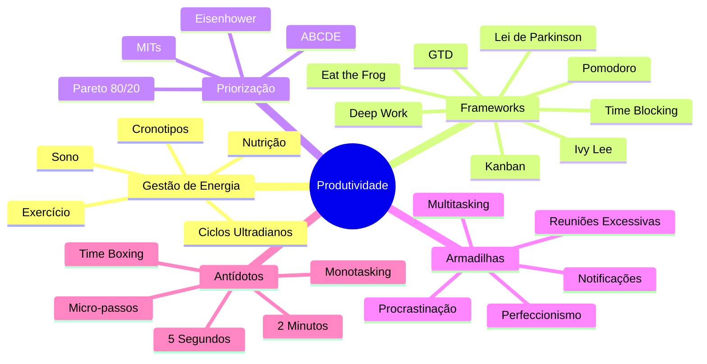
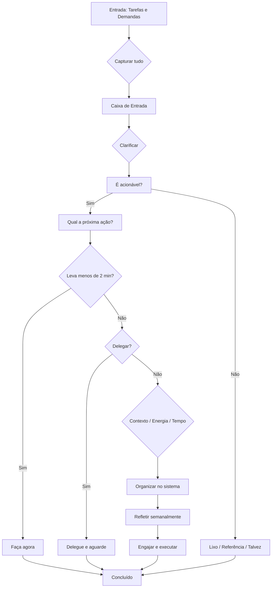
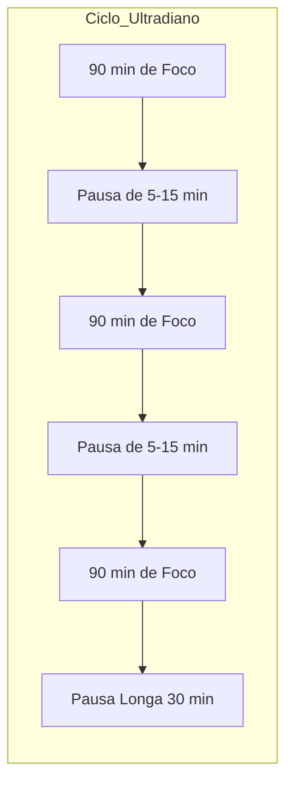
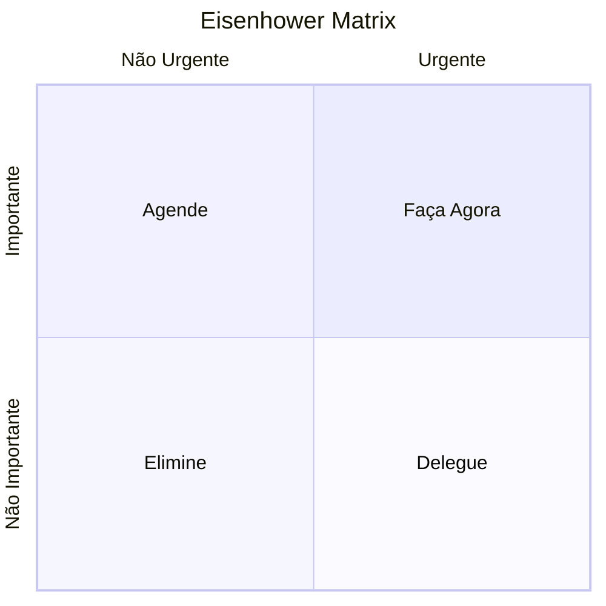

# Gestão de Tempo e Produtividade

## 1. Introdução

### A Ilusão de "Gerenciar o Tempo"

O tempo é uma constante inflexível. Todos os seres humanos — CEOs, atletas, artistas, pais, estudantes — recebem exatamente 1.440 minutos por dia. Ninguém consegue "economizar" tempo, "esticar" tempo ou "recuperar" tempo perdido. O tempo simplesmente passa, no mesmo ritmo para todos, independentemente de status, riqueza ou inteligência.

O que chamamos de "gestão de tempo" é, na verdade, **gestão de atenção** e **gestão de energia**. Você não administra o relógio; administra onde coloca sua mente e como mantém seu corpo em estado produtivo.

**Estar ocupado ≠ Ser produtivo.**

Estar ocupado significa preencher o tempo com atividade. Ser produtivo significa direcionar atividade para resultados que importam. Uma pessoa pode trabalhar 12 horas por dia e produzir menos que outra que trabalha 4 horas com foco absoluto. A diferença não está no tempo disponível — está no que se faz com ele.

### O Custo da Má Gestão

- Desperdício cognitivo: mudar de contexto constantemente esgota recursos mentais
- Fadiga de decisão: cada escolha consome uma fração da sua força de vontade
- Estresse crônico: sentir-se sempre atrasado ativa o sistema de ameaça do cérebro
- Queda na qualidade: pressa produz erro; erro produz retrabalho; retrabalho produz mais pressa — ciclo vicioso

### O Paradigma da Produtividade Sustentável

Produtividade não é sobre fazer mais em menos tempo. É sobre **fazer o que importa, com qualidade, sem destruir sua saúde mental**. Uma abordagem sustentável reconhece que:

- Você é humano, não uma máquina de otimização
- Descanso não é desperdício — é investimento
- Priorização é mais importante que execução
- Dizer "não" é tão produtivo quanto dizer "sim" para a coisa certa

---

## 2. Frameworks Clássicos de Produtividade

### 2.1 Pomodoro Technique (Francesco Cirillo, 1980s)

**Explicação:** O método Pomodoro divide o trabalho em blocos de 25 minutos de foco absoluto seguidos por 5 minutos de pausa. A cada 4 blocos (chamados "pomodoros"), faz-se uma pausa maior de 15–30 minutos. O nome vem do timer de cozinha em formato de tomate que Cirillo usava na faculdade.

**Como implementar:**
1. Escolha uma tarefa específica
2. Ajuste o timer para 25 minutos
3. Trabalhe sem interrupções até o timer tocar
4. Faça uma pausa curta (5 min)
5. A cada 4 ciclos, faça uma pausa longa (15–30 min)

**Prós:**
- Cria urgência artificial que combate procrastinação
- Baixa barreira de entrada (só precisa de um timer)
- Reduz fadiga mental ao forçar pausas
- Ajuda a estimar quanto tempo as tarefas realmente levam
- Funciona bem para tarefas que exigem foco sustentado (escrita, codificação, estudo)

**Contras:**
- Pode quebrar o fluxo de deep work (25 min é pouco para estados profundos de concentração)
- Não funciona bem para tarefas criativas que exigem imersão prolongada
- Interrupções externas podem desestruturar o ciclo
- Pessoas com ansiedade podem sentir pressão com o timer

**Quando usar:**
- Tarefas repetitivas ou de baixa complexidade
- Dias de baixa energia ou motivação
- Estudo para provas ou certificações
- Para vencer a inércia inicial de uma tarefa temida

### 2.2 Getting Things Done — GTD (David Allen, 2001)

**Explicação:** GTD é um sistema completo de produtividade baseado em cinco etapas: capturar, clarificar, organizar, refletir e engajar. A premissa central é que sua mente é para ter ideias, não para armazená-las. Ao externalizar tudo em um sistema confiável, você liberta a mente da ansiedade de "não esquecer".

**As cinco etapas:**

1. **Capturar:** Colete tudo o que chama sua atenção — ideias, tarefas, compromissos, preocupações. Use uma "caixa de entrada" física ou digital. Não julgue; apenas capture.

2. **Clarificar:** Processe cada item da caixa de entrada. Pergunte:
   - É acionável? (Sim/Não)
   - Se não: lixo, referência, ou "talvez um dia"
   - Se sim: qual a próxima ação física e visível?
   - A ação leva menos de 2 minutos? Faça agora.
   - Leva mais de 2 minutos? Delegue ou adie.

3. **Organizar:** Coloque cada item em sua categoria correta:
   - Próximas ações (listas por contexto: @casa, @escritório, @computador)
   - Projetos (qualquer resultado que exija mais de uma ação)
   - Aguardando (tarefas que dependem de outros)
   - Talvez um dia (ideias para futuro)
   - Calendário (compromissos com data/hora fixas)
   - Referência (material informativo)

4. **Refletir:** Revise o sistema regularmente:
   - Revisão diária: verifique calendário e próximas ações
   - Revisão semanal: processe a caixa de entrada, atualize projetos, avalie prioridades

5. **Engajar:** Execute com confiança, guiado pelo contexto, tempo disponível, energia disponível e prioridade.

**Prós:**
- Sistema completo e testado (30+ anos de uso)
- Elimina a ansiedade de esquecer compromissos
- Fornece clareza mental e reduz sobrecarga
- Altamente personalizável
- Base para muitos aplicativos modernos (Todoist, Things, TickTick)

**Contras:**
- Curva de aprendizado íngreme
- Exige manutenção semanal consistente
- Pode se tornar burocrático se levado ao extremo
- Requer disciplina para processar a caixa de entrada regularmente
- Pessoas muito criativas podem achar o sistema rígido demais

**Quando usar:**
- Profissionais com muitas responsabilidades concorrentes
- Pessoas que se sentem sobrecarregadas com tarefas
- Gestores e líderes de equipe
- Qualquer um que queira um sistema de produtividade "à prova de balas"

### 2.3 Time Blocking

**Explicação:** Time blocking é a prática de planejar cada hora do seu dia com antecedência, atribuindo tarefas específicas a blocos de tempo no calendário. Em vez de uma "lista de tarefas" que compete pelo seu tempo, você cria compromissos consigo mesmo no calendário. A ideia central: **se não está no calendário, não existe.**

**Variações:**
- **Task batching:** agrupar tarefas similares (ex: responder e-mails uma vez ao dia)
- **Day theming:** dedicar cada dia a um tema (ex: segundas de planejamento, terças de criação)
- **Time boxing:** definir um limite de tempo para uma tarefa e parar quando o tempo acabar

**Prós:**
- Torna o abstrato concreto (ver o plano visualmente)
- Protege seu tempo contra reuniões e interrupções
- Ajuda a estimar realisticamente o que cabe no dia
- Reduz fadiga de decisão (não precisa decidir o que fazer a cada momento)
- Permite alinhamento com seus ciclos de energia

**Contras:**
- Requer planejamento antecipado (5–10 min/dia)
- Imprevistos podem destruir o plano
- Pode gerar frustração se subestimar tarefas
- Pessoas muito espontâneas podem se sentir engessadas
- Exige disciplina para respeitar os blocos

**Quando usar:**
- Dias com muitas demandas concorrentes
- Profissionais com agenda cheia de reuniões
- Para garantir que prioridades recebam tempo real
- Em conjunto com deep work para proteger blocos de foco

### 2.4 Eat the Frog (Brian Tracy, 2001)

**Explicação:** A metáfora é simples: se a primeira coisa que você fizer pela manhã for comer um sapo vivo, o resto do dia será fácil. O "sapo" é a tarefa mais importante e/ou mais difícil do seu dia — aquela que você mais procrastina. Ao fazer primeiro, você aproveita sua energia e força de vontade máximas.

**Como implementar:**
1. Identifique sua tarefa mais importante do dia (a que gera maior impacto)
2. Faça-a primeiro, antes de qualquer outra coisa
3. Não verifique e-mail, redes sociais ou notícias antes de "comer o sapo"
4. Se for realmente muito grande, quebre em partes e coma a primeira parte

**Prós:**
- Elimina a procrastinação matinal
- Cria impulso positivo para o resto do dia
- Garante que o mais importante seja feito (não importa o que aconteça depois)
- Aproveita o pico de força de vontade matinal
- Simples e direto, sem sistema complexo

**Contras:**
- Pode ser desmotivador começar o dia com algo desagradável
- Nem todo mundo tem energia máxima pela manhã (chronotypes noturnos)
- Tarefas criativas complexas podem exigir aquecimento
- Ignora a variação natural de energia ao longo do dia

**Quando usar:**
- Dias em que você está procrastinando uma tarefa específica
- Quando você precisa de um "start" produtivo
- Combinado com time blocking (bloqueie a primeira hora do dia para o sapo)
- Para tarefas de alta importância mas baixo prazer

### 2.5 Ivy Lee Method (Ivy Lee, 1918)

**Explicação:** Em 1918, o consultor de produtividade Ivy Lee foi contratado por Charles M. Schwab, presidente da Bethlehem Steel Corporation, para melhorar a produtividade dos executivos. Lee ensinou um método de seis passos que, segundo Schwab, foi o mais valioso investimento que a empresa já fez.

**O método:**
1. Ao final de cada dia de trabalho, escreva as seis tarefas mais importantes do dia seguinte
2. Ordene-as por verdadeira importância (não urgência)
3. No dia seguinte, comece pela tarefa #1 e trabalhe nela até concluí-la
4. Vá para a tarefa #2, e assim por diante
5. Se alguma tarefa ficar incompleta, mova-a para o dia seguinte
6. Repita o processo todos os dias

**Prós:**
- Extremamente simples e de baixo custo mental
- Força priorização real (não há espaço para 20 tarefas)
- Cria um ciclo de feedback diário
- Reduz a paralisia de escolha pela manhã
- Funciona independentemente de tecnologia

**Contras:**
- Seis tarefas podem ser arbitrárias (talvez você só consiga fazer 2)
- Não lida bem com imprevistos ou emergências
- Pode gerar frustração se as tarefas forem consistentemente grandes demais
- Exige honestidade brutal sobre prioridades
- Não considera níveis de energia ou contexto

**Quando usar:**
- Dias com muitas prioridades conflitantes
- Como técnica de planejamento minimalista
- Pessoas que sofrem com paralisia por análise
- Em combinação com outros métodos (ex: time blocking para executar)

### 2.6 Kanban (Taiichi Ohno, Toyota, 1940s)

**Explicação:** Originalmente desenvolvido para a manufatura enxuta da Toyota, Kanban é um sistema visual de gerenciamento de fluxo. O princípio é simples: organize tarefas em colunas que representam estágios do trabalho (geralmente: A Fazer, Fazendo, Concluído) e limite o trabalho em andamento (WIP — Work In Progress).

**Elementos essenciais:**
- **Quadro visual:** físico (lousa com post-its) ou digital (Trello, Notion)
- **Colunas:** representam estados do fluxo de trabalho
- **Cartões:** representam tarefas individuais
- **WIP Limits:** número máximo de tarefas em cada coluna

**Prós:**
- Visual e intuitivo
- Revela gargalos no fluxo de trabalho
- WIP limits evitam sobrecarga e multitasking
- Flexível (pode adaptar as colunas a qualquer processo)
- Satisfação visual ao mover cartões para "Concluído"

**Contras:**
- Exige disciplina para atualizar o quadro
- Pessoas podem focar em "mover cartões" em vez de concluir projetos
- Não substitui planejamento estratégico profundo
- Times podem ignorar WIP limits se não forem rigorosos

**Quando usar:**
- Projetos com múltiplas etapas
- Equipes que precisam de transparência no fluxo de trabalho
- Gestão visual de tarefas pessoais
- Processos que exigem controle de gargalos

### 2.7 Deep Work (Cal Newport, 2016)

**Explicação:** Deep Work é a capacidade de se concentrar sem distrações em uma tarefa cognitivamente exigente. Newport argumenta que essa habilidade está se tornando rara e valiosa na economia moderna. O oposto é "shallow work" — tarefas logísticas de baixo valor que raramente geram novo valor (e-mails, relatórios superficiais, reuniões sem pauta).

**Os quatro filosofias de Deep Work:**
1. **Monástica:** eliminar todas as distrações e dedicar-se exclusivamente ao trabalho profundo
2. **Bimodal:** reservar blocos fixos de tempo (ex: 4 horas por dia) para deep work
3. **Rítmica:** criar uma rotina diária de deep work (ex: 90 min toda manhã)
4. **Jornalística:** encaixar deep work sempre que possível na agenda

**Prós:**
- Produz trabalho de alta qualidade em menos tempo
- Constrói habilidades valiosas mais rapidamente
- Aumenta a satisfação com o trabalho (flow)
- Diferencia profissionais medianos de excepcionais
- Combate a cultura de "superficialidade"

**Contras:**
- Difícil de implementar em ambientes com muitas interrupções
- Exige treino (a concentração profunda é um músculo)
- Pode ser socialmente isolador
- Nem toda carreira permite blocos prolongados de foco

**Quando usar:**
- Trabalho criativo ou analítico (escrita, pesquisa, programação)
- Desenvolvimento de habilidades complexas
- Empreendedores e profissionais que criam entregáveis
- Momentos de alta exigência cognitiva

### 2.8 Lei de Parkinson (C. Northcote Parkinson, 1955)

**Explicação:** "O trabalho expande para preencher o tempo disponível para sua conclusão." Se você tem uma semana para fazer uma tarefa de duas horas, ela magicamente se estenderá para ocupar a semana inteira. Isso não é preguiça — é uma tendência natural do cérebro: sem pressão, refinamos, adicionamos, polimos e adiamos.

**Como usar a lei a seu favor:**
- Defina prazos artificiais mais curtos
- Use time boxing (limite o tempo para a tarefa)
- Divida projetos grandes em sprints curtos
- Crie urgência com check-ins ou accountability externa

**Prós:**
- Aumenta a eficiência drasticamente
- Reduz desperdício de tempo em detalhes irrelevantes
- Cria foco e urgência saudável
- Combate o perfeccionismo

**Contras:**
- Prazos muito apertados podem gerar ansiedade
- Pode sacrificar qualidade se mal aplicado
- Algumas tarefas realmente precisam de tempo para maturação
- Requer autoconhecimento para calibrar prazos realistas

**Quando usar:**
- Tarefas que você sabe que está esticando mais que o necessário
- Projetos com tendência ao escopo infinito
- Em combinação com Pomodoro ou time boxing
- Para testar seus próprios limites de eficiência

---

## 3. Matrizes de Priorização

### 3.1 Matriz Eisenhower (Dwight D. Eisenhower)

**Explicação:** O 34º presidente dos EUA supostamente disse: "Tenho dois tipos de problemas: os urgentes e os importantes. Os urgentes não são importantes, e os importantes nunca são urgentes." A matriz classifica tarefas em quatro quadrantes:

```
                  Urgente                Não Urgente
Importante    | FAÇA AGORA           | AGENDE
              | (Crise, prazo final) | (Planejamento, crescimento)
Não Importante | DELEGUE              | ELIMINE
              | (Interrupções)       | (Distrações, trivia)
```

**Como usar:**
- Q1 (Fazer): crises, prazos iminentes, problemas urgentes
- Q2 (Agendar): planejamento, exercício, aprendizado, relacionamentos
- Q3 (Delegar): reuniões triviais, algumas ligações, e-mails rotineiros
- Q4 (Eliminar): navegação sem propósito, redes sociais, TV

**Insight central:** Pessoas altamente produtivas passam a maior parte do tempo no Q2 — onde se constrói o futuro. Q1 é reativo e estressante. Q3 e Q4 são armadilhas de "ocupação".

### 3.2 Método ABCDE (Brian Tracy)

**Explicação:** Uma evolução da Eisenhower Matrix. Cada tarefa recebe uma letra com base em sua importância:

- **A:** Deve ser feita — consequências graves se não for feita (prioridade máxima)
  - A-1: a mais importante entre as A
- **B:** Deveria ser feita — consequências moderadas se não for feita
  - Nunca faça B enquanto houver A pendentes
- **C:** Seria bom fazer — sem consequências negativas se não for feita
- **D:** Delegue — tarefas que outros podem fazer
- **E:** Elimine — irrelevantes (aplique Pareto 80/20)

**Como usar:** Ao revisar sua lista de tarefas, classifique cada uma de A a E. Comece sempre pelas A, faça A-1 primeiro, nunca toque em B antes de terminar A.

### 3.3 Princípio de Pareto (80/20)

**Explicação:** Vilfredo Pareto, economista italiano, observou que 80% das terras na Itália pertenciam a 20% da população. Esse padrão se repete em inúmeras áreas: 80% dos resultados vêm de 20% dos esforços.

**Aplicações na produtividade:**
- 80% do valor do seu trabalho vem de 20% das suas tarefas
- 80% das interrupções vêm de 20% das pessoas/situações
- 80% dos seus clientes vêm de 20% das suas atividades de marketing

**Como usar:**
- Identifique os 20% de tarefas que geram 80% dos resultados
- Faça essas tarefas primeiro e com mais tempo
- Elimine ou delegue os 80% restantes que geram pouco valor
- Reveja trimestralmente seus 20%

### 3.4 MITs — Most Important Tasks

**Explicação:** Desenvolvido por Leo Babauta (Zen Habits), MITs são as 1–3 tarefas mais importantes do seu dia. A regra: independentemente do que acontecer, essas três tarefas precisam ser concluídas antes do fim do dia. Tudo mais é bônus.

**Como implementar:**
- Toda noite ou toda manhã, escolha 1–3 MITs
- Pergunte: "Se eu só fizer essas três coisas hoje, terei um dia produtivo?"
- Trabalhe nelas primeiro (antes de e-mail, redes sociais, reuniões)
- Se concluir cedo, adicione MITs extras ou pare e celebre

**Prós:**
- Extremamente focado e realista
- Reduz a síndrome da "lista infinita"
- Força honestidade sobre prioridades reais

**Contras:**
- Difícil escolher apenas 3 quando tudo parece urgente
- Pode ignorar tarefas rotineiras importantes

---

## 4. Gestão de Energia — Não de Tempo

### 4.1 Ciclos Ultradianos (Períodos de 90 Minutos)

O corpo humano opera em ciclos de aproximadamente 90 minutos chamados **ritmos ultradianos**. Durante cada ciclo, alternamos entre mais alerta e mais sonolentos. A neurociência mostra que o cérebro só consegue manter foco intenso por 90–120 minutos antes de precisar de uma pausa.

**Implicações práticas:**
- Trabalhe em blocos de 90 minutos (não 8 horas contínuas)
- Respeite os sinais de fadiga mental: bocejos, inquietação, queda na concentração
- Programe pausas reais entre os ciclos
- Alinhe tarefas mais exigentes com seus picos naturais

### 4.2 Sono, Nutrição e Exercício

**Sono** é a base da produtividade. Uma noite mal dormida reduz:
- Função executiva (planejamento, decisão)
- Regulação emocional (paciência, resiliência)
- Memória e aprendizado
- Criatividade

**Nutrição:**
- O cérebro consome ~20% da energia do corpo
- Picos e quedas de glicose afetam diretamente o foco
- Comer leve no almoço evita o "coma alimentar" da tarde
- Hidratação: 2% de desidratação reduz desempenho cognitivo

**Exercício físico:**
- Aumento do BDNF (fator neurotrófico derivado do cérebro) — "fertilizante" para neurônios
- Melhora humor, energia e foco por horas após o treino
- Reduz estresse e ansiedade
- Apenas 20 min de caminhada já geram benefícios

### 4.3 A Ciência dos Intervalos

- **Micro-pausas (30s–2min):** a cada 20–30 min, olhe para longe, alongue-se. Reduz fadiga ocular e mental.
- **Pausas curtas (5–15min):** a cada 90 min. Caminhe, não use telas. O cérebro processa informações no fundo durante o movimento.
- **Pausas longas (30–60min):** almoço, caminhada mais longa. Desconecte completamente.
- **Férias e dias off:** essenciais para recuperação de longo prazo. Semanas de 50h+ reduzem produtividade marginal a zero.

**Técnicas de pausa:**
- Pomodoro (5 min a cada 25)
- 52/17 (52 min foco, 17 min pausa — estudado no escritório da Draugiem)
- Caminhada sem celular
- Respiração profunda (2 min)

### 4.4 Cronotipos e Sincronização Circadiana

**Seu cronotipo** é sua predisposição natural para horários de pico de energia:

- **Alondra (matutino ~15%):** pico 6–12h. Produtivo pela manhã, desliga cedo.
- **Coruja (noturno ~15%):** pico 18–24h. Produtivo à noite, difícil acordar cedo.
- **Colibri (~70%):** pico 10–12h e 15–17h. Flexível, padrão intermediário.

**Estratégia por cronotipo:**
- Alondra: deep work pela manhã, tarefas administrativas à tarde
- Coruja: tarefas rotineiras pela manhã, deep work à noite
- Colibri: deep work no final da manhã, tarefas leves após o almoço, execução no fim da tarde

---

## 5. Armadilhas Comuns da Produtividade

### 5.1 Multitasking — O Grande Mito

**O problema:** Tentar fazer duas ou mais coisas ao mesmo tempo. O cérebro humano não processa tarefas simultaneamente (exceto tarefas automáticas como andar e falar). O que chamamos de multitasking é, na verdade, **alternância rápida entre tarefas** — "task switching".

**O custo do switching:**
- Cada alternância custa ~23 minutos para recuperar o foco (estudo da UC Irvine)
- Reduz QI funcional em até 10 pontos (mais que fumar maconha)
- Aumenta taxa de erro em até 50%
- Esgota glicose e recursos cognitivos mais rápido

**Solução:** Monotasking. Faça uma coisa de cada vez. Use blocos de foco. Feche abas e apps não relacionados. Agrupe tarefas similares (batching).

### 5.2 Perfeccionismo

**O problema:** O perfeccionismo não é busca por excelência — é medo de falhar disfarçado de "altos padrões". Leva a:
- Paralisia (não começa por medo de não ser perfeito)
- Atrasos constantes (revisões infinitas)
- Esgotamento (nunca está satisfeito)

**Antídoto:**
- "Feito é melhor que perfeito" (Sheryl Sandberg)
- Princípio de Pareto: 80% pronto é suficiente para a primeira versão
- Estabeleça prazos rígidos
- Publique/entregue antes de sentir que está "pronto"
- Itere: faça uma versão ruim, depois melhore

### 5.3 Procrastinação

**Causas profundas:**
- **Medo:** de falhar, de não ser bom o suficiente, do julgamento
- **Tédio:** a tarefa é entediante, o cérebro busca dopamina fácil
- **Resistência:** Steven Pressfield (A Guerra da Arte) define resistência como a força que se opõe ao trabalho criativo
- **Sobrecarga:** a tarefa parece grande demais, o cérebro congela

**Não é preguiça.** Procrastinação é um problema de regulação emocional: evitamos o desconforto da tarefa buscando conforto imediato (redes sociais, comida, TV).

### 5.4 Reuniões Excessivas

**Dados alarmantes:**
- Profissionais passam ~23h/semana em reuniões
- 67% dizem que reuniões os impedem de fazer trabalho real
- 25% das reuniões tratam de assuntos que poderiam ser resolvidos por e-mail

**Práticas para reduzir:**
- Reunião sem pauta por escrito = cancelada
- Limite de 25 ou 45 min (não 30 ou 60)
- "Stand-up" meeting: todos em pé, máximo 15 min
- Walking meeting: reunião de 1:1 enquanto caminham
- Assíncrono primeiro: documento antes de convocar

### 5.5 Notificações e Interrupções

- Cada notificação (visual ou sonora) quebra o foco
- Após uma interrupção, leva-se ~23 min para retornar ao estado anterior de concentração
- O simples fato de ver uma notificação no canto da tela reduz desempenho (mesmo sem abri-la)

**Estratégias:**
- Modo "Não Perturbe" durante blocos de foco
- Notificações desativadas (todas)
- Check de e-mail/mensagens em horários fixos (2–3x/dia)
- Celular no modo avião ou em outro cômodo
- Uso de apps como Forest ou Freedom para bloquear distrações

---

## 6. Procrastinação — Análise e Técnicas

### 6.1 O Cérebro Procrastinador

**O conflito interno:**

- **Sistema límbico (cérebro reptiliano):** busca prazer imediato, evita desconforto. É a parte que quer dopamina fácil — TikTok, comida, qualquer coisa que não seja a tarefa difícil.
- **Córtex pré-frontal (cérebro executivo):** planeja, raciocina, pensa no longo prazo. É a parte que sabe que você deveria estar trabalhando.

**A dinâmica:** Quando uma tarefa parece ameaçadora (complexa, tediosa, arriscada), o sistema límbico ativa a resposta de "luta ou fuga". O córtex pré-frontal tenta argumentar, mas o sistema límbico é mais rápido e mais forte emocionalmente. Resultado: você "foge" para uma distração.

**A solução não é força de vontade** — é **tornar a tarefa menos ameaçadora** e o ambiente menos tentador.

### 6.2 Técnica dos 5 Segundos (Mel Robbins)

**O princípio:** Quando você tem um impulso para fazer algo, você tem 5 segundos para agir antes que seu cérebro o convença a não fazer. Conte regressivamente **5–4–3–2–1** e aja fisicamente antes de chegar a 1.

**Por que funciona:** A contagem regressiva interrompe o padrão de hesitação do cérebro. O movimento físico antes do 1 ativa o córtex pré-frontal e supera a inércia límbica.

**Como usar:** Acordou? 5–4–3–2–1 e levante. Precisa começar a tarefa? 5–4–3–2–1 e abra o documento. Vai ligar para alguém? 5–4–3–2–1 e disque.

### 6.3 Técnica dos 2 Minutos (David Allen / GTD)

**A regra:** Se uma tarefa leva menos de 2 minutos para ser concluída, faça-a imediatamente.

**Fundamento:** Adiar uma tarefa de 2 minutos gasta mais energia mental (lembrar, planejar, se preocupar) do que simplesmente fazê-la.

**Exemplos:**
- Responder um e-mail rápido
- Lavar a louça do café
- Arrumar a cama
- Enviar uma mensagem rápida

**Variação (James Clear):** "A regra dos 2 minutos para hábitos" — para começar um novo hábito, reduza-o a 2 minutos. "Ler" vira "ler uma página". "Exercitar" vira "calçar o tênis". Depois que começa, é mais fácil continuar.

### 6.4 Divisão de Tarefas Monstruosas em Micro-passos

O cérebro procrastina tarefas vagas e enormes porque ele **não vê um caminho claro**. "Escrever monografia" é assustador. "Abrir o documento e escrever o título" é factível.

**Técnica do micro-passo (ou "salami slicing"):**
1. Identifique a tarefa que você está evitando
2. Pergunte: "Qual é o menor passo possível que posso dar agora?"
3. Reduza até que seja ridiculamente fácil
4. Faça apenas esse passo

**Exemplo real:**
- Em vez de: Organizar escritório
- Micro-passos:
  1. Pegar um saco de lixo
  2. Jogar 10 coisas fora da mesa
  3. Guardar 5 objetos no lugar certo
  4. Limpar a superfície da mesa

**Insight:** Depois do primeiro micro-passo, a inércia é quebrada. O cérebro pensa "já que comecei, posso fazer mais um". O maior obstáculo sempre é **começar**.

---

## 7. Exercícios Práticos

### 7.1 Desenhe Seu Time Block Ideal

**Objetivo:** Criar um modelo de semana ideal que respeite seus cronotipos, prioridades e ciclos de energia.

**Instruções:**
1. Imprima uma grade semanal (seg a dom, 6h–23h)
2. Marque seus compromissos fixos (trabalho, reuniões, academia, refeições, família)
3. Identifique seus picos de energia (quando você está mais alerta?)
4. Bloqueie 3–4 blocos de deep work (90 min) nos horários de pico
5. Agrupe tarefas administrativas em 1–2 blocos (30 min cada)
6. Deixe espaços em branco para imprevistos (não ocupe 100%)
7. Inclua lazer, descanso e tempo com pessoas importantes

**Reflexão:** Após 1 semana de tentativa, ajuste. O perfeito não existe — existe o funcional.

### 7.2 Identifique Seus MITs Diários por 1 Semana

**Objetivo:** Treinar seu cérebro a distinguir entre urgente e importante.

**Instruções:**
1. Toda noite, escreva 3 MITs para o dia seguinte
2. Seja específico (não "trabalhar no projeto", mas "escrever introdução do relatório")
3. No dia seguinte, execute os MITs antes de qualquer outra tarefa
4. Ao final do dia, marque quantos concluiu
5. Após 7 dias, analise:
   - Você está escolhendo as tarefas certas?
   - Está superestimando ou subestimando sua capacidade?
   - Quais foram as principais distrações?

### 7.3 Monitore Onde Seu Tempo Realmente Vai

**Objetivo:** Descobrir a diferença entre onde você pensa que seu tempo vai e onde ele realmente vai.

**Instruções:**
1. Por 3–7 dias, registre cada atividade em intervalos de 15–30 minutos
2. Use um caderno, planilha ou app (Toggl, RescueTime, ATracker)
3. Categorias sugeridas: trabalho profundo, trabalho raso, reuniões, deslocamento, lazer, procrastinação, sono
4. Ao final, some o total de cada categoria
5. Pergunte:
   - Onde estou gastando mais tempo do que gostaria?
   - Onde estou gastando menos do que deveria?
   - Qual categoria não gera resultado nenhum?

**Resultado esperado:** Surpresa. A maioria das pessoas descobre que passa 2–3 horas por dia em atividades que não lembram e que o "trabalho real" ocupa bem menos tempo que imaginam.

### 7.4 Implemente uma Semana de Deep Work

**Objetivo:** Experimentar o poder do foco prolongado e sem distrações.

**Instruções:**
1. Escolha um período de 7 dias
2. Reserve 1 bloco de 90 min de deep work por dia (mesmo horário)
3. Durante o bloco:
   - Celular no modo avião, em outro cômodo
   - Todas as notificações desligadas
   - Abas do navegador fechadas (exceto as essenciais)
   - Fones de ouvido (se ajudar)
   - Uma única tarefa (sem alternância)
4. Se surgir um pensamento intrusivo, anote num bloco de papel e ignore
5. Após 90 min, pare. Registre o que produziu e como se sentiu
6. Ao final dos 7 dias, avalie:
   - Quanto você produziu nesses 10.5h de deep work?
   - O que mudou na sua percepção de foco?
   - Valeu o esforço?

### 7.5 Diagnóstico de Procrastinação

**Objetivo:** Identificar padrões de procrastinação e suas causas reais.

**Instruções:**
1. Liste 5 tarefas que você está procrastinando agora
2. Para cada uma, responda:
   - Há quanto tempo estou adiando?
   - Qual o verdadeiro motivo? (medo, tédio, sobrecarga, falta de clareza?)
   - Qual a consequência real de não fazer?
   - Qual o menor micro-passo que posso dar agora?
3. Para a tarefa mais adiada, aplique a técnica dos 5 segundos e comece o micro-passo
4. Agende um "bloco de enfrentamento" no calendário (30 min só para essa tarefa)

---

## 8. Ferramentas de Produtividade

### 8.1 Gerenciamento de Tarefas

| Ferramenta | Modelo | Ideal para | Preço |
|---|---|---|---|
| **Todoist** | Listas inteligentes, GTD | Indivíduos e equipes pequenas | Gratuito/Premium |
| **TickTick** | Pomodoro + Listas + Calendário | Quem quer tudo em um | Gratuito/Premium |
| **Notion** | Tudo-em-um (docs, DBs, Kanban) | Customização total | Gratuito/Pro |
| **Obsidian Tasks** | Tarefas no markdown | Usuários Obsidian | Gratuito (plugin) |
| **Logseq** | Tarefas + notas em grafo | Pensamento conectado | Gratuito |
| **Things 3** | Design impecável, GTD | Usuários Apple | Pago |
| **Microsoft To Do** | Simplicidade, integração Office | Usuários Microsoft | Gratuito |

### 8.2 Time Tracking

| Ferramenta | Funcionalidade | Ideal para |
|---|---|---|
| **Toggl** | Timer com um clique, relatórios | Freelancers, profissionais que cobram por hora |
| **RescueTime** | Monitoramento automático, relatórios | Quem quer descobrir hábitos digitais |
| **Clockify** | Alternativa gratuita ao Toggl | Equipes e indivíduos |
| **ATracker** | Registro manual simples | Minimalistas |
| **Timing** | Automático + manual (Mac) | Usuários Apple |

### 8.3 Ferramentas de Foco

| Ferramenta | Funcionalidade | Ideal para |
|---|---|---|
| **Forest** | Timer que planta árvores virtuais | Gamificação do foco |
| **Focusmate** | Sessões de co-working virtuais | Accountability e corpo a corpo virtual |
| **Freedom** | Bloqueio de apps e sites | Bloqueio completo de distrações |
| **Cold Turkey** | Bloqueio implacável (não desinstala) | Quem precisa de medidas extremas |
| **Opal** | Bloqueio de apps no celular | Foco mobile |
| **Endel** | Música adaptativa para foco | Trilha sonora personalizada |

---

## 9. Mermaid: Mapa Conceitual









---

## 10. Mapa Conceitual — Relações com Outras Áreas

### Psicologia

- **Teoria da Autodeterminação** (Deci & Ryan): produtividade sustentável exige autonomia, competência e pertencimento. Quando falta autonomia, procrastinamos.
- **Viés do Presente** (present bias): valorizamos recompensas imediatas mais que futuras. Explica por que escolhemos Netflix em vez de estudar.
- **Dissonância Cognitiva**: quando agimos contra nossos objetivos, sentimos desconforto; muitos "se anestesiam" com mais distração.
- **Flow** (Csikszentmihalyi): estado de imersão total onde desafio e habilidade se equilibram — o pico da produtividade.

### Neurociência

- **Córtex Pré-Frontal**: centro executivo (planejar, decidir, inibir impulsos). Energia limitada; esgota com uso contínuo.
- **Sistema Límbico**: reações emocionais automáticas. Responde a ameaças — e tarefas difíceis são interpretadas como ameaças.
- **Dopamina**: neurotransmissor da motivação. Tarefas grandes não geram dopamina; micro-passos sim.
- **Neuroplasticidade**: deep work fortalece conexões neurais do foco. O cérebro pode ser treinado para ser mais produtivo.

### Hábitos

- **Loop do Hábito** (Duhigg/Clear): deixa (gatilho) → rotina (ação) → recompensa. Produtividade depende de automatizar bons loops.
- **Lei de Newton comportamental**: um hábito em movimento tende a permanecer em movimento (inércia positiva). Começar é a parte mais difícil.
- **Empilhamento de hábitos** (habit stacking): "após [hábito atual], farei [novo hábito]". Ex: "após escovar os dentes, medito 2 min".
- **Construção de identidade**: "sou uma pessoa organizada" funciona melhor que "preciso me organizar".

### Carreira

- **Regra 80/20 nas habilidades**: 20% das habilidades geram 80% do valor profissional. Identifique e aprofunde essas.
- **Shallow work disfarçado de urgência**: responder e-mails parece trabalho, mas raramente gera progresso de carreira.
- **Visibilidade vs Resultado**: Produtividade real gera resultados entregáveis, não apenas presença.
- **Networking como investimento**: pessoas produtivas investem tempo em relacionamentos estratégicos (Q2 da Eisenhower).

### Estilo de Vida

- **Minimalismo digital**: menos ferramentas, menos notificações, menos abas. Mais foco.
- **Slow productivity** (Cal Newport 2024): fazer menos, em ritmo humano, com qualidade obsessiva.
- **Jornada de trabalho reduzida**: empresas com semana de 4 dias relatam mesma produtividade + maior bem-estar.
- **O ócio criativo**: momentos sem fazer nada são essenciais para insights e criatividade. Não preencha todo vazio com estímulo.

---

## 11. Referências e Leitura Recomendada

| Autor | Obra | Tema Central |
|---|---|---|
| David Allen | *Getting Things Done* (2001) | Sistema completo de produtividade pessoal |
| Cal Newport | *Deep Work* (2016) | Foco profundo na era das distrações |
| Cal Newport | *Slow Productivity* (2024) | Produtividade em ritmo humano |
| Stephen Covey | *Os 7 Hábitos das Pessoas Altamente Eficazes* (1989) | Princípios de efetividade pessoal e interpessoal |
| Francesco Cirillo | *The Pomodoro Technique* (2006) | Método de foco com timer |
| Brian Tracy | *Eat That Frog!* (2001) | Vencer a procrastinação |
| Timothy Ferriss | *Trabalhe 4 Horas por Semana* (2007) | Otimização e delegação radical |
| Daniel Pink | *When: The Scientific Secrets of Perfect Timing* (2018) | Cronobiologia e sincronização de tarefas |
| James Clear | *Hábitos Atômicos* (2018) | Pequenas mudanças, resultados extraordinários |
| Mel Robbins | *A Técnica dos 5 Segundos* (2017) | Vencer a procrastinação no impulso |
| Leo Babauta | *Zen Habits* (blog/livro) | Minimalismo e MITs |
| Nir Eyal | *Indistractable* (2019) | Como controlar a atenção |
| Chris Bailey | *Hyperfocus* (2018) | Gestão de atenção no trabalho |
| Oliver Burkeman | *Four Thousand Weeks* (2021) | Aceitação dos limites do tempo |
| Steven Pressfield | *A Guerra da Arte* (2002) | Resistência e criatividade |

### Artigos e Recursos Online

- Wait But Why — "Why Procrastinators Procrastinate" (Tim Urban)
- Farnam Street — artigos sobre produtividade e pensamento
- Raptitude — psicologia aplicada ao cotidiano
- Ness Labs — produtividade consciente (Anne-Laure Le Cunff)
- Andy Matuschak — "Executable Strategies for Productivity"

### Citações

> "A maior parte do que fazemos não é essencial. Se você eliminar isso, terá mais tempo e tranquilidade." — Sêneca

> "Não é que temos pouco tempo, mas que perdemos muito." — Sêneca

> "O problema não é a falta de tempo. O problema é a falta de direção." — Greg McKeown

> "O tempo é a matéria-prima da qual a vida é feita." — Benjamin Franklin

> "Feito é melhor que perfeito." — Sheryl Sandberg

> "Você não precisa de mais tempo. Você precisa de menos distrações." — Desconhecido

> "A arte de progredir é começar. A arte de começar é quebrar tarefas complexas em tarefas pequenas e gerenciáveis." — Brian Tracy

[[04-Conhecimentos/08-Vida-Pratica/INDEX|← Voltar ao índice de Vida Prática]]
