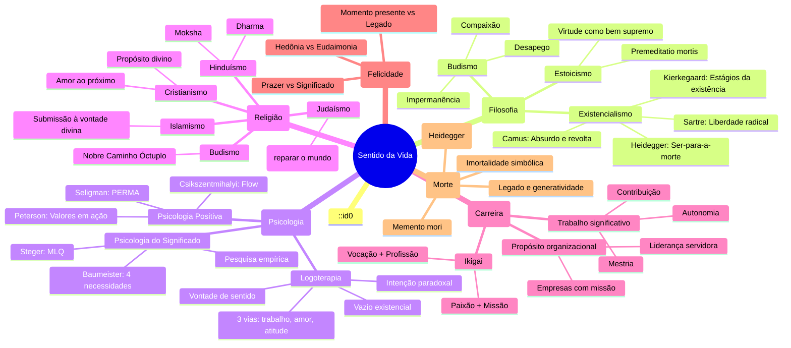

# Propósito e Sentido da Vida

---

## 1. Introdução — A Pergunta Fundamental

"Por que existimos?" — talvez esta seja a pergunta mais antiga e universal da humanidade. Todas as culturas, em todos os tempos, ofereceram respostas: deuses, destino, evolução, acaso, dever, amor, sofrimento. Mas a pergunta permanece.

### 1.1. Propósito vs Sentido

Embora frequentemente usados como sinônimos, **propósito** e **sentido** carregam diferenças sutis e importantes:

| Conceito | Definição | Pergunta associada |
|----------|-----------|-------------------|
| **Propósito** | Um objetivo, missão ou direção que se busca alcançar. É teleológico — aponta para um fim. | "Para que eu existo?" / "O que devo fazer?" |
| **Sentido** | A percepção de que a vida tem coerência, significado e valor intrínseco. Não depende de um objetivo futuro. | "O que torna minha vida significativa agora?" |

O propósito é orientado a metas futuras; o sentido é experienciado no presente. Uma pessoa pode ter um propósito (ex.: construir um negócio) mas sentir que a vida não tem sentido. Inversamente, alguém sem um propósito claro pode sentir profundo sentido na simples experiência de viver.

### 1.2. Por que essa pergunta é relevante hoje?

Vivemos na era da **abundância material** e da **carência de significado**. Estudos globais mostram:

- 1 em cada 4 pessoas relata não ter um sentido claro para a vida
- As taxas de depressão e ansiedade crescem em proporção inversa à satisfação de necessidades básicas
- O "vazio existencial" é reconhecido como um fenômeno epidemiológico do século XXI

> "O ser humano não inventa o sentido da vida, mas o descobre." — Viktor Frankl

### 1.3. Estrutura deste documento

Este documento explora o propósito e o sentido da vida sob múltiplas perspectivas:

1. **Logoterapia** — a abordagem clínica do sentido (Viktor Frankl)
2. **Existencialismo** — a liberdade radical de criar significado (Sartre, Camus, Kierkegaard, Heidegger)
3. **Ikigai** — a sabedoria japonesa do propósito
4. **Psicologia do Significado** — a ciência contemporânea do sentido
5. **Exercícios práticos** — ferramentas para aplicar os conceitos
6. **Mapa conceitual** — conexões entre as abordagens

---

## 2. Logoterapia — Viktor Frankl

A **logoterapia** (do grego _logos_ = sentido) é a escola psicoterapêutica fundada por Viktor Frankl, psiquiatra austríaco e sobrevivente de quatro campos de concentração nazistas. Sua experiência limite o levou a uma conclusão radical: mesmo no sofrimento extremo, a vida pode ter sentido.

### 2.1. A vida tem sentido em todas as circunstâncias

Frankl observou que, nos campos de concentração, os prisioneiros que encontravam um "porquê" para viver tinham mais chances de sobreviver. Aqueles que perdiam o sentido da vida entregavam-se à morte.

Esta não é uma afirmação otimista ingênua. É uma constatação clínica: o ser humano pode encontrar significado **mesmo** — e talvez **especialmente** — nas situações mais adversas.

> "Quem tem um porquê para viver pode suportar quase qualquer como." — Friedrich Nietzsche (citado por Frankl)

### 2.2. As 3 Vias para o Sentido

Frankl identificou três caminhos fundamentais pelos quais o ser humano pode encontrar sentido na vida:

#### 1. Sentido no Trabalho / Criação (realizar umaobra)

Fazer algo significativo:
- Criar uma obra de arte, um artigo, um livro
- Construir algo tangível
- Realizar um trabalho que contribui para algo maior
- Resolver um problema que importa

O sentido aqui está em **dar algo ao mundo**.

#### 2. Sentido na Experiência / Amor (vivenciar algo)

Encontrar significado através da recepção:
- Amar outra pessoa
- Contemplar a natureza ou a arte
- Vivenciar um momento de beleza, verdade ou bondade
- Sentir-se parte de algo maior

O sentido aqui está em **receber algo do mundo** — ou, mais precisamente, em conectar-se com ele.

#### 3. Sentido na Atitude diante do Sofrimento (enfrentar o destino)

Quando as duas primeiras vias são bloqueadas — quando não podemos mais criar nem experienciar — resta ainda a liberdade de **escolher nossa atitude** diante do sofrimento inevitável.

Frankl escreveu:

> "Tudo pode ser tirado de um homem, exceto uma coisa: a última das liberdades humanas — a escolha da própria atitude em qualquer conjunto de circunstâncias."

Esta terceira via é a mais profunda e a mais difícil. Ela não romantiza o sofrimento, mas reconhece que, quando ele é inevitável, podemos dar-lhe significado.

### 2.3. Vontade de Sentido vs Vontade de Prazer vs Vontade de Poder

Frankl propôs que a motivação primária do ser humano é a **vontade de sentido** (Wille zum Sinn), em contraste com:

| Escola | Motivação Primária | Representante |
|--------|-------------------|---------------|
| **Logoterapia** | Vontade de sentido | Viktor Frankl |
| **Psicanálise** | Vontade de prazer (princípio do prazer) | Sigmund Freud |
| **Psicologia Individual** | Vontade de poder / superação | Alfred Adler |

Frankl não negava o prazer ou o poder, mas argumentava que buscá-los **diretamente** não leva à realização. O prazer é um **efeito colateral** de uma vida com sentido. O poder é um **instrumento** para realizar algo, não um fim em si mesmo.

> "O dinheiro não é um fim em si mesmo, mas um meio para um fim. Quando se torna um fim, perde-se o sentido."

### 2.4. O Vazio Existencial

Frankl cunhou o termo **vazio existencial** para descrever a experiência de falta de sentido que caracteriza a sociedade moderna. Sintomas:

- Sensação de tédio profundo e difuso
- Falta de direção ou propósito
- Sentimento de que a vida é "sem graça" ou "vazia"
- Frustração existencial (pode levar à "neurose noogênica")
- Compensação através de busca excessiva de prazer, poder ou dinheiro

O vazio existencial é, para Frankl, uma **neurose do nosso tempo** — não causada por traumas ou conflitos inconscientes, mas pela **frustração da vontade de sentido**.

> "O tédio está causando mais problemas à psiquiatria do que a própria miséria."

### 2.5. Técnicas Logoterapêuticas

#### Intenção Paradoxal

O paciente é encorajado a **desejar** aquilo que mais teme — geralmente um sintoma neurótico. O humor e o autodistanciamento quebram o ciclo de ansiedade antecipatória.

> Exemplo: uma pessoa com medo de suar em público é instruída a "tentar suar o máximo possível".

#### Derreflexão

O paciente é orientado a **ignorar** um sintoma ou problema, redirecionando a atenção para algo significativo. A hiperintenção (esforço excessivo para alcançar algo) frequentemente bloqueia o próprio objetivo.

> Exemplo: um homem com disfunção erétil é instruído a não "tentar" ter uma ereção, mas a concentrar-se em dar prazer à parceira.

#### Diálogo Socrático

O terapeuta ajuda o paciente a descobrir seu próprio sentido através de perguntas, não de interpretações. A logoterapia é **maleuta** (parteira do sentido), não impositiva.

---

## 3. Existencialismo

O existencialismo é uma corrente filosófica que coloca a **liberdade**, a **escolha** e a **responsabilidade individual** no centro da experiência humana. Seus principais pensadores ofereceram visões distintas — e frequentemente complementares — sobre o sentido da vida.

### 3.1. Sartre — A Existência Precede a Essência

Jean-Paul Sartre inverteu a metafísica clássica. Diferente de um objeto (como um cortador de papel) que é projetado com uma finalidade antes de ser fabricado, o ser humano **primeiro existe** — e **depois** define sua essência.

> "O homem está condenado a ser livre. Condenado porque não se criou a si mesmo, e livre porque, uma vez lançado no mundo, é responsável por tudo o que faz."

#### Implicações para o Sentido

- **Não há sentido pré-determinado**: o universo não tem propósito intrínseco
- **Somos livres para criar sentido**: cada um deve inventar seus próprios valores
- **Má-fé**: a tendência a fingir que não somos livres, atribuindo nossas escolhas a fatores externos ("não tive escolha")
- **Responsabilidade radical**: ao escolher, escolhemos para toda a humanidade (nosso ato define o que é valioso)

Sartre oferece uma liberdade assustadora: não há desculpas. O sentido não está "lá fora" para ser descoberto; ele é **criado** por nossas escolhas e ações.

#### Crítica à Logoterapia

Sartre criticaria a noção de "descobrir" o sentido (Frankl) como uma forma de **essencialismo disfarçado**. Para Sartre, o sentido é **inventado**, não descoberto. O que une as duas visões, no entanto, é a ênfase na **ação**: o sentido não é contemplativo, mas se realiza através do engajamento no mundo.

### 3.2. Camus — O Mito de Sísifo: Felicidade no Absurdo

Albert Camus parte de uma constatação: o ser humano busca sentido, mas o universo é indiferente e silencioso. Desse confronto nasce o **absurdo**.

> "O absurdo nasce do confronto entre o apelo humano e o silêncio irracional do mundo."

#### As 3 Respostas ao Absurdo

| Resposta | Descrição | Avaliação de Camus |
|----------|-----------|-------------------|
| **Suicídio** | Eliminar a consciência absurda | Inaceitável — foge do problema |
| **Salto de fé** | Aceitar uma explicação religiosa / transcendente | Inautêntica — nega o absurdo |
| **Revolta** | Viver plenamente apesar do absurdo | A única resposta digna |

#### Sísifo Feliz

No mito grego, Sísifo é condenado a rolar uma pedra montanha acima, apenas para vê-la cair e recomeçar eternamente. Camus reinterpreta: Sísifo é **absurdo** — ele sabe que sua tarefa é inútil, mas continua.

> "É preciso imaginar Sísifo feliz."

A felicidade de Sísifo está na **revolta consciente**: ele não nega o absurdo, não se entrega ao desespero, mas encontra significado no próprio ato de continuar. A vida não precisa ter um "sentido último" para valer a pena ser vivida. O sentido está no **engajamento** com o momento presente.

#### Aplicação Contemporânea

Vivemos em Sísifo modernos: trabalhamos, consumimos, repetimos ciclos. A pergunta de Camus é: **você está consciente do absurdo?** E, estando consciente, **escolhe continuar com revolta, liberdade e paixão?**

### 3.3. Kierkegaard — Os 3 Estágios da Existência

Søren Kierkegaard, considerado o "pai do existencialismo", descreveu três estágios qualitativamente distintos pelos quais a existência pode se desenrolar:

#### 1. Estágio Estético

Viver no imediato, em busca de prazer, novidade e experiência. O esteta vive para o **instante**, evitando compromisso e tédio. Representado por Don Juan (sedução) e por Johannes (o sedutor de _Diário de um Sedutor_).

- **Limitação**: a busca por prazer leva à saturação e ao desespero
- **Crise**: o tédio profundo e a falta de compromisso revelam o vazio
- **Exemplo**: uma vida hedonista sem projetos duradouros

> "O tédio é a raiz de todo o mal." — Kierkegaard

#### 2. Estágio Ético

Viver segundo princípios, deveres e valores duradouros. O ético assume compromissos — casamento, trabalho, responsabilidade social. Representado pelo Juiz Wilhelm (em _Ou-Ou_).

- **Limitação**: a universalidade da ética pode sufocar a singularidade do indivíduo
- **Crise**: o conflito entre dever universal e vocação pessoal
- **Exemplo**: uma pessoa que segue regras morais mas sente que algo falta

#### 3. Estágio Religioso

Viver na fé, no "salto no absurdo" em direção ao transcendente. O indivíduo singular está acima do universal. Representado por Abraão (disposto a sacrificar Isaac).

- **Limitação**: incompreensível racionalmente — é um escândalo para a razão
- **Crise**: a "angústia" diante do infinito
- **Exemplo**: Abraão — o "cavaleiro da fé" que age por fé, não por razão

#### Progressão

Os estágios não são lineares nem excludentes. Uma pessoa pode transitar entre eles. A transição ocorre através do **salto** — um ato de escolha que não pode ser totalmente justificado pela razão.

### 3.4. Heidegger — Ser-para-a-Morte e Autenticidade

Martin Heidegger, em _Ser e Tempo_, propõe uma análise fundamental da existência humana (o **Dasein** — "ser-aí").

#### Ser-para-a-Morte (Sein-zum-Tode)

A morte não é um evento futuro. É uma **possibilidade iminente** que estrutura toda a nossa existência. Saber que vamos morrer não é um fato macabro, mas a condição para a **autenticidade**.

> "Só quando sabemos que vamos morrer é que podemos começar a viver de verdade."

#### Autenticidade vs Inautenticidade

| Existência Inautêntica | Existência Autêntica |
|------------------------|---------------------|
| O "a-gente" (das Man) — vive como os outros esperam | Assume a própria finitude |
| Distrai-se com ocupações cotidianas | Escolhe com consciência da morte |
| Foge da liberdade e da responsabilidade | Age com resolução antecipadora |
| "Todo mundo faz assim" | "Eu escolho assim" |

#### O Chamado da Consciência

Heidegger descreve a **angústia** como a experiência que nos arranca da inautenticidade. Na angústia, o mundo perde seu significado familiar e somos confrontados com nossa **liberdade radical** — e com nossa **solidão ontológica**.

> "A angústia revela o nada."

#### Aplicação Prática

A pergunta heideggeriana: **você está vivendo a sua vida ou a vida que os outros esperam de você?** O sentido não é um conceito abstrato, mas a forma como você **escolhe viver** diante da certeza da morte.

---

## 4. Ikigai — O Propósito Japonês

**Ikigai** (生き甲斐) — "iki" (viver) + "kai" (valor, efeito) — é um conceito japonês que pode ser traduzido como "razão de ser" ou "o que torna a vida digna de ser vivida". Diferente das abordagens filosóficas ocidentais, o ikigai é **prático** e **cotidiano**.

### 4.1. As 4 Perguntas do Ikigai

O diagrama clássico do ikigai sobrepõe quatro círculos:

```
                     ╔═══════════════╗
                     ║  O que você   ║
                     ║    AMA?       ║
                     ╠═══════════════╣
         ╔═══════════╣   Paixão      ╠═══════════════╗
         ║           ╚═══════════════╝               ║
         ║              ┌─────────────────┐           ║
         ║              │   PROPÓSITO     │           ║
         ║              │   (Ikigai)      │           ║
         ║   ┌──────────┤                 ├───────────║
╔════════╬═══╬══════════╣  Missão    Vocação╠══════════╬════════╗
║  O que  ║   ║          │                 │           ║   Pelo ║
║ o mundo ║   ║          └─────────────────┘           ║  que   ║
║ PRECISA?║   ║         ╔═══════════════════╗          ║  você  ║
║         ║   ╚═════════╣     Profissão     ╠══════════╝   PODE ║
║         ║             ╚═══════════════════╝           ║  SER   ║
║         ║    ╔═══════════════════════════════╗        ║ PAGO?  ║
╚═════════╬════╣        COMPETÊNCIA            ╠════════╝
          ║    ╚═══════════════════════════════╝
          ║  ╔═══════════════════════════════════╗
          ╚══╣  No que você é BOM?               ║
             ╚═══════════════════════════════════╝
```

As quatro perguntas fundamentais:

| Pergunta | Círculo | Interseção |
|----------|---------|------------|
| O que você **ama**? | Paixão | Missão (Paixão + Mundo) |
| O que o **mundo precisa**? | Missão | Vocação (Mundo + Competência) |
| Pelo que você **pode ser pago**? | Profissão | Profissão (Competência + Pagamento) |
| No que você é **bom**? | Competência | Paixão + Pagamento = ? |

### 4.2. Aplicação Prática do Diagrama

Para encontrar seu ikigai, siga este processo:

#### Passo 1: Mapeie cada círculo separadamente

**O que você ama?**
- Atividades que fazem você perder a noção do tempo
- Coisas pelas quais você é naturalmente curioso
- Lembranças de infância sobre o que você gostava de fazer

**O que o mundo precisa?**
- Problemas ao seu redor que você gostaria de resolver
- Necessidades de pessoas próximas ou da sua comunidade
- Questões globais que tocam seu coração

**Pelo que você pode ser pago?**
- Habilidades que têm demanda no mercado
- Conhecimentos que resolvem problemas econômicos
- Serviços pelos quais as pessoas estão dispostas a pagar

**No que você é bom?**
- Habilidades que você já desenvolveu
- Talentos naturais reconhecidos por outros
- Áreas em que você tem expertise ou está disposto a estudar

#### Passo 2: Encontre as interseções

| Interseção | Significado | Risco |
|------------|-------------|-------|
| Paixão + Mundo = **Missão** | Você ama e o mundo precisa | Pode não ser sustentável sem pagamento |
| Mundo + Competência = **Vocação** | O mundo precisa e você é bom | Pode ser bem-sucedido mas sem paixão |
| Competência + Pagamento = **Profissão** | Você é bom e pode ser pago | Pode ser lucrativo mas sem alma |
| Paixão + Pagamento = **?** | Você ama e pode ser pago | Pode não atender ao mundo |

#### Passo 3: O centro — Ikigai

O ikigai verdadeiro está na interseção de **todos os quatro círculos**. É onde você encontra:

- Realização pessoal
- Contribuição social
- Sustentabilidade financeira
- Competência reconhecida

> "O ikigai não é algo que se encontra de uma vez. É algo que se cultiva ao longo da vida."

### 4.3. Ikigai na Cultura Japonesa

Diferente do Ocidente, onde o propósito é frequentemente visto como uma grande descoberta, no Japão o ikigai pode ser **modesto** e **cotidiano**:

- Cuidar de um jardim
- Preparar uma refeição com cuidado
- Praticar um hobby regularmente
- Contribuir para a comunidade local

Esta visão ressoa com Frankl: o sentido pode estar nas pequenas coisas — não precisa ser grandioso.

### 4.4. Limitações do Modelo

- Pode ser excessivamente **individualista** (ignora estruturas sociais)
- Pressupõe **escolha** que nem todos têm (privilégio econômico)
- Pode gerar **ansiedade** se não encontrado rapidamente
- É uma **ferramenta de reflexão**, não uma fórmula mágica

---

## 5. Psicologia do Significado

Nas últimas décadas, a psicologia empírica passou a estudar o sentido da vida como um construto mensurável. Diferente da filosofia (especulativa) e da logoterapia (clínica), a psicologia do significado busca **dados quantitativos** sobre o que torna a vida significativa.

### 5.1. Baumeister — As 4 Necessidades de Significado

Roy Baumeister, um dos psicólogos sociais mais prolíficos do mundo, propôs que o ser humano tem quatro necessidades psicológicas fundamentais relacionadas ao significado:

#### 1. Necessidade de Propósito (Purpose)

A necessidade de ver a vida como orientada a objetivos futuros. Eventos presentes são significativos porque contribuem para resultados futuros.

- **Exemplo**: estudar hoje para se tornar médico amanhã
- **Ausência**: sensação de "deriva" — a vida parece sem direção

#### 2. Necessidade de Valor/Legitimação (Value/Justification)

A necessidade de sentir que a vida é boa e que as ações são moralmente justificáveis.

- **Exemplo**: sentir que se é uma "boa pessoa"
- **Ausência**: culpa, vergonha, sensação de imoralidade

#### 3. Necessidade de Eficácia (Efficacy)

A necessidade de sentir que se tem controle sobre a própria vida e que as ações produzem resultados.

- **Exemplo**: completar um projeto com sucesso
- **Ausência**: desamparo aprendido, impotência

#### 4. Necessidade de Autoestima (Self-Worth)

A necessidade de sentir que se é digno de respeito e amor.

- **Exemplo**: ser reconhecido por contribuições
- **Ausência**: baixa autoestima, vergonha

#### Modelo Integrado

Para Baumeister, uma vida significativa satisfaz **todas as quatro necessidades** em algum grau. A falta de qualquer uma delas produz uma experiência de "falta de sentido".

### 5.2. Steger — Meaning in Life Questionnaire (MLQ)

Michael Steger desenvolveu o **MLQ**, um dos instrumentos mais utilizados para medir o sentido da vida. O questionário tem 10 itens divididos em duas subescalas:

#### Subescala 1: Presença de Sentido (MLQ-P)

Avalia o quanto a pessoa sente que sua vida tem significado:

- "Eu compreendo o sentido da minha vida."
- "Minha vida tem um propósito claro."
- "Eu tenho uma boa compreensão do que torna minha vida significativa."

#### Subescala 2: Busca de Sentido (MLQ-S)

Avalia o quanto a pessoa está ativamente procurando significado:

- "Estou sempre procurando algo que torne minha vida significativa."
- "Estou buscando um propósito ou missão para minha vida."
- "Estou ativamente procurando um sentido para minha vida."

#### Principais Descobertas com o MLQ

- Pessoas com alta **presença** de sentido têm maior bem-estar, menos depressão, mais resiliência
- A **busca** de sentido não é negativa em si — mas está associada a sofrimento quando a presença é baixa
- A relação entre busca e presença muda com a idade: jovens buscam mais, idosos têm mais presença
- Sentido da vida está correlacionado com saúde física, longevidade e função imunológica

### 5.3. Pesquisas Contemporâneas

#### Sentido e Felicidade: Não São a Mesma Coisa

| Aspecto | Felicidade (Hedônia) | Sentido (Eudaimonia) |
|---------|---------------------|---------------------|
| Foco | Prazer, conforto | Significado, contribuição |
| Temporalidade | Agora | Passado + Presente + Futuro |
| Relação com estresse | Inversa | Pode ser positiva |
| Exemplo | Comer algo gostoso | Criar um filho (estressante mas significativo) |

#### Fatores que Aumentam o Sentido da Vida

1. **Relacionamentos**: vínculos profundos são o maior preditor de sentido
2. **Religião/Espiritualidade**: oferece narrativa de significado e comunidade
3. **Trabalho significativo**: senso de contribuição além do salário
4. **Generatividade** (Erikson): contribuir para as próximas gerações
5. **Gratidão**: prática regular de reconhecer o valor da vida
6. **Narrativa pessoal**: a capacidade de contar sua história como coerente e com progressão
7. **Altruísmo**: ajudar outros aumenta o sentido mais do que receber ajuda

#### Neurociência do Sentido

Estudos de neuroimagem mostram que reflexões sobre o sentido da vida ativam:

- **Córtex pré-frontal medial**: processamento autorreferencial
- **Cíngulo anterior**: detecção de conflito e relevância emocional
- **Ínsula anterior**: consciência interoceptiva e emoção

O sentido da vida não é apenas um conceito abstrato — tem **correlatos neurais** mensuráveis.

---

## 6. Exercícios Práticos

A teoria é necessária, mas insuficiente. O sentido da vida não se encontra apenas lendo sobre ele — é preciso **praticar**. Abaixo, exercícios baseados em diferentes tradições e abordagens.

### 6.1. Escreva Seu Obituário (Exercício Estoico)

Os estoicos praticavam a _premeditatio mortis_ (meditação da morte) para lembrar-se da finitude e viver com mais intensidade.

#### Instruções

Escreva seu próprio obituário como se você tivesse vivido uma vida longa e plena — **mas você decide como ela foi**.

**Perguntas-guia:**

- Pelo que você gostaria de ser lembrado?
- Que impacto você teve na vida de outras pessoas?
- Que valores sua vida representou?
- O que você realizou que realmente importa?
- Como você tratou as pessoas ao seu redor?
- Que legado você deixou?

#### Exemplo de Estrutura

```
[AQUI SEU NOME]
(ANO - ANO)

[NOME] faleceu cercado por [pessoas queridas], deixando [familiares/amigos].

[NOME] será lembrado por [principais qualidades].

Em sua vida, [NOME] dedicou-se a [causa/trabalho/paixão].

Seu maior orgulho foi [conquista mais significativa].

... [continue com a história que você quer viver] ...

Em vez de flores, a família pede que [contribuição/legado].
```

> "Ao escrever seu obituário, você não está planejando sua morte. Está projetando sua vida." — Desconhecido

### 6.2. Diagrama Ikigai Preenchido

#### Instruções

Copie o diagrama abaixo (mentalmente ou em uma folha) e preencha cada seção com honestidade.

```
╔══════════════════════════════════════════════════╗
║              DIAGRAMA IKIGAI                     ║
╠══════════════════════════════════════════════════╣
║                                                   ║
║  O QUE VOCÊ AMA:                                  ║
║  ─────────────────                                ║
║  •                                               ║
║  •                                               ║
║  •                                               ║
║                                                   ║
║  O QUE O MUNDO PRECISA:                           ║
║  ─────────────────────                            ║
║  •                                               ║
║  •                                               ║
║  •                                               ║
║                                                   ║
║  PELO QUE VOCÊ PODE SER PAGO:                     ║
║  ───────────────────────────                       ║
║  •                                               ║
║  •                                               ║
║  •                                               ║
║                                                   ║
║  NO QUE VOCÊ É BOM:                               ║
║  ──────────────────                                ║
║  •                                               ║
║  •                                               ║
║  •                                               ║
║                                                   ║
╠══════════════════════════════════════════════════╣
║  INTERSEÇÕES:                                     ║
║  Missão (Ama + Mundo):                           ║
║  Vocação (Mundo + Bom):                          ║
║  Profissão (Bom + Pago):                         ║
║  Paixão útil (Ama + Pago):                       ║
║  IKIGAI (todos os 4):                            ║
╚══════════════════════════════════════════════════╝
```

### 6.3. Carta do Futuro Eu

#### Instruções

Escreva uma carta do seu "eu futuro" — daqui a **5 anos** — para o seu "eu presente". A carta deve ser escrita **como se** você já tivesse realizado as mudanças desejadas.

#### Estrutura Sugerida

```
Querido(a) [seu nome atual],

Estou escrevendo do futuro, de [data futura]. Quero te contar como cheguei até aqui.

Coisas que mudaram:
- ___________________________________________
- ___________________________________________
- ___________________________________________

Coisas que aprendi:
- ___________________________________________
- ___________________________________________
- ___________________________________________

Desafios que superei:
- ___________________________________________
- ___________________________________________
- ___________________________________________

O que valeu mais a pena:
- ___________________________________________
- ___________________________________________
- ___________________________________________

Um conselho para você hoje:
_____________________________________________

Com gratidão,
[Seu nome em 5 anos]
```

#### Por que funciona?

- A carta cria **dissonância cognitiva** entre onde você está e onde quer estar
- Ativa o **viés de confirmação** a seu favor (você começa a notar oportunidades alinhadas ao seu futuro desejado)
- Transforma valores abstratos em **compromissos concretos**

### 6.4. Logoterapia — Questionário de Sentido

Baseado nos princípios da logoterapia, este questionário ajuda a identificar áreas de sentido (ou falta dele) na sua vida.

#### Parte 1: As 3 Vias

Para cada via, responda de 0 (nem um pouco) a 10 (completamente):

**Via 1 — Trabalho/Criação**
- Em que medida seu trabalho (ou atividades criativas) lhe dá senso de contribuição? (0-10): ___
- Você sente que está construindo algo que importa? (0-10): ___
- Que obra você gostaria de deixar para o mundo? (resposta livre):

**Via 2 — Experiência/Amor**
- Em que medida você experimenta amor e conexão genuínos? (0-10): ___
- Você tem momentos de beleza, admiração ou gratidão regularmente? (0-10): ___
- O que faz você se sentir vivo(a)? (resposta livre):

**Via 3 — Atitude diante do Sofrimento**
- Como você lida com situações que não pode mudar? (0-10): ___
- Você consegue encontrar algum sentido na dor que já viveu? (0-10): ___
- Que aprendizado ou crescimento veio dos seus momentos mais difíceis? (resposta livre):

#### Parte 2: Sinais de Vazio Existencial

Marque os sinais que você identifica em sua vida atualmente:

[ ] Tédio frequente e difuso
[ ] Sensação de que os dias são todos iguais
[ ] Falta de entusiasmo por projetos futuros
[ ] Busca excessiva por prazer/distração para evitar o silêncio
[ ] Sensação de que "falta algo" sem saber o que
[ ] Dificuldade em responder "por que você acorda de manhã?"

Quanto mais sinais marcados, maior a probabilidade de frustração existencial.

#### Parte 3: Descoberta de Sentido

Reflita:

1. Se você pudesse mudar uma coisa na sua vida amanhã, o que seria?
2. O que você faria se não tivesse medo de falhar?
3. Que problema no mundo você gostaria de ajudar a resolver?
4. Quando foi a última vez que você sentiu que estava exatamente onde deveria estar?
5. O que você gostaria que estivesse escrito em seu epitáfio?

### 6.5. Identificação de Valores Pessoais

Os valores são a base do sentido. Este exercício ajuda a identificar seus valores centrais.

#### Passo 1: Selecione seus valores

Desta lista, escolha **10** que mais ressoam com você (sem pensar muito):

```
A aventura    - Autenticidade  - Autonomia
Beleza        - Bondade        - Caridade
Colaboração   - Compaixão      - Comunidade
Conhecimento  - Coragem        - Criatividade
Determinação  - Disciplina     - Diversidade
Eficiência    - Equilíbrio     - Espiritualidade
Estabilidade  - Excelência     - Família
Fé            - Felicidade     - Flexibilidade
Gratidão      - Honestidade    - Honra
Humildade     - Igualdade      - Inovação
Integridade   - Inteligência   - Justiça
Liderança     - Liberdade      - Lealdade
Mestria       - Natureza       - Ordem
Paixão        - Paz            - Perdão
Persistência  - Prazer         - Propósito
Responsabilidade - Respeito    - Sabedoria
Saúde         - Segurança      - Serviço
Simplicidade  - Sinceridade    - Sucesso
Tolerância    - Tradição       - Verdade
```

#### Passo 2: Reduza para 5

Dos 10 selecionados, reduza para **5 valores essenciais** — aqueles que você não abriria mão:

1. ____________
2. ____________
3. ____________
4. ____________
5. ____________

#### Passo 3: Defina cada valor

Para cada valor, escreva o que ele **significa para você** e como ele se **manifesta** (ou deveria se manifestar) na sua vida:

**Valor 1:** ____________
- O que significa: _________________________________
- Como se manifesta hoje: ___________________________
- Como quero que se manifeste: _______________________

_(Repita para os 5 valores)_

#### Passo 4: Alinhamento

Avalie de 0 a 10: **quanto sua vida atual está alinhada com seus 5 valores?**

Soma: ___ / 50

Quanto maior a pontuação, maior a coerência entre seus valores e sua vida — e, portanto, maior o senso de sentido e integridade.

### 6.6. Exercício Adicional: A Linha da Vida

Desenhe uma linha do tempo da sua vida (real ou imaginária) marcando:

- **Altos**: momentos de maior sentido e realização
- **Baixos**: momentos de crise ou perda de sentido
- **Pontos de virada**: eventos que mudaram sua perspectiva
- **Padrões**: temas recorrentes

Pergunte-se: **que história minha vida está contando?**

---

## 7. Mapa Conceitual — Cross-Mapping

O mapa abaixo mostra as conexões entre as diferentes abordagens ao sentido da vida.



Cada cluster representa um domínio que oferece respostas — parciais, complementares — à pergunta pelo sentido. Nenhum isoladamente é suficiente; juntos, formam um mapa mais completo.

### 7.1. Conexões Principais

| Conexão | Descrição | Autores/Conceitos |
|---------|-----------|-------------------|
| **Logoterapia ↔ Existencialismo** | Ambas enfatizam liberdade e responsabilidade na criação/descoberta do sentido | Frankl, Sartre |
| **Ikigai ↔ Psicologia Positiva** | Abordagem prática e concreta do propósito diário | Ikigai, Seligman |
| **Religião ↔ Logoterapia** | Sentido transcendente vs sentido imanente | Frankl, teologias |
| **Morte ↔ Autenticidade** | Consciência da finitude como condição para viver plenamente | Heidegger, Estoicismo |
| **Felicidade ↔ Significado** | Distinção entre prazer e realização | Baumeister, Steger |
| **Carreira ↔ Ikigai** | Propósito profissional como componente do sentido | Diagrama ikigai |

---

## 8. Referências

### Viktor Frankl (Logoterapia)

- FRANKL, Viktor E. **Em Busca de Sentido: Um Psicólogo no Campo de Concentração**. Petrópolis: Vozes, 2008. (Original: 1946)
- FRANKL, Viktor E. **A Vontade de Sentido: Fundamentos e Aplicações da Logoterapia**. São Paulo: Paulus, 2011.
- FRANKL, Viktor E. **Psicoterapia e Sentido da Vida**. São Paulo: Quadrante, 1989.
- FRANKL, Viktor E. **O Sofrimento Humano: Fundamentos Antropológicos da Psicoterapia**. São Paulo: É realizações, 2013.
- FRANKL, Viktor E. **Logoterapia e Análise Existencial**. São Paulo: É realizações, 2015.

### Existencialismo

- SARTRE, Jean-Paul. **O Existencialismo é um Humanismo**. Petrópolis: Vozes, 2010. (Original: 1946)
- SARTRE, Jean-Paul. **O Ser e o Nada: Ensaio de Ontologia Fenomenológica**. Petrópolis: Vozes, 1997. (Original: 1943)
- CAMUS, Albert. **O Mito de Sísifo: Ensaio sobre o Absurdo**. Rio de Janeiro: Record, 2018. (Original: 1942)
- CAMUS, Albert. **A Peste**. Rio de Janeiro: Record, 2017. (Original: 1947)
- KIERKEGAARD, Søren. **Ou-Ou: Um Fragmento de Vida**. São Paulo: Martins Fontes, 2013. (Original: 1843)
- KIERKEGAARD, Søren. **O Desespero Humano**. São Paulo: Editora UNESP, 2010. (Original: 1849)
- KIERKEGAARD, Søren. **Temor e Tremor**. São Paulo: Editora UNESP, 2010. (Original: 1843)
- HEIDEGGER, Martin. **Ser e Tempo**. Petrópolis: Vozes, 2012. (Original: 1927)
- HEIDEGGER, Martin. **Introdução à Filosofia**. São Paulo: Martins Fontes, 2008.
- HEIDEGGER, Martin. **Os Conceitos Fundamentais da Metafísica: Mundo, Finitude, Solidão**. Rio de Janeiro: Forense Universitária, 2012.

### Ikigai

- GARCIA, Héctor; MIRALLES, Francesc. **Ikigai: Os Segredos dos Japoneses para uma Vida Longa e Feliz**. Rio de Janeiro: Intrínseca, 2017.
- MITSUHASHI, Yukari. **Ikigai: A Arte Japonesa de Encontrar um Propósito**. São Paulo: Gente, 2019.
- KEMI, Mieko. **O Poder do Ikigai: Descubra Seu Propósito e Viva com Significado**. São Paulo: Astral Cultural, 2020.
- AKIHIRO, Ito. **Ikigai: O Segredo Japonês para Uma Vida Plena**. São Paulo: Jambô, 2019.
- MATTHEWS, Patrick. **Ikigai: O Guia Definitivo para Encontrar seu Propósito de Vida**. Brasília: Editora Prosperar, 2021.

### Psicologia do Significado

- BAUMEISTER, Roy F. **Meanings of Life**. Nova York: The Guilford Press, 1991.
- BAUMEISTER, Roy F.; VOHS, Kathleen D. **The Pursuit of Meaningfulness in Life**. In: SNYDER, C. R.; LOPEZ, S. J. (Eds.). Handbook of Positive Psychology. Oxford: Oxford University Press, 2002.
- STEGER, Michael F. **Meaning in Life**. In: LOPEZ, S. J. (Ed.). Oxford Handbook of Positive Psychology. Oxford: Oxford University Press, 2009.
- STEGER, Michael F. **The Meaning in Life Questionnaire: Assessing the Presence of and Search for Meaning in Life**. Journal of Counseling Psychology, v. 53, n. 1, p. 80-93, 2006.
- STEGER, Michael F. **Meaning and Happiness: What's the Difference?** In: The Science of Meaning in Life. Annual Review of Clinical Psychology, 2021.
- HEINTZELMAN, Samantha J.; KING, Laura A. **Life is Pretty Meaningful**. American Psychologist, v. 69, n. 6, p. 561-574, 2014.
- HICKS, Joshua A.; ROUTLEDGE, Clay (Eds.). **The Experience of Meaning in Life: Classical Perspectives, Emerging Themes, and Controversies**. Nova York: Springer, 2013.
- MARTELA, Frank. **Meaning in Life is a Protective Factor for Health and Well-Being**. Journal of Positive Psychology, 2018.
- WONG, Paul T. P. **The Human Quest for Meaning: Theories, Research, and Applications**. 2. ed. Nova York: Routledge, 2012.

### Autores Complementares

- SELIGMAN, Martin E. P. **Felicidade Autêntica: Usando a Psicologia Positiva para a Realização Permanente**. Rio de Janeiro: Objetiva, 2004.
- SELIGMAN, Martin E. P. **Florescer: Uma Nova Compreensão da Felicidade e do Bem-Estar**. Rio de Janeiro: Objetiva, 2011.
- CSIKSZENTMIHALYI, Mihaly. **Flow: A Psicologia da Experiência Ótima**. Rio de Janeiro: Qualitymark, 1999.
- CSIKSZENTMIHALYI, Mihaly. **A Descoberta do Flow: A Psicologia do Envolvimento com a Vida Cotidiana**. Rio de Janeiro: Qualitymark, 2014.
- YALOM, Irvin D. **Psicoterapia Existencial**. Porto Alegre: Artmed, 2006.
- YALOM, Irvin D. **Paraíso e Inferno**. Rio de Janeiro: Ediouro, 2004.
- YALOM, Irvin D. **O Carrasco do Amor: Histórias de Psicoterapia**. Rio de Janeiro: Ediouro, 2005.
- PETERSON, Christopher; SELIGMAN, Martin E. P. **Character Strengths and Virtues: A Handbook and Classification**. Oxford: Oxford University Press, 2004.
- TOLSTÓI, Liev. **A Confissão**. São Paulo: Editora 34, 2016. (Original: 1882)
- SÉNECA, Lúcio Aneu. **Sobre a Brevidade da Vida**. Porto Alegre: L&PM, 2015.
- EPICTETO. **O Encheirídion: Manual de Vida**. São Paulo: EDIPRO, 2018.
- MARCO AURÉLIO. **Meditações**. São Paulo: Martins Fontes, 2015.

### Artigos Científicos Recomendados

- STEGER, M. F.; FRAZIER, P.; OISHI, S.; KALER, M. **The Meaning in Life Questionnaire: Assessing the Presence of and Search for Meaning in Life**. Journal of Counseling Psychology, 53(1), 80-93, 2006.
- BAUMEISTER, R. F.; VOHS, K. D.; AAKER, J. L.; GARBINSKY, E. N. **Some Key Differences between a Happy Life and a Meaningful Life**. Journal of Positive Psychology, 8(6), 505-516, 2013.
- FRANKL, V. E. **The Spiritual Dimension in Logotherapy**. Journal of Individual Psychology, 14(2), 131-143, 1958.
- HICKS, J. A.; KING, L. A. **Meaning in Life as a Personal Judgment**. Journal of Personality and Social Psychology, 96(2), 507-521, 2009.
- MARTELA, F.; STEGER, M. F. **The Three Meanings of Meaning in Life: Distinguishing Coherence, Purpose, and Significance**. Journal of Positive Psychology, 11(5), 531-545, 2016.

---

## 9. Notas Finais

### 9.1. O Sentido Não é Fixo

O sentido da vida não é uma descoberta única e permanente. Ele muda com o tempo, com as circunstâncias e com o amadurecimento. O que fazia sentido aos 20 anos pode não fazer aos 40 — e isso não é uma falha, mas um sinal de crescimento.

### 9.2. A Busca é Parte do Sentido

Paradoxalmente, a própria **busca** pelo sentido já é, em si, uma forma de sentido. Pessoas que se preocupam com o significado da vida já estão, por definição, engajadas em algo que transcende o meramente biológico.

### 9.3. O Sentido se Encontra na Ação

Todas as tradições aqui apresentadas convergem em um ponto: o sentido não é encontrado na contemplação passiva, mas na **ação engajada**. Não se descobre o sentido pensando — descobre-se **fazendo**.

### 9.4. Cuidado com a Tirania do Propósito

A pressão por "encontrar seu propósito" pode se tornar uma fonte adicional de ansiedade. O ikigai japonês nos lembra que o propósito pode ser **modesto**: cuidar do jardim, preparar uma boa refeição, ser um bom amigo. Não precisa ser grandioso.

### 9.5. Integração das Abordagens

| Abordagem | Força | Limitação |
|-----------|-------|-----------|
| Logoterapia | Dá sentido ao sofrimento | Pode parecer excessivamente focada na dor |
| Existencialismo | Enfatiza liberdade e responsabilidade | Pode levar ao relativismo extremo |
| Ikigai | Prático e cotidiano | Pode ser superficial |
| Psicologia do Significado | Baseada em evidências | Pode reduzir o sentido a métricas |
| Religião | Oferece narrativa transcendente | Exige fé que nem todos têm |

A **sabedoria** está em integrar as perspectivas sem dogmatismo.

---

> "A vida não é um problema a ser resolvido, mas uma realidade a ser vivida." — Soren Kierkegaard

> "No meio do caminho da nossa vida, eu me encontrei numa selva escura, pois a direita via estava perdida." — Dante Alighieri

> "Viver é a coisa mais rara do mundo. A maioria das pessoas apenas existe." — Oscar Wilde

> "O sentido da vida é dar sentido à vida." — Viktor Frankl (paráfrase)

---

*Documento criado em 18 de maio de 2026. Revisões e complementos são bem-vindos.*

[[04-Conhecimentos/08-Vida-Pratica/INDEX|← Voltar ao índice de Vida Prática]]
