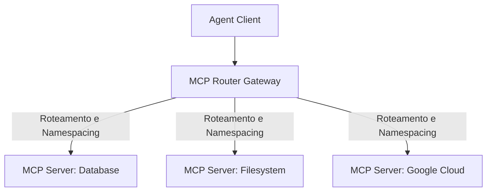
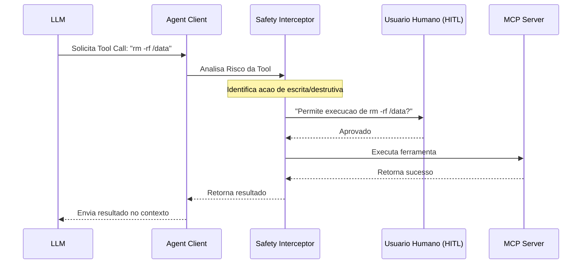

# MCP Avancado e Descoberta Dinamica de Ferramentas

O **Model Context Protocol (MCP)** e um padrao aberto desenvolvido para unificar a forma como modelos de linguagem interagem com fontes de dados e ferramentas externas. Em infraestruturas complexas, no entanto, ir alem da conexao estatica de um unico servidor exige padroes avancados de **descoberta dinamica**, **roteamento multi-servidor** e **protocolos de seguranca estritos** para conter riscos de execucao autonoma.

---

## 1. Descoberta Dinamica de Ferramentas (Dynamic Tool Discovery)

Em arquiteturas tradicionais de agentes, as ferramentas (tools) sao codificadas rigidamente no codigo do orquestrador. Com MCP, os agentes conseguem realizar introspeccao em tempo de execucao:

```
[Agent Engine] -- (1) Request: tools/list --> [MCP Server]
[Agent Engine] <-- (2) JSON Schema list ----- [MCP Server]
[Agent Engine] -- (3) Converte para OpenAI Tool Spec e gera Prompt
```

### Como Funciona:
1. **Introspeccao**: Ao iniciar, ou em intervalos regulares, o agente envia uma requisicao `tools/list` (JSON-RPC) para o servidor MCP conectado.
2. **Interpretacao de Schema**: O servidor responde com uma lista de ferramentas disponiveis e seus respectivos schemas de argumentos em formato JSON Schema.
3. **Injecao no Contexto**: O orquestrador converte dinamicamente esses schemas para o formato esperado pelo LLM (ex: `tools` da API do GPT-4o ou Claude Tool Use) sem necessidade de reiniciar o sistema.

---

## 2. Roteamento Multi-Servidor (Multi-Server Routing)

Quando um agente de IA precisa acessar dados do banco de dados (Server A), arquivos locais (Server B) e APIs da nuvem (Server C), precisamos de um **Gateway de Roteamento MCP**.



### Desafios de Multi-Servidor:
* **Colisao de Nomes**: Se o Server B e o Server C exportarem uma ferramenta chamada `read_file`, ocorre uma colisao.
  * *Solucao*: O Gateway deve aplicar namespaces (ex: `fs_read_file` e `gcs_read_file`).
* **Gerenciamento de Sessoes**: Manter conexoes ativas via stdio (subprocessos) ou HTTP/SSE (Server-Sent Events) de forma concorrente sem travamentos.
* **Selecao Inteligente**: Roteador pode ler a query e decidir enviar apenas as schemas relevantes de um servidor especifico para economizar a janela de contexto do LLM.

### Codigo Pratico (Python): Router Gateway Simples

```python
import json
import asyncio

class MCPRouterGateway:
    def __init__(self):
        self.servers = {}  # Nome do servidor -> conexao/canal

    def register_server(self, server_name: str, client_transport):
        self.servers[server_name] = client_transport

    async def get_all_tools(self) -> dict:
        """Coleta e aplica namespace em todas as ferramentas disponiveis."""
        combined_tools = {}
        for name, transport in self.servers.items():
            # Chamada simulada para listar ferramentas do servidor
            server_tools = await transport.send_request("tools/list", {})
            for tool in server_tools.get("tools", []):
                # Aplicando namespace para evitar colisoes
                namespaced_name = f"{name}_{tool['name']}"
                combined_tools[namespaced_name] = {
                    "original_name": tool["name"],
                    "server": name,
                    "description": tool["description"],
                    "input_schema": tool["input_schema"]
                }
        return combined_tools

    async def execute_tool(self, namespaced_tool_name: str, arguments: dict) -> dict:
        """Roteia a execucao da ferramenta para o servidor correto."""
        all_tools = await self.get_all_tools()
        if namespaced_tool_name not in all_tools:
            raise ValueError(f"Ferramenta {namespaced_tool_name} nao encontrada.")
        
        tool_info = all_tools[namespaced_tool_name]
        server_name = tool_info["server"]
        original_name = tool_info["original_name"]
        
        # Despacha a execucao para o servidor correto
        transport = self.servers[server_name]
        return await transport.send_request(
            "tools/call", 
            {"name": original_name, "arguments": arguments}
        )
```

---

## 3. Protocolos de Seguranca de Execucao (Call Safety Protocols)

Executar ferramentas autonomamente abre brechas para perda de dados ou execucoes indevidas (como deletar arquivos ou criar recursos caros na nuvem). Classificamos ferramentas em duas categorias de risco:

1. **Ferramentas Seguras (Read-Only)**: Leitura de arquivos, consultas SQL `SELECT`, verificacao de status. Executadas automaticamente.
2. **Ferramentas Criticas (Write/Execute)**: Edicao de arquivos, comandos Bash, deletar tabelas, criar infraestrutura. Exigem interceptacao e aprovacao.



### Regras de Mitigacao:
* **Human-in-the-Loop (HITL)**: Parar o fluxo do agente e solicitar aprovacao explicita do usuario antes de rodar ferramentas perigosas.
* **Sandbox**: Execucao de comandos Bash em containers Docker isolados sem acesso ao sistema operacional host.
* **Dry-Run**: Executar simulacoes (quando disponivel pela API) para prever o impacto da ferramenta antes da gravacao real.

### Codigo Pratico (Python): Interceptor de Seguranca com HITL

```python
import functools

# Lista de ferramentas que requerem aprovacao humana obrigatoria
DANGEROUS_TOOLS = ["execute_command", "delete_database", "edit_file", "write_to_file"]

def safety_interceptor(func):
    @functools.wraps(func)
    async def wrapper(tool_name: str, arguments: dict, *args, **kwargs):
        # Verificar se a ferramenta e considerada perigosa
        if any(dangerous in tool_name for dangerous in DANGEROUS_TOOLS):
            print(f"\n[ALERTA DE SEGURANCA] O agente solicitou execucao critica:")
            print(f"Tool: {tool_name}")
            print(f"Argumentos: {json.dumps(arguments, indent=2)}")
            
            # Interacao com o humano
            user_approval = input("Voce aprova esta execucao? (s/n): ").strip().lower()
            if user_approval != 's':
                print("[BLOQUEADO] Execucao negada pelo usuario.")
                return {"is_error": True, "content": "Execucao rejeitada pelo operador de seguranca humano."}
                
        # Executa a funcao original se for segura ou aprovada
        return await func(tool_name, arguments, *args, **kwargs)
    return wrapper

# Exemplo de aplicacao da checagem
@safety_interceptor
async def call_mcp_tool(tool_name: str, arguments: dict):
    # Logica de conexao real com o servidor MCP
    return {"is_error": False, "content": "Sucesso na execucao."}
```

---

## 4. Detalhes de Protocolo: SSE vs Stdio

O MCP suporta dois meios de transporte principais:

### A. Stdio (Standard Input/Output)
* **Como funciona**: O cliente inicia o servidor MCP como um subprocesso e se comunica escrevendo na entrada padrao (`stdin`) e lendo da saida padrao (`stdout`).
* **Ideal para**: Agentes locais rodando na maquina do usuario (extensoes de VS Code, CLI local, scripts de automacao locais).
* **Vantagem**: Baixissima latencia, nao exige portas de rede abertas, gerenciamento simples do ciclo de vida do subprocesso.

### B. SSE (Server-Sent Events)
* **Como funciona**: O servidor roda como um servico HTTP independente. O cliente se conecta enviando eventos SSE para receber informacoes do servidor e usa chamadas HTTP POST para enviar comandos.
* **Ideal para**: Servidores centralizados ou rodando na nuvem, onde multiplos agentes ou clientes precisam se conectar a ferramentas remotas.
* **Vantagem**: Permite conexao remota de multiplas origens, isolamento de rede nativo por firewalls.

---

## Conexoes do Vault
* [[05-Skills/03-infrastructure-mcp/advanced-mcp-integrations|MCP Integracoes Avancadas]]
* [[05-Skills/03-infrastructure-mcp/mcp-servers|Servidores MCP e Configuracao]]
* [[05-Skills/01-agentic-intelligence/mcp-operators|Operadores MCP e Composicao]]
* [[05-Skills/01-agentic-intelligence/crewai-autogen-langgraph|Arquiteturas Multi-Agente: CrewAI, AutoGen e LangGraph]]
* [[05-Skills/01-agentic-intelligence/avaliacao-seguranca-de-agentes|Avaliacao e Seguranca de Agentes de IA]]
