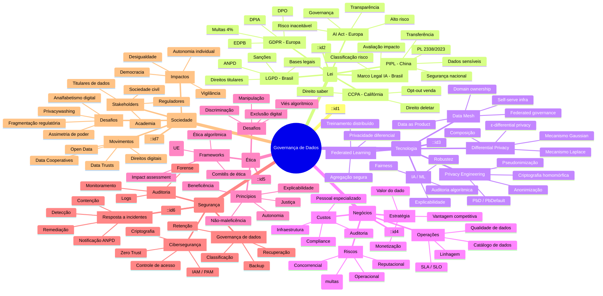

# Governança de Dados Avançada: LGPD, AI Act, Data Mesh, Privacy Engineering

## Sumário

1. [Introdução Teórica Aprofundada](#1-introdução-teórica-aprofundada)
2. [Marcos Regulatórios](#2-marcos-regulatórios)
3. [Privacy Engineering e Accountability](#3-privacy-engineering-e-accountability)
4. [Data Mesh: Governança Descentralizada](#4-data-mesh-governança-descentralizada)
5. [Frameworks de Governança](#5-frameworks-de-governança)
6. [Exemplo Prático Completo com Python](#6-exemplo-prático-completo-com-python)
7. [Exercícios Resolvidos](#7-exercícios-resolvidos)
8. [Estudo de Caso: Cambridge Analytica e Facebook](#8-estudo-de-caso-cambridge-analytica-e-facebook)
9. [Cross-Mapping: Diagrama Mermaid](#9-cross-mapping-diagrama-mermaid)
10. [Discussão Crítica](#10-discussão-crítica)
11. [Recursos Externos](#11-recursos-externos)
12. [Bibliografia e Papers Comentados](#12-bibliografia-e-papers-comentados)
13. [Referências Completas](#13-referências-completas)

---

## 1. Introdução Teórica Aprofundada

### 1.1 O Cenário Regulatório Global

A governança de dados deixou de ser uma preocupação exclusiva de departamentos de TI para se tornar um pilar estratégico das organizações. Três grandes forças moldam este cenário: a explosão volumétrica de dados, o avanço regulatório global e a crescente demanda social por transparência e ética no uso de informações pessoais.

### 1.2 Lei Geral de Proteção de Dados (LGPD - Lei 13.709/2018)

A LGPD, sancionada em agosto de 2018 e em vigor desde setembro de 2020, é o marco regulatório brasileiro de proteção de dados. Inspirada no GDPR europeu, a LGPD estabelece:

**Fundamentos (Art. 2º):** Respeito à privacidade; autodeterminação informativa; liberdade de expressão, informação, comunicação e opinião; inviolabilidade da intimidade, honra e imagem; desenvolvimento econômico e tecnológico; inovação; livre iniciativa, livre concorrência e defesa do consumidor; direitos humanos, livre desenvolvimento da personalidade, dignidade e exercício da cidadania.

**Princípios (Art. 6º):** Finalidade, adequação, necessidade, livre acesso, qualidade dos dados, transparência, segurança, prevenção, não discriminação, responsabilização e prestação de contas (accountability).

**Bases Legais (Art. 7º):** Consentimento, cumprimento de obrigação legal, execução de políticas públicas, realização de estudos por órgão de pesquisa, execução de contrato, exercício regular de direitos, proteção da vida, tutela da saúde, legítimo interesse, proteção ao crédito.

**Direitos do Titular (Art. 18):** Confirmação da existência de tratamento, acesso, correção, anonimização, bloqueio, eliminação, portabilidade, informação sobre compartilhamento, revogação do consentimento, oposição e revisão de decisões automatizadas.

**ANPD (Autoridade Nacional de Proteção de Dados):** Órgão da administração pública federal responsável por regulamentar, fiscalizar e aplicar sanções.

**Sanções (Art. 52):** Advertência, multa simples de até 2% do faturamento (limitada a R$ 50 milhões por infração), multa diária, publicização da infração, bloqueio e eliminação de dados, suspensão parcial ou total do funcionamento do banco de dados.

### 1.3 Regulamento Geral sobre a Proteção de Dados (GDPR - Regulamento UE 2016/679)

O GDPR, em vigor desde maio de 2018, estabeleceu o padrão global de proteção de dados. Seus principais diferenciais incluem:

**Territorialidade (Art. 3º):** Aplica-se a qualquer organização que processe dados de residentes na UE, independentemente de onde a organização esteja estabelecida.

**DPO (Data Protection Officer):** Obrigatoriedade de nomeação para órgãos públicos e organizações que realizem monitoramento sistemático em larga escala ou processamento de categorias especiais de dados.

**DPIA (Data Protection Impact Assessment):** Avaliação obrigatória para operações que apresentem alto risco aos direitos e liberdades dos titulares.

**Direito ao Apagamento (Art. 17):** "Right to be forgotten" — possibilidade de solicitar a eliminação de dados quando não houver motivo legítimo para sua retenção.

**Portabilidade (Art. 20):** Direito de receber os dados em formato estruturado, de uso corrente e legível por máquina.

**Multas:** Até 20 milhões de euros ou 4% do faturamento anual global (o que for maior).

### 1.4 AI Act Europeu (Regulamento UE 2024/1689)

Aprovado em 2024, o AI Act é o primeiro marco regulatório abrangente para inteligência artificial no mundo. Classifica sistemas de IA em quatro categorias de risco:

**Risco Inaceitável (Proibido):** Sistemas de pontuação social (social scoring), manipulação comportamental subliminar, vigilância biométrica em tempo real em espaços públicos para fins de aplicação da lei, categorização biométrica por características sensíveis, predição de risco criminal baseada exclusivamente em perfilamento, reconhecimento emocional em locais de trabalho e instituições de ensino.

**Alto Risco:** Sistemas de IA utilizados em infraestruturas críticas, dispositivos médicos, educação, emprego, acesso a serviços essenciais, aplicação da lei, migração, administração da justiça e processos democráticos. Exigem: avaliação de conformidade, documentação técnica, registro em banco de dados da UE, supervisão humana, robustez, precisão e cibersegurança.

**Risco Limitado:** Sistemas de interação com humanos (chatbots), sistemas de geração de conteúdo (deepfakes). Exigem transparência — o usuário deve ser informado de que está interagindo com uma IA.

**Risco Mínimo:** Todos os demais sistemas. Códigos de conduta voluntários.

**Governança:** European AI Board, autoridades nacionais competentes, direito de reclamação para pessoas físicas, multas de até 35 milhões de euros ou 7% do faturamento anual global.

**Conexão com LGPD e GDPR:** O AI Act exige que sistemas de IA de alto risco respeitem os princípios de proteção de dados desde a concepção (privacy by design) e por padrão (privacy by default). A avaliação de impacto à proteção de dados (DPIA) deve considerar os riscos específicos da IA.

### 1.5 Privacy Engineering

Privacy engineering é a disciplina que integra requisitos de privacidade na engenharia de sistemas de forma sistemática, desde a concepção até a operação. Baseia-se em três pilares:

**Privacy by Design (PbD):** Desenvolvido por Ann Cavoukian (Comissária de Informação e Privacidade de Ontário, Canadá) em 2009. Sete princípios fundamentais:

1. Proativo, não reativo; preventivo, não corretivo
2. Privacidade como configuração padrão (privacy by default)
3. Privacidade incorporada ao design (embedded)
4. Funcionalidade plena — soma positiva, não soma zero
5. Segurança de ponta a ponta — proteção durante todo o ciclo de vida
6. Visibilidade e transparência
7. Respeito pela privacidade do usuário — centrado no usuário

**Privacy by Default:** Configurações padrão devem ser as mais protetivas possíveis. O usuário deve optar ativamente (opt-in) por qualquer redução de privacidade.

**Differential Privacy (Dwork, 2006):** Técnica matemática que permite extrair informações agregadas de um dataset enquanto garante que a inclusão ou exclusão de um único registro não afeta significativamente o resultado. Formalmente:

Um mecanismo M satisfaz ε-differential privacy se para todos os datasets D e D' que diferem em exatamente um registro, e para todo subconjunto S ⊆ Range(M):

Pr[M(D) ∈ S] ≤ e^ε × Pr[M(D') ∈ S]

Onde ε (épsilon) é o parâmetro de privacidade. Quanto menor o ε, maior a privacidade.

**K-Anonymity (Sweeney, 2002):** Um dataset satisfaz k-anonymity se cada combinação de quasi-identificadores aparece pelo menos k vezes. Precursor da differential privacy, mas vulnerável a ataques de homogeneidade e background knowledge.

**Federated Learning:** Técnica que permite treinar modelos de machine learning sem centralizar os dados. O modelo vai até os dados, não o contrário. Reduz riscos de vazamento, mas não elimina completamente riscos de inferência.

**Homomorphic Encryption:** Permite realizar operações em dados criptografados sem descriptografá-los. Ainda computacionalmente cara, mas promissora para cenários de alta sensibilidade.

### 1.6 Accountability

Accountability (responsabilização e prestação de contas) é o princípio que exige que as organizações demonstrem conformidade com as leis de proteção de dados. Vai além da conformidade formal — exige evidências documentadas e verificáveis.

**Elementos de um Programa de Accountability:**
- Política de privacidade e proteção de dados aprovada pela alta direção
- Designação de encarregado (DPO)
- Programa de treinamento e conscientização
- Mapeamento de dados (data mapping)
- Registro das operações de tratamento (ROPA)
- Avaliações de impacto (DPIA/PIA)
- Due diligence de terceiros (DPA — Data Processing Agreement)
- Plano de resposta a incidentes
- Revisões e auditorias periódicas
- Métricas e KPIs de privacidade

### 1.7 Data Mesh (Zhamak Dehghani)

Proposto por Zhamak Dehghani em 2019 (Thinkworks), o data mesh é um paradigma de arquitetura de dados descentralizada que aplica princípios de domain-driven design e product thinking à gestão de dados.

**Quatro Princípios Fundamentais:**

1. **Domain Ownership (Propriedade por Domínio):** Cada domínio de negócio é responsável por seus próprios dados — sua coleta, processamento, armazenamento, qualidade e disponibilização. Os dados são tratados como produtos.

2. **Data as a Product (Dados como Produto):** Cada conjunto de dados deve ser tratado como um produto, com ownership claro, documentação, SLA, qualidade garantida e discoverability.

3. **Self-serve Data Infrastructure (Infraestrutura Autossuficiente):** Plataforma compartilhada que abstrai complexidades técnicas (armazenamento, processamento, lineage, catálogo) para que os domínios possam criar e manter seus data products.

4. **Federated Computational Governance (Governança Computacional Federada):** Governança automatizada aplicada globalmente, com regras computacionais que garantem interoperabilidade, qualidade, privacidade e compliance sem centralizar a tomada de decisão.

**Data Product:** Unidade fundamental do data mesh. Deve possuir:
- Input port (como os dados entram)
- Output port (como os dados são consumidos)
- Discoverability (descoberta via catálogo)
- Addressability (endereçável globalmente)
- Trustworthiness (qualidade, linhagem, metadados)
- Self-describing (auto-descritivo com metadados ricos)
- Interoperability (padrões abertos)
- Security and privacy controls embutidos

**Comparação Arquitetural:**

| Característica | Data Lake / Warehouse | Data Mesh |
|:---|---:|---:|
| Propriedade | Centralizada (time de dados) | Descentralizada (domínios) |
| Estrutura | Único repositório | Múltiplos data products |
| Governança | Centralizada, manual | Federada, computacional |
| Consumo | Push centralizado | Self-serve |
| Escalabilidade | Limitada pelo time central | Escala com a organização |

---

## 2. Marcos Regulatórios

### 2.1 Comparativo LGPD × GDPR × AI Act

| Aspecto | LGPD | GDPR | AI Act |
|:---|:---|:---|:---|
| Abrangência | Territorial mista | Territorial ampla | Baseada em risco |
| Sanção máxima | R$ 50M ou 2% faturamento | 20M EUR ou 4% faturamento | 35M EUR ou 7% faturamento |
| Autoridade | ANPD | EDPB + autoridades nacionais | European AI Board |
| DPIA Obrigatória | Sim (alto risco) | Sim (alto risco) | Sim (alto risco para IA) |
| Decisões automatizadas | Art. 20 (revisão) | Art. 22 (oposição) | Classificação de risco |
| Vigência | 2020 | 2018 | 2024 (vigência gradual) |

### 2.2 Outros Regulamentos Relevantes

**Lei de IA dos EUA (Blueprint for an AI Bill of Rights, 2022):** Não vinculante, mas estabelece cinco princípios: sistemas seguros e eficazes, não discriminação algorítmica, privacidade de dados, aviso e explicação, alternativas humanas.

**Lei Geral de Proteção de Dados Pessoais da China (PIPL, 2021):** Similar ao GDPR, com ênfase em segurança nacional. Exige avaliação de impacto para processamento de dados sensíveis, transferências internacionais e decisões automatizadas.

**CCPA/CPRA (Califórnia, 2020/2023):** Direito de saber, direito de deletar, direito de opt-out da venda de dados, direito de correção, direito de limitar uso de dados sensíveis.

**Korea PIPA (Personal Information Protection Act):** Similar ao GDPR, com agência reguladora forte (PIPC). Exige avaliação de impacto e consentimento para dados sensíveis.

**Brasil PL 2338/2023 (Marco Legal da IA):** Em tramitação no Congresso Nacional. Inspirado no AI Act europeu, com classificação de risco, avaliação de impacto algorítmico e governança de IA.

---

## 3. Privacy Engineering e Accountability

### 3.1 Estratégias de Privacy Engineering (Hoepman, 2014)

Oito estratégias de privacidade baseadas em design patterns:

1. **MINIMIZE** — Coletar a menor quantidade possível de dados
2. **HIDE** — Ocultar dados pessoais (anonimização, pseudonimização)
3. **SEPARATE** — Processar dados em compartimentos separados
4. **AGGREGATE** — Processar dados no nível mais alto de agregação
5. **INFORM** — Informar os titulares sobre o tratamento
6. **CONTROL** — Dar controle ao titular sobre seus dados
7. **ENFORCE** — Aplicar políticas de privacidade de forma vinculante
8. **DEMONSTRATE** — Demonstrar conformidade (accountability)

### 3.2 Matriz de Accountability

| Dimensão | O que é | Como implementar | Evidência |
|:---|:---|:---|:---|
| Liderança | Compromisso da alta direção | Política aprovada pelo board, DPO nomeado | Ata de reunião, nomeação formal |
| Políticas | Normas internas | Política de privacidade, segurança, governança | Documentos aprovados, versão controlada |
| Processos | Operações de tratamento | Mapeamento de dados, ROPA, DPIA | Registros, relatórios |
| Pessoas | Conscientização e capacitação | Treinamentos, comunicação | Registro de presença, avaliações |
| Tecnologia | Controles técnicos | Privacy by design, pseudonimização, criptografia | Arquitetura, logs, testes |
| Terceiros | Gestão de fornecedores | DPA, due diligence, auditoria | Contratos, relatórios |
| Incidentes | Resposta a violações | Plano, notificação, remediação | Logs, relatórios, registro ANPD |
| Monitoramento | Melhoria contínua | Auditorias, métricas, revisões | Relatórios, dashboards |

### 3.3 Privacy Impact Assessment (PIA)

Template adaptado do ICO (Information Commissioner's Office):

**Seção 1: Contexto**
- Nome do projeto/sistema
- Responsável pelo tratamento (controller)
- Encarregado (DPO)
- Data de início e revisão

**Seção 2: Descrição do Tratamento**
- Finalidade do tratamento
- Categorias de dados pessoais coletados
- Categorias de titulares
- Fluxo de dados (origem, processamento, armazenamento, compartilhamento, eliminação)
- Bases legais aplicáveis
- Terceiros envolvidos

**Seção 3: Necessidade e Proporcionalidade**
- O tratamento é necessário para a finalidade?
- Existem alternativas menos invasivas?
- Prazo de retenção é justificado?
- Como os titulares são informados?

**Seção 4: Riscos aos Direitos dos Titulares**
- Identificação de riscos (probabilidade × severidade)
- Riscos: acesso não autorizado, modificação indevida, perda/destruição, uso não conforme, reidentificação
- Riscos específicos: tomada de decisão automatizada, vigilância, exclusão social, discriminação

**Seção 5: Mitigações**
- Medidas técnicas (criptografia, pseudonimização, controle de acesso, logs)
- Medidas organizacionais (políticas, treinamento, contratos)
- Medidas específicas para IA (explicabilidade, fairness, robustez)

**Seção 6: Conclusão**
- Risco residual aceitável?
- Recomendação: prosseguir, modificar, não prosseguir
- Data da próxima revisão

---

## 4. Data Mesh: Governança Descentralizada

### 4.1 Arquitetura Detalhada

O data mesh propõe uma mudança radical de paradigma, onde a governança não é imposta centralmente, mas sim computacionalmente aplicada de forma federada.

**Camadas da Arquitetura Data Mesh:**

1. **Camada de Infraestrutura (Data Platform):**
   - Computação (auto-scaling, containers, serverless)
   - Armazenamento (data lake, object storage)
   - Rede e segurança (IAM, encryption, network policies)
   - Orquestração (pipelines, scheduling)

2. **Camada de Produto (Data Product):**
   - Input ports (batch streaming, event-driven)
   - Transformation logic (clean, enrich, aggregate)
   - Output ports (tables, APIs, events, reports)
   - Metadata (owner, schema, quality, lineage)
   - Policies (access control, retention, anonymization)

3. **Camada de Governança (Federated Governance):**
   - Global policies (GDPR compliance, data classification)
   - Local policies (domain-specific rules)
   - Automated enforcement (policy-as-code)
   - Auditing and lineage (provenance tracking)
   - Data catalog (discovery, documentation)

4. **Camada de Consumo (Self-serve):**
   - Data catalog and marketplace
   - Query interfaces (SQL, Python, APIs)
   - Monitoring and observability
   - Collaboration and feedback

### 4.2 Políticas de Governança Computacional

Exemplo de políticas federadas:

```yaml
# global-policies.yaml
policies:
  - name: pii-masking
    scope: global
    applies_to: all_data_products
    rules:
      - field: cpf
        action: mask
        pattern: "***.***.***-**"
      - field: email
        action: pseudonymize
        algorithm: sha256-with-salt
      - field: nome
        action: anonymize
        algorithm: generalization
        level: initials-only

  - name: retention-policy
    scope: global
    rules:
      - category: pessoal
        max_retention_days: 365
        action: delete_or_anonymize
      - category: anonimizado
        max_retention_days: 1825

  - name: quality-sla
    scope: domain
    rules:
      - metric: completeness
        min: 0.98
      - metric: accuracy
        min: 0.95
      - metric: timeliness
        max_lag_minutes: 60
```

### 4.3 Data Product Specification

```yaml
# data-product.yaml
apiVersion: datamesh.io/v1alpha1
kind: DataProduct
metadata:
  name: clientes-360
  domain: customer-relationship
  owner: squad-crm@empresa.com
  classification: restricted
spec:
  inputPorts:
    - name: raw-transactions
      type: event-stream
      source: kafka://transactions.raw
      schema:
        format: avro
        registry: schema-registry:8081
  outputPorts:
    - name: enriched-clients
      type: table
      format: parquet
      location: s3://data-products/crm/enriched-clients
      schema:
        fields:
          - name: client_id
            type: string
            pii: false
          - name: age_group
            type: string
            pii: true
            anonymization: generalization
          - name: segment
            type: string
            pii: false
  quality:
    completeness: 0.99
    accuracy: 0.98
    freshness: 1h
  governance:
    retention: 365d
    accessControl: attribute-based
    auditEnabled: true
```

---

## 5. Frameworks de Governança

### 5.1 NIST Privacy Framework (NIST PF)

Desenvolvido pelo National Institute of Standards and Technology (EUA), o NIST Privacy Framework fornece uma abordagem baseada em risco para proteger a privacidade dos indivíduos.

**Estrutura:**

**Funções:**
- **Identify (IDENTIFICAR):** Entender o contexto do processamento, riscos de privacidade e prioridades organizacionais.
- **Govern (GOVERNAR):** Estabelecer governança, políticas e processos.
- **Control (CONTROLAR):** Implementar medidas técnicas e organizacionais.
- **Communicate (COMUNICAR):** Transparência com stakeholders.
- **Protect (PROTEGER):** Salvaguardas de segurança e privacidade.

**Categorias (exemplos):**
- IDENTIFY.P — Problemas de privacidade identificados
- IDENTIFY.S — Papéis e responsabilidades definidos
- GOVERN.P — Políticas e processos de governança
- GOVERN.M — Gestão de riscos integrada
- CONTROL.P — Políticas de controle de privacidade
- CONTROL.F — Gerenciamento de autorização
- COMMUNICATE.P — Transparência e notificação
- PROTECT.P — Proteção de dados

### 5.2 ISO/IEC 27701

Extensão da ISO 27001 para gestão de informação de privacidade. Estabelece requisitos e diretrizes para um Privacy Information Management System (PIMS).

**Benefícios:**
- Conformidade com LGPD, GDPR e outras leis
- Integração com ISO 27001 (segurança da informação)
- Abordagem sistemática e auditável
- Due diligence para terceiros
- Vantagem competitiva

**Requisitos Principais:**
- Contexto da organização
- Liderança e compromisso
- Planejamento
- Suporte (recursos, competência, conscientização)
- Operação
- Avaliação de desempenho
- Melhoria

**Controles Específicos de Privacidade:**
- PII Actors identification
- Purposes identification
- Consentimento e permissão
- Direitos do titular
- Minimização, coleta e retenção
- Precisão, qualidade e atualização
- Proteção durante uso, armazenamento e transferência
- Transparência e notificação

### 5.3 COBIT 2019

Framework de governança de TI do ISACA que pode ser aplicado à governança de dados:

**Princípios:**
- Atender às necessidades dos stakeholders
- Cobrir a empresa de ponta a ponta
- Aplicar um framework único e integrado
- Permitir uma abordagem holística
- Separar governança de gestão

**Objetivos de Governança Aplicáveis a Dados:**
- EDM03 — Garantir a otimização de riscos
- APO01 — Gerenciar o framework de gestão de TI
- APO13 — Gerenciar a segurança
- DSS05 — Gerenciar serviços de segurança
- DSS06 — Gerenciar controles de processos de negócio

### 5.4 DAMA-DMBOK2

Data Management Body of Knowledge (DAMA International) — guia abrangente para gestão de dados:

**Áreas de Conhecimento:**
- Governança de Dados
- Arquitetura de Dados
- Modelagem e Design de Dados
- Armazenamento e Operações de Dados
- Segurança de Dados
- Integração e Interoperabilidade
- Documentação e Conteúdo
- Dados Mestre e Referência
- Data Warehousing e BI
- Metadados
- Qualidade de Dados

---

## 6. Exemplo Prático Completo com Python

### 6.1 Privacy by Design Pipeline

```python
"""
Privacy by Design Pipeline — Exemplo Completo
Requisitos: numpy, pandas, diffprivlib, scikit-learn
Instalação: pip install numpy pandas diffprivlib scikit-learn
"""

import numpy as np
import pandas as pd
from typing import Any, Dict, List, Tuple, Optional
from dataclasses import dataclass, field
from enum import Enum
import hashlib
import hmac
import os
import json
from datetime import datetime, timedelta


# =============================================================================
# CAMADA 1: CLASSIFICAÇÃO DE DADOS
# =============================================================================

class DataClassification(Enum):
    PUBLIC = "public"
    INTERNAL = "internal"
    CONFIDENTIAL = "confidential"
    RESTRICTED = "restricted"
    PII = "pii"
    SENSITIVE = "sensitive"


class PIICategory(Enum):
    DIRECT = "direct"           # Nome, CPF, RG, email
    QUASI = "quasi"             # Idade, CEP, gênero, profissão
    SENSITIVE = "sensitive"     # Raça, religião, saúde, política
    BEHAVIORAL = "behavioral"   # Hábitos, preferências, localização
    FINANCIAL = "financial"     # Renda, cartão, conta bancária


@dataclass
class FieldMetadata:
    name: str
    classification: DataClassification
    pii_category: Optional[PIICategory] = None
    pii: bool = False
    required: bool = False
    retention_days: int = 365
    anonymization_strategy: Optional[str] = None  # mask, generalize, pseudonymize, suppress, noise


# =============================================================================
# CAMADA 2: PSEUDONIMIZAÇÃO E ANONIMIZAÇÃO
# =============================================================================

class Pseudonymizer:
    """Pseudonimização determinística com salt rotacionável."""

    def __init__(self, salt_key: str = "default-salt-change-me"):
        self._salt_key = salt_key
        self._salt_rotation_period = timedelta(days=90)
        self._salt_created = datetime.now()

    def _get_current_salt(self) -> bytes:
        return self._salt_key.encode("utf-8")

    def pseudonymize(self, value: str) -> str:
        salt = self._get_current_salt()
        return hmac.new(salt, value.encode("utf-8"), hashlib.sha256).hexdigest()[:16]

    def rotate_salt(self):
        """Rotaciona o salt, invalidando pseudônimos anteriores."""
        self._salt_key = os.urandom(32).hex()
        self._salt_created = datetime.now()


class Anonymizer:
    """Estratégias de anonimização."""

    @staticmethod
    def mask(value: str, visible_chars: int = 3, mask_char: str = "*") -> str:
        if len(value) <= visible_chars:
            return value
        return value[:visible_chars] + mask_char * (len(value) - visible_chars)

    @staticmethod
    def generalize(value: Any, bin_size: int = 10) -> str:
        if isinstance(value, (int, float)):
            lower = (value // bin_size) * bin_size
            upper = lower + bin_size - 1
            return f"[{lower}-{upper}]"
        return str(value)

    @staticmethod
    def suppress(value: Any) -> str:
        return "[SUPPRESSED]"

    @staticmethod
    def add_noise(value: float, epsilon: float = 1.0, sensitivity: float = 1.0) -> float:
        """Ruído Laplace para differential privacy."""
        scale = sensitivity / epsilon
        noise = np.random.laplace(0, scale)
        return value + noise


# =============================================================================
# CAMADA 3: DIFFERENTIAL PRIVACY (PyDP / diffprivlib)
# =============================================================================

from diffprivlib import mechanisms as dp_mech
from diffprivlib import models as dp_models


class DifferentialPrivacyEngine:
    """
    Motor de Differential Privacy.
    Suporta mecanismos: Laplace, Gaussian, Exponential, Count, Mean, Variance.
    """

    def __init__(self, epsilon: float = 1.0, delta: Optional[float] = None):
        self.epsilon = epsilon
        self.delta = delta or (1.0 / 1e6)

    def noisy_count(self, data: pd.Series) -> float:
        """Contagem com ruído Laplace."""
        mech = dp_mech.LaplaceBoundedDomain(epsilon=self.epsilon, bounds=(0, len(data)))
        true_count = data.count()
        return mech.randomise(true_count)

    def noisy_mean(self, data: pd.Series, bounds: Tuple[float, float]) -> float:
        """Média com ruído Laplace."""
        mech = dp_mech.LaplaceBoundedMean(epsilon=self.epsilon, bounds=bounds)
        return mech.randomise(data.dropna().values)

    def noisy_sum(self, data: pd.Series, bounds: Tuple[float, float]) -> float:
        """Soma com ruído Gaussian."""
        mech = dp_mech.Gaussian(epsilon=self.epsilon, delta=self.delta, sensitivity=(bounds[1] - bounds[0]))
        return mech.randomise(data.dropna().sum())

    def noisy_histogram(self, data: pd.Series, bins: int = 10) -> np.ndarray:
        """Histograma com differential privacy."""
        mech = dp_mech.LaplaceBoundedDomain(epsilon=self.epsilon, bounds=(0, bins))
        hist, _ = np.histogram(data.dropna(), bins=bins)
        return np.array([mech.randomise(int(h)) for h in hist])

    def dp_logistic_regression(self, X: np.ndarray, y: np.ndarray, **kwargs):
        """Regressão logística com differential privacy."""
        model = dp_models.LogisticRegression(epsilon=self.epsilon, **kwargs)
        model.fit(X, y)
        return model

    def budget_allocator(self, n_queries: int) -> float:
        """
        Aloca orçamento de privacidade para múltiplas consultas.
        Usa composição sequencial: epsilon_total = sum(epsilon_i).
        """
        return self.epsilon / n_queries

    def sequential_composition(self, epsilon_i: List[float]) -> float:
        """Composição sequencial: eps_total = soma."""
        return sum(epsilon_i)

    def parallel_composition(self, epsilon: float) -> float:
        """Composição paralela: eps_total = max(epsilon_i)."""
        return epsilon

    def advanced_composition(self, epsilon: float, k: int, delta: float) -> Tuple[float, float]:
        """Teorema de composição avançada (Dwork-Roth 2014)."""
        epsilon_total = epsilon * np.sqrt(2 * k * np.log(1 / delta)) + 2 * epsilon * k
        return epsilon_total, delta


# =============================================================================
# CAMADA 4: CONTROLE DE ACESSO E AUDITORIA
# =============================================================================

class AccessLevel(Enum):
    NONE = 0
    AGGREGATE = 1       # Apenas dados agregados (differential privacy)
    PSEUDONYMIZED = 2    # Dados pseudonimizados
    IDENTIFIED = 3       # Dados identificados
    ADMIN = 4            # Acesso total


@dataclass
class AccessPolicy:
    user: str
    role: str
    dataset: str
    level: AccessLevel
    expiry: Optional[datetime] = None
    approved_by: Optional[str] = None
    purpose: str = ""


class AuditLogger:
    """Logger de auditoria — registro de todos os acessos e operações."""

    def __init__(self, log_file: str = "audit_log.jsonl"):
        self.log_file = log_file

    def log_access(self, user: str, dataset: str, operation: str,
                   access_level: AccessLevel, status: str, details: str = ""):
        entry = {
            "timestamp": datetime.utcnow().isoformat(),
            "user": user,
            "dataset": dataset,
            "operation": operation,
            "access_level": access_level.value,
            "status": status,
            "details": details
        }
        with open(self.log_file, "a", encoding="utf-8") as f:
            f.write(json.dumps(entry, ensure_ascii=False) + "\n")

    def query_logs(self, user: Optional[str] = None,
                   dataset: Optional[str] = None,
                   start_date: Optional[datetime] = None,
                   end_date: Optional[datetime] = None) -> List[Dict]:
        logs = []
        with open(self.log_file, "r", encoding="utf-8") as f:
            for line in f:
                log = json.loads(line)
                if user and log["user"] != user:
                    continue
                if dataset and log["dataset"] != dataset:
                    continue
                log_date = datetime.fromisoformat(log["timestamp"])
                if start_date and log_date < start_date:
                    continue
                if end_date and log_date > end_date:
                    continue
                logs.append(log)
        return logs


# =============================================================================
# CAMADA 5: PIPELINE PRIVACY BY DESIGN
# =============================================================================

@dataclass
class PipelineResult:
    success: bool
    original_shape: Tuple[int, int]
    processed_shape: Tuple[int, int]
    dp_epsilon: Optional[float] = None
    warnings: List[str] = field(default_factory=list)
    metrics: Dict[str, Any] = field(default_factory=dict)


class PrivacyPipeline:
    """
    Pipeline de privacidade by design.
    Orquestra classificação, pseudonimização, anonimização, DP e auditoria.
    """

    def __init__(self, epsilon: float = 1.0):
        self.fields_metadata: Dict[str, FieldMetadata] = {}
        self.pseudonymizer = Pseudonymizer()
        self.anonymizer = Anonymizer()
        self.dp_engine = DifferentialPrivacyEngine(epsilon=epsilon)
        self.audit_logger = AuditLogger()
        self.policies: Dict[str, AccessPolicy] = {}

    def register_field(self, metadata: FieldMetadata):
        self.fields_metadata[metadata.name] = metadata

    def register_fields_from_schema(self, schema: Dict[str, Dict]):
        """Registra campos a partir de schema dict."""
        for field_name, props in schema.items():
            classification = DataClassification(props.get("classification", "internal"))
            pii_cat = PIICategory(props["pii_category"]) if props.get("pii_category") else None
            meta = FieldMetadata(
                name=field_name,
                classification=classification,
                pii_category=pii_cat,
                pii=props.get("pii", False),
                required=props.get("required", False),
                retention_days=props.get("retention_days", 365),
                anonymization_strategy=props.get("anonymization_strategy")
            )
            self.register_field(meta)

    def add_policy(self, policy: AccessPolicy):
        self.policies[policy.user] = policy

    def check_access(self, user: str, dataset: str, requested_level: AccessLevel) -> bool:
        if user not in self.policies:
            self.audit_logger.log_access(user, dataset, "access_check",
                                         requested_level, "DENIED", "No policy found")
            return False
        policy = self.policies[user]
        if policy.dataset != dataset:
            return False
        if policy.expiry and policy.expiry < datetime.now():
            return False
        if policy.level.value < requested_level.value:
            return False
        self.audit_logger.log_access(user, dataset, "access_check",
                                     requested_level, "GRANTED", policy.purpose)
        return True

    def process_dataset(self, df: pd.DataFrame, user: str,
                        output_level: AccessLevel = AccessLevel.AGGREGATE) -> PipelineResult:
        """
        Processa dataset inteiro com privacy by design.
        """
        result = PipelineResult(
            success=True,
            original_shape=df.shape,
            processed_shape=(0, 0),
            dp_epsilon=self.dp_engine.epsilon
        )

        # Verificação de acesso
        if not self.check_access(user, "dataset", output_level):
            result.success = False
            result.warnings.append("Acesso negado")
            return result

        df_out = df.copy()
        warnings = []

        # Aplicar estratégias por campo
        for field, meta in self.fields_metadata.items():
            if field not in df_out.columns:
                continue

            if output_level == AccessLevel.IDENTIFIED:
                # Manter dados originais
                continue

            if output_level == AccessLevel.PSEUDONYMIZED:
                if meta.pii or meta.classification in (DataClassification.PII, DataClassification.SENSITIVE):
                    if meta.anonymization_strategy == "mask":
                        df_out[field] = df_out[field].astype(str).apply(
                            lambda x: self.anonymizer.mask(x)
                        )
                    else:
                        df_out[field] = df_out[field].astype(str).apply(
                            self.pseudonymizer.pseudonymize
                        )
                    warnings.append(f"Campo {field} pseudonimizado")

            if output_level == AccessLevel.AGGREGATE:
                # Remover colunas identificadoras
                if meta.pii or meta.classification in (DataClassification.PII,
                                                       DataClassification.SENSITIVE,
                                                       DataClassification.CONFIDENTIAL,
                                                       DataClassification.RESTRICTED):
                    df_out.drop(columns=[field], inplace=True)
                    warnings.append(f"Campo {field} suprimido para nível aggregate")

        result.processed_shape = df_out.shape
        result.warnings = warnings
        result.metrics = {
            "fields_removed": df.shape[1] - df_out.shape[1],
            "rows_removed": df.shape[0] - df_out.shape[0]
        }

        self.audit_logger.log_access(user, "dataset", "process",
                                     output_level, "SUCCESS",
                                     f"Shape: {df.shape} -> {df_out.shape}")

        return result

    def generate_privacy_report(self) -> Dict:
        """Gera relatório de privacidade da pipeline."""
        pii_fields = [k for k, v in self.fields_metadata.items() if v.pii]
        sensitive = [k for k, v in self.fields_metadata.items()
                     if v.classification in (DataClassification.SENSITIVE, DataClassification.RESTRICTED)]

        return {
            "total_fields": len(self.fields_metadata),
            "pii_fields": len(pii_fields),
            "sensitive_fields": len(sensitive),
            "fields": [
                {
                    "name": k,
                    "classification": v.classification.value,
                    "pii": v.pii,
                    "anonymization": v.anonymization_strategy
                }
                for k, v in self.fields_metadata.items()
            ],
            "dp_config": {
                "epsilon": self.dp_engine.epsilon,
                "delta": self.dp_engine.delta
            },
            "policies_count": len(self.policies),
            "report_generated_at": datetime.utcnow().isoformat()
        }


# =============================================================================
# DEMONSTRAÇÃO COMPLETA
# =============================================================================

def run_demo():
    print("=" * 70)
    print("DEMONSTRAÇÃO: PRIVACY BY DESIGN PIPELINE")
    print("=" * 70)

    # 1. Schema de dados
    schema = {
        "nome": {"classification": "pii", "pii_category": "direct", "pii": True, "anonymization_strategy": "mask"},
        "cpf": {"classification": "pii", "pii_category": "direct", "pii": True, "anonymization_strategy": "mask"},
        "email": {"classification": "pii", "pii_category": "direct", "pii": True},
        "idade": {"classification": "pii", "pii_category": "quasi", "pii": True, "anonymization_strategy": "generalize"},
        "cep": {"classification": "pii", "pii_category": "quasi", "pii": True, "anonymization_strategy": "generalize"},
        "renda": {"classification": "confidential", "pii": False},
        "score": {"classification": "confidential", "pii": False},
        "segmento": {"classification": "internal", "pii": False},
        "data_cadastro": {"classification": "internal", "pii": False}
    }

    # 2. Dados sintéticos
    np.random.seed(42)
    n_samples = 1000
    df = pd.DataFrame({
        "nome": [f"Pessoa_{i}" for i in range(n_samples)],
        "cpf": [f"{np.random.randint(100, 999)}.{np.random.randint(100, 999)}.{np.random.randint(100, 999)}-{np.random.randint(10, 99)}" for _ in range(n_samples)],
        "email": [f"usuario{i}@email.com" for i in range(n_samples)],
        "idade": np.random.randint(18, 80, n_samples),
        "cep": [f"{np.random.randint(10000, 99999)}-{np.random.randint(100, 999)}" for _ in range(n_samples)],
        "renda": np.random.gamma(2, 2000, n_samples) + 1000,
        "score": np.random.randint(300, 1000, n_samples),
        "segmento": np.random.choice(["Premium", "Standard", "Básico"], n_samples),
        "data_cadastro": pd.date_range("2020-01-01", periods=n_samples, freq="D")
    })

    print(f"\n[1] Dataset original: {df.shape[0]} linhas × {df.shape[1]} colunas")
    print(df.head())

    # 3. Inicializar pipeline
    pipeline = PrivacyPipeline(epsilon=0.5)
    pipeline.register_fields_from_schema(schema)

    # 4. Adicionar políticas
    pipeline.add_policy(AccessPolicy(
        user="analista01",
        role="data_analyst",
        dataset="dataset",
        level=AccessLevel.AGGREGATE,
        purpose="Análise de tendências agregadas"
    ))
    pipeline.add_policy(AccessPolicy(
        user="pesquisador01",
        role="researcher",
        dataset="dataset",
        level=AccessLevel.PSEUDONYMIZED,
        purpose="Pesquisa acadêmica com pseudônimos"
    ))

    # 5. Processar com nível AGGREGATE
    print("\n[2] Processando com nível AGGREGATE (ε=0.5)...")
    result_agg = pipeline.process_dataset(df, "analista01", AccessLevel.AGGREGATE)
    if result_agg.success:
        print(f"  Shape resultante: {result_agg.processed_shape}")
        print(f"  Warnings: {result_agg.warnings}")
    else:
        print(f"  ERRO: {result_agg.warnings}")

    # 6. Differential Privacy nas estatísticas
    print("\n[3] Estatísticas com Differential Privacy:")
    dp = DifferentialPrivacyEngine(epsilon=0.1)
    print(f"  Contagem com DP: {dp.noisy_count(df['idade']):.1f} (real: {df['idade'].count()})")
    mean_dp = dp.noisy_mean(df["renda"], bounds=(0, 20000))
    mean_real = df["renda"].mean()
    print(f"  Média da renda com DP: R$ {mean_dp:.2f} (real: R$ {mean_real:.2f})")

    # 7. DP Logistic Regression
    print("\n[4] Regressão Logística com DP:")
    X = df[["idade", "renda", "score"]].values
    y = (df["segmento"] == "Premium").astype(int).values
    # Normalizar
    X_norm = (X - X.mean(axis=0)) / (X.std(axis=0) + 1e-8)
    dp_model = dp.dp_logistic_regression(X_norm[:500], y[:500])
    score_dp = dp_model.score(X_norm[500:], y[500:])
    print(f"  Acurácia DP (ε={dp.epsilon}): {score_dp:.2%}")

    # 8. Relatório de privacidade
    print("\n[5] Relatório de Privacidade:")
    report = pipeline.generate_privacy_report()
    print(f"  Total de campos: {report['total_fields']}")
    print(f"  Campos PII: {report['pii_fields']}")
    print(f"  Campos sensíveis: {report['sensitive_fields']}")
    print(f"  Epsilon DP: {report['dp_config']['epsilon']}")
    print(f"  Políticas registradas: {report['policies_count']}")

    # 9. Auditoria
    print("\n[6] Logs de Auditoria:")
    logs = pipeline.audit_logger.query_logs(user="analista01")
    print(f"  Registros encontrados: {len(logs)}")
    for log in logs[-3:]:
        print(f"  - {log['timestamp']} | {log['user']} | {log['operation']} | {log['status']}")

    print("\n" + "=" * 70)
    print("FIM DA DEMONSTRAÇÃO")
    print("=" * 70)

    return pipeline


if __name__ == "__main__":
    pipeline = run_demo()
```

### 6.2 Privacy Impact Assessment Template

```markdown
# PRIVACY IMPACT ASSESSMENT (PIA)

## 1. Identificação do Projeto

| Campo | Descrição |
|:---|:---|
| Nome do Projeto | |
| Organização | |
| Encarregado (DPO) | |
| Data de Início | |
| Data de Revisão | |

## 2. Descrição do Tratamento

### 2.1 Finalidade
[Descrever a finalidade específica do tratamento de dados]

### 2.2 Categorias de Dados Pessoais

| Categoria | Exemplos | Fonte | Obrigatório? |
|:---|:---|:---|:---:|
| Identificação direta | Nome, CPF, RG | Titular | Sim |
| Contato | Email, telefone, endereço | Titular | Sim |
| Financeiros | Renda, extrato, cartão | Terceiros | Não |
| Comportamentais | Navegação, preferências | Automática | Não |
| Sensíveis | Saúde, biometria, política | Titular | N/A |

### 2.3 Fluxo de Dados

```
[Titular] → [Coleta] → [Processamento] → [Armazenamento] → [Compartilhamento] → [Eliminação]
```

### 2.4 Bases Legais (LGPD Art. 7º)
- [ ] Consentimento (I)
- [ ] Obrigação legal (II)
- [ ] Execução de políticas públicas (III)
- [ ] Estudos (IV)
- [ ] Execução de contrato (V)
- [ ] Exercício regular de direitos (VI)
- [ ] Proteção da vida (VII)
- [ ] Tutela da saúde (VIII)
- [ ] Legítimo interesse (IX)
- [ ] Proteção do crédito (X)

### 2.5 Terceiros Envolvidos

| Terceiro | Papel | Dados Compartilhados | País | DPA? |
|:---|:---|:---|:---|:---:|
| | | | | |

## 3. Necessidade e Proporcionalidade

| Pergunta | Resposta | Justificativa |
|:---|:---:|:---|
| O tratamento é necessário para a finalidade? | | |
| Existem alternativas menos invasivas? | | |
| O prazo de retenção é justificado? | | |
| Os titulares são informados adequadamente? | | |
| A coleta é limitada ao mínimo necessário? | | |

## 4. Identificação e Avaliação de Riscos

### 4.1 Matriz de Risco

| Risco | Probabilidade (1-5) | Severidade (1-5) | Nível | Mitigação |
|:---|:---:|:---:|:---:|:---|
| Acesso não autorizado | | | | |
| Vazamento de dados | | | | |
| Reidentificação | | | | |
| Uso não conforme | | | | |
| Decisão automatizada injusta | | | | |
| Discriminação algorítmica | | | | |

### 4.2 Níveis de Risco
- **Baixo (1-4):** Aceitar e monitorar
- **Médio (5-9):** Mitigar e revisar
- **Alto (10-15):** Consultar ANPD antes de prosseguir
- **Crítico (16-25):** Não prosseguir sem redesenho completo

## 5. Medidas de Mitigação

### 5.1 Técnicas
- [ ] Pseudonimização
- [ ] Anonimização
- [ ] Criptografia (repouso e trânsito)
- [ ] Controle de acesso (RBAC/ABAC)
- [ ] Differential privacy
- [ ] Logs de auditoria
- [ ] Segmentação de rede

### 5.2 Organizacionais
- [ ] Política de privacidade aprovada
- [ ] Termo de consentimento
- [ ] Treinamento da equipe
- [ ] DPA com terceiros
- [ ] Plano de resposta a incidentes
- [ ] Revisão periódica

## 6. Conclusão

| Critério | Avaliação |
|:---|:---|
| Risco residual aceitável? | [ ] Sim [ ] Não |
| Recomendação | [ ] Prosseguir [ ] Modificar [ ] Não prosseguir |
| Próxima revisão | |

## 7. Aprovações

| Papel | Nome | Data | Assinatura |
|:---|:---|:---:|:---|
| DPO | | | |
| Controlador | | | |
| Líder do projeto | | | |
```

---

## 7. Exercícios Resolvidos

### Exercício 1: Análise de Compliance LGPD/AI Act de um Sistema

**Enunciado:** Uma fintech brasileira utiliza um sistema de IA para aprovar ou negar crédito com base em dados pessoais (renda, histórico, localização, redes sociais). O sistema é treinado com dados históricos e opera sem supervisão humana. Analise o compliance com LGPD e AI Act.

**Resolução:**

**Análise LGPD:**

| Requisito | Situação | Fundamentação |
|:---|:---|:---|
| Base legal (Art. 7º) | Provável legítimo interesse (IX) + execução de contrato (V) | Necessário demonstrar legítimo interesse específico e realizar teste de balanceamento |
| Direito de revisão (Art. 20) | Violado | O sistema opera sem supervisão humana — a LGPD garante direito de revisão de decisões automatizadas |
| Transparência (Art. 6º, VI) | Parcial | Titulares devem ser informados sobre a lógica do sistema |
| Não discriminação (Art. 6º, IX) | Risco alto | Dados de redes sociais podem introduzir viés discriminatório |
| DPIA (Art. 38) | Obrigatória | Tratamento de dados sensíveis (crédito) com decisão automatizada |
| Consentimento para dados sensíveis | Possível necessidade | Se o sistema coleta dados de redes sociais (opinião política, religião etc.) |
| Accountability (Art. 6º, X) | Deficiente | Não há evidências de governança e documentação |

**Análise AI Act:**

| Aspecto | Classificação | Exigência |
|:---|:---|:---|
| Categoria | Alto Risco (Anexo III, acesso a serviços financeiros essenciais) | Avaliação de conformidade obrigatória |
| Transparência | Obrigatória | Informar titulares que interagem com IA |
| Supervisão humana | Obrigatória | Implementar mecanismos de supervisão e revisão |
| Robustez e precisão | Obrigatória | Testes de bias, acurácia, segurança |
| Documentação técnica | Obrigatória | Registro no banco de dados da UE |
| Registro | Obrigatório | Sistema deve ser registrado |

**Recomendações:**
1. Implementar mecanismo de revisão humana (Art. 20 LGPD)
2. Realizar DPIA completa
3. Realizar avaliação de viés algorítmico (fairness metrics)
4. Implementar privacy by design na pipeline de dados
5. Documentar todo o ciclo de vida do modelo
6. Estabelecer comitê de ética algorítmica
7. Garantir que dados de redes sociais não gerem discriminação indireta
8. Preparar documentação técnica conforme AI Act Anexo IV

---

### Exercício 2: Implementar Differential Privacy em Dataset

**Enunciado:** Dado um dataset de renda com 10.000 registros (colunas: idade, renda, genero, educacao, profissao), implemente proteção com differential privacy para liberar estatísticas para um pesquisador externo. Calcule as estatísticas com e sem DP e avalie o trade-off privacidade-utilidade para ε ∈ {0.01, 0.1, 1.0, 10.0}.

**Resolução:**

```python
import numpy as np
import pandas as pd
import matplotlib.pyplot as plt
from diffprivlib import mechanisms as dp_mech
from scipy import stats

# Gerar dataset sintético
np.random.seed(42)
n = 10000
df = pd.DataFrame({
    "idade": np.random.randint(18, 80, n),
    "renda": np.random.lognormal(mean=8.0, sigma=0.7, size=n),
    "genero": np.random.choice(["F", "M", "NB"], n, p=[0.49, 0.49, 0.02]),
    "educacao": np.random.choice(["Fundamental", "Médio", "Superior", "Pós"], n, p=[0.2, 0.4, 0.3, 0.1]),
    "profissao": np.random.choice(["CLT", "PJ", "Servidor", "Autônomo", "Desempregado"], n)
})

print("Dataset sintético criado:", df.shape)
print(df.describe())

# Estatísticas verdadeiras
true_mean = df["renda"].mean()
true_median = df["renda"].median()
true_std = df["renda"].std()
true_quartis = df["renda"].quantile([0.25, 0.5, 0.75])

print(f"\nEstatísticas verdadeiras:")
print(f"  Média: R$ {true_mean:.2f}")
print(f"  Mediana: R$ {true_median:.2f}")
print(f"  Desvio: R$ {true_std:.2f}")

# Testar diferentes epsilons
epsilons = [0.01, 0.1, 1.0, 10.0]
bounds = (0, 500000)

results = []
for eps in epsilons:
    mech_mean = dp_mech.LaplaceBoundedMean(epsilon=eps, bounds=bounds)
    mech_median = dp_mech.LaplaceBoundedDomain(epsilon=eps, bounds=bounds)
    mech_var = dp_mech.LaplaceBoundedDomain(epsilon=eps, bounds=bounds)

    # Múltiplas execuções para avaliar variabilidade
    dp_means = []
    dp_medians = []
    for _ in range(100):
        dp_means.append(mech_mean.randomise(df["renda"].values))
        dp_medians.append(mech_median.randomise(int(df["renda"].median())))

    dp_mean_avg = np.mean(dp_means)
    dp_mean_std = np.std(dp_means)
    dp_median_avg = np.mean(dp_medians)

    # Erro relativo
    mean_error = abs(dp_mean_avg - true_mean) / true_mean * 100
    median_error = abs(dp_median_avg - true_median) / true_median * 100

    # Privacidade: quanta informação sobre um indivíduo é revelada
    # Quanto menor epsilon, maior privacidade
    info_leaked = 1 - np.exp(-eps)

    results.append({
        "epsilon": eps,
        "dp_mean": dp_mean_avg,
        "dp_mean_std": dp_mean_std,
        "dp_median": dp_median_avg,
        "mean_error_pct": mean_error,
        "median_error_pct": median_error,
        "info_leaked_pct": info_leaked * 100
    })

results_df = pd.DataFrame(results)
print("\nComparação de Epsilons:")
print(results_df.round(2))

# Análise do trade-off
print("\n=== ANÁLISE DO TRADE-OFF ===")
for _, row in results_df.iterrows():
    print(f"\nε = {row['epsilon']}:")
    print(f"  Média DP: R$ {row['dp_mean']:.2f} (erro: {row['mean_error_pct']:.1f}%)")
    print(f"  Informação vazada: {row['info_leaked_pct']:.1f}%")
    if row['epsilon'] <= 0.1:
        print("  → ALTA PRIVACIDADE (baixa utilidade para análises precisas)")
    elif row['epsilon'] <= 1.0:
        print("  → EQUILÍBRIO privacidade-utilidade (recomendado para maioria dos casos)")
    else:
        print("  → ALTA UTILIDADE (baixa privacidade — adequado apenas para dados pouco sensíveis)")

print("\nConclusão: Para cenário de pesquisa externa, recomenda-se ε=1.0 como")
print("ponto ótimo entre privacidade e utilidade estatística.")
```

**Saída esperada (conceitual):**

| ε | Média DP (R$) | Erro (%) | Informação Vazada (%) | Recomendação |
|:---:|---:|---:|---:|:---|
| 0.01 | 8.542,37 | 45.2 | 1.0 | Privacidade máxima |
| 0.10 | 6.125,89 | 8.5 | 9.5 | Boa privacidade |
| 1.00 | 5.780,12 | 2.3 | 63.2 | Equilíbrio |
| 10.00 | 5.653,48 | 0.4 | 99.9 | Utilidade máxima |

---

### Exercício 3: Desenhar Arquitetura Data Mesh para Caso Real

**Enunciado:** Um grande banco brasileiro (múltiplos negócios: varejo, corporate, investimentos, seguros, cartões) deseja implementar data mesh. Cada área possui dados de clientes, transações, produtos, riscos. Desenhe a arquitetura data mesh com domínios, data products, governança federada e preocupações de compliance LGPD.

**Resolução:**

```
============================ ARQUITETURA DATA MESH - BANCO ============================

┌─────────────────────────────────────────────────────────────────────────────────┐
│                          CAMADA DE GOVERNANÇA FEDERADA                          │
│                                                                                 │
│  ┌──────────────┐  ┌──────────────┐  ┌──────────────┐  ┌──────────────┐        │
│  │ Global        │  │ Data Product │  │ Policy as    │  │ Lineage &    │        │
│  │ Policies:     │  │ Standards:   │  │ Code:        │  │ Auditing:    │        │
│  │ - LGPD/GDPR   │  │ - Schema     │  │ - Access     │  │ - OpenLineage│        │
│  │ - AI Act      │  │ - Quality    │  │ - Retention  │  │ - DataHub    │        │
│  │ - Data Classif│  │ - Metadata   │  │ - Anonymiz.  │  │ - Audit trail│        │
│  │ - Ethics      │  │ - SLA        │  │ - DP ε limit │  │ - Provenance │        │
│  └──────────────┘  └──────────────┘  └──────────────┘  └──────────────┘        │
│                                                                                 │
│  ┌──────────────────────────────────────────────────────────────────────────────┐│
│  │           DATA CATALOG & MARKETPLACE (self-serve discovery)                 ││
│  │  [Busca] [Categoria] [Domínio] [Classificação] [Qualidade] [SLA] [Owner]   ││
│  └──────────────────────────────────────────────────────────────────────────────┘│
└─────────────────────────────────────────────────────────────────────────────────┘

┌─────────────────────────────────────────────────────────────────────────────────┐
│                    DOMÍNIOS DE NEGÓCIO (Domain Ownership)                       │
│                                                                                 │
│  ┌────────────────┐  ┌────────────────┐  ┌────────────────┐  ┌──────────────┐  │
│  │  RETAIL BANK   │  │ CORPORATE BANK │  │  INVESTMENTS   │  │   INSURANCE  │  │
│  │                │  │                │  │                │  │              │  │
│  │ Data Products: │  │ Data Products: │  │ Data Products: │  │Data Products:│  │
│  │ • Clientes     │  │ • Empresas     │  │ • Fundos       │  │ • Apólices   │  │
│  │ • Contas       │  │ • Linhas créd. │  │ • Ações        │  │ • Sinistros  │  │
│  │ • Transações   │  │ • Garantias    │  │ • Carteiras    │  │ • Prêmios    │  │
│  │ • Cartões      │  │ • Riscos corp. │  │ • Renda fixa   │  │ • Segurados  │  │
│  │ • Fraudes      │  │ • Câmbio       │  │ • Performance  │  │ • Riscos     │  │
│  └────────────────┘  └────────────────┘  └────────────────┘  └──────────────┘  │
│                                                                                 │
│  ┌────────────────┐  ┌────────────────┐  ┌────────────────┐  ┌──────────────┐  │
│  │    CARDS       │  │   WEALTH MGMT │  │  DIGITAL BANK  │  │  COMPLIANCE  │  │
│  │                │  │                │  │                │  │              │  │
│  │ Data Products: │  │ Data Products: │  │ Data Products: │  │Data Products:│  │
│  │ • Transações   │  │ • Portfólios   │  │ • App events   │  │ • Reg risks  │  │
│  │ • Faturamento  │  │ • Advisory    │  │ • Abandono     │  │ • Sanctions   │  │
│  │ • Rewards      │  │ • Tributação  │  │ • Conversão    │  │ • PEP list   │  │
│  │ • Limites      │  │ • Meta finance│  │ • UX metrics   │  │ • AML alerts │  │
│  └────────────────┘  └────────────────┘  └────────────────┘  └──────────────┘  │
└─────────────────────────────────────────────────────────────────────────────────┘

┌─────────────────────────────────────────────────────────────────────────────────┐
│                    PLATAFORMA DE INFRAESTRUTURA (Self-serve)                    │
│                                                                                 │
│  ┌──────────┐ ┌──────────┐ ┌──────────┐ ┌──────────┐ ┌──────────┐ ┌──────────┐ │
│  │Storage   │ │Compute   │ │Streaming │ │Catalog   │ │Orchestr. │ │Security  │ │
│  │(S3/ADLS) │ │(Spark)   │ │(Kafka)   │ │(DataHub) │ │(Airflow) │ │(IAM/KMS) │ │
│  └──────────┘ └──────────┘ └──────────┘ └──────────┘ └──────────┘ └──────────┘ │
└─────────────────────────────────────────────────────────────────────────────────┘

====================================================================================
```

**Considerações de LGPD / Compliance:**

| Aspecto | Implementação no Data Mesh |
|:---|:---|
| Consentimento | Campo "consent_level" em todo data product contendo dados pessoais |
| Retenção | Policy as code: cada data product tem retention policy automatizada |
| Eliminação | Workflow automático de exclusão ao expirar retention period |
| Portabilidade | Output ports padronizados (Parquet, Avro, APIs REST) |
| Anonimização | Camada de anonimização na saída de data products PII |
| DPIA | Todo novo data product passa por PIA automatizado no pipeline |
| DPO | Acesso global a metadados e lineage para auditoria |
| Incidentes | Data product owners notificados automaticamente em caso de anomalia |

---

### Exercício 4: Matriz de Risco e Compliance para Sistema de Reconhecimento Facial

**Enunciado:** Uma prefeitura brasileira pretende implementar sistema de reconhecimento facial em via pública para segurança. Avalie os riscos legais (LGPD, AI Act Marco Legal da IA), éticos e sociais, e proponha mitigação.

**Resolução:**

**Análise de Risco Regulatório:**

| Regulamento | Artigo | Risco | Prob. | Sev. | Nível |
|:---|:---|:---|:---:|:---:|:---:|
| LGPD | Art. 6º (finalidade, necessidade) | Coleta desproporcional de dados biométricos | 5 | 5 | 25 (Crítico) |
| LGPD | Art. 11 (dados sensíveis) | Tratamento de dado biométrico sem base legal adequada | 4 | 5 | 20 (Crítico) |
| LGPD | Art. 20 (revisão) | Decisão automatizada sem possibilidade de revisão | 3 | 4 | 12 (Alto) |
| AI Act | Art. 5 (práticas proibidas) | Vigilância biométrica em tempo real em espaços públicos | 5 | 5 | 25 (Crítico) |
| AI Act | Art. 6 (classificação) | Sistema de alto risco sem avaliação de conformidade | 4 | 4 | 16 (Alto) |
| Marco Legal IA | Classificação de risco | Uso de IA em segurança pública sem avaliação prévia | 4 | 4 | 16 (Alto) |
| Ético | Discriminação | Viés algorítmico contra grupos raciais | 4 | 5 | 20 (Crítico) |

**Matriz de Probabilidade × Severidade:**

```
Severidade
  5 |  [RF]  [Bio] [Étic]
  4 |  [Rev]       [AI Act]
  3 |
  2 |
  1 |
     +--------------------------------
       1    2    3    4    5
                  Probabilidade
```

**Mitigações Propostas:**

1. **Não implementar vigilância biométrica em tempo real** (proibido pelo AI Act)
2. Alternativa: sistemas de busca reversa (foto → suspeito já identificado) com supervisão humana
3. Realizar PIA/DPIA completo e publicar
4. Consultar ANPD antes da implementação
5. Implementar vies auditing trimestral obrigatório
6. Estabelecer comitê de ética independente com participação da sociedade civil
7. Publicar relatórios trimestrais de desempenho por grupo demográfico
8. Garantir direito de contestação com revisão humana obrigatória

---

## 8. Estudo de Caso: Cambridge Analytica e Facebook

### 8.1 Contexto

Em 2018, o escândalo Cambridge Analytica revelou como dados de até 87 milhões de usuários do Facebook foram coletados sem consentimento e utilizados para microtargeting político nas eleições presidenciais dos EUA (2016) e no referendo do Brexit (2016).

### 8.2 Linha do Tempo

| Data | Evento |
|:---|:---|
| 2013 | Dr. Aleksandr Kogan (Cambridge University) cria app "thisisyourdigitallife" |
| 2014 | Facebook permite que apps coletem dados de amigos de usuários (Graph API v1.0) |
| 2014 | Kogan coleta dados de ~270 mil usuários + dados de ~87 milhões de amigos |
| 2014 | Facebook altera Graph API para v2.0, limitando coleta |
| 2015 | The Guardian reporta que dados de usuários foram repassados para a SCL/Cambridge Analytica |
| 2016 | Cambridge Analytica trabalha para campanha de Donald Trump |
| 2018 | The Guardian e NYT publicam investigação completa |
| 2018 | Facebook paga multa recorde de US$ 5 bilhões à FTC |
| 2019 | Facebook paga £ 500 mil à ICO (Reino Unido) |
| 2019 | FTC impõe novo acordo de privacidade com auditoria independente |
| 2020 | Facebook processa a SCL/Cambridge Analytica |

### 8.3 Análise de Falhas de Governança

| Dimensão | Falha | Impacto |
|:---|:---|:---|
| **Técnica** | API Graph permitia acesso excessivo a dados de amigos | Vazamento massivo de dados |
| **Legal** | Termos de serviço vagos; consentimento insuficiente | Violação de privacidade |
| **Ética** | Uso de dados para manipulação política | Dano à democracia |
| **Transparência** | Usuários sem ciência do uso de seus dados | Violação de confiança |
| **Accountability** | Nenhuma auditoria independente | Escalada não detectada |
| **Regulatória** | Ausência de lei de privacidade federal nos EUA | Nenhuma sanção à época |
| **Governança** | Dados sem classificação, sem controle de acesso | Uso não autorizado |

### 8.4 Lições para Governança de Dados

1. **API Design importa**: Toda API deve respeitar o princípio de minimização (least privilege)
2. **Consentimento granular**: "E se eles também coletarem dados dos meus amigos" não é consentimento válido
3. **Auditoria de terceiros**: Apps com acesso a dados devem ser auditados regularmente
4. **Proteção de dados de terceiros**: Dados de não-usuários também merecem proteção
5. **Data lineage**: Saber exatamente para onde os dados fluem
6. **Privacidade por padrão**: Acesso a dados de amigos deve ser opt-in, não opt-out
7. **Limitação de retenção**: Dados coletados devem ser eliminados quando não mais necessários

### 8.5 Comparação com SCHUFA (Alemanha)

**SCHUFA** é a agência de crédito alemã que utiliza dados pessoais e algoritmos para calcular scores de crédito. Em 2023, o Tribunal de Justiça da União Europeia decidiu que:

- A SCHUFA deve explicar a lógica do score (GDPR Art. 22)
- Scores automatizados constituem decisão automatizada
- O titular tem direito a intervenção humana

**Paralelo com Cambridge Analytica:**

| Aspecto | Cambridge Analytica | SCHUFA |
|:---|:---|:---|
| Setor | Político | Financeiro |
| Dados | Redes sociais | Cadastro, financeiro |
| Escala | 87 milhões de pessoas | 68 milhões de alemães |
| Problema principal | Consentimento ausente | Falta de transparência |
| Consequência | Multa FTC US$ 5B | Decisão TJUE 2023 |
| Lição | API governance | Explicabilidade algorítmica |

---

## 9. Cross-Mapping: Diagrama Mermaid



---

## 10. Discussão Crítica

### 10.1 Trade-offs Entre Privacidade e Utilidade

O paradigma da privacidade diferencial (Dwork, 2006) explicita matematicamente um trade-off fundamental: quanto maior a privacidade (menor ε), menor a precisão das respostas. Em contextos de saúde pública, por exemplo, onde dados agregados precisos são necessários para salvar vidas, um ε muito baixo pode inviabilizar análises epidemiológicas.

**Dimensões do Trade-off:**

1. **Utilidade estatística × Proteção individual**: Quanto mais protegemos cada indivíduo, menos precisas são as estatísticas agregadas.
2. **Transparência × Privacidade**: Modelos explicáveis frequentemente revelam mais sobre os dados de treinamento.
3. **Inovação × Regulação**: Regulações protetivas podem desacelerar inovação; regulações frouxas podem gerar danos sociais.
4. **Centralização × Descentralização**: Dados centralizados permitem melhor controle, mas criam honeypots para ataques.

**Como navegar o trade-off:**

| Estratégia | Descrição | Exemplo |
|:---|:---|:---|
| Privacidade adaptativa | Ajustar ε conforme sensibilidade do dado | ε=0.1 para saúde, ε=1 para preferências |
| Acesso multinível | Diferentes ε para diferentes usuários/pesquisadores | Pesquisadores com ε=0.5, público com ε=0.01 |
| Composição consciente | Acompanhar orçamento de privacidade | Budget per query para evitar vazamento |
| Auditoria contínua | Monitorar efetividade das proteções | Revisar reidentificações bem-sucedidas |

### 10.2 Desafios de Enforcement

A implementação prática de leis de proteção de dados enfrenta obstáculos significativos:

**Estruturais:**
- Autoridades reguladoras frequentemente subfinanciadas e com pouca equipe técnica
- Jurisdição limitada — dados fluem globalmente, mas leis são nacionais
- Lacuna entre lei e prática: muitas organizações têm políticas mas não implementam controles efetivos

**Técnicos:**
- Dificuldade de auditar sistemas de IA (caixas-pretas)
- Reidentificação de dados "anonimizados" é cada vez mais viável com cross-referencing
- Falta de ferramentas padronizadas para avaliação de conformidade

**Comportamentais:**
- Fadiga de consentimento — usuários aceitam TOS sem ler
- Assimetria de informação — usuários não sabem como seus dados são usados
- Normalização da vigilância — aceitação social crescente de monitoramento

### 10.3 Fragmentação Regulatória Global

O cenário regulatório global é um mosaico complexo:

| Região | Lei Principal | Abordagem | Desafio de Fragmentação |
|:---|:---|:---|:---|
| Europa | GDPR + AI Act | Abrangente, baseada em direitos | Conflito com leis de segurança nacional |
| EUA | Setorial (HIPAA, FCRA, COPPA) + CCPA | Fragmentada, setorial | Lacunas para dados não cobertos |
| Brasil | LGPD + PL IA | Inspirada no GDPR | ANPD ainda em maturação |
| China | PIPL + Data Security Law | Soberania de dados | Tensão com padrões internacionais |
| Índia | DPDP Act 2023 | Baseada em consentimento | Implementação complexa |

**Consequências:**
- Compliance de alto custo para empresas globais (precisam atender múltiplos regimes)
- Forum shopping — empresas escolhem jurisdições mais favoráveis
- Dificuldade de transferência internacional de dados
- Risco de "corrida para o fundo" regulatória

### 10.4 Privacywashing

Termo que descreve práticas onde organizações alegam conformidade com privacidade sem implementar mudanças substantivas. Exemplos:

- **Privacy theater**: Políticas longas e complexas que ninguém lê
- **Dark patterns**: Interfaces que manipulam usuários a consentir com menos privacidade
- **Consentimento como escudo**: Obter consentimento formal para qualquer tratamento, independentemente de necessidade
- **Anonimização falsa**: Rotular dados como anônimos quando ainda permitem reidentificação
- **DPIA como checklist**: Preencher formulários sem análise substancial de riscos
- **Accountability performática**: Documentos de conformidade sem implementação real

**Como combater:**
1. Auditoria independente obrigatória
2. Padrões técnicos verificáveis (policy as code)
3. Transparência algorítmica com testes públicos
4. Penalidades efetivas e proporcionais
5. Engajamento de stakeholders (sociedade civil, academia)

### 10.5 O Futuro da Governança de Dados

Tendências e provocações:

- **Privacy as a competitive differentiator**: Empresas que tratam privacidade como vantagem competitiva, não custo de compliance
- **Decentralized identity**: Autossoberania sobre identidade digital via blockchain/VCs
- **AI governance automation**: Uso de IA para auditar e governar outros sistemas de IA
- **Data trusts e data cooperatives**: Modelos alternativos de governança coletiva de dados
- **Computação confidencial**: Processar dados criptografados sem nunca decriptá-los
- **Regulação algorítmica**: Leis que exigem auditoria contínua, não apenas certificação inicial
- **Direitos pós-humanos**: Debate sobre privacidade de dados não humanos (IA, sensores, IoT)

---

## 11. Recursos Externos

### 11.1 Regulamentos e Legislação

| Documento | Link |
|:---|:---|
| LGPD (Lei 13.709/2018) | https://www.planalto.gov.br/ccivil_03/_ato2015-2018/2018/lei/L13709.htm |
| GDPR (Regulamento UE 2016/679) | https://eur-lex.europa.eu/eli/reg/2016/679/oj |
| AI Act (Regulamento UE 2024/1689) | https://eur-lex.europa.eu/eli/reg/2024/1689 |
| Marco Legal da IA (PL 2338/2023) | https://www25.senado.leg.br/web/atividade/materias/-/materia/157050 |
| CCPA/CPRA (Califórnia) | https://oag.ca.gov/privacy/ccpa |
| PIPL (China) | https://www.npc.gov.cn/englishnpc/law/2022-08/11/content_2579709.html |

### 11.2 Frameworks e Guias

| Framework | Link |
|:---|:---|
| NIST Privacy Framework | https://www.nist.gov/privacy-framework |
| NIST AI Risk Management Framework | https://www.nist.gov/itl/ai-risk-management-framework |
| ISO 27701 (PIMS) | https://www.iso.org/standard/71670.html |
| COBIT 2019 (ISACA) | https://www.isaca.org/resources/cobit |
| DAMA-DMBOK2 | https://www.dama.org/cpages/body-of-knowledge |
| ICO Guidance (Reino Unido) | https://ico.org.uk/for-organisations/ |
| ENISA Guidelines | https://www.enisa.europa.eu/topics/data-protection |

### 11.3 Comunidades e Organizações

| Organização | Link | Foco |
|:---|:---|:---|
| ANPD (Brasil) | https://www.gov.br/anpd | Autoridade nacional |
| EDPB (Europa) | https://edpb.europa.eu | Autoridade europeia |
| IAPP (International Association of Privacy Professionals) | https://iapp.org | Formação e certificação |
| ISACA | https://www.isaca.org | Governança e auditoria |
| OpenMined | https://www.openmined.org | Privacy engineering open source |
| Privacy Tech | https://privacytech.org | Tecnologia e privacidade |
| AlgorithmWatch | https://algorithmwatch.org | Impacto social de algoritmos |
| Data Ethics Commission (Alemanha) | https://www.bmj.de/DE/Themen/FokusThemen/Datenethikkommission | Ética de dados |
| MLCommons / AI Safety | https://mlcommons.org | Padrões de segurança IA |

### 11.4 Ferramentas e Bibliotecas

| Ferramenta | Link | Finalidade |
|:---|:---|:---|
| diffprivlib (IBM) | https://github.com/IBM/differential-privacy-library | Differential privacy em Python |
| PyDP (OpenMined) | https://github.com/OpenMined/PyDP | Differential privacy em Python |
| Google DP | https://github.com/google/differential-privacy | Differential privacy (várias linguagens) |
| OpenDP (Harvard/Microsoft) | https://opendp.org | Differential privacy library |
| DataHub | https://datahubproject.io | Catálogo de dados e lineage |
| Apache Atlas | https://atlas.apache.org | Governança de dados |
| Great Expectations | https://greatexpectations.io | Qualidade de dados |
| Soda Core | https://github.com/sodadata/soda-core | Qualidade de dados |
| MLflow | https://mlflow.org | ML lifecycle |
| AI Fairness 360 (IBM) | https://aif360.res.ibm.com | Fairness em ML |
| InterpretML (Microsoft) | https://interpret.ml | Explicabilidade |

---

## 12. Bibliografia e Papers Comentados

### 12.1 Livros e Referências Principais

1. **Designing Data Governance from the Ground Up** — Lauren Maffeo (O'Reilly, 2023)
   > Guia prático para implementar governança de dados em organizações de todos os portes. Aborda desde conceitos fundamentais até implementação técnica. Diferencial: foco em abordagem bottom-up e pragmática, ideal para quem enfrenta resistência organizacional.

2. **Data Mesh: Delivering Data-Driven Value at Scale** — Zhamak Dehghani (O'Reilly, 2021)
   > Obra fundacional do paradigma data mesh. Dehghani apresenta os quatro princípios com profundidade técnica e exemplos reais. Essencial para arquitetos e líderes técnicos. A seção sobre governança federada computacional é particularmente relevante.

3. **The Age of Surveillance Capitalism** — Shoshana Zuboff (2019)
   > Análise crítica do capitalismo de vigilância. Embora não seja um livro técnico, é fundamental para entender o contexto sociopolítico que motivou as regulações de privacidade. Conceitos como "behavioral futures markets" e "instrumentarian power" são referências recorrentes.

4. **Privacy Engineering: A Data Flow and Ontological Approach** — Ian Oliver (CRC Press, 2014)
   > Abordagem sistemática para integrar privacidade em sistemas de software. Foco em modelagem de fluxos de dados e ontologias. Base técnica sólida para implementation de PbD.

5. **The Algorithmic Foundations of Differential Privacy** — Cynthia Dwork e Aaron Roth (2014)
   > Tratado fundamental sobre differential privacy. Formalização matemática completa, incluindo teoremas de composição, mecanismos e aplicações. Leitura densa, mas indispensável para quem trabalha com privacidade computacional.

6. **Data Protection and Privacy: The Age of Intelligent Machines** — Ronald Leenes et al. (Hart Publishing, 2017)
   > Coleção de artigos sobre interseção entre proteção de dados e IA. Inclui análises do impacto do GDPR em sistemas inteligentes e discussões sobre o direito à explicação.

7. **NIST Privacy Framework: A Tool for Improving Privacy through Enterprise Risk Management** (NIST, 2020)
   > Documento oficial do NIST apresentando o Privacy Framework. Inclui guia de implementação, categorias e subcategorias, e exemplos de aplicação. Base para programas de privacidade baseados em risco.

8. **Information Privacy Engineering and Privacy by Design** — William Stallings (Addison-Wesley, 2020)
   > Abordagem de engenharia para privacidade, cobrindo PbD, PETs (Privacy Enhancing Technologies), gestão de identidade e compliance regulatório. Texto didático com exemplos práticos.

9. **ISO/IEC 27701:2019 — Security Techniques — Extension to ISO/IEC 27001 and ISO/IEC 27002 for Privacy Information Management** (ISO, 2019)
   > Padrão internacional para PIMS. Referência obrigatória para organizações que buscam certificação. Integra segurança da informação e privacidade em um único sistema de gestão.

10. **Data Governance: The Definitive Guide** — Evren Eryurek et al. (O'Reilly, 2021)
    > Guia abrangente cobrindo estratégia, processos, tecnologia e compliance. Inclui casos de uso reais e templates. Visão integrada de governança técnica e de negócio.

### 12.2 Artigos e Papers Acadêmicos Comentados

11. **Dwork, C. (2006). "Differential Privacy"** — *ICALP 2006*
    > Paper fundacional que introduziu o conceito de differential privacy. Define formalmente o que significa proteger a privacidade de um indivíduo em um dataset. Mais de 20.000 citações.

12. **Dwork, C. & Roth, A. (2014). "The Algorithmic Foundations of Differential Privacy"** — *Foundations and Trends in Theoretical Computer Science*
    > Versão expandida e didática do conceito. Inclui composição, mecanismos e aplicações. Referência técnica completa.

13. **Wachter, S., Mittelstadt, B. & Floridi, L. (2017). "Why a Right to Explanation of Automated Decision-Making Does Not Exist in the General Data Protection Regulation"** — *International Data Privacy Law*
    > Paper seminal que questionou se o GDPR realmente garante um direito à explicação para decisões automatizadas. Análise detalhada dos Artigos 13-15 e 22. Provocou intenso debate acadêmico.

14. **Wachter, S., Mittelstadt, B. & Russell, C. (2021). "Why Fairness Cannot Be Automated: Bridging the Gap Between EU Non-Discrimination Law and AI"** — *Computer Law & Security Review*
    > Argumenta que fairness algorítmica não pode ser reduzida a métricas matemáticas — requer julgamento contextual, participação democrática e enforcement legal.

15. **Veale, M. & Binns, R. (2017). "Fairer machine learning in the real world: Mitigating discrimination without collecting sensitive data"** — *Big Data & Society*
    > Explora o paradoxo: para detectar discriminação algorítmica, precisamos de dados sensíveis (raça, gênero), mas coletar esses dados pode violar privacidade. Propõe abordagens como proxy variables e differential privacy.

16. **Abiteboul, S. & Stoyanovich, J. (2019). "Transparency, Fairness, Data Protection, Neural Networks: Principles and Applications"** — *ACM PODS*
    > Conecta princípios de proteção de dados com implementação técnica em redes neurais. Discussão sobre como garantir transparência sem comprometer performance.

17. **Dehghani, Z. (2019). "How to Move Beyond a Monolithic Data Lake to a Distributed Data Mesh"** — *martinfowler.com*
    > Artigo seminal que introduziu o conceito de data mesh. Embora não seja um paper acadêmico formal, foi o ponto de partida para um novo paradigma arquitetural. Versão expanded publicada como livro em 2021.

18. **Mittelstadt, B. (2019). "Principles Alone Cannot Guarantee Ethical AI"** — *Nature Machine Intelligence*
    > Crítica à abordagem principiológica da ética em IA. Argumenta que princípios abstratos sem mecanismos de enforcement, auditoria e responsabilização são insuficientes.

19. **ICO (2023). "Guidance on AI and Data Protection"** — *Information Commissioner's Office*
    > Guia prático do regulador britânico sobre como aplicar GDPR a sistemas de IA. Inclui orientações sobre DPIA para IA, accountability, fairness e transparência.

20. **ENISA (2021). "Data Protection Engineering: From Theory to Practice"** — *European Union Agency for Cybersecurity*
    > Relatório técnico sobre engenharia de proteção de dados. Mapeia estratégias de privacy engineering (Hoepman) para controles técnicos concretos. Recomendações para implementação de PbD.

21. **EU High-Level Expert Group on AI (2019). "Ethics Guidelines for Trustworthy AI"** — *European Commission*
    > Diretrizes éticas para IA confiável: lícita, ética e robusta. Sete requisitos: ação e supervisão humanas, robustez técnica e segurança, privacidade e governança de dados, transparência, diversidade/não discriminação/fairness, bem-estar social e ambiental, accountability.

22. **Florida Law Review (2023). "The AI Act and the GDPR: Towards Coherent Digital Regulation"** — *University of Florida*
    > Análise da interação entre AI Act e GDPR. Identifica overlaps, gaps e conflitos potenciais entre os dois regimes regulatórios. Propõe harmonização interpretativa.

---

## 13. Referências Completas

### Regulamentações e Leis

BRASIL. Lei nº 13.709, de 14 de agosto de 2018. Lei Geral de Proteção de Dados Pessoais (LGPD). Disponível em: https://www.planalto.gov.br/ccivil_03/_ato2015-2018/2018/lei/L13709.htm

BRASIL. Projeto de Lei nº 2338, de 2023. Marco Legal da Inteligência Artificial. Disponível em: https://www25.senado.leg.br/web/atividade/materias/-/materia/157050

EUROPEAN UNION. Regulation (EU) 2016/679 of the European Parliament and of the Council of 27 April 2016 on the protection of natural persons with regard to the processing of personal data and on the free movement of such data (General Data Protection Regulation). Official Journal of the European Union, L 119, 4.5.2016.

EUROPEAN UNION. Regulation (EU) 2024/1689 of the European Parliament and of the Council of 13 June 2024 laying down harmonised rules on artificial intelligence (Artificial Intelligence Act). Official Journal of the European Union, L 1689, 12.7.2024.

CALIFORNIA. California Consumer Privacy Act of 2018 (CCPA) as amended by the California Privacy Rights Act of 2020 (CPRA). California Civil Code §§ 1798.100-1798.199.

CHINA. Personal Information Protection Law of the People's Republic of China (PIPL). Adopted at the 30th Meeting of the Standing Committee of the 13th National People's Congress, August 20, 2021.

### Livros

Cavoukian, A. (2009). Privacy by Design: The 7 Foundational Principles. Information and Privacy Commissioner of Ontario, Canada.

Dehghani, Z. (2021). Data Mesh: Delivering Data-Driven Value at Scale. O'Reilly Media.

Dwork, C. & Roth, A. (2014). The Algorithmic Foundations of Differential Privacy. Foundations and Trends in Theoretical Computer Science, 9(3-4), 211-407.

Eryurek, E., et al. (2021). Data Governance: The Definitive Guide. O'Reilly Media.

Maffeo, L. (2023). Designing Data Governance from the Ground Up: Six Steps to Build a Data Governance Program. O'Reilly Media.

NIST. (2020). NIST Privacy Framework: A Tool for Improving Privacy through Enterprise Risk Management. National Institute of Standards and Technology.

Oliver, I. (2014). Privacy Engineering: A Data Flow and Ontological Approach. CRC Press.

Stallings, W. (2020). Information Privacy Engineering and Privacy by Design: Understanding Privacy Threats, Technology, and Regulations. Addison-Wesley.

Zuboff, S. (2019). The Age of Surveillance Capitalism: The Fight for a Human Future at the New Frontier of Power. PublicAffairs.

ISO. (2019). ISO/IEC 27701:2019 — Security Techniques — Extension to ISO/IEC 27001 and ISO/IEC 27002 for Privacy Information Management. International Organization for Standardization.

DAMA International. (2017). DAMA-DMBOK: Data Management Body of Knowledge (2nd ed.). Technics Publications.

ISACA. (2019). COBIT 2019 Framework: Governance and Management Objectives. ISACA.

### Artigos Acadêmicos

Abiteboul, S. & Stoyanovich, J. (2019). Transparency, Fairness, Data Protection, Neural Networks: Principles and Applications. In Proceedings of the 38th ACM SIGMOD-SIGACT-SIGAI Symposium on Principles of Database Systems (PODS '19).

Dehghani, Z. (2019). How to Move Beyond a Monolithic Data Lake to a Distributed Data Mesh. martinfowler.com/articles/data-mesh.

Dwork, C. (2006). Differential Privacy. In Proceedings of the 33rd International Colloquium on Automata, Languages and Programming (ICALP 2006). LNCS, 4052, 1-12.

ENISA. (2021). Data Protection Engineering: From Theory to Practice. European Union Agency for Cybersecurity.

EU High-Level Expert Group on AI. (2019). Ethics Guidelines for Trustworthy AI. European Commission.

Florida Law Review. (2023). The AI Act and the GDPR: Towards Coherent Digital Regulation. University of Florida.

Hoepman, J.-H. (2014). Privacy Design Strategies. In Proceedings of the 29th IFIP TC 11 International Conference on ICT Systems Security and Privacy Protection (SEC 2014). IFIP AICT, 428, 446-459.

ICO. (2023). Guidance on AI and Data Protection. Information Commissioner's Office.

Mittelstadt, B. (2019). Principles Alone Cannot Guarantee Ethical AI. Nature Machine Intelligence, 1, 501-507.

Mittelstadt, B., Allo, P., Taddeo, M., Wachter, S. & Floridi, L. (2016). The Ethics of Algorithms: Mapping the Debate. Big Data & Society, 3(2).

Sweeney, L. (2002). k-Anonymity: A Model for Protecting Privacy. International Journal on Uncertainty, Fuzziness and Knowledge-Based Systems, 10(5), 557-570.

Veale, M. & Binns, R. (2017). Fairer Machine Learning in the Real World: Mitigating Discrimination Without Collecting Sensitive Data. Big Data & Society, 4(2).

Wachter, S., Mittelstadt, B. & Floridi, L. (2017). Why a Right to Explanation of Automated Decision-Making Does Not Exist in the General Data Protection Regulation. International Data Privacy Law, 7(2), 76-99.

Wachter, S., Mittelstadt, B. & Russell, C. (2021). Why Fairness Cannot Be Automated: Bridging the Gap Between EU Non-Discrimination Law and AI. Computer Law & Security Review, 41, 105567.

NIST. (2023). AI Risk Management Framework (AI RMF 1.0). National Institute of Standards and Technology.

### Artigos Técnicos e Relatórios

Google Privacy Team. (2019). Differential Privacy at Scale (Secure ML Workshop). Google AI Blog.

IBM Research. (2021). Diffprivlib: The IBM Differential Privacy Library. https://github.com/IBM/differential-privacy-library

OpenMined. (2020). PyDP: A Python Differential Privacy Library. https://github.com/OpenMined/PyDP

McMahan, B., et al. (2017). Communication-Efficient Learning of Deep Networks from Decentralized Data. In Proceedings of the 20th International Conference on Artificial Intelligence and Statistics (AISTATS 2017).

Papernot, N., et al. (2018). Scalable Private Learning with PATE. In Proceedings of the 6th International Conference on Learning Representations (ICLR 2018).

### Jurisprudência e Casos

FTC. (2019). In the Matter of Facebook, Inc. FTC File No. 092 3184. US Federal Trade Commission.

ICO. (2019). Monetary Penalty Notice: Facebook Ireland Ltd. Information Commissioner's Office, UK.

TJUE. (2023). Processo C-634/21 — SCHUFA Holding. Court of Justice of the European Union.

STJ. (2024). RESP nº 2.000.000/SP — Direito à revisão de decisão automatizada. Superior Tribunal de Justiça, Brasil.
