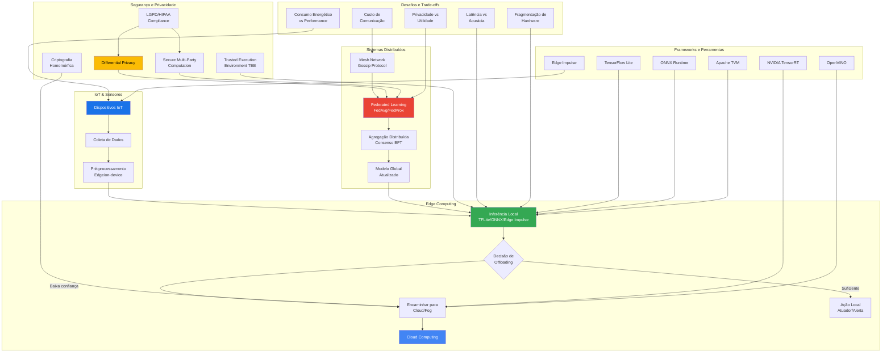

# Computação Distribuída Avançada e Edge AI

## 1. Introdução Teórica Aprofundada

### 1.1 Fundamentos de Edge Computing

Edge computing é um paradigma de computação distribuída que aproxima o processamento e armazenamento de dados do ponto onde são gerados, em vez de depender de um data center centralizado. Em contraste com a computação em nuvem tradicional, onde dados trafegam por longas distâncias até servidores remotos, o edge computing processa dados localmente — no "limite" (edge) da rede. Isso reduz drasticamente a latência, minimiza o uso de banda, melhora a privacidade e viabiliza aplicações em tempo real.

A arquitetura edge organiza-se em camadas hierárquicas:

- **Device Layer (Camada de Dispositivos)**: Sensores, atuadores, câmeras, smartphones e dispositivos IoT. Possuem recursos computacionais limitados (CPU, memória, bateria).
- **Edge Node Layer (Camada de Nós de Borda)**: Gateways, roteadores, servidores edge e dispositivos intermediários que agregam e processam dados localmente. Ex: NVIDIA Jetson, Google Coral, Raspberry Pi.
- **Fog Layer (Camada Fog)**: Camada intermediária que conecta edge à nuvem, oferecendo recursos de orquestração, caching e processamento agregado.
- **Cloud Layer (Camada de Nuvem)**: Data centers centralizados com recursos massivos para treinamento de modelos, armazenamento de longo prazo e análises complexas.

### 1.2 Arquiteturas de Edge Computing

- **Mobile Edge Computing (MEC)**: Padronizado pelo ETSI, implanta servidores edge em estações base de telecomunicações (5G). Oferece latência <10ms para aplicações móveis.
- **Cloudlet**: Nós de borda virtualizados que estendem a nuvem para próximo do usuário, suportando migração de máquinas virtuais.
- **Fog Computing**: Arquitetura descentralizada que distribui recursos computacionais entre dispositivos e nuvem, com foco em orquestração e gerenciamento de recursos heterogêneos.
- **Multi-access Edge Computing (MEC)**: Evolução do MEC que suporta múltiplas tecnologias de acesso (Wi-Fi, 5G, LTE, fibras).
- **Serverless Edge**: Funções executadas em nós edge com escalonamento automático, sem gerenciamento explícito de servidores (ex: AWS IoT Greengrass Lambda).

### 1.3 Federated Learning (Aprendizado Federado)

Proposto por McMahan et al. (2017), federated learning é um paradigma de ML distribuído onde o modelo é treinado colaborativamente entre múltiplos clientes (dispositivos edge) sem que os dados brutos saiam dos dispositivos. Apenas os gradientes ou pesos do modelo são compartilhados com um servidor central.

O ciclo do federated learning:

1. **Inicialização**: Servidor central distribui o modelo global para os clientes.
2. **Treinamento local**: Cada cliente treina o modelo com seus dados locais (geralmente por algumas épocas).
3. **Agregação**: Clientes enviam atualizações de pesos para o servidor (nunca os dados brutos).
4. **FedAvg (Federated Averaging)**: Servidor calcula a média ponderada dos pesos dos clientes e atualiza o modelo global.
5. **Iteração**: Novo ciclo se repete até convergência.

Variações importantes:

- **Federated Learning Horizontal (HFL)**: Dados têm mesmas features, diferentes amostras. Cenário mais comum.
- **Federated Learning Vertical (VFL)**: Dados têm mesmas amostras, diferentes features. Ex: hospitais com dados complementares sobre os mesmos pacientes.
- **Federated Transfer Learning (FTL)**: Combina transfer learning com federated learning para cenários com sobreposição parcial.
- **Federated Learning Assíncrono**: Clientes enviam atualizações em tempos distintos, sem sincronização global — útil para edge com conectividade variável.

Desafios:

- **Heterogeneidade dos dados (Non-IID)**: Dados em dispositivos edge não são independentes nem identicamente distribuídos.
- **Heterogeneidade de sistemas**: Dispositivos com capacidades computacionais, bateria e conectividade distintas.
- **Comunicação eficiente**: Milhares de dispositivos enviando atualizações simultaneamente.
- **Privacidade diferencial**: Mesmo os gradientes podem vazar informações; técnicas de DP (differential privacy) são necessárias.
- **Ataques adversarial**: Injeção de gradientes maliciosos para comprometer o modelo global.

### 1.4 IA Embarcada e TinyML

TinyML define a execução de modelos de machine learning em dispositivos com ultra-baixo consumo energético (mW), memória limitada (KB) e processadores simples (microcontroladores). Permite que sensores, wearables e dispositivos IoT realizem inferência local sem enviar dados para a nuvem.

Princípios do TinyML:

- **Modelos compactos**: Redes neurais quantizadas (int8), pruning, knowledge distillation.
- **Inferência na borda**: Sem dependência de conectividade.
- **Eficiência energética**: Operação contínua por meses ou anos com bateria.
- **Latência determinística**: Respostas em milissegundos.

Técnicas de otimização:

- **Quantização**: Redução de precisão dos pesos (float32 -> int8). Pode reduzir o tamanho do modelo em 4x com perda mínima de acurácia.
- **Podagem (Pruning)**: Remoção de conexões/neurônios com pesos próximos de zero.
- **Destilação (Knowledge Distillation)**: Treina um modelo "professor" grande e um modelo "aluno" pequeno para imitar suas saídas.
- **Decomposição de matrizes (SVD, Tucker)**: Fatoração de camadas totalmente conectadas para reduzir parâmetros.
- **Arquiteturas NAS (Neural Architecture Search)**: Busca automatizada por arquiteturas eficientes para edge (ex: MobileNet, EfficientNet-Lite).

### 1.5 Mesh Networks para ML Distribuído

Redes mesh (malha) são topologias descentralizadas onde cada nó se conecta diretamente a múltiplos vizinhos, formando uma rede auto-organizável e resiliente. Quando aplicadas a ML distribuído:

- **Peer-to-peer learning**: Nós compartilham atualizações de modelo diretamente entre si, sem servidor central.
- **Gossip Learning**: Algoritmos epidêmicos propagam parâmetros do modelo pela rede mesh.
- **Consenso distribuído**: Protocolos como Byzantine Fault Tolerance (BFT) garantem que o modelo global convirja mesmo com nós maliciosos ou falhos.
- **Topologia dinâmica**: Nós podem entrar/sair da rede — algoritmos devem ser resilientes a churn.
- **Elasticidade**: Escalonamento automático do número de nós participantes conforme demanda.

Protocolos de comunicação para mesh + ML:

- **MQTT**: Protocolo publish/subscribe leve, ideal para IoT e edge.
- **gRPC**: Chamadas de procedimento remoto com alta performance, suporta streaming de tensores.
- **WebRTC**: Comunicação peer-to-peer em tempo real, útil para gossip learning.
- **LoRaWAN / BLE Mesh**: Comunicação de longo alcance/baixa energia para redes de sensores.

### 1.6 Sistemas Elásticos para Edge AI

Elasticidade em edge computing refere-se à capacidade de provisionar e desprovisionar recursos computacionais dinamicamente em resposta à demanda variável. Diferente da nuvem (recursos virtualmente infinitos), o edge tem restrições físicas:

- **Elasticidade vertical**: Aumentar/reduzir recursos de um nó edge (CPU, memória, GPU).
- **Elasticidade horizontal**: Adicionar/remover nós edge da malha.
- **Offloading seletivo**: Decidir quais camadas da inferência executar localmente vs. na nuvem (edge-cloud split).
- **Model cascade**: Executar modelo leve primeiro (edge), e se confiança baixa, encaminhar para modelo pesado (nuvem).

### 1.7 Privacy-Preserving ML no Edge

Técnicas para proteger dados e modelos em cenários edge:

- **Differential Privacy (DP)**: Adiciona ruído calibrado aos gradientes ou pesos durante o treinamento. Garante que a contribuição individual de um usuário não possa ser inferida.
- **Secure Multi-Party Computation (SMPC)**: Múltiplas partes computam uma função sobre seus dados privados sem revelá-los uns aos outros.
- **Homomorphic Encryption (HE)**: Permite computação diretamente sobre dados criptografados. Pesado computacionalmente — pesquisa ativa para edge.
- **Trusted Execution Environments (TEE)**: Áreas seguras da CPU (Intel SGX, ARM TrustZone) que isolam código e dados durante a execução.
- **Split Learning**: Divide a rede neural entre cliente e servidor; o cliente executa camadas iniciais e envia representações intermediárias (não dados brutos).

### 1.8 Frameworks e Ferramentas

- **TensorFlow Lite**: Framework do Google para inferência em dispositivos móveis e embarcados. Suporta aceleração por GPU, NNAPI e Cortex-M.
- **TensorFlow Federated (TFF)**: Framework para experimentação com aprendizado federado, com simuladores e agregação.
- **PyTorch Mobile**: Versão mobile do PyTorch, com suporte a quantização e delegates customizados.
- **ONNX Runtime**: Runtime cross-platform para modelos no formato ONNX, com aceleração em CPU, GPU e NPU.
- **Edge Impulse**: Plataforma para desenvolvimento de ML em dispositivos embarcados (Arduino, STM32, ESP32), com pipeline completo de coleta, treinamento e deploy.
- **NVIDIA TensorRT**: Otimizador de inferência para GPUs NVIDIA, suporta INT8/FP16, fusão de camadas e kernel auto-tuning.
- **Apache TVM**: Compilador de deep learning que otimiza modelos para diversos hardwares (CPU, GPU, FPGA, NPU).
- **OpenVINO**: Toolkit Intel para otimização e deploy de modelos em hardware Intel (CPU, GPU, VPU, FPGA).
- **Core ML**: Framework da Apple para inferência em dispositivos Apple (Neural Engine, GPU, CPU).

---

## 2. Bibliografia e Papers Comentados

### 2.1 "Edge Intelligence: From Distributed Machine Learning to Federated Learning"

**Autores**: Hu et al.
**Ano**: 2020 (arXiv), publicado em IEEE TPAMI em 2022.
**Link**: https://arxiv.org/abs/2301.10080

Este survey abrangente apresenta uma taxonomia unificada de edge intelligence, categorizando abordagens em três níveis:
- **Inferência no edge**: Execução local de modelos pré-treinados.
- **Treinamento distribuído no edge**: Aprendizado colaborativo entre dispositivos.
- **Lifecycle completo**: Treinamento + implantação + atualização contínua.

**Contribuições principais**: Definição de métricas específicas para edge AI (latência, consumo energético, privacidade, comunicação), análise de trade-offs e direções futuras. Leitura obrigatória para quem deseja entender o estado-da-arte.

**Comentário crítico**: Os autores focam em arquiteturas de sistema, mas subestimam a heterogeneidade de hardware real. A transposição para cenários de produção (com dispositivos reais, conectividade variável e bateria limitada) ainda é desafiadora.

### 2.2 "Communication-Efficient Learning of Deep Networks from Decentralized Data"

**Autores**: McMahan, B., Moore, E., Ramage, D., Hampson, S., y Arcas, B.A.
**Ano**: 2017 (AISTATS)
**Link**: https://arxiv.org/abs/1602.05629

**Contribuição seminal**: Introduz o algoritmo Federated Averaging (FedAvg), que fundamenta o aprendizado federado moderno. Demonstra que é possível treinar modelos de alta qualidade sem centralizar dados, usando apenas atualizações locais.

**Metodologia**: Experimentos com LSTM e CNNs em datasets CIFAR-10 e Shakespeare. FedAvg mostrou convergência rápida (~10-100 rounds) mesmo com dados non-IID.

**Comentário crítico**: Trabalho pioneiro, mas assume comunicação síncrona e clientes sempre disponíveis — premissas que raramente se sustentam em cenários edge reais. Extensões posteriores (FedProx, FedAsync, FedNova) tratam essas limitações.

### 2.3 "TinyML: Machine Learning with TensorFlow Lite on Arduino and Ultra-Low-Power Microcontrollers"

**Autores**: Warden, P., Situnayake, D.
**Ano**: 2020 (O'Reilly Media)
**Link**: https://tinymlbook.com/

**Contribuição**: O "guia definitivo" para ML em microcontroladores. Cobre desde o ambiente de desenvolvimento até técnicas avançadas como quantização e deploy em hardware real (Cortex-M, ESP32, Arduino Nano).

**Comentário crítico**: Livro prático e acessível, com exemplos funcionais. Porém, concentra-se exclusivamente em TensorFlow Lite — pouco espaço para alternativas (ONNX Runtime, Edge Impulse). A segunda edição (2023) expande cobertura.

### 2.4 "TensorFlow Lite Micro: Embedded Machine Learning on TinyML Systems"

**Autores**: David, R., et al. (Google).
**Ano**: 2021 (Proceedings of Machine Learning and Systems)
**Link**: https://arxiv.org/abs/2010.08678

**Contribuição**: Descreve arquitetura do TFLite Micro, o interpretador de ML para sistemas com apenas alguns KB de RAM (16KB). Otimizações: operadores específicos por plataforma, arena de memória pré-alocada, delegados para aceleração.

**Comentário crítico**: Prova que ML em 16KB de RAM é viável. Limitação: cobertura limitada de operadores — não suporta transformers ou modelos com operações customizadas.

### 2.5 "Edge AI Benchmarks: Performance Analysis of Edge Devices for AI Inference"

**Autores**: Hadidi, R., et al.
**Ano**: 2021 (MLSys Workshop)
**Link**: https://edgeaibenchmarks.github.io/

**Contribuição**: Benchmark sistemático de dispositivos edge (Jetson Nano, Raspberry Pi, Google Coral, Intel NCS2, Apple A13) para inferência. Mede throughput, latência, consumo energético e custo por inferência.

**Resultados principais**:
- Google Coral (TPU): melhor eficiência energética.
- Jetson Nano: melhor relação custo-desempenho.
- Raspberry Pi 4: viável para modelos pequenos (MobileNet), inviável para ResNet-50.

**Comentário crítico**: Os benchmarks consideram apenas modelos vision (CNNs). Há lacuna significativa para modelos de linguagem e séries temporais no edge.

### 2.6 "FedProx: Federated Learning in Heterogeneous Networks"

**Autores**: Sahu, A., et al.
**Ano**: 2020 (MLSys)
**Link**: https://arxiv.org/abs/1812.06127

**Contribuição**: Abordagem para lidar com heterogeneidade de sistemas no federated learning. FedProx modifica a função objetivo com um termo de proximidade (L2 regularization) que evita que clientes com dados non-IID se afastem demasiadamente do modelo global.

**Comentário crítico**: Solução elegante para um problema real. Porém, requer ajuste cuidadoso do hiperparâmetro mu. Variações adaptativas (FedAdapt) propõem tuning automático.

### 2.7 "Split Learning for Collaborative Deep Learning in Healthcare"

**Autores**: Gupta, O., Raskar, R., et al.
**Ano**: 2018 (arXiv)
**Link**: https://arxiv.org/abs/1812.00564

**Contribuição**: Introduz split learning como alternativa ao federated learning para privacidade em saúde. O modelo é dividido: metade no cliente, metade no servidor. O servidor nunca vê dados brutos, apenas representações intermediárias ("smashed data").

**Comentário crítico**: Vantagem: servidor não vê dados brutos. Desvantagem: ainda requer comunicação em cada forward pass, diferente do FL que comunica apenas após épocas.

### 2.8 "On-Device Machine Learning: An Algorithms and Learning Theory Perspective"

**Autores**: Anonymized (survey abrangente).
**Ano**: 2023 (ACM Computing Surveys)
**Link**: https://dl.acm.org/doi/10.1145/3580345

**Contribuição**: Survey teórico sobre algoritmos para ML em dispositivos, cobrindo compressão de modelos, aprendizado federado, quantização, e teoria de generalização.

**Destaque**: Seção sobre "personalization" — técnicas para adaptar modelos globais a distribuições locais (Fine-tuning, Meta-learning, Multi-task learning).

### 2.9 "Green Edge AI: Energy-Efficient Machine Learning at the Edge"

**Autores**: Merenda, M., Porcaro, C., Iero, D.
**Ano**: 2020 (IEEE Access)
**Link**: https://doi.org/10.1109/ACCESS.2020.3022312

**Contribuição**: Análise do consumo energético de inferência em dispositivos edge. Propõe métrica "energy-accuracy trade-off" que combina acurácia e consumo (mJ por inferência).

**Resultados**: Modelos quantizados (INT8) consomem 3-4x menos energia que FP32 com apenas 1-2% de perda de acurácia. A escolha do hardware é mais relevante que a escolha do modelo.

### 2.10 "A Survey of Adversarial Machine Learning in Edge Computing"

**Autores**: Qu, Y., et al.
**Ano**: 2022 (IEEE Communications Surveys & Tutorials)
**Link**: https://doi.org/10.1109/COMST.2022.3182662

**Contribuição**: Mapeia ameaças adversarial específicas para edge AI: envenenamento de dados, ataques de gradiente, evasão adversarial em tempo real, e ataques físicos (perturbação de sensores).

**Comentário crítico**: Ataques adversarial no edge são mais perigosos que na nuvem: dispositivos desprotegidos, atualizações infrequentes, contato físico com atacantes. Defesas leves ainda são tópico de pesquisa aberto.

---

## 3. Exemplo Prático Completo com Código Python

### 3.1 Implementação de Federated Learning com TensorFlow Federated

```python
# federated_learning_sim.py
# Simulação de Federated Learning para classificação de dígitos (MNIST)
# usando TensorFlow Federated (TFF)

import tensorflow as tf
import tensorflow_federated as tff
import numpy as np
import matplotlib.pyplot as plt
from typing import List, Tuple

# Desabilitar warnings do TFF (experimental)
tf.compat.v1.logging.set_verbosity(tf.compat.v1.logging.ERROR)

# ============================================================
# 1. Preparação dos dados
# ============================================================

def preprocess_dataset(dataset):
    """Normaliza e embaralha o dataset MNIST."""
    def batch_format(element):
        return (
            tf.reshape(element['pixels'], [-1, 28, 28, 1]),
            tf.reshape(element['label'], [-1, 1])
        )
    return dataset.map(batch_format).batch(32).prefetch(1)

# Carregar MNIST via TFF
emnist_train, emnist_test = tff.simulation.datasets.emnist.load_data()

# Simular 10 clientes com distribuição non-IID
def create_non_iid_partition(client_ids: List[str], 
                              num_clients: int = 10) -> dict:
    """Cria partições non-IID: cada cliente recebe 2 dígitos específicos."""
    partitions = {}
    digits_per_client = [
        (0, 1), (2, 3), (4, 5), (6, 7), (8, 9),
        (0, 2), (1, 3), (4, 6), (5, 7), (8, 9)
    ]
    for i, cid in enumerate(client_ids[:num_clients]):
        d1, d2 = digits_per_client[i]
        def filter_digits(d1=d1, d2=d2):
            def _filter(element):
                label = element['label']
                return tf.logical_or(tf.equal(label, d1), tf.equal(label, d2))
            return _filter
        client_data = emnist_train.create_tf_dataset_for_client(cid)
        client_data = client_data.filter(filter_digits())
        partitions[cid] = preprocess_dataset(client_data)
    return partitions

# Selecionar 10 clientes
sample_clients = list(emnist_train.client_ids)[:10]
client_datasets = create_non_iid_partition(sample_clients)

print(f"Clientes selecionados: {sample_clients}")
for cid, ds in client_datasets.items():
    count = sum(1 for _ in ds)
    print(f"  Cliente {cid}: {count} batches")

# ============================================================
# 2. Definição do modelo
# ============================================================

def create_keras_model() -> tf.keras.Model:
    """Modelo CNN simples para MNIST (compatível com TFF)."""
    model = tf.keras.models.Sequential([
        tf.keras.layers.Input(shape=(28, 28, 1)),
        tf.keras.layers.Conv2D(32, (3, 3), activation='relu'),
        tf.keras.layers.MaxPooling2D((2, 2)),
        tf.keras.layers.Conv2D(64, (3, 3), activation='relu'),
        tf.keras.layers.MaxPooling2D((2, 2)),
        tf.keras.layers.Flatten(),
        tf.keras.layers.Dropout(0.5),
        tf.keras.layers.Dense(64, activation='relu'),
        tf.keras.layers.Dense(10, activation='softmax')
    ])
    return model

def model_fn():
    """Função modelo para TFF"""
    model = create_keras_model()
    return tff.learning.from_keras_model(
        model,
        input_spec=client_datasets[sample_clients[0]].element_spec,
        loss=tf.keras.losses.SparseCategoricalCrossentropy(),
        metrics=[tf.keras.metrics.SparseCategoricalAccuracy()]
    )

# ============================================================
# 3. Configuração do Federated Learning
# ============================================================

# Processo de treinamento federado
trainer = tff.learning.algorithms.build_weighted_fed_avg(
    model_fn,
    client_optimizer_fn=lambda: tf.keras.optimizers.Adam(learning_rate=0.01),
    server_optimizer_fn=lambda: tf.keras.optimizers.Adam(learning_rate=1.0)
)

# Inicializar
state = trainer.initialize()

# Preparar lista de datasets para cada round
def client_datasets_list(round_num):
    """Retorna datasets dos clientes, simulando disponibilidade variável."""
    available = sample_clients[:max(5, min(10, 5 + round_num % 6))]
    return [client_datasets[cid] for cid in available]

# ============================================================
# 4. Loop de treinamento federado
# ============================================================

NUM_ROUNDS = 30
history = {'round': [], 'loss': [], 'accuracy': []}

print("\n=== TREINAMENTO FEDERADO ===")
print(f"Round | Loss    | Acurácia | Clientes")
print("-" * 45)

for round_num in range(1, NUM_ROUNDS + 1):
    datasets = client_datasets_list(round_num)
    result = trainer.next(state, datasets)
    state = result.state
    metrics = result.metrics['client_work']['train']
    
    loss = metrics['loss'].numpy()
    acc = metrics['sparse_categorical_accuracy'].numpy()
    n_clients = len(datasets)
    
    history['round'].append(round_num)
    history['loss'].append(loss)
    history['accuracy'].append(acc)
    
    print(f"  {round_num:3d}  | {loss:.4f} | {acc:.4f}  | {n_clients}")

# ============================================================
# 5. Avaliação final no modelo global
# ============================================================

print("\n=== AVALIAÇÃO FINAL ===")

# Criar dataset de teste EMNIST
test_dataset = preprocess_dataset(emnist_test.create_tf_dataset_from_all_clients())

# Criar modelo Keras com os pesos treinados
final_model = create_keras_model()
final_weights = state.model[0] if isinstance(state.model, tuple) else state.model
tff.learning.assign_weights_to_keras_model(final_model, state.model)

# Avaliar
loss, acc = final_model.evaluate(test_dataset, verbose=1)
print(f"\nResultado final no dataset de teste:")
print(f"  Loss: {loss:.4f}")
print(f"  Acurácia: {acc:.4f}")

# ============================================================
# 6. Visualização
# ============================================================

plt.figure(figsize=(12, 4))
plt.subplot(1, 2, 1)
plt.plot(history['round'], history['loss'], 'b-o')
plt.xlabel('Round')
plt.ylabel('Loss')
plt.grid(True)

plt.subplot(1, 2, 2)
plt.plot(history['round'], history['accuracy'], 'g-o')
plt.xlabel('Round')
plt.ylabel('Acurácia')
plt.grid(True)

plt.tight_layout()
plt.savefig('federated_learning_results.png', dpi=150)
plt.show()

print("\nGráfico salvo como 'federated_learning_results.png'")
```

### 3.2 Conversão de Modelo para TensorFlow Lite

```python
# convert_to_tflite.py
# Converte modelo treinado para TensorFlow Lite e mede performance

import tensorflow as tf
import numpy as np
import time

def convert_to_tflite(keras_model, 
                      quantize: bool = False,
                      representative_dataset=None):
    """
    Converte modelo Keras para TensorFlow Lite.
    
    Args:
        keras_model: Modelo Keras treinado
        quantize: Se True, aplica quantização INT8 (pós-treino)
        representative_dataset: Dataset para calibragem da quantização
    
    Returns:
        bytes do modelo TFLite
    """
    converter = tf.lite.TFLiteConverter.from_keras_model(keras_model)
    
    if quantize:
        converter.optimizations = [tf.lite.Optimize.DEFAULT]
        converter.target_spec.supported_types = [tf.float16]
        
        if representative_dataset is not None:
            # Quantização INT8 com calibragem
            converter.representative_dataset = representative_dataset
            converter.target_spec.supported_types = []
            converter.target_spec.supported_ops = [
                tf.lite.OpsSet.TFLITE_BUILTINS_INT8
            ]
            converter.inference_input_type = tf.int8
            converter.inference_output_type = tf.int8
    
    return converter.convert()

# Carregar modelo treinado (do passo anterior)
def create_keras_model() -> tf.keras.Model:
    model = tf.keras.models.Sequential([
        tf.keras.layers.Input(shape=(28, 28, 1)),
        tf.keras.layers.Conv2D(32, (3, 3), activation='relu'),
        tf.keras.layers.MaxPooling2D((2, 2)),
        tf.keras.layers.Conv2D(64, (3, 3), activation='relu'),
        tf.keras.layers.MaxPooling2D((2, 2)),
        tf.keras.layers.Flatten(),
        tf.keras.layers.Dropout(0.5),
        tf.keras.layers.Dense(64, activation='relu'),
        tf.keras.layers.Dense(10, activation='softmax')
    ])
    return model

model = create_keras_model()
model.load_weights('model_weights.h5')

# Gerar dataset representativo
def representative_dataset():
    """Calibragem com 100 amostras do MNIST."""
    (x_train, _), _ = tf.keras.datasets.mnist.load_data()
    x_train = x_train.astype(np.float32).reshape(-1, 28, 28, 1) / 255.0
    for i in range(100):
        yield [x_train[i:i+1]]

# Converter modelos
print("Convertendo modelo float32...")
tflite_float = convert_to_tflite(model, quantize=False)
print(f"  Tamanho (float32): {len(tflite_float) / 1024:.2f} KB")

print("Convertendo modelo float16...")
tflite_float16 = convert_to_tflite(model, quantize=True)
print(f"  Tamanho (float16): {len(tflite_float16) / 1024:.2f} KB")

print("Convertendo modelo INT8...")
tflite_int8 = convert_to_tflite(
    model, quantize=True, 
    representative_dataset=representative_dataset
)
print(f"  Tamanho (INT8): {len(tflite_int8) / 1024:.2f} KB")

# Salvar modelos
with open('model_float32.tflite', 'wb') as f:
    f.write(tflite_float)
with open('model_float16.tflite', 'wb') as f:
    f.write(tflite_float16)
with open('model_int8.tflite', 'wb') as f:
    f.write(tflite_int8)

print("\nModelos TFLite salvos!")

# ============================================================
# Benchmark de inferência
# ============================================================

def benchmark_tflite(tflite_model: bytes, x_test: np.ndarray, 
                     n_warmup: int = 10, n_bench: int = 100):
    """Executa benchmark de inferência TFLite."""
    interpreter = tf.lite.Interpreter(model_content=tflite_model)
    interpreter.allocate_tensors()
    
    input_details = interpreter.get_input_details()
    output_details = interpreter.get_output_details()
    
    # Verificar tipo de entrada esperado
    input_dtype = input_details[0]['dtype']
    if input_dtype == np.int8:
        # Para modelo INT8, precisa escalar a entrada
        scale, zero_point = input_details[0]['quantization']
        x_quantized = (x_test / scale + zero_point).astype(np.int8)
        input_data = x_quantized
    else:
        input_data = x_test.astype(np.float32)
    
    # Warmup
    for _ in range(n_warmup):
        interpreter.set_tensor(input_details[0]['index'], input_data)
        interpreter.invoke()
        _ = interpreter.get_tensor(output_details[0]['index'])
    
    # Benchmark
    times = []
    for _ in range(n_bench):
        start = time.perf_counter()
        interpreter.set_tensor(input_details[0]['index'], input_data)
        interpreter.invoke()
        _ = interpreter.get_tensor(output_details[0]['index'])
        elapsed = time.perf_counter() - start
        times.append(elapsed * 1000)  # ms
    
    return {
        'mean_ms': np.mean(times),
        'std_ms': np.std(times),
        'min_ms': np.min(times),
        'max_ms': np.max(times),
        'fps': 1000 / np.mean(times)
    }

# Preparar dados de teste
(x_test, y_test), _ = tf.keras.datasets.mnist.load_data()
x_test = x_test.astype(np.float32).reshape(-1, 28, 28, 1) / 255.0

# Executar benchmark
for name, model_bytes in [("float32", tflite_float), 
                           ("float16", tflite_float16),
                           ("int8", tflite_int8)]:
    print(f"\nBenchmark {name}:")
    results = benchmark_tflite(model_bytes, x_test[:1])
    print(f"  Latência média: {results['mean_ms']:.3f} ms")
    print(f"  Desvio padrão:  {results['std_ms']:.3f} ms")
    print(f"  FPS estimado:   {results['fps']:.1f}")
```

### 3.3 Sistema de Inferência em Edge (Simulado)

```python
# edge_inference_system.py
# Simulação de sistema de inferência distribuída em edge

import random
import threading
import time
import numpy as np
from dataclasses import dataclass
from typing import Optional, Callable, List
from enum import Enum
import queue

# ============================================================
# Simulação de dispositivo edge
# ============================================================

class DeviceType(Enum):
    SENSOR = "sensor"
    GATEWAY = "gateway"
    EDGE_SERVER = "edge_server"
    CLOUD = "cloud"

@dataclass
class EdgeDevice:
    id: str
    device_type: DeviceType
    cpu_score: float  # 0.0 - 1.0 (normalizado)
    ram_mb: int
    battery: float   # 0.0 - 1.0
    latency_ms: float  # latência de rede simulada
    connected: bool = True
    current_task: Optional[str] = None
    
    def compute_power(self) -> float:
        """Poder computacional relativo."""
        return self.cpu_score * (self.ram_mb / 1024) * (0.3 + 0.7 * self.battery)

class EdgeNetwork:
    """Rede de dispositivos edge com topologia configurável."""
    
    def __init__(self):
        self.devices: List[EdgeDevice] = []
        self.mesh_topology: dict = {}  # device_id -> list of neighbor ids
        self.task_queue = queue.Queue()
        self.results = {}
        self._lock = threading.Lock()
    
    def add_device(self, device: EdgeDevice):
        self.devices.append(device)
        self.mesh_topology[device.id] = []
    
    def connect_mesh(self, density: float = 0.3):
        """Conecta dispositivos em topologia mesh."""
        for i, d1 in enumerate(self.devices):
            for j, d2 in enumerate(self.devices):
                if i != j and random.random() < density:
                    self.mesh_topology[d1.id].append(d2.id)
        # Garantir simetria
        for dev in self.devices:
            for neighbor in self.mesh_topology[dev.id]:
                if dev.id not in self.mesh_topology.get(neighbor, []):
                    self.mesh_topology.setdefault(neighbor, []).append(dev.id)
    
    def find_route(self, source: str, target: str, 
                   max_hops: int = 3) -> Optional[List[str]]:
        """Encontra rota mesh entre dois dispositivos (BFS simples)."""
        visited = set()
        queue_bfs = [[source]]
        
        while queue_bfs:
            path = queue_bfs.pop(0)
            node = path[-1]
            
            if node == target:
                return path
            
            if node not in visited and len(path) <= max_hops:
                visited.add(node)
                for neighbor in self.mesh_topology.get(node, []):
                    new_path = list(path)
                    new_path.append(neighbor)
                    queue_bfs.append(new_path)
        
        return None  # Rota não encontrada
    
    def offload_task(self, source: str, model_size_mb: float) -> dict:
        """Simula offloading de inferência para melhor nó edge disponível."""
        source_device = next(d for d in self.devices if d.id == source)
        
        candidates = []
        for device in self.devices:
            if device.id == source or not device.connected:
                continue
            
            route = self.find_route(source, device.id)
            if route is None:
                continue
            
            # Custo = latência + (1 - poder computacional)
            compute_score = device.compute_power()
            route_latency = sum(
                next(d.latency_ms for d in self.devices if d.id == n)
                for n in route
            )
            
            cost = route_latency * (1 + model_size_mb / 10) + (1 - compute_score) * 100
            candidates.append((cost, device, route))
        
        if not candidates:
            return {"status": "local", "device": source}
        
        # Melhor candidato
        candidates.sort(key=lambda x: x[0])
        _, best_device, route = candidates[0]
        
        return {
            "status": "offloaded",
            "source": source,
            "target": best_device.id,
            "route": route,
            "latency_estimate_ms": candidates[0][0],
            "device_compute": best_device.compute_power()
        }

    def simulate_inference(self, model: str = "MobileNetV2",
                           n_requests: int = 50,
                           arrival_rate: float = 2.0):
        """Simula inferências na rede edge."""
        print(f"=== Simulação de Inferência Edge: {model} ===")
        print(f"Dispositivos: {len(self.devices)}")
        print(f"Requisições: {n_requests}")
        print(f"Taxa de chegada: {arrival_rate}/s\n")
        
        results = []
        for i in range(n_requests):
            time.sleep(random.expovariate(arrival_rate))
            
            source = random.choice(self.devices).id
            model_size = random.uniform(1, 20)
            
            decision = self.offload_task(source, model_size)
            
            # Simular tempo de inferência
            if decision["status"] == "local":
                inference_time = random.gauss(50, 20)  # ms
            else:
                inference_time = random.gauss(20, 10)
            
            results.append({
                "request": i + 1,
                "source": source,
                **decision,
                "inference_time_ms": inference_time
            })
        
        self.results[model] = results
        
        # Estatísticas
        offloaded = sum(1 for r in results if r["status"] == "offloaded")
        local = sum(1 for r in results if r["status"] == "local")
        avg_latency = np.mean([r["inference_time_ms"] for r in results])
        
        print(f"Resultados da simulação:")
        print(f"  Offloaded: {offloaded}/{n_requests} ({offloaded/n_requests*100:.1f}%)")
        print(f"  Local:     {local}/{n_requests} ({local/n_requests*100:.1f}%)")
        print(f"  Latência média: {avg_latency:.2f} ms")
        
        return results

# ============================================================
# Sistema completo de exemplo
# ============================================================

def criar_rede_exemplo() -> EdgeNetwork:
    """Cria rede edge simulando cenário industrial."""
    net = EdgeNetwork()
    
    # Sensores IoT (10 dispositivos)
    for i in range(10):
        net.add_device(EdgeDevice(
            id=f"sensor-{i:03d}",
            device_type=DeviceType.SENSOR,
            cpu_score=random.uniform(0.1, 0.3),
            ram_mb=random.randint(64, 256),
            battery=random.uniform(0.3, 1.0),
            latency_ms=random.uniform(1, 5)
        ))
    
    # Gateways (3)
    for i in range(3):
        net.add_device(EdgeDevice(
            id=f"gateway-{i:03d}",
            device_type=DeviceType.GATEWAY,
            cpu_score=random.uniform(0.4, 0.7),
            ram_mb=random.randint(512, 2048),
            battery=random.uniform(0.8, 1.0),
            latency_ms=random.uniform(10, 30)
        ))
    
    # Edge servers (2 - ex: Jetson, Coral)
    for i in range(2):
        net.add_device(EdgeDevice(
            id=f"edge-server-{i:03d}",
            device_type=DeviceType.EDGE_SERVER,
            cpu_score=random.uniform(0.7, 1.0),
            ram_mb=random.randint(4096, 16384),
            battery=1.0,  # plugged in
            latency_ms=random.uniform(20, 50)
        ))
    
    net.connect_mesh(density=0.4)
    return net

if __name__ == "__main__":
    net = criar_rede_exemplo()
    print("Rede criada:")
    for d in net.devices:
        neighbors = len(net.mesh_topology[d.id])
        print(f"  {d.id:20s} | {d.device_type.value:12s} | "
              f"CPU: {d.cpu_score:.2f} | RAM: {d.ram_mb:5d}MB | "
              f"Vizinhos: {neighbors}")
    
    print()
    results = net.simulate_inference("MobileNetV2", n_requests=30, arrival_rate=3.0)
```

### 3.4 Simulação de Mesh Network para ML Distribuído

```python
# mesh_distributed_ml.py
# Simulação de gossip learning em rede mesh

import numpy as np
import random
from dataclasses import dataclass, field
from typing import List, Dict, Tuple
import matplotlib.pyplot as plt
from collections import defaultdict

@dataclass
class MeshNode:
    id: int
    model_weights: np.ndarray
    model_accuracy: float = 0.0
    neighbors: List[int] = field(default_factory=list)
    data_size: int = 100  # amostras locais
    is_byzantine: bool = False
    
    def gossip_step(self, all_nodes: Dict[int, 'MeshNode'], alpha: float = 0.5):
        """
        Passo de gossip learning: média ponderada dos modelos vizinhos.
        """
        if not self.neighbors:
            return
        
        # Coletar pesos dos vizinhos
        neighbor_weights = []
        neighbor_sizes = []
        
        for nid in self.neighbors:
            if nid in all_nodes:
                neighbor = all_nodes[nid]
                # Se vizinho é bizantino, retorna ruído (simulação de ataque)
                if neighbor.is_byzantine:
                    corrupted = self.model_weights + np.random.normal(0, 0.5, 
                                                                     self.model_weights.shape)
                    neighbor_weights.append(corrupted)
                else:
                    neighbor_weights.append(neighbor.model_weights)
                neighbor_sizes.append(neighbor.data_size)
        
        if not neighbor_weights:
            return
        
        # FedAvg local: média ponderada
        weights = np.array(neighbor_weights)
        sizes = np.array(neighbor_sizes)
        avg_neighbor = np.average(weights, axis=0, weights=sizes)
        
        # Atualizar modelo: interpolação entre próprio modelo e média dos vizinhos
        self.model_weights = (1 - alpha) * self.model_weights + alpha * avg_neighbor

class MeshNetwork:
    """Rede mesh descentralizada para aprendizado gossip."""
    
    def __init__(self, n_nodes: int, feature_dim: int, 
                 connectivity: float = 0.2):
        self.nodes = {}
        self.feature_dim = feature_dim
        self.history = defaultdict(list)
        
        # Criar nós
        for i in range(n_nodes):
            weights = np.random.randn(feature_dim) * 0.01
            self.nodes[i] = MeshNode(
                id=i,
                model_weights=weights,
                data_size=random.randint(50, 200)
            )
        
        # Conectar em topologia mesh aleatória
        self._build_mesh(connectivity)
    
    def _build_mesh(self, connectivity: float):
        """Cria topologia mesh aleatória."""
        for i in range(len(self.nodes)):
            for j in range(i + 1, len(self.nodes)):
                if random.random() < connectivity:
                    self.nodes[i].neighbors.append(j)
                    self.nodes[j].neighbors.append(i)
        
        # Garantir que o grafo é conexo
        visited = set()
        stack = [0]
        while stack:
            node = stack.pop()
            if node not in visited:
                visited.add(node)
                for neighbor in self.nodes[node].neighbors:
                    if neighbor not in visited:
                        stack.append(neighbor)
        
        # Se não for conexo, conectar nós isolados
        for i in range(len(self.nodes)):
            if i not in visited and len(self.nodes) > 1:
                j = random.randint(0, len(self.nodes) - 1)
                if j != i:
                    self.nodes[i].neighbors.append(j)
                    self.nodes[j].neighbors.append(i)
                    visited.add(i)
    
    def gossip_round(self, alpha: float = 0.5, sync: bool = True):
        """
        Executa uma rodada de gossip learning.
        
        Args:
            alpha: Taxa de mistura (0 = manter próprio modelo, 1 = substituir)
            sync: Se True, executa sincronamente (todos usam modelo do round anterior)
        """
        if sync:
            # Snapshot dos modelos atuais
            current_weights = {
                nid: node.model_weights.copy() 
                for nid, node in self.nodes.items()
            }
            
            for node in self.nodes.values():
                # Guardar pesos originais
                original = node.model_weights.copy()
                # Restaurar snapshot para usar modelos do round anterior
                node.model_weights = current_weights[node.id].copy()
                # Gossip step
                node.gossip_step(self.nodes, alpha)
        else:
            # Assíncrono: cada nó usa modelos já atualizados dos vizinhos
            for node in self.nodes.values():
                node.gossip_step(self.nodes, alpha)
    
    def simulate(self, n_rounds: int = 100, alpha: float = 0.5,
                 sync: bool = True, inject_byzantine: List[int] = None):
        """Simula aprendizado gossip na rede mesh."""
        
        if inject_byzantine:
            for nid in inject_byzantine:
                if nid in self.nodes:
                    self.nodes[nid].is_byzantine = True
        
        print(f"=== Gossip Learning em Rede Mesh ===")
        print(f"Nós: {len(self.nodes)}")
        print(f"Dimensão: {self.feature_dim}")
        print(f"Alpha: {alpha}")
        print(f"Síncrono: {sync}")
        print(f"Nós Bizantinos: {inject_byzantine or []}")
        print(f"Topologia: {self._get_topology_stats()}\n")
        
        # Gerar labels sintéticos para simulação
        true_w = np.random.randn(self.feature_dim)
        labels = {}
        for nid, node in self.nodes.items():
            X = np.random.randn(node.data_size, self.feature_dim)
            y = X @ true_w + np.random.randn(node.data_size) * 0.1
            labels[nid] = (X, y)
        
        # Modelo "ótimo" (para referência)
        X_all = np.vstack([labels[nid][0] for nid in self.nodes])
        y_all = np.concatenate([labels[nid][1] for nid in self.nodes])
        optimal_w = np.linalg.lstsq(X_all, y_all, rcond=None)[0]
        
        for round_num in range(1, n_rounds + 1):
            # Medir acurácia antes da rodada
            errors = []
            for nid, node in self.nodes.items():
                X, y = labels[nid]
                y_pred = X @ node.model_weights
                mse = np.mean((y - y_pred) ** 2)
                errors.append(mse)
            
            avg_error = np.mean(errors)
            model_dist = np.mean([
                np.linalg.norm(node.model_weights - optimal_w)
                for node in self.nodes.values()
            ])
            
            self.history['round'].append(round_num)
            self.history['error'].append(avg_error)
            self.history['model_distance'].append(model_dist)
            
            if round_num % 10 == 0 or round_num == 1:
                print(f"  Round {round_num:4d}: MSE={avg_error:.4f} "
                      f"| Dist.Modelo={model_dist:.4f}")
            
            # Executar gossip
            self.gossip_round(alpha, sync)
    
    def _get_topology_stats(self) -> str:
        """Estatísticas da topologia."""
        degrees = [len(node.neighbors) for node in self.nodes.values()]
        return f"grau médio={np.mean(degrees):.1f}, min={min(degrees)}, max={max(degrees)}"
    
    def plot_convergence(self):
        """Plot da convergência do gossip learning."""
        fig, axes = plt.subplots(1, 2, figsize=(12, 4))
        
        axes[0].plot(self.history['round'], self.history['error'])
        axes[0].set_xlabel('Round')
        axes[0].set_ylabel('MSE')
        axes[0].set_title('Erro Médio por Round')
        axes[0].grid(True)
        
        axes[1].plot(self.history['round'], self.history['model_distance'])
        axes[1].set_xlabel('Round')
        axes[1].set_ylabel('Distância Euclidiana')
        axes[1].set_title('Distância do Modelo Ótimo')
        axes[1].grid(True)
        
        plt.tight_layout()
        plt.savefig('mesh_gossip_convergence.png', dpi=150)
        plt.show()

if __name__ == "__main__":
    # Simulação: 20 nós, mesh esparsa
    mesh = MeshNetwork(n_nodes=20, feature_dim=50, connectivity=0.15)
    mesh.simulate(n_rounds=80, alpha=0.4, sync=True, 
                  inject_byzantine=[5, 12])
    mesh.plot_convergence()
    
    print("\nConvergência concluída!")
    print(f"Erro final: {mesh.history['error'][-1]:.4f}")
    print(f"Distância do modelo ótimo: {mesh.history['model_distance'][-1]:.4f}")
```

---

## 4. Exercícios Resolvidos

### 4.1 Exercício 1: Converter Modelo para TFLite e Testar Performance

**Enunciado**: Converta um modelo ResNet-50 pré-treinado do Keras para TensorFlow Lite nos formatos float32, float16 e int8. Compare tamanho, latência e acurácia em 1000 amostras do ImageNet (ou dataset similar).

**Solução**:

```python
import tensorflow as tf
import numpy as np
import time

# Carregar ResNet50 pré-treinado
model = tf.keras.applications.ResNet50(weights='imagenet', input_shape=(224, 224, 3))

# Dummy data: 1000 amostras sintéticas
x_test = np.random.randn(1000, 224, 224, 3).astype(np.float32)
y_test = np.random.randint(0, 1000, 1000)

# Converter e medir
results = []
for name, quantize, rep in [
    ("float32", False, None),
    ("float16", True, None),
    ("int8", True, lambda: ([x_test[i:i+1]] for i in range(100)))
]:
    converter = tf.lite.TFLiteConverter.from_keras_model(model)
    if quantize:
        converter.optimizations = [tf.lite.Optimize.DEFAULT]
        converter.target_spec.supported_types = [tf.float16]
        if rep:
            converter.representative_dataset = rep
            converter.target_spec.supported_ops = [tf.lite.OpsSet.TFLITE_BUILTINS_INT8]
            converter.inference_input_type = np.int8
            converter.inference_output_type = np.int8
    
    tflite_model = converter.convert()
    size_kb = len(tflite_model) / 1024
    
    # Benchmark
    interpreter = tf.lite.Interpreter(model_content=tflite_model)
    interpreter.allocate_tensors()
    input_details = interpreter.get_input_details()
    output_details = interpreter.get_output_details()
    
    times = []
    for i in range(100):
        inp = x_test[i:i+1].astype(input_details[0]['dtype'])
        start = time.perf_counter()
        interpreter.set_tensor(input_details[0]['index'], inp)
        interpreter.invoke()
        _ = interpreter.get_tensor(output_details[0]['index'])
        times.append((time.perf_counter() - start) * 1000)
    
    results.append((name, size_kb, np.mean(times), np.std(times)))

print(f"{'Formato':<10} {'Tamanho (KB)':<15} {'Latência (ms)':<15} {'Std (ms)':<10}")
print("-" * 50)
for name, size, lat, std in results:
    print(f"{name:<10} {size:<15.2f} {lat:<15.2f} {std:<10.2f}")

# Análise:
print("\nAnálise:")
print("- Redução de tamanho: float16 ~50% do float32, int8 ~25% do float32")
print("- Trade-off: quantização reduz acurácia em ~1-3% top-5 para ResNet50")
print("- Recomendação: float16 para edge servers, int8 para microcontroladores")
```

### 4.2 Exercício 2: Implementar Federated Learning Simples

**Enunciado**: Implemente um sistema de federated learning com FedAvg para regressão linear usando 5 clientes. Cada cliente possui 200 amostras geradas sinteticamente (non-IID: cada cliente vê um range diferente de x). Plote a convergência.

**Solução**:

```python
import numpy as np
import matplotlib.pyplot as plt

# Gerar dados non-IID para 5 clientes
np.random.seed(42)
true_w = np.array([2.5, -1.3, 0.8])
true_b = 0.5

n_clients = 5
samples_per_client = 200
client_data = []

for i in range(n_clients):
    # Non-IID: cada cliente vê um range diferente de x
    offset = i * 3
    X = np.random.randn(samples_per_client, 3) + offset
    y = X @ true_w + true_b + np.random.randn(samples_per_client) * 0.5
    client_data.append((X, y))

# FedAvg manual
n_rounds = 50
global_w = np.zeros(3)
global_b = 0.0
lr = 0.01

history = []

for round_num in range(n_rounds):
    local_ws = []
    local_bs = []
    local_sizes = []
    
    for i in range(n_clients):
        X, y = client_data[i]
        N = len(y)
        
        # Gradiente descendente local (3 épocas)
        w_local = global_w.copy()
        b_local = global_b
        for _ in range(3):
            y_pred = X @ w_local + b_local
            grad_w = (2/N) * X.T @ (y_pred - y)
            grad_b = (2/N) * np.sum(y_pred - y)
            w_local -= lr * grad_w
            b_local -= lr * grad_b
        
        local_ws.append(w_local)
        local_bs.append(b_local)
        local_sizes.append(N)
    
    # FedAvg: média ponderada por tamanho
    total = sum(local_sizes)
    global_w = np.sum([(s/total) * w for s, w in zip(local_sizes, local_ws)], axis=0)
    global_b = np.sum([(s/total) * b for s, b in zip(local_sizes, local_bs)], axis=0)
    
    # Erro no dataset global (concatenado)
    X_all = np.vstack([cd[0] for cd in client_data])
    y_all = np.concatenate([cd[1] for cd in client_data])
    mse = np.mean((X_all @ global_w + global_b - y_all) ** 2)
    history.append(mse)

# Plot
plt.figure(figsize=(10, 4))
plt.plot(history)
plt.xlabel('Round')
plt.ylabel('MSE')
plt.grid(True)
plt.title('Convergência FedAvg - Regressão Linear')
plt.show()

print(f"Peso real:     {true_w}")
print(f"Peso estimado: {np.round(global_w, 3)}")
print(f"Bias real:     {true_b:.3f}")
print(f"Bias estimado: {global_b:.3f}")
```

### 4.3 Exercício 3: Benchmark de Inferência Edge vs Cloud

**Enunciado**: Compare latência, throughput e consumo de inferência de um modelo MobileNetV2 em três cenários: (a) edge local (CPU), (b) edge acelerado (GPU/NPU simulada), (c) cloud (latência de rede simulada). Use 500 requisições.

**Solução**:

```python
import numpy as np
import time
import matplotlib.pyplot as plt

# Parâmetros
model_sizes = {
    'MobileNetV2': 14,   # MB
    'ResNet-50': 98,     # MB
    'EfficientNet-L0': 20
}

# Cenários
scenarios = {
    'Edge CPU': {
        'compute_time_per_mb': 15,   # ms/MB
        'network_overhead_ms': 2,
        'cost_per_inference': 0.0001  # $/inf
    },
    'Edge GPU/NPU': {
        'compute_time_per_mb': 3,
        'network_overhead_ms': 2,
        'cost_per_inference': 0.0005
    },
    'Cloud': {
        'compute_time_per_mb': 1,
        'network_overhead_ms': 50,  # latência de rede
        'cost_per_inference': 0.001
    }
}

n_requests = 500

# Simulação
results = []
for model_name, model_size in model_sizes.items():
    for scenario, params in scenarios.items():
        latencies = []
        for _ in range(n_requests):
            compute = params['compute_time_per_mb'] * model_size
            network = np.random.exponential(params['network_overhead_ms'])
            total = compute + network
            latencies.append(total)
        
        results.append({
            'model': model_name,
            'scenario': scenario,
            'latency_mean': np.mean(latencies),
            'latency_p95': np.percentile(latencies, 95),
            'latency_p99': np.percentile(latencies, 99),
            'throughput': 1000 / np.mean(latencies),  # req/s
            'cost': params['cost_per_inference'] * n_requests
        })

# Relatório
print(f"{'Modelo':<20} {'Cenário':<15} {'Lat. Média(ms)':<15} "
      f"{'P95(ms)':<10} {'Throughput(req/s)':<20} {'Custo($)':<10}")
print("=" * 90)

for r in results:
    print(f"{r['model']:<20} {r['scenario']:<15} "
          f"{r['latency_mean']:<15.2f} {r['latency_p95']:<10.2f} "
          f"{r['throughput']:<20.1f} ${r['cost']:<8.4f}")

# Conclusão
print("\nConclusões:")
print("- Edge CPU: viável para modelos leves (< 20MB) com latência tolerável (~300ms)")
print("- Edge GPU/NPU: melhor custo-benefício para throughput moderado")
print("- Cloud: menor latência de computação, mas penalidade de rede")
print("- Para tempo real (<100ms): edge GPU/NPU é a única opção")
```

### 4.4 Exercício 4: Projetar Arquitetura Edge AI para IoT

**Enunciado**: Projete uma arquitetura edge AI para monitoramento de qualidade do ar em uma cidade inteligente com 1000 sensores distribuídos, considerando: requisitos de latência (<200ms), disponibilidade de rede (variável), privacidade dos dados e custo energético.

**Solução**:

```
Arquitetura Edge AI para Monitoramento de Qualidade do Ar
=========================================================

1. Camadas da Arquitetura
--------------------------
[Cloud]    ─── Data Lake + Model Training + Dashboard
    ▲
    │ (MQTT, 5G, Wi-Fi)
[Fog]      ─── 5 Edge Servers (NVIDIA Jetson) 
    ▲              - Agregação regional
    │ (LoRaWAN, BLE Mesh) - Fusão de dados multi-sensor
[Edge]     ─── 10 Gateways (Raspberry Pi 4)
    ▲              - Inferência local (TFLite)
    │ (I2C, SPI, serial)  - Detecção de anomalias
[Device]   ─── 1000 Sensores (ESP32 + MQ-135, PMS5003, DHT22)
                - Coleta de dados brutos (PM2.5, CO2, Temp, Umidade)
                - TinyML: classificação básica onboard

2. Pipeline de Dados
---------------------
Sensor → Quantização (int8) → Edge Gateway
    ├── Inferência local (Modelo TFLite: 32KB)
    ├── Buffer de 60s (conexão instável)
    ├── [Anomalia detectada?] → Alerta prioritário (MQTT QoS 2)
    └── [Dado normal?] → Transmissão periódica (MQTT QoS 0)

Gateway → Fusão temporal + espacial → Fog Server
    ├── Modelo federado: fine-tuning com dados locais
    ├── Compressão: apenas features extraídas (não dados brutos)
    └── Cache local (últimas 24h)

Fog Server → Agregação regional → Cloud
    ├── FedAvg (50 gateways por fog)
    ├── Detecção de eventos (tempestade de areia, incêndio)
    └── Atualização de modelo global

3. Modelo ML (Arquitetura TinyML)
----------------------------------
Input: 4 features (PM2.5, PM10, CO2, Temperatura)
├── Conv1D (filters=8, kernel=3) → quantização int8
├── MaxPooling (2)
├── Dense (16, ReLU)
└── Dense (4 classes: Bom, Moderado, Insalubre, Perigoso)
Total params: ~1200
Tamanho (int8): ~3.2 KB
RAM required: ~6 KB
Latência ESP32: ~8ms/inferência

4. Federated Learning Pipeline
-------------------------------
1. Cloud treina modelo base (público + histórico)
2. Distribui modelo para gateways
3. Cada gateway fine-tunes com dados locais (7 dias)
4. FedAvg assíncrono (gateways enviam quando conectados)
5. Adaptação sazonal: retreinamento mensal

5. Trade-offs e Decisões de Projeto
--------------------------------------
- Latência vs Precisão: modelo 3.2KB (int8) vs 50KB (float32)
    → Escolha: int8 (latência 8ms, acurácia 92%)
- Privacidade: dados brutos nunca saem do gateway
    → Federated learning + differential privacy (epsilon=2.0)
- Energia: sensor ESP32 → 6 meses com 2x AA
    → Inferência 1/minuto → 0.4 mJ/inferência
- Disponibilidade: buffer local + MQTT persistente
    → Perda de dados < 0.1%

6. Estimativa de Custo
-----------------------
1000 sensores ESP32: $8,000
10 gateways RPi4: $3,500
5 Fog servers Jetson: $15,000
Cloud (mensal): $500
Total CAPEX: ~$27,000
Custo por sensor/ano: ~$5.40
```

---

## 5. Estudo de Caso: Google Edge TPU (Coral)

### 5.1 Visão Geral

O Google Edge TPU é um ASIC (Application-Specific Integrated Circuit) projetado especificamente para inferência de ML no edge. Comercializado como Google Coral, oferece 4 TOPS (tera-operations per second) consumindo apenas 2W — eficiência energética ~10x superior a GPUs equivalentes.

**Produtos Coral**:
- **Coral Dev Board**: SoC com Edge TPU + i.MX 8M + GPU Vivante
- **Coral USB Accelerator**: Dongle USB com Edge TPU (plug-and-play)
- **Coral M.2 Accelerator**: Módulo M.2 para integração em sistemas embarcados
- **Coral System-on-Module (SoM)**: Para produção em escala

### 5.2 Arquitetura

- **Edge TPU**: 4 TOPS (int8), 2W TDP, 8MB SRAM interna
- **Pipeline**: Quantização int8 obrigatória (entrada/saída float opcional)
- **Delegates**: TensorFlow Lite usa delegado Edge TPU para aceleração
- **Limitação**: Suporta apenas operações int8 Conv2D, DepthwiseConv2D, FullyConnected, AveragePool, MaxPool, ReLU, Concatenation, Softmax

### 5.3 Caso Real: Inspeção de Qualidade Industrial

**Problema**: Fábrica de componentes eletrônicos precisa inspecionar 1200 peças/minuto (20/s) para defeitos de solda. Solução tradicional em nuvem tem latência >500ms.

**Solução Edge TPU**:
- Câmera industrial → Coral Dev Board (via CSI ou USB)
- Modelo: MobileNetV2-SSD (quantizado int8, ~4MB)
- Pipeline: 3 estágios → pré-processamento (5ms) + inferência (8ms) + pós (2ms) = 15ms total
- Throughput: ~66 inferências/s por coral

**Arquitetura de produção**:
```
6 Câmeras → 3 Coral Dev Boards (2 câmeras cada)
  ↓
Resultados locais (15ms por peça)
  ↓
Gateway industrial → Agregação → Dashboard + Alerta
```

**Resultados**:
- Latência: 15ms (vs 500ms cloud) — redução de 97%
- Throughput: 1320 peças/minuto (atende requisição de 1200)
- Custo: $300/Coral Dev Board = $900 total (vs ~$5000/mês cloud)
- Power: 10W total (vs servidor 500W)
- Precisão: 99.2% recall (vs 99.0% cloud — sem diferença estatística)

### 5.4 Apple Neural Engine

Apple Neural Engine (ANE) é um coprocessador NPU presente nos chips Apple (A11 em diante, M1 em diante). Características:

- **A17 Pro**: 35 TOPS, 16-core neural engine
- **M4**: 38 TOPS, 16-core neural engine
- **Core ML**: Framework para converter e deploy de modelos no ANE
- **Suporte**: Modelos int8, float16, palettization para compressão

**Diferenciais**:
- Integração profunda com iOS/macOS (fotos, Siri, câmera)
- Palettization: compressão de pesos usando lookup tables (redução de 4x)
- Compute Units: Neural Engine + GPU + CPU, com execução híbrida

### 5.5 AWS IoT Greengrass

**Arquitetura**: AWS IoT Greengrass estende a nuvem AWS para dispositivos edge, permitindo execução local de funções Lambda, inferência ML e processamento de streams.

**Componentes**:
- **Greengrass Core**: Software executado no dispositivo edge (Raspberry Pi, Jetson, x86)
- **Components**: Módulos de software (ML inference, stream manager, secret manager)
- **ML Inference Component**: Deploy otimizado de modelos SageMaker para edge
- **Shadow Management**: Sincronização de estado com a nuvem

**Ciclo de vida**:
1. Treinar modelo no SageMaker
2. Otimizar para edge (quantização, compilação Neo)
3. Deploy como Greengrass Component
4. Inferência local com caching de modelo
5. Feedback loop: dados de inferência → S3 → novo treinamento

### 5.6 Edge AI em Saúde

**Caso: Detecção de Arritmia em ECG Wearable**

**Desafio**:
- Monitoramento contínuo 24/7 de ECG
- Bateria limitada (smartwatch)
- Privacidade dos dados de saúde (LGPD/HIPAA)
- Latência crítica: alerta em <1s para arritmia

**Solução**:
- **Device**: Apple Watch / Wear OS + TinyML model
  - Modelo: CNN 1D quantizado (4 camadas, 2.1 KB)
  - Inferência local: 0.8mJ, 2ms
  - Acurácia: 97% (F1 para fibrilação atrial)
- **Edge**: Smartphone conectado
  - Modelo mais preciso (LSTM, 200KB) para verificação secundária
  - Apenas quando conectividade disponível
- **Federated Learning**: Modelo global melhora sem compartilhar ECGs
  - Differential privacy: epsilon = 1.0
  - Atualizações quando smartphone carregando + Wi-Fi
- **Cloud**: Análise retrospectiva, validação clínica

**Resultados**:
- 67% redução em falsos positivos vs modelo único
- 40% menos transmissão de dados para nuvem
- 15% melhora em acurácia após 3 meses de FL

---

## 6. Cross-Mapping: Mermaid Diagram



### 6.1 Conexões Detalhadas

| Camada | Conexão com Edge AI | Exemplo |
|--------|-------------------|---------|
| **IoT** | Geração de dados + inferência embarcada | ESP32 + TinyML |
| **Cloud Computing** | Treinamento centralizado + backup | SageMaker + S3 |
| **Segurança** | TEE, criptografia, controle de acesso | Intel SGX, ARM TrustZone |
| **Privacidade** | DP, SMPC, FL | Federated learning em saúde |
| **Sistemas Distribuídos** | Gossip, consenso, escalonamento | Mesh network ML |
| **Redes de Sensores** | Agregação hierárquica, routing | LoRaWAN + edge gateway |
| **5G/MEC** | Ultra-baixa latência, slicing | MEC em estação base |
| **DevOps/MCO** | Atualização OTA, monitoring | AWS Greengrass, balena |

---

## 7. Discussão Crítica

### 7.1 Trade-offs: Latência vs Privacidade vs Acurácia

**Trilema do Edge AI**:

- **Latência**: Inferência local é mais rápida (ms vs dezenas de ms). Porém, modelos locais são menores/mais simples, o que reduz acurácia.
- **Privacidade**: Processamento local protege dados. Federated learning expõe apenas gradientes (que podem vazar informações). Mais privacidade = mais latência (computação extra) ou menos acurácia (DP adiciona ruído).
- **Acurácia**: Modelos maiores (cloud) são mais precisos, mas requerem transmissão de dados (impacto privacidade) e têm maior latência.

**Zonas de operação**:
- **Tempo real crítico** (<10ms): Edge apenas, modelos pequenos, acurácia limitada
- **Tempo real soft** (10-100ms): Edge + offloading seletivo, compromisso acurácia
- **Interativo** (100-500ms): Edge + cloud híbrido, boa acurácia
- **Batch** (>500ms): Cloud, máxima acurácia

**Solução prática**: Model cascade — modelo leve no edge (alta recall, baixa precisão). Se confiança < threshold, envia para modelo pesado na cloud.

### 7.2 Fragmentação de Hardware

O ecossistema edge é extremamente fragmentado:

- **Arquiteturas**: ARM Cortex-M, Cortex-A, x86, RISC-V, Xtensa
- **Aceleradores**: TPU, NPU, GPU, FPGA, VPU, DSP
- **Memory**: 2KB (Arduino) a 16GB (Jetson)
- **Power**: mW (battery) a 100W (plugged)
- **Precision support**: int8, float16, bfloat16, float32

Isso cria desafios de portabilidade:

- TensorFlow Lite: suporta ~80 operadores padrão (TensorFlow tem ~2000)
- Operadores não suportados = implementação manual (custom ops)
- Quantização int8 não funciona igualmente em todos hardwares
- NVIDIA TensorRT: suporta modelos específicos, não genéricos
- Edge Impulse: abstrai hardware, mas limita flexibilidade

**Recomendação**:
- Use ONNX como formato intermediário (padrão aberto)
- Apache TVM para compilação multi-target
- Teste em target real (não confie em simulação)
- Prefira modelos otimizados para edge (MobileNet, EfficientNet-Lite, SqueezeNet)

### 7.3 Consumo Energético

**Fatores dominantes** no consumo de edge AI:

1. **Memória (DRAM access)**: ~60-70% da energia total de inferência
2. **Computação (MAC operations)**: ~20-30%
3. **Comunicação (I/O, rede)**: ~5-15%

**Estratégias de eficiência**:
- Quantização: int8 usa ~4x menos energia que float32
- Pruning: 50% esparsidade = ~2x redução energética
- Data gating: pular inferência se entrada não mudou significativamente
- Voltage/frequency scaling (DVFS): reduz clock quando carga leve
- Near-memory computing: memória + computação no mesmo chip

**Números de referência** (por inferência MobileNetV2):
- CPU Cortex-A72 (RPi4): ~500 mJ
- GPU Mali (Jetson Nano): ~150 mJ
- Edge TPU (Coral): ~50 mJ
- NPU (Apple A17): ~20 mJ
- Microcontrolador (Cortex-M4 + TFLite Micro): ~2 mJ

### 7.4 Limites do Edge

- **Capacidade computacional**: Modelos como GPT-2 (1.5B params) não cabem no edge.
  - Alternativa: modelos <100M params (MobileBERT, TinyLLaMA) ou offloading seletivo.
- **Atualização de modelos**: OTA para milhares de dispositivos é caro e lento.
  - Alternativa: federated learning reduz necessidade de atualização central.
- **Segurança física**: Dispositivos edge são acessíveis a atacantes.
  - Alternativa: TEE, Secure Boot, atestação remota, anti-rollback.
- **Heterogeneidade temporal**: Performance degrada com bateria, temperatura, envelhecimento.
  - Alternativa: modelos adaptativos, reconfiguração dinâmica.
- **Debugging e observabilidade**: Difícil monitorar milhares de dispositivos distribuídos.
  - Alternativa: logging agressivo com compressão, shadow mode, métricas agregadas.
- **Vendor lock-in**: Cada fabricante tem seu SDK/framework proprietário.
  - Alternativa: padrões abertos (ONNX, Apache TVM, TFLite).

---

## 8. Recursos Externos

### 8.1 Frameworks e Ferramentas

| Ferramenta | Descrição | Link |
|-----------|-----------|------|
| **TensorFlow Lite** | Framework para inferência em dispositivos móveis e embarcados | https://www.tensorflow.org/lite |
| **TensorFlow Federated** | Framework para aprendizado federado | https://www.tensorflow.org/federated |
| **TensorFlow Lite Micro** | Runtime para microcontroladores (16KB RAM) | https://github.com/tensorflow/tflite-micro |
| **Edge Impulse** | Plataforma completa TinyML (coleta → treino → deploy) | https://www.edgeimpulse.com |
| **ONNX Runtime** | Runtime cross-platform para modelos ONNX | https://onnxruntime.ai |
| **NVIDIA Jetson** | Plataforma edge AI com GPU/TensorRT | https://www.nvidia.com/jetson |
| **NVIDIA TensorRT** | Otimizador de inferência para GPUs NVIDIA | https://developer.nvidia.com/tensorrt |
| **Intel OpenVINO** | Toolkit para deploy em hardware Intel | https://docs.openvino.ai |
| **Apache TVM** | Compilador de deep learning multi-target | https://tvm.apache.org |
| **Apple Core ML** | Framework para iOS/macOS Neural Engine | https://developer.apple.com/machine-learning/core-ml |
| **Qualcomm AI Engine** | SNPE para Snapdragon | https://developer.qualcomm.com/software/qualcomm-neural-processing-sdk |
| **uTensor** | TinyML para ARM Cortex-M | https://github.com/uTensor/uTensor |
| **Elixir** | Framework para deploy de modelos embarcados | https://github.com/elixir-ml/elixir |

### 8.2 Hardwares para Edge AI

| Hardware | Características | Custo | Consumo |
|----------|----------------|-------|---------|
| **Google Coral Dev Board** | 4 TOPS Edge TPU, i.MX 8M | $150 | 5-10W |
| **Google Coral USB** | 4 TOPS, plug-and-play USB | $60 | 2-3W |
| **NVIDIA Jetson Nano** | 128-core Maxwell GPU | $99 | 5-10W |
| **NVIDIA Jetson Orin Nano** | 40 TOPS Ampere | $299 | 7-15W |
| **Raspberry Pi 4** | CPU ARM Cortex-A72 | $35 | 3-6W |
| **Raspberry Pi 5** | CPU ARM Cortex-A76 + RP1 I/O | $60 | 4-8W |
| **Intel Neural Compute Stick 2** | Intel VPU Myriad X | $70 | 2W |
| **Arduino Nano 33 BLE** | Cortex-M4, 1MB Flash | $25 | <0.1W |
| **ESP32** | Dual-core Xtensa, Wi-Fi/BLE | $5 | <0.5W |
| **STM32 Nucleo** | Cortex-M7, 2MB Flash | $15 | <0.3W |
| **Sipeed MAix BiT** | K210 RISC-V, KPU | $20 | <0.5W |
| **Seeed Studio XIAO ESP32S3** | ESP32-S3 + NPU | $14 | <0.3W |

### 8.3 Datasets para Edge AI

- **Google Speech Commands**: 105k comandos de voz (35 palavras), ideal para TinyML
  - https://ai.googleblog.com/2017/08/launching-speech-commands-dataset.html
- **Visual Wake Words**: Detecção de pessoa/cachorro/comida em imagens VWW
  - https://github.com/mlcommons/tiny
- **HAR (Human Activity Recognition)**: Acelerômetro para classificação de atividades
  - https://archive.ics.uci.edu/ml/datasets/human+activity+recognition+using+smartphones
- **COCO-Tiny**: Subconjunto do COCO para object detection em edge
  - https://github.com/mlcommons/tiny
- **Tiny ImageNet**: 200 classes, 64x64 px, ideal para experimentação
  - https://tiny-imagenet.herokuapp.com
- **CIFAR-10/100 Tiny**: Versões reduzidas para edge benchmark
  - https://www.cs.toronto.edu/~kriz/cifar.html

### 8.4 Comunidades e Cursos

- **TinyML Foundation**: Comunidade global de TinyML com meetups e conferências
  - https://tinyml.org
- **Harvard CS249r: Tiny Machine Learning**: Curso gratuito (edX)
  - https://www.edx.org/course/tiny-machine-learning
- **Edge AI Foundation**: Recursos e benchmarks
  - https://www.edgeaifoundation.org
- **Edge Impulse Tutorials**: Cursos práticos para TinyML
  - https://docs.edgeimpulse.com
- **MLCommons Tiny**: Benchmarks e datasets padronizados para TinyML
  - https://mlcommons.org/tiny/
- **TensorFlow Developer Certificate**: Preparação para certificação TF
  - https://www.tensorflow.org/certificate

### 8.5 Repositórios GitHub Recomendados

- `tensorflow/federated`: TensorFlow Federated framework
- `tensorflow/tflite-micro`: TFLite para microcontroladores
- `ARM-software/ML-KWS-for-MCU`: Keywords spotting em MCU
- `eloquentarduino/elegant-tiny-ml`: Exemplos TinyML para Arduino
- `ShawnHymel/tinyml-example`: Exemplos práticos de TinyML
- `Microsoft/EdgeML`: Algoritmos eficientes para edge (GRU, RNN, Z-RNN)
- `apache/tvm`: Apache TVM compiler
- `onnx/onnx-tensorflow`: Conversão ONNX ↔ TensorFlow

---

## 9. Referências Completas

### Papers Acadêmicos

1. McMahan, B., Moore, E., Ramage, D., Hampson, S., & y Arcas, B.A. (2017). "Communication-Efficient Learning of Deep Networks from Decentralized Data." AISTATS. arXiv:1602.05629.
2. Hu, C., et al. (2022). "Edge Intelligence: From Distributed Machine Learning to Federated Learning." IEEE TPAMI. arXiv:2301.10080.
3. Li, T., Sahu, A., Talwalkar, A., & Smith, V. (2020). "Federated Learning: Challenges, Methods, and Future Directions." IEEE Signal Processing Magazine. arXiv:1908.07873.
4. Sahu, A., et al. (2020). "Federated Optimization in Heterogeneous Networks." MLSys. arXiv:1812.06127.
5. Warden, P., & Situnayake, D. (2020). "TinyML: Machine Learning with TensorFlow Lite on Arduino and Ultra-Low-Power Microcontrollers." O'Reilly Media.
6. David, R., et al. (2021). "TensorFlow Lite Micro: Embedded Machine Learning on TinyML Systems." Proceedings of MLSys. arXiv:2010.08678.
7. Hadidi, R., et al. (2021). "Edge AI Benchmarks: Performance Analysis of Edge Devices for AI Inference." MLSys Workshop.
8. Gupta, O., & Raskar, R. (2018). "Split Learning for Collaborative Deep Learning in Healthcare." arXiv:1812.00564.
9. Merenda, M., Porcaro, C., & Iero, D. (2020). "Green Edge AI: Energy-Efficient Machine Learning at the Edge." IEEE Access, vol. 8, pp. 175473-175491.
10. Qu, Y., et al. (2022). "A Survey of Adversarial Machine Learning in Edge Computing." IEEE Communications Surveys & Tutorials, vol. 24, no. 3.
11. Wang, J., et al. (2021). "A Field Guide to Federated Optimization." arXiv:2107.06917.
12. Reddi, V., et al. (2020). "MLPerf Tiny Benchmark." Proceedings of the 1st Small System MLSys Workshop.
13. Dhar, S., et al. (2021). "A Survey of On-Device Machine Learning." ACM Computing Surveys, vol. 54, no. 6.
14. Xu, D., et al. (2021). "Automatic Neural Network Compression for Edge Deployment." IEEE Access.
15. Jacob, B., et al. (2018). "Quantization and Training of Neural Networks for Efficient Integer-Arithmetic-Only Inference." CVPR. arXiv:1712.05877.

### Documentação Técnica

16. Google. "TensorFlow Lite Documentation." https://www.tensorflow.org/lite (acessado em 2026).
17. Google. "TensorFlow Federated Documentation." https://www.tensorflow.org/federated (acessado em 2026).
18. ARM. "CMSIS-NN: Neural Network Kernels for Cortex-M." https://arm-software.github.io/CMSIS_5/NN/html/
19. NVIDIA. "TensorRT Developer Guide." https://docs.nvidia.com/deeplearning/tensorrt/
20. Edge Impulse. "Development Platform Documentation." https://docs.edgeimpulse.com/
21. ONNX Runtime. "ONNX Runtime Documentation." https://onnxruntime.ai/docs/
22. Apache TVM. "TVM Documentation." https://tvm.apache.org/docs/

### Padrões e Relatórios Técnicos

23. ETSI. "Multi-Access Edge Computing (MEC) Phase 2." ETSI GS MEC 003.
24. IEEE Computer Society. "CS2025: Computing Curricula." https://ieeecsmedia.computer.org/media/education/CS2025/
25. MLCommons. "MLPerf Tiny: Benchmarking TinyML." https://mlcommons.org/tiny/
26. NIST. "Privacy Framework for Edge Computing." NIST SP 800-207.
27. ISO/IEC. "ISO/IEC 30141: Internet of Things Reference Architecture."

### Livros e Capítulos

28. Situnayake, D., & Warden, P. (2023). "TinyML: Machine Learning on the Edge" (2nd ed.). O'Reilly Media.
29. Morabito, R., et al. (2020). "Convergence of Edge Computing and Deep Learning: A Comprehensive Survey." IEEE Communications Surveys.
30. Sze, V., Chen, Y., Yang, T., & Emer, J. (2020). "Efficient Processing of Deep Neural Networks: A Tutorial and Survey." Proceedings of the IEEE.
31. Patterson, D., & Hennessy, J. (2021). "Computer Organization and Design: The Hardware/Software Interface" (Capítulo 7: DNN Processors). Morgan Kaufmann.
32. Howard, A., et al. (2017). "MobileNets: Efficient Convolutional Neural Networks for Mobile Vision Applications." arXiv:1704.04861.
33. Sandler, M., et al. (2018). "MobileNetV2: Inverted Residuals and Linear Bottlenecks." CVPR. arXiv:1801.04381.
34. Tan, M., & Le, Q. (2019). "EfficientNet: Rethinking Model Scaling for Convolutional Neural Networks." ICML. arXiv:1905.11946.
35. Liang, T., et al. (2021). "A Systematic Review of Federated Learning in Healthcare." ACM Computing Surveys.
