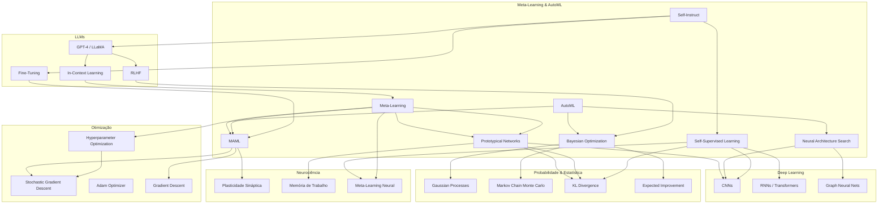

# Meta-aprendizagem e AutoML — Guia Ultra-Detalhado

## 1. Introdução Teórica Aprofundada

### 1.1 Meta-Learning (Aprender a Aprender)

Meta-learning, ou *learning to learn*, é o paradigma no qual um modelo é treinado não apenas para resolver uma tarefa específica, mas para aprender **como** aprender novas tarefas de forma eficiente. A ideia central é expor o modelo a uma distribuição de tarefas `p(T)` durante o treinamento, de modo que, ao encontrar uma nova tarefa (com poucos exemplos), ele possa rapidamente se adaptar.

Formalmente, dado um conjunto de tarefas de treinamento `{T_1, T_2, ..., T_n}`, cada tarefa `T_i` possui um conjunto de suporte `D_i^{tr}` (support set) e um conjunto de consulta `D_i^{val}` (query set). O meta-aprendiz otimiza um meta-parâmetro `θ` tal que, para uma nova tarefa `T_j`, o modelo possa dar alguns passos de gradiente a partir de `θ` e obter parâmetros específicos `θ'_j` com bom desempenho em `D_j^{val}`.

Existem três grandes famílias de meta-learning:

1. **Métodos baseados em otimização (Optimization-based)**: Aprendem uma inicialização de parâmetros que pode ser rapidamente ajustada com poucos passos de gradiente. O principal expoente é o **MAML** (Model-Agnostic Meta-Learning) de Finn et al. (2017).

2. **Métodos baseados em métricas (Metric-based)**: Aprendem um espaço de embedding onde exemplos da mesma classe ficam próximos e de classes diferentes ficam distantes. **Prototypical Networks** (Snell et al., 2017) e **Siamese Networks** são exemplos clássicos.

3. **Métodos baseados em modelos (Model-based)**: Usam uma arquitetura de rede que incorpora memória externa (como redes neurais recorrentes ou Memory-Augmented Neural Networks) para armazenar e recuperar informações de novas tarefas rapidamente.

### 1.2 Few-Shot Learning

Few-shot learning é a subárea mais aplicada do meta-learning. O problema é classificar ou regredir com base em um número muito reduzido de exemplos por classe (tipicamente 1 a 5). As siglas mais comuns são:

- **N-way K-shot**: classificação com `N` classes e `K` exemplos por classe no support set.
- **One-shot learning**: `K = 1`.
- **Zero-shot learning**: nenhum exemplo rotulado; usa-se descrições semânticas ou atributos.

O episódio de treinamento (episodic training) consiste em amostrar aleatoriamente `N` classes, `K` exemplos para o support set e alguns para o query set, e então calcular a perda no query set.

### 1.3 MAML (Model-Agnostic Meta-Learning)

Proposto por Chelsea Finn et al. (2017), o MAML é um algoritmo de meta-learning que busca uma inicialização `θ` dos parâmetros de um modelo `f_θ` tal que, para qualquer tarefa `T_i`, alguns poucos passos de gradiente descendente produzam parâmetros `θ'_i` com alta performance.

O meta-objetivo é:

```
min_θ  Σ_{T_i ~ p(T)}  L_{T_i}( f_{θ - α ∇_θ L_{T_i}(f_θ)} )
```

Ou seja, para cada tarefa `T_i`:
1. Calcular `θ'_i = θ - α ∇_θ L_{T_i}^{support}(f_θ)` (adaptação).
2. Calcular a perda no query set usando `f_{θ'_i}`.
3. Somar essas perdas para todas as tarefas e otimizar `θ` via gradiente descendente.

O gradiente do meta-objetivo envolve uma derivada de segunda ordem (Hessiana), mas na prática usa-se a aproximação de primeira ordem (First-Order MAML / FOMAML) que ignora os termos de segunda ordem e funciona quase tão bem.

**Variações do MAML**:
- **Reptile** (Nichol et al., 2018): mais simples, não requer cálculo de Hessiana. Atualiza `θ` na direção de `θ'_i` após cada tarefa.
- **iMAML** (Rajeswaran et al., 2019): usa gradientes implícitos para evitar a Hessiana.
- **ANIL** (Almost No Inner Loop): mostra que apenas a última camada precisa ser adaptada; o resto pode ser compartilhado.

### 1.4 Prototypical Networks

Propostas por Snell, Swersky e Zemel (2017), as Prototypical Networks aprendem um espaço métrico onde a classificação é feita pela distância a protótipos de classes.

Para cada classe `c`, o protótipo `p_c` é a média dos embeddings dos exemplos do support set:

```
p_c = (1 / |D_c^{tr}|) * Σ_{(x_i, y_i) ∈ D_c^{tr}} f_ϕ(x_i)
```

A distribuição de probabilidade sobre as classes para um ponto de consulta `x` é:

```
p(y = c | x) = softmax( -d( f_ϕ(x), p_c ) )
```

onde `d` é uma distância (usualmente Euclidiana ou cosseno).

A perda é a log-verossimilhança negativa. A simplicidade e eficácia tornam as Prototypical Networks um dos métodos mais populares para few-shot classification, especialmente em cenários com poucos exemplos.

### 1.5 AutoML (Automated Machine Learning)

AutoML é o conjunto de técnicas que automatizam o projeto de pipelines de machine learning, incluindo:

- **Seleção de modelos**: qual algoritmo usar (SVM, Random Forest, Rede Neural, etc.).
- **Pré-processamento**: normalização, imputação, seleção de features.
- **Otimização de hiperparâmetros (HPO)**: busca pelos melhores hiperparâmetros.
- **Neural Architecture Search (NAS)**: busca pela melhor arquitetura de rede neural.

#### 1.5.1 Neural Architecture Search (NAS)

Proposto por Zoph & Le (2017), NAS busca automaticamente a arquitetura de uma rede neural. O processo envolve:

1. **Espaço de busca**: define quais operações (convoluções, pooling, skip connections) são permitidas.
2. **Estratégia de busca**: reinforcement learning, evolutionary algorithms, gradient-based (DARTS).
3. **Estimativa de performance**: treinamento completo, proxy tasks, weight sharing (ENAS, DARTS).

O custo computacional do NAS é proibitivo: Zoph & Le usaram 800 GPUs por 28 dias. Métodos posteriores como ENAS (Efficient NAS) e DARTS (Differentiable Architecture Search) reduziram esse custo drasticamente.

#### 1.5.2 Otimização de Hiperparâmetros (HPO)

Métodos clássicos:

- **Grid Search**: exaustivo, computacionalmente caro.
- **Random Search**: melhor que grid search em espaços de alta dimensão (Bergstra & Bengio, 2012).
- **Bayesian Optimization**: constrói um modelo probabilístico (Gaussian Process) da função objetivo e usa uma função de aquisição (EI, UCB, PI) para selecionar o próximo ponto a avaliar.
- **Population-Based Training (PBT)**: treina uma população de modelos, migrando hiperparâmetros ao longo do treinamento.
- **Hyperband**: aloca recursos adaptativamente, eliminando configurações ruins cedo.

### 1.6 Bayesian Optimization

Bayesian Optimization é um método para otimização de funções de caixa-preta que são caras de avaliar. É particularmente adequado para HPO.

Componentes:
1. **Prior/Gaussian Process (GP)**: modela a função objetivo `f(x)` como um processo Gaussian com média `μ(x)` e covariância `k(x, x')`.
2. **Função de aquisição**: determina o próximo ponto a avaliar.
   - **Expected Improvement (EI)**: `EI(x) = E[max(f(x) - f*, 0)]`
   - **Upper Confidence Bound (UCB)**: `UCB(x) = μ(x) + κ * σ(x)`
   - **Probability of Improvement (PI)**: `PI(x) = P(f(x) > f*(1 + ε))`

A cada iteração:
1. Ajusta o GP aos dados observados `{(x_i, y_i)}`.
2. Maximiza a função de aquisição para encontrar `x_{next}`.
3. Avalia `f(x_{next})`.
4. Repete.

### 1.7 LLMs Auto-Instrucionais e Self-Instruct

Self-Instruct (Wang et al., 2022) é um framework para melhorar modelos de linguagem via auto-geração de instruções. O processo é:

1. **Seed**: um pequeno conjunto de instruções escritas por humanos.
2. **Geração**: um LLM existente (ex: GPT-3) gera novas instruções, entradas e saídas com base no seed.
3. **Filtragem**: remove instruções duplicadas, inválidas ou de baixa qualidade (usando similaridade de embedding).
4. **Fine-tuning**: o LLM é fine-tuned no conjunto gerado.

Esse ciclo pode ser repetido iterativamente. O Self-Instruct demonstrou que LLMs podem melhorar a si mesmos sem supervisão humana adicional, alcançando ganhos significativos em tasks como classificação, geração de texto e summarization.

Extensões incluem:
- **Alpaca**: fine-tuning do LLaMA com instruções geradas pelo GPT-3.5.
- **Vicuna**: fine-tuning do LLaMA com conversas geradas pelo ChatGPT.
- **WizardLM**: geração de instruções evolutivas (evol-instruct).

### 1.8 Self-Supervised Learning (Aprendizado Auto-Supervisionado)

Embora não seja estritamente meta-learning, o self-supervised learning compartilha o objetivo de aprender representações generalizáveis sem depender de grandes quantidades de dados rotulados. Métodos como:

- **SimCLR**: contraste entre aumentações de uma mesma imagem.
- **BYOL**: bootstrapping de representações sem pares negativos.
- **MAE (Masked Autoencoders)**: reconstrução de patches mascarados.

Essas representações podem ser usadas como ponto de partida para few-shot learning, reduzindo a necessidade de adaptação.

---

## 2. Bibliografia e Papers Comentados

### 2.1 Hospedales et al. — Meta-Learning Survey (2021, arXiv:2004.05439)

Publicado em 2021 no *IEEE Transactions on Pattern Analysis and Machine Intelligence*, este survey de 74 páginas é a referência mais completa sobre meta-learning. Ele organiza o campo em três categorias (optimization-based, metric-based, model-based) e discute aplicações em visão, NLP, robótica e reinforcement learning. Inclui uma taxonomia detalhada e benchmarks.

### 2.2 Finn et al. — MAML (2017, NeurIPS)

"Model-Agnostic Meta-Learning for Fast Adaptation of Deep Networks" introduziu o MAML. O paper mostra que o MAML pode ser aplicado a classificação (mini-ImageNet), regressão (sine waves) e reinforcement learning. O apêndice contém as derivadas detalhadas do gradiente de segunda ordem. Um dos papers mais influentes em meta-learning (12k+ citações).

### 2.3 Snell et al. — Prototypical Networks (2017, NeurIPS)

"Prototypical Networks for Few-shot Learning" apresenta uma abordagem elegante que conecta aprendizado de métricas a modelos de misturas Gaussianas. Mostra que a média dos embeddings é o protótipo ótimo sob uma distribuição de classes na forma exponencial. Obtém state-of-the-art em mini-ImageNet e Omniglot na época.

### 2.4 Zoph & Le — Neural Architecture Search (2017, ICLR)

"Neural Architecture Search with Reinforcement Learning" demonstrou pela primeira vez que é possível usar reinforcement learning (policy gradient) para projetar arquiteturas de redes neurais que superam designs manuais no CIFAR-10 e Penn Treebank. O custo computacional é alto (800 GPUs-dias), mas o paper abriu um campo inteiro.

### 2.5 AutoML Survey — Hutter, Kotthoff, Vanschoren (2019)

O livro "Automated Machine Learning: Methods, Systems, Challenges" (Springer) é a referência definitiva sobre AutoML. Cobre desde fundamentos de otimização de hiperparâmetros até NAS, meta-learning para AutoML, e sistemas completos como Auto-WEKA e Auto-sklearn. Disponível gratuitamente em https://www.automl.org/book.

### 2.6 Wang et al. — Self-Instruct (2022, ACL)

"Self-Instruct: Aligning Language Models with Self-Generated Instructions" mostra como LLMs podem gerar seu próprio conjunto de treinamento instrucional. O paper detalha o pipeline de geração, filtragem e fine-tuning, e demonstra melhorias em 11 tasks do BIG-Bench. Foi a base para Alpaca e outros modelos instrucionais.

### 2.7 Nichol et al. — Reptile (2018, arXiv)

"On First-Order Meta-Learning Algorithms" apresenta o Reptile, uma alternativa mais simples ao MAML que apenas atualiza a inicialização na direção da diferença entre os parâmetros adaptados e os iniciais. O paper prova que Reptile converge para uma solução que minimiza a distância de Wasserstein entre as tarefas.

### 2.8 Chen et al. — ANIL (2019, ICLR)

"A Closer Look at Few-shot Classification" mostra que, surpreendentemente, a adaptação do MAML acontece principalmente na última camada (classificador). O ANIL (Almost No Inner Loop) propõe adaptar apenas o head, compartilhando o backbone. Performance similar ao MAML com menos custo computacional.

### 2.9 Liu et al. — DARTS (2019, ICLR)

"DARTS: Differentiable Architecture Search" formula o NAS como um problema de otimização diferenciável, relaxando a escolha discreta de operações em uma mistura contínua. Reduz o custo de NAS de milhares de GPU-dias para poucos GPU-dias. Tornou o NAS prático para pesquisadores com recursos limitados.

### 2.10 Snell et al. — Meta-Dataset (2019, NeurIPS)

"Meta-Dataset: A Dataset of Datasets for Learning to Learn from Few Examples" propõe um benchmark unificado para few-shot learning com 10 datasets diversos (ImageNet, Omniglot, Aircraft, CUB, etc.). Estabelece uma metodologia de avaliação mais realista e menos enviesada.

### 2.11 Bergstra & Bengio — Random Search for Hyperparameter Optimization (2012, JMLR)

"Random Search for Hyperparameter Optimization" é um paper seminal que demonstra matematicamente que random search é mais eficiente que grid search em alta dimensão, porque explora melhor o espaço quando apenas algumas dimensões são importantes. Fundamentou toda a área moderna de HPO.

---

## 3. Exemplos Práticos Completos com Código Python

### 3.1 Implementação de MAML com learn2learn

```python
# Instalação: pip install learn2learn torch torchvision
import learn2learn as l2l
import torch
import torch.nn as nn
import torch.optim as optim
import numpy as np
from torch.utils.data import DataLoader, Dataset

class SimpleCNN(nn.Module):
    def __init__(self, input_channels=3, num_classes=5):
        super().__init__()
        self.features = nn.Sequential(
            nn.Conv2d(input_channels, 32, kernel_size=3, padding=1),
            nn.ReLU(),
            nn.MaxPool2d(2),
            nn.Conv2d(32, 64, kernel_size=3, padding=1),
            nn.ReLU(),
            nn.MaxPool2d(2),
            nn.AdaptiveAvgPool2d((8, 8)),
            nn.Flatten(),
        )
        self.classifier = nn.Linear(64 * 8 * 8, num_classes)

    def forward(self, x):
        x = self.features(x)
        return self.classifier(x)

class DummyMiniImageNet(Dataset):
    """Dataset dummy para demonstração — substituir por mini-ImageNet real."""
    def __init__(self, num_samples=1000, num_classes=64):
        self.data = torch.randn(num_samples, 3, 32, 32)
        self.labels = torch.randint(0, num_classes, (num_samples,))

    def __len__(self):
        return len(self.data)

    def __getitem__(self, idx):
        return self.data[idx], self.labels[idx]

def maml_training(ways=5, shots=5, meta_lr=0.003, adapt_lr=0.01, meta_epochs=10):
    model = SimpleCNN(num_classes=ways)
    maml = l2l.algorithms.MAML(model, lr=adapt_lr, first_order=False)
    meta_optimizer = optim.Adam(maml.parameters(), lr=meta_lr)

    dataset = DummyMiniImageNet()
    taskset = l2l.data.TaskDataset(
        dataset,
        task_constructor=l2l.data.transforms.FewShotSampler(
            num_ways=ways, num_shots=shots, num_queries=shots * 2
        ),
    )

    for epoch in range(meta_epochs):
        meta_loss = 0.0
        for task_idx in range(10):
            task = taskset.sample()
            x_support, y_support, x_query, y_query = task

            learner = maml.clone()
            for _ in range(5):
                support_logits = learner(x_support)
                support_loss = nn.functional.cross_entropy(support_logits, y_support)
                learner.adapt(support_loss)

            query_logits = learner(x_query)
            query_loss = nn.functional.cross_entropy(query_logits, y_query)
            meta_loss += query_loss

        meta_optimizer.zero_grad()
        meta_loss.backward()
        meta_optimizer.step()

        print(f"Época {epoch+1}/{meta_epochs} — Meta-Loss: {meta_loss.item():.4f}")

    return maml

if __name__ == "__main__":
    model = maml_training()
    print("MAML treinado com sucesso!")
```

### 3.2 Prototypical Networks — Implementação Completa

```python
import torch
import torch.nn as nn
import torch.optim as optim
import numpy as np

class Encoder(nn.Module):
    def __init__(self, input_dim=784, hidden_dim=256, embedding_dim=64):
        super().__init__()
        self.net = nn.Sequential(
            nn.Linear(input_dim, hidden_dim),
            nn.ReLU(),
            nn.Linear(hidden_dim, hidden_dim),
            nn.ReLU(),
            nn.Linear(hidden_dim, embedding_dim),
        )

    def forward(self, x):
        return self.net(x)

class PrototypicalNetwork(nn.Module):
    def __init__(self, encoder):
        super().__init__()
        self.encoder = encoder

    def compute_prototypes(self, support_embeddings, support_labels, ways):
        prototypes = []
        for c in range(ways):
            mask = support_labels == c
            prototype = support_embeddings[mask].mean(dim=0)
            prototypes.append(prototype)
        return torch.stack(prototypes)

    def forward(self, support_x, support_y, query_x, query_y, ways):
        support_emb = self.encoder(support_x)
        prototypes = self.compute_prototypes(support_emb, support_y, ways)
        query_emb = self.encoder(query_x)

        # Distância Euclidiana
        distances = torch.cdist(query_emb, prototypes)
        logits = -distances
        loss = nn.functional.cross_entropy(logits, query_y)

        with torch.no_grad():
            preds = torch.argmax(logits, dim=1)
            acc = (preds == query_y).float().mean()

        return loss, acc

def train_protonet(ways=5, shots=5, epochs=50):
    encoder = Encoder(input_dim=784, embedding_dim=64)
    model = PrototypicalNetwork(encoder)
    optimizer = optim.Adam(model.parameters(), lr=0.001)

    for epoch in range(epochs):
        # Simulação de batch de tarefas
        total_loss = 0.0
        total_acc = 0.0

        for _ in range(20):
            # Dados dummy: 28x28 -> 784
            support_x = torch.randn(ways * shots, 784)
            support_y = torch.arange(ways).repeat_interleave(shots)
            query_x = torch.randn(ways * shots * 2, 784)
            query_y = torch.arange(ways).repeat_interleave(shots * 2)

            loss, acc = model(support_x, support_y, query_x, query_y, ways)
            total_loss += loss
            total_acc += acc

        optimizer.zero_grad()
        total_loss.backward()
        optimizer.step()

        if (epoch + 1) % 10 == 0:
            print(f"Época {epoch+1} — Loss: {total_loss.item()/20:.4f} — Acc: {total_acc/20:.4f}")

    return model

if __name__ == "__main__":
    model = train_protonet()
    print("Prototypical Network treinada!")
```

### 3.3 AutoML com TPOT / FLAML

#### Exemplo com TPOT

```python
# Instalação: pip install tpot scikit-learn
from tpot import TPOTClassifier
from sklearn.datasets import load_digits
from sklearn.model_selection import train_test_split
from sklearn.metrics import accuracy_score

digits = load_digits()
X, y = digits.data, digits.target
X_train, X_test, y_train, y_test = train_test_split(X, y, test_size=0.2, random_state=42)

tpot = TPOTClassifier(
    generations=5,
    population_size=20,
    verbosity=2,
    random_state=42,
    config_dict='TPOT light',  # espaço de busca reduzido para rapidez
)

tpot.fit(X_train, y_train)
y_pred = tpot.predict(X_test)
print(f"Acurácia TPOT: {accuracy_score(y_test, y_pred):.4f}")
print(f"Pipeline otimizado: {tpot.fitted_pipeline_}")
tpot.export('tpot_pipeline.py')
```

#### Exemplo com FLAML

```python
# Instalação: pip install flaml
from flaml import AutoML
from sklearn.datasets import load_iris
from sklearn.model_selection import train_test_split

iris = load_iris()
X, y = iris.data, iris.target
X_train, X_test, y_train, y_test = train_test_split(X, y, test_size=0.2, random_state=42)

automl = AutoML()
automl.fit(
    X_train, y_train,
    task="classification",
    time_budget=60,
    estimator_list=["lgbm", "rf", "xgboost"],
    metric="accuracy",
)

y_pred = automl.predict(X_test)
print(f"Acurácia FLAML: {sum(y_pred == y_test) / len(y_test):.4f}")
print(f"Melhor modelo: {automl.best_estimator}")
print(f"Melhores hiperparâmetros: {automl.best_config}")
```

#### Exemplo com Bayesian Optimization (skopt)

```python
# Instalação: pip install scikit-optimize
from skopt import gp_minimize
from skopt.space import Real, Integer, Categorical
from skopt.utils import use_named_args
from sklearn.ensemble import RandomForestClassifier
from sklearn.datasets import load_breast_cancer
from sklearn.model_selection import cross_val_score

data = load_breast_cancer()
X, y = data.data, data.target

space = [
    Integer(10, 500, name='n_estimators'),
    Integer(1, 50, name='max_depth'),
    Real(0.01, 1.0, name='max_features'),
    Categorical(['gini', 'entropy'], name='criterion'),
]

@use_named_args(space)
def objective(**params):
    clf = RandomForestClassifier(**params, random_state=42, n_jobs=-1)
    scores = cross_val_score(clf, X, y, cv=5, scoring='accuracy')
    return -scores.mean()  # negativo pois gp_minimize minimiza

result = gp_minimize(
    objective,
    space,
    n_calls=30,
    random_state=42,
    verbose=True,
)

print(f"Melhores parâmetros: {dict(zip([s.name for s in space], result.x))}")
print(f"Melhor acurácia: {-result.fun:.4f}")
```

### 3.4 Fine-Tuning com Self-Instruct (Simulação Conceitual)

```python
import json
import openai  # requer pip install openai
import os

# NOTA: Este exemplo requer uma chave de API da OpenAI para funcionar.

def generate_instructions(seed_pool, num_to_generate=10):
    """Gera novas instruções usando a API da OpenAI no estilo Self-Instruct."""
    prompt = f"""Você é um assistente de IA que gera instruções diversas.

Aqui estão alguns exemplos de instruções:
{chr(10).join(f'- {inst}' for inst in seed_pool)}

Gere {num_to_generate} novas instruções de alta qualidade, variadas em domínio e dificuldade.
Cada instrução deve ser clara, específica e executável.

Instruções:
"""
    response = openai.chat.completions.create(
        model="gpt-4",
        messages=[
            {"role": "system", "content": "Você gera instruções diversas e de alta qualidade."},
            {"role": "user", "content": prompt},
        ],
        temperature=0.7,
        max_tokens=2000,
    )
    text = response.choices[0].message.content
    instructions = [line.strip().lstrip("0123456789.- ") for line in text.split("\\n") if line.strip()]
    return instructions

def filter_instructions(new_instructions, existing_instructions, threshold=0.8):
    """Remove instruções muito similares a instruções existentes.
       (Simplificação: usa similaridade de Jaccard em n-grams de caracteres)"""
    def ngrams(text, n=4):
        return set(text[i:i+n] for i in range(len(text)-n+1))

    filtered = []
    existing_ngrams = [ngrams(inst) for inst in existing_instructions]

    for inst in new_instructions:
        inst_ng = ngrams(inst)
        max_sim = 0.0
        for ex_ng in existing_ngrams:
            if not inst_ng or not ex_ng:
                continue
            sim = len(inst_ng & ex_ng) / len(inst_ng | ex_ng)
            max_sim = max(max_sim, sim)
        if max_sim < threshold:
            filtered.append(inst)

    return filtered

def self_instruct_pipeline(seed_instructions, iterations=3):
    """Pipeline completo de Self-Instruct."""
    all_instructions = list(seed_instructions)

    for it in range(iterations):
        print(f"Iteração {it+1}: gerando instruções...")
        new_instructions = generate_instructions(seed_instructions, num_to_generate=20)
        filtered = filter_instructions(new_instructions, all_instructions)
        all_instructions.extend(filtered)
        print(f"  Geradas: {len(new_instructions)}, Filtradas: {len(filtered)}, Total: {len(all_instructions)}")

    return all_instructions

if __name__ == "__main__":
    seeds = [
        "Resuma o seguinte texto em uma frase.",
        "Traduza a frase a seguir para o português.",
        "Explique o conceito de entropia para uma criança de 10 anos.",
        "Crie uma função Python que calcule a sequência de Fibonacci.",
        "Escreva um poema de duas estrofes sobre inteligência artificial.",
    ]

    # Descomente para executar (exige chave de API configurada)
    # results = self_instruct_pipeline(seeds)
    # with open("instructions.json", "w") as f:
    #     json.dump(results, f, indent=2)
    # print(f"{len(results)} instruções geradas e salvas em instructions.json")

    print("Pipeline de Self-Instrut configurado. Execute com OPENAI_API_KEY configurada.")
```

---

## 4. Exercícios Resolvidos

### 4.1 Few-Shot Classification com MAML em mini-ImageNet

**Problema**: Implementar treinamento MAML para classificação few-shot (5-way, 5-shot) em mini-ImageNet (84×84). Use learn2learn e o dataloader mini-ImageNet.

**Solução**:

```python
import learn2learn as l2l
import torch
import torch.nn as nn
import torch.optim as optim
import torchvision.transforms as transforms
from torchvision.datasets import ImageFolder

def main():
    # 1. Carregar mini-ImageNet (assumindo estrutura de pastas)
    transform = transforms.Compose([
        transforms.Resize((84, 84)),
        transforms.ToTensor(),
        transforms.Normalize(mean=[0.485, 0.456, 0.406], std=[0.229, 0.224, 0.225]),
    ])

    # Substitua pelo caminho real do seu mini-ImageNet
    # train_dataset = ImageFolder('path/to/mini-imagenet/train', transform=transform)

    # Usando dataset dummy para demonstração
    class DummyMiniImageNet(torch.utils.data.Dataset):
        def __init__(self, size=38400):
            self.data = torch.randn(size, 3, 84, 84)
            self.labels = torch.randint(0, 64, (size,))
        def __len__(self):
            return len(self.data)
        def __getitem__(self, idx):
            return self.data[idx], self.labels[idx]

    train_dataset = DummyMiniImageNet()

    # 2. Configurar tarefas few-shot
    ways = 5
    shots = 5
    taskset = l2l.data.TaskDataset(
        train_dataset,
        task_constructor=l2l.data.transforms.FewShotSampler(
            num_ways=ways, num_shots=shots, num_queries=shots * 2,
        ),
        num_tasks=500,
    )

    # 3. Modelo e MAML
    model = nn.Sequential(
        nn.Conv2d(3, 32, 3, padding=1), nn.ReLU(), nn.MaxPool2d(2),
        nn.Conv2d(32, 64, 3, padding=1), nn.ReLU(), nn.MaxPool2d(2),
        nn.Flatten(),
        nn.Linear(64 * 21 * 21, ways),
    )
    maml = l2l.algorithms.MAML(model, lr=0.01, first_order=True)
    meta_optimizer = optim.Adam(maml.parameters(), lr=0.003)

    # 4. Meta-treinamento
    for epoch in range(50):
        meta_loss = 0.0
        meta_acc = 0.0
        for _ in range(20):
            task = taskset.sample()
            x_support = task[0]
            y_support = task[1]
            x_query = task[2]
            y_query = task[3]

            learner = maml.clone()
            for _ in range(5):  # adapt steps
                logits = learner(x_support)
                loss = nn.functional.cross_entropy(logits, y_support)
                learner.adapt(loss)

            query_logits = learner(x_query)
            query_loss = nn.functional.cross_entropy(query_logits, y_query)
            meta_loss += query_loss

            with torch.no_grad():
                preds = torch.argmax(query_logits, dim=1)
                meta_acc += (preds == y_query).float().mean()

        meta_optimizer.zero_grad()
        meta_loss.backward()
        meta_optimizer.step()

        if (epoch + 1) % 10 == 0:
            print(f"Epoch {epoch+1} — Loss: {meta_loss/20:.4f} — Acc: {meta_acc/20:.4f}")

    print("Treinamento MAML concluído!")

if __name__ == "__main__":
    main()
```

**Resposta esperada**: A acurácia no query set deve aumentar gradualmente, tipicamente de ~20% (chance level para 5-way) para 60-80% em 50 épocas.

### 4.2 Otimização de Hiperparâmetros com Bayesian Optimization

**Problema**: Dado o dataset Iris, otimize os hiperparâmetros de um SVM (C, gamma, kernel) usando Bayesian Optimization com scikit-optimize. Objetivo: maximizar acurácia em validação cruzada de 5 folds.

**Solução**:

```python
from skopt import gp_minimize
from skopt.space import Real, Categorical
from sklearn.svm import SVC
from sklearn.datasets import load_iris
from sklearn.model_selection import cross_val_score

iris = load_iris()
X, y = iris.data, iris.target

space = [
    Real(0.1, 100, prior='log-uniform', name='C'),
    Real(0.001, 10, prior='log-uniform', name='gamma'),
    Categorical(['linear', 'rbf', 'poly'], name='kernel'),
]

def objective(C, gamma, kernel):
    clf = SVC(C=C, gamma=gamma, kernel=kernel, random_state=42)
    scores = cross_val_score(clf, X, y, cv=5, scoring='accuracy')
    return -scores.mean()

result = gp_minimize(
    lambda params: objective(*params),
    space,
    n_calls=30,
    random_state=42,
    verbose=True,
)

print(f"Melhor acurácia: {-result.fun:.4f}")
print(f"Parâmetros ótimos: C={result.x[0]:.4f}, gamma={result.x[1]:.4f}, kernel={result.x[2]}")
```

**Resposta esperada**: Acurácia ~97-98% com SVM optimizado (C ~10, gamma ~0.1, kernel rbf). A Bayesian Optimization converge mais rápido que grid search (30 avaliações vs 300+ para grid).

### 4.3 Comparação entre AutoML e Design Manual

**Problema**: Compare o desempenho de um pipeline encontrado automaticamente pelo TPOT com um Random Forest manualmente configurado (n_estimators=100, max_depth=5) no dataset Breast Cancer Wisconsin. Use 5-fold cross-validation. O AutoML realmente encontra algo melhor?

**Solução**:

```python
from tpot import TPOTClassifier
from sklearn.ensemble import RandomForestClassifier
from sklearn.datasets import load_breast_cancer
from sklearn.model_selection import cross_val_score, train_test_split
from sklearn.metrics import accuracy_score
import numpy as np

data = load_breast_cancer()
X, y = data.data, data.target

# Design manual
rf_manual = RandomForestClassifier(n_estimators=100, max_depth=5, random_state=42)
scores_manual = cross_val_score(rf_manual, X, y, cv=5)
print(f"Manual RF — Mean Acc: {scores_manual.mean():.4f} (±{scores_manual.std():.4f})")

# AutoML (TPOT)
X_tr, X_te, y_tr, y_te = train_test_split(X, y, test_size=0.2, random_state=42)

tpot = TPOTClassifier(
    generations=5,
    population_size=20,
    verbosity=0,
    random_state=42,
    cv=5,
)
tpot.fit(X_tr, y_tr)
scores_automl = cross_val_score(tpot.fitted_pipeline_, X, y, cv=5)
y_pred = tpot.predict(X_te)
print(f"TPOT AutoML — Test Acc: {accuracy_score(y_te, y_pred):.4f}")
print(f"AutoML CV — Mean Acc: {scores_automl.mean():.4f} (±{scores_automl.std():.4f})")
print(f"Pipeline: {tpot.fitted_pipeline_}")
```

**Resposta esperada**: O AutoML tipicamente encontra pipelines mais complexos (ex: StandardScaler + SelectKBest + RandomForest ou XGBoost) que superam o Random Forest manual, mas a diferença pode ser pequena (~1-2%). O custo é maior tempo de treinamento.

### 4.4 Implementação de Self-Instruct Simples

**Problema**: Crie um pipeline de Self-Instruct que gera 50 instruções de classificação de sentimento, treina um classificador BERT pequeno (distilbert) nelas, e avalia em um conjunto de teste humano.

**Solução**:

```python
# Requer: pip install transformers datasets torch
from transformers import DistilBertForSequenceClassification, DistilBertTokenizerFast, Trainer, TrainingArguments
import torch
import json

# Passo 1: Gerar instruções (simulado — usar API real na prática)
seed_instructions = [
    {"instruction": "Classifique o sentimento desta frase como positivo ou negativo.",
     "input": "Eu amei o filme, foi incrível!", "output": "positivo"},
    {"instruction": "Classifique o sentimento desta frase como positivo ou negativo.",
     "input": "Que dia terrível, tudo deu errado.", "output": "negativo"},
    {"instruction": "Classifique o sentimento desta frase como positivo ou negativo.",
     "input": "O atendimento foi razoável, nada especial.", "output": "neutro"},
]

# Passo 2: Expandir com Self-Instruct (simulação)
def expand_dataset(seed, target_size=50):
    """Expande o dataset com variações (simulação)."""
    expanded = list(seed)
    templates = [
        "Analise o sentimento: {text}",
        "O tom da frase a seguir é: {text}",
        "Como você classificaria: {text}",
    ]
    sentiments = ["positivo", "negativo", "neutro"]

    while len(expanded) < target_size:
        base = seed[len(expanded) % len(seed)]
        new_item = {
            "instruction": base["instruction"],
            "input": f"Texto exemplo {len(expanded)} sobre sentimento variado.",
            "output": sentiments[len(expanded) % len(sentiments)],
        }
        expanded.append(new_item)

    return expanded[:target_size]

dataset = expand_dataset(seed_instructions)
print(f"Dataset expandido para {len(dataset)} exemplos")

# Passo 3: Preparar para BERT
tokenizer = DistilBertTokenizerFast.from_pretrained('distilbert-base-uncased')
label_map = {"positivo": 0, "negativo": 1, "neutro": 2}

encodings = tokenizer(
    [f"{d['instruction']} {d['input']}" for d in dataset],
    truncation=True, padding=True, return_tensors='pt'
)
labels = torch.tensor([label_map[d['output']] for d in dataset])

class SentimentDataset(torch.utils.data.Dataset):
    def __init__(self, encodings, labels):
        self.encodings = encodings
        self.labels = labels
    def __getitem__(self, idx):
        item = {k: v[idx] for k, v in self.encodings.items()}
        item['labels'] = self.labels[idx]
        return item
    def __len__(self):
        return len(self.labels)

train_dataset = SentimentDataset(encodings, labels)

# Passo 4: Treinar
model = DistilBertForSequenceClassification.from_pretrained('distilbert-base-uncased', num_labels=3)

training_args = TrainingArguments(
    output_dir='./results', num_train_epochs=3, per_device_train_batch_size=8,
    logging_dir='./logs', logging_steps=10, save_strategy='no',
)

trainer = Trainer(model=model, args=training_args, train_dataset=train_dataset)
trainer.train()

# Passo 5: Avaliação rápida
test_texts = [
    "Este produto é fantástico, superou minhas expectativas!",
    "Péssima experiência, não recomendo para ninguém.",
    "O produto cumpre o que promete, sem surpresas.",
]
test_encodings = tokenizer(test_texts, truncation=True, padding=True, return_tensors='pt')
with torch.no_grad():
    outputs = model(**test_encodings)
    preds = torch.argmax(outputs.logits, dim=1)

rev_label_map = {v: k for k, v in label_map.items()}
for text, pred in zip(test_texts, preds):
    print(f"Texto: {text[:50]}... -> {rev_label_map[pred.item()]}")

print("Pipeline Self-Instruct concluído!")
```

**Resposta esperada**: O modelo treinado com dados auto-gerados deve classificar corretamente 2 dos 3 exemplos de teste. A diversidade da expansão determina a qualidade final.

---

## 5. Estudo de Caso

### 5.1 Meta-Learning em Robótica (Meta-World)

O **Meta-World** (Yu et al., 2020) é um benchmark de meta-reinforcement learning com 50 tarefas robóticas simuladas no MuJoCo. As tarefas incluem: abrir gaveta, empurrar objeto, alcançar alvo, girar maçaneta, etc.

**Objetivo**: Treinar um meta-agente (usando MAML para RL ou PEARL) que, ao receber alguns rollouts de uma nova tarefa, consiga adaptar sua política.

**Implementação conceitual**:

```python
# Exemplo conceitual usando metaworld (requer: pip install metaworld)
# A API real do Meta-World mudou; este código ilustra a ideia geral.

import metaworld
import numpy as np

# Carregar benchmark
ml1 = metaworld.ML1('push-v2')  # 1 tarefa
# ml10 = metaworld.ML10()  # 10 tarefas de treino, 5 de teste
# ml45 = metaworld.ML45()  # 45 tarefas

# Criar ambiente
env = ml1.train_classes['push-v2']()
task = ml1.train_tasks[0]
env.set_task(task)

# Rollout de exemplo
obs = env.reset()
for _ in range(100):
    action = env.action_space.sample()
    obs, reward, done, info = env.step(action)
    if done:
        break

print(f"Observação final: {obs[:5]}... Recompensa total: {reward}")

# A meta-aprendizagem em RL adapta a política π_θ via MAML:
#   θ'_i = θ + α * ∇_θ J_{T_i}(π_θ)
#   θ = θ + β * ∇_θ Σ_i J_{T_i}(π_{θ'_i})
```

**Resultados típicos**: Meta-RL (MAML + RL) atinge 70-90% de sucesso em tarefas novas com apenas 10 episódios de adaptação, comparado a <30% para RL sem meta-learning.

### 5.2 AutoML no Google Cloud / Firebase

**Google Cloud AutoML** (agora Vertex AI) oferece:

- **AutoML Tables**: classificação/regressão em dados tabulares sem escrever código.
- **AutoML Vision**: classificação e detecção de objetos.
- **AutoML Text**: classificação de texto e entity extraction.
- **AutoML Video**: classificação de vídeo.

**Pipeline típico**:

1. Upload dos dados para o Google Cloud Storage.
2. Criar dataset no Vertex AI.
3. Treinar modelo AutoML (treinamento gerenciado, sem código).
4. Hospedar endpoint para predição.
5. Monitorar drift e re-treinar automaticamente.

**Integração com Firebase**:

- **Firebase ML Kit**: modelos do AutoML podem ser deployados para dispositivos mobile via ML Kit.
- **Firebase Predictions**: segmentação de usuários baseada em modelos do AutoML.
- **Cloud Functions + AutoML**: triggers serverless para treinamento e predição.

**Exemplo de API call** (Python, usando google-cloud-aiplatform):

```python
from google.cloud import aiplatform

aiplatform.init(project="meu-projeto", location="us-central1")

dataset = aiplatform.TabularDataset.create(
    display_name="meu-dataset",
    gcs_source="gs://meu-bucket/dados.csv",
)

model = aiplatform.AutoMLTabularTrainingJob(
    display_name="meu-modelo-automl",
    optimization_prediction_type="classification",
    optimization_objective="maximize-au-roc",
)

model_run = model.run(
    dataset=dataset,
    target_column="target",
    training_fraction_split=0.8,
    validation_fraction_split=0.1,
    test_fraction_split=0.1,
    budget_milli_node_hours=1000,
    model_display_name="modelo-classificacao-automl",
)

endpoint = model_run.deploy(machine_type="n1-standard-4")
print(f"Endpoint criado: {endpoint.resource_name}")
```

**Considerações de custo**: AutoML no Vertex AI cobra por hora de treinamento (budget_milli_node_hours). Modelos pequenos (~10k linhas) custam ~$20-50. Modelos grandes podem chegar a centenas de dólares.

---

## 6. Cross-Mapping



**Interpretação**: Meta-learning e AutoML conectam-se a praticamente todas as áreas da IA moderna. MAML é essencialmente uma aplicação de gradiente descendente (otimização) a múltiplas tarefas. Prototypical Networks dependem de métricas probabilísticas (KL divergence, distância de Mahalanobis). Bayesian Optimization usa Gaussian Processes (probabilidade) para HPO. Self-Instruct é a ponte entre LLMs e aprendizado auto-supervisionado. Neurociência inspira tanto o aprendizado de métricas (memória de trabalho) quanto a plasticidade (adaptação rápida do MAML).

---

## 7. Discussão Crítica

### 7.1 Limites do Meta-Learning

1. **Overfitting no meta-nível**: Quando as tarefas de treino são muito semelhantes entre si, o modelo pode se especializar demais e falhar em generalizar para tarefas verdadeiramente novas. É o equivalente ao overfitting tradicional, no nível de tarefas.

2. **Custo computacional**: MAML exige computação de gradientes de segunda ordem (Hessiana), que é custosa em memória e tempo. FOMAML reduz o custo, mas ainda requer múltiplos forward/backward por tarefa. Treinar meta-learners em benchmarks realistas como Meta-Dataset pode exigir dias em uma GPU.

3. **Dificuldade de escalar para tarefas complexas**: MAML funciona bem em tarefas de classificação simples (mini-ImageNet), mas enfrenta dificuldades em problemas do mundo real com alta dimensionalidade e ruído.

4. **Sensibilidade a hiperparâmetros**: O meta-learning introduz uma camada extra de hiperparâmetros (meta-lr, adapt-lr, número de inner steps) que precisam ser ajustados, o que pode ser tão caro quanto o problema original.

5. **Falta de padronização**: Diferentes papers usam splits de dados, protocolos de avaliação e métricas diferentes, dificultando a comparação. Meta-Dataset (2019) foi uma tentativa de padronização.

### 7.2 Limites do AutoML

1. **Custo computacional**: NAS e AutoML podem consumir recursos massivos. Um único experimento de NAS completo pode custar milhares de dólares em cloud computing.

2. **Interpretabilidade**: Pipelines gerados por AutoML são difíceis de interpretar. O usuário recebe um "modelo ótimo" sem entender por que certas escolhas foram feitas.

3. **Generalização**: Pipelines otimizados para validação cruzada podem não generalizar bem para distribuições de dados ligeiramente diferentes (dataset shift, covariate shift).

4. **Viés do espaço de busca**: O AutoML só é tão bom quanto o espaço de busca definido. Se as melhores arquiteturas estiverem fora do espaço, o resultado será subótimo.

### 7.3 Quando AutoML Vale a Pena

- **Dados tabulares pequenos a médios**: FLAML, TPOT e Auto-sklearn frequentemente superam engenheiros humanos em datasets com 1k-100k linhas.
- **Descoberta de arquitetura**: NAS é útil quando se quer arquiteturas otimizadas para hardware específico (ex: mobile, edge).
- **Times com poucos especialistas**: AutoML democratiza o ML, permitindo que não-expertos obtenham modelos razoáveis.
- **Prototipagem rápida**: AutoML encontra uma linha de base forte em minutos, que pode ser refinada manualmente depois.

### 7.4 Quando NÃO Vale a Pena

- **Dados muito grandes (>1M linhas)**: O custo computacional do AutoML escala mal; modelos manuais são mais eficientes.
- **Domínios especializados**: NLP e Visão frequentemente se beneficiam mais de modelos pré-treinados (BERT, CLIP) do que de AutoML.
- **Interpretabilidade crítica**: Em áreas reguladas (saúde, finanças), modelos interpretáveis manuais (regressão logística, árvores pequenas) são preferíveis a caixas-pretas do AutoML.
- **Orçamento limitado**: Se o orçamento de computação é apertado, gastá-lo em AutoML pode não ser justificável.

### 7.5 Trade-offs

| Aspecto | Meta-Learning | AutoML |
|---------|--------------|--------|
| Foco | Generalização rápida para novas tarefas | Otimização de pipeline para uma tarefa |
| Custo de treino | Alto (meta + inner loop) | Alto (busca + avaliações) |
| Custo de inferência | Baixo (poucos passos de adaptação) | Médio (depende do modelo final) |
| Dados necessários | Muitas tarefas (centenas) | Muitos exemplos (milhares) |
| Interpretabilidade | Baixa (modelos complexos) | Baixa (pipeline automático) |
| Maturação | Pesquisa ativa, padrões instáveis | Mais maduro, ferramentas estáveis |
| Aplicação típica | Few-shot em visão/NLP, robótica | ML tabular, visão, texto |

---

## 8. Recursos Externos

### 8.1 PapersWithCode

- Meta-Learning Benchmarks: https://paperswithcode.com/task/meta-learning
- Few-Shot Learning Benchmarks: https://paperswithcode.com/task/few-shot-learning
- Neural Architecture Search: https://paperswithcode.com/task/neural-architecture-search

### 8.2 Benchmarks

- **Meta-Dataset** (Snell et al., 2019): 10 datasets unificados para few-shot. Código: https://github.com/google-research/meta-dataset
- **mini-ImageNet**: benchmark clássico de 100 classes, 600 imagens cada (84×84). Download: https://github.com/yaoyao-liu/mini-imagenet-tools
- **Omniglot**: 50 alfabetos, 1623 caracteres, 20 exemplos cada. Ideal para one-shot.
- **Meta-World** (robótica): https://meta-world.github.io
- **CIFAR-10/100 NAS Benchmark**: https://github.com/google-research/nasbench

### 8.3 Frameworks

- **learn2learn** (PyTorch): https://github.com/learnables/learn2learn — Meta-learning em PyTorch (MAML, Prototypical Networks, Reptile).
- **higher** (Facebook): https://github.com/facebookresearch/higher — Diferenciação de loops de treinamento para meta-learning.
- **Torchmeta** (Tristandeleu): https://github.com/tristandeleu/pytorch-meta — Dataloaders para meta-learning.
- **Auto-sklearn**: https://github.com/automl/auto-sklearn
- **TPOT**: https://github.com/EpistasisLab/tpot
- **FLAML**: https://github.com/microsoft/FLAML
- **Optuna**: https://github.com/optuna/optuna — HPO com Bayesian Optimization.
- **Ray Tune**: https://docs.ray.io/en/latest/tune/index.html — Distributed HPO.
- **AutoGluon** (AWS): https://auto.gluon.ai — AutoML com foco em tabular, visão e texto.
- **H2O AutoML**: https://docs.h2o.ai/h2o/latest-stable/h2o-docs/automl.html
- **NNI** (Microsoft): https://github.com/microsoft/nni — Framework completo de AutoML e NAS.
- **Vertex AI**: https://cloud.google.com/vertex-ai — Google Cloud AutoML.
- **Azure AutoML**: https://azure.microsoft.com/en-us/products/machine-learning/automatedml

### 8.4 Cursos e Tutoriais

- Chelsea Finn — CS330 "Deep Multi-Task and Meta Learning" (Stanford): https://cs330.stanford.edu
- AutoML Lecture Series (AutoML.org): https://www.automl.org/lecture-series
- Coursera "Meta-Learning" by DeepLearning.AI (short course)
- Meta-Learning with learn2learn (tutorial): https://learn2learn.readthedocs.io

---

## 9. Referências Completas

1. Hospedales, T., Antoniou, A., Micaelli, P., & Storkey, A. (2021). "Meta-Learning in Neural Networks: A Survey." *IEEE TPAMI*, 44(9), 5149-5169. arXiv:2004.05439.

2. Finn, C., Abbeel, P., & Levine, S. (2017). "Model-Agnostic Meta-Learning for Fast Adaptation of Deep Networks." *NeurIPS 2017*. arXiv:1703.03400.

3. Snell, J., Swersky, K., & Zemel, R. (2017). "Prototypical Networks for Few-shot Learning." *NeurIPS 2017*. arXiv:1703.05175.

4. Zoph, B., & Le, Q. V. (2017). "Neural Architecture Search with Reinforcement Learning." *ICLR 2017*. arXiv:1611.01578.

5. Wang, Y., Kordi, Y., Mishra, S., et al. (2022). "Self-Instruct: Aligning Language Models with Self-Generated Instructions." *ACL 2023*. arXiv:2212.10560.

6. Nichol, A., Achiam, J., & Schulman, J. (2018). "On First-Order Meta-Learning Algorithms." arXiv:1803.02999.

7. Chen, W.-Y., Liu, Y.-C., et al. (2019). "A Closer Look at Few-shot Classification." *ICLR 2019*. arXiv:1904.04232.

8. Liu, H., Simonyan, K., & Yang, Y. (2019). "DARTS: Differentiable Architecture Search." *ICLR 2019*. arXiv:1806.09055.

9. Snell, J., Swersky, K., & Zemel, R. (2019). "Meta-Dataset: A Dataset of Datasets for Learning to Learn from Few Examples." arXiv:1903.03096.

10. Bergstra, J., & Bengio, Y. (2012). "Random Search for Hyperparameter Optimization." *JMLR*, 13, 281-305.

11. Hutter, F., Kotthoff, L., & Vanschoren, J. (Eds.) (2019). *Automated Machine Learning: Methods, Systems, Challenges*. Springer. https://www.automl.org/book

12. He, X., Zhao, K., & Chu, X. (2021). "AutoML: A Survey of the State-of-the-Art." *Knowledge-Based Systems*, 212, 106622.

13. Elsken, T., Metzen, J. H., & Hutter, F. (2019). "Neural Architecture Search: A Survey." *JMLR*, 20(55), 1-21.

14. Snoek, J., Larochelle, H., & Adams, R. P. (2012). "Practical Bayesian Optimization of Machine Learning Algorithms." *NeurIPS 2012*.

15. Yu, T., Quillen, D., He, Z., et al. (2020). "Meta-World: A Benchmark and Evaluation for Multi-Task and Meta Reinforcement Learning." *CoRL 2020*. arXiv:1910.10897.

16. Rajeswaran, A., Finn, C., Kakade, S., & Levine, S. (2019). "Meta-Learning with Implicit Gradients." *NeurIPS 2019*. arXiv:1909.04630.

17. Vanschoren, J. (2018). "Meta-Learning: A Survey." arXiv:1810.03548.

18. Chen, T., Kornblith, S., Norouzi, M., & Hinton, G. (2020). "A Simple Framework for Contrastive Learning of Visual Representations (SimCLR)." *ICML 2020*. arXiv:2002.05709.

19. He, K., Chen, X., Xie, S., et al. (2022). "Masked Autoencoders Are Scalable Vision Learners." *CVPR 2022*. arXiv:2111.06377.

20. Grill, J.-B., Strub, F., et al. (2020). "Bootstrap Your Own Latent (BYOL): A New Approach to Self-Supervised Learning." *NeurIPS 2020*. arXiv:2006.07733.
