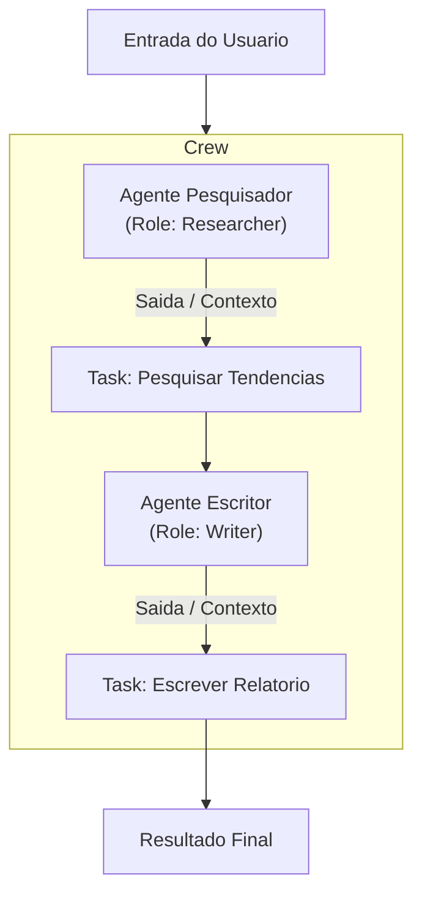
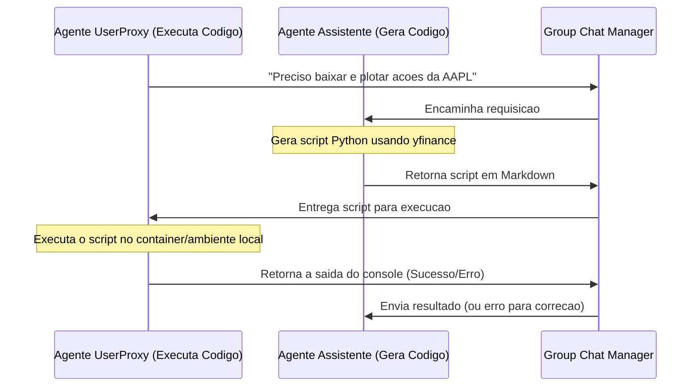
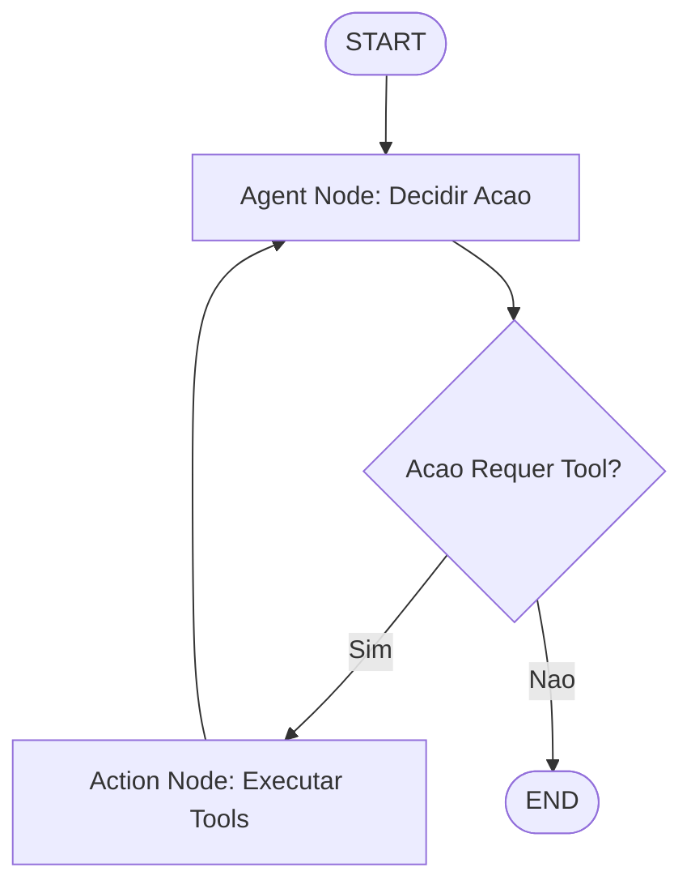

# Arquiteturas Multi-Agente: CrewAI, AutoGen e LangGraph

A evolucao dos sistemas de inteligência artificial nos levou da engenharia de prompts isolados para sistemas complexos onde multiplos agentes cooperam para resolver problemas de grande escala. Para estruturar essas interacoes, surgiram diferentes frameworks de orquestracao. Este documento analisa detalhadamente as tres principais arquiteturas do mercado: **CrewAI**, **AutoGen** (Microsoft) e **LangGraph** (LangChain), detalhando seus padroes de projeto, modelos de estado, fluxos de conversacao e implementacao pratica.

---

## 1. Visao Geral e Paradigmas Fundamentais

Cada framework adota uma abordagem filosofica distinta para resolver o problema da orquestracao:

| Framework | Paradigma Central | Modelo de Estado | Flexibilidade | Complexidade | Caso de Uso Ideal |
| :--- | :--- | :--- | :--- | :--- | :--- |
| **CrewAI** | Role-Based Collaboration | Centralizado / Sequencial ou Hierarquico | Media-Baixa | Baixa | Automatizacao de processos de negocio lineares (ex: geracao de relatorios, pesquisa e redacao). |
| **AutoGen** | Conversational Multi-Agents | Distribuido / Historico de Conversa | Media-Alta | Media | Resolucao colaborativa de problemas complexos baseada em chat, depuracao de codigo e simulacao de debate. |
| **LangGraph** | State Graphs / Event-Driven | Grafo de Estados Explicito e Centralizado | Altissima | Alta | Workflows deterministicos com loops complexos, tomadas de decisao condicionais, e necessidade de controle estrito (ex: codificacao autonoma). |

---

## 2. CrewAI: Colaboracao Baseada em Papeis e Tarefas

O **CrewAI** e projetado em torno do conceito de uma equipe estruturada (Crew), composta por agentes com papeis (Roles), objetivos (Goals), e historias de fundo (Backstories) especificas. A orquestracao e orientada a **tarefas (Tasks)**, onde a saida de uma tarefa serve como entrada para a proxima.



### Principais Caracteristicas do CrewAI:
1. **Hierarquia e Processos**: Suporta processos sequenciais (execucao na ordem das tarefas) e hierarquicos (um agente "Gerente" distribui as tarefas e valida as entregas).
2. **Delegacao Automatizada**: Agentes podem, de forma autonoma, delegar tarefas e fazer perguntas para outros agentes na equipe, desde que essa opcao esteja habilitada.
3. **Integracao de Tools**: Facil acoplamento de ferramentas do LangChain e ferramentas customizadas.

### Exemplo Pratico (Python): CrewAI Sequencial

```python
from crewai import Agent, Task, Crew, Process
from langchain_openai import ChatOpenAI

# Definir o LLM
llm = ChatOpenAI(model="gpt-4o", temperature=0.2)

# Criar Agentes
pesquisador = Agent(
    role="Pesquisador de Mercado Senior",
    goal="Identificar as 3 principais tendencias de IA no setor financeiro para 2026",
    backstory="Voce e um analista experiente especializado em tecnologia emergente e financas corporativas.",
    verbose=True,
    llm=llm
)

escritor = Agent(
    role="Redator Tecnico",
    goal="Escrever um artigo informativo e conciso sobre as tendencias encontradas",
    backstory="Voce e um redator habilidoso que transforma dados complexos em artigos cativantes e de facil leitura.",
    verbose=True,
    llm=llm
)

# Definir Tarefas
tarefa_pesquisa = Task(
    description="Analise relatorios recentes e identifique as 3 maiores mudancas em IA financeira para 2026.",
    expected_output="Uma lista com 3 topicos detalhados, incluindo estatisticas e exemplos de aplicacao.",
    agent=pesquisador
)

tarefa_escrita = Task(
    description="Escreva um artigo de blog com base na lista de tendencias gerada pela pesquisa.",
    expected_output="Artigo formatado em Markdown com introducao, corpo estruturado e conclusao.",
    agent=escritor
)

# Criar Equipe (Crew)
equipe = Crew(
    agents=[pesquisador, escritor],
    tasks=[tarefa_pesquisa, tarefa_escrita],
    process=Process.sequential,
    verbose=True
)

# Iniciar Execucao
resultado = equipe.kickoff()
print(resultado)
```

---

## 3. AutoGen: Agentes Conversacionais e Execucao de Codigo

O **AutoGen** da Microsoft e estruturado com base em agentes que se comunicam enviando mensagens uns aos outros dentro de uma sala de chat. O estado e mantido na forma de um **historico de conversa (Chat History)** compartilhado ou privado.



### Principais Caracteristicas do AutoGen:
1. **User Proxy Agent**: Um agente especial que age em nome do usuario humano, podendo executar codigo gerado por outros agentes em um ambiente seguro (Docker ou bash local) de forma automatica ou sob consentimento.
2. **Conversacao Multi-Direcional**: Permite interacoes dinamicas, como debates, rodadas de feedback e chats em grupo gerenciados por um `GroupChatManager`.
3. **Customizacao de Conversa**: Possibilidade de programar transicoes personalizadas entre agentes usando grafos de transicao ou roteamento baseado em regras.

### Exemplo Pratico (Python): AutoGen com Execucao de Codigo

```python
import autogen

config_list = [
    {
        "model": "gpt-4o",
        "api_key": "sua-chave-api-aqui"
    }
]

# Configurar o Agente Assistente (Gera Codigo/Solucoes)
assistente = autogen.AssistantAgent(
    name="programador",
    llm_config={"config_list": config_list, "temperature": 0.0}
)

# Configurar o Agente UserProxy (Executa Codigo e interage com o humano)
user_proxy = autogen.UserProxyAgent(
    name="executador",
    human_input_mode="NEVER",  # Executa sem perguntar ao usuario
    max_consecutive_auto_reply=5,
    is_termination_msg=lambda x: x.get("content", "").rstrip().endswith("TERMINATE"),
    code_execution_config={
        "work_dir": "scratch",
        "use_docker": False  # Use True em producao para seguranca
    }
)

# Iniciar Conversa
user_proxy.initiate_chat(
    assistente,
    message="Escreva um script Python para buscar o preco atual da acao da Google (GOOGL) e salve em 'preco.txt'"
)
```

---

## 4. LangGraph: Grafos de Estado e Controle Deterministico

O **LangGraph** extende a biblioteca LangChain introduzindo a capacidade de criar grafos ciclicos para modelagem de workflows de agentes. Ele e fortemente focado no controle de estados atraves de **State Graphs**, onde o desenvolvedor define explicitamente os **Nodes** (processamento/agentes), os **Edges** (fluxos de transicao deterministica) e os **Conditional Edges** (roteamento dinamico baseado no estado).



### Principais Caracteristicas do LangGraph:
1. **Estado Central Persistente**: O estado do grafo (`AgentState`) e uma estrutura de dados definida explicitamente e atualizada por cada node atraves de reducers.
2. **Ciclos e Loops Reais**: Diferente de cadeias lineares (DAGs), permite a criacao de loops complexos (ex: ReAct loop) com controle absoluto do fluxo.
3. **Human-in-the-Loop Nativo**: Capacidade de pausar a execucao do grafo antes de executar um node especifico (ex: aprovar escrita em banco de dados), permitindo que um humano edite o estado e retome a execucao (Time-Travel).

### Exemplo Pratico (Python): LangGraph ReAct Loop

```python
from typing import TypedDict, Annotated, Sequence
import operator
from langgraph.graph import StateGraph, END, START
from langchain_core.messages import BaseMessage, HumanMessage, AIMessage
from langchain_openai import ChatOpenAI

# 1. Definir o Estado do Grafo
class AgentState(TypedDict):
    # O operador add concatena novas mensagens na lista existente
    messages: Annotated[Sequence[BaseMessage], operator.add]
    needs_tools: bool

llm = ChatOpenAI(model="gpt-4o-mini", temperature=0.1)

# 2. Definir os Nodes (Nos)
def call_model(state: AgentState):
    messages = state["messages"]
    response = llm.invoke(messages)
    
    # Decisao ficticia sobre chamar ferramenta
    needs_tools = "buscar" in response.content.lower()
    
    return {"messages": [response], "needs_tools": needs_tools}

def execute_tool(state: AgentState):
    # Simula execucao de ferramenta de busca
    tool_result = AIMessage(content="[Resultado da Busca]: Temperatura atual em Sao Paulo e 22C.")
    return {"messages": [tool_result], "needs_tools": False}

# 3. Definir a Logica de Roteamento (Conditional Edge)
def router(state: AgentState):
    if state["needs_tools"]:
        return "tool_node"
    return END

# 4. Construir o Grafo
workflow = StateGraph(AgentState)

# Adicionar Nos
workflow.add_node("agent_node", call_model)
workflow.add_node("tool_node", execute_tool)

# Adicionar Conexoes (Edges)
workflow.add_edge(START, "agent_node")
workflow.add_conditional_edges(
    "agent_node",
    router,
    {
        "tool_node": "tool_node",
        END: END
    }
)
workflow.add_edge("tool_node", "agent_node")

# Compilar o Grafo
app = workflow.compile()

# Executar
estado_inicial = {"messages": [HumanMessage(content="Preciso buscar a temperatura de Sao Paulo")]}
resultado = app.invoke(estado_inicial)

for msg in resultado["messages"]:
    print(f"{type(msg).__name__}: {msg.content}")
```

---

## 5. Comparacao Profunda de Recursos

### A. Estado e Memoria
* **CrewAI**: Possui memoria centralizada para a equipe (long-term, short-term, episodic). No entanto, o estado da execucao e linear e rigidamente definido pelas tarefas (`Task` sequenciais ou hierarquicas).
* **AutoGen**: O estado reside na conversa (`Chat`). Os agentes atualizam seus conhecimentos a partir do fluxo de mensagens enviadas. Pode sofrer com o inchaco do contexto em longos debates, exigindo estrategias de compressao e resumo de historico.
* **LangGraph**: O estado e um objeto estatico e tipado (`TypedDict` ou classe Pydantic). Cada no deve retornar as alteracoes (deltas) do estado, que sao consolidadas via operadores (`reducers`). Extremamente escalavel para sistemas complexos.

### B. Arquiteturas de Redes de Agentes
* **Hierarquia**: 
  - **CrewAI**: Suporta nativamente atraves do parametro `manager_llm`.
  - **AutoGen**: Implementado via `GroupChatManager`.
  - **LangGraph**: Implementado criando grafos aninhados (sub-grafos rodando como nos de um grafo pai).
* **Event-Driven**:
  - **LangGraph** e o unico que opera nativamente como maquina de estados orientada a eventos, reagindo a mudancas especificas do estado.

---

## 6. Padroes Hibridos e Recomendacoes de Projeto

Para o desenvolvimento do **PROJECT_JARVIS_5.0**, a combinacao dessas ferramentas pode ser a melhor escolha:
* Use **LangGraph** como a espinha dorsal orquestradora (sistema de controle geral, roteador de tarefas e controle de seguranca).
* Use **CrewAI** para executar tarefas secundarias que exigem equipes especializadas de papel fixo (ex: documentar um modulo gerado pelo desenvolvedor).
* Use padroes de **AutoGen** quando for necessario criar um sandbox de execucao de codigo iterativo com feedback de erros do console diretamente para o LLM.

---

## Conexoes do Vault
* [[05-Skills/skills/01-agentic-intelligence/INDEX|Indice de Inteligencia Agentica]]
* [[05-Skills/skills/01-agentic-intelligence/multi-agent-orchestration|Orquestracao Multi-Agente e Pipelines de Subagentes]]
* [[05-Skills/skills/01-agentic-intelligence/advanced-reasoning-patterns|Padroes de Raciocinio Avancados]]
* [[05-Skills/skills/03-infrastructure-mcp/mcp-avancado-e-ferramentas-dinamicas|MCP Avancado e Ferramentas Dinamicas]]
* [[05-Skills/skills/01-agentic-intelligence/avaliacao-seguranca-de-agentes|Avaliacao e Seguranca de Agentes de IA]]
