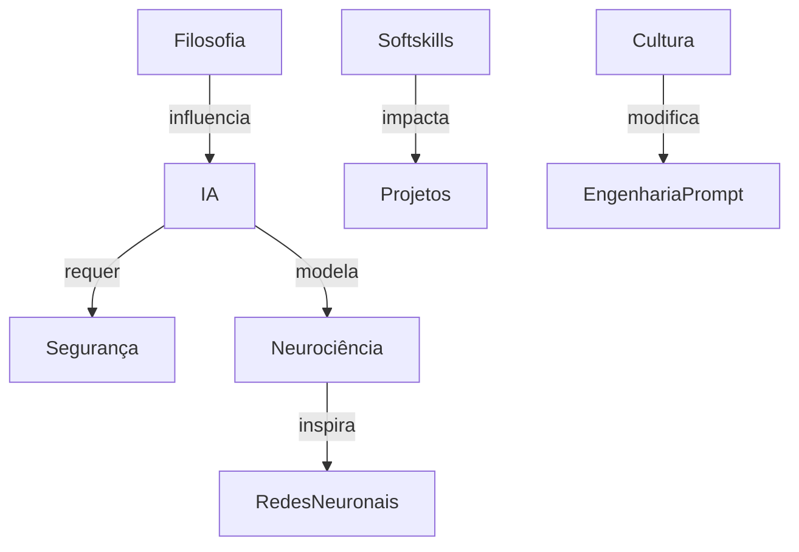

# Mapa Visual de Dependências (Mermaid/Obsidian Graph)

## Instruções
- Cole o bloco Mermaid em qualquer arquivo Markdown do vault para visualização.
- Edite os nós e relações conforme expansão do seu conhecimento.

## Exemplo de Mapa de Dependências

## Dicas
- O Obsidian também suporta visualização automática via “Graph view”, baseada nos links internos.
- Refine as conexões sempre que relacionar novos tópicos interdisciplinares.

## Recursos
- [Mermaid.js Docs](https://mermaid-js.github.io/mermaid/#/)
- [Graph View (Obsidian)](https://help.obsidian.md/Plugins/Graph+view)

---
Replique e expanda este template para qualquer novo domínio ou projeto interligado.