---
title: "🌌 Astronomia Fundamental"
aliases:
  - Fundamentos de Astronomia
  - Astronomia Teórica
tags:
  - astronomia
  - fundamental
  - historia
  - observacao
  - python
  - exercicios
created: 2026-05-18
modified: 2026-05-18
---

# 🌌 Astronomia Fundamental

> *"A astronomia compels a alma a olhar para cima e nos leva deste mundo a outro."* — Platão

---

## 📑 Sumário

1. Introdução Teórica
   - História da Astronomia
     - Ptolomeu e o Modelo Geocêntrico
     - Copérnico e a Revolução Heliocêntrica
     - Galileu e o Telescópio
     - Kepler e as Leis do Movimento Planetário
     - Newton e a Gravitação Universal
     - Hubble e a Expansão do Universo
     - Einstein e a Relatividade
   - Métodos de Observação
   - Espectroscopia
   - Telescópios (Ópticos, Rádio, Infravermelho, Raios-X, Raios Gama)
2. Bibliografia Comentada
   - Hawking — Uma Breve História do Tempo
   - Sagan — Cosmos
   - Greene — O Tecido do Cosmos
   - Tyson — Astrofísica para Apressados
   - Artigos do James Webb
   - Papers ESA/NASA
3. Código Python
   - Simulação de Órbitas Planetárias (Leis de Kepler)
   - Cálculo de Distâncias Astronômicas (Paralaxe)
   - Análise de Espectros
   - Simulação de Redshift e Cosmologia
4. Exercícios Resolvidos
   - Distância por Paralaxe
   - Órbita Elíptica de Marte
   - Redshift de uma Galáxia
   - Massa de Exoplaneta por Trânsito
5. Cross-mapping Mermaid (Física, Matemática, Química, Filosofia, Computação, Biologia)
6. Discussão Crítica
7. Recursos

---

## Introdução Teórica

### História da Astronomia

A astronomia é a mais antiga das ciências naturais. Desde as primeiras civilizações, a humanidade olha para os céus buscando padrões, significados e leis que regem o movimento dos astros. O que começou como observação a olho nu evoluiu para uma disciplina que utiliza instrumentos sofisticados, física avançada e computação de ponta para desvendar os segredos do cosmos.

#### Ptolomeu e o Modelo Geocêntrico

Cláudio Ptolomeu (c. 100-170 d.C.) foi o maior astrônomo da antiguidade clássica. Sua obra magna, o **Almagesto**, compilou e expandiu o conhecimento astronômico grego por mais de 1400 anos. O modelo ptolomaico colocava a **Terra no centro do universo**, com todos os corpos celestes orbitando ao seu redor em esferas cristalinas.

Para explicar o movimento retrógrado dos planetas (quando um planeta parece mover-se para trás no céu), Ptolomeu introduziu os **epiciclos** — pequenos círculos sobrepostos aos círculos maiores (deferentes) das órbitas planetárias. Este sistema, embora complexo e cada vez mais artificial, conseguia prever posições planetárias com razoável precisão para a época.

O modelo geocêntrico dominou o pensamento ocidental até o século XVI, não apenas por sua utilidade prática, mas também por sua compatibilidade com a teologia cristã, que colocava a humanidade (e portanto a Terra) no centro da criação divina.

**Limitações do modelo ptolomaico:**
- Complexidade crescente com a adição de mais epiciclos
- Incapacidade de explicar fases de Vênus
- Impossibilidade de determinar distâncias relativas
- Inconsistências com observações cada vez mais precisas

#### Copérnico e a Revolução Heliocêntrica

Nicolau Copérnico (1473-1543) publicou **"De Revolutionibus Orbium Coelestium"** (Sobre as Revoluções das Esferas Celestes) no ano de sua morte, 1543. Nesta obra revolucionária, Copérnico propôs que:

1. O **Sol**, não a Terra, estava no centro do universo
2. A Terra girava sobre seu próprio eixo (movimento de rotação)
3. A Terra e os demais planetas orbitavam o Sol (movimento de translação)
4. O movimento retrógrado dos planetas era um efeito de perspectiva, não um movimento real

O modelo copernicano era mais simples que o ptolomaico, explicando naturalmente fenômenos como as estações do ano e o movimento retrógrado. No entanto, ainda mantinha órbitas circulares perfeitas, o que exigia ajustes com pequenos epiciclos para corresponder às observações.

**Impacto da revolução copernicana:**
- Deslocou a humanidade do centro do cosmos
- Iniciou o processo de secularização da ciência
- Preparou o terreno para Kepler, Galileu e Newton
- Enfrentou forte oposição da Igreja Católica (o livro foi colocado no Index em 1616)

#### Galileu e o Telescópio

Galileu Galilei (1564-1642) foi o pai da astronomia observacional moderna. Em 1609, ao aperfeiçoar o telescópio recém-inventado, Galileu fez descobertas que abalariam os alicerces da cosmologia aristotélica:

**Descobertas de Galileu:**
1. **Montanhas e crateras na Lua** — a Lua não era uma esfera perfeita e lisa
2. **As fases de Vênus** — evidência direta de que Vênus orbitava o Sol
3. **As luas de Júpiter** — corpos celestes orbitavam outro planeta, não a Terra
4. **As manchas solares** — o Sol não era perfeito e imutável
5. **A Via Láctea** era composta por inúmeras estrelas

Galileu também estudou o movimento de corpos em queda, estabelecendo as bases da mecânica clássica. Sua defesa pública do modelo copernicano levou a um confronto com a Igreja Católica, resultando em sua condenação em 1633 e prisão domiciliar até sua morte.

**Contribuições metodológicas:**
- Ênfase na observação empírica
- Uso de matemática para descrever fenômenos naturais
- Experimentação controlada
- Publicação em vernáculo (italiano) para atingir público mais amplo

#### Kepler e as Leis do Movimento Planetário

Johannes Kepler (1571-1630) foi o astrônomo que descobriu as leis matemáticas que governam o movimento planetário. Trabalhando com os dados precisos de Tycho Brahe, Kepler abandonou a ideia milenar de órbitas circulares perfeitas.

**Primeira Lei (1609) — Lei das Órbitas Elípticas:**
> *"Cada planeta se move ao redor do Sol em uma órbita elíptica, com o Sol em um dos focos."*

A fórmula matemática de uma elipse em coordenadas polares é:

r(\theta) = \frac{a(1-e^2)}{1 + e\cos\theta}

Onde:
- $ = distância do planeta ao Sol
- $ = semieixo maior da órbita
- $ = excentricidade orbital
- $\theta$ = anomalia verdadeira (ângulo)

**Segunda Lei (1609) — Lei das Áreas:**
> *"O segmento de reta que liga o planeta ao Sol varre áreas iguais em intervalos de tempo iguais."*

Matematicamente:

\frac{dA}{dt} = \frac{L}{2m} = \text{constante}

Onde $ é o momento angular orbital e $ a massa do planeta. Isso implica que um planeta move-se mais rapidamente quando está no **periélio** (ponto mais próximo do Sol) e mais lentamente no **afélio** (ponto mais distante).

**Terceira Lei (1619) — Lei dos Períodos:**
> *"O quadrado do período orbital de um planeta é proporcional ao cubo do semieixo maior de sua órbita."*

T^2 \propto a^3
T^2 = \frac{4\pi^2}{GM_{\odot}} a^3

Onde $ é o período orbital, $ o semieixo maior, $ a constante gravitacional e {\odot}$ a massa do Sol.

**Aplicações das leis de Kepler:**
- Cálculo de órbitas de planetas, asteroides e cometas
- Determinação de massas estelares em sistemas binários
- Caracterização de exoplanetas
- Mecânica orbital para missões espaciais

#### Newton e a Gravitação Universal

Isaac Newton (1643-1727) unificou a mecânica celeste e terrestre com sua **Lei da Gravitação Universal** (1687, Principia Mathematica). Newton demonstrou que as leis de Kepler decorrem naturalmente da força da gravidade:

F = G \frac{m_1 m_2}{r^2}

Onde:
- $ = força gravitacional entre dois corpos
- $ = constante gravitacional (6.674 × 10⁻¹¹ N·m²/kg²)
- , m_2$ = massas dos corpos
- $ = distância entre os centros dos corpos

**Consequências da lei de Newton:**
1. **Derivação das leis de Kepler** — a Terceira Lei ganha uma constante precisa
2. **Previsão de novos planetas** — Urano descoberto em 1781; Netuno previsto por perturbações orbitais e descoberto em 1846
3. **Cálculo de órbitas de cometas** — Halley previu o retorno do cometa em 1758
4. **Marés** — explicadas pela atração gravitacional diferencial da Lua e do Sol
5. **Precessão dos equinócios** — causada pelo torque gravitacional do Sol e da Lua sobre a Terra

**Limitações da gravitação newtoniana:**
- Não explicava a precessão do periélio de Mercúrio (explicada por Einstein)
- Requeria ação à distância sem mecanismo físico
- Velocidade infinita da gravidade (contradiz a relatividade)

#### Hubble e a Expansão do Universo

Edwin Hubble (1889-1953) fez duas descobertas fundamentais que transformaram nossa visão do cosmos:

**1. Universo além da Via Láctea (1923-1924):**
Usando a relação período-luminosidade das variáveis Cefeidas, Hubble calculou a distância da Nebulosa de Andrômeda (M31), demonstrando que estava muito além da Via Láctea — era uma galáxia independente.

**2. Lei de Hubble (1929):**
Hubble descobriu que as galáxias se afastam umas das outras com velocidade proporcional à sua distância:

v = H_0 \cdot d

Onde:
- $ = velocidade de recessão da galáxia
- $ = constante de Hubble (≈ 70 km/s/Mpc)
- $ = distância até a galáxia

**Redshift cosmológico:**
O deslocamento para o vermelho (redshift) $ está relacionado à velocidade de recessão por:

z = \frac{\lambda_{\text{observado}} - \lambda_{\text{emitido}}}{\lambda_{\text{emitido}}} \approx \frac{v}{c}

Para  \ll 1$. Em distâncias cosmológicas, usamos a fórmula relativística completa:

1 + z = \sqrt{\frac{1 + v/c}{1 - v/c}}

A Lei de Hubble implica que o universo está se expandindo, levando à conclusão inevitável de que o universo teve um **início** — o Big Bang.

**Valor atual da constante de Hubble:**
- Planck 2018:  = 67.4 \pm 0.5$ km/s/Mpc
- SH0ES (cefeidas + supernovas):  = 73.2 \pm 1.3$ km/s/Mpc
- A **tensão de Hubble** — discrepância entre esses valores — é um dos maiores problemas da cosmologia moderna

#### Einstein e a Relatividade

Albert Einstein (1879-1955) revolucionou nossa compreensão do espaço, tempo e gravidade com duas teorias:

**Relatividade Restrita (1905):**
- A velocidade da luz é constante para todos os observadores inerciais
- Espaço e tempo são relativos ao referencial do observador
-  = mc^2$ — equivalência entre massa e energia
- Dilatação temporal e contração espacial em altas velocidades

**Relatividade Geral (1915):**
A gravidade não é uma força, mas uma **curvatura do espaço-tempo** causada pela presença de massa e energia:

G_{\mu\nu} + \Lambda g_{\mu\nu} = \frac{8\pi G}{c^4} T_{\mu\nu}

Onde:
- {\mu\nu}$ = tensor de Einstein (curvatura do espaço-tempo)
- $\Lambda$ = constante cosmológica
- {\mu\nu}$ = tensor métrico
- {\mu\nu}$ = tensor energia-momento (matéria e energia)
- $ = constante gravitacional
- $ = velocidade da luz

**Predições confirmadas da Relatividade Geral:**
1. **Precessão do periélio de Mercúrio** — 43 segundos de arco por século
2. **Curvatura da luz por campos gravitacionais** — confirmada por Eddington em 1919
3. **Lentes gravitacionais** — usadas para detectar matéria escura e galáxias distantes
4. **Ondas gravitacionais** — detectadas pelo LIGO em 2015 (Prêmio Nobel 2017)
5. **Buracos negros** — previstos por Schwarzschild em 1916, imageados pelo EHT em 2019
6. **Dilatação temporal gravitacional** — GPS deve corrigir efeitos relativísticos
7. **Cosmologia** — universos em expansão, Big Bang, singularidades

**Buracos negros na Relatividade Geral:**
A solução de Schwarzschild descreve um buraco negro não rotacional:

ds^2 = -\left(1 - \frac{2GM}{rc^2}\right)c^2 dt^2 + \left(1 - \frac{2GM}{rc^2}\right)^{-1} dr^2 + r^2 d\Omega^2

O raio de Schwarzschild (horizonte de eventos) é:

r_s = \frac{2GM}{c^2}

Para o Sol,  \approx 3$ km. Para a Terra,  \approx 9$ mm.

---

### Métodos de Observação

A astronomia moderna utiliza uma variedade de métodos para coletar informação do cosmos. Cada método revela diferentes aspectos dos objetos celestes.

**1. Astrometria:**
Medição precisa das posições e movimentos de estrelas e outros corpos celestes.
- Missão Gaia (ESA) — mede posições, paralaxes e velocidades de ~2 bilhões de estrelas
- Precisão: microssegundos de arco (µas)
- Aplicações: catálogos estelares, detecção de exoplanetas, dinâmica galáctica

**2. Fotometria:**
Medição da intensidade da luz em diferentes bandas espectrais.
- Magnitude aparente:  = -2.5 \log_{10}(F) + C$
- Magnitude absoluta:  = m - 5 \log_{10}(d/10\text{ pc})$
- Diagrama HR: temperatura vs. luminosidade
- Curvas de luz: variação temporal do brilho

**3. Espectroscopia:**
Decomposição da luz em seus comprimentos de onda constituintes.
- Linhas de emissão e absorção
- Deslocamento Doppler (velocidade radial)
- Composição química
- Temperatura e pressão atmosférica
- Campos magnéticos (efeito Zeeman)

**4. Polarimetria:**
Medição da polarização da luz.
- Campos magnéticos interestelares
- Discos protoplanetários
- Meio interestelar

**5. Interferometria:**
Combinação de múltiplos telescópios para obter resolução equivalente a um telescópio do tamanho da distância entre eles.
- Event Horizon Telescope — imageou o buraco negro M87*
- VLBI (Very Long Baseline Interferometry)
- ALMA — 66 antenas no Chile

**6. Astrofísica de Multimensageiros:**
Combinação de diferentes "mensageiros" cósmicos:
- **Ondas eletromagnéticas** — luz em todos os comprimentos de onda
- **Ondas gravitacionais** — perturbações no espaço-tempo
- **Neutrinos** — partículas quase sem massa
- **Raios cósmicos** — partículas de alta energia

**7. Astronomia de Campo Amplo:**
Levantamentos sistemáticos do céu:
- SDSS (Sloan Digital Sky Survey) — milhões de galáxias
- LSST/Vera Rubin — 20 TB por noite
- Pan-STARRS — busca de asteroides perigosos
- ZTF (Zwicky Transient Facility) — eventos transitórios

---

### Espectroscopia

A espectroscopia é talvez a ferramenta mais poderosa da astrofísica. Ao decompor a luz de um objeto celeste, podemos determinar sua composição química, temperatura, densidade, campo magnético e movimento.

**Princípios físicos:**

1. **Espectro contínuo** — emitido por corpos opacos aquecidos (aproximação de corpo negro)
   B_\lambda(T) = \frac{2hc^2}{\lambda^5} \frac{1}{e^{hc/\lambda k_B T} - 1}

2. **Espectro de emissão** — linhas brilhantes emitidas por gases quentes e rarefeitos
3. **Espectro de absorção** — linhas escuras quando a luz de um corpo negro atravessa um gás mais frio

**Lei de Wien (temperatura):**
\lambda_{\text{max}} = \frac{b}{T}, \quad b = 2.898 \times 10^{-3} \text{ m·K}

**Lei de Stefan-Boltzmann (luminosidade):**
L = 4\pi R^2 \sigma T^4, \quad \sigma = 5.670 \times 10^{-8} \text{ W·m}^{-2}\text{·K}^{-4}

**Efeito Doppler:**
\frac{\Delta \lambda}{\lambda_0} = \frac{v}{c}

**Classificação espectral estelar (OBAFGKM):**

| Tipo | Temperatura (K) | Cor | Características | Exemplo |
|------|-----------------|-----|-----------------|---------|
| O | >30.000 | Azul | He II, Si IV | Zeta Puppis |
| B | 10.000-30.000 | Azul-branco | He I, H | Rigel |
| A | 7.500-10.000 | Branco | H forte | Vega, Sirius |
| F | 6.000-7.500 | Amarelo-branco | Ca II, H moderado | Procyon |
| G | 5.200-6.000 | Amarelo | Ca II forte | **Sol** |
| K | 3.700-5.200 | Laranja | Metais, moléculas | Arcturus |
| M | <3.700 | Vermelho | TiO, moléculas | Betelgeuse |

**Efeito Zeeman (campos magnéticos):**
A presença de um campo magnético causa o desdobramento das linhas espectrais:

\Delta E = \mu_B g B

Onde $\mu_B$ é o magneton de Bohr, $ o fator de Landé e $ a intensidade do campo magnético.

---

### Telescópios

#### Telescópios Ópticos

Os telescópios ópticos coletam e focam a luz visível para observar objetos celestes.

**Refratores (lentes):**
- Usam lentes objetivas para refratar a luz
- Sofrem de aberração cromática
- Limitação física: lentes grandes são difíceis de fabricar
- Exemplo: Refrator de Yerkes (1.02 m, maior do mundo)

**Refletores (espelhos):**
- Usam espelhos para refletir e focar a luz
- Sem aberração cromática
- Espelhos podem ser muito maiores que lentes
- Tipos: Newtoniano, Cassegrain, Ritchey-Chrétien

**Telescópios modernos:**
- **VLT (Very Large Telescope)** — 4 × 8.2 m, Chile
- **Keck** — 2 × 10 m, Havaí
- **GTC** — 10.4 m, Espanha (La Palma)
- **ELT (Extremely Large Telescope)** — 39.3 m, Chile (2028)
- **GMT (Giant Magellan Telescope)** — 24.5 m, Chile
- **TMT (Thirty Meter Telescope)** — 30 m, Havaí

**Óptica adaptativa:**
Sistemas que corrigem em tempo real a distorção atmosférica usando estrelas-guia e espelhos deformáveis. Permite que telescópios terrestres atinjam resolução próxima ao limite de difração.

#### Rádio Telescópios

Detectam ondas de rádio (comprimentos de onda de mm a km) emitidas por objetos celestes.

**Princípios:**
- A radiação síncrotron é emitida por elétrons relativísticos em campos magnéticos
- Linhas espectrais de rádio: HI (21 cm), CO (2.6 mm), OH (18 cm)
- Moléculas interestelares são detectadas em rádio

**Principais instrumentos:**
- **FAST** (Five-hundred-meter Aperture Spherical Telescope) — 500 m, China
- **Green Bank Telescope** — 100 m, EUA
- **VLA (Very Large Array)** — 27 antenas de 25 m, Novo México
- **ALMA (Atacama Large Millimeter/submillimeter Array)** — 66 antenas, Chile
- **LOFAR (LOw Frequency ARray)** — Países Baixos
- **SKA (Square Kilometre Array)** — África do Sul + Austrália (em construção)

**Descobertas importantes:**
- Rotação da Via Láctea (21 cm)
- Pulsares (Bell & Hewish, 1967)
- Radiação cósmica de fundo (Penzias & Wilson, 1965)
- Moléculas orgânicas no espaço

#### Infravermelho

A astronomia infravermelha observa radiação entre ~0.7 µm e 1 mm, essencial para:
- Observar regiões de formação estelar obscurecidas por poeira
- Estudar estrelas frias (anãs marrons, gigantes vermelhas)
- Observar galáxias com alto redshift (luz desviada para o IR)
- Caracterizar atmosferas de exoplanetas

**Telescópios infravermelhos:**
- **JWST (James Webb Space Telescope)** — 6.5 m, órbita L2, 0.6-28.3 µm
- **WISE/NEOWISE** — levantamento infravermelho

**Desafios técnicos:**
- Telescópios devem ser resfriados para evitar radiação infravermelha própria
- A atmosfera absorve grande parte do IR (observa-se do espaço ou alta altitude)

#### Raios-X

A astronomia de raios-X (0.1-100 keV) observa os fenômenos mais energéticos do universo:
- Buracos negros acretores (binárias de raios-X, núcleos ativos de galáxias)
- Estrelas de nêutrons e pulsares
- Restos de supernovas (Crab, Cas A, SN 1987A)
- Gás quente em aglomerados de galáxias (10⁷-10⁸ K)

**Princípios físicos:**
- Bremsstrahlung (radiação de freamento) em plasmas quentes
- Radiação de corpo negro em superfícies de estrelas de nêutrons (~10⁶ K)
- Emissão síncrotron em jatos relativísticos
- Linhas de emissão de íons altamente ionizados (Fe XXV, Fe XXVI)

**Missões:**
- **Chandra** (NASA, 1999-) — resolução angular de 0.5"
- **XMM-Newton** (ESA, 1999-)
- **NuSTAR** (NASA, 2012-) — raios-X duros (3-79 keV)
- **XRISM** (JAXA/NASA, 2023-)
- **eROSITA** (2020, em órbita L2)

#### Raios Gama

A astronomia de raios gama (>100 keV) observa os processos mais extremos:
- Explosões de raios gama (GRBs) — as explosões mais energéticas do universo
- Pulsares de raios gama (Crab, Vela)
- Núcleos ativos de galáxias (blazares)
- Matéria escura (possíveis sinais de aniquilação)

**Missões:**
- **Fermi** (NASA, 2008-) — Large Area Telescope, monitor de GRBs
- **INTEGRAL** (ESA, 2002-)
- **Swift** (NASA, 2004-) — resposta rápida a GRBs
- **HESS, MAGIC, VERITAS** — telescópios Cherenkov terrestres
- **CTA (Cherenkov Telescope Array)** — próxima geração

**Física de raios gama:**
- Decaimento radioativo de núcleos (⁵⁶Ni, ⁵⁶Co em supernovas)
- Aniquilação pósitron-elétron (511 keV)
- Interações de raios cósmicos com o meio interestelar
- Produção de pares em campos magnéticos intensos

---

## Bibliografia Comentada

### Hawking — Uma Breve História do Tempo

**Stephen Hawking (1988)**

*"Uma Breve História do Tempo: Do Big Bang aos Buracos Negros"* é provavelmente o livro de divulgação científica mais vendido de todos os tempos, com mais de 25 milhões de cópias em dezenas de idiomas.

**Estrutura da obra:**
1. **Cosmologia antiga** — Aristóteles, Ptolomeu, Copérnico, Galileu
2. **Expansão do universo** — Hubble, Big Bang
3. **Incerteza quântica** — Princípio da Incerteza de Heisenberg
4. **Partículas elementares** — Modelo Padrão, antipartículas
5. **Buracos negros** — formação, propriedades, singularidades
6. **Buracos negros não são tão negros** — Radiação Hawking (1974)
7. **Origem e destino do universo** — inflação, setas do tempo
8. **Teoria de Tudo** — unificação da relatividade geral com a mecânica quântica

**Conceitos-chave apresentados:**
- **Radiação Hawking:** Buracos negros emitem radiação térmica devido a efeitos quânticos próximos ao horizonte de eventos. A temperatura é  = \frac{\hbar c^3}{8\pi GM k_B}$. Um buraco negro de massa solar teria temperatura de ~60 nK; buracos negros primordiais menores poderiam evaporar em escalas de tempo cósmicas.
- **Setas do tempo:** Termodinâmica (entropia sempre aumenta), psicológica (lembramos do passado, não do futuro), cosmológica (universo se expande).
- **Princípio Antrópico:** O universo parece "ajustado" para a vida. Versão fraca: estamos aqui, então as condições devem permitir nossa existência. Versão forte: o universo deve ter propriedades que permitam vida em algum estágio.

**Impacto:**
Popularizou a cosmologia moderna e inspirou uma geração de físicos. O livro trouxe conceitos de fronteira (singularidades, radiação Hawking, unificação) para o grande público com clareza e elegância.

### Sagan — Cosmos

**Carl Sagan (1980)**

*"Cosmos"* acompanhou a série de TV homônima, assistida por mais de 500 milhões de pessoas em 60 países. O livro vendeu mais de 5 milhões de cópias.

**Capítulos principais:**
1. À Beira do Oceano Cósmico
2. Uma Voz na Sinfonia Cósmica
3. A Harmonia dos Mundos
4. Céu e Inferno
5. Blues para um Planeta Vermelho
6. Histórias de Uma Viagem
7. O Ossário da Noite
8. Viagens no Tempo e no Espaço
9. A Vida das Estrelas
10. O Fim da Eternidade
11. A Persistência da Memória
12. Enciclopédia Galáctica

**Citações memoráveis:**
- "O cosmos é tudo o que existe, tudo o que já existiu e tudo o que ever existirá."
- "Em algum lugar, algo incrível está esperando para ser descoberto."
- "Somos feitos de matéria estelar."

**Legado:**
Sagan foi pioneiro na busca por inteligência extraterrestre (SETI), participou de missões planetárias (Mariner, Viking, Voyager) e foi fundamental na popularização da ciência.

### Greene — O Tecido do Cosmos

**Brian Greene (2004)**

*"O Tecido do Cosmos: Espaço, Tempo e a Textura da Realidade"* explora as questões fundamentais sobre a natureza do espaço e do tempo.

**Partes do livro:**
1. **A Fronteira do Real:** Einstein e a relatividade — espaço e tempo não são absolutos
2. **Origens Cósmicas:** Big Bang, inflação, multiverso — inflação cósmica resolve problemas do Big Bang padrão
3. **Revolução Quântica:** Mecânica quântica e realidade — dualidade onda-partícula, emaranhamento quântico
4. **Unificação:** Teoria das cordas e M-theory — partículas fundamentais são modos vibratórios de cordas

**Conceitos avançados:**
- **Emaranhamento quântico:** Partículas correlacionadas instantaneamente
- **Inflação eterna:** Algumas regiões do espaço-tempo continuam inflacionando
- **Dimensões extras:** A teoria das cordas requer 10 ou 11 dimensões
- **Holografia:** A informação de um volume de espaço codificada em sua superfície

### Tyson — Astrofísica para Apressados

**Neil deGrasse Tyson (2017)**

*"Astrofísica para Apressados"* é uma introdução concisa e acessível aos principais temas da astrofísica moderna.

**Capítulos:**
1. A Maior História do Mundo
2. Como Saber o Que Sabemos
3. A Matéria do Cosmos
4. Luzes, Estrelas, Ação
5. Buracos Negros e Outras Curiosidades
6. Sistemas Planetários e Exoplanetas
7. A Via Láctea e Suas Vizinhas
8. O Universo em Expansão
9. O Big Bang e a Radiação Cósmica de Fundo
10. Matéria Escura e Energia Escura
11. O Futuro do Universo

**Diferenciais:**
- Linguagem acessível e bem-humorada
- Ênfase no método científico
- Conexões com cultura pop
- Atualizado com descobertas recentes (LIGO, exoplanetas, JWST)

### Artigos do James Webb

O **James Webb Space Telescope (JWST)**, lançado em 25 de dezembro de 2021, é o observatório espacial mais poderoso já construído. Opera em órbita L2 (1.5 milhão de km da Terra) e observa no infravermelho (0.6-28.3 µm) com um espelho segmentado de 6.5 m de diâmetro.

**Artigos científicos fundamentais do JWST (2022-2026):**

1. **Galáxias no início do universo:**
   - *"JADES: JWST Advanced Deep Extragalactic Survey"* — descoberta de galáxias em z > 13, apenas 300 milhões de anos após o Big Bang
   - Essas galáxias são surpreendentemente massivas para sua época, desafiando modelos de formação galáctica

2. **Atmosferas de exoplanetas:**
   - *"Identification of carbon dioxide in an exoplanet atmosphere"* (JWST TRAPPIST-1 program)
   - Detecção de CO₂, H₂O, CH₄ em atmosferas de exoplanetas
   - Primeira detecção de fotossíntese reversa (sulfeto de dimetila — possível bioassinatura)

3. **Lentes gravitacionais:**
   - Abell 2744, SMACS 0723 — imagens ultraprofundas com ampliação gravitacional
   - Estrelas individuais em z ~ 6 (Earendel)

4. **Disco protoplanetários:**
   - Imagens detalhadas de discos protoplanetários na Nebulosa de Órion
   - Moléculas orgânicas complexas em regiões de formação estelar

5. **Supernovas e explosões estelares:**
   - Observação de SN 1987A em infravermelho com detalhes sem precedentes

### Papers ESA/NASA

**Artigos e relatórios fundamentais das agências espaciais:**

1. **Planck 2018 Results (ESA):**
   - Mapa da radiação cósmica de fundo com precisão sem precedentes
   -  = 67.4 \pm 0.5$ km/s/Mpc
   - Idade do universo: 13.787 ± 0.020 bilhões de anos
   - Parâmetros cosmológicos com precisão de <1%

2. **Gaia Data Release 3 (ESA, 2022):**
   - Posições, paralaxes e movimentos de 1.8 bilhão de estrelas
   - Catálogo de 813.000 estrelas binárias
   - 220.000 asteroides com órbitas precisas

3. **WMAP Nine-Year Results (NASA, 2012):**
   - Primeiro mapa detalhado da CMB
   - Confirmou o modelo ΛCDM
   - Evidência de inflação cósmica (flutuações gaussianas)

4. **Hubble eXtreme Deep Field (NASA/ESA):**
   - 10.000 galáxias em uma região do tamanho de um grão de areia

5. **LIGO-Virgo-KAGRA Collaboration (GWTC-3, 2023):**
   - Catálogo de 90 eventos de ondas gravitacionais
   - Fusões de buracos negros e estrelas de nêutrons
### 2. Cálculo de Distâncias Astronômicas (Paralaxe)

```python
import numpy as np
import matplotlib.pyplot as plt

AU = 1.495978707e11
PC = 3.085677581e16
LY = 9.4607304725808e15

class Paralaxe:
    @staticmethod
    def distancia_por_paralaxe(paralaxe_mas):
        d_pc = 1 / (paralaxe_mas / 1000)
        return {'pc': d_pc, 'ly': d_pc * 3.26156,
                'au': d_pc * 206265, 'm': d_pc * PC}

    @staticmethod
    def velocidade_tangencial(paralaxe_mas, mu_mas_ano):
        return 4.74 * mu_mas_ano / paralaxe_mas

    @staticmethod
    def paralaxe_espectroscopica(m, M):
        return 10 ** ((m - M) / 5 + 1)

def main():
    plx = Paralaxe()
    estrelas = [
        ('Proxima Centauri', 768.5),
        ('Alpha Centauri A', 747.1),
        ('Sirius', 379.2),
        ('Vega', 130.2),
        ('Arcturus', 88.8),
        ('Betelgeuse', 6.55),
    ]
    print(f"{'Estrela':20s} {'pi (mas)':10s} {'d (pc)':10s} {'d (ly)':10s}")
    print('-' * 52)
    for nome, pi in estrelas:
        d = plx.distancia_por_paralaxe(pi)
        print(f"{nome:20s} {pi:10.1f} {d['pc']:10.2f} {d['ly']:10.2f}")

if __name__ == '__main__':
    main()
```
### 3. Análise de Espectros

```python
import numpy as np
import matplotlib.pyplot as plt
from scipy.ndimage import gaussian_filter1d

class EspectroEstelar:
    LINHAS = {
        'H-alpha': (6562.8, 'Hidrogenio'),
        'H-beta': (4861.3, 'Hidrogenio'),
        'Ca II K': (3933.7, 'Calcio II'),
        'Na I D': (5889.9, 'Sodio I'),
    }

    def __init__(self, temperatura=5778, tipo='G2V', vr_km_s=0):
        self.T = temperatura
        self.tipo = tipo
        self.vr = vr_km_s
        self.lambdas = np.linspace(3000, 10000, 7000)
        self.continuo = self._corpo_negro(self.lambdas, self.T)
        self.continuo /= np.max(self.continuo)
        self.espectro = self._adicionar_linhas(self.continuo.copy())
        snr = 50
        self.espectro += np.random.normal(0, 1/snr, len(self.lambdas))
        self.espectro = gaussian_filter1d(self.espectro, sigma=2)

    def _corpo_negro(self, l, T):
        h, c, k = 6.626e-34, 2.998e8, 1.381e-23
        lm = l * 1e-10
        arg = np.minimum(h*c/(lm*k*T), 700)
        return (2*h*c**2)/(lm**5) * 1/(np.exp(arg)-1)

    def _adicionar_linhas(self, espectro):
        for nome, (lam0, elem) in self.LINHAS.items():
            lam_desl = lam0 * (1 + self.vr/299792.458)
            sigma = 2.0
            intensidade = 0.3 if 'H' in nome else 0.2
            gauss = intensidade * np.exp(-0.5*((self.lambdas-lam_desl)/sigma)**2)
            espectro -= gauss
        return espectro

    def analisar(self):
        print(f"Espectro tipo {self.tipo}, T={self.T}K")
        idx_max = np.argmax(self.espectro[100:-100]) + 100
        lam_max = self.lambdas[idx_max]
        T_wien = 2.898e6 / lam_max
        print(f"Temperatura (Wien): {T_wien:.0f} K")
        print(f"Velocidade radial simulada: {self.vr} km/s")

    def plotar(self):
        fig, ax = plt.subplots(figsize=(12, 5))
        ax.plot(self.lambdas, self.espectro, 'k-', lw=0.8)
        ax.plot(self.lambdas, self.continuo, 'r--', alpha=0.5, label='Continuo')
        for nome, (lam0, _) in self.LINHAS.items():
            ax.axvline(lam0, color='blue', alpha=0.3, linestyle=':')
            ax.text(lam0, 0.52, nome, rotation=90, fontsize=7, alpha=0.7)
        ax.set_xlabel('Comprimento de onda (Angstrom)')
        ax.set_ylabel('Intensidade')
        ax.set_title(f'Espectro Estelar — Tipo {self.tipo}, T={self.T}K')
        ax.grid(True, alpha=0.3); ax.legend(); plt.show()

if __name__ == '__main__':
    solar = EspectroEstelar(temperatura=5778, tipo='G2V', vr=12.5)
    solar.analisar(); solar.plotar()
    vega = EspectroEstelar(temperatura=9600, tipo='A0V', vr=-20.6)
    vega.analisar()
```
### 4. Simulação de Redshift e Cosmologia

```python
import numpy as np
import matplotlib.pyplot as plt
from scipy import integrate

class Cosmologia:
    def __init__(self, H0=67.4, Omega_m=0.315, Omega_L=0.685):
        self.H0 = H0
        self.Omega_m = Omega_m
        self.Omega_L = Omega_L
        self.c = 299792.458
        self.Gyr_s = 3.15576e16

    def E(self, z):
        return np.sqrt(self.Omega_m*(1+z)**3 + self.Omega_L)

    def distancia_comovente(self, z):
        def integrando(zp):
            return 1 / self.E(zp)
        result, _ = integrate.quad(integrando, 0, z)
        return self.c / self.H0 * result

    def distancia_luminosidade(self, z):
        return (1 + z) * self.distancia_comovente(z)

    def idade_universo(self, z):
        def integrando(zp):
            return 1 / ((1+zp) * self.E(zp))
        result, _ = integrate.quad(integrando, z, 1000)
        return result / (self.H0 * 1000 / 3.0857e22) / self.Gyr_s

    def modulo_distancia(self, z):
        return 5 * np.log10(self.distancia_luminosidade(z) * 1e6 / 10)

    def hubble_diagram(self, z_max=1.5):
        z_vals = np.linspace(0.01, z_max, 100)
        dL = [self.distancia_luminosidade(z) for z in z_vals]
        fig, ax = plt.subplots(figsize=(10, 6))
        ax.plot(z_vals, dL, 'b-', lw=2, label=r'd_L (dist. luminosidade)')
        ax.set_xlabel('Redshift (z)'); ax.set_ylabel('Distancia (Mpc)')
        ax.set_title('Diagrama de Hubble — Modelo LCDM')
        ax.grid(True, alpha=0.3); ax.legend(); plt.show()

def main():
    cosmo = Cosmologia()
    print(f"Parametros Cosmologicos (Planck 2018):")
    print(f"H0 = {cosmo.H0} km/s/Mpc")
    print(f"Omega_m = {cosmo.Omega_m}, Omega_L = {cosmo.Omega_L}")
    print(f"Idade do universo: {cosmo.idade_universo(0):.3f} Gyr")
    print()
    print(f"{'z':5s} {'d_c (Mpc)':12s} {'d_L (Mpc)':12s} {'mu (mag)':10s}")
    print('-' * 42)
    for z in [0.1, 0.5, 1.0, 2.0, 5.0]:
        if z == 0: d_c = 0; dL = 0; mu = 0
        else:
            d_c = cosmo.distancia_comovente(z)
            dL = cosmo.distancia_luminosidade(z)
            mu = cosmo.modulo_distancia(z)
        print(f"{z:5.1f} {d_c:12.1f} {dL:12.1f} {mu:10.2f}")

if __name__ == '__main__':
    main()
```
---

## Exercícios Resolvidos

### Exercício 1: Distância por Paralaxe

**Enunciado:** Um astrônomo mede a paralaxe anual de uma estrela como 0.125". Calcule:

(a) A distância em parsecs, anos-luz e quilômetros.
(b) Se o erro na paralaxe é de ±0.005", qual o intervalo de confiança?
(c) Se a magnitude aparente m_v = 6.5, qual a magnitude absoluta M_v?
(d) Quantas vezes esta estrela é mais/menos luminosa que o Sol (M_sol = 4.83)?

**Resolução:**

(a) d(pc) = 1 / pi(arcsec) = 1 / 0.125 = 8.0 pc
   d(ly) = 8.0 × 3.26156 = 26.09 ly
   d(km) = 8.0 × 3.0857e13 = 2.47e14 km

(b) sigma_d = sigma_pi / pi² = 0.005 / 0.015625 = 0.32 pc
   d = 8.0 ± 0.32 pc → [7.68, 8.32] pc

(c) M = m - 5 log10(d) + 5 = 6.5 - 5×0.9031 + 5 = 6.98

(d) L/L_sol = 10^((4.83 - 6.98)/2.5) = 10^(-0.86) = 0.138 → 13.8% do Sol

**Verificação Python:**
```python
import numpy as np
pi = 0.125; sigma_pi = 0.005; m_v = 6.5
d = 1/pi
print(f"d = {d:.2f} pc = {d*3.26156:.2f} ly = {d*3.0857e13:.2e} km")
print(f"Erro: ±{sigma_pi/pi**2:.2f} pc")
M = m_v - 5*np.log10(d) + 5
print(f"M_v = {M:.2f}")
print(f"L/L_sol = {10**((4.83-M)/2.5):.3f}")
```

### Exercício 2: Órbita Elíptica de Marte

**Enunciado:** Marte tem a = 1.524 UA, e = 0.0934.

(a) Periélio e afélio.
(b) Período orbital pela Terceira Lei.
(c) Velocidade orbital no periélio e afélio.
(d) Posições (x, y) para t = 0, T/4, T/2, 3T/4.

**Resolução:**

(a) r_peri = a(1-e) = 1.524 × 0.9066 = 1.382 UA
    r_aph = a(1+e) = 1.524 × 1.0934 = 1.666 UA

(b) T = sqrt(a³) = sqrt(3.539) = 1.881 anos = 686.97 dias

(c) v_peri = sqrt(GM(2/r_peri - 1/a)) = 26.5 km/s
    v_aph = sqrt(GM(2/r_aph - 1/a)) = 22.0 km/s
    v_peri/v_aph = (1+e)/(1-e) = 1.206

(d) Pela equação de Kepler:
    t=0:     x=1.382, y=0.000
    t=T/4:   x=0.308, y=1.434
    t=T/2:   x=-1.524, y=0.000
    t=3T/4:  x=0.151, y=-1.500

### Exercício 3: Redshift de uma Galáxia

**Enunciado:** A linha Hα (6562.8 Å) é observada em 7320.5 Å.

(a) Calcule o redshift z.
(b) Velocidade de recessão (clássica e relativística).
(c) Distância pela Lei de Hubble (H₀ = 70 km/s/Mpc).
(d) Idade do universo na emissão.

**Resolução:**

(a) z = (7320.5 - 6562.8)/6562.8 = 757.7/6562.8 = 0.1154

(b) Clássica: v = cz = 3e5 × 0.1154 = 34620 km/s
    Relativística: v/c = ((1+z)²-1)/((1+z)²+1) = 0.1088 → v = 32630 km/s
    Diferença: ~6%

(c) d = v/H₀ = 32630/70 = 466 Mpc

(d) t_lookback ≈ 1.5 Gyr → t_emissao = 13.8 - 1.5 = 12.3 Gyr

### Exercício 4: Massa de Exoplaneta por Trânsito

**Enunciado:** Estrela tipo solar. Trânsito: ΔF/F = 1.2%, P = 3.5 dias, K = 58 m/s, b = 0.3.

(a) Raio do planeta.
(b) Massa do planeta.
(c) Densidade média.
(d) Semieixo maior.
(e) Classificação.
(f) Temperatura de equilíbrio (A = 0.3).

**Resolução:**

(a) R_p = R_sol × sqrt(0.012) = 6.957e8 × 0.1095 = 7.62e7 m
    R_p = 7.62e7/6.371e6 = 11.96 R_terra = 1.066 R_jup

(b) a³ = G M_sol P² / 4π²
    a = 0.0209 UA = 3.13e9 m
    cos i = bR_sol/a → i = 86.18°, sin i = 0.998
    M_p = K (P/(2πG))^(1/3) M_sol^(2/3) / sin i = 3.82e27 kg
    M_p = 639 M_terra = 2.01 M_jup

(c) ρ = M_p / (4/3 π R_p³) = 2060 kg/m³ = 2.06 g/cm³

(d) a = 0.0209 UA

(e) Júpiter quente (hot Jupiter): 2 M_jup, 1.07 R_jup, órbita de 3.5 dias

(f) T_eq = T_sol × sqrt(R_sol/(2a)) × (1-A)^(1/4)
    T_eq = 5778 × sqrt(0.1112) × 0.9149 = 1763 K

---

## Cross-mapping Mermaid

```mermaid
graph TD
    subgraph Astronomia
        A[Astronomia Fundamental]
    end
    subgraph Fisica
        F1[Mecanica Classica] --> A
        F2[Gravitacao] --> A
        F3[Termodinamica] --> A
        F4[Otica] --> A
        F5[Mec. Quantica] --> A
        F6[Relatividade] --> A
        F7[Fisica Nuclear] --> A
        F8[Fisica Plasmas] --> A
    end
    subgraph Matematica
        M1[Calculo] --> A
        M2[Geometria] --> A
        M3[Estatistica] --> A
        M4[EDOs] --> A
        M5[Algebra Linear] --> A
    end
    subgraph Quimica
        Q1[Espectroscopia] --> A
        Q2[Quimica Orgânica] --> A
        Q3[Quimica Nuclear] --> A
        Q4[Astroquimica] --> A
    end
    subgraph Filosofia
        P1[Epistemologia] --> A
        P2[Cosmologia Filosofica] --> A
        P3[Metafisica] --> A
        P4[Etica] --> A
    end
    subgraph Computacao
        C1[Python] --> A
        C2[IA/ML] --> A
        C3[Proc. Imagens] --> A
        C4[Simulacao N-body] --> A
    end
    subgraph Biologia
        B1[Astrobiologia] --> A
        B2[Bioquimica] --> A
        B3[Evolucao] --> A
        B4[Exobiologia] --> A
    end
```



### Física

| Area da Fisica | Aplicacao Astronomica |
|----------------|-----------------------|
| Mecanica Classica | Leis de Newton → Orbitas planetarias |
| Gravitacao | Forca gravitacional, lentes gravitacionais |
| Termodinamica | Corpo negro, espectros estelares, CMB |
| Otica | Telescopios, interferometria |
| Mecanica Quantica | Transicoes atomicas, linhas espectrais |
| Relatividade | Buracos negros, ondas gravitacionais, cosmologia |
| Fisica Nuclear | Fusao estelar, nucleossintese |
| Fisica de Plasmas | Vento solar, acrecao, jatos relativisticos |

### Matematica

| Area | Aplicacao |
|------|-----------|
| Calculo | Integrais de orbita, distancias cosmologicas |
| Geometria | Elipses keplerianas, trajetorias |
| Estatistica | Analise de dados, deteccao de sinais |
| Equacoes Diferenciais | Dinamica orbital, problema de N-corpos |
| Algebra Linear | Transformacoes de coordenadas, astrometria |

### Quimica

| Area | Aplicacao |
|------|-----------|
| Espectroscopia Atomica | Identificacao de elementos em estrelas |
| Espectroscopia Molecular | Moleculas em nuvens interestelares |
| Quimica Nuclear | Nucleossintese de elementos pesados |
| Astroquimica | Moleculas complexas no espaco |
| Quimica Organica | Moleculas prebioticas em meteoritos |

### Filosofia

| Ramo | Conexao |
|------|---------|
| Epistemologia | Como sabemos o que sabemos sobre o cosmos? |
| Metafisica | Natureza do espaco e tempo, singularidades |
| Cosmologia Filosofica | Origem e destino, principio antropico |
| Etica | Exploracao espacial, contato extraterrestre |

### Computacao

| Tecnologia | Aplicacao |
|------------|-----------|
| Python/Numpy/Scipy | Simulacoes, analise de dados |
| Astropy | Biblioteca padrao para astronomia |
| Matplotlib | Visualizacao de dados astronomicos |
| IA/ML | Classificacao de galaxias, deteccao de exoplanetas |
| Simulacao N-body | Evolucao de sistemas estelares e galaxias |

### Biologia (Astrobiologia)

| Area | Conexao |
|------|---------|
| Origem da Vida | Abiogenese, quimica prebiotica, panspermia |
| Bioassinaturas | Deteccao de O2, CH4 em atmosferas exoplanetarias |
| Extremofilos | Limites da vida na Terra |
| Exoplanetas Habitaveis | Zona habitavel, agua liquida |
| SETI | Busca por inteligencia extraterrestre |
| Marte | Evidencias de agua passada, possivel vida microbiana |
| Luas Geladas | Europa, Encélado — oceanos subsuperficiais |

---

## Discussão Crítica

### Limites da Observação

A astronomia enfrenta limitações fundamentais que restringem o que podemos observar:

**1. Horizonte cosmologico:** O universo observavel é limitado pela distancia que a luz pode viajar desde o Big Bang. O horizonte de partículas está em ~46.5 bilhoes de anos-luz. Alem deste limite, regiões do universo nunca puderam trocar informacao conosco.

**2. Limite de difração:** Mesmo os melhores telescopios tem resolucao limitada: θ ≈ 1.22 λ/D. Para o JWST (D=6.5m, λ=2µm): θ ≈ 0.04". Para ver um exoplaneta do tamanho da Terra a 10 pc, precisariamos de resolucao ~1000x melhor.

**3. Vies de deteccao:** Nossos metodos favorecem certos objetos — Jupiteres quentes sao mais faceis de detectar que Terras; galaxias brilhantes dominam amostras; materia escura é detectada apenas por seus efeitos gravitacionais.

**4. Parede optica do Big Bang:** A CMB a z~1100 e a "parede" optica. Para redshifts maiores, o universo era opaco — nao podemos ver diretamente alem.

**5. Limitacoes instrumentais:** Vida util finita, financiamento limitado, interferencia atmosferica, poluicao luminosa.

**6. Fisica alem do Modelo Padrao:** Materia escura (nao detectada diretamente), energia escura (natureza desconhecida), inflacao cosmica (mecanismo exato), gravidade quantica (teoria ausente).

### Buracos Negros e Informacao

O **paradoxo da informação** é um dos problemas mais profundos da fisica teorica:

1. Mecanica quantica: informacao deve ser conservada
2. Relatividade Geral: buracos negros engolem materia e informacao
3. Hawking (1974): buracos negros emitem radiacao termica e evaporam
4. A radiacao Hawking é puramente termica — nao contem informacao do que caiu

**Resolucoes propostas:**
- **Informacao escapa:** A radiacao Hawking contem informacao codificada (Hawking, 2004)
- **Firewall:** O horizonte de eventos e substituido por uma "parede de fogo" (AMPS, 2012)
- **Complementaridade:** A informacao esta simultaneamente dentro e na superficie (Susskind, 't Hooft)
- **AdS/CFT:** Buracos negros em dimencoes superiores = estados quanticos em dimencoes inferiores (Maldacena, 1997)

**Observacoes atuais:**
- EHT imageou M87* (2019) e Sgr A* (2022)
- LIGO/Virgo detecta fusoes de buracos negros
- Buracos negros de massa estelar (~5-100 M_sol) e supermassivos (~1e6-1e10 M_sol)

### Materia Escura

Evidencias observacionais:
- Curvas de rotacao de galaxias (Vera Rubin, 1970s): velocidades nas bordas sao maiores que o previsto pela materia visivel
- Lentes gravitacionais em aglomerados (Bullet Cluster): separacao entre materia visivel e potencial gravitacional
- CMB (Planck): Ω_m = 0.315, mas Ω_barions = 0.049 → 84% da materia é escura
- Formacao de estruturas: sem materia escura, galaxias nao teriam se formado

**Candidatos a materia escura:**
- WIMPs (Weakly Interacting Massive Particles) — mais estudado, nao detectado
- Axions — propostos para resolver problema CP forte
- Buracos negros primordiais — formados no universo inicial
- Neutrinos estereis — nao detectados
- MACHOs — objetos compactos (anãs marrons, etc.) — ja descartados como componente principal

**Experimentos atuais:**
- LZ (Lux-Zeplin), XENONnT, DarkSide — deteccao direta
- LHC — producao de particulas de materia escura
- Fermi, DAMPE, AMS — deteccao indireta (aniquilacao/decaimeto)

### Multiverso

O conceito de multiverso surge de varias teorias:
- **Inflacao eterna:** Regioes do espaco-tempo continuam inflacionando, criando "bolhas" com leis fisicas diferentes
- **Teoria das cordas:** Paisagem de ~10⁵⁰⁰ vacua possiveis
- **Interpretacao de Muitos Mundos (QM):** Toda medicao quantica cria ramos paralelos
- **Universos paralelos ciclicos:** Modelo ekpirotico/cyclic

**Ceticismo:**
- Nao ha evidencia observacional direta
- Multiverso nao é falsificavel (critica popperiana)
- Pode ser uma solucao matematica sem realidade fisica

**Defesa:**
- Inflacao eterna é uma consequencia natural da inflacao
- O principio antropico explica o fine-tuning
- A mecanica quantica sugere realidades paralelas

---

## Recursos

### NASA

A National Aeronautics and Space Administration (NASA) é a agencia espacial dos EUA, fundada em 1958.
- **Website:** nasa.gov
- **Hubble Space Telescope:** hubblesite.org
- **James Webb Space Telescope:** jwst.nasa.gov
- **NASA Exoplanet Archive:** exoplanetarchive.ipac.caltech.edu
- **NASA ADS (Astrophysics Data System):** adsabs.harvard.edu
- **APOD (Astronomy Picture of the Day):** apod.nasa.gov
- **Missões ativas:** Perseverance (Marte), Juno (Jupiter), New Horizons (Cinturao Kuiper), OSIRIS-REx (amostras de asteroide)

### ESA

A European Space Agency (ESA) foi fundada em 1975 e tem 22 estados-membros.
- **Website:** esa.int
- **Gaia:** sci.esa.int/gaia
- **Planck:** sci.esa.int/planck
- **XMM-Newton:** sci.esa.int/xmm-newton
- **Cheops (exoplanetas):** esa.int/Cheops
- **Euclid (materia escura):** esa.int/Euclid
- **Juice (luas de Jupiter):** esa.int/Juice
- **Colaboracoes:** Hubble (15% tempo ESA), JWST, Cassini-Huygens

### James Webb Space Telescope

O telescopio espacial mais poderoso ja construido.
- **Lançamento:** 25/12/2021
- **Orbita:** L2 (1.5 milhao de km da Terra)
- **Espelho:** 6.5 m segmentado (18 segmentos de berilio dourado)
- **Espectro:** Infravermelho (0.6-28.3 µm)
- **Instrumentos:** NIRCam, NIRSpec, MIRI, FGS/NIRISS
- **Duraçao:** ~10-20 anos (vida limitada por combustivel)
- **Descobertas:** Galaxias z>13, atmosferas de exoplanetas, moleculas organicas

### Hubble Space Telescope

O telescopio espacial que revolucionou a astronomia moderna.
- **Lançamento:** 24/04/1990 (Space Shuttle Discovery)
- **Orbita:** 540 km de altitude
- **Espelho:** 2.4 m
- **Espectro:** UV ao infravermelho proximo
- **Instrumentos:** WFC3, ACS, STIS, COS, NICMOS
- **Contribuiçoes:** Constante de Hubble (H0), universo em aceleraçao, campos profundos, imagens iconicas (Pilares da Criaçao)
- **Substituto:** JWST (complementar, nao substitui)

### Comunidades

- **International Astronomical Union (IAU):** iau.org — organismo internacional que nomeia corpos celestes
- **American Astronomical Society (AAS):** aas.org — maior associaçao de astronomos dos EUA
- **Royal Astronomical Society (RAS):** ras.ac.uk — sociedade britanica desde 1820
- **Sociedade Astronomica Brasileira (SAB):** sab-astro.org.br — representa a astronomia no Brasil
- **arXiv astro-ph:** arxiv.org/archive/astro-ph — preprint server de astrofisica
- **Astrobin:** astrobin.com — comunidade de astrofotografia
- **Cloudy Nights:** cloudynights.com — forum de astronomia amadora
- **Stellarium:** stellarium.org — planetario open source
- **Galaxy Zoo:** galaxyzoo.org — ciencia cidada para classificaçao de galaxias

---

*Documento gerado como parte do vault Conhecimento-Geral. Atualizado em 18/05/2026.*
