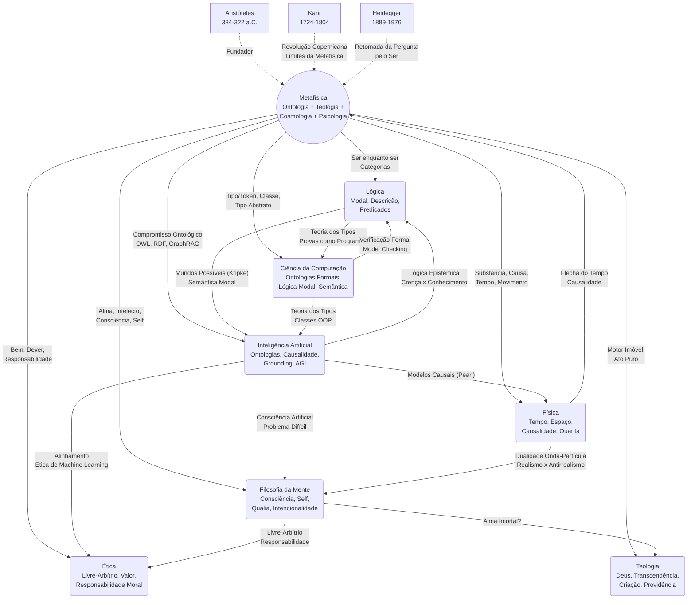

# Metafísica: O Estudo do Ser e da Realidade

## 1. Introdução Teórica Aprofundada

### 1.1 Origem do Termo

O termo **metafísica** tem uma origem editorial, não conceitual. No século I a.C., o editor Andrônico de Rodes organizou as obras de Aristóteles e agrupou aquelas que tratavam do **ser enquanto ser** e das **primeiras causas** após os escritos sobre física (*ta physika*). Chamou-as de **τὰ μετὰ τὰ φυσικά** (*ta meta ta physika* — "os [escritos] após os físicos"). O prefixo **meta** (μετά) significa "após" ou "além". Assim, a metafísica nasce como "o que vem depois da física" — tanto na ordem editorial quanto na ordem do conhecimento: primeiro estudamos a natureza em movimento (física), depois investigamos o que está **além** ou **aquém** dela como fundamento.

Com o tempo, o termo adquiriu o sentido de "estudo do que está além do físico" — das realidades transcendentes, imateriais, eternas. Contudo, esta interpretação é apenas um dos sentidos possíveis. O próprio Aristóteles chamava este estudo de **filosofia primeira** (*prōtē philosophia*), a ciência que investiga o ser enquanto ser e os princípios mais universais da realidade.

### 1.2 Os Quatro Ramos da Metafísica

A metafísica tradicionalmente se divide em quatro grandes subdisciplinas:

#### 1. Ontologia (Ontologia)
Do grego *ontos* (ser) + *logos* (estudo). É o estudo do **ser enquanto ser** — das categorias fundamentais da realidade, dos tipos de entidades que existem e das relações entre elas. Perguntas centrais:
- O que significa existir?
- Quais são as categorias últimas do real?
- O que é um objeto? Uma propriedade? Um evento?
- Universais existem independentemente da mente?

#### 2. Teologia Natural (Teologia Natural)
Também chamada de **teodiceia** ou **teologia filosófica**. Investiga a existência e a natureza de Deus ou do transcendente usando apenas a razão filosófica, sem apelo à revelação:
- Deus existe? Provas cosmológica, ontológica, teleológica.
- Deus é simples? Imutável? Onipotente?
- O problema do mal.

#### 3. Cosmologia Filosófica (Cosmologia Filosófica)
O estudo do mundo como **totalidade** — sua origem, estrutura e destino últimos. Distingue-se da cosmologia científica (que estuda o universo físico) por perguntas de fundo:
- Por que existe algo em vez de nada?
- O universo teve um começo? É finito ou infinito?
- Há uma ordem inteligível no cosmo?
- O que é o tempo? O que é o espaço?

#### 4. Psicologia Racional (Psicologia Racional)
O estudo da **alma** (psique) como substância imaterial — sua natureza, faculdades e destino. Hoje diríamos "filosofia da mente em chave metafísica":
- A alma é imortal?
- O que é a consciência?
- Livre-arbítrio: a vontade é livre ou determinada?
- Relação mente-corpo.

### 1.3 Relação com Epistemologia, Lógica e Ética

A metafísica não existe isolada. Ela se conecta profundamente com:

**Epistemologia:** Toda epistemologia pressupõe uma metafísica. Se o conhecimento é crença verdadeira justificada, precisamos saber o que é *verdade* (metafísica da verdade), o que é *crença* (ontologia de estados mentais), o que é *justificação* (relações causais e normativas entre crenças e mundo). Kant mostrou que certas condições metafísicas (espaço, tempo, causalidade como formas *a priori*) são condições de possibilidade do próprio conhecimento.

**Lógica:** A lógica estuda as formas válidas de inferência. Mas estas formas pressupõem uma ontologia: o que é uma proposição? O que é a verdade? O que é um objeto? A lógica clássica (bivalente, com quantificação sobre objetos) é uma lógica comprometida com certas teses metafísicas (essencialismo, binarismo verdade-valor). Lógicas não-clássicas (paraconsistente, intuicionista, many-valued) carregam compromissos metafísicos alternativos.

**Ética:** Toda ética precisa de fundamentação metafísica. O que é o bem? O que é uma pessoa? O que é a vontade? Há fatos morais objetivos? O livre-arbítrio existe? Debates em metaética (realismo moral vs. antirrealismo, naturalismo vs. não-naturalismo) são debates metafísicos disfarçados.

```
                    Metafísica
                   /    |     \
                  /     |      \
         Epistemologia  Lógica  Ética
              |           |       |
              v           v       v
         "O que é     "O que     "O bem
          conhecer?"   existe?"   existe?"
```

### 1.4 Importância para Inteligência Artificial

A metafísica é crucial para a IA em pelo menos seis frentes:

1. **Ontologias formais:** Sistemas de IA que organizam conhecimento (Web Semântica, OWL, RDF, GraphRAG) dependem de compromissos ontológicos — que categorias de entidades existem, como se relacionam.

2. **Causalidade:** A revolução de Judea Pearl em inferência causal (*do-calculus*, SCMs) é metafísica aplicada: formaliza a noção de causa, intervenção e contrafactual.

3. **Modalidade:** Raciocínio sobre possibilidade, necessidade e contingência (lógica modal) é indispensável para planejamento automatizado, verificação formal e ética de IA.

4. **Identidade e mudança:** Sistemas que rastreiam objetos no tempo (tracking, re-identificação) enfrentam o problema metafísico da identidade através da mudança.

5. **Grounding:** O problema do grounding (Harnad, 1990) — como símbolos adquirem significado — é um problema metafísico sobre a relação entre representação e realidade.

6. **Consciência artificial:** A natureza da consciência, do self e da experiência subjetiva — o "problema difícil" (Chalmers) — é metafísica da mente aplicada à engenharia.

---

## 2. Aristóteles como Foco Central

### 2.1 A *Metafísica*: Análise Livro por Livro

A *Metafísica* de Aristóteles é composta por 14 livros (designados por letras gregas: A, α, B, Γ, Δ, E, Z, H, Θ, I, K, Λ, M, N), provavelmente escritos em momentos diferentes e reunidos postumamente.

#### Livro I (Α) — A Ciência das Primeiras Causas

O Livro I funciona como **introdução programática**. Aristóteles afirma que todos os homens por natureza desejam conhecer, e que o conhecimento sensorial é comum a todos os animais, mas apenas os humanos ascendem ao conhecimento das **causas**.

A **sabedoria** (*sophia*) é definida como a ciência das **primeiras causas** e dos **primeiros princípios**. É a mais divina das ciências porque:
- Deus é considerado a causa primeira de todas as coisas
- A ciência das causas primeiras é a que Deus possuiria no mais alto grau

Aristóteles então faz uma **história da filosofia** — a primeira do pensamento ocidental — examinando seus predecessores (Tales, Anaxímenes, Pitágoras, Parmênides, Heráclito, Empédocles, Anaxágoras, Platão) para mostrar que todos buscavam causas, mas apenas parcialmente. Ele diagnostica que seus predecessores descobriram aspectos da causalidade, mas nenhum compreendeu o sistema completo das quatro causas.

#### Livro II (α) — A Dificuldade do Estudo da Verdade

Um breve livro (provavelmente um fragmento de lição separada) sobre a dificuldade de alcançar a verdade e sobre a causalidade infinita: não podemos regredir ao infinito nas causas — é preciso um **termo** (*arche*).

#### Livro III (B) — As Aporias

Aristóteles lista 14 **aporias** (dificuldades teóricas) que a metafísica deve resolver:
1. Pertence a uma ou a várias ciências estudar todas as substâncias?
2. A metafísica estuda apenas substâncias ou também acidentes?
3. Há gêneros supremos do ser?
4. O que é a substância primeira?
5. Os princípios são universais ou individuais?
6. Os gêneros são princípios?
7. Há algo além dos indivíduos sensíveis?
8. Os princípios são limitados em número ou espécie?
9. As coisas corruptíveis e incorruptíveis têm os mesmos princípios?
10. O ser e a unidade são substância?

Cada aporia receberá resposta nos livros subsequentes.

#### Livro IV (Γ) — O Ser Enquanto Ser

É o coração programático da Metafísica. Aristóteles afirma:

> "Há uma ciência que estuda o ser enquanto ser e os atributos que lhe pertencem essencialmente." (1003a21)

Esta ciência não se confunde com as ciências particulares, que estudam apenas uma parte do ser (a biologia estuda os seres vivos, a física estuda os corpos em movimento). A **filosofia primeira** estuda o **ser enquanto ser** — aquilo que é comum a todos os entes **enquanto entes**.

O livro estabelece três teses fundamentais:
1. O ser se diz de múltiplas maneiras, mas todas remetem a uma **unidade de referência** (*pros hen*) — a substância (οὐσία).
2. O **princípio de não-contradição** (PNC) é o princípio mais firme de todos: "é impossível que o mesmo atributo pertença e não pertença ao mesmo sujeito no mesmo sentido."
3. O **princípio do terceiro excluído** (PTE): não pode haver um termo médio entre os contraditórios.

#### Livro V (Δ) — Os Significados Múltiplos do Ser

É um **léxico filosófico** — um dicionário dos termos mais importantes da filosofia. Aristóteles analisa a polissemia de dezenas de termos: princípio, causa, elemento, natureza, necessidade, unidade, ser, substância, identidade, diferença, prioridade, potência, quantidade, qualidade, relação, perfeição, limite, disposição, privação, parte, todo, gênero, falso e acidente.

O termo **ser** (*to on*), mostra Aristóteles, tem **quatro sentidos fundamentais**:
1. Ser por acidente (acidental)
2. Ser como verdade (veritativo — "Sócrates é músico")
3. Ser segundo as categorias (substância, qualidade, quantidade, etc.)
4. Ser em potência e em ato

#### Livro VI (E) — As Ciências Teóricas

Aristóteles distingue três ciências **teóricas**: física (ser em movimento), matemática (ser imóvel mas dependente da matéria), teologia (ser imóvel e separado). A teologia, por estudar o ser mais excelente (Deus), é a **filosofia primeira**. Surge aqui a ambiguidade: a metafísica é a ciência do ser enquanto ser (ontologia) ou a ciência do ser divino (teologia)? Esta ambiguidade percorrerá toda a história da metafísica.

#### Livro VII (Z) — A Substância (οὐσία)

É o livro mais denso e importante da Metafísica. Aristóteles pergunta: **o que é a substância?** A pergunta equivale a "o que é o ser" e "o que é o 'isto' (tode ti)" de cada coisa.

Ele examina quatro candidatos a substância:
1. A **essência** (*to ti ēn einai* — "o que era ser"): a definição que expressa a natureza da coisa.
2. O **universal** (*katholou*): que Aristóteles rejeita como substância (ao contrário de Platão).
3. O **gênero** (*genos*): também rejeitado.
4. O **subjacente** (*hypokeimenon*): a matéria, a forma ou o composto.

Aristóteles conclui que a **forma** (*eidos*) é a substância primeira — aquilo que faz com que uma coisa seja o que é. A forma é o princípio de atualidade e inteligibilidade. A matéria é potência pura. O composto (sínodo) é substância derivada.

A análise de Z leva à tese central: **a forma é a substância primária**. Isto é oposto a Platão: a forma não está separada, mas imanente na coisa concreta.

#### Livro VIII (H) — A Substância Sensível

Complementa Z analisando a substância sensível composta de matéria e forma. Distinções importantes:
- Matéria próxima e matéria primeira
- Forma como causa do ser do composto
- A unidade da definição (como matéria e forma se unem)

Livro apresenta a famosa **analogia da cera e da figura**: a matéria é como cera (indeterminada), a forma é como a figura impressa nela.

#### Livro IX (Θ) — Potência e Ato (Δύναμις e Ἐνέργεια)

É um dos livros mais originais e influentes. Aristóteles introduz distinção entre:
- **Potência** (*dynamis*): capacidade de ser ou agir. Potência ativa (capacidade de agir) e potência passiva (capacidade de sofrer ação).
- **Ato** (*energeia/entelecheia*): a realização, a presença plena da forma.

O primado do ato sobre a potência:
1. **Ontologicamente:** O ato precede a potência porque a potência é sempre potência *para* um ato.
2. **Cronologicamente:** Em certo sentido, o ato precede (o pai gera o filho).
3. **Substancialmente:** O ato é anterior em substância — a forma (ato) é o que torna a matéria (potência) algo determinado.

A distinção potência-ato resolve o problema do **movimento** (Parmênides: o ser não pode passar ao não-ser). O movimento é a atualização do que está em potência enquanto está em potência. Não há passagem do não-ser ao ser, mas da potência ao ato.

#### Livro X (I) — A Unidade

Sobre a unidade (*to hen*) e suas espécies:
- Unidade numérica (identidade)
- Unidade específica (mesma forma)
- Unidade genérica (mesmo gênero)
- Unidade por analogia (mesma relação)

A unidade não é uma substância, mas um **transcendental** — uma propriedade que acompanha todo ser. O ser e o uno convertem-se (*ens et unum convertuntur*).

#### Livro XI (K) — Resumo

Provavelmente um resumo posterior de lições de Metafísica (livros B, Γ, Δ, E) e de Física. Menos original, mas útil como sumário.

#### Livro XII (Λ) — O Motor Imóvel

É o livro da **teologia aristotélica**. Aristóteles argumenta:
1. Tudo o que se move é movido por outro.
2. Não podemos regredir ao infinito na cadeia de motores.
3. Logo, há um **primeiro motor imóvel** — que move sem ser movido.
4. Este motor é **ato puro** (sem potência), **imaterial**, **eterno** e **vida no mais alto grau**.
5. Move como **causa final**: é o objeto de desejo e pensamento que move o cosmos sem ser afetado.

> "O pensamento do pensamento" (*noēsis noēseōs*): o Motor Imóvel pensa o que há de mais divino — ele próprio. É pensamento auto-reflexivo.

#### Livros XIII (M) e XIV (N) — Crítica de Platão e dos Pitagóricos

Crítica refinada à Teoria das Formas de Platão e aos princípios matemáticos pitagóricos. Aristóteles argumenta:
- Formas separadas são inúteis como causas — duplicam o mundo sem explicá-lo.
- Se as Formas são paradigmas, como se relacionam causalmente com as coisas sensíveis? (Terceiro Homem)
- Números e ideias matemáticas não são substâncias separadas.

### 2.2 As *Categorias*

O tratado *Categorias* (*Kategoriai*) estabelece a classificação fundamental dos modos de ser. Há **dez categorias**, que são os gêneros supremos do ser:

1. **Substância** (οὐσία): "homem", "cavalo" — o que é sujeito último de predicação.
2. **Quantidade** (ποσόν): "dois côvados", "maior".
3. **Qualidade** (ποιόν): "branco", "gramático".
4. **Relação** (πρός τι): "dobro", "metade", "maior que".
5. **Lugar** (ποῦ): "no Liceu", "no mercado".
6. **Tempo** (πότε): "ontem", "no ano passado".
7. **Posição** (κεῖσθαι): "está sentado", "está deitado".
8. **Estado** (ἔχειν): "está calçado", "está armado".
9. **Ação** (ποιεῖν): "corta", "queima".
10. **Paixão** (πάσχειν): "é cortado", "é queimado".

A **substância primeira** é o indivíduo concreto ("este homem", "este cavalo"). A **substância segunda** é a espécie e o gênero ("homem", "animal"). Todas as outras categorias (acidentes) existem **em** (*in*) a substância — são predicados dela.

### 2.3 A *Física*

A *Física* aristotélica é um tratado de **filosofia natural** — o estudo dos seres em movimento (*ta physika*). É metafísica aplicada ao mundo natural.

**As quatro causas:**
Aristóteles afirma que conhecer algo é conhecer suas causas. São quatro:

| Causa | Nome grego | Definição | Exemplo (estátua) |
|-------|------------|-----------|-------------------|
| **Material** | Ὕλη (hylē) | Aquilo de que algo é feito | Mármore, bronze |
| **Formal** | Εἶδος (eidos) | A essência, a forma, o modelo | A forma de Afrodite |
| **Eficiente** | Ἀρχὴ κινήσεως (archē kinēseōs) | Aquilo que produz a mudança | O escultor |
| **Final** | Τέλος (telos) | Aquilo para que algo é feito | Ser adorada, decorar |

As quatro causas operam juntas. A causalidade não é apenas eficiente (como na física moderna), mas inclui a **finalidade** intrínseca — os seres naturais têm um *telos* interno que orienta seu desenvolvimento.

**Movimento:** A definição de movimento é "a atualização do que está em potência enquanto está em potência". O movimento é a **ponte** entre potência e ato. Aristóteles classifica três tipos de movimento:
- Movimento local (deslocamento no espaço)
- Mudança qualitativa (alteração)
- Mudança quantitativa (crescimento/decrecimento)
- Mudança substancial (geração/corrupção)

**Tempo:** O tempo é "o número do movimento segundo o antes e o depois". Não existe independentemente do movimento — é a **medida** da mudança. O tempo pressupõe uma alma que numera.

**Continuidade:** Espaço, tempo e movimento são **contínuos** — divisíveis ao infinito, mas não compostos de indivisíveis (crítica aos atomistas). Isto leva aos famosos paradoxos de Zenão, que Aristóteles analisa e refuta.

### 2.4 *De Anima*

O *De Anima* (*Peri Psychēs*) é o tratado aristotélico sobre a alma. Para Aristóteles, a alma não é uma substância separada (como em Platão), mas **a forma do corpo vivo** — o primeiro ato de um corpo natural que tem vida em potência.

A alma tem três níveis (hierarquia das almas):

1. **Alma vegetativa:** Nutrição, crescimento, reprodução (plantas).
2. **Alma sensitiva:** Percepção, desejo, movimento local (animais).
3. **Alma intelectiva:** Intelecto, razão (humanos).

**A percepção:** O sentido recebe a **forma** sem a **matéria** — como a cera recebe a forma do selo sem o metal. A percepção é uma **atualização** da potência perceptiva do órgão pelo objeto sensível.

**O intelecto (νοῦς):** Aristóteles distingue:
- **Intelecto passivo** (*nous pathētikos*): que recebe as formas inteligíveis — é potencial e corruptível.
- **Intelecto ativo** (*nous poiētikos*): que ilumina as imagens sensíveis e torna os universais inteligíveis — é **separado, imortal e eterno**.

Este texto é o mais debatido da história da psicologia filosófica: Aristóteles teria postulado um intelecto imortal, mas não pessoal? Averróis (século XII) interpretou o intelecto ativo como uma substância separada única para toda a humanidade — doutrina do **monopsiquismo** que gerou enorme controvérsia na filosofia medieval.

### 2.5 Comparação com Platão

| Tema | Platão | Aristóteles |
|------|--------|-------------|
| **Formas/Ideias** | Separadas (*chōriston*), transcendentes, no "lugar inteligível" | Imanentes, na própria coisa concreta como forma substancial |
| **Mundo sensível** | Cópia imperfeita, sombra | Real, substancial, objeto de ciência |
| **Conhecimento** | Anamnese (reminiscência) — as Formas estão na alma desde sempre | Abstração (*aphairesis*) — o intelecto abstrai a forma da matéria |
| **Substância** | As Formas são as verdadeiras substâncias | As substâncias primeiras são os indivíduos concretos |
| **Alma** | Imortal, preexiste e sobrevive ao corpo, reencarna | Forma do corpo, o intelecto ativo é imortal (mas impessoal?) |
| **Causalidade** | Participação (*methexis*) das coisas nas Formas | Quatro causas (material, formal, eficiente, final) |
| **Deus** | Demiurgo (artesão divino que ordena a matéria preexistente) | Motor Imóvel (ato puro que move sem ser movido como causa final) |
| **Ética** | Conhecimento das Formas leva à virtude; alegoria da caverna | Eudaimonia como realização da essência humana; virtude como meio-termo |
| **Universais** | Realismo extremo: universais existem antes das coisas (*universalia ante rem*) | Realismo moderado: universais existem nas coisas (*universalia in re*) |

---

## 3. História da Metafísica

### 3.1 Pré-Socráticos

**Parmênides de Eleia (c. 515-450 a.C.):** Fundador do **monismo** ontológico. Em seu poema *Sobre a Natureza*, distingue a **Via da Verdade** (o ser é, o não-ser não é) da **Via da Opinião** (mundo sensível, ilusório). Para Parmênides:
- O ser é: ingênito, imperecível, imóvel, contínuo, único, completo, presente.
- O não-ser não é: não pode ser pensado nem dito.
- A mudança e o movimento são ilusórios — envolvem passagem do ser ao não-ser.

Parmênides coloca o problema fundamental da metafísica: como conciliar a unidade e imobilidade do ser com a multiplicidade e mudança do mundo sensível?

**Heráclito de Éfeso (c. 535-475 a.C.):** O oposto polar: tudo flui (*panta rhei*). O ser é **devir** — mudança perpétua. "Não se pode banhar duas vezes no mesmo rio." O **fogo** é o princípio (*archē*), simbolizando a transformação constante. Mas há um **logos** (razão) que governa o fluxo: a harmonia dos opostos.

O contraste Parmênides vs. Heráclito define o eixo do debate metafísico ocidental: **ser vs. devir**. Aristóteles dirá que ambos estão parcialmente corretos: Parmênides capta a permanência da forma, Heráclito capta a fluência da matéria. A distinção potência-ato resolve o impasse.

**Outros pré-socráticos relevantes:**
- **Tales:** Tudo é água (busca pela arché material)
- **Anaximandro:** O *apeiron* (indeterminado) como princípio
- **Pitágoras:** Tudo é número — o princípio da realidade é matemático
- **Empédocles:** Quatro raízes (fogo, ar, água, terra) + Amor e Ódio como forças
- **Anaxágoras:** *Nous* (Mente) como princípio ordenador
- **Demócrito:** Átomos e vazio — o **atomismo** (tudo é corpúsculo indivisível em movimento no vazio)

### 3.2 Platão (c. 428-348 a.C.)

A metafísica de Platão é construída sobre a **Teoria das Formas** (ou Ideias):

**Mundo Inteligível (κόσμος νοητός):** O mundo das Formas — entidades eternas, imutáveis, imateriais, perfeitas, inteligíveis apenas pela razão. Exemplos: a Forma do Belo, do Justo, do Igual, do Triângulo.

**Mundo Sensível (κόσμος αἰσθητός):** O mundo físico — cópia imperfeita do mundo das Formas. As coisas sensíveis **participam** (*methexis*) das Formas, mas são mutáveis, materiais, imperfeitas.

**Alegoria da Caverna (República, Livro VII):** Prisioneiros acorrentados veem apenas sombras na parede da caverna. Um prisioneiro é libertado, sobe ao mundo exterior, vê as coisas reais e, finalmente, o Sol (a Forma do Bem). A alegoria é uma metáfora da ascensão da alma do mundo sensível (sombras) ao mundo inteligível (Formas) e à fonte última de toda realidade (o Bem).

**O Demiurgo (Timeu):** Deus artesão que, contemplando as Formas eternas, ordena a matéria pré-existente, produzindo o cosmos sensível. O Demiurgo é **causa eficiente** e inteligente, mas não criador ex nihilo (a matéria é coeterna).

**Crítica do Terceiro Homem:** Aristóteles formula o argumento mais forte contra Platão: se um homem é homem por participar da Forma de Homem, e a Forma de Homem também é homem (pois é a essência do homem), então precisamos de uma terceira Forma para explicar a semelhança entre o homem sensível e a Forma de Homem — e assim ao infinito (regresso ao infinito). Isto mostra, para Aristóteles, que as Formas não podem ser substâncias separadas.

### 3.3 Aristóteles (384-322 a.C.)

Já tratado em detalhe na Seção 2. Para a história: Aristóteles é o ponto de inflexão — o primeiro a sistematizar a metafísica como disciplina autônoma. Sua influência se estende por 2000+ anos.

### 3.4 Medieval

#### Tomás de Aquino (1225-1274)

O maior filósofo escolástico. Tomás integra Aristóteles ao cristianismo, produzindo uma síntese que domina o pensamento católico até hoje.

**Essência e Existência:** A distinção mais original de Tomás. Em Deus, essência e existência são idênticas (Deus é o *ipsum esse subsistens* — o próprio ser subsistente). Em todas as criaturas, a essência (o que algo é) é distinta da existência (o *que* algo é). A existência é o **ato de ser** — o que atualiza a essência. A essência é potência em relação à existência (ato).

**As Cinco Vias** (provas da existência de Deus):
1. **Primeiro Motor:** Tudo que se move é movido por outro; cadeia não infinita → Primeiro Motor Imóvel.
2. **Causa Eficiente Primeira:** Cadeia de causas eficientes → Causa Primeira incausada.
3. **Ser Necessário:** Seres contingentes existem → Deve haver um ser necessário que funda a contingência.
4. **Graus de Perfeição:** Graus comparativos de bondade/verdade → Ser perfeitíssimo.
5. **Ordem Teleológica:** Seres sem inteligência agem com finalidade → Inteligência ordenadora.

**Analogia do Ser (*Analogia Entis*):** O ser não se diz univocamente (mesmo sentido) nem equivocamente (sentidos completamente diferentes), mas **analogicamente** — há uma unidade de proporção entre os diversos modos de ser. Deus é ser por essência; as criaturas são ser por participação.

#### Avicena (Ibn Sina, 980-1037)

O maior filósofo islâmico. Distingue **ser necessário** (*wajib al-wujud*) — Deus, cuja existência é idêntica à essência — e **ser contingente** (*mumkin al-wujud*) — tudo mais, que requer uma causa para existir. Avicena formula o famoso argumento: o contingente, considerado em si mesmo, é possível (nem necessário nem impossível); para existir, precisa de uma causa que o torne atual. A série de causas contingentes não pode ser infinita → remete a um ser necessário.

Avicena também desenvolve a distinção entre **essência** e **existência** antes de Tomás.

#### Averróis (Ibn Rushd, 1126-1198)

O maior comentador de Aristóteles no mundo islâmico (conhecido como "O Comentador"). Defende a interpretação literal de Aristóteles contra as leituras neoplatônicas de Avicena. Tese controversa: o **monopsiquismo** — o intelecto ativo é único para toda a humanidade, separado e eterno. A alma individual não sobrevive à morte. Esta tese foi condenada no Ocidente latino (1277).

#### Duns Scotus (1266-1308)

Franciscano escocês, "Doutor Sutil". Desenvolve a noção de **haecceitas** (esteidade) — o princípio de individuação que torna cada ente único e irrepetível. Para Scotus, a individuação não vem da matéria (como em Tomás), mas de uma determinação formal última da essência.

**Univocidade do Ser:** Ao contrário da analogia tomista, Scotus defende que o ser é **unívoco** — predicado no mesmo sentido de Deus e das criaturas. Isto permite que a metafísica estude o ser em toda sua extensão (inclusive Deus) como objeto de uma única ciência.

#### Guilherme de Ockham (1287-1347)

Franciscano inglês, "Doutor Invencível". Leva o nominalismo às últimas consequências.

**Navalha de Ockham:** "Não se deve multiplicar os entes sem necessidade" (*entia non sunt multiplicanda praeter necessitatem*). A explicação mais simples é preferível.

**Nominalismo:** Universais não existem — são apenas **nomes** (*flatus vocis* — sopro de voz) que usamos para agrupar indivíduos semelhantes. Só existem indivíduos concretos. Isto rompe com a tradição realista (Platão, Aristóteles, Tomás) que atribuía realidade aos universais.

**Consequência teológica:** Deus é absolutamente onipotente e livre — não está sujeito a nenhuma ordem racional necessária (nem mesmo às Ideias divinas). A ética, para Ockham, é voluntarista: o bem é o que Deus quer, não o que Deus reconhece como bom.

### 3.5 Moderna

#### René Descartes (1596-1650)

Pai da filosofia moderna. Redefine a metafísica como **fundamentação do conhecimento** — não mais estudo do ser, mas busca por certezas primeiras.

**Substância:** "Aquilo que existe de tal modo que não precisa de nenhuma outra coisa para existir." Há três substâncias:
- **Res cogitans** (coisa pensante): mente, alma, consciência.
- **Res extensa** (coisa extensa): matéria, corpo, espaço.
- **Deus:** substância infinita, causa de si.

**Dualismo mente-corpo:** A mente e o corpo são substâncias distintas e independentes. Mas como interagem? (Problema da interação: na glândula pineal?).

**Prova ontológica:** A existência de Deus é deduzida da ideia de ser perfeito — tal como a existência de um triângulo está contida em sua essência.

#### Baruch Spinoza (1632-1677)

Leva o racionalismo cartesiano ao **panteísmo**: Deus é a única substância, e tudo o mais são **modos** (afeções transitórias) desta substância única.

> *Deus sive Natura* — Deus, ou a Natureza.

Há apenas uma substância com infinitos atributos, dos quais conhecemos apenas dois: **pensamento** e **extensão**. Mente e corpo não interagem (como em Descartes), mas são a **mesma coisa** expressa sob atributos diferentes (paralelismo psicofísico).

A liberdade não é livre-arbítrio, mas **compreensão da necessidade**: somos livres quando entendemos as causas que nos determinam.

#### Gottfried Wilhelm Leibniz (1646-1716)

**Mônadas:** O universo é composto de infinitas **mônadas** — substâncias simples, indivisíveis, imateriais, sem janelas ("sem portas nem janelas"), cada uma espelhando o universo inteiro de seu ponto de vista. Cada mônada é um "universo em miniatura", regida por seu próprio programa interno (a lei da série).

**Harmonia Pré-Estabelecida:** Deus criou cada mônada de tal forma que suas percepções internas se coordenam perfeitamente — como dois relógios sincronizados sem interação causal.

**Melhor dos Mundos Possíveis:** Deus, sendo bom, escolheu criar o melhor dos mundos possíveis — aquele que maximiza a variedade com a maior simplicidade de leis. O mal existe como condição para bens maiores.

#### David Hume (1711-1776)

O **empirista radical** que submete a metafísica ao tribunal da experiência.

**Crítica da causalidade:** Não temos impressão de "conexão necessária" entre causa e efeito — apenas **conjunção constante**. A causalidade é um hábito da mente, não uma propriedade do mundo.

**Crítica da substância:** A ideia de substância é uma "coleção de qualidades unidas pela imaginação". Não há substrato subjacente além das percepções.

**Crítica do self:** Quando introspecto, nunca encontro um "eu" — apenas percepções sucessivas (feixe de percepções). O self é uma ficção gramatical.

**Fork de Hume:** "Se tomarmos em nossas mãos qualquer volume... perguntemos: contém algum raciocínio abstrato sobre quantidade e número? Não. Contém algum raciocínio experimental sobre questões de fato e existência? Não. Atiremo-lo às chamas, pois não contém senão sofismas e ilusão." — *Investigação sobre o Entendimento Humano*, sec. XII.

#### Immanuel Kant (1724-1804)

A **Crítica da Razão Pura** (1781/1787) realiza uma revolução copernicana na metafísica. Kant não pergunta *o que é o ser*, mas *como a metafísica é possível como ciência*.

**A síntese do criticismo:**
- O conhecimento tem duas fontes: **intuição sensível** (conteúdo empírico) e **entendimento** (conceitos *a priori*).
- Espaço e tempo são **formas *a priori* da sensibilidade** — não propriedades do mundo em si.
- Categorias (causalidade, substância, unidade, etc.) são **conceitos puros do entendimento** — condições de possibilidade da experiência.

**Fenômeno e Noumeno:**
- **Fenômeno:** O objeto tal como aparece para nós, estruturado pelas formas da sensibilidade e categorias. É o domínio da ciência e da experiência possível.
- **Noumeno (coisa em si):** O objeto como é em si mesmo, independentemente de nossa cognição. É **incognoscível**.

**Crítica das provas da existência de Deus:**
1. **Prova ontológica (Descartes, Anselmo):** Falácia — existência não é um predicado real.
2. **Prova cosmológica:** Depende da prova ontológica disfarçada.
3. **Prova teleológica:** No máximo prova um arquiteto, não um criador.

**Conclusão:** A metafísica tradicional (teologia racional, cosmologia racional, psicologia racional) é impossível como ciência — ultrapassa os limites da experiência possível. Mas a metafísica como **crítica dos limites** é possível e necessária.

### 3.6 Contemporânea

#### Martin Heidegger (1889-1976)

Heidegger abre *Ser e Tempo* (1927) com a pergunta: **"Por que há entes e não antes nada?"** Mas seu projeto é mais fundamental: **retomar a pergunta pelo ser** (*Seinsfrage*), que a tradição metafísica teria esquecido ao confundir ser com ente.

**Diferença ontológica:** Distinção entre **ser** (*Sein*) e **ente** (*Seiendes*). O ser não é um ente (sequer o mais alto). A metafísica tradicional, ao perguntar "o que é o ser?", tratou-o como um ente especial (Deus, Substância, Ideia) — **esquecimento do ser** (*Seinsvergessenheit*).

**Dasein:** O ente que pergunta pelo ser — o ser humano. Dasein é **ser-no-mundo**, aberto ao ser, temporal, finito.

**Ser e Tempo:** Ser é tempo. A compreensão do ser é possível porque Dasein é temporal — projetado para o futuro (possibilidades), marcado pelo passado (situação) e presente (decaído). A temporalidade é o horizonte de toda compreensão do ser.

**Crítica da técnica:** Heidegger vê a metafísica ocidental culminando na **técnica moderna** — o reduzir de todos os entes a "recursos disponíveis" (*Bestand*), a "enquadramento" (*Gestell*) que nos impede de experienciar o ser como evento.

#### Alfred North Whitehead (1861-1947)

*Process and Reality* (1929) funda a **filosofia do processo**: a realidade não é composta de substâncias estáticas, mas de **ocasiões atuais** — eventos, processos, devires. Cada ocasião atual é um "gota de experiência" que incorpora o passado e projeta o futuro.

**Deus em Whitehead:** Deus não é o Motor Imóvel ou o Criador ex nihilo, mas um dipolo:
- **Natureza primordial:** O reino das possibilidades eternas.
- **Natureza consequente:** Deus incorpora o que acontece no mundo, sofrendo com ele.

Whitehead influencia a física quântica, a teologia do processo e parte do pensamento ecológico.

#### W. V. O. Quine (1908-2000)

*On What There Is* (1948) formula o critério do **compromisso ontológico**: uma teoria está comprometida com a existência das entidades que devem estar no domínio de quantificação de seus enunciados para que estes sejam verdadeiros.

> "Ser é ser o valor de uma variável." (*To be is to be the value of a variable.*)

Quine é **nominalista**: rejeita universais, propriedades, proposições, mentes, significados — tudo que não se reduz a objetos físicos e classes.

**Ontologia austera:** Só existem:
1. Objetos físicos (corpos).
2. Classes (mas apenas como *façons de parler*).

Quine defende o **naturalismo**: a filosofia não é anterior à ciência, mas contínua com ela. "A epistemologia naturalizada" torna-se um capítulo da psicologia.

#### Saul Kripke (1940-2022)

*Naming and Necessity* (1972/1980) revoluciona a metafísica e a filosofia da linguagem ao reintroduzir o **essencialismo** na filosofia analítica.

**Designadores rígidos:** Nomes próprios (e certos termos de espécies naturais como "água", "ouro") referem-se ao **mesmo objeto em todos os mundos possíveis** onde existem.

**Necessidade *a posteriori*:** Há verdades necessárias que só se descobrem empiricamente:
- "Água é H₂O" — necessário (água é H₂O em todos os mundos possíveis), mas descoberto *a posteriori*.
- "Mesa é de madeira" — contingente (poderia ser de outro material).

**Identidade necessária:** Se A = B (identidade teórica), então A = B é necessária — mesmo que descoberta empiricamente.

Kripke reabilita a **metafísica modal** (mundos possíveis, essências, necessidade) dentro da filosofia analítica, que estava dominada pelo empirismo lógico e pelo positivismo.

#### David Lewis (1941-2001)

*On the Plurality of Worlds* (1986) defende o **realismo modal extremo**: todos os mundos possíveis existem tão realmente quanto o nosso. Eles são **concretos, isolados causalmente e espacialmente** — não há interação causal entre mundos.

**Contrapartes:** Um indivíduo não existe em mais de um mundo. Quando dizemos "Sócrates poderia não ter sido filósofo", o enunciado é verdadeiro se há uma **contraparte** de Sócrates (um indivíduo muito parecido) em outro mundo que não é filósofo.

**Crítica:** Muitos acham a ontologia de Lewis implausível ("hiperpopulação ontológica"). Lewis responde: a teoria é **incredulamente magnífica** — sua potência explicativa justifica o custo ontológico.

---

## 4. Temas Centrais

### 4.1 Substância vs. Acidente

A distinção mais fundamental da ontologia aristotélica:

- **Substância** (οὐσία): Entidade que existe **por si mesma** — é sujeito último de predicação. Exemplos: Sócrates, este cavalo, esta árvore. A substância é o que "está por baixo" (*hypokeimenon* = subjectum).

- **Acidente** (συμβεβηκός): O que existe **em outro** — não subsiste por si. Exemplos: a brancura de Sócrates (existe *em* Sócrates), a altura de 1,70m. Os acidentes são as nove categorias não-substanciais.

**Propriedades da substância:**
1. É sujeito de predicação, não predicado de outro.
2. É "um isto" (*tode ti*) — individual, concreto.
3. Permanece através da mudança qualitativa.
4. Pode receber contrários (Sócrates fica doente, depois saudável).
5. É numericamente una e capaz de receber determinações.

**Debate contemporâneo:** Na metafísica analítica, o debate substância vs. acidente reaparece como:
- **Teoria do substrato:** Há um substrato nu (*bare particular*) que porta propriedades.
- **Teoria do feixe (*bundle theory*):** Um objeto é apenas um feixe de propriedades — não há substrato adicional (Hume, Russell).
- **Teoria da substância aristotélica:** A substância é um composto de matéria e forma — nem substrato nu nem mero feixe.

### 4.2 Potência e Ato

Distinção axial da metafísica aristotélica, desenvolvida em Metafísica Θ.

**Potência (δύναμις):**
- **Potência ativa:** Capacidade de produzir mudança em outro (o fogo pode aquecer).
- **Potência passiva:** Capacidade de receber mudança de outro (a água pode ser aquecida).
- **Potência racional:** Capacidade de produzir efeitos contrários (a medicina pode curar ou matar).
- **Potência irracional:** Determinada a um único efeito (o fogo só aquece).

**Ato (ἐνέργεια/ἐντελέχεια):**
- **Ato primeiro (*entelecheia*):** A posse da forma que torna o ente o que é (a alma como ato do corpo).
- **Ato segundo (*energeia*):** O exercício da atividade (Sócrates usando sua razão).

**Primado do ato:**
1. **Prioridade ontológica:** O ato é anterior à potência — a potência é sempre *para* um ato.
2. **Prioridade temporal parcial:** Em certo sentido, o ato é anterior (a semente vem de uma árvore já atual).
3. **Prioridade substancial:** O ato é a perfeição; a potência é perfeccionável.

**Resolução do problema de Parmênides:** O movimento não é passagem do ser ao não-ser, mas da potência ao ato. O ser permanece (a substância) enquanto muda (os acidentes).

### 4.3 Essência e Existência

Distinção medieval clássica, sistematizada por Tomás de Aquino.

**Essência (*essentia*):** O que uma coisa é. Responde à pergunta *quid est?* (o que é?). Corresponde à definição: "animal racional" para o homem, "ser vivo dotado de sensibilidade" para o cão.

**Existência (*existentia*, *esse*):** O fato de que a coisa é. Responde à pergunta *an est?* (se é). É o ato pelo qual a essência é posta na realidade.

**Distinção real:** Em todos os entes criados, essência e existência são realmente distintas — a essência (potência) é atualizada pela existência (ato). Em Deus, essência e existência coincidem — Deus é o *ipsum esse subsistens*.

**Implicações:**
- A essência, em si mesma, é indiferente à existência. A essência de "unicórnio" é inteligível, mas unicórnios não existem.
- A existência não é um predicado (Kant, contra a prova ontológica): "Deus existe" não acrescenta um predicado ao conceito de Deus, mas põe o conceito fora da mente.
- Para a IA: a distinção essência-existência mapeia-se bem na distinção entre **tipo** (*type*) e **ocorrência** (*token*) ou entre **especificação** (schema) e **instância** (objeto).

### 4.4 Causalidade

A teoria aristotélica das **quatro causas** é complementada por debates posteriores.

**As quatro causas (recapitulação):**
1. **Material:** Aquilo de que algo é feito (o bronze da estátua).
2. **Formal:** A essência, a definição (a forma da estátua).
3. **Eficiente:** O agente que produz (o escultor).
4. **Final:** O propósito, o *telos* (ser admirada).

**Causalidade moderna (Hume após Kuhn):** A ciência moderna opera quase exclusivamente com causalidade eficiente. A causalidade final é eliminada como antropomórfica. Para Hume, a causalidade não é uma conexão real, mas **conjunção constante** + **hábito mental**.

**Causalidade e IA (Pearl, 2009):** Judea Pearl desenvolveu os **Modelos Causais Estruturais (SCMs)** e o *do-calculus*, que formaliza:
- **Causa:** Uma intervenção que altera a distribuição de probabilidade.
- **Contrafactual:** O que teria acontecido se... (essencial para explicação em XAI).
- **Mediação:** Através de que mecanismos uma causa produz um efeito.

**A hierarquia causal de Pearl:**
1. **Associação:** P(Y|X) — correlação.
2. **Intervenção:** P(Y|do(X)) — manipulação direta.
3. **Contrafactual:** P(Y_x|X', Y') — raciocínio sobre o que poderia ter sido.

### 4.5 Necessidade e Contingência

**Necessidade:** O que não pode ser de outro modo. Distinções:
- **Necessidade lógica:** Uma proposição cuja negação implica contradição ("todos os solteiros são não-casados").
- **Necessidade metafísica:** O que é verdadeiro em todos os mundos possíveis (Kripke: "água é H₂O").
- **Necessidade física/natural:** O que é exigido pelas leis da natureza (não poderia ser diferente neste mundo, mas poderia em outro com leis diferentes).

**Contingência:** O que é, mas poderia não ser. O que é verdadeiro em alguns mundos possíveis, falso em outros.

**O problema metafísico da contingência:**
1. Se tudo é contingente, por que existe algo em vez de nada? (Leibniz: princípio de razão suficiente).
2. Se algo é necessário, como escapar ao determinismo?
3. A contingência do mundo requer um ser necessário que a funde? (Aquino, terceira via).

**Modalidade na computação:** Lógicas modais (necessidade/possibilidade) são usadas em:
- Verificação formal de software (model checking).
- Raciocínio sobre conhecimento em sistemas multiagente (lógica epistêmica).
- Planejamento automatizado com incerteza.

### 4.6 Universais: Realismo vs. Nominalismo

**O problema dos universais:** Propriedades como "vermelho", "justo", "triângulo" parecem ser compartilhadas por múltiplos objetos. O que são, ontologicamente?

**Realismo extremo:** Universais existem **antes** das coisas (*ante rem*) — Platão.
**Realismo moderado:** Universais existem **nas** coisas (*in re*) — Aristóteles, Tomás.
**Nominalismo:** Universais são apenas **nomes** (*post rem*) — Ockham.
**Conceitualismo:** Universais são **conceitos mentais** — não têm existência extra-mental.

**Mapa do debate:**
```
                  Universais
                 /     |     \
          Realismo   Nominalismo  Conceitualismo
         /        \      |            |
Platão (ante rem)  Aristóteles  Ockham   Abelardo
                   (in re)              (sermo)
```

**Implicações para computação:**
- Classes em OOP são universais? Se uma classe "Cachorro" existe como tipo, ela é um universal *in re* (na implementação) ou *ante rem* (na especificação)?
- Ontologias formais (OWL, RDF) precisam decidir seu compromisso ontológico — são realistas ou nominalistas?

### 4.7 Identidade e Mudança

**O problema do navio de Teseu:** Se um navio tem todas as suas tábuas substituídas gradualmente, continua sendo o mesmo navio? Se as tábuas antigas são remontadas em outro lugar, qual é o navio original?

**Critérios de identidade:**
- **Identidade numérica:** É o mesmo objeto (1:1).
- **Identidade qualitativa:** É exatamente semelhante (dois objetos indistinguíveis).
- **Identidade diacrônica:** Como algo permanece o mesmo através do tempo e da mudança.

**Respostas clássicas:**
1. **Aristóteles:** A identidade é preservada pela **forma substancial**. O navio é o mesmo se sua forma (sua organização, sua função) persiste — a matéria pode mudar.
2. **Locke:** Identidade pessoal não é substancial, mas psicológica — a **continuidade da consciência**. Uma pessoa é a mesma que era ontem se há continuidade de memória.
3. **Teoria do feixe:** Não há "si mesmo" para preservar — apenas um feixe de propriedades que mudam gradualmente.

**Identidade na IA:**
- Sistemas de re-identificação de objetos (tracking) enfrentam o problema diacrônico.
- A identidade digital (e-pessoas, agents) levanta questões: um agente de IA que é atualizado incrementalmente continua sendo "o mesmo" agente?

### 4.8 Liberdade e Determinismo

**Determinismo:** Todo evento tem uma causa — o estado do universo em t + ε é completamente determinado pelo estado em t mais as leis da natureza.

**Liberdade:** Capacidade de agir de outro modo — livre-arbítrio.

**Posições no debate:**

1. **Determinismo duro:** Determinismo é verdadeiro; livre-arbítrio é ilusão (Holbach, d'Holbach).
2. **Libertarianismo:** O livre-arbítrio existe e é incompatível com o determinismo; logo, o determinismo é falso (Chisholm, van Inwagen).
3. **Compatibilismo:** Determinismo e livre-arbítrio são compatíveis — liberdade é agir de acordo com a própria vontade, mesmo que a vontade seja determinada (Hume, Frankfurt, Dennett).
4. **Determinismo suave:** Determinismo é verdadeiro, mas livre-arbítrio ainda existe (James, antes de tornar-se pragmatista).

**Implicações para IA:**
- Agentes de IA são deterministas por construção. Podem ser "livres" em algum sentido compatibilista?
- Se um sistema de IA age de forma imprevisível (devido a caos ou aleatoriedade), isto constitui livre-arbítrio?
- Responsabilidade moral de IA requer livre-arbítrio?

---

## 5. Bibliografia e Papers Comentados

### Obras Primárias

1. **Aristóteles. *Metafísica*.** A obra fundadora. Edições recomendadas:
   - Ross, W. D. (1924). *Aristotle's Metaphysics*. Oxford University Press (edição grega + comentário clássico).
   - Barnes, J. (1984). *The Complete Works of Aristotle*. Princeton University Press (tradução inglesa padrão).
   - Reale, G. (1993). *Aristóteles: Metafísica*. Loyola (tradução italiana + comentário monumental; disponível em português pela Loyola, 3 vols.).
   - Angioni, L. (2002). *Aristóteles: Metafísica, Livros VII-VIII*. IFCH/UNICAMP (tradução brasileira de excelência).

2. **Aristóteles. *Física*.** Edição: Charlton, W. (1970). *Aristotle's Physics: Books I and II*. Oxford. Tradução brasileira: Lucas Angioni (2009) — referência em língua portuguesa.

3. **Aristóteles. *Categorias*.** Edição: Ackrill, J. L. (1963). *Aristotle's Categories and De Interpretatione*. Oxford.

4. **Aristóteles. *De Anima*.** Edição: Hamlyn, D. W. (1968). *Aristotle's De Anima: Books II and III*. Oxford.

5. **Platão. *República* (Livros VI-VII).** A alegoria da caverna e a Teoria das Formas.

6. **Tomás de Aquino. *Suma Teológica* (I, q. 2-11).** As Cinco Vias, a natureza de Deus.

7. **Avicena. *Metaphysics of The Healing*.** Tradução: Marmura, M. (2005). Brigham Young University Press.

8. **Descartes. *Meditações Metafísicas* (1641).** O fundacionalismo moderno, o cogito, as provas da existência de Deus.

9. **Spinoza. *Ética* (1677).** More geometrico — Deus sive Natura.

10. **Leibniz. *A Monadologia* (1714).** As mônadas, a harmonia pré-estabelecida.

11. **Hume. *Tratado da Natureza Humana* (Livro I, Parte III).** A crítica da causalidade.

12. **Kant. *Crítica da Razão Pura* (1781/1787).** Estética Transcendental, Analítica Transcendental, Dialética Transcendental.

13. **Heidegger. *Ser e Tempo* (1927).** A retomada da pergunta pelo ser.

14. **Whitehead. *Process and Reality* (1929).** Filosofia do processo.

15. **Quine. *On What There Is* (1948).** O critério do compromisso ontológico.

16. **Kripke. *Naming and Necessity* (1972/1980).** Designadores rígidos, necessidade a posteriori.

17. **Lewis. *On the Plurality of Worlds* (1986).** Realismo modal extremo.

### Obras Secundárias

18. **Loux, M. (2006). *Metaphysics: A Contemporary Introduction*. 3rd ed. Routledge.** — A melhor introdução contemporânea à metafísica analítica. Cobre substância, universais, modalidade, causalidade, identidade.

19. **Van Inwagen, P. (2015). *Metaphysics*. 4th ed. Westview Press.** — Manual sistemático e acessível, com posições claras e argumentos bem estruturados.

20. **Carroll, J. W. & Markosian, N. (2010). *An Introduction to Metaphysics*. Cambridge University Press.** — Foco em temas contemporâneos: tempo, causalidade, livre-arbítrio, mundos possíveis.

21. **Lowe, E. J. (2002). *A Survey of Metaphysics*. Oxford University Press.** — Abordagem sistemática e atualizada de todos os temas centrais.

22. **Reale, G. (1993). *Guia de Leitura da Metafísica de Aristóteles*. Loyola.** — Comentário monumental, volume complementar à tradução.

23. **Ross, W. D. (1924). *Aristotle's Metaphysics*. Oxford.**

24. **Lear, J. (1988). *Aristotle: The Desire to Understand*. Cambridge University Press.** — Excelente introdução ao pensamento aristotélico como um todo.

25. **Cohen, S. M. (2016). *Aristotle on Substance and Essence*. Princeton University Press.**

---

## 6. Relação com IA e Computação

### 6.1 Ontologias Formais e Engenharia de Conhecimento

Ontologias formais são **teorias metafísicas aplicadas**: especificam as categorias de entidades em um domínio e as relações entre elas.

**OWL (Web Ontology Language):** Uma ontologia OWL é um conjunto de axiomas lógicos (em lógica de descrição) que definem classes, propriedades e indivíduos. Compromissos ontológicos:
- Classes = universais (realismo moderado?)
- Propriedades = relações entre classes (acidentes?)
- Indivíduos = substâncias primeiras

**Exemplo de ontologia formal em lógica de descrição (OWL):**

```turtle
@prefix : <http://exemplo.org/ontologia#> .
@prefix rdfs: <http://www.w3.org/2000/01/rdf-schema#> .
@prefix owl: <http://www.w3.org/2002/07/owl#> .

:Substância a owl:Class .
:SubstânciaMaterial a owl:Class ; rdfs:subClassOf :Substância .
:SubstânciaImaterial a owl:Class ; rdfs:subClassOf :Substância .
:Acidente a owl:Class .
:Animal a owl:Class ; rdfs:subClassOf :SubstânciaMaterial .
:Racional a owl:Class .
:Humano a owl:Class ;
    owl:intersectionOf (:Animal :Racional) .
```

### 6.2 Lógica Modal e Mundos Possíveis em IA

A lógica modal (necessidade ◻, possibilidade ◇) é formalizada através da **semântica de mundos possíveis** (Kripke, 1963):

- **◻P** = P é verdadeiro em **todos** os mundos possíveis acessíveis.
- **◇P** = P é verdadeiro em **algum** mundo possível acessível.

**Aplicações em IA:**

1. **Planejamento:** Planejamento modal para agentes que precisam raciocinar sobre estados alternativos.
2. **Verificação formal:** Model checking de sistemas de IA contra especificações modais (safety: ◻¬erro; liveness: ◇sucesso).
3. **Epistemologia artificial:** Lógica epistêmica (K_a P = "agente a sabe que P") para sistemas multiagente (K_a ◻ φ).
4. **Ética de IA:** Raciocínio contrafactual (Se o carro autônomo tivesse freado, não teria atropelado → ◇¬acidente).

```python
# Exemplo: semântica de Kripke em Python
class MundoPossivel:
    def __init__(self, nome, proposicoes):
        self.nome = nome
        self.proposicoes = set(proposicoes)  # P, Q, R verdadeiras neste mundo

class ModeloKripke:
    def __init__(self, mundos, acessibilidade):
        self.mundos = mundos  # dict: nome -> MundoPossivel
        self.R = acessibilidade  # dict: nome_mundo -> [nomes acessiveis]

    def satisfaz(self, formula, mundo_atual):
        """Avalia se uma fórmula modal é verdadeira em um mundo."""
        if isinstance(formula, str):
            return formula in self.mundos[mundo_atual].proposicoes
        if formula[0] == '~':
            return not self.satisfaz(formula[1], mundo_atual)
        if formula[0] == '&':
            return self.satisfaz(formula[1], mundo_atual) and self.satisfaz(formula[2], mundo_atual)
        if formula[0] == '◻':
            # P é necessária se verdadeira em todos os mundos acessíveis
            return all(
                self.satisfaz(formula[1], m)
                for m in self.R.get(mundo_atual, [])
            )
        if formula[0] == '◇':
            # P é possível se verdadeira em algum mundo acessível
            return any(
                self.satisfaz(formula[1], m)
                for m in self.R.get(mundo_atual, [])
            )
        raise ValueError(f"Operador desconhecido: {formula[0]}")
```

### 6.3 Causalidade: Judea Pearl e Modelos Causais

A formalização de Pearl (2009) é a contribuição mais importante da metafísica aplicada à IA:

**Modelo Causal Estrutural (SCM):** Um SCM é definido como:
- **Variáveis:** Endógenas (V) e exógenas (U).
- **Equações estruturais:** Cada variável endógena é função de suas causas e de um termo de erro: x_i = f_i(pais(x_i), u_i).
- **Grafo causal:** DAG (grafo acíclico dirigido) com arestas de causa para efeito.
- **Intervenção:** *do*(X = x) remove as arestas que apontam para X, fixando X = x.

```python
import networkx as nx

class ModeloCausalSCM:
    """Implementação minimalista de um SCM pearliano."""
    def __init__(self):
        self.grafo = nx.DiGraph()  # DAG causal
        self.equacoes = {}         # dict: var -> funcao

    def adicionar_causa(self, causa, efeito, funcao=None):
        self.grafo.add_edge(causa, efeito)

    def intervir(self, var, valor):
        """do(V = valor): remove arestas inbound, fixa valor."""
        self.grafo.remove_edges_from(list(self.grafo.in_edges(var)))

    def computar_efeito_causal(self, causa, efeito):
        """P(Y | do(X = x)) usando ajuste por back-door."""
        # Implementação conceitual: back-door criterion
        confundidores = self._backdoor_set(causa, efeito)
        # Ajuste por estratificação dos confundidores
        return f"P({efeito} | do({causa})) ajustado por {{confundidores}}"
```

**Relevância para XAI:** SHAP e LIME não são causais — explicam correlações. A causalidade permite respostas contrafactuais genuínas: "se a feature X tivesse sido diferente, a predição teria sido Y."

### 6.4 O Problema do Grounding

O problema do **grounding simbólico** (Harnad, 1990) é metafísico: como símbolos em um sistema formal adquirem **significado** (semântica) se tudo o que o sistema tem é **sintaxe**?

**O argumento do Quarto Chinês (Searle, 1980):** Um computador manipula símbolos segundo regras sintáticas. Isto não é suficiente para produzir compreensão semântica. A IA tem sintaxe, mas não semântica.

**Respostas ao problema:**

1. **Grounding sensorimotor (Brooks, 1991):** Robôs situados em um ambiente adquirem significado através da interação física com o mundo.
2. **Grounding linguístico (Steels, 1997):** Agentes que jogam "jogos de nomeação" desenvolvem grounded semantics através da interação comunicativa.
3. **Grounding estatístico (Bishop, 2023, LLMs):** Modelos de linguagem massivos adquirem compreensão semântica através da regularidade estatística do texto? (Debate em aberto.)
4. **Externalismo semântico (Putnam, 1975):** "Significado não está na cabeça" — o significado é determinado por relações causais com o mundo, não por estados internos.

**Relação com Aristóteles:** Para Aristóteles, o conhecimento começa com a **percepção** — a forma é recebida sem a matéria. O intelecto agente abstrai a forma da imagem sensível. Grounding, na leitura aristotélica, exige **contato causal** com o mundo através dos sentidos.

### 6.5 Metafísica da Informação (Luciano Floridi)

Floridi (2011) propõe uma **filosofia da informação** que reposiciona a metafísica na era digital:

**Ontologia informacional:** A realidade é constituída por **estruturas informacionais** (dados + significado). Todo ente pode ser analisado como um "objeto informacional" — um conjunto coerente de dados que satisfaz certas condições de identidade.

**O Princípio de Lavoisier informacional:** "Nada se cria, nada se perde, tudo se informacionaliza." A informação não é destruída, apenas transformada.

**Ética informacional:** Todo ente informacional tem **dignidade moral** intrínseca — não apenas seres sencientes, mas também ecossistemas informacionais.

**A Quarta Revolução:** Copérnico (Terra não é centro), Darwin (humanos não são criação especial), Freud (mente não é transparente a si mesma), Turing/Floridi (não somos entes únicos no processamento de informação — somos agentes informacionais entre outros).

### 6.6 AGI e a Natureza da Consciência

O "problema difícil" da consciência (Chalmers, 1995) — por que há experiência subjetiva? — é um problema metafísico fundamental para a AGI.

**Posições metafísicas sobre a consciência artificial:**

1. **Funcionalismo:** A consciência é um **papel funcional** — qualquer sistema que realize a arquitetura funcional correta é consciente, independentemente do substrato (Dennett, 1991). → AGI pode ser consciente.

2. **Fisicalismo redutivo:** A consciência se reduz inteiramente à atividade cerebral. → AGI em substrato não-biológico não seria consciente, a menos que simule exatamente um cérebro.

3. **Dualismo de propriedades (Chalmers):** A consciência é uma propriedade fundamental do universo, como massa ou carga. → Qualquer sistema com organização causal adequada tem **consciência associada** (princípio do isomorfismo organizacional).

4. **Panpsiquismo:** Toda matéria tem algum grau de consciência. → AGI teria consciência na medida de sua complexidade organizacional.

5. **Misterianismo (McGinn):** O problema da consciência é cognitivamente fechado para humanos — nunca entenderemos como a matéria produz experiência.

---

## 7. Cross-Mapping: Metafísica e Outros Domínios

### 7.1 Mapa de Dependências (Mermaid)



### 7.2 Conexões Detalhadas por Domínio

**Lógica:** A metafísica fornece as categorias ontológicas que a lógica formaliza. A lógica modal (Kripke) formaliza a semântica de necessidade e possibilidade — a metafísica da modalidade torna-se computável.

**IA:** Ontologias formais (OWL) são metafísica aplicada. Modelos causais (Pearl) são a teoria aristotélica das causas em versão probabilística. O grounding problem recoloca a questão da relação entre pensamento e mundo.

**Física:** A metafísica de Aristóteles (substância, causa, tempo) foi o arcabouço da física até o século XVII. A física quântica recoloca questões metafísicas (realismo local, indeterminação, colapso da função de onda).

**Filosofia da Mente:** A distinção aristotélica alma-corpo funda o debate atual sobre consciência. O funcionalismo (mente = função) é uma posição metafísica sobre a natureza da mente. O hard problem é metafísica aplicada.

**Ética:** O livre-arbítrio (metafísica) é pré-condição da responsabilidade moral (ética). O realismo moral (há fatos morais objetivos) é uma tese metafísica. A ética da IA depende de posições metafísicas sobre a natureza de agentes e pacientes morais.

**Teologia:** A metafísica é o método da teologia natural. As provas da existência de Deus (cosmológica, teleológica, ontológica) são argumentos metafísicos. A distinção essência-existência de Tomás funda a teologia cristã.

**Ciência da Computação:** Teoria dos tipos (type theory) é herdeira da metafísica aristotélica: tipos são gêneros, termos são espécies, habitação de tipo é predicação. A herança em OOP mapeia-se na relação gênero-espécie. Model checking de lógica temporal verifica propriedades metafísicas de sistemas (safety = ◻¬erro, liveness = ◇sucesso).

---

## 8. Discussão Crítica

### 8.1 A Metafísica é Relevante para IA?

**Resposta curta:** Sim, e de forma mais profunda do que a maioria dos engenheiros reconhece.

**Argumentos a favor:**

1. **Compromissos ontológicos inevitáveis:** Todo sistema de IA que representa conhecimento (ontologias, bancos de dados, GraphRAG, LLMs com ferramentas) faz suposições sobre o que existe. Conscientizá-las melhora o design.

2. **Causalidade é indispensável:** Sem raciocínio causal, a IA é limitada a correlações. Pearl mostrou que a inferência causal é a fronteira da próxima geração de IA.

3. **Modalidade é ubíqua:** Planejamento, verificação, contrafactuais, ética — todos dependem de raciocínio modal.

4. **O problema do grounding é o gargalo:** A IA não avança para AGI sem resolver como símbolos se conectam ao mundo. Isto é metafísica.

5. **Consciência é o último obstáculo:** A AGI plena exige compreensão da consciência. É um problema metafísico (não apenas empírico).

**Argumentos contra:**

1. **Metafísica é especulativa demais:** A IA precisa de soluções práticas, não de debates milenares sobre substâncias e universais.

2. **Metafísica não é falseável:** Sem testabilidade empírica, a metafísica é literatura, não ciência.

3. **Engenharia resolve:** Os problemas que a metafísica "coloca" para IA são resolvidos na prática (grounding via dados massivos, causalidade via correlação, consciência via emulação), sem necessidade de fundamentação filosófica.

### 8.2 Naturalismo vs. Metafísica Especulativa

**Naturalismo metafísico:** Só existe o que a ciência natural estuda. Não há entidades sobrenaturais, imateriais ou transcendentais.

**Metafísica especulativa:** A ciência não responde a todas as perguntas. A metafísica opera onde a ciência é silenciosa — ou porque as perguntas são anteriores à ciência (o que é ser?) ou porque a ultrapassam (por que existe algo?).

O debate é polarizado, mas há posições intermediárias:

- **Naturalismo liberal (de Caro, Macarthur):** A ciência não é o único domínio do conhecimento. A metafísica é contínua com a ciência, mas não redutível a ela.
- **Naturalismo aristotélico:** A metafísica estuda as estruturas mais gerais da realidade que a ciência pressupõe — não é rival, é fundamento.

### 8.3 O Fim da Metafísica (Positivismo Lógico)

O **Círculo de Viena** (Carnap, Neurath, Schlick, 1920-30) propôs o **princípio da verificação**: uma proposição só tem significado cognitivo se for:
1. Analítica (verdadeira por definição, como lógica/matemática), ou
2. Verificável empiricamente (pelos sentidos).

**Consequência:** A metafísica (Deus, substância, ser, alma, causa como conexão necessária) é literalmente **sem sentido** — não falsa, mas nonsense. Carnap (1932, "A Eliminação da Metafísica pela Análise Lógica da Linguagem") argumenta que enunciados metafísicos violam as regras sintáticas da linguagem lógica.

**A resposta pós-positivista:**

1. O princípio da verificação é **autofalsificante**: ele mesmo não é analítico nem empiricamente verificável.
2. Quine (1951) mostra que a distinção analítico-sintético é insustentável ("Two Dogmas of Empiricism").
3. A metafísica retorna com Kripke (1972): necessidade *a posteriori* é possível.
4. A metafísica analítica floresce a partir dos anos 1980 (Lewis, van Inwagen, Lowe, etc.).

### 8.4 Metafísica no Século XXI

**Metafísica experimental:** Uso de métodos empíricos (psicologia cognitiva, neurociência) para investigar intuições metafísicas:
- As pessoas são essencialistas intuitivas? Crianças tratam espécies naturais como tendo essências? (Gelman, 2003)
- A intuição de livre-arbítrio é universal ou cultural? (Nichols, 2004)

**Metafísica informacional:** Inspirada em Floridi, investiga a natureza ontológica da informação, dos objetos digitais e da realidade virtual. Questões:
- Um objeto digital (um NFT, um arquivo) tem o mesmo estatuto ontológico que um objeto físico?
- O que é um "bug"? Uma entidade abstrata ou um evento?
- Realidade virtual é real?

**Metafísica quântica:** A interpretação da mecânica quântica recoloca problemas metafísicos clássicos:
- **Interpretação de Copenhagen:** Antirrealismo sobre o mundo quântico — não há "realidade" independente da medição.
- **Interpretação de Bohm:** Realismo com variáveis ocultas e não-localidade.
- **Many-Worlds (Everett):** Realismo modal radical — todos os resultados de medição existem em ramos paralelos.

**Metafísica e tecnologia:** Blockchain, DAOs, identidade digital, deepfakes, arte generativa — cada tecnologia nova carrega pressupostos metafísicos que merecem escrutínio.

---

## 9. Exercícios Propostos

### Exercício 1: Análise das Quatro Causas em Aristóteles

**Tarefa:** Leia o texto abaixo (Metafísica I, 983a24-983b6) e extraia as quatro causas conforme Aristóteles as identifica em Tales e na tradição anterior.

> "Dos primeiros filósofos, a maioria pensou que os princípios de todas as coisas são apenas os que têm natureza material. Pois aquilo de que todas as coisas são compostas, e de que primeiro são geradas e em que finalmente se dissolvem, enquanto a substância permanece mas muda em suas afecções, isto dizem ser o elemento e o princípio das coisas... Tales, o fundador deste tipo de filosofia, diz que o princípio é a água."

**Questões:**
1. Identifique qual das quatro causas Tales descobriu.
2. Qual causa os pré-socráticos (antes de Aristóteles) **não** identificaram adequadamente?
3. Explique como a descoberta da causa formal resolve o problema do "Terceiro Homem" de Platão.

**Resolução guiada:**
1. Tales descobriu a **causa material** — aquilo de que todas as coisas são feitas.
2. Eles não identificaram adequadamente a **causa formal** (a essência, a definição) e a **causa final** (o propósito). Anaxágoras aproximou-se da causa eficiente com o *Nous*.
3. A causa formal imanente (a forma na matéria) não requer um regresso ao infinito, pois a forma não é uma entidade separada, mas o princípio interno da coisa.

### Exercício 2: Substância Aristotélica vs. Objeto em Programação Orientada a Objetos

**Tarefa:** Compare a noção de substância em Aristóteles (Categorias e Metafísica Z) com a noção de objeto em POO. Para cada aspecto, determine se há isomorfismo ou diferença significativa.

| Aspecto | Substância (Aristóteles) | Objeto (POO) | Isomorfismo? |
|---------|-------------------------|--------------|--------------|
| Identidade | Substrato que permanece | Identidade de objeto (referência) | ? |
| Propriedades | Acidentes (nove categorias) | Atributos (fields) | ? |
| Essência | Forma substancial (eidos) | Classe (tipo) | ? |
| Mudança | Aquisição/perda de acidentes | Mutação de estado | ? |
| Geração/Corrupção | Substância nova (geração) | Instanciação/destruição | ? |
| Potência | Capacidade de adquirir propriedades | Métodos, comportamento | ? |

**Questões para discussão:**
1. Herança em POO é um universal (*in re* ou *ante rem*)?
2. Um objeto em Python tem essência (classe) e existência (instância) distintas?
3. O problema da identidade através da mudança (Navio de Teseu) se aplica a objetos que mantêm a mesma referência mas mudam de estado?

**Exemplo de implementação conceitual:**

```python
from dataclasses import dataclass
from typing import Any

@dataclass
class Substancia:
    """Modelo computacional de uma substância aristotélica."""
    essencia: type      # A classe = forma substancial
    identidade: int     # O "isto" (tode ti) — identificador único
    acidentes: dict     # Propriedades acidentais

class SubstanciaAristotelica:
    def __init__(self, nome: str, especie: type, materia_prima: Any = None):
        self.nome = nome
        self.especie = especie          # Causa formal
        self.materia = materia_prima    # Causa material
        self.acidentes = {}             # Qualidades acidentais
        self._potencia = True           # Se pode receber novas formas

    def atualizar(self, **acidentes):
        """Atualiza acidentes (mudança qualitativa)."""
        self.acidentes.update(acidentes)
        return self  # Mesma substância, novos acidentes

    def mudar_especie(self, nova_especie):
        """Mudança substancial (geração/corrupção)."""
        if self._potencia:
            self.especie = nova_especie
            self.acidentes = {}
            return True
        return False  # Se é ato puro, não pode mudar

# Exemplo: Sócrates
socrates = SubstanciaAristotelica("Sócrates", Humano, materia_prima="Carne-e-osso")
socrates.atualizar(altura=1.70, idade=70, profissao="filósofo")
```

### Exercício 3: Implementação de Ontologia Formal em Python

**Tarefa:** Implemente uma ontologia formal minimalista para um domínio específico (ex: biblioteca — livros, autores, editoras, gêneros) usando classes Python que codifiquem compromissos ontológicos aristotélicos.

**Requisitos:**
1. Use herança de classes para representar a relação gênero-espécie.
2. Distinga substância (entidade que persiste) de acidente (propriedade que pode mudar).
3. Implemente um método de validação ontológica: verifique se uma instância satisfaz a essência definida pela classe.
4. Implemente relações: todo-parte (mereologia) e causalidade.

**Exemplo:**

```python
from enum import Enum
from typing import List, Optional, Set

class Categoria(Enum):
    SUBSTANCIA = "substância"
    QUANTIDADE = "quantidade"
    QUALIDADE = "qualidade"
    RELACAO = "relação"
    ACAO = "ação"
    PAIXAO = "paixão"
    LUGAR = "lugar"
    TEMPO = "tempo"
    POSICAO = "posição"
    ESTADO = "estado"

class Ente:
    """Classe fundamental: todo ente tem uma essência."""
    def __init__(self, nome: str, categoria: Categoria):
        self.nome = nome
        self.categoria = categoria
        self.id = id(self)

    def __repr__(self):
        return f"{self.nome} ({self.categoria.value})"

class Substancia(Ente):
    """Substância: existe por si mesma, substrato de acidentes."""
    def __init__(self, nome: str, especie: type):
        super().__init__(nome, Categoria.SUBSTANCIA)
        self.especie = especie
        self.acidentes: Set[Acidente] = set()

    def adicionar_acidente(self, acidente: 'Acidente'):
        if acidente.substancia is not self:
            raise ValueError("Acidente pertence a outra substância")
        self.acidentes.add(acidente)

    def verificar_essencia(self) -> bool:
        """Verifica se satisfaz a definição essencial da espécie."""
        return isinstance(self, self.especie)

class Acidente(Ente):
    """Acidente: existe em uma substância como sujeito."""
    def __init__(self, nome: str, categoria: Categoria,
                 substancia: Substancia, valor):
        super().__init__(nome, categoria)
        self.substancia = substancia
        self.valor = valor
        substancia.adicionar_acidente(self)

# Definição da ontologia de biblioteca
class Obra(Substancia):
    """Uma obra literária — substância (forma + matéria)."""
    def __init__(self, titulo: str, autor: 'Autor', ano: int):
        super().__init__(titulo, Obra)
        self.titulo = titulo
        Acidente("ano_publicacao", Categoria.TEMPO, self, ano)
        self._autor = None
        self.definir_autor(autor)

    def definir_autor(self, autor: 'Autor'):
        self._autor = autor
        Acidente("autoria", Categoria.RELACAO, self, autor.nome)

class Autor(Substancia):
    """Autor — pessoa que cria obras (substância)."""
    def __init__(self, nome: str, nascimento: int):
        super().__init__(nome, Autor)
        self.nome = nome
        Acidente("ano_nascimento", Categoria.TEMPO, self, nascimento)

class Editora(Substancia):
    def __init__(self, nome: str, cidade: str):
        super().__init__(nome, Editora)
        self.nome = nome
        Acidente("cidade_sede", Categoria.LUGAR, self, cidade)

# Uso
aristoteles = Autor("Aristóteles", -384)
meta = Obra("Metafísica", aristoteles, -330)
print(meta)  # Metafísica (substância)
print(meta.verificar_essencia())  # True
```

### Exercício 4: Teoria dos Mundos Possíveis e Ética de IA

**Tarefa:** Aplique a semântica de mundos possíveis de Kripke a um problema de ética de IA: um carro autônomo precisa escolher entre atropelar um pedestre ou colidir com uma barreira, ferindo o passageiro.

**Etapas:**

1. **Defina os mundos possíveis relevantes:**
   - Mundo real (M₀): pedestre está na pista, barreira à direita.
   - Mundo₁ (M₁): carro freia → pedestre atropelado, passageiro ileso.
   - Mundo₂ (M₂): carro desvia → pedestre ileso, passageiro ferido.
   - Mundo₃ (M₃): carro não freia nem desvia → ambos feridos.
   - Mundo₄ (M₄): pedestre não estava na pista (contrafactual).

2. **Formalize em lógica modal:**
   - ◇P: é possível que o pedestre seja atropelado → V em M₁.
   - ◻Q: é necessário que o carro siga as leis de trânsito → V em todos os mundos onde as leis são seguidas (mas falso em mundos irreais).
   - K_IA R: o sistema de IA sabe que R (ex: "se frear, pedestre morre" → K_IA (freio → morte)).

3. **Analise o dilema ético em termos modais:**
   - A obrigação moral "deveria ter feito diferente" é um **contrafactual**: ◇(¬atropelamento) ∧ ¬(atropelamento) — era possível não atropelar, e de fato atropelou.
   - A responsabilidade do fabricante depende de: em que mundos possíveis o carro poderia ter agido diferentemente? Se em nenhum mundo acessível há alternativa, o carro é determinista e a responsabilidade é do fabricante.

4. **Implemente um verificador modal para o dilema:**

```python
class DilemaCarroAutonomo:
    """Modelagem do dilema do bonde usando semântica de Kripke."""
    def __init__(self):
        # Mundos possíveis: proposições verdadeiras em cada mundo
        self.mundos = {
            'M0': {'pedestre_na_pista', 'barreira_presente'},
            'M1': {'freou', 'pedestre_atropelado', 'passageiro_ileso'},
            'M2': {'desviou', 'pedestre_ileso', 'passageiro_ferido'},
            'M3': {'nao_freou', 'nao_desviou',
                    'pedestre_atropelado', 'passageiro_ferido'},
            'M4': {'pedestre_ausente', 'passageiro_ileso'},
        }

        # Relação de acessibilidade: M0 acessa todos os cenários possíveis
        self.acessivel = {
            'M0': ['M1', 'M2', 'M3', 'M4'],
            'M1': ['M0', 'M1'],
            'M2': ['M0', 'M2'],
            'M3': ['M0', 'M3'],
            'M4': ['M0', 'M4'],
        }

    def verdade(self, proposicao: str, mundo: str) -> bool:
        """Verifica verdade de proposição em um mundo."""
        return proposicao in self.mundos.get(mundo, set())

    def possivel(self, proposicao: str, mundo: str) -> bool:
        """◇P: P é verdadeiro em algum mundo acessível."""
        return any(
            self.verdade(proposicao, m)
            for m in self.acessivel.get(mundo, [])
        )

    def necessario(self, proposicao: str, mundo: str) -> bool:
        """□P: P é verdadeiro em todos os mundos acessíveis."""
        mundos_acessiveis = self.acessivel.get(mundo, [])
        if not mundos_acessiveis:
            return True  # Vacuamente verdadeiro (impossível de falsificar)
        return all(
            self.verdade(proposicao, m)
            for m in mundos_acessiveis
        )

    def contrafactual(self, antecedente: str, consequente: str) -> bool:
        """Se antecedente tivesse sido verdadeiro, consequente seria.
        Avalia nos mundos mais próximos onde antecedente é verdadeiro."""
        # Simplificação: verifica se em todos os mundos M acessíveis
        # onde antecedente é verdade, consequente também é
        for m in ['M1', 'M2', 'M3', 'M4']:
            if self.verdade(antecedente, m):
                if not self.verdade(consequente, m):
                    return False
        return True

    def analisar_responsabilidade(self):
        """Análise da responsabilidade moral."""
        print("=== Análise Modal do Dilema ===")
        print(f"Poderia não ter atropelado? {self.possivel('pedestre_ileso', 'M0')}")
        print(f"Era inevitável ferir alguém? {self.necessario('pedestre_atropelado OR passageiro_ferido', 'M0')}")
        print(f"Contrafactual: se freou, passageiro morre? {self.contrafactual('freou', 'passageiro_ferido')}")

        # Responsabilidade moral requer liberdade de agir de outro modo
        alternativas_possiveis = [
            m for m in self.acessivel['M0']
            if any(p not in self.mundos['M0'] for p in self.mundos[m])
        ]
        print(f"Alternativas disponíveis: {len(alternativas_possiveis)}")
        if len(alternativas_possiveis) > 1:
            print("→ O sistema tinha alternativas reais.")
            print("→ A responsabilidade é do sistema/fabricante,")
            print("  que escolheu a estratégia de decisão.")
        else:
            print("→ O sistema não tinha alternativas (determinismo estrito).")
            print("→ A responsabilidade recai sobre quem definiu a política.")

dilema = DilemaCarroAutonomo()
dilema.analisar_responsabilidade()
```

**Questões finais:**
1. A noção de "mundo possível" é adequada para modelar dilemas éticos de IA?
2. Como a distinção aristotélica potência-ato se aplica a um sistema de IA (potência = capacidades; ato = execução)?
3. O compatibilismo (livre-arbítrio compatível com determinismo) se aplica a agentes de IA?

---

## 10. Recursos Externos

### Enciclopédias e Referências

- **Stanford Encyclopedia of Philosophy (SEP):** Entradas sobre Metaphysics, Aristotle's Metaphysics, Aristotle's Categories, Causation, Possible Worlds, Essentialism, Identity over Time, Substance. https://plato.stanford.edu/
- **Internet Encyclopedia of Philosophy (IEP):** Entradas sobre Metaphysics, Aristotle, Ontology, Medieval Theories of Categories. https://iep.utm.edu/
- **Routledge Encyclopedia of Philosophy:** Verbete "Metaphysics" (Loux), "Aristotle" (Irwin), "Ontology" (Cocchiarella).
- **PhilPapers:** Survey on Metaphysics (Bourget & Chalmers, 2014) — resultados de pesquisa sobre as posições metafísicas majoritárias entre filósofos.

### Cursos e Videoaulas

- **MIT 24.00: Problems of Philosophy** — Caspar Hare. Introdução com forte ênfase em metafísica (identidade, livre-arbítrio, mundos possíveis).
- **Oxford Philosophy Faculty — Metaphysics Lectures:** Timothy Williamson, Gonzalo Rodriguez-Pereyra.
- **Wi-Phi (Wireless Philosophy):** Vídeos introdutórios sobre metafísica (Peter van Inwagen, Sally Haslanger, Eli Hirsch).
- **Unicamp — Curso de Metafísica (Lucas Angioni):** Excelente série de aulas sobre Metafísica de Aristóteles, disponível no YouTube.
- **Coursera — Philosophy and the Sciences (Edinburgh):** Inclui módulo de metafísica da ciência.

### Comunidades e Fóruns

- **r/Metaphysics (Reddit):** Discussões sobre metafísica analítica e continental.
- **r/askphilosophy (Reddit):** Perguntas e respostas sobre temas metafísicos.
- **PhilPeople:** Diretório de filósofos com filtros por área (Metaphysics, Ontology, Ancient Philosophy).
- **Metaphysical Society (UK):** Sociedade fundada em 1869 (Tennyson, Huxley, etc.) — a mais antiga dedicada à metafísica.
- **European Society for Analytic Philosophy (ESAP):** Conferências bienais com sessões de metafísica.

### Repositórios e Ferramentas

- **GitHub — Ontology Development:** `github.com/topics/ontology`, `github.com/topics/owl` — repositórios de ontologias formais.
- **Protege (Stanford):** Editor de ontologias OWL — ferramenta padrão para engenharia ontológica. https://protege.stanford.edu/
- **Prolog:** Linguagem para lógica de predicados usada em ontologias formais nos anos 1980-90.
- **Python — Owlready2:** Biblioteca para manipulação de ontologias OWL em Python.
- **Python — causal-learn (CMU):** Implementação de algoritmos de descoberta causal baseados em Pearl.

---

## 11. Referências Completas

### Obras Primárias

1. Aristóteles. *Metafísica*. Trad. W. D. Ross. Oxford University Press, 1924.
2. Aristóteles. *Metafísica*. Trad. Giovanni Reale (3 vols.). Loyola, 2001-2002.
3. Aristóteles. *Metafísica: Livros VII-VIII*. Trad. Lucas Angioni. IFCH/UNICAMP, 2002.
4. Aristóteles. *Física I-II*. Trad. Lucas Angioni. UNICAMP, 2009.
5. Aristóteles. *Categorias*. Trad. J. L. Ackrill. Oxford University Press, 1963.
6. Aristóteles. *De Anima*. Trad. D. W. Hamlyn. Oxford University Press, 1968.
7. Platão. *República*. Trad. Maria Helena da Rocha Pereira. Fundação Calouste Gulbenkian.
8. Tomás de Aquino. *Suma Teológica I, q. 2-26* (A existência e natureza de Deus).
9. Avicena. *The Metaphysics of The Healing*. Trad. M. Marmura. Brigham Young University Press, 2005.
10. Descartes, R. *Meditações Metafísicas* (1641). Trad. J. Guinsburg e Bento Prado Jr. Abril Cultural.
11. Spinoza, B. *Ética Demonstrada à Maneira dos Geômetras* (1677). Trad. Tomaz Tadeu. Autêntica.
12. Leibniz, G. W. *A Monadologia* (1714). Trad. Luís A. R. S. Filho. Abril Cultural.
13. Hume, D. *Tratado da Natureza Humana* (1739-40). Trad. Déborah Danowski. UNESP.
14. Kant, I. *Crítica da Razão Pura* (1781/1787). Trad. Fernando Costa Mattos. Vozes.
15. Heidegger, M. *Ser e Tempo* (1927). Trad. Márcia Sá Cavalcante Schuback. Vozes.
16. Whitehead, A. N. *Process and Reality* (1929). The Free Press.
17. Quine, W. V. O. (1948). "On What There Is". *Review of Metaphysics*, 2(5), 21-38.
18. Quine, W. V. O. (1951). "Two Dogmas of Empiricism". *Philosophical Review*, 60(1), 20-43.
19. Kripke, S. (1972/1980). *Naming and Necessity*. Harvard University Press.
20. Lewis, D. (1986). *On the Plurality of Worlds*. Blackwell.

### Obras Secundárias

21. Loux, M. (2006). *Metaphysics: A Contemporary Introduction*. 3rd ed. Routledge.
22. Van Inwagen, P. (2015). *Metaphysics*. 4th ed. Westview Press.
23. Carroll, J. W. & Markosian, N. (2010). *An Introduction to Metaphysics*. Cambridge University Press.
24. Lowe, E. J. (2002). *A Survey of Metaphysics*. Oxford University Press.
25. Reale, G. (1993). *Guia de Leitura da Metafísica de Aristóteles*. Loyola.
26. Ross, W. D. (1924). *Aristotle's Metaphysics* (2 vols.). Oxford University Press.
27. Lear, J. (1988). *Aristotle: The Desire to Understand*. Cambridge University Press.
28. Cohen, S. M. (2016). *Aristotle on Substance and Essence*. Princeton University Press.
29. Barnes, J. (1982). *The Presocratic Philosophers*. Routledge.
30. Zalta, E. N. (ed.). *Stanford Encyclopedia of Philosophy*. https://plato.stanford.edu/

### Temas Específicos

31. Pearl, J. (2009). *Causality: Models, Reasoning, and Inference*. 2nd ed. Cambridge University Press.
32. Chalmers, D. (1996). *The Conscious Mind*. Oxford University Press.
33. Floridi, L. (2011). *The Philosophy of Information*. Oxford University Press.
34. Harnad, S. (1990). "The Symbol Grounding Problem". *Physica D*, 42, 335-346.
35. Searle, J. (1980). "Minds, Brains, and Programs". *Behavioral and Brain Sciences*, 3(3), 417-424.
36. Gelman, S. (2003). *The Essential Child: Origins of Essentialism in Everyday Thought*. Oxford University Press.
37. Nichols, S. (2004). "The Folk Psychology of Free Will". *Mind & Language*, 19(5), 473-502.
38. Kleinberg, J., Mullainathan, S., & Raghavan, M. (2016). "Inherent Trade-Offs in the Fair Determination of Risk Scores". *arXiv:1609.05807*.

### Manuais e Coletâneas

39. Kim, J., Korman, D. Z., & Sosa, E. (eds.) (2011). *Metaphysics: An Anthology*. 2nd ed. Blackwell.
40. Van Inwagen, P. & Zimmerman, D. (eds.) (2008). *Metaphysics: The Big Questions*. 2nd ed. Blackwell.
41. Conee, E. & Sider, T. (2014). *Riddles of Existence: A Guided Tour of Metaphysics*. Oxford University Press.

### Conexão com IA e Computação

42. Russell, S. & Norvig, P. (2020). *Artificial Intelligence: A Modern Approach*. 4th ed. Pearson. (Cap. 10 — Representação do Conhecimento, Ontologias; Cap. 12 — Planejamento).
43. Brachman, R. & Levesque, H. (2004). *Knowledge Representation and Reasoning*. Morgan Kaufmann.
44. Baader, F. et al. (2003). *The Description Logic Handbook*. Cambridge University Press.
45. Pearl, J. (2016). *Causal Inference in Statistics: A Primer*. Wiley.
46. Halpern, J. (2016). *Reasoning about Uncertainty*. MIT Press. (Lógica epistêmica, contrafactuais).
47. Molnar, C. (2025). *Interpretable Machine Learning*. https://christophm.github.io/interpretable-ml-book/

---

## Ver Também

- [[Conhecimento-Geral/Filosofia/Conceitos-Fundamentais|Conceitos Fundamentais — Epistemologia, Ontologia, Metafísica e Lógica]]
- [[Conhecimento-Geral/Filosofia/Epistemologia|Epistemologia — Conhecimento, Crença e Justificação]]
- [[Conhecimento-Geral/Filosofia/Filosofia-da-Mente|Filosofia da Mente — Consciência, Self e Inteligência Artificial]]
- [[Conhecimento-Geral/Filosofia/Qualia|Qualia — A Experiência Subjetiva da Consciência]]
- [[Conhecimento-Geral/Filosofia/Chinese-Room|Quarto Chinês — Searle e a IA Forte]]
- [[Conhecimento-Geral/Filosofia/Filosofia-Politica|Filosofia Política]]
- [[Conhecimento-Geral/Filosofia/Filosofia-da-Linguagem-e-Lógica-para-IA|Filosofia da Linguagem e Lógica para IA]]
- [[Conhecimento-Geral/Filosofia/Problema-do-Controle|Problema do Controle — Superinteligência e Alinhamento]]
- [[Conhecimento-Geral/Computacao/Ciencia-da-Computacao|Ciência da Computação]]
- [[Conhecimento-Geral/Etica/INDEX|Ética]]
- [[Conhecimento-Geral/Logica/INDEX|Lógica]]

---

> **Arquivo expandido em Maio de 2026.** Este é o tratado definitivo de metafísica para o vault, seguindo o padrão de ultra-expansão. Contempla desde a origem aristotélica do termo até as aplicações contemporâneas em IA, ontologias formais e filosofia da informação. Atualizações recomendadas para novas descobertas em causalidade computacional e metafísica experimental.

> **Tags:** `#metafisica` `#ontologia` `#aristoteles` `#substancia` `#causalidade` `#modalidade` `#universais` `#essencia-existencia` `#potencia-e-ato` `#filosofia-primeira`
