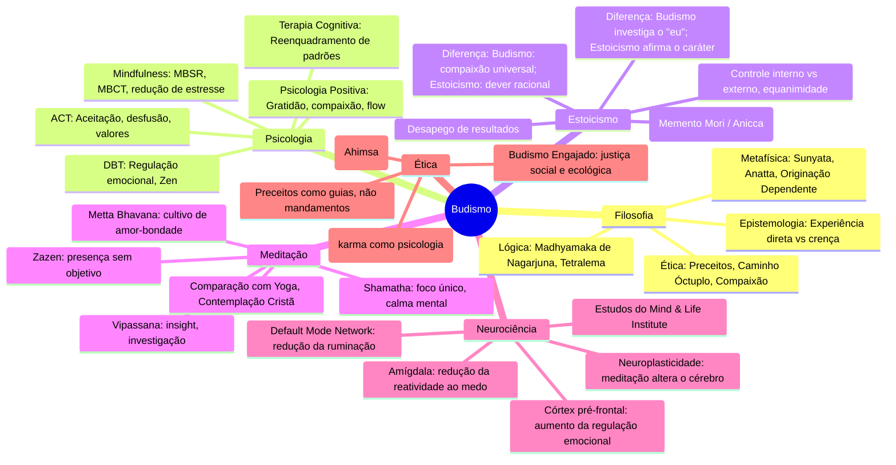
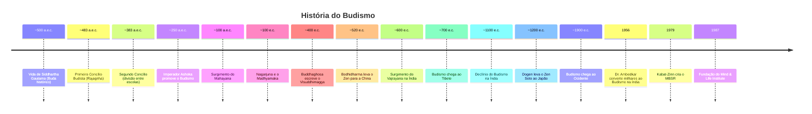

# Budismo

## 1. Introdução

### 1.1 O que é o Budismo?

O Budismo é uma tradição espiritual, filosófica e prática que surgiu no nordeste da Índia por volta do século V a.e.c. Diferente de muitas religiões teístas, o Budismo não se baseia na adoração a um deus criador ou entidade suprema. Trata-se de um caminho de investigação direta da realidade, fundamentado na experiência pessoal, na disciplina mental e na conduta ética. O próprio Buda ensinou que suas palavras não deveriam ser aceitas por fé cega, mas testadas como se testa ouro ao fogo — cada praticante deve verificar os ensinamentos por si mesmo.

O Budismo pode ser compreendido em três dimensões interligadas:

- **Filosofia**: um conjunto de análises lógicas e fenomenológicas sobre a natureza da mente, da realidade e do sofrimento.
- **Religião**: uma estrutura de rituais, devoção, comunidades monásticas e práticas espirituais que visam a transformação interior.
- **Prática**: um conjunto de métodos meditativos e éticos aplicáveis ao dia a dia, visando reduzir o sofrimento e cultivar qualidades positivas.

### 1.2 A Vida de Siddhartha Gautama

Siddhartha Gautama nasceu como príncipe no clã dos Shakya, na região que hoje corresponde ao Nepal. Segundo a tradição, profecias indicavam que ele se tornaria um grande rei ou um grande líder espiritual. Seu pai, desejando que ele fosse rei, cercou-o de prazeres e isolou-o do contato com o sofrimento do mundo.

Aos 29 anos, Siddhartha aventurou-se para fora do palácio e deparou-se com quatro visões que mudaram sua vida:

1. **Um homem doente** — pela primeira vez, viu a doença e o envelhecimento.
2. **Um homem velho** — compreendeu que a decadência física atinge a todos.
3. **Um cadáver** — confrontou-se com a realidade da morte.
4. **Um asceta** — viu um homem que havia renunciado ao mundo em busca da verdade.

Essas visões despertaram nele uma profunda inquietação. Abandonou o palácio, a esposa e o filho recém-nascido para buscar uma resposta ao sofrimento humano. Durante seis anos, praticou austeridades extremas com diversos mestres, mas descobriu que a mortificação não levava à libertação — apenas enfraquecia o corpo e turvava a mente.

Adotou então o *Caminho do Meio* — nem indulgência sensual, nem autoflagelação. Sentou-se sob uma figueira (hoje conhecida como Árvore Bodhi) em Bodhgaya, decidido a não se levantar até compreender a verdade última. Após intensa meditação, atingiu o **Nirvana** — o despertar ou iluminação —, compreendendo profundamente a natureza do sofrimento e o caminho para sua cessação. A partir de então, tornou-se o **Buda**, "o desperto".

Pelos 45 anos seguintes, Buda viajou pelo norte da Índia ensinando a todos — reis e camponeses, homens e mulheres, santos e criminosos — sem distinção de casta ou credo. Faleceu aos 80 anos em Kushinagar, deixando um legado de ensinamentos que se espalhariam por toda a Ásia e, eventualmente, pelo mundo.

### 1.3 As Principais Escolas Budistas

Após a morte de Buda, seus ensinamentos (o *Darma*) foram preservados e transmitidos oralmente, depois escritos. Com o tempo, diferentes interpretações e ênfases deram origem a várias escolas:

#### 1.3.1 Theravada

A escola **Theravada** ("Caminho dos Anciãos") é a mais antiga das escolas budistas existentes. Predominante no Sri Lanka, Tailândia, Mianmar, Laos e Camboja, enfatiza:

- A preservação literal dos discursos originais de Buda (o Cânon Pali).
- A busca pela libertação individual (tornar-se um *arahant*).
- A vida monástica como o caminho mais seguro para o despertar.
- Práticas meditativas como Shamatha e Vipassana.

O ideal no Theravada é o **Arahant**: aquele que, seguindo os ensinamentos, alcançou o Nirvana e se libertou do ciclo de renascimentos.

#### 1.3.2 Mahayana

O **Mahayana** ("Grande Veículo") surgiu nos primeiros séculos da era comum, expandindo-se pela China, Coreia, Japão e Vietnã. Caracteriza-se por:

- Ênfase no ideal do **Bodhisattva** — aquele que busca a iluminação não apenas para si, mas para todos os seres.
- Uma visão mais inclusiva e acessível: a iluminação é possível para leigos, não apenas monges.
- Novos sutras (como o Sutra do Lótus e o Sutra do Coração) que expandem os ensinamentos originais.
- A noção de que todos os seres possuem a **natureza de Buda** — o potencial inato para o despertar.

O Mahayana é a maior tradição budista em número de seguidores.

#### 1.3.3 Vajrayana

O **Vajrayana** ("Veículo do Diamante" ou "Veículo Tântrico") é uma ramificação do Mahayana, predominante no Tibete, Butão, Mongólia e partes do Himalaia. Caracteriza-se por:

- Uso de técnicas tântricas avançadas: mantras, mandalas, visualizações de deidades.
- A ideia de que a iluminação pode ser alcançada rapidamente, não em inúmeras vidas.
- A figura do **Lama** (guru) como essencial para a transmissão dos ensinamentos.
- Rituais elaborados e uma rica iconografia.

O Budismo Tibetano (liderado pelo Dalai Lama) é a expressão mais conhecida do Vajrayana.

#### 1.3.4 Zen

O **Zen** (do sânscrito *dhyana*, "meditação"; chinês *Chan*; japonês *Zen*) é uma escola do Mahayana que se desenvolveu na China a partir do século VI e floresceu no Japão. Suas marcas distintivas:

- Ênfase na **meditação sentada** (Zazen) como prática central.
- Transmissão direta da mente para mente, "fora das escrituras".
- Uso de **koans** — perguntas ou paradoxos aparentemente sem lógica que fraturam o pensamento conceitual.
- Simplicidade, disciplina e integração com artes como caligrafia, cerimônia do chá e arranjo floral (Ikebana).

Escolas Zen principais: **Soto** (ênfase em *Shikantaza*, "apenas sentar") e **Rinzai** (ênfase em koans).

---

## 2. As 4 Nobres Verdades

As Quatro Nobres Verdades (*Chatvari Arya Satyani*) são o núcleo do ensinamento de Buda. Não são dogmas, mas um diagnóstico e uma prescrição — como um médico que identifica uma doença, sua causa, a possibilidade de cura e o tratamento. Essas verdades estruturam todo o caminho budista.

### 2.1 Primeira Nobre Verdade: Dukkha

*Dukkha* é frequentemente traduzido como "sofrimento", mas seu significado é mais amplo: insatisfação fundamental, desconforto existencial, a sensação de que algo está sempre faltando. Buda identificou três tipos principais de *dukkha*:

#### 2.1.1 Dukkha do Sofrimento (Dukkha-dukkhata)

É o sofrimento óbvio e universal: dor física, doença, envelhecimento, morte, perda, separação de quem amamos, encontrar o que não desejamos. São as experiências que qualquer um reconheceria como dolorosas.

#### 2.1.2 Dukkha da Mudança (Viparinama-dukkhata)

É o sofrimento implícito no prazer. Todo prazer é impermanente — quando acaba, sentimos falta. Quanto maior o prazer, maior a eventual dor de sua perda. Mesmo momentos de felicidade intensa carregam a semente da insatisfação porque sabemos que não durarão.

#### 2.1.3 Dukkha do Condicionado (Samkhara-dukkhata)

É o mais sutil e profundo. Refere-se à insatisfação inerente a toda existência condicionada. Enquanto estivermos presos a padrões condicionados de percepção, pensamento e ação (mesmo experiências "neutras"), estamos em estado de *dukkha*. É a ansiedade de fundo que acompanha a existência não desperta.

### 2.2 Segunda Nobre Verdade: Samudaya (A Origem do Sofrimento)

*Samudaya* identifica a causa do sofrimento. Buda apontou três venenos raiz (*kleshas*) como origem:

#### 2.2.1 Desejo (Trishna / Tanha)

O desejo é a sede, o apego, a aversão à insatisfação que nos faz agarrar experiências, objetos, pessoas e identidades. Buda distinguiu três tipos:

- **Desejo sensual** (*kama-tanha*): prazeres dos sentidos.
- **Desejo por existir** (*bhava-tanha*): vontade de continuar sendo, de ter uma identidade fixa.
- **Desejo por não-existir** (*vibhava-tanha*): desejo de aniquilação, de fugir da experiência.

#### 2.2.2 Aversão (Dvesha / Patigha)

É a reação de rejeitar, odiar, irritar-se. Tudo que ameaça nosso senso de eu ou nosso prazer gera aversão. Raiva, medo, nojo, hostilidade são manifestações dessa raiz.

#### 2.2.3 Ignorância (Avidya / Moha)

A ignorância fundamental é não ver a realidade como ela é. Especificamente, ignorar a impermanência (*anicca*), o não-eu (*anatta*) e a insatisfação inerente (*dukkha*). É a raiz mais profunda — dela surgem o desejo e a aversão.

### 2.3 Terceira Nobre Verdade: Nirodha (A Cessação do Sofrimento)

*Nirodha* afirma que a cessação do sofrimento é possível. Ao eliminar o desejo, a aversão e a ignorância, *dukkha* cessa. Esse estado de cessação é o **Nirvana** (em sânscrito; *Nibbana* em pali).

Nirvana significa "extinguir" — como uma chama que se apaga quando o combustível acaba. Não é um lugar ou paraíso, mas uma condição experiencial: a libertação do ciclo de condicionamentos. É o incondicionado, o não-nascido, o não-feito.

Importante: Nirvana não é niilismo. Não é aniquilação da existência, mas cessação do sofrimento e das ilusões que o causam. É paz profunda, liberdade incondicional.

### 2.4 Quarta Nobre Verdade: Magga (O Caminho)

*Magga* é a prescrição: o **Caminho Óctuplo** (*Ariya Atthangika Magga*), o conjunto de oito fatores que, cultivados em conjunto, conduzem à cessação do sofrimento. É detalhado na próxima seção.

---

## 3. O Caminho Óctuplo

O Caminho Óctuplo não é uma sequência linear de passos, mas oito dimensões da prática que devem ser cultivadas simultânea e interdependentemente. Buda o organizou em três categorias: Sabedoria (*Prajna* / *Pañña*), Conduta Ética (*Shila* / *Sila*) e Disciplina Mental (*Samadhi*).

### 3.1 Sabedoria (Prajna)

#### 3.1.1 Entendimento Correto (Samma Ditthi)

É a compreensão correta da realidade: das Quatro Nobres Verdades, da impermanência, do não-eu e da lei do karma. Não é mero conhecimento intelectual, mas uma visão profunda que transforma a perspectiva.

Envolve compreender:
- Que ações têm consequências (karma).
- Que há sofrimento, ele tem causa, pode cessar e há um caminho.
- Que não há um eu permanente e separado.

O entendimento correto se aprofunda com a prática — começa como conceito e torna-se realização direta.

#### 3.1.2 Pensamento Correto (Samma Sankappa)

É a orientação mental alinhada com o despertar. Manifesta-se como:

- **Pensamento de renúncia** (*nekkhamma*): soltar apegos, não se agarrar a prazeres sensoriais.
- **Pensamento de boa vontade** (*avyapada*): cultivar amor-bondade (*metta*), substituir má vontade por compaixão.
- **Pensamento de não-violência** (*avihimsa*): não causar dano a nenhum ser.

### 3.2 Conduta Ética (Shila)

#### 3.2.1 Fala Correta (Samma Vaca)

A comunicação como prática espiritual. Buda recomendou evitar quatro tipos de fala prejudicial:

- **Mentira**: não distorcer a verdade.
- **Fala divisiva**: não semear discórdia entre pessoas.
- **Fala rude**: não usar palavras agressivas ou cruéis.
- **Fala frívola**: não falar sem propósito, não fofocar.

A fala correta é verdadeira, benéfica, oportuna e gentil.

#### 3.2.2 Ação Correta (Samma Kammanta)

Conduta física ética, resumida nos preceitos:

- Não matar nenhum ser senciente.
- Não roubar (tomar o que não é dado).
- Não ter má conduta sexual (não causar dano através da sexualidade).

Para monges, há centenas de preceitos adicionais. Para leigos, estes são os fundamentais.

#### 3.2.3 Meio de Vida Correto (Samma Ajiva)

Ganhar a vida de forma que não cause dano a outros seres. Buda especificou cinco profissões a serem evitadas:

- Comércio de armas.
- Comércio de seres vivos (incluindo escravidão e tráfico).
- Comércio de carne (abate e processamento).
- Comércio de intoxicantes (álcool, drogas).
- Comércio de venenos.

Em sentido mais amplo, o meio de vida correto envolve trabalhar com integridade, honestidade e consciência do impacto de suas atividades.

### 3.3 Disciplina Mental (Samadhi)

#### 3.3.1 Esforço Correto (Samma Vayama)

A energia mental direcionada ao despertar. Quatro tipos de esforço:

1. Prevenir que estados mentais prejudiciais surjam.
2. Abandonar estados mentais prejudiciais já presentes.
3. Cultivar estados mentais benéficos ainda não presentes.
4. Manter e aperfeiçoar estados mentais benéficos já presentes.

É o trabalho contínuo de cuidar da mente como um jardineiro cuida de um jardim.

#### 3.3.2 Atenção Plena Correta (Samma Sati)

*Sati* é a presença alerta, a capacidade de estar consciente do momento presente sem julgamento e sem esquecer. Buda ensinou os **Quatro Fundamentos da Atenção Plena** (*Satipatthana*):

1. **Corpo** (*kaya*): consciência da respiração, posturas, movimentos, partes do corpo, decomposição.
2. **Sensações** (*vedana*): observar sensações como agradáveis, desagradáveis ou neutras — sem reagir.
3. **Mente** (*citta*): observar estados mentais — raiva, desejo, tranquilidade, distração — com clareza.
4. **Fenômenos** (*dhamma*): observar os objetos mentais — os cinco obstáculos, os agregados, as faculdades, os fatores do despertar, as Quatro Nobres Verdades.

#### 3.3.3 Concentração Correta (Samma Samadhi)

É o cultivo de estados profundos de unificação da mente (*jhanas* / *dhyanas*). A mente, livre dos cinco obstáculos (desejo sensual, má vontade, preguiça, inquietação, dúvida), estabiliza-se em absorção meditativa.

A concentração correta não é absorção por si só, mas quando combinada com os demais fatores do caminho, torna-se veículo para o insight libertador.

### 3.4 Interdependência dos Oito Fatores

O Caminho Óctuplo é frequentemente representado como uma roda de oito raios — todos se sustentam mutuamente. Sem conduta ética, a mente não se acalma para a meditação. Sem meditação, o entendimento correto permanece superficial. Sem entendimento correto, a conduta ética pode tornar-se rígida ou dogmática.

Cada fator fortalece os demais. O caminho não é uma escada a ser subida degrau por degrau, mas uma teia de práticas que se reforçam.

---

## 4. Conceitos Fundamentais

### 4.1 Anatta (Não-Eu)

*Anatta* é um dos conceitos mais revolucionários do Budismo. Buda ensinou que não há uma essência permanente, imutável e independente — um "eu" ou "alma" — em nenhum lugar da existência.

A ilusão do eu surge dos **Cinco Agregados** (*Skandhas*):

1. **Forma** (*Rupa*): o corpo físico, matéria.
2. **Sensação** (*Vedana*): experiências agradáveis, desagradáveis, neutras.
3. **Percepção** (*Sañña*): reconhecimento e identificação.
4. **Formações Mentais** (*Sankhara*): volições, hábitos, emoções, padrões condicionados.
5. **Consciência** (*Viññana*): a consciência dos sentidos e da mente.

Buda convida à investigação direta: em qual desses agregados encontramos um "eu" permanente? O corpo muda a cada instante. As sensações vêm e vão. Os pensamentos surgem e desaparecem. A consciência é um fluxo, não uma entidade.

Compreender *anatta* não é adotar uma crença, mas ver diretamente que a noção de um "eu" fixo é uma construção mental. Essa visão liberta do apego egoico e do medo da morte.

**Não confundir com niilismo**: *anatta* não nega a existência funcional do indivíduo. Diz que o que chamamos de "eu" é um processo dinâmico, não uma substância permanente.

### 4.2 Anicca (Impermanência)

*Anicca* é a constatação de que todos os fenômenos — materiais, mentais, emocionais, sociais, cósmicos — estão em constante mudança. Nada permanece idêntico por dois momentos consecutivos.

Implicações de *anicca*:

- **Nos objetos**: montanhas erodem, estrelas explodem, civilizações desaparecem.
- **No corpo**: células nascem e morrem, envelhecemos, adoecemos.
- **Nas emoções**: a raiva passa, a alegria passa, o tédio passa.
- **Nos pensamentos**: um fluxo incessante que não controlamos.
- **Nos relacionamentos**: pessoas entram e saem de nossas vidas.

A impermanência não é motivo de pessimismo. Ao contrário: se tudo muda, a mudança para melhor é possível. O sofrimento pode cessar. A ignorância pode dar lugar à sabedoria.

A prática de *anicca* é contemplar a mudança em tempo real, durante a meditação e na vida diária.

### 4.3 Karma e Renascimento

O Budismo ensina **karma** (ação intencional) e **renascimento** (não reencarnação).

**Karma**: cada ação intencional (física, verbal ou mental) produz uma semente que amadurece em circunstâncias futuras. Não é destino ou predestinação — é a lei de causa e efeito no âmbito psicológico e ético. Ações com raízes em desejo, aversão e ignorância geram sofrimento futuro; ações com raízes em generosidade, amor e sabedoria geram bem-estar futuro.

**Renascimento vs Reencarnação**: O Budismo rejeita a ideia de uma alma permanente que transmigra de um corpo a outro (reencarnação). Em vez disso, ensina renascimento: um fluxo de consciência condicionado que, como uma chama passando de uma vela a outra, continua sem ser a mesma chama nem completamente diferente.

O que renasce não é um "eu" — é a continuidade de padrões kármicos. A analogia clássica: a chama de uma vela acende outra. A segunda chama não é idêntica à primeira, mas não surge sem ela.

### 4.4 Sunyata (Vazio)

*Sunyata* (vazio, vacuidade) é um conceito central do Budismo Mahayana, especialmente desenvolvido por **Nagarjuna** (século II e.c.) e pela escola **Madhyamaka** (Caminho do Meio).

Vazio não significa "nada existe". Significa que **todos os fenômenos são vazios de existência inerente, independente e permanente**. Tudo o que existe surge em dependência de causas e condições (*pratityasamutpada* — originação dependente). Nada existe por si mesmo, isoladamente.

Uma flor é vazia de "floridade" inerente: ela depende de sementes, solo, água, luz solar, carbono, tempo, e de uma mente que a identifica como "flor". Sem essas causas e condições, não há flor. A flor existe como processo relacional, não como substância isolada.

Nagarjuna argumentou que a verdade última (*paramartha satya*) é que todos os fenômenos são vazios. No entanto, a verdade convencional (*samvriti satya*) reconhece que flores, carros e pessoas existem funcionalmente. As duas verdades coexistem — não há conflito entre elas para quem compreende.

Compreender *sunyata* dissolver o apego e a fixação, revela a interdependência de todos os seres e abre caminho para a compaixão universal.

### 4.5 Bodhisattva

**Bodhisattva** (literalmente "ser desperto" ou "herói da iluminação") é o ideal central do Mahayana. Diferente do Arahant (que busca a libertação individual), o Bodhisattva compromete-se a:

- Alcançar a iluminação para o benefício de todos os seres.
- Adiar a entrada final no Nirvana até que todos os seres estejam libertos.
- Cultivar as **Perfeições** (*Paramitas*): generosidade, disciplina, paciência, esforço, concentração e sabedoria.

O **Voto do Bodhisattva** é um compromisso solene: "Que eu me torne um Buda para o benefício de todos os seres".

O Bodhisattva é motivado por duas qualidades gêmeas: **sabedoria** (*prajna*) — a compreensão do vazio — e **compaixão** (*karuna*) — o desejo de aliviar o sofrimento alheio.

Bodhisattvas famosos: **Avalokiteshvara** (compaixão), **Manjushri** (sabedoria), **Kshitigarbha** (protetor dos seres nos reinos inferiores). No Budismo Zen, todos os praticantes são encorajados a seguir o caminho do Bodhisattva.

### 4.6 Compaixão (Karuna) e Amor-Bondade (Metta)

**Karuna** (compaixão) é o desejo sincero de que todos os seres se libertem do sofrimento e das causas do sofrimento. É a resposta emocional à constatação de que todos os seres, assim como nós, desejam felicidade e não desejam sofrer.

**Metta** (amor-bondade) é o desejo genuíno de que todos os seres sejam felizes e estejam em paz. É um amor incondicional, sem apego ou posse, sem distinção entre amigos, inimigos ou estranhos.

No Budismo, *metta* e *karuna* são cultivadas ativamente através da meditação (*Metta Bhavana*) e estendidas progressivamente:

1. A si mesmo.
2. A uma pessoa querida.
3. A uma pessoa neutra.
4. A uma pessoa difícil (inimigo).
5. A todos os seres, sem exceção.

A prática sistemática dessas qualidades dissolve as barreiras entre eu e outro, enfraquece o egoísmo e gera uma mente aberta, acolhedora e pacífica.

---

## 5. Meditação Budista

A meditação (*bhavana* — "cultivo mental") é o coração da prática budista. Existem inúmeras técnicas, mas todas compartilham o objetivo de acalmar a mente e gerar insight sobre a natureza da realidade.

### 5.1 Shamatha (Atenção Focada)

*Shamatha* (sânscrito; *samatha* em pali) significa "tranquilidade" ou "pacificação". É o cultivo da atenção estável e concentrada, geralmente utilizando um objeto de foco:

- A respiração (o mais comum).
- Uma imagem mental (como uma esfera de luz).
- Um mantra.
- Uma chama de vela.
- Sensações corporais.

O praticante treina a mente a retornar suavemente ao objeto escolhido cada vez que se distrai. Com prática consistente, a mente torna-se progressivamente mais calma, menos reativa e mais unificada.

Shamatha é frequentemente comparada ao treinamento de um músculo — a atenção é fortalecida pela repetição do movimento de notar a distração e retornar.

Os estados profundos de *shamatha* são chamados **dhyanas** (*jhanas*) — absorções meditativas caracterizadas por êxtase, felicidade, equanimidade e unidirecionalidade da mente.

### 5.2 Vipassana (Insight)

*Vipassana* significa "ver claramente" ou "insight". Enquanto *shamatha* acalma a mente, *vipassana* investiga a natureza da realidade.

O praticante, tendo estabelecido alguma estabilidade mental, volta a atenção para:

- A impermanência (*anicca*) de todas as experiências.
- A insatisfatoriedade (*dukkha*) presente no apego.
- O não-eu (*anatta*) — a ausência de um observador fixo.

Vipassana não é análise intelectual, mas observação direta e contínua da experiência momento a momento. O meditador nota sensações surgindo e desaparecendo, pensamentos vindo e indo, emoções se formando e se dissolvendo.

Com o tempo, a compreensão direta das Três Marcas da Existência substitui a crença conceitual, levando à libertação.

Shamatha e Vipassana são complementares — tradicionalmente, pratica-se ambas em conjunto.

### 5.3 Meditação Zazen (Zen)

*Zazen* ("apenas sentar") é a prática central do Budismo Zen. No Zen Soto, a ênfase está em ***Shikantaza*** — "apenas sentar, nada mais". O praticante senta-se em postura ereta (lótus, meio-lótus, birmanesa ou em uma cadeira), mantém a atenção na respiração e na postura, e simplesmente permite que pensamentos e sensações passem sem se agarrar ou rejeitar.

No Zen, não há objetivo a alcançar — a prática é a própria realização. Como disse o mestre Dogen: "Sentar-se é o despertar".

No Zen Rinzai, utiliza-se **koans**: perguntas ou afirmações paradoxais como "Qual é o som de uma mão batendo palma?" ou "Qual era sua face antes de seus pais nascerem?" que não podem ser resolvidas pelo intelecto. O koan força a mente a abandonar o pensamento conceitual e experimentar diretamente a natureza da realidade.

### 5.4 Metta Bhavana (Meditação da Bondade Amorosa)

*Metta Bhavana* é a prática sistemática de cultivar amor-bondade. Roteiro básico da prática:

1. Sente-se confortavelmente, olhos fechados, respiração natural.
2. Cultive sentimentos de calor e bondade para consigo mesmo. Repita mentalmente frases como:
   - "Que eu seja feliz."
   - "Que eu esteja em paz."
   - "Que eu esteja seguro."
   - "Que eu viva com leveza."
3. Visualize uma pessoa querida e estenda os mesmos desejos a ela.
4. Visualize uma pessoa neutra (alguém que você vê mas não conhece bem) e estenda os mesmos desejos.
5. Visualize uma pessoa com quem você tem dificuldade (comece com desafios leves) e estenda os mesmos desejos.
6. Gradualmente, estenda a todos os seres — em todas as direções, sem exceção.

A prática regular de *Metta Bhavana* reduz a hostilidade, aumenta a empatia e gera uma profunda sensação de conexão com todos os seres.

### 5.5 Meditação Andando (Kinhin)

*Kinhin* é a meditação caminhando, praticada entre períodos de meditação sentada no Zen, mas também como prática independente.

O praticante caminha lentamente, em passo muito consciente — cada movimento é feito com atenção plena. A atenção pode estar nas sensações dos pés tocando o chão, na respiração coordenada com os passos, ou simplesmente no ato de caminhar.

No Zen, *kinhin* é praticado em ritmo lento e deliberado. Em outras tradições (como no Budismo Theravada ou no *walking meditation* de Thich Nhat Hanh), pode ser mais fluido, mas igualmente consciente.

### 5.6 Mindfulness na Vida Diária

O Budismo enfatiza que a meditação não se limita à almofada. O verdadeiro teste da prática é como vivemos cada momento do dia.

**Mindfulness** (*sati*) na vida diária envolve:

- Comer com atenção: saborear cada mordida, sem distrações.
- Lavar louça com atenção: sentir a água, o sabão, o movimento das mãos.
- Dirigir com atenção: sem celular, sem divagar, presente ao volante.
- Ouvir com atenção: sem interromper, sem planejar a resposta, presente ao outro.
- Trabalhar com atenção: uma tarefa de cada vez, com presença total.

Thich Nhat Hanh ensinava que não há separação entre prática e vida. Cada atividade é uma oportunidade de despertar.

---

## 6. Budismo no Ocidente

### 6.1 Influência na Psicologia

O Budismo exerceu influência transformadora sobre a psicologia ocidental, especialmente a partir da segunda metade do século XX.

#### 6.1.1 Mindfulness-Based Stress Reduction (MBSR)

Desenvolvido por Jon Kabat-Zinn em 1979 na Universidade de Massachusetts, o MBSR é um programa de oito semanas que integra ensinamentos de meditação budista (principalmente Vipassana) em um formato secular e baseado em evidências. Kabat-Zinn removeu o arcabouço religioso, mantendo as técnicas meditativas. O MBSR é hoje aplicado em hospitais, escolas, empresas e prisões em todo o mundo.

#### 6.1.2 Mindfulness-Based Cognitive Therapy (MBCT)

Desenvolvido por Zindel Segal, Mark Williams e John Teasdale, o MBCT combina mindfulness com terapia cognitivo-comportamental para prevenir recaídas de depressão. É um dos tratamentos psicológicos mais validados cientificamente para depressão recorrente.

#### 6.1.3 Acceptance and Commitment Therapy (ACT)

Desenvolvida por Steven Hayes, a ACT incorpora princípios budistas como aceitação, desfusão cognitiva (observar pensamentos sem se identificar com eles) e contato com o momento presente. A ACT ensina flexibilidade psicológica — a capacidade de estar presente com experiências difíceis sem lutar contra elas.

#### 6.1.4 Outras Abordagens

- **Terapia Dialética Comportamental** (DBT, Marsha Linehan): incorpora meditação Zen e mindfulness.
- **Compaixão Focada na Terapia** (CFT, Paul Gilbert): inspirada em Metta Bhavana.
- **Mindfulness para crianças**: programas em escolas ao redor do mundo.

### 6.2 Budismo Secular

**Stephen Batchelor** é a principal figura do Budismo Secular. Em livros como *Budismo Sem Crenças* (1997), ele propõe uma abordagem agnóstica:

- Manter as práticas meditativas e éticas.
- Deixar de lado crenças em renascimento, karma, reinos celestiais e infernais.
- Focar no que pode ser verificado empiricamente aqui e agora.
- Tratar Buda como um ser humano inspirador, não uma figura divina.

O Budismo Secular dialoga fortemente com o ceticismo científico e o humanismo, atraindo muitos ocidentais que buscam uma prática espiritual sem dogmas.

### 6.3 Budismo Engajado (Engaged Buddhism)

Cunhado pelo monge vietnamita **Thich Nhat Hanh**, o Budismo Engajado aplica os princípios budistas a problemas sociais, políticos e ecológicos:

- **Paz e não-violência**: Thich Nhat Hanh foi indicado ao Prêmio Nobel da Paz por seu ativismo durante a Guerra do Vietnã.
- **Justiça social**: budistas engajados trabalham com direitos humanos, igualdade racial e de gênero.
- **Ecologia**: a Terra é vista como um ser senciente. A crise climática é uma crise de consciência coletiva.
- **Economia budista**: proposta por E.F. Schumacher e desenvolvida por economistas budistas — uma economia baseada em suficiência, não em crescimento infinito.

Outros nomes importantes: o Dalai Lama (paz, direitos humanos, diálogo inter-religioso), Sulak Sivaraksa (ativista tailandês), Joanna Macy (ecologia profunda e budismo), Bernie Glassman (Zen Peacemakers).

### 6.4 Budismo e Ciência

O Dalai Lama é um grande promotor do diálogo entre budismo e ciência. Em 1987, fundou o **Mind & Life Institute**, que organiza encontros regulares entre monges budistas, cientistas e filósofos.

Áreas de colaboração:

- **Neurociência da meditação**: estudos mostram que a meditação altera a estrutura e função do cérebro (neuroplasticidade), aumentando a densidade de massa cinzenta, fortalecendo a regulação emocional e reduzindo a ativação da amígdala (resposta ao medo).
- **Psicologia positiva**: as práticas de compaixão e gratidão cultivadas no budismo são estudadas como fatores de bem-estar.
- **Física e filosofia da mente**: a noção budista de interdependência ressoa com descobertas da física quântica e da biologia sistêmica.
- **Estudos sobre consciência**: o budismo oferece um mapa detalhado dos estados mentais que a ciência ocidental está começando a explorar.

O livro *Emoções Destrutivas*, de Daniel Goleman, documenta um diálogo histórico entre o Dalai Lama e neurocientistas sobre a natureza das emoções e seu papel na vida ética.

---

## 7. Exercícios Práticos

### 7.1 Meditação de Respiração (Anapanasati) Guiada

*Anapanasati* é a atenção plena na respiração — uma das práticas mais universais do Budismo. Siga este roteiro:

**Preparação** (2 minutos):
1. Sente-se em uma posição confortável — pernas cruzadas ou em uma cadeira, coluna ereta, mãos no colo.
2. Olhos suavemente fechados ou semiabertos, olhar solto a cerca de um metro à frente.
3. Faça três respirações profundas para sinalizar o início da prática. Depois, deixe a respiração fluir naturalmente.

**Estágio 1: Contagem** (5-10 minutos):
1. Ao inspirar, conte mentalmente "1". Ao expirar, "1".
2. Inspire "2", expire "2". Continue até 10.
3. Quando perder a conta ou divagar, gentilmente recomece do 1.
4. Não brigue com a distração — apenas note e retorne.

**Estágio 2: Atenção sem contagem** (10-20 minutos):
1. Abandone a contagem. Apenas sente com a respiração.
2. Note o ar entrando pelas narinas, o peito ou abdômen se expandindo, o ar saindo, a pausa antes da próxima inspiração.
3. Quando a mente divagar (e ela vai divagar), simplesmente note: "pensando", e retorne à respiração.
4. Seja gentil consigo mesmo — o retorno suave é o coração da prática.

**Encerramento** (1-2 minutos):
1. Gradualmente, amplie a atenção para incluir o corpo inteiro sentado.
2. Note as sensações de contato, sons ao redor, a temperatura do ar.
3. Lentamente, abra os olhos. Faça uma pausa antes de se levantar.

**Dica**: comece com 5 minutos e aumente gradualmente. Consistência é mais importante que duração.

### 7.2 Prática Metta (Bondade Amorosa) — Roteiro

Dedique 15 a 30 minutos para esta prática:

**Fase 1: Autocompaixão** (5 minutos):
- Sente-se em postura confortável. Respire profundamente algumas vezes.
- Coloque a mão sobre o coração. Sinta o calor da mão.
- Repita mentalmente, com sentimento genuíno:
  - "Que eu seja feliz."
  - "Que eu esteja saudável."
  - "Que eu esteja seguro."
  - "Que eu viva com leveza e paz."
- Se sentir resistência (é mais comum do que parece), seja paciente. Apenas continue.

**Fase 2: Uma pessoa querida** (5 minutos):
- Visualize alguém por quem você sente amor natural — um familiar próximo, um amigo querido, um animal de estimação.
- Sinta a presença dessa pessoa. Estenda os mesmos desejos:
  - "Que você seja feliz."
  - "Que você esteja saudável."
  - "Que você esteja seguro."
  - "Que você viva com leveza e paz."
- Permita que a sensação de afeto e bondade preencha seu coração.

**Fase 3: Pessoa neutra** (3 minutos):
- Visualize alguém que você encontra mas não conhece bem — o carteiro, o barista, um colega distante.
- Estenda os mesmos votos. Note a sensação de nivelamento — essa pessoa, como você, deseja ser feliz.

**Fase 4: Pessoa difícil** (3 minutos):
- Visualize alguém com quem você tem conflito ou desconforto. Comece com desafios leves.
- Estenda os mesmos votos. Não force — se sentir resistência, retorne à pessoa querida.
- Lembre-se: esta prática não é sobre concordar com o outro, mas sobre reconhecer a humanidade compartilhada.

**Fase 5: Todos os seres** (5 minutos):
- Expanda o coração em todas as direções: à frente, atrás, à direita, à esquerda, acima, abaixo.
- "Que todos os seres, em todas as direções, sejam felizes, estejam saudáveis, estejam seguros, vivam com leveza."
- Inclua todos: humanos, animais, visíveis e invisíveis, próximos e distantes.

**Encerramento**: fique em silêncio por um minuto, sentindo o coração aberto. Depois, lentamente, retorne.

### 7.3 Diário de Impermanência

Observe uma mudança em sua vida. Pode ser externa (uma estação que passou, uma planta que cresceu) ou interna (um humor que mudou, uma opinião que se transformou).

**Perguntas para o diário**:
1. O que observei que mudou?
2. Como me senti ao perceber essa mudança? (tristeza, alívio, surpresa, aceitação?)
3. Que evidências tenho de que essa mudança já estava em andamento antes de eu notá-la?
4. Esta mudança foi repentina ou gradual?
5. Houve resistência em aceitar a mudança? Se sim, como se manifestou?
6. O que esta mudança me ensina sobre a natureza da realidade?

**Variação**: ao longo de uma semana, escolha um objeto (uma fruta, uma flor, uma nuvem) e observe-o por alguns minutos a cada dia, registrando as transformações.

### 7.4 Identifique Padrões de Desejo e Aversão

Durante um dia, preste atenção aos momentos em que o desejo ou a aversão surgem em sua mente. Não julgue — apenas observe.

**Exercício**: ao final do dia, responda:

1. **Desejos identificados hoje**:
   - Exemplos: desejo por comida específica, por atenção, por conforto, por distração (celular, TV), por validação.
   - Como o desejo se manifestou no corpo? (tensão, salivação, inquietação?)
   - Como o desejo se manifestou na mente? (fantasia, planejamento, impaciência?)

2. **Aversões identificadas hoje**:
   - Exemplos: irritação com trânsito, rejeição a uma opinião contrária, desconforto com uma tarefa.
   - Como a aversão se manifestou no corpo? (mandíbula tensa, ombros contraídos, aperto no peito?)
   - Qual pensamento acompanhou a aversão? ("isso não deveria estar acontecendo")

3. **Padrões**:
   - Há algum desejo ou aversão recorrente nos últimos dias?
   - O que você tipicamente faz quando sente desejo ou aversão? Age imediatamente? Distrai-se? Observa?

4. **Experimentação**: amanhã, ao notar um desejo ou aversão, em vez de agir automaticamente, respire três vezes antes de responder. O que mudou?

### 7.5 Refletir Sobre o Não-Eu: O Que Sou "Eu" Realmente?

Esta é uma investigação inspirada nas instruções de Buda sobre os Cinco Agregados. Sente-se calmamente e reflita:

**Estágio 1: O corpo**:
- "Eu" sou meu corpo? Meu corpo muda constantemente — células morrem, o metabolismo funciona sem meu controle. Se eu perder um braço, "eu" diminuo? Se eu receber um transplante de coração, "eu" ganho algo? O corpo que eu tinha aos 10 anos não é o mesmo de hoje. Onde está o "eu" no corpo?

**Estágio 2: As sensações**:
- "Eu" sou minhas sensações? Sensações surgem e desaparecem a cada momento — agradáveis, desagradáveis, neutras. Se sinto dor, "eu" estou com dor? A dor não é "minha" — ela surge, permanece um tempo, desaparece. Quem sou eu quando a sensação passa?

**Estágio 3: As percepções**:
- "Eu" sou minhas percepções? Tudo que percebo depende de condições — luz, posição, órgãos dos sentidos, interpretação. Duas pessoas veem a mesma cena de formas diferentes. A percepção é confiável? Se eu percebo algo erradamente, "eu" estou errado?

**Estágio 4: As formações mentais**:
- "Eu" sou meus pensamentos e emoções? Pensamentos surgem do nada, sem meu convite. Emoções mudam como o clima. Se estou com raiva, "eu" estou com raiva — ou a raiva está presente na mente? Se eu não me identificar com o pensamento, ele se desfaz. Quem sou eu quando não há pensamento?

**Estágio 5: A consciência**:
- "Eu" sou a consciência? A consciência muda conforme o conteúdo. Consciência de som, consciência de pensamento, consciência de silêncio. A consciência é como um espelho — reflete qualquer coisa que aparece, mas não é nada do que reflete. Se "eu" sou apenas o espelho, onde está o "eu"?

**Conclusão**: Não se apresse em encontrar uma resposta. A investigação em si é a prática. Buda não pede que você acredite em anatta — pede que investigue. Permaneça na pergunta "Quem sou eu?" sem buscar uma resposta conceitual. A resposta não está nas palavras.

---

## 8. Cross-Mapping: Conexões com Outras Áreas

### 8.1 Comparação Rápida: Budismo vs Estoicismo

| Aspecto | Budismo | Estoicismo |
|---------|---------|------------|
| Natureza | Não-teísta, prática experiencial | Filosofia racional, virtude como bem supremo |
| Sofrimento | Dukkha: inerente à existência condicionada | Sofrimento vem de julgamentos, não de eventos |
| Eu | Anatta: não há eu permanente | O eu é a razão, o caráter moral |
| Impermanência | Central (Anicca) | Presente (Memento Mori) |
| Prática | Meditação, mindfulness, ética | Disciplina mental, estoicismo prático |
| Compaixão | Universal e ativa (Karuna) | Dever de benevolência (Oikeiosis) |
| Objetivo | Nirvana: cessação do sofrimento | Eudaimonia: vida virtuosa em harmonia com a natureza |
| Morte | Parte do ciclo de renascimentos (ou libertação) | Evento natural, não deve ser temido |

### 8.2 Budismo e Hinduísmo

Embora o Budismo tenha surgido no contexto hindu (ou brâmane) da Índia antiga, ele fez rupturas significativas:

| Aspecto | Budismo | Hinduísmo |
|---------|---------|-----------|
| Autoridade textual | Rejeita os Vedas como autoridade suprema | Os Vedas são a revelação suprema |
| Eu/Atman | Anatta: não há eu permanente | Atman: o eu real é eterno e idêntico a Brahman |
| Castas | Rejeita o sistema de castas | O sistema de castas é parte da ordem social |
| Deus/deuses | Não-teísmo (deuses existem mas não são criadores) | Politeísmo com um princípio supremo (Brahman) |
| Prática | Meditação e Caminho Óctuplo | Devoção (bhakti), rituais, yoga |
| Nirvana/Moksha | Nirvana: cessação do sofrimento | Moksha: libertação do ciclo, união com Brahman |
| Método principal | Investigação direta e meditação | Devoção, conhecimento (jnana), ação (karma) |

Apesar das diferenças, há influências mútuas. O Budismo influenciou o hinduísmo (especialmente o Advaita Vedanta de Shankara) e absorveu elementos da cultura indiana.

### 8.3 Budismo e Filosofia Ocidental

| Filósofo | Ponto de Convergência |
|----------|----------------------|
| Hume | Crítica ao eu substancial (similar a Anatta) |
| Kant | Ética universal (similar aos preceitos) |
| Schopenhauer | Sofrimento como essência da vida, compaixão |
| Nietzsche | Crítica ao dogmatismo, afirmação da vida (embora diferindo no niilismo) |
| Wittgenstein | Limites da linguagem (similar ao Zen) |
| Heidegger | Ser-no-mundo, finitude |
| Processo (Whitehead) | Interdependência, fluxo |

### 8.4 Budismo e Ciência Cognitiva

| Conceito Budista | Correlato Científico |
|------------------|---------------------|
| Anicca (impermanência) | Fluxo de consciência, processamento dinâmico |
| Anatta (não-eu) | Módulo do self como construção cerebral |
| Sunyata (vazio) | Dependência contextual, emergence |
| Karma (causalidade) | Condicionamento, hábitos neurais |
| Dukkha (sofrimento) | Vieses cognitivos, sistema de recompensa |
| Shamatha (concentração) | Atenção sustentada, ondas theta/gama |
| Mindfulness | Regulação atencional, meta-consciência |

---

## 9. Referências e Leituras Recomendadas

### 9.1 Obras Fundamentais do Budismo Clássico

- **Dhammapada** — A coletânea de ditos do Buda, parte do Cânon Pali. A melhor introdução aos ensinamentos originais.
- **Sutra do Coração** (*Prajnaparamita Hridaya*) — Texto central do Mahayana sobre o vazio. Extremamente curto e profundo.
- **Sutra do Diamante** — Diálogo entre Buda e Subhuti sobre a natureza da realidade e do Bodhisattva.
- **Visuddhimagga** (O Caminho da Purificação), de Buddhaghosa — Manual completo do Budismo Theravada.
- **Fundamentos da Atenção Plena** (*Satipatthana Sutta*) — O discurso de Buda sobre mindfulness.

### 9.2 Obras Contemporâneas Recomendadas

- **Thich Nhat Hanh** — *O Coração dos Ensinamentos de Buda*: a melhor introdução geral. Acessível, profundo, prático.
- **Thich Nhat Hanh** — *A Iluminação de Buda*: biografia espiritual com contexto histórico.
- **Thich Nhat Hanh** — *O Milagre da Atenção Plena*: mindfulness na vida cotidiana.
- **Dalai Lama** — *Uma Ética para o Novo Milênio*: ética budista para o mundo moderno.
- **Dalai Lama & Howard Cutler** — *A Arte da Felicidade*: diálogo entre budismo e psicologia.
- **Stephen Batchelor** — *Budismo Sem Crenças*: budismo secular e agnóstico.
- **Stephen Batchelor** — *Confissões de um Budista Agnóstico*: autobiografia e reflexão filosófica.
- **Alan Watts** — *O Caminho do Zen*: introdução clássica ao Zen para o Ocidente.
- **Alan Watts** — *A Sabedoria da Insegurança*: sobre impermanência e viver no presente.
- **Shunryu Suzuki** — *Mente Zen, Mente de Principiante*: ensinamentos diretos de um mestre Zen.
- **Daniel Goleman** — *Emoções Destrutivas*: diálogo histórico entre Dalai Lama e cientistas.
- **Daniel Goleman & Richard Davidson** — *A Ciência da Meditação*: o que a ciência descobriu sobre a prática.
- **Jon Kabat-Zinn** — *Aonde Você Vai, Você Já Está*: mindfulness e MBSR.
- **Jack Kornfield** — *A Roda do Dharma*: prática Budista no Ocidente.
- **Sogyal Rinpoche** — *O Livro Tibetano do Viver e do Morrer*: budismo tibetano contemporâneo.
- **Joseph Goldstein** — *Mindfulness: Um Guia Prático*: instruções detalhadas de meditação Vipassana.
- **Bhikkhu Bodhi** — *No Budismo*: ensaios sobre a doutrina Theravada.
- **Nagarjuna** — *Mulamadhyamakakarika* (Os Versos Fundamentais do Caminho do Meio): texto fundacional do Madhyamaka.

### 9.3 Referências Brasileiras

- **Lama Padma Samten** — *A Roda da Vida*: introdução ao budismo tibetano por um dos principais mestres brasileiros.
- **Lama Michel Rinpoche** — *A Arte da Meditação*: práticas guiadas.
- **Ricardo Sasaki** — *Budismo para Iniciantes*: introdução acessível em português.

### 9.4 Canais e Recursos Online

- **Access to Insight** (accesstoinsight.org) — Vasto acervo de textos do Cânon Pali em inglês.
- **Lotus Sutra Translation** — Recursos sobre o Sutra do Lótus.
- **Mind & Life Institute** (mindandlife.org) — Diálogos entre budismo e ciência.
- **Centro de Estudos Budistas Nalanda** — Cursos online gratuitos.
- **Dharma.org** — (Insight Meditation Society) — Retiros e ensinamentos.

### 9.5 Citações

> "Não acredite em algo simplesmente porque muitos o dizem. Não acredite em algo simplesmente porque está escrito em textos sagrados. Não acredite em algo simplesmente por causa da autoridade de seus mestres. Mas depois de observar e analisar, quando você encontra algo que está de acordo com a razão e conduz ao bem-estar de todos, então aceite e viva de acordo com isso."
> — Buda, *Kalama Sutta*

> "A paz está em cada passo."
> — Thich Nhat Hanh

> "A mente do principiante tem muitas possibilidades; a mente do especialista tem poucas."
> — Shunryu Suzuki

> "A impermanência é a verdadeira natureza de todas as coisas. Compreender isso é o início da sabedoria."
> — Dalai Lama

> "Você não pode parar as ondas, mas pode aprender a surfar."
> — Jon Kabat-Zinn

---

## 10. Glossário Rápido

| Termo | Sânscrito | Significado |
|-------|-----------|-------------|
| Buda | Buddha | "O desperto" ou "o iluminado" |
| Darma | Dharma | Os ensinamentos de Buda; a verdade última; os fenômenos |
| Sangha | Sangha | A comunidade de praticantes |
| Nirvana | Nirvana | A cessação do sofrimento; o incondicionado |
| Karma | Karma | Ação intencional e suas consequências |
| Samsara | Samsara | O ciclo de nascimento, morte e renascimento |
| Anatta | Anatman | Não-eu; ausência de uma essência permanente |
| Anicca | Anitya | Impermanência |
| Dukkha | Dukkha | Sofrimento; insatisfação fundamental |
| Sunyata | Shunyata | Vazio; ausência de existência inerente |
| Bodhisattva | Bodhisattva | Ser que busca a iluminação para todos |
| Prajna | Prajna | Sabedoria; compreensão profunda |
| Karuna | Karuna | Compaixão |
| Metta | Maitri | Amor-bondade |
| Shamatha | Shamatha | Meditação de tranquilidade | 
| Vipassana | Vipashyana | Meditação de insight |
| Zazen | — | Meditação sentada no Zen |
| Kinhin | — | Meditação caminhando no Zen |
| Skandha | Skandha | Agregado; os cinco componentes do ser |
| Tanha | Trishna | Desejo; sede | 
| Avidya | Avidya | Ignorância fundamental |
| Madhyamaka | Madhyamaka | Escola do Caminho do Meio |
| Sila | Shila | Conduta ética |
| Samadhi | Samadhi | Concentração; unificação mental |
| Sati | Smriti | Atenção plena; mindfulness |

---

## 11. Linha do Tempo Simplificada

---

## 12. Notas Adicionais

### 12.1 O Budismo como Caminho, Não como Crença

Uma das contribuições mais importantes do Budismo para o mundo moderno é sua ênfase na **experiência direta** em detrimento da **crença**. Buda repetidamente incentivou seus discípulos a não aceitar seus ensinamentos por fé, mas a verificá-los por si mesmos.

Isso torna o Budismo particularmente compatível com o pensamento científico e com pessoas que se sentem desconfortáveis com dogmas religiosos. O Budismo não pede que você acredite em algo — pede que você pratique e veja por si mesmo.

### 12.2 O Budismo e o Sofrimento

O Budismo é frequentemente acusado de ser pessimista por começar com a afirmação "a vida é sofrimento". Mas essa é uma leitura superficial. O Budismo é, na verdade, profundamente otimista: ele diagnostica o problema (dukkha), identifica a causa (desejo/ignorância) e, crucialmente, afirma que a cura é possível (Nirodha) e oferece um método (o Caminho Óctuplo).

Se o Budismo fosse pessimista, ele diria "a vida é sofrimento, aceite". Em vez disso, diz "a vida é sofrimento, e há uma saída".

### 12.3 Prática Diária Sugerida

Para iniciantes, uma rotina mínima:

- **Manhã** (5-10 min): Meditação de respiração (Anapanasati) ou Metta Bhavana.
- **Durante o dia**: Um momento de mindfulness ao comer, ao caminhar ou ao ouvir alguém.
- **Noite** (5 min): Revisão do dia — note um momento de desejo, um de aversão, um de presença.
- **Leitura**: Um parágrafo de um livro budista.
- **Semanal**: Diário de impermanência ou reflexão sobre não-eu.

A chave não é a quantidade, mas a consistência. Melhor 5 minutos por dia que 2 horas uma vez por mês.

### 12.4 O Budismo e o Diálogo Inter-Religioso

O Budismo tem um histórico notável de convivência pacífica com outras religiões. Em países budistas, cristãos, muçulmanos, hindus e judeus geralmente coexistem sem perseguição. O Budismo nunca fez guerras sancionadas por autoridades religiosas (embora, como qualquer instituição humana, tenha sido usado em conflitos políticos).

O Dalai Lama é uma figura central no diálogo inter-religioso global, enfatizando que todas as grandes tradições religiosas oferecem caminhos válidos para o desenvolvimento humano e que o importante não é qual religião alguém segue, mas tornar-se uma pessoa melhor.

### 12.5 Desafios e Críticas

O Budismo enfrenta desafios no mundo moderno:

- **Institucionalização**: em alguns países, o Budismo foi cooptado por regimes autoritários (Mianmar, Sri Lanka).
- **Comercialização**: mindfulness e meditação foram transformados em produtos de consumo, desconectados de sua base ética.
- **Sexualidade e hierarquia**: escândalos envolvendo mestres budistas mostram que a iluminação não é garantia de conduta ética.
- **Gênero**: em muitas tradições, as mulheres enfrentam desigualdade no acesso à ordenação e a posições de liderança.
- **Apropriação cultural**: a adoção de práticas budistas no Ocidente sem compreensão de seu contexto cultural e ético.
- **Nacionalismo budista**: em países como Mianmar e Sri Lanka, movimentos nacionalistas têm usado o Budismo para justificar violência contra minorias, contradizendo diretamente os princípios de não-violência e compaixão.
- **Fundamentalismo**: embora raro, existem grupos fundamentalistas que interpretam textos budistas de forma literal e exclusivista.

### 12.6 O Budismo como Ferramenta de Transformação Social

Além da transformação individual, o Budismo oferece ferramentas para a transformação social. A prática de escuta profunda e fala amorosa (ensinamentos de Thich Nhat Hanh) pode ser aplicada em conflitos familiares, comunitários e políticos. A meditação em grupo fortalece o senso de comunidade e pertencimento. O princípio da interdependência nos lembra que o bem-estar individual está ligado ao bem-estar de todos — uma base para o ativismo ecológico e social.

Estes desafios não invalidam os ensinamentos, mas lembram que o Budismo é praticado por seres humanos imperfeitos — exatamente o público para o qual Buda ensinou.

---

*Este documento é um recurso educacional e introdutório. Para prática aprofundada, busque um professor qualificado e uma comunidade de prática (Sangha). O caminho budista não se aprende apenas em livros — vive-se na prática diária.*

> "Antes de iluminado, eu cortava lenha e carregava água. Depois de iluminado, eu corto lenha e carrego água."
> — Provérbio Zen

> "Milhares de velas podem ser acesas a partir de uma única vela, e a vida da vela não será encurtada. A felicidade nunca diminui por ser compartilhada."
> — Buda

[[Conhecimento-Geral/Religiao/INDEX|← Voltar ao índice de Religião]]
