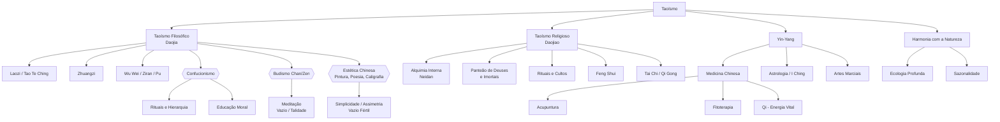

# Taoísmo

## 1. Introdução

O Taoísmo é uma das tradições filosóficas e religiosas mais antigas e influentes da China. Seu nome deriva do termo chinês **Tao** (道), que significa "caminho", "via" ou "princípio". Mais do que uma doutrina fechada, o Taoísmo é uma atitude diante da vida, uma maneira de perceber a realidade que valoriza a espontaneidade, a simplicidade e a harmonia com a natureza.

### 1.1 Laozi (老子) e o Tao Te Ching

A figura fundadora do Taoísmo é **Laozi** (Lao Tzu, "Velho Mestre"), sobre quem pouco se sabe historicamente. Segundo a tradição, teria sido um arquivista da corte de Zhou que, ao perceber a corrupção e o declínio da dinastia, decidiu partir para o oeste. Antes de desaparecer, teria deixado ao guardião da fronteira um texto de cerca de cinco mil caracteres: o **Tao Te Ching** (道德經), o "Clássico do Caminho e da Virtude".

O Tao Te Ching é um livro enigmático e profundamente poético. Com 81 capítulos curtos, ele expõe os fundamentos do pensamento taoísta: o Tao como fonte inominável de tudo, a virtude (De) como manifestação do Tao, e o Wu Wei como modo de ação do sábio. Cada capítulo pode ser lido como um koan, uma provocação à mente linear.

### 1.2 Zhuangzi (庄子)

O segundo grande texto taoísta é o **Zhuangzi** (Chuang Tzu), atribuído a Mestre Zhuang, filósofo do século IV a.C. Zhuangzi é um dos escritores mais brilhantes de toda a literatura chinesa — irônico, poético, cômico e profundamente questionador. Seus textos são cheios de parábolas, diálogos absurdos e personagens excêntricas. Enquanto o Tao Te Ching é conciso e oracular, o Zhuangzi é expansivo e narrativo.

### 1.3 Diferença entre Taoísmo Filosófico (Daojia) e Religioso (Daojiao)

É essencial distinguir duas grandes vertentes do Taoísmo:

- **Daojia** (道家): "Escola do Caminho" — o Taoísmo filosófico. Refere-se aos pensamentos de Laozi, Zhuangzi e outros, vistos como textos especulativos e práticos sobre como viver em harmonia com o Tao. Enfatiza o indivíduo, a liberdade, a simplicidade e a crítica às instituições.

- **Daojiao** (道教): "Ensino do Caminho" — o Taoísmo religioso. Desenvolveu-se a partir do século II d.C. com a Escola dos Mestres Celestiais (Tianshi Dao), incorporando rituais, deuses panteão, alquimia, exorcismo, meditação e busca pela imortalidade. Enquanto o Daojia é mais intelectual, o Daojiao é comunitário e litúrgico.

Na prática, as fronteiras são porosas. Muitos chineses praticam elementos de ambos simultaneamente, sem distinção rígida. O Taoísmo religioso incorpora os textos filosóficos e reinterpreta seus símbolos em termos de culto e prática mística.

### 1.4 Contexto Histórico

O Taoísmo surge no período dos Reinos Combatentes (séc. V–III a.C.), época de grande efervescência intelectual na China. Confúcio, Mozi, os legalistas, os yin-yang cosmologistas — todos propunham soluções para a crise social. O Taoísmo se destaca por oferecer uma resposta radicalmente diferente: não aprimorar o governo, mas questionar a própria necessidade de governar; não aperfeiçoar o ser humano, mas retornar à simplicidade original.

## 2. O Tao (道)

### 2.1 O Tao que pode ser dito não é o Tao eterno

O primeiro capítulo do Tao Te Ching começa com uma declaração que já é um paradoxo:

> "O Tao que pode ser dito não é o Tao eterno.
> O nome que pode ser nomeado não é o nome eterno."

Isso não é misticismo vago. É uma constatação epistemológica: a realidade última (Tao) não pode ser apreendida por conceitos porque os conceitos são recortes, limitações. O Tao é anterior a toda distinção — anterior ao ser e ao não-ser, ao um e ao múltiplo. Qualquer afirmação sobre o Tao já o trai, porque o reduz a algo que pode ser compreendido pela mente.

O Tao é inefável, mas não é um "mistério" no sentido ocidental de algo oculto que exige revelação. É inefável como a água é molhada: não precisamos definir "molhado" para saber o que é.

### 2.2 Tao como princípio, caminho, fluxo, origem

O caráter chinês 道 (dào) tem diversos significados interligados: "caminho", "estrada", "falar", "princípio", "doutrina", "método". Mas no Taoísmo, ele adquire um sentido metafísico: é a fonte de tudo que existe, o processo mesmo do universo se desdobrar.

Laozi descreve o Tao no Capítulo 25:

> "Havia algo caótico mas completo,
> Que nasceu antes do Céu e da Terra.
> Silencioso e vasto,
> Sozinho e imutável,
> Move-se em círculo e nunca se desgasta.
> Pode ser a Mãe de tudo sob o Céu.
> Não sei seu nome; dou-lhe o nome de Tao."

O Tao não é um ser supremo no sentido teísta. Não cria o mundo por um ato de vontade. O Tao **é** o mundo em seu processo de autogeração. É como a gravidade: não é uma coisa, mas o princípio pelo qual as coisas se comportam.

### 2.3 Tao vs De (virtude/poder)

**De** (德) é frequentemente traduzido como "virtude", mas no sentido de "poder inerente" ou "eficácia". Se o Tao é a fonte, o De é a manifestação do Tao em cada coisa. O De de uma árvore é ser árvore; o De de um rio é fluir; o De do sábio é agir sem esforço.

O Tao Te Ching (que poderia ser traduzido como "Clássico do Caminho e do Poder Interior") ensina que o De autêntico não é adquirido por esforço moral. Ele flui naturalmente quando estamos alinhados com o Tao. Por isso, Laozi diz: "De superior não é consciente de seu De; por isso tem De."

### 2.4 Wu Wei (无为) — Ação sem esforço

**Wu Wei** (無為) é talvez o conceito taoísta mais célebre (e mais mal compreendido). Literalmente "não-ação" ou "não-forçar", Wu Wei não significa inação ou passividade. Significa agir sem esforço, sem forçar, sem resistência — como a água que flui ao redor da pedra, encontrando naturalmente o caminho mais baixo.

> "Pratique o não-fazer, e tudo se fará." (Tao Te Ching, Cap. 48)

Wu Wei se manifesta na experiência de "flow" (fluxo): quando estamos tão imersos em uma atividade que ela parece acontecer sozinha. O artesão habilidoso não "tenta" fazer o objeto; ele simplesmente faz, com a precisão de quem não hesita. Não hesitar é Wu Wei — confiar no saber do corpo e no curso natural das coisas.

Importante: Wu Wei não é passividade moral ou quietismo. É **não forçar** o que não precisa ser forçado. É saber quando agir e quando deixar agir. É a arte de se alinhar com a correnteza em vez de remar contra ela.

### 2.5 Pu (朴) — O bloco não esculpido, simplicidade

**Pu** (朴) significa "madeira não trabalhada" ou "bloco bruto". Simboliza a simplicidade original, a natureza não adulterada, anterior à cultura e à educação.

> "Mostre o bloco simples, abrace a rudeza original,
> Reduza o interesse próprio, diminua os desejos." (Tao Te Ching, Cap. 19)

Pu é um ideal estético e ético. Esteticamente, a arte chinesa valoriza o inacabado, o irregular, o aparentemente tosco — porque isso revela o Pu. Eticamente, Pu é o chamado a retornar à simplicidade, a desaprender as camadas de condicionamento social que nos afastam de nossa natureza espontânea.

### 2.6 Ziran (自然) — Naturalidade, espontaneidade

**Ziran** (自然) significa literalmente "por si mesmo" ou "assim mesmo". É a qualidade de ser natural, espontâneo, sem artificialidade. O Tao age por Ziran: as estrelas giram, a grama cresce, a água flui — tudo isso é Ziran.

O sábio imita Ziran: não age por coerção externa, mas de dentro, como resposta espontânea à situação. Para o taoísta, o ser humano ideal não é o "herói" que se impõe sobre o mundo, mas a pessoa tão natural quanto uma árvore.

## 3. Yin e Yang (阴阳)

### 3.1 A interdependência dos opostos

**Yin** (阴) e **Yang** (阳) são princípios cosmológicos que descrevem como a realidade se manifesta em padrões de polaridade dinâmica:

| Yin | Yang |
|-----|------|
| Escuro | Claro |
| Frio | Quente |
| Feminino | Masculino |
| Receptivo | Ativo |
| Acolhedor | Expansivo |
| Lua | Sol |
| Terra | Céu |
| Água | Fogo |
| Inverno | Verão |

Yin e Yang não são substâncias ou coisas, mas **qualidades relacionais**. Algo é yin apenas em relação a algo yang, e vice-versa. Uma montanha pode ser yang em relação ao vale (yin), mas yin em relação ao sol (yang).

### 3.2 Não é dualismo — é complementaridade

É crucial entender que yin-yang **não é dualismo**. No dualismo (bem vs mal, espírito vs matéria), os opostos são excludentes e frequentemente hierárquicos. No yin-yang, os opostos são interdependentes e mutuamente geradores:

> "Um engendra yin e yang.
> Yin e yang engendram todas as coisas." (Tao Te Ching, Cap. 42)

Não há luz sem sombra, não há ação sem repouso, não há vida sem morte. A realidade é um jogo contínuo de alternância de polaridades. Tudo carrega em si a semente do oposto — o yin se transforma em yang, o yang se transforma em yin.

### 3.3 O Tai Chi Tu (símbolo do yin-yang)

O **Taijitu** (太極圖), o famoso círculo preto-e-branco com a curva em S, é a representação visual dessa interdependência:

- O círculo representa o Tao, o todo indiferenciado.
- As duas gotas, uma preta (yin) e uma branca (yang), mostram que cada polo contém a semente do outro (o ponto de cor oposta).
- A curva em S não é estática: sugere movimento, rotação, transformação contínua.
- A simetria é dinâmica, não estática — como um vórtice.

O Taijitu não é um símbolo de equilíbrio estático, mas de **harmonia dinâmica**. Não se trata de 50% yin e 50% yang, mas do processo incessante de adaptação e mudança.

### 3.4 Aplicação em todos os domínios

O paradigma yin-yang se aplica virtualmente a qualquer área:

- **Medicina chinesa**: saúde é o equilíbrio yin-yang no corpo; doença é desarmonia. Acupuntura, ervas e dietas buscam restaurar essa harmonia.
- **Estratégia**: no clássico A Arte da Guerra de Sun Tzu, a vitória vem de alternar dureza e suavidade, ataque e espera.
- **Psicologia**: a psique tem aspectos yin (sombra, receptividade, emoção) e yang (consciência, ação, razão). Integrá-los é saúde.
- **Política**: governar com muita rigidez (yang) provoca reações; um pouco de flexibilidade (yin) estabiliza.
- **Arte**: a caligrafia e a pintura chinesas jogam com cheio e vazio, pincelada e silêncio.

## 4. Zhuangzi e o Relativismo

### 4.1 O sonho da borboleta

Talvez a passagem mais famosa de Zhuangzi:

> "Certa vez, Zhuangzi sonhou que era uma borboleta, esvoaçando alegremente — não sabia que era Zhuangzi. De repente acordou e lá estava Zhuangzi, sólido e real. Mas ele não sabia mais: era Zhuangzi que sonhara ser borboleta, ou era borboleta que agora sonhava ser Zhuangzi?"

Essa parábola não é um mero exercício de ceticismo. É uma desestabilização deliberada da certeza — especialmente da certeza sobre a identidade fixa. Zhuangzi sugere que o "eu" não é uma substância rígida, mas um fluxo de transformações. Quem você pensa que "é" hoje pode ser apenas um sonho do que você será amanhã.

### 4.2 A utilidade do inútil

Zhuangzi é um mestre em inverter o senso comum. Em uma passagem, ele conta sobre um grande árvore que, por ser torta e nodosa (portanto "inútil" para os marceneiros), foi poupada do corte e cresceu enorme. Sua "inutilidade" foi precisamente o que a tornou útil.

A lição: nossa obsessão por utilidade, eficiência e produtividade nos cega para o valor intrínseco das coisas. Nem tudo precisa ser "útil" para ter valor. A preguiça, o ócio, o devaneio — coisas "inúteis" para a sociedade produtivista — são talvez o que nos mantêm humanos.

Zhuangzi leva isso ao extremo: a não ser que você queira ser usado (como uma árvore reta vira tábua), é melhor ser "inútil". Sobreviva por não servir.

### 4.3 A árvore torta

Complementando o tema: certa vez um artesão passou por uma árvore imensa. Seus assistentes pararam para admirar, mas o artesão nem olhou. Mais tarde, perguntaram por quê. Ele respondeu: "Aquela árvore não serve para nada — não é reta, a madeira é porosa, não dá para fazer nada com ela". À noite, a árvore apareceu em sonho e disse: "Você compara a mim, que sou útil a mim mesmo, com aquelas árvores que são úteis para os outros? Todas as árvores de fruto são apedrejadas; as árvores retas são cortadas. Eu aprendi a ser inútil, e isso me salvou."

Essa parábola é um ataque direto ao paradigma confucionista do "homem útil" — o funcionário culto que serve ao Estado. Zhuangzi oferece uma visão alternativa de sucesso: não ser útil ao sistema, mas ser livre.

### 4.4 A felicidade dos peixes (empatia e perspectiva)

Zhuangzi passeava com seu amigo Huizi (lógico e rival intelectual) sobre a ponte do rio Hao. Zhuangzi disse: "Os peixes nadam tão livres e alegres!" Huizi retrucou: "Você não é peixe — como sabe que eles são felizes?" Zhuangzi respondeu: "Você não é eu — como sabe que eu não sei?"

O debate filosófico é rico. Huizi representa a epistemologia cética: só conhecemos o que é diretamente acessível. Zhuangzi representa uma posição diferente: podemos conhecer por **empatia**, por **participação**. Não preciso ser peixe para saber que o peixe está feliz. Basta prestar atenção ao mundo com o coração aberto.

A resposta final de Zhuangzi: "Você perguntou 'como sei que os peixes são felizes?' — já sabia que eu sabia quando fez a pergunta. Foi aqui na ponte sobre o rio Hao que eu soube."

### 4.5 A morte como transformação

Zhuangzi trata da morte com uma serenidade que choca o pensamento ocidental. Quando sua esposa morreu, seu amigo Huizi foi visitá-lo para prestar condolências e encontrou Zhuangzi cantando e batendo ritmos no chão.

Huizi ficou chocado: "Você viveu com ela tantos anos, ela criou seus filhos, envelheceu ao seu lado — e você canta?" Zhuangzi respondeu:

> "Ela morreu e eu fiquei triste, claro. Mas refleti: no princípio ela não tinha vida, nem corpo, nem espírito. Misturada no caos primordial, algo mudou e ela ganhou vida. Agora algo mudou novamente e ela morreu. É como a alternância das estações. Ela está dormindo na Grande Câmara. Chorar seria negar o fluxo natural."

A morte não é aniquilação, mas transformação. Assim como o inverno se transforma em primavera, a vida se transforma em morte — e talvez em outra vida, outra forma. O Universo é um contínuo de transmutações; apegar-se a uma forma específica é sofrer.

## 5. Taoísmo e Política

### 5.1 Governo pelo não-governo

Wu Wei encontra sua expressão política na ideia de que o melhor governo é o que menos governa. Laozi diz:

> "Governar uma grande nação é como cozinhar um peixe pequeno — não mexa demais." (Tao Te Ching, Cap. 60)

Quanto mais leis, decretos, regulamentos e intervenções, mais o povo se torna confuso e resistente. O sábio governante simplifica, reduz, confia. Ele não impõe sua vontade; ele remove os obstáculos para que a ordem natural da sociedade se manifeste.

Isso contrasta fortemente com o Confucionismo (que enfatiza rituais, hierarquia e educação moral) e com o Legalismo (leis draconianas e punições). Para o taoísta, a melhor ordem é a que surge de baixo para cima, espontaneamente.

### 5.2 Crítica ao Confucionismo e à burocracia

O Taoísmo nasce em parte como reação ao confucionismo. Onde Confúcio via necessidade de reforma moral e ritual, Laozi via o problema exatamente nas reformas e nos rituais:

> "Abandone a sabedoria, descarte o conhecimento,
> E o povo se beneficiará cem vezes." (Tao Te Ching, Cap. 19)

> "Quando o grande Tao declina,
> Surgem a 'bondade' e a 'retidão'." (Cap. 18)

Para Laozi, quando uma sociedade precisa falar de "virtude", "justiça" e "piedade filial", é porque já perdeu o Tao. A virtude genuína não precisa de nome. Os valores confucionistas são um paliativo, não a cura.

Zhuangzi é ainda mais mordaz. Ele satiriza os confucionistas como "especialistas em cerimônias que não entendem a vida". Em suas parábolas, os sábios confucionistas são geralmente figuras ridículas, preocupadas com regras que perdem de vista a realidade concreta.

### 5.3 O sábio governante

O governante ideal taoísta é descrito não como herói, mas como figura quase invisível:

> "O melhor governante é aquele de quem o povo mal sabe que existe.
> O próximo é aquele que é amado e elogiado.
> O pior é aquele que é temido." (Tao Te Ching, Cap. 17)

Ele governa pelo exemplo silencioso. Sua ação é tão sutil que ninguém percebe. O povo pensa que as coisas acontecem por si mesmas — "nós mesmos fizemos" (Ziran). O sábio não cria dependência; ele capacita.

## 6. Taoísmo Religioso e Práticas

### 6.1 Alquimia Interna (Neidan) e Externa (Weidan)

A alquimia taoísta tem duas vertentes principais:

- **Weidan** (外丹) — Alquimia Externa: práticas que envolvem manipulação de substâncias físicas (mercúrio, chumbo, enxofre, cinábrio) para produzir o elixir da imortalidade. Historicamente, muitos imperadores chineses morreram envenenados por esses elixires. A Weidan acabou perdendo prestígio, mas sua linguagem simbólica foi herdada pela alquimia interna.

- **Neidan** (內丹) — Alquimia Interna: prática de transmutação espiritual usando o próprio corpo como fornalha. Utiliza técnicas de meditação, visualização, respiração e movimento para refinar o qi (energia vital) e gerar o "embrião imortal" dentro do praticante. O processo é descrito em termos alquímicos: chumbo (jing/essência), mercúrio (shen/espírito), fornalha (dantian inferior), fogo (calor interno).

A Neidan é fundamentalmente um caminho de autotransformação, onde o praticante busca retornar ao estado primordial (Xiantian), anterior à separação yin-yang.

### 6.2 Tai Chi Chuan e Qi Gong

**Tai Chi Chuan** (太极拳) e **Qi Gong** (气功) são práticas corporais derivadas do Taoísmo:

- **Tai Chi Chuan**: arte marcial suave que incorpora princípios de Wu Wei e yin-yang. Movimentos fluidos e circulares, peso transferido de uma perna à outra (yin-yang), relaxamento ativo. Praticado tanto para saúde quanto para meditação em movimento.

- **Qi Gong**: conjunto de exercícios que trabalham a respiração, postura e movimento para cultivar e equilibrar o qi. Inclui práticas estáticas (posturas) e dinâmicas (como os "Cinco Animais" ou "Oito Brocados de Seda").

Ambos são exemplos de como a filosofia taoísta se encarna no corpo.

### 6.3 I Ching (O Livro das Mutações)

O **I Ching** (易經) — "Clássico das Mutações" — é um dos textos mais antigos da China, originalmente um oráculo que foi adotado e transformado pelo Taoísmo e Confucionismo. Baseia-se em 64 hexagramas, combinações de seis linhas yin (quebradas) e yang (contínuas), que representam todas as situações possíveis da existência.

O princípio central do I Ching é a **mutabilidade**: tudo muda, e a sabedoria está em perceber o padrão da mudança para agir em harmonia com ele. Não se trata de "prever o futuro", mas de compreender o momento presente à luz da alternância entre yin e yang.

### 6.4 Deuses, Imortais e Rituais

O Taoísmo religioso possui um vasto panteão:

- **Os Três Puros (Sanqing)**: as divindades supremas do Taoísmo religioso — Yuanshi Tianzun (Venerável Celestial do Início Primordial), Lingbao Tianzun (Venerável Celestial do Tesouro Divino) e Daode Tianzun (Venerável Celestial do Caminho e da Virtude, associado a Laozi).

- **Os Oito Imortais (Baxian)**: figuras lendárias que alcançaram a imortalidade através de práticas taoístas. Cada um carrega um símbolo — a espada de Lu Dongbin, a flauta de Han Xiangzi, a abóbora de Li Tieguai, etc. São populares na arte e no folclore.

- **Deuses locais**: o Deus da Cozinha (Zaojun), o Deus da Riqueza (Caishen), o Deus da Longevidade (Shouxing), entre centenas de divindades veneradas em templos domésticos e comunitários.

Os rituais incluem oferendas, queima de incenso e papel-moeda espiritual, procissões, e cerimônias conduzidas por sacerdotes (daoshi) que podem invocar divindades, exorcizar espíritos e conduzir almas.

### 6.5 Feng Shui

**Feng Shui** (风水) — literalmente "vento e água" — é a arte taoísta de harmonizar espaços com o fluxo de qi. Considera a orientação, a disposição dos móveis, a topografia e os elementos para criar ambientes que favoreçam saúde, prosperidade e bem-estar. Embora hoje muitas vezes reduzido a superstição, o Feng Shui clássico é uma disciplina sofisticada de ecologia e design.

## 7. Taoísmo e Natureza

### 7.1 Harmonia com a natureza (vs dominação)

Enquanto grande parte da tradição ocidental (especialmente a partir de Descartes e Bacon) coloca o ser humano como "senhor e possuidor da natureza", o Taoísmo propõe o oposto: o ser humano só realiza seu potencial quando vive **em harmonia** com a natureza, não acima ou contra ela.

Isso não é um "retorno à natureza" primitivista. O Taoísmo reconhece a cultura, a arte e a técnica — mas quer que elas estejam enraizadas no natural. O jardim chinês, por exemplo, não é uma geometria imposta (como o jardim francês), mas uma composição que imita a assimetria orgânica da paisagem natural.

### 7.2 Ecologia profunda e Taoísmo

A filosofia taoísta tem afinidades profundas com a **ecologia profunda** (deep ecology), movimento que questiona o antropocentrismo e valoriza o valor intrínseco de todos os seres. Conceitos como:

- **Ziran**: a natureza segue seu próprio curso.
- **Wu Wei**: não forçar, não dominar.
- **Pu**: simplicidade, redução de consumo.
- **Interconexão universal**: tudo está ligado; o que afeta um afeta todos.

Esses princípios oferecem uma base ética poderosa para uma relação sustentável com o planeta. Para o taoísta, a crise ecológica não é acidental — é a consequência inevitável de uma cultura que se separou do Tao.

### 7.3 O fluxo natural das estações

O pensamento chinês é profundamente sazonal. As estações não são apenas meteorologia — são padrões de energia (qi) que afetam tudo: saúde, emoções, agricultura, política. Viver bem é viver em sintonia com o ritmo sazonal:

- **Primavera**: nascimento, movimento ascendente (madeira, fígado).
- **Verão**: expansão, calor (fogo, coração).
- **Outono**: recolhimento, colheita (metal, pulmão).
- **Inverno**: repouso, armazenamento (água, rins).

Ignorar esse ritmo — por exemplo, exigir produtividade constante o ano todo — é criar desarmonia e doença.

## 8. Exercícios Práticos

### 8.1 Identifique Wu Wei na sua vida — quando as coisas fluem?

Pense em atividades em que você perde a noção do tempo, em que as coisas "acontecem" sem esforço. Pode ser escrever, cozinhar, tocar um instrumento, conversar com um amigo. Anote:

- O que havia de diferente nessas situações?
- Você estava tentando controlar o resultado ou apenas respondendo ao momento?
- Como seria aplicar essa qualidade a áreas da vida onde você luta e força?

### 8.2 Pratique não-ação deliberada (deixar ser)

Escolha uma situação em que você normalmente interviria ou controlaria. Pode ser:
- Um familiar que age de forma diferente do que você gostaria.
- Um projeto que não sai como planejado.
- Uma discussão onde você quer ter a última palavra.

Em vez de agir, **observe**. Respire. Deixe que as coisas sigam seu curso natural. Anote o que acontece. Você pode descobrir que, sem sua intervenção, as coisas se resolvem sozinhas.

### 8.3 Diário de yin-yang: opostos que coexistem

Durante uma semana, anote pares de opostos que aparecem no seu dia:

| Situação | Yin | Yang |
|----------|-----|------|
| Trabalho | Planejamento (receptivo) | Execução (ativo) |
| Clima | Chuva (yin) | Sol (yang) |
| Social | Ouvir | Falar |
| Emoção | Tristeza | Alegria |

Perceba que **cada um só existe em relação ao outro**. E note também o ponto em que yin se transforma em yang — o momento em que o cansaço vira sono ou a tensão vira relaxamento.

### 8.4 Meditação taoísta: observar sem agir

Sente-se confortavelmente. Feche os olhos. Traga a atenção para a respiração, mas **não controle** a respiração — apenas observe. Se pensamentos surgirem, não os combata nem os siga. Apenas observe-os como nuvens passando no céu.

Essa meditação é a aplicação direta de Wu Wei à mente: não forçar nada, não agarrar nada, não rejeitar nada. Apenas **estar**. Comece com 5 minutos; aumente gradualmente.

### 8.5 O paradoxo da utilidade do inútil (aplicado a um problema)

Pense em um problema que você está tentando resolver ativamente. Agora... pare de tentar resolvê-lo por um momento. Pergunte-se:

- O que aconteceria se eu **nada fizesse** em relação a isso?
- Esse problema precisa ser resolvido agora? Ou estou criando urgência?
- Minhas tentativas atuais estão forçando a situação?
- Será que "não fazer" é a resposta mais inteligente?

Considere que, como a árvore torta de Zhuangzi, sua "inutilidade" em resolver o problema pode ser a melhor solução. Talvez o problema se dissolva sozinho, ou você ganhe perspectiva para agir no momento certo.

### 8.6 Leitura contemplativa do Tao Te Ching

Escolha um capítulo do Tao Te Ching (sugiro Cap. 1, 8, 11, 16, 48, 56 ou 64). Leia lentamente, em voz alta se possível. Depois, sente-se em silêncio por alguns minutos. Pergunte-se:

- O que essa passagem significa **para mim, hoje**?
- A que ela me convida?
- O que eu preciso largar?

Não tente "entender" intelectualmente. Deixe o texto trabalhar em você como uma semente.

## 9. Cross-mapping Mermaid

### 9.1 Confucionismo x Taoísmo

| Aspecto | Confucionismo | Taoísmo |
|---------|--------------|---------|
| Foco | Sociedade, família, Estado | Natureza, indivíduo, cosmos |
| Virtude | Ren (humanidade), Li (rito) | De (poder natural), Pu (simplicidade) |
| Ação | Cultivo moral, estudo | Wu Wei (não-forçar) |
| Governo | Intervenção virtuosa | Laissez-faire, não-interferência |
| Sabedoria | Conhecimento dos clássicos | Desaprender, retornar ao natural |
| Tempo | Passado (modelo dos antigos sábios) | Presente (fluxo) |

### 9.2 Budismo Chan/Zen e Taoísmo

O Budismo Chan (Zen no Japão) foi profundamente influenciado pelo Taoísmo ao chegar na China. Características compartilhadas:

- Desconfiança das palavras e conceitos (o "não depender de palavras e letras" do Chan).
- Ênfase na experiência direta, não mediada por textos.
- Uso de paradoxos (koans) que lembram as provocações de Zhuangzi.
- Valorização da simplicidade e do cotidiano (como o Taoísmo encontra o sagrado no ordinário).

Diferenças: o Chan/Budismo mantém a estrutura doutrinal budista (karma, reencarnação, nirvana), que o Taoísmo clássico não compartilha.

### 9.3 Ecologia e Taoísmo

A ecologia contemporânea encontra ressonâncias profundas com o pensamento taoísta:

- **Holismo**: o ecossistema é uma rede de interdependências, como o Tao permeia todas as coisas.
- **Equilíbrio dinâmico**: ecossistemas saudáveis não são estáticos, mas cíclicos — como yin-yang.
- **Não-dominação**: o princípio ecológico de "não extrair mais que o sustentável" ecoa Wu Wei.
- **Diversidade**: a biodiversidade é análoga à multiplicidade espontânea de Ziran.

### 9.4 Filosofia

O Taoísmo dialoga com várias correntes filosóficas:

- **Helenismo**: Heráclito (fluxo, unidade dos opostos) e o ceticismo pirrônico (epoché, suspensão do juízo).
- **Existencialismo**: Heidegger (ser-no-mundo, linguagem como "casa do ser"), ascese existencial.
- **Pós-modernismo**: desconstrução (Derrida), crítica às metanarrativas, relativismo.
- **Filosofia processual**: Whitehead, Bergson — a realidade como processo, não substância.
- **Anarquismo filosófico**: crítica ao poder estatal, ênfase na autorganização.

### 9.5 Medicina Chinesa

A Medicina Tradicional Chinesa (MTC) é uma aplicação direta da cosmologia taoísta:

- **Qi** (气): energia vital que circula pelos meridianos do corpo.
- **Yin-Yang**: equilíbrio de forças opostas; doença é desarmonia.
- **Cinco Elementos**: madeira, fogo, terra, metal, água — ciclos de geração e controle.
- **Diagnóstico**: observação da língua, pulso, paladar, odor — leitura do padrão energético.
- **Tratamento**: acupuntura, fitoterapia, dietoterapia, exercícios (Tai Chi, Qi Gong).

### 9.6 Estética

A arte de influência taoísta se caracteriza por:

- **Vazio fértil**: o espaço vazio na pintura (a névoa, o silêncio) não é ausência, mas potência.
- **Assimetria**: a beleza está no irregular, no orgânico — como a madeira torta de Zhuangzi.
- **Sugestão**: o que não é mostrado é tão importante quanto o que é mostrado.
- **Impermanência**: a beleza do transitório (como na poesia dos Tang sobre as flores que caem).
- **Imitação da natureza**: não cópia literal, mas captura do "espírito" (shen) da paisagem.

## 10. Referências

### Fontes primárias

- **Laozi (老子)**. *Tao Te Ching* (道德經). Traduções recomendadas:
  - Lau, D. C. (Penguin, 1963) — precisa, filologicamente rigorosa.
  - Chan, Wing-Tsit (em *A Source Book in Chinese Philosophy*, Princeton, 1963) — erudita e contextual.
  - Carus, Paul (Dover, 1913) — histórica, edição bilíngue.
  - Wu, John C. H. (St. John's University Press, 1961) — poética e sensível.
- **Zhuangzi (庄子)**. *O Livro de Zhuangzi* (莊子). Traduções recomendadas:
  - Watson, Burton (Columbia University Press, 1968) — acessível e fiel.
  - Graham, A. C. (George Allen & Unwin, 1981) — acadêmica, com notas extensas.
  - Mair, Victor (Bantam, 1994) — abrangente, com introduções esclarecedoras.

### Fontes secundárias

- **Robinet, Isabelle**. *Taoism: Growth of a Religion* (Stanford, 1997). Estudo abrangente do Taoísmo religioso.
- **Watts, Alan**. *Tao: The Watercourse Way* (Pantheon, 1975). Introdução clara e acessível, embora focada no aspecto filosófico.
- **Chan, Wing-Tsit**. *A Source Book in Chinese Philosophy* (Princeton, 1963). Coletânea indispensável de fontes com comentários.
- **Lau, D. C.** *Lao Tzu: Tao Te Ching* (Penguin, 1963). Tradução e notas referenciais.
- **Schipper, Kristofer**. *The Taoist Body* (University of California Press, 1993). Antropologia do Taoísmo religioso contemporâneo.
- **Kohn, Livia**. *Introducing Daoism* (Routledge, 2008). Panorama geral conciso e didático.
- **Maspero, Henri**. *Taoism and Chinese Religion* (University of Massachusetts Press, 1981). Clássico da sinologia francesa.
- **Slingerland, Edward**. *Effortless Action: Wu-wei as Conceptual Metaphor and Spiritual Ideal in Early China* (Oxford, 2003). Estudo detalhado do conceito de Wu Wei.
- **Moeller, Hans-Georg**. *Daoism Explained* (Open Court, 2004). Introdução contemporânea, criativa e provocativa.
- **Jullien, François**. *A Treatise on Efficacy: Between Western and Chinese Thinking* (University of Hawaii Press, 2004). Sobre a eficácia do Wu Wei na estratégia.

### Estudos comparativos e interdisciplinares

- **Capra, Fritjof**. *The Tao of Physics* (1975). Física quântica e Taoísmo — pioneiro, embora datado em alguns aspectos.
- **Jung, Carl G.** Prefácio ao *I Ching* (ed. Wilhelm). Conexões entre sincronicidade e o oráculo chinês.
- **Merton, Thomas**. *The Way of Chuang Tzu* (New Directions, 1965). Tradução poética com comentários do monge trapista.
- **Girardot, Norman J.** *Myth and Meaning in Early Taoism* (University of California Press, 1983). Análise do tema do caos (hundun) no Zhuangzi.
- **Granet, Marcel**. *O Pensamento Chinês* (1934). Estudo clássico sobre categorias de pensamento.

### Recursos online

- **Stanford Encyclopedia of Philosophy**: verbetes sobre Laozi e Zhuangzi (plato.stanford.edu).
- **Internet Encyclopedia of Philosophy**: verbete sobre Taoísmo (iep.utm.edu).
- **Taoism.net**: portal com textos originais, traduções e artigos.
- **Chinese Text Project** (ctext.org): textos completos em chinês clássico e traduções.

---

> *"O Tao é como água — não luta, mas vence o que é duro."*

---

**Nota pessoal**: O Taoísmo não é um sistema para ser "acreditado". É um convite a prestar atenção. O texto acima é um mapa, não o território. Leia, experimente, questione — e depois largue o livro e vá sentir o vento no rosto. O resto é conversa fiada.
