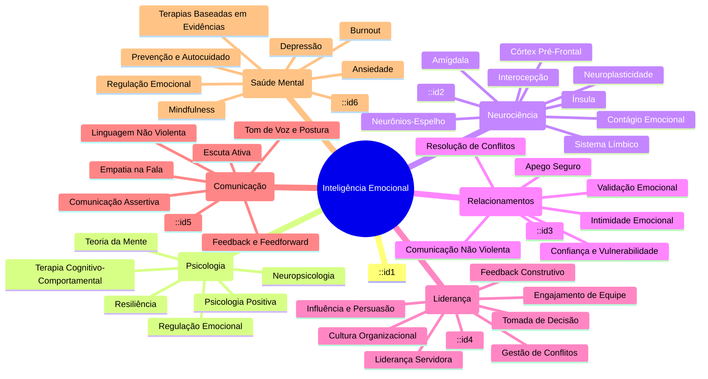

# Inteligência Emocional

## 1. Introdução

### O que é inteligência emocional?

Inteligência emocional (IE) é a capacidade de perceber, compreender, utilizar e gerenciar emoções em si mesmo e nos outros. Diferente do QI — que mede raciocínio lógico, capacidade matemática e habilidades verbais — a IE diz respeito a como lidamos com emoções no dia a dia, como tomamos decisões sob pressão, como nos relacionamos com as pessoas e como navegamos por situações socialmente complexas.

Daniel Goleman popularizou o conceito na década de 1990 com seu livro "Inteligência Emocional", argumentando que, para a maioria das pessoas, a IE é um preditor mais forte de sucesso profissional e pessoal do que o QI. Enquanto o QI ajuda a passar em provas e a resolver problemas técnicos, a IE determina como usamos esse conhecimento em contextos reais: como nos apresentamos em uma entrevista, como lideramos uma equipe, como lidamos com críticas e como mantemos relacionamentos saudáveis.

### Por que IE é mais preditiva de sucesso que QI?

Estudos longitudinais mostram que pessoas com IE elevada tendem a:

1. **Ter carreiras mais bem-sucedidas**: a capacidade de colaborar, influenciar e liderar supera o conhecimento técnico isolado em ambientes organizacionais.
2. **Relacionamentos mais saudáveis**: a empatia e a regulação emocional reduzem conflitos e aumentam a intimidade.
3. **Melhor saúde mental**: a autorregulação protege contra ansiedade, depressão e burnout.
4. **Maior resiliência**: pessoas com IE alta se recuperam mais rápido de adversidades.

Goleman argumenta que, em posições de liderança, a IE responde por 85-90% da diferença entre líderes excepcionais e medianos. O QI é um limiar necessário, mas não suficiente; a partir de um nível mínimo, é a IE que diferencia.

---

## 2. Modelo de Goleman (5 Pilares)

O modelo de Daniel Goleman divide a inteligência emocional em cinco grandes domínios, organizados em duas competências gerais: competência pessoal (como lidamos conosco) e competência social (como lidamos com os outros).

### 2.1 Autoconhecimento Emocional

Autoconhecimento emocional é a capacidade de reconhecer e nomear as próprias emoções à medida que elas ocorrem. É a base de todos os outros pilares — sem saber o que sentimos, não podemos regular, motivar ou nos conectar com os outros.

**Componentes:**

- **Identificação emocional**: saber com precisão o que estamos sentindo em cada momento. Não é apenas sentir raiva, mas distinguir raiva de frustração, indignação ou irritação.
- **Compreensão de gatilhos**: reconhecer quais situações, pessoas ou pensamentos disparam determinadas emoções. Ex.: "Sempre que meu chefe me interrompe, sinto desrespeito e ativo raiva."
- **Reconhecimento de padrões**: identificar ciclos emocionais recorrentes. Ex.: "Percebo que fico mais ansioso em domingo à noite, antecipando a semana de trabalho."
- **Consciência corporal**: emoções se manifestam no corpo. Aprender a ler sinais físicos — aperto no peito, nó no estômago, tensão nos ombros — é parte do autoconhecimento.

**Importância:** sem autoconhecimento, os outros pilares são cegos. Não é possível regular o que não se percebe, nem ter empatia genuína sem entender as próprias emoções primeiro.

### 2.2 Autorregulação

Autorregulação é a capacidade de gerenciar as próprias emoções, especialmente as desagradáveis, de forma adaptativa. Não se trata de suprimir ou ignorar emoções, mas de expressá-las de maneira construtiva.

**Componentes:**

- **Controle de impulsos**: pausar antes de agir. Resistir à vontade de explodir, atacar ou tomar decisões precipitadas quando emocionalmente ativado.
- **Adaptabilidade**: flexibilidade para mudar de estratégia quando as circunstâncias mudam, sem se prender a planos rígidos.
- **Gerenciamento de estresse**: técnicas para reduzir a ativação fisiológica (respiração, relaxamento) e mental (reavaliação) em situações de pressão.
- **Expressão emocional adequada**: comunicar emoções de forma assertiva e culturalmente apropriada, sem agressividade nem passividade.

**Exemplo prático:** Um líder que recebe uma crítica dura de seu superior pode sentir raiva e vontade de revidar. Com autorregulação, ele pausa, respira, reconhece a raiva e escolhe responder com curiosidade: "Obrigado pelo feedback. Pode me dar um exemplo concreto para que eu entenda melhor?"

### 2.3 Motivação

Motivação, no modelo de Goleman, é a tendência a canalizar emoções em direção a objetivos. Pessoas com alta IE são automotivadas — não dependem exclusivamente de recompensas externas (dinheiro, status, reconhecimento) para persistir.

**Componentes:**

- **Automotivação**: encontrar razões internas para agir, como crescimento pessoal, propósito ou prazer na atividade em si.
- **Otimismo**: crença de que esforço levará a resultados positivos. Não é ingenuidade, mas uma expectativa realista de que obstáculos são superáveis.
- **Iniciativa**: agir antes de ser solicitado. Pessoas motivadas não esperam condições perfeitas; começam e ajustam ao longo do caminho.
- **Compromisso com objetivos**: manter o foco mesmo diante de distrações, tentações e frustrações. Disciplina emocional para adiar recompensas imediatas em favor de ganhos de longo prazo.

**Diferença entre motivação extrínseca e intrínseca:** a extrínseca vem de fora (salário, prêmio, elogio); a intrínseca vem de dentro (curiosidade, propósito, realização). A IE fortalece a motivação intrínseca.

### 2.4 Empatia

Empatia é a capacidade de reconhecer e compreender as emoções dos outros. Goleman distingue três tipos de empatia:

1. **Empatia cognitiva**: compreender intelectual e racionalmente o que o outro está sentindo. Saber nomear a emoção alheia.
2. **Empatia emocional**: sentir junto com o outro, compartilhar a experiência emocional. É o contágio emocional controlado.
3. **Preocupação empática**: sentir a motivação para ajudar. Não basta entender e sentir; a empatia plena inclui agir em benefício do outro.

**Importância para relacionamentos:** a empatia é a base da confiança, da intimidade e da cooperação. Sem ela, relacionamentos são superficiais ou conflituosos. Em contextos profissionais, a empatia permite ler o clima organizacional, antecipar necessidades de colegas e clientes, e negociar com eficácia.

**Cuidado:** empatia excessiva (sem regulação) leva à fadiga por compaixão, comum em profissionais de saúde, assistência social e educação. A autorregulação equilibra a empatia.

### 2.5 Habilidades Sociais

Habilidades sociais são um conjunto de competências que permitem interagir eficazmente com os outros. Goleman as descreve como "empatia em ação" — é a capacidade de usar o autoconhecimento, a regulação e a empatia para navegar situações sociais.

**Componentes:**

- **Influência**: persuadir os outros de forma ética, apelando a razões e emoções.
- **Comunicação**: transmitir ideias de forma clara e ouvir ativamente. Inclui comunicação verbal e não verbal.
- **Gestão de conflitos**: abordar divergências de maneira construtiva, buscando soluções que atendam a ambas as partes.
- **Liderança**: inspirar e guiar pessoas ou grupos. A liderança emocionalmente inteligente é servidora, não autoritária.
- **Colaboração**: trabalhar em equipe, compartilhar créditos, pedir e oferecer ajuda.
- **Construção de vínculos**: cultivar relacionamentos genuínos e duradouros, baseados em confiança e reciprocidade.

**Exemplo em liderança:** Um gestor com habilidades sociais elevadas consegue motivar sua equipe mesmo em tempos difíceis, comunicar mudanças de forma que reduza ansiedade e mediar conflitos entre membros da equipe sem tomar partido.

---

## 3. Modelo de Habilidade (Mayer & Salovey)

Enquanto Goleman propõe um modelo misto (que combina traços de personalidade, competências e habilidades), Mayer & Salovey definem inteligência emocional estritamente como uma **habilidade mental** — algo que pode ser medido com testes de desempenho, não com autoavaliação.

O modelo tem quatro ramos, organizados hierarquicamente, do mais básico ao mais complexo:

### 3.1 Percepção Emocional

É a capacidade de identificar emoções em si mesmo, nos outros, em objetos, arte, música e histórias. Envolve:

- Identificar expressões faciais, tom de voz, postura corporal.
- Reconhecer emoções em pinturas, filmes e narrativas.
- Discriminar entre expressões genuínas e falsas.
- Prestar atenção a sinais emocionais sutis.

**Exemplo:** olhar para uma foto e identificar corretamente que a pessoa está com raiva (e não apenas séria ou concentrada).

### 3.2 Facilitação Emocional do Pensamento

As emoções influenciam como pensamos e priorizamos informações. Este ramo descreve como usar emoções para melhorar o raciocínio:

- Mudanças de humor alteram a perspectiva — estar triste pode ajudar na atenção a detalhes; estar feliz ajuda na criatividade.
- Emoções direcionam a atenção para o que é relevante.
- Estados emocionais específicos facilitam diferentes tipos de pensamento (ex.: ansiedade sinaliza que algo precisa de atenção).

**Aplicação:** um designer que usa um estado de ânimo positivo para gerar ideias criativas e depois muda para um estado mais analítico para revisar os detalhes técnicos.

### 3.3 Compreensão Emocional

É a capacidade de entender emoções: como elas surgem, como se combinam e como progridem. Inclui:

- Vocabulário emocional: nomear emoções com precisão.
- Compreender causas: "Ela está triste porque sofreu uma perda."
- Entender transições: como a frustração pode escalar para raiva, ou a surpresa para alegria.
- Reconhecer emoções complexas e mistas: amor-ódio, nostalgia agridoce, esperança ansiosa.
- Saber que emoções podem ser simultâneas e contraditórias.

### 3.4 Regulação Emocional

O ramo mais sofisticado. Envolve gerenciar emoções em si mesmo e nos outros de forma estratégica:

- Monitorar reações emocionais.
- Avaliar a utilidade de uma emoção no contexto.
- Modificar a emoção (intensidade, duração, tipo) quando apropriado.
- Usar estratégias de regulação sem suprimir ou evitar.

**Exemplo:** antes de uma reunião difícil, um profissional percebe sua ansiedade, reconhece que ela pode prejudicar sua comunicação, usa respiração profunda e reavaliação para reduzir a ativação e entra na reunião mais calmo e focado.

---

## 4. Emoções Específicas

### 4.1 Raiva

**Função evolutiva:** A raiva sinaliza que um obstáculo ou injustiça precisa ser enfrentado. Prepara o corpo para ação: aumento de frequência cardíaca, fluxo sanguíneo para as mãos, liberação de adrenalina. Motivacionalmente, impulsiona a remoção de barreiras e a defesa de limites.

**Gatilhos comuns:**
- Percepção de injustiça ou desrespeito.
- Frustração de objetivos.
- Ameaça à autoestima ou identidade.
- Violação de expectativas.

**Padrões desadaptativos:**
- Explosão incontrolável: gera arrependimento, prejudica relacionamentos.
- Repressão: raiva internalizada leva a ressentimento crônico, hipertensão, depressão.
- Passivo-agressividade: expressão indireta e hostil que confunde e desgasta.

**Regulação da raiva:**
- Pausa: contar até 10, sair fisicamente do ambiente.
- Reavaliação: reformular a situação ("ela não está me desrespeitando; ela está sob pressão").
- Expressão assertiva: "Eu me senti desrespeitado quando você me interrompeu. Podemos combinar de esperar o outro terminar?"
- Descarga física controlada: corrida, exercícios, escrita expressiva.

### 4.2 Medo

**Função evolutiva:** Detecção de ameaças. Ativa o sistema de defesa: luta, fuga ou congelamento. O medo agudo salva vidas; o medo crônico (ansiedade) prejudica a qualidade de vida.

**Ansiedade vs. Medo:**
- Medo: resposta a uma ameaça real e imediata.
- Ansiedade: resposta antecipatória a uma ameaça potencial ou imaginada.

**Coragem** não é ausência de medo, mas agir apesar dele. Pessoas emocionalmente inteligentes reconhecem o medo, avaliam o risco real e decidem conscientemente se devem ou não agir.

**Regulação do medo/ansiedade:**
- Respiração diafragmática para reduzir ativação fisiológica.
- Exposição gradual ao que causa medo.
- Reavaliação: "Qual a probabilidade real de isso acontecer? O que posso fazer para lidar?"
- Aceitação: não lutar contra a ansiedade, mas observá-la como uma nuvem passageira.

### 4.3 Tristeza

**Função evolutiva:** Sinaliza perda. Reduz a energia e o interesse para permitir o luto, a reflexão e a reorganização interna. A tristeza também sinaliza aos outros que precisamos de apoio.

**Luto:** não é apenas sobre morte. Perde-se emprego, relacionamento, saúde, juventude, sonhos. O luto tem estágios descritos por Kübler-Ross (negação, raiva, barganha, tristeza, aceitação), mas não é linear.

**Aceitação:** não é resignação passiva, mas reconhecer que a realidade não pode ser mudada e seguir adiante com isso. A aceitação é ativa.

**Regulação da tristeza:**
- Permitir-se sentir: validar a tristeza como resposta natural.
- Conexão social: buscar apoio de pessoas confiáveis.
- Ativação comportamental: pequenas ações que geram senso de prazer ou realização.
- Evitar supressão: tristeza não expressa tende a se prolongar ou se transformar em depressão.

**Diferença entre tristeza saudável e depressão:** tristeza é contextual e passa com tempo e processamento; depressão é persistente, generalizada e interfere no funcionamento diário. IE ajuda a reconhecer quando é hora de buscar ajuda profissional.

### 4.4 Alegria

**Função evolutiva:** Sinaliza segurança e oportunidades. Expande o repertório de pensamento-ação (teoria de Barbara Fredrickson). Alegria nos torna mais criativos, sociáveis e abertos a novas experiências.

**Positividade:** emoções positivas não são apenas "boas sensações" — elas constroem recursos psicológicos, sociais e físicos duradouros. O ratio de positividade (3:1 de emoções positivas para negativas) está associado a florescimento psicológico.

**Resiliência:** pessoas que experimentam emoções positivas mesmo em momentos difíceis se recuperam mais rápido. A alegria não elimina o sofrimento, mas fornece recursos para lidar com ele.

**Cultivo da alegria:**
- Gratidão: registrar diariamente coisas boas.
- Saborear: prestar atenção intencional a momentos positivos.
- Conexão social: tempo de qualidade com pessoas queridas.
- Propósito: engajar-se em atividades significativas.

### 4.5 Nojo

**Função evolutiva original:** Proteção contra contaminação física — alimentos estragados, substâncias nocivas, fluidos corporais. O nojo gera repulsa e evitação.

**Nojo moral:** extensão do nojo físico para o domínio social. Sentimos nojo de certas ações, ideias ou pessoas que consideramos moralmente repugnantes. Isso pode ser útil (condenar crueldade) ou prejudicial (desumanizar grupos sociais).

**Implicações:** o nojo moral pode levar a julgamentos automáticos e preconceitos difíceis de reverter. A IE ajuda a distinguir entre repulsa visceral e avaliação ética ponderada.

### 4.6 Surpresa

**Função evolutiva:** Redirecionar a atenção para algo inesperado. A surpresa é a emoção mais breve — dura frações de segundo. Neutraliza o estado emocional anterior e prepara para uma nova resposta.

**Valência ambígua:** surpresa pode ser positiva (festa surpresa), negativa (notícia ruim) ou neutra (susto inesperado). A valência é determinada pela avaliação subsequente.

**Relação com outras emoções:** surpresa geralmente transiciona rapidamente para alegria, medo, raiva ou tristeza, dependendo do significado do evento.

---

## 5. Granularidade Emocional (Lisa Feldman Barrett)

### 5.1 Teoria da Emoção Construída

Lisa Feldman Barrett revolucionou o estudo das emoções ao propor que emoções **não são programas neurais universais** que simplesmente "disparam" em nós. Segundo sua Teoria da Emoção Construída, as emoções são construções do cérebro baseadas em:

1. **Sensações corporais (interocepção)**: o cérebro recebe sinais constantes do corpo — batimentos cardíacos, respiração, tensão muscular, hormônios.
2. **Conceitos emocionais**: o cérebro usa conhecimento aprendido sobre emoções para categorizar essas sensações. Sem conceitos, as sensações seriam apenas "ativação" vaga.
3. **Contexto social**: o ambiente e a cultura influenciam qual conceito emocional é mais provável em cada situação.

**Implicação revolucionária:** não existe um "circuito da raiva" no cérebro. A raiva não é uma coisa que temos; é uma categoria que nosso cérebro constrói quando interpreta certas sensações corporais em certo contexto.

### 5.2 Vocabulário Emocional: Quanto Mais Preciso, Mais Regulação

Barrett demonstrou que pessoas com maior **granularidade emocional** — a capacidade de fazer distinções finas entre emoções — regulam melhor suas emoções e têm melhor saúde mental.

**Exemplo de baixa granularidade:** "Estou me sentindo mal." (categoria genérica)

**Exemplo de alta granularidade:** "Estou me sentindo frustrado porque meu esforço não foi reconhecido, o que gerou uma pontada de raiva misturada com decepção e uma leve vergonha por ter esperado reconhecimento."

**Por que ajuda:** quando nomeamos com precisão, o cérebro tem mais opções de intervenção. "Estou com raiva do meu chefe" leva a uma solução. "Estou frustrado, decepcionado e um pouco envergonhado" sugere múltiplas estratégias possíveis.

**Expansão vocabulário emocional:** não se trata de usar palavras difíceis, mas de distinguir nuances: irritado ≠ furioso ≠ indignado ≠ frustrado ≠ impaciente. Triste ≠ melancólico ≠ nostálgico ≠ desolado ≠ decepcionado.

### 5.3 Diferença entre Emoção e Sentimento

Barrett faz uma distinção importante:

| Emoção | Sentimento |
|--------|------------|
| Construção completa do cérebro | Consciência da emoção |
| Inclui componente corporal, conceitual e contextual | É a experiência subjetiva |
| Pode ocorrer sem consciência plena | Requer atenção e percepção |
| É efêmera | Pode durar mais |

Na prática: a emoção é o fenômeno completo (cérebro + corpo + contexto); o sentimento é o que percebemos dessa construção. Nem toda emoção gera um sentimento consciente.

---

## 6. Exercícios Práticos

### 6.1 Diário Emocional

Manter um registro diário de experiências emocionais é um dos exercícios mais eficazes para desenvolver autoconhecimento.

**Estrutura sugerida:**

```
Data: [data]
Situação/Gatilho: O que aconteceu? Onde? Com quem?
Emoções sentidas: Quais emoções? (seja específico)
Intensidade (0-100): Para cada emoção listada.
Pensamentos automáticos: O que passou pela sua cabeça?
Ação tomada: O que você fez?
Avaliação: O resultado foi bom? Mudaria algo?
Aprendizado: O que essa situação te ensinou sobre você?
```

**Dicas:**
- Escreva preferencialmente perto do evento, não no fim do dia.
- Não julgue suas emoções — apenas registre.
- Revise o diário semanalmente para identificar padrões.
- Com o tempo, comece a notar gatilhos recorrentes.

### 6.2 Roda das Emoções (Plutchik)

Robert Plutchik criou uma roda de emoções que organiza o vocabulário emocional em níveis de intensidade.

**Estrutura:**
- 8 emoções primárias no centro: alegria, confiança, medo, surpresa, tristeza, nojo, raiva, expectativa.
- Cada primária tem dois níveis de intensidade (mais forte e mais fraco).
- Combinações entre emoções adjacentes geram emoções secundárias (ex.: alegria + confiança = amor).

**Exercício (5 min/dia):**
1. Pegue a roda de Plutchik (imprima ou tenha em mente).
2. Identifique uma emoção que sentiu hoje.
3. Encontre a emoção primária correspondente na roda.
4. Questione-se: era mais intensa ou mais fraca? (use os níveis da roda).
5. Se sentiu duas emoções, veja se combinadas formam uma emoção secundária.
6. Anote a emoção precisa no seu diário.

**Objetivo:** expandir gradualmente seu vocabulário emocional, saindo de 3-5 emoções para 30+.

### 6.3 Técnica STOP

A técnica STOP é um microexercício de regulação emocional que pode ser feito em qualquer lugar, em segundos.

**Acrônimo:**

1. **S** — **S**top (Pare): interrompa o que está fazendo. Literalmente pause por 2 segundos.
2. **T** — **T**ake a breath (Respire): inspire profundamente pelo nariz (4s), segure (2s), expire pela boca (4s).
3. **O** — **O**bserve (Observe): note o que está sentindo no corpo, na mente e nas emoções. Sem julgamento. "Há tensão no ombro, estou pensando 'não vou conseguir', sinto ansiedade."
4. **P** — **P**roceed (Prosseguir): continue o que estava fazendo, mas agora com consciência. Escolha a ação mais sábia.

**Quando usar:**
- Antes de responder a um e-mail estressante.
- Em uma reunião tensa.
- Quando sentir que vai explodir de raiva.
- Ao perceber ansiedade crescente.
- Em qualquer situação de alta carga emocional.

**Efeito:** STOP interrompe o sequestro amigdaliano (resposta automática) e ativa o córtex pré-frontal (resposta deliberada). Dá a você uma escolha.

### 6.4 Reavaliação Cognitiva (Cognitive Reappraisal)

Desenvolvida por James Gross, a reavaliação cognitiva é uma estratégia de regulação emocional que envolve mudar o significado de uma situação para alterar seu impacto emocional.

**Passos:**

1. **Identifique o pensamento automático:** "Meu chefe não respondeu meu e-mail. Ele está ignorando meu trabalho."
2. **Desafie o pensamento:** Quais outras explicações existem? "Ele pode estar em reuniões o dia todo. O e-mail pode ter passado batido."
3. **Reformule:** "Não tenho evidências de que está insatisfeito. Vou esperar até amanhã e, se não responder, pergunto pessoalmente."
4. **Observe a mudança emocional:** a ansiedade ou raiva iniciais geralmente diminuem.

**Exercício semanal:**
- Escolha uma situação que gerou emoção negativa.
- Escreva: situação — emoção sentida — pensamento original — reavaliação — emoção após reavaliação.
- Pratique em situações de baixa intensidade primeiro (trânsito, fila) antes de aplicar em situações mais carregadas.

**Cuidado:** reavaliação não é negação ou positividade tóxica. Não se trata de fingir que está tudo bem, mas de encontrar uma interpretação mais precisa e útil.

### 6.5 Escuta Ativa: Exercício de Empatia

A escuta ativa é uma habilidade treinável que fortalece a empatia e as habilidades sociais.

**Regras da escuta ativa:**
1. **Não interrompa**: deixe a pessoa terminar cada pensamento.
2. **Pare de preparar sua resposta**: foque no que está sendo dito, não no que você vai dizer.
3. **Mostre engajamento**: contato visual, acenos, postura aberta.
4. **Parafraseie**: "Então o que você está me dizendo é que..."
5. **Valide emoções**: "Isso parece muito frustrante. Faz sentido que você esteja chateado."
6. **Pergunte**: "Como você se sentiu quando isso aconteceu?" em vez de "Por que você não fez X?"

**Exercício prático (10 min):**
- Parceiro A fala sobre um problema real por 3 minutos.
- Parceiro B pratica escuta ativa (sem interromper, sem dar conselhos, sem julgar).
- Parceiro B parafraseia o que ouviu e valida as emoções.
- Parceiro A dá feedback: "Você me ouviu? Algo ficou faltando?"
- Invertam os papéis.

**Versão solo:** pratique escuta ativa em conversas cotidianas — com o barista, o colega de trabalho, o familiar. Observe o impacto na qualidade da conversa.

### 6.6 Exercício Adicional: Body Scan Emocional

**Duração:** 5-10 minutos.

1. Sente-se confortavelmente e feche os olhos.
2. Traga a atenção para a respiração por 1 minuto.
3. Escaneie o corpo mentalmente: cabeça → pescoço → ombros → peito → abdômen → braços → pernas.
4. Em cada região, note: há tensão, calor, aperto, formigamento?
5. Pergunte-se: "O que posso estar sentindo que se manifesta aqui?"
6. Dê um nome à emoção: "Há uma ansiedade no meu peito" ou "Há irritação nos meus ombros".
7. Respire para a região, acolhendo a sensação, sem tentar mudá-la.
8. Ao final, escreva o que notou no diário emocional.

---

## 7. Cross-Mapping Mermaid



---

## 8. Referências

### Livros

- **Goleman, D.** (1995). *Inteligência Emocional*. Rio de Janeiro: Objetiva.
- **Goleman, D.** (1998). *Trabalhando com a Inteligência Emocional*. Rio de Janeiro: Objetiva.
- **Goleman, D.** (2006). *Inteligência Social*. Rio de Janeiro: Campus.
- **Mayer, J. D. & Salovey, P.** (1997). *What is emotional intelligence?* In P. Salovey & D. Sluyter (Eds.), Emotional Development and Emotional Intelligence. New York: Basic Books.
- **Barrett, L. F.** (2017). *How Emotions Are Made: The Secret Life of the Brain*. New York: Houghton Mifflin Harcourt.
- **Barrett, L. F.** (2020). *Seven and a Half Lessons About the Brain*. New York: Houghton Mifflin Harcourt.
- **Damasio, A.** (1994). *O Erro de Descartes: Emoção, Razão e o Cérebro Humano*. São Paulo: Companhia das Letras.
- **Damasio, A.** (1999). *O Mistério da Consciência*. São Paulo: Companhia das Letras.
- **Damasio, A.** (2010). *E o Cérebro Criou o Homem*. São Paulo: Companhia das Letras.
- **Ekman, P.** (2003). *Emotions Revealed: Recognizing Faces and Feelings to Improve Communication and Emotional Life*. New York: Times Books.
- **Ekman, P.** (1992). *An argument for basic emotions*. Cognition & Emotion, 6(3-4), 169-200.
- **Fredrickson, B.** (2013). *Positividade*. Rio de Janeiro: Rocco.
- **Keltner, D. & Ekman, P.** (2000). *The Science of Emotion*. Washington, DC: APA.
- **Plutchik, R.** (2001). *The Nature of Emotions*. American Scientist, 89(4), 344-350.
- **Gross, J. J.** (2015). *Emotion Regulation: Current Status and Future Prospects*. Psychological Inquiry, 26(1), 1-26.
- **Gross, J. J.** (2014). *Handbook of Emotion Regulation* (2nd ed.). New York: Guilford Press.
- **Davidson, R. J. & Begley, S.** (2012). *O Perfil Emocional do Seu Cérebro*. Rio de Janeiro: Campus.

### Artigos Científicos

- **Mayer, J. D., Salovey, P. & Caruso, D. R.** (2008). *Emotional intelligence: New ability or eclectic traits?* American Psychologist, 63(6), 503-517.
- **Barrett, L. F.** (2006). *Solving the emotion paradox: Categorization and the experience of emotion*. Personality and Social Psychology Review, 10(1), 20-46.
- **Barrett, L. F.** (2016). *Navigating the science of emotion*. In L. F. Barrett, M. Lewis & J. M. Haviland-Jones (Eds.), Handbook of Emotions (4th ed.). New York: Guilford.
- **Gross, J. J.** (1998). *The emerging field of emotion regulation: An integrative review*. Review of General Psychology, 2(3), 271-299.
- **Gross, J. J. & John, O. P.** (2003). *Individual differences in two emotion regulation processes: Implications for affect, relationships, and well-being*. Journal of Personality and Social Psychology, 85(2), 348-362.
- **Brackett, M. A., Rivers, S. E. & Salovey, P.** (2011). *Emotional intelligence: Implications for personal, social, academic, and workplace success*. Social and Personality Psychology Compass, 5(1), 88-103.
- **Côté, S.** (2014). *Emotional intelligence in organizations*. Annual Review of Organizational Psychology and Organizational Behavior, 1, 459-488.

### Recursos Online

- **Greater Good Science Center (UC Berkeley)**: https://greatergood.berkeley.edu/
- **The Yale Center for Emotional Intelligence**: https://ycei.org/
- **Lisa Feldman Barrett — The Brain's Construction of Emotion**: https://lisafeldmanbarrett.com/
- **Paul Ekman Group**: https://www.paulekman.com/
- **Teste MSCEIT (Mayer-Salovey-Caruso Emotional Intelligence Test)** — disponível para aplicação profissional.

---

## Notas Pessoais

- IE não é "ser bonzinho" ou "ser emotivo". É **competência** que se aprende e treina.
- O autoconhecimento vem primeiro. Sem ele, todo o resto é frágil.
- Granularidade emocional mudou minha forma de me autoperceber. Quanto mais palavras, mais preciso.
- A reavaliação cognitiva é a estratégia de regulação com mais evidência científica — mas não funciona para tudo. Às vezes, aceitação é mais eficaz.
- Relacionamento comigo mesmo determina a qualidade dos meus relacionamentos com os outros.

---

*Este documento está em constante evolução. A inteligência emocional não é um destino, mas uma prática diária.*

[[Conhecimento-Geral/Vida-Pratica/INDEX|← Voltar ao índice de Vida Prática]]
