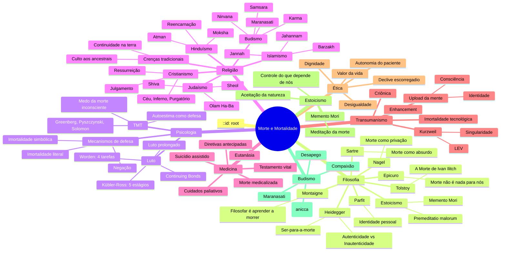

# Morte e Mortalidade

## Índice

1. [Introdução: A Morte Como Condição Humana](#1-introdução-a-morte-como-condição-humana)
2. [Filosofia da Morte](#2-filosofia-da-morte)
3. [O Medo da Morte](#3-o-medo-da-morte)
4. [Morte nas Religiões](#4-morte-nas-religiões)
5. [Morte na Era Moderna](#5-morte-na-era-moderna)
6. [Luto e Perda](#6-luto-e-perda)
7. [Morte, IA e Transumanismo](#7-morte-ia-e-transumanismo)
8. [Exercícios Práticos](#8-exercícios-práticos)
9. [Cross-mapping Mermaid](#9-cross-mapping-mermaid)
10. [Referências](#10-referências)

---

## 1. Introdução: A Morte Como Condição Humana

A morte é a única certeza absoluta da existência humana. Nascemos, vivemos e morremos. Esta constatação, embora óbvia, é constantemente varrida para debaixo do tapete da consciência cotidiana. Vivemos como se fôssemos imortais, como se houvesse tempo infinito pela frente, e essa ilusão nos rouba a possibilidade de uma vida autêntica.

A mortalidade não é apenas um fato biológico. Ela é a condição que dá significado a tudo o que fazemos. Se fôssemos imortais, cada escolha perderia seu peso, cada momento sua preciosidade, cada relação sua urgência. A finitude é o pano de fundo contra o qual a vida ganha contorno.

"Memento Mori" é uma expressão latina que significa "lembre-se de que vai morrer". Na Roma antiga, generais triunfantes tinham um escravo que sussurrava essa frase em seus ouvidos durante o desfile de vitória, justamente para que não se deixassem corromper pelo orgulho. Lembrar da morte não é mórbido — é um exercício de humildade, de presença e de clareza.

Os estoicos praticavam a "meditatio mortis" como parte central de seu treinamento filosófico. Ao contemplar a própria morte, o indivíduo se liberta do medo irracional e passa a valorizar o que realmente importa. A morte, nesse sentido, é uma mestra.

Este documento explora a morte sob múltiplas perspectivas: filosófica, psicológica, religiosa, médica e existencial. O objetivo não é romantizar a morte, nem temê-la, mas integrá-la à vida como parte natural e necessária da experiência humana.

Pensar sobre a morte é, afinal, um dos atos mais vivos que podemos realizar.

---

## 2. Filosofia da Morte

### 2.1 Epicuro: a morte não é nada para nós

Epicuro (341-270 a.C.) ofereceu um dos argumentos mais influentes e tranquilizadores sobre a morte. Em sua "Carta a Meneceu", ele escreve:

> "Acostuma-te à ideia de que a morte não é nada para nós, porque todo bem e todo mal residem na consciência; a morte é a privação da consciência. Portanto, o conhecimento correto de que a morte não é nada para nós torna a mortalidade da vida algo prazeroso, não porque acrescente um tempo infinito, mas porque elimina o desejo de imortalidade."

O argumento é simples e poderoso: enquanto existimos, a morte não está presente; quando a morte chega, nós deixamos de existir. Não há sujeito para experimentar a morte, logo, ela não pode ser um mal para quem morre.

Críticos como Thomas Nagel apontam que esse argumento ignora a "privação" — a morte pode ser um mal não pela experiência em si, mas pelas experiências que ela nos rouba. Epicuro responderia que não se pode sentir falta do que não se experimenta.

De todo modo, a posição epicurista oferece um antídoto racional contra o medo da morte: se a morte é o fim da consciência, não há nada a temer.

### 2.2 Sêneca e os Estoicos: o tempo como recurso finito

Sêneca (4 a.C. - 65 d.C.), em sua obra "Sobre a Brevidade da Vida", diagnostica com precisão cirúrgica nosso maior erro existencial:

> "Não é que temos pouco tempo; é que perdemos muito."

Para os estoicos, a morte não é um mal — é a lei da natureza. O que nos aflige não é a morte em si, mas o medo dela. E o medo da morte nos impede de viver plenamente. Passamos a vida preocupados em acumular, em projetar, em evitar riscos, e quando nos damos conta, o tempo passou.

Marco Aurélio, em suas "Meditações", lembra: "Você poderia viver agora e já ter partido. Deixe que eles determinem o tempo e a natureza disso, conforme acharem melhor."

O exercício estoico da "premeditatio malorum" (premeditação dos males) inclui contemplar a própria morte não como tragédia, mas como parte da ordem natural. Ao fazer isso, o estoico ganha liberdade: se você já aceitou a morte, nada mais pode ser temido.

### 2.3 Heidegger: Ser-para-a-morte (Sein-zum-Tode)

Martin Heidegger, em "Ser e Tempo" (1927), coloca a morte no centro de sua análise existencial. Para ele, a morte não é um evento futuro qualquer — é a possibilidade mais própria e inalienável do ser humano.

Heidegger distingue entre dois modos de existir:
- **Existência inautêntica (das Man)**: o "a gente" vive como todo mundo, distraído, imerso nas ocupações cotidianas, evitando pensar na morte. A morte é sempre "algo que acontece com os outros".
- **Existência autêntica**: ao confrontar a própria mortalidade, o indivíduo se dá conta de que sua vida é única e insubstituível. Ninguém pode morrer por você. A morte é sua possibilidade mais própria.

O "Ser-para-a-morte" (Sein-zum-Tode) é a atitude de assumir a finitude como condição constitutiva do ser. Não se trata de pensar na morte obsessivamente, mas de viver de tal modo que a morte não seja uma interrupção, mas a consumação de uma vida vivida com sentido.

A angústia (Angst) diante da morte não é patológica — é o que nos desperta da inautenticidade e nos chama à responsabilidade por nossa própria existência.

### 2.4 Sartre: a morte como absurdo

Jean-Paul Sartre (1905-1980) oferece uma visão radicalmente diferente. Para ele, a morte não é a possibilidade mais própria (como em Heidegger), mas o contrário: é o fim de todas as possibilidades, a aniquilação do projeto existencial.

Em "O Ser e o Nada", Sartre argumenta que a morte é absurda por três razões:
1. **A morte não é escolhida** — ela chega de fora, como um fato bruto, um "nada" que anula todo o significado que construímos.
2. **A morte rouba o sentido do projeto** — nossas escolhas, nossos planos, nossa vida — tudo pode ser interrompido a qualquer momento de forma arbitrária.
3. **A morte entrega nosso sentido aos outros** — depois que morremos, o significado de nossa vida é definido pelos outros, não por nós.

Diferentemente de Heidegger, para quem a morte possibilita a autenticidade, Sartre vê a morte como um limite que nunca podemos "assumir". A morte não é minha possibilidade — é a impossibilidade de todas as possibilidades.

A resposta sartriana não é aceitar a morte, mas viver com paixão e engajamento apesar dela, criando significado mesmo sabendo que a morte pode anulá-lo.

### 2.5 Tolstoy: a vida inautêntica que ignora a morte

Leon Tolstoy, em sua obra-prima "A Morte de Ivan Ilitch" (1886), narra a história de um burocrata mediano que passa a vida inteira cumprindo expectativas sociais — casamento convencional, carreira respeitável, status — sem nunca questionar o sentido de sua existência.

Quando Ivan Ilitch adoece e se vê diante da morte iminente, passa por uma crise profunda. Ele percebe que sua vida foi "inautêntica" (antes de Heidegger formular o conceito): viveu como deveria viver, não como realmente queria.

O momento crucial do livro é quando Ivan Ilitch deixa de lutar contra a morte e simplesmente "cai" nela. Ele percebe que a morte não é tão terrível quanto imaginava — o terrível era ter vivido uma vida que não era sua.

Tolstoy nos oferece uma lição: a morte não é o problema. O problema é a vida não vivida. A consciência da morte pode nos libertar para uma vida mais autêntica e significativa.

### 2.6 Montaigne: filosofar é aprender a morrer

Michel de Montaigne (1533-1592), em seus "Ensaios", dedica um capítulo inteiro ao tema: "Filosofar é aprender a morrer".

> "Quem ensinasse os homens a morrer, lhes ensinaria a viver."

Montaigne argumenta que passar a vida evitando pensar na morte é o pior dos erros. O medo da morte nos torna escravos. Ao nos familiarizarmos com a morte, ao incorporá-la em nossa reflexão cotidiana, perdemos o medo e ganhamos liberdade.

Ele sugere exercícios práticos: "Desmontai vossa casa, despi-vos, deitai-vos — a morte está em cada um desses gestos." Morrer é o ato mais solitário, mas também o mais universal. Não há como escapar, apenas como se preparar.

Para Montaigne, a filosofia não é abstração — é treinamento para a vida e para a morte.

### 2.7 Nagel: a morte como privação

Thomas Nagel, em seu ensaio clássico "Death" (publicado em "Mortal Questions", 1979), ataca o argumento epicurista de que a morte não pode ser um mal porque não é experimentada.

Nagel propõe que a morte é um mal justamente por ser uma "privação": ela nos rouba a experiência da vida, os bens que a vida poderia nos proporcionar. Algo pode ser ruim mesmo que não seja experimentado como ruim — a traição de um amigo que nunca descobrimos, por exemplo, ainda é uma traição.

Do mesmo modo, a morte é ruim não pela experiência de morrer (que pode ser indolor ou até ausente), mas pela perda de tudo o que a vida poderia oferecer. Quanto mais se tem a perder (juventude, projetos, relacionamentos), pior a morte.

Uma implicação curiosa desse argumento é que a morte pode ser pior para os jovens do que para os velhos, pois os jovens perdem mais experiências potenciais. Nagel não resolve o problema do medo da morte — apenas mostra que não é irracional temê-la.

### 2.8 Parfit: identidade pessoal e o que sobrevive

Derek Parfit (1942-2017), em "Reasons and Persons", aborda a morte através do problema da identidade pessoal. Para ele, a questão central é: o que sobrevive quando morremos?

Parfit argumenta que a identidade pessoal não é tão sólida quanto pensamos. Somos uma série de experiências psicológicas conectadas por memória, intenção e continuidade. Se essas conexões são enfraquecidas (como no sonho, na amnésia ou na velhice), não somos exatamente a "mesma pessoa".

Isso tem implicações radicais para a morte: se a identidade é uma questão de grau, talvez não haja uma fronteira clara entre vida e morte. Talvez parte do que somos já "morra" a cada mudança significativa em nossa psicologia.

Parfit sugere que o medo da morte pode ser atenuado se entendermos que já experimentamos muitas "mortes" ao longo da vida — infância, adolescência, fases diferentes — e sobrevivemos, mesmo que transformados.

---

## 3. O Medo da Morte

### 3.1 Teoria do Gerenciamento do Terror (TMT)

A Teoria do Gerenciamento do Terror (Terror Management Theory), desenvolvida por Jeff Greenberg, Sheldon Solomon e Tom Pyszczynski nos anos 1980, é uma das teorias psicológicas mais influentes sobre o medo da morte.

A premissa central é simples e perturbadora: os seres humanos, diferentemente de outros animais, têm consciência de sua própria mortalidade. Essa consciência cria um potencial paralisante de terror existencial. Para lidar com esse terror, desenvolvemos mecanismos de defesa culturais e psicológicos.

A TMT propõe que grande parte do comportamento humano é motivada, inconscientemente, pelo medo da morte. Isso inclui:
- **Busca por autoestima**: sentir-se valioso dentro de uma "cosmovisão cultural" nos protege do medo da morte. Se somos parte de algo significativo, duradouro, nossa morte não anula completamente nosso valor.
- **Defesa da cosmovisão cultural**: tendemos a exaltar nosso grupo e demonizar o diferente porque nossa visão de mundo é um "escudo" contra o terror da morte. Pessoas que ameaçam nossa visão de mundo são ameaças existenciais.
- **Busca por imortalidade simbólica**: criar filhos, produzir obras, contribuir para a cultura — tudo isso são formas de "viver através de" algo maior.

### 3.2 Mecanismos de defesa contra o medo

Os mecanismos de defesa contra o medo da morte podem ser classificados em duas grandes categorias:

**Imortalidade literal**: crença em uma vida após a morte, seja através de religião (céu, reencarnação, paraíso) ou de versões secularizadas (upload da mente, criônica). A morte não é o fim — apenas uma transição.

**Imortalidade simbólica**: a crença de que algo nosso sobrevive à morte física — nossos genes (filhos), nossa obra (artistas, cientistas), nossa contribuição à sociedade, nossa reputação. Ernest Becker, em "A Negação da Morte" (1973), argumenta que a cultura humana é, em grande parte, um "projeto de imortalidade" simbólica.

Outros mecanismos incluem:
- **Negação**: a morte é algo que acontece com os outros, não conosco
- **Deslocamento**: focar em medos menores (palavra, doença, fracasso) que são mais fáceis de lidar do que o medo fundamental da morte
- **Sublimação**: transformar o medo da morte em criatividade, produtividade, conquistas
- **Humor**: piadas sobre a morte como forma de reduzir sua ameaça psicológica

### 3.3 Diferenças culturais no medo da morte

O medo da morte é universal, mas sua expressão varia dramaticamente entre culturas:

**Culturas ocidentais modernas**: tendem a medicalizar e esconder a morte. Velórios são discretos, hospitais isolam os moribundos, crianças são protegidas do contato com a morte. A morte é um fracasso médico, não um processo natural.

**Culturas mexicanas (Dia dos Mortos)**: a morte é celebrada com cores, música, comida. Os mortos "retornam" uma vez por ano para visitar os vivos. A familiaridade com a morte reduz seu terror.

**Culturas japonesas**: influenciadas pelo budismo e xintoísmo, têm uma relação complexa com a morte. Rituais como o "Obon" honram os ancestrais. A morte é vista como passagem, não como fim absoluto.

**Culturas africanas tradicionais**: a morte não rompe os laços comunitários. Os ancestrais continuam presentes na vida dos vivos, sendo consultados e honrados. A morte é uma transição para outro modo de existência dentro da comunidade.

**Culturas hindus**: o ciclo de morte e renascimento (samsara) é central. A morte não é temida como fim, mas como oportunidade de evolução espiritual. O objetivo não é evitar a morte, mas escapar do ciclo através da libertação (moksha).

---

## 4. Morte nas Religiões

### 4.1 Cristianismo

No Cristianismo, a morte não é o fim, mas a porta para a eternidade. A visão cristã é profundamente marcada pela ressurreição de Jesus, que é vista como garantia da ressurreição dos crentes.

Elementos centrais:
- **Julgamento**: após a morte, cada alma é julgada por Deus com base em sua fé e obras
- **Céu (Paraíso)**: estado de bem-aventurança eterna na presença de Deus
- **Inferno**: estado de separação eterna de Deus, punição para os ímpios
- **Purgatório (catolicismo)**: estado de purificação para aqueles que morrem em estado de graça mas ainda não perfeitos
- **Ressurreição do corpo**: no fim dos tempos, os mortos serão ressuscitados corporalmente
- **Morte como consequência do pecado**: na teologia paulina, "o salário do pecado é a morte" (Romanos 6:23)

A atitude cristã diante da morte oscila entre esperança (vida eterna) e temor (julgamento). O luto é permitido, mas com a certeza da ressurreição: "Não quero, porém, irmãos, que ignoreis o que concerne aos que dormem, para não ficardes tristes como os outros que não têm esperança" (1 Tessalonicenses 4:13).

### 4.2 Budismo

No Budismo, a morte não é o fim nem uma transição para um destino eterno, mas parte do ciclo contínuo de samsara — nascimento, morte, renascimento.

Conceitos fundamentais:
- **Samsara**: ciclo interminável de existência condicionada, marcado pelo sofrimento (dukkha)
- **Karma**: as ações de uma vida determinam as condições do renascimento, não como punição divina, mas como lei causal natural
- **Renascimento**: não é uma reencarnação de uma alma permanente (o budismo nega o "eu" fixo), mas uma continuidade energético-causal
- **Nirvana**: cessação do ciclo de renascimentos, extinção do desejo e do sofrimento
- **Impermanência (anicca)**: tudo que existe é transitório; apegarmo-nos ao que passa é a causa do sofrimento

O budismo oferece práticas de meditação sobre a morte (maranasati) como parte do treinamento espiritual. Contemplar a própria morte não é mórbido — é um meio de reduzir o apego e cultivar a presença.

O Dalai Lama: "Lembre-se de que você não vai morrer — lembre-se de que você já está morrendo, a cada momento."

### 4.3 Hinduísmo

O Hinduísmo vê a morte como parte do ciclo maior de samsara, onde a alma (atman) reencarna repetidamente até alcançar a libertação (moksha).

Conceitos principais:
- **Atman**: a alma individual, eterna e imutável, que transcende o corpo físico
- **Samsara**: ciclo de nascimentos e mortes, impulsionado pelo karma
- **Karma**: lei de causa e efeito que determina as condições do próximo nascimento
- **Moksha**: libertação do ciclo de samsara, união do atman com o Brahman (realidade suprema)
- **Reencarnação**: a alma assume múltiplos corpos ao longo de suas jornadas evolutivas

A morte é vista como uma transição, não como tragédia. Os rituais funerários hindus (incluindo a cremação) são projetados para ajudar a alma a se desprender do corpo e seguir sua jornada.

A Bhagavad Gita oferece um ensinamento central: "Assim como a alma passa da infância à juventude e à velhice, da mesma forma passa para outro corpo após a morte. O sábio não se confunde com isso."

### 4.4 Judaísmo

O Judaísmo tem visões variadas sobre a morte, refletindo sua longa história e diversidade teológica.

Perspectivas históricas:
- **Sheol**: no Tanakh (Bíblia Hebraica), Sheol é o lugar subterrâneo para onde todos os mortos vão, independentemente de mérito — uma existência sombria e silenciosa, não um inferno de tormento
- **Ressurreição**: desenvolvida durante o período do Segundo Templo (séc. VI a.C. em diante), a crença na ressurreição dos mortos no fim dos tempos torna-se central no judaísmo rabínico
- **Olam Ha-Ba** ("O Mundo Vindouro"): o mundo futuro onde os justos serão recompensados
- **Ghilgul Neshamot** (Cabala): doutrina mística da transmigração das almas (reencarnação)

A morte no judaísmo é tratada com rituais rigorosos (tahara, shiva, kaddish) que honram o morto e apoiam o enlutado. O luto é estruturado em estágios: shiva (7 dias), shloshim (30 dias), ano de luto pelos pais.

O judaísmo valoriza a vida neste mundo. A imortalidade é encontrada na continuidade do povo judeu, nas obras, nos descendentes e na memória.

### 4.5 Islamismo

No Islamismo, a morte é a passagem para a vida eterna, onde cada alma será julgada por Allah.

Crenças centrais:
- **Monte (Maut)**: o anjo da morte separa a alma do corpo
- **Barzakh**: o estado intermediário entre a morte e a ressurreição, onde as almas aguardam o Julgamento
- **Qiyamah**: o Dia da Ressurreição, quando todos os mortos serão levantados para o julgamento final
- **Jannah**: o Paraíso, jardim de delícias eternas para os crentes fiéis
- **Jahannam**: o Inferno, lugar de punição para os ímpios e incrédulos
- **Submissão à vontade divina**: a morte é parte do plano de Allah; aceitá-la é um ato de fé

O Islamismo enfatiza a preparação para a morte através de uma vida de submissão a Allah, boas obras e arrependimento. Os funerais islâmicos são simples e rápidos, refletindo a crença de que a alma logo seguirá para seu destino eterno.

### 4.6 Crenças Tradicionais

Religiões tradicionais africanas, ameríndias, asiáticas e de outras regiões frequentemente veem a morte não como ruptura, mas como transformação.

Características comuns:
- **Culto aos ancestrais**: os mortos continuam presentes na comunidade, sendo consultados, honrados e temidos
- **Continuidade na terra**: a morte não rompe os laços com o território, a família ou a tribo
- **Morte como transição**: para outro plano, outro corpo ou outra forma de existência
- **Rituais elaborados**: cerimônias funerárias que podem durar dias, semanas ou até anos
- **Morte "natural" vs. morte "causada"**: muitas culturas distinguem entre mortes que são "parte da ordem" (velhice) e mortes que resultam de forças espirituais maléficas

No candomblé e na umbanda (religiões afro-brasileiras), os mortos (eguns) são honrados e temidos. Existem rituais específicos para "assentar" o espírito do falecido e garantir que ele não perturbe os vivos. O axé dos ancestrais alimenta a comunidade.

---

## 5. Morte na Era Moderna

### 5.1 A morte medicalizada

Até o início do século XX, a morte era um evento doméstico. As pessoas morriam em casa, rodeadas pela família, com rituais comunitários que integravam a morte à vida cotidiana.

No século XX, a morte foi progressivamente transferida para hospitais. Hoje, a maioria das mortes no mundo ocidental ocorre em instituições de saúde, muitas vezes isolada, solitária, tecnificada.

O que mudou:
- **A morte como fracasso médico**: os médicos são treinados para salvar vidas; a morte é vista como derrota, não como processo natural
- **Tecnologia prolongadora**: respiradores, UTI's, nutrição artificial — pacientes podem ser mantidos "vivos" por semanas ou meses sem perspectiva de recuperação
- **Perda do protagonismo do paciente**: decisões sobre o processo de morrer são frequentemente tomadas por médicos e familiares, não pelo moribundo
- **Isolamento do moribundo**: visitas limitadas, protocolos hospitalares, falta de privacidade e dignidade

Philippe Ariès, em "O Homem Diante da Morte", descreve essa transformação como a passagem da morte "domada" (familiar, aceita) para a morte "selvagem" (negada, medicalizada, escondida).

### 5.2 A morte negada

A cultura moderna ocidental é caracterizada por uma negação sistemática da morte. Isso se manifesta em diversos fenômenos:

- **Capitalismo da juventude**: indústria bilionária de cosméticos, cirurgias plásticas, suplementos anti-idade que prometem "parar o tempo"
- **Linguagem eufemística**: "partiu", "foi para o andar de cima", "descansou", "se foi" — evitamos a palavra morte
- **Invisibilidade dos idosos**: asilos e casas de repouso afastam os velhos do convívio social
- **Morte como tabu**: assim como o sexo era tabu na era vitoriana, a morte é o grande tabu da modernidade
- **Morte nos meios de comunicação**: consumimos morte violenta em filmes, séries e notícias (morte "fictícia" ou distante), mas não sabemos lidar com a morte real e próxima

### 5.3 O movimento Death Positive

Em reação à morte negada, surgiu nas últimas décadas o movimento "Death Positive" ou "Death Acceptance", liderado por figuras como Caitlin Doughty.

Caitlin Doughty, agente funerária e autora de "Smoke Gets in Your Eyes", fundou a "Order of the Good Death", que defende:
- **Aceitação da morte**: a morte é natural, inevitável e não deve ser temida ou escondida
- **Transparência sobre a morte**: educação sobre o processo de morrer, opções funerárias, direitos do moribundo
- **Desmedicalização da morte**: morrer em casa, com dignidade e controle
- **Alternativas funerárias ecológicas**: enterro natural, compostagem humana, hidrólise alcalina
- **Redução do medo através da familiaridade**: quanto mais falamos sobre a morte, menos medo temos

O movimento inclui "Death Cafés" (encontros para conversar sobre morte tomando chá e bolo), "Death Doulas" (acompanhantes de fim de vida) e uma vasta produção de conteúdo sobre educação para a morte.

### 5.4 Cuidados paliativos, eutanásia e suicídio assistido

**Cuidados Paliativos**: abordagem multidisciplinar para melhorar a qualidade de vida de pacientes com doenças que ameaçam a vida e seus familiares. Foco no alívio do sofrimento (físico, psicológico, social, espiritual), não na cura. A Organização Mundial da Saúde (OMS) recomenda cuidados paliativos como parte dos cuidados de saúde básicos.

Princípios:
- Controle da dor e sintomas
- Comunicação aberta sobre prognóstico
- Suporte emocional e espiritual ao paciente e familiares
- Planejamento antecipado de cuidados
- Não acelerar nem adiar a morte — permitir que o curso natural aconteça

**Eutanásia**: ato intencional de um médico para pôr fim à vida de um paciente, a pedido do paciente, para aliviar sofrimento insuportável. Legalizada em países como Países Baixos, Bélgica, Canadá, Colômbia, Espanha, Portugal.

**Suicídio Assistido**: o médico fornece os meios para o paciente pôr fim à própria vida, mas o paciente realiza o ato final. Legalizado em Suíça, alguns estados dos EUA (Oregon, Washington, Califórnia), Alemanha.

Debate ético:
- **Favor**: autonomia individual, dignidade, alívio do sofrimento
- **Contra**: valor sagrado da vida, risco de abusos, "declive escorregadio", papel do médico como curador

### 5.5 Testamento vital e diretivas antecipadas

O testamento vital é um documento legal no qual uma pessoa expressa seus desejos sobre tratamentos médicos que deseja ou não receber caso se torne incapaz de se comunicar.

No Brasil, as Diretivas Antecipadas de Vontade (DAV) foram regulamentadas pela Resolução CFM nº 1.995/2012.

O que pode incluir:
- Recusa de tratamentos fúteis ou extraordinários (suporte artificial de vida, reanimação)
- Preferência por cuidados paliativos
- Designação de um procurador de saúde (pessoa para tomar decisões em seu lugar)
- Doação de órgãos
- Disposição do corpo (sepultamento, cremação)

Ter um testamento vital não é "planejar a morte" — é garantir que sua vontade seja respeitada e que seus familiares não tenham que tomar decisões difíceis sem orientação.

### 5.6 O luto na modernidade

O luto na sociedade moderna é frequentemente:
- **Privado**: enlutados sofrem em silêncio, isolados; o luto público é desencorajado
- **Encurtado**: pressão social para "superar" rapidamente; licenças luto de poucos dias
- **Patologizado**: o luto prolongado é tratado como transtorno mental (Transtorno do Luto Prolongado no DSM-5)
- **Desritualizado**: perda de rituais comunitários que estruturariam o processo de luto
- **Comercializado**: a indústria funerária transforma a morte em negócio

Críticos argumentam que a modernidade roubou do enlutado o suporte comunitário e os rituais que historicamente tornavam o luto suportável.

---

## 6. Luto e Perda

### 6.1 Kübler-Ross: os 5 estágios do luto (e suas críticas)

Elisabeth Kübler-Ross, em seu livro seminal "Sobre a Morte e o Morrer" (1969), propôs que pacientes terminais passam por cinco estágios ao processar a própria morte:

1. **Negação**: "Não pode ser verdade." Mecanismo de defesa temporário contra o choque.
2. **Raiva**: "Por que eu?" A raiva pode ser dirigida a Deus, médicos, familiares.
3. **Barganha**: "Se eu puder viver mais tempo, prometo..." Tentativa de negociar com Deus ou o destino.
4. **Depressão**: "Não adianta mais, é o fim." Tristeza profunda diante das perdas iminentes.
5. **Aceitação**: "Está tudo bem. Estou pronto." Não é felicidade, é paz.

**Críticas e mitos**:
- Kübler-Ross nunca disse que os estágios são lineares ou universais. Ela descreveu padrões observados, não uma receita.
- Os estágios foram inicialmente pensados para pacientes terminais, não para enlutados (embora tenham sido amplamente aplicados ao luto).
- Não há evidência científica robusta de que as pessoas passam por esses estágios de forma previsível.
- Muitas pessoas não experimentam todos os estágios; outras experimentam em ordem diferente.
- A "aceitação" não é o objetivo final de todo luto — algumas pessoas nunca "aceitam" totalmente uma perda significativa.

Kübler-Ross posteriormente lamentou a simplificação excessiva de seu modelo.

### 6.2 Worden: as 4 tarefas do luto

J. William Worden propôs um modelo alternativo aos estágios de Kübler-Ross: as "tarefas do luto". Em vez de algo que "acontece" com a pessoa, o luto é algo que se "faz" — ativamente.

As 4 tarefas são:

**Tarefa 1: Aceitar a realidade da perda**
Superar a negação e reconhecer que a pessoa morreu. Rituais como o funeral ajudam nessa tarefa.

**Tarefa 2: Processar a dor do luto**
Permitir-se sentir a dor, a tristeza, a raiva, a culpa. Evitar ou suprimir essas emoções prolonga o luto.

**Tarefa 3: Ajustar-se a um novo mundo sem o falecido**
Ajustes externos (novos papéis, novas responsabilidades), internos (nova identidade) e espirituais (novo sentido da vida).

**Tarefa 4: Encontrar uma conexão duradoura com o falecido enquanto segue com a vida**
Não é "superar" ou "esquecer" — é encontrar um lugar para a pessoa amada em sua vida emocional enquanto você segue adiante.

Worden enfatiza que as tarefas não precisam ser concluídas em ordem e que o luto não tem prazo fixo.

### 6.3 O modelo de luto contínuo (Continuing Bonds)

Tradicionalmente, acreditava-se que o luto saudável terminava com o "desapego" do falecido — a ideia de que era preciso "seguir em frente" e "deixar ir".

O modelo de "Continuing Bonds" (Klass, Silverman, Nickman, 1996) propõe uma visão radicalmente diferente: manter uma conexão contínua com o falecido é saudável e normal.

Formas de conexão contínua:
- Conversar com o falecido (em pensamento ou em voz alta)
- Manter objetos ou rituais que honrem sua memória
- Sentir a presença do falecido
- Sonhar com o falecido
- Incorporar seus valores ou ensinamentos na vida cotidiana

O que muda não é o vínculo, mas a natureza do vínculo — de uma relação de presença física para uma relação de memória, significado e amor transformado.

### 6.4 Diferença entre luto normal, complicado e prolongado

**Luto normal**: reação esperada e adaptativa à perda. Inclui tristeza, saudade, choro, alterações de sono e apetite, dificuldade de concentração. Geralmente diminui em intensidade com o tempo, embora possa ser reativado em datas significativas.

**Luto complicado**: quando o processo de luto é interrompido ou distorcido. Pode incluir luto crônico (não diminui), luto atrasado (reações adiadas) ou luto ausente (negação prolongada).

**Transtorno do Luto Prolongado (DSM-5-TR)**: diagnóstico psiquiátrico proposto para pessoas que experimentam uma resposta de luto intensa e persistente (mais de 12 meses) que interfere significativamente no funcionamento diário.

Características:
- Saudade intensa e persistente do falecido
- Preocupação com pensamentos sobre o falecido
- Dificuldade em aceitar a morte
- Evitação de lembranças
- Sensação de choque ou descrença
- Dificuldade em confiar nos outros
- Amargura ou raiva
- Sentimento de que a vida não tem sentido

Há controvérsia sobre a medicalização do luto. Críticos argumentam que o luto é uma resposta natural, não um transtorno, e que rotulá-lo como doença pode patologizar a dor humana.

### 6.5 Como apoiar alguém enlutado

**O que NÃO dizer:**
- "Ele/ela está em um lugar melhor" — pode não ser reconfortante se a pessoa não compartilhar da mesma crença
- "Tudo acontece por uma razão" — a perda não tem "razão" que justifique a dor
- "Seja forte" — o enlutado não precisa ser forte; precisa sentir
- "Você precisa superar" — o luto não se supera, se integra
- "Foi a vontade de Deus" — pode gerar raiva ou culpa
- "Pelo menos ele/ela não sofreu" — a perda ainda é uma perda
- "Você é jovem, vai encontrar outro amor / ter outro filho" — a pessoa é insubstituível

**O que fazer:**
- **Esteja presente**: muitas vezes não há o que dizer. Sua presença silenciosa vale mais que palavras.
- **Escute**: não ofereça soluções. Apenas ouça.
- **Ofereça ajuda concreta**: "Vou trazer jantar na terça" é melhor que "Me avise se precisar de algo"
- **Lembre-se de datas**: aniversários, dia da morte — o enlutado não esqueceu
- **Mencione o nome do falecido**: falar sobre a pessoa é uma forma de honrá-la
- **Seja paciente**: o luto não segue cronograma. Esteja disponível por meses, não apenas dias.
- **Aceite o silêncio e as lágrimas**: não tente "consertar" a tristeza

---

## 7. Morte, IA e Transumanismo

### 7.1 Ray Kurzweil e a singularidade: imortalidade tecnológica

Ray Kurzweil, futurista e diretor de engenharia do Google, popularizou o conceito de "singularidade tecnológica" — o momento (previsto para 2045) em que a inteligência artificial superará a capacidade humana e desencadeará um avanço exponencial.

Para Kurzweil, a singularidade trará também a imortalidade:
- **Nanobots médicos**: repararão danos celulares em tempo real, eliminando doenças e envelhecimento
- **Upload da mente**: nossa consciência poderá ser transferida para corpos robóticos ou ambientes virtuais
- **Longevity escape velocity**: a cada ano que passa, a ciência prolonga a vida mais do que um ano; teoricamente, alcançaremos a "velocidade de fuga" onde a morte é indefinidamente adiada

Críticos apontam que Kurzweil subestima a complexidade dos problemas biológicos e filosóficos envolvidos. Além disso, mesmo que a tecnologia avance, quem terá acesso a ela? A imortalidade seria privilégio de poucos?

### 7.2 Upload da mente (mind uploading): é possível?

O upload da mente (também chamado de "emulação cerebral total") é a hipotética transferência de uma mente humana para um substrato digital. A ideia tem raízes na ficção científica (como em "Black Mirror") mas é levada a sério por alguns filósofos e cientistas.

**Problemas técnicos**:
- O cérebro humano tem ~86 bilhões de neurônios com ~100 trilhões de sinapses
- Mapear cada conexão em nível molecular está além da tecnologia atual
- O cérebro é dinâmico — as conexões mudam constantemente
- Não sabemos se a consciência pode ser "computada" ou se requer um substrato biológico

**Problemas filosóficos**:
- Identidade pessoal: se eu copiar minha mente para um computador, o "eu" original ainda morre. A cópia é uma nova pessoa que pensa ser eu.
- Continuidade da consciência: a consciência requer continuidade temporal? Se a cópia for desligada e religada, ela ainda é a mesma pessoa?
- Qualia: a experiência subjetiva pode ser replicada digitalmente? Ou a consciência depende de propriedades biológicas?

Parfit (já mencionado) argumentaria que o upload não preserva a identidade, apenas cria uma continuidade psicológica — o que pode ser "bom o suficiente" dependendo da sua visão de identidade pessoal.

### 7.3 Criônica: aposta ou ilusão?

A criônica é a prática de preservar corpos (ou apenas cérebros) em temperaturas extremamente baixas após a morte, na esperança de que tecnologias futuras possam reanimá-los e curá-los.

Empresas como Alcor e Cryonics Institute mantêm centenas de pacientes em tanques de nitrogênio líquido (-196°C).

**Argumentos a favor**:
- Se há alguma chance, por mínima que seja, de ser revivido, vale a tentativa
- A tecnologia futura pode ser capaz de reparar danos de congelamento e reverter a causa da morte
- É uma aposta racional (Pascal aplicado à morte)

**Argumentos contra**:
- O congelamento causa danos irreversíveis às células (cristais de gelo, toxicidade de crioprotetores)
- A "morte" legal pode não ser reversível mesmo com tecnologia avançada
- Não há garantia de que a sociedade futura queira reanimar pessoas do passado
- O custo é alto e o benefício, incerto
- Mesmo que funcione, quem "volta" não tem lugar no futuro — sem família, sem bens, sem contexto social

A criônica é, no fundo, um ato de fé na tecnologia — uma versão secular da crença na ressurreição.

### 7.4 O que seria uma vida infinitamente longa?

Filósofos como Derek Parfit e Bernard Williams questionam se a imortalidade seria desejável.

**Bernard Williams, "The Makropolus Case"**: Williams argumenta que a vida imortal seria inevitavelmente tediosa. Citando a ópera de Leoš Janáček (Elina Makropolus, que viveu 300 anos e eventualmente se entediou), ele sugere que uma vida infinitamente longa perderia o sentido porque:
- Sem a finitude, não há urgência ou significado
- Com tempo infinito, tudo perde seu peso
- Ou a vida se torna repetitiva e entediante, ou a pessoa muda tanto que não é mais a mesma

**Críticas a Williams**:
- Uma vida imortal não precisa ser repetitiva — o universo é vasto, há infinitas experiências possíveis
- O tédio pode ser um problema de imaginação, não de imortalidade
- Se a vida é boa, mais vida é melhor (Nagel)

**Parfit**: a imortalidade pode ser desejável se mantivermos conexões psicológicas significativas com nosso futuro "eu". Se eu me tornar radicalmente diferente em 1.000 anos, talvez não faça sentido dizer que "eu" ainda estarei vivo.

O debate não tem conclusão, mas nos força a pensar sobre o que torna a vida valiosa. Se é a finitude que dá sentido, então a imortalidade seria uma maldição. Se é a experiência e o prazer, então mais vida é sempre melhor.

### 7.5 Enhancement e longevity escape velocity

O movimento transumanista não se limita à imortalidade — busca o melhoramento humano (human enhancement) em todas as dimensões.

**Longevity Escape Velocity (LEV)**: conceito cunhado por Kurzweil e David Gobel. Se o avanço da medicina e da biotecnologia permitir que, a cada ano que passa, a expectativa de vida aumente em mais de um ano, alcançamos a "velocidade de fuga" da morte — tecnicamente, a morte se torna indefinidamente adiável.

**Implicações**:
- A morte deixa de ser inevitável e se torna opcional?
- Quem terá acesso a essas tecnologias? Desigualdade imortal?
- Se a morte for derrotada, o que acontece com a superpopulação?
- O que significa ser humano em um mundo sem morte natural?

Transumanistas como Nick Bostrom argumentam que a morte é uma tragédia evitável, e que buscar a imortalidade é tão racional quanto buscar a cura do câncer. Bioconservadores como Francis Fukuyama alertam que o transumanismo ameaça a essência da humanidade.

---

## 8. Exercícios Práticos

### 8.1 Memento Mori: escreva seu próprio obituário

Exercício estoico. Escreva seu obituário como você gostaria que fosse lido. Não se trata de prever a data, mas de refletir sobre que vida você quer ter vivido.

Perguntas para guiar:
- O que você gostaria que as pessoas dissessem sobre você?
- Quais foram suas contribuições para o mundo?
- Como você tratou as pessoas ao seu redor?
- O que foi mais importante para você?
- Seu obituário atual (se você morresse hoje) seria diferente do que você gostaria?

Escreva 1-2 parágrafos. Guarde e releia em 6 meses. Reflita sobre o que mudou.

### 8.2 A morte de Ivan Ilitch: reflita sobre o que você está adiando

Leia "A Morte de Ivan Ilitch" (ou relembre a história). Agora reflita:

- O que você está adiando na sua vida?
- Que conversas você evita ter?
- Que mudanças você sabe que precisa fazer mas não faz?
- Você está vivendo sua vida ou a vida que os outros esperam de você?
- Se você descobrisse que tem 6 meses de vida, o que mudaria hoje?

Anote suas respostas. Comprometa-se com uma ação concreta.

### 8.3 Monte seu testamento vital

Crie um documento de Diretivas Antecipadas de Vontade. Inclua:

1. Quais tratamentos você aceitaria e recusaria em caso de incapacidade
2. Sua posição sobre reanimação cardíaca, ventilação artificial, nutrição artificial
3. Preferência por cuidados paliativos
4. Quem você designa como procurador de saúde
5. Preferências sobre doação de órgãos
6. Preferências funerárias (enterro, cremação, cerimônia)

Consulte um advogado para validar o documento. Compartilhe com seu médico e familiares.

### 8.4 Carta para alguém que você ama (como se fosse a última)

Escreva uma carta para alguém importante na sua vida. Escreva como se fosse a última oportunidade de se comunicar.

- O que você nunca disse e gostaria de dizer?
- Pelo que você é grato?
- O que você admira na pessoa?
- Que memória você guarda com carinho?
- O que você deseja para o futuro da pessoa?

Não precisa entregar a carta (a menos que sinta que deve). O exercício é sobre expressar sentimentos que podem estar guardados.

### 8.5 A lista de Bucket (o que fazer antes de morrer)

Crie uma lista de experiências que você deseja ter antes de morrer. Não precisa ser grandioso — pode incluir:

- Lugares para visitar
- Habilidades para aprender
- Pessoas para reconectar
- Livros para ler
- Projetos para completar
- Experiências para viver (simples ou extraordinárias)

A lista não é uma obrigação — é um norte. Revise-a periodicamente. Risque itens realizados. Adicione novos.

### 8.6 Roda da vida: você está vivendo como gostaria?

Desenhe um círculo dividido em 8 partes (como uma pizza), cada uma representando uma área da vida:

1. Saúde física
2. Relacionamentos (família, amigos, amor)
3. Trabalho / Carreira
4. Finanças
5. Lazer / Hobbies
6. Desenvolvimento pessoal / Espiritual
7. Contribuição / Propósito
8. Vida doméstica / Ambiente

Em cada fatia, de 1 (muito insatisfeito) a 10 (completamente satisfeito), marque seu nível atual. Conecte os pontos.

A roda ideal é redonda. A sua roda tem "baixos". Esses baixos são áreas que você está negligenciando. Se você fosse morrer em um ano, essas áreas pareceriam importantes?

Comprometa-se com uma melhoria concreta em uma área essa semana.

### 8.7 Meditação da morte (budista)

Esta prática é adaptada da meditação budista "maranasati" (consciência da morte). Encontre um local tranquilo. Sente-se confortavelmente. Respire fundo algumas vezes.

Passos:

1. **Visualize seu corpo envelhecendo**: imagine seu corpo com 10, 20, 30 anos a mais. Veja as rugas, os cabelos brancos, as limitações físicas.

2. **Visualize-se doente**: imagine-se acamado, fraco, dependente de cuidados. Observe as emoções que surgem — medo, tristeza, aceitação.

3. **Visualize sua morte**: imagine seu último suspiro. Sinta o corpo parando. A consciência se dissipando. O silêncio.

4. **Visualize seu corpo após a morte**: o corpo esfriando, sendo preparado para o funeral, sendo cremado ou enterrado. O corpo se desfazendo, retornando à terra.

5. **Reflita sobre a impermanência**: "Este corpo, a mente, as pessoas que amo, tudo que conheço — tudo é impermanente. Nada dura. Tudo passa."

6. **Volte à respiração**: sinta o ar entrando e saindo. Você está vivo agora. Aproveite este momento.

Esta meditação não é mórbida. É um treinamento para soltar o apego e valorizar o presente.

Repita semanalmente.

---

## 9. Cross-mapping Mermaid

---

## 10. Referências

### Livros e artigos acadêmicos

1. **HEIDEGGER, Martin.** *Ser e Tempo* (1927). Editora Vozes, 2012.
   - Seção sobre Ser-para-a-morte (§§ 46-53). A análise existencial da morte como possibilidade mais própria.

2. **TOLSTOY, Leon.** *A Morte de Ivan Ilitch* (1886). Editora 34, 2016.
   - Clássico da literatura sobre a vida inautêntica e a confrontação com a morte.

3. **KÜBLER-ROSS, Elisabeth.** *Sobre a Morte e o Morrer* (1969). Editora Martins Fontes, 2008.
   - Obra seminal sobre os estágios emocionais de pacientes terminais.

4. **DOUGHTY, Caitlin.** *Smoke Gets in Your Eyes: And Other Lessons from the Crematory* (2014). W. W. Norton.
   - Memórias e reflexões de uma agente funerária sobre a morte e a cultura americana.

5. **BECKER, Ernest.** *A Negação da Morte* (1973). Editora Record, 2007.
   - Prêmio Pulitzer. Base teórica para a Teoria do Gerenciamento do Terror.

6. **NAGEL, Thomas.** *Mortal Questions* (1979). Cambridge University Press.
   - Inclui o ensaio clássico "Death" sobre a morte como privação.

7. **SCHEFFLER, Samuel.** *Death and the Afterlife* (2013). Oxford University Press.
   - Reflexão filosófica sobre o que significa a morte individual e coletiva.

8. **YALOM, Irvin D.** *Existential Psychotherapy* (1980). Basic Books.
   - A morte como um dos quatro "dados fundamentais" da existência humana.

9. **ARIÈS, Philippe.** *O Homem Diante da Morte* (1977). Editora Unesp, 2014.
   - História das atitudes ocidentais diante da morte, da Idade Média ao século XX.

10. **PARFIT, Derek.** *Reasons and Persons* (1984). Oxford University Press.
    - Capítulos sobre identidade pessoal e implicações para a morte.

11. **WILLIAMS, Bernard.** "The Makropolus Case: Reflections on the Tedium of Immortality" (1973). In *Problems of the Self*.
    - Argumento clássico contra o desejo de imortalidade.

12. **SÊNECA.** *Sobre a Brevidade da Vida*. Editora Companhia das Letras, 2008.
    - Ensaio estoico sobre o uso do tempo e a preparação para a morte.

13. **MONTAIGNE, Michel de.** *Ensaios*. Livro I, Capítulo 20: "Filosofar é aprender a morrer".
    - Reflexão sobre a familiaridade com a morte como caminho para uma vida boa.

14. **SOLOMON, Sheldon; GREENBERG, Jeff; PYSZCZYNSKI, Tom.** *The Worm at the Core: On the Role of Death in Life* (2015). Random House.
    - Síntese da Teoria do Gerenciamento do Terror para o público geral.

15. **KLASS, Dennis; SILVERMAN, Phyllis; NICKMAN, Steven.** *Continuing Bonds: New Understandings of Grief* (1996). Routledge.
    - Modelo alternativo ao luto como desapego.

16. **WORDEN, J. William.** *Grief Counseling and Grief Therapy* (5ª ed., 2018). Springer.
    - Modelo das 4 tarefas do luto.

17. **KURZWEIL, Ray.** *The Singularity Is Near* (2005). Viking.
    - Visão transumanista da imortalidade tecnológica.

18. **BOSTROM, Nick.** *Superintelligence: Paths, Dangers, Strategies* (2014). Oxford University Press.
    - Riscos e oportunidades da inteligência artificial e transumanismo.

19. **MAURIAC, François.** *O que é a Morte?* (1951).
    - Perspectiva cristã sobre a morte.

20. **SARTRE, Jean-Paul.** *O Ser e o Nada* (1943). Editora Vozes, 2015.
    - Seção sobre a morte como absurdo e fim do projeto.

### Filmes e documentários

21. **A Morte de Ivan Ilitch** (adaptações cinematográficas diversas).
22. **Coco** (2017, Disney/Pixar) — morte e memória na cultura mexicana.
23. **The Seventh Seal** (1957, Ingmar Bergman) — homem que joga xadrez com a morte.
24. **Enter the Void** (2009, Gaspar Noé) — experiência pós-morte inspirada no Bardo Thodol.
25. **Departures** (2008, Yojiro Takita) — agente funerário japonês e rituais de morte.
26. **Smoke Gets in Your Eyes** — série documental de Caitlin Doughty.
27. **The Fountain** (2006, Darren Aronofsky) — amor, morte, imortalidade.
28. **Ikiru (Viver)** (1952, Akira Kurosawa) — homem que descobre que vai morrer e busca sentido.
29. **It's Such a Beautiful Day** (2012, Don Hertzfeldt) — animação existencial sobre morte.
30. **Soul** (2020, Disney/Pixar) — o que dá significado à vida e à morte.

### Recursos online

31. [Order of the Good Death](https://www.orderofthegooddeath.com) — Movimento Death Positive.
32. [Death Cafe](https://deathcafe.com) — Encontros comunitários para falar sobre morte.
33. [Alcor Life Extension Foundation](https://www.alcor.org) — Organização de criônica.
34. [Academia Brasileira de Cuidados Paliativos](https://www.abcp.org.br) — Cuidados paliativos no Brasil.
35. [Sociedade Brasileira de Tanatologia](https://www.tanatologia.com.br) — Estudos sobre morte e luto.

### Citações selecionadas

> "Quando existimos, a morte não existe; quando a morte existe, não existimos." — Epicuro

> "Não é que temos pouco tempo; é que perdemos muito." — Sêneca

> "Filosofar é aprender a morrer." — Montaigne

> "O salário do pecado é a morte." — Romanos 6:23

> "Assim como a alma passa da infância à juventude e à velhice, da mesma forma passa para outro corpo após a morte." — Bhagavad Gita

> "Não quero, porém, irmãos, que ignoreis o que concerne aos que dormem, para não ficardes tristes como os outros que não têm esperança." — 1 Tessalonicenses 4:13

> "Lembre-se de que você não vai morrer — lembre-se de que você já está morrendo, a cada momento." — Dalai Lama

> "A morte é a impossibilidade de todas as possibilidades." — Jean-Paul Sartre

> "Se a morte não é nada, se ninguém tem consciência dela, não há com o que se preocupar." — Epicuro

> "O que me assusta não é a morte. É ter passado pela vida sem ter vivido." — Ivan Ilitch (personagem de Tolstoy)

> "O medo da morte é o preço que pagamos pela consciência." — Ernest Becker

> "A morte não é o oposto da vida, mas parte dela." — Haruki Murakami

> "Viver é estar aos poucos morrendo." — Heráclito

> "Tudo que nasce, morre. Tudo que sobe, desce. Tudo que se encontra, se desencontra." — Sabedoria popular

> "A única maneira de viver é aceitar a morte." — Paulo Coelho

> "A morte sorri para todos; só nos resta sorrir de volta." — Marco Aurélio

> "Que a morte me encontre plantando minhas couves, mas indiferente a ela e mais ainda ao meu jardim imperfeito." — Montaigne

> "O homem é o único animal que sabe que vai morrer e, apesar disso, consegue viver." — Gabriel García Márquez

> "A morte tem a leveza de uma pena e o peso de uma montanha." — Desconhecido

> "A morte é uma grande oportunidade. Não a de viver, mas a de entender que cada segundo é um milagre." — Rubem Alves

> "O luto não é um distúrbio a ser curado, mas um processo a ser vivido." — Desconhecido

> "A morte não nos rouba a vida, apenas a transforma." — Mircea Eliade

> "Não se preparar para a morte é preparar-se para o sofrimento." — Sêneca

---

## Notas Finais

Este documento é um compêndio introdutório e interdisciplinar sobre a morte e a mortalidade. Não pretende esgotar o tema — que é inesgotável — mas oferecer ferramentas conceituais e práticas para que cada pessoa possa refletir sobre sua própria finitude.

A morte é o grande equalizador. Rica ou pobre, famosa ou anônima, jovem ou velha — ninguém escapa. Mas esta não é uma verdade triste. É, paradoxalmente, libertadora. Se vamos morrer, o que importa verdadeiramente? O que estamos esperando para fazer?

Memento Mori. Lembre-se de que você vai morrer.

E por isso mesmo, viva.

---

*Documento criado em 18 de maio de 2026.*
*Revisões e acréscimos são bem-vindos.*
