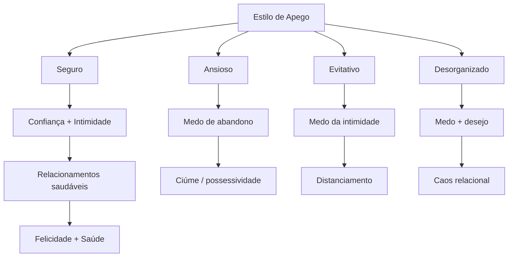
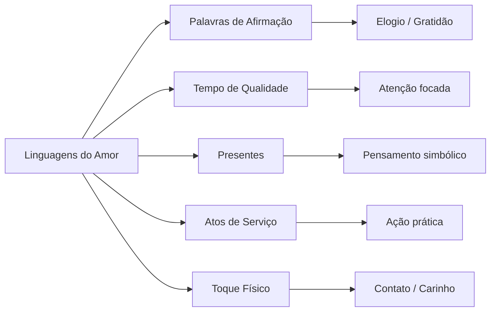
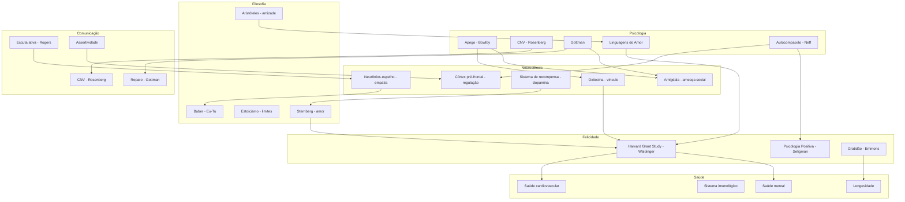

# Relacionamentos

## 1. Introdução: Por que relacionamentos importam?

O estudo mais longo sobre felicidade já realizado — o Harvard Grant Study, liderado por Robert Waldinger — acompanhou centenas de homens por mais de 80 anos. A conclusão central é simples e profunda:

> **A qualidade dos nossos relacionamentos é o maior preditor de felicidade e saúde.**

Não o dinheiro. Não a fama. Não o QI. Nem mesmo o colesterol. Pessoas com relacionamentos mais quentes vivem mais, adoecem menos e relatam níveis muito mais altos de bem-estar.

Solitude é diferente de solidão. A solidão crônica é tóxica: aumenta inflamação, prejudica o sono, acelera o declínio cognitivo. O cérebro humano evoluiu para conexão. Somos uma espécie social. A ausência de vínculos de qualidade é um fator de risco comparável ao tabagismo.

Relacionamentos não são "bonitinho de ter". São necessidade biológica e emocional. Mas relacionamentos de qualidade **não são automáticos** — exigem consciência, prática, vulnerabilidade e coragem.

Este documento compila o que a ciência, a filosofia e a experiência prática nos ensinam sobre relacionar-se — com parceiros, amigos, família e consigo mesmo.

---

## 2. Attachment Theory (Teoria do Apego)

A teoria do apego foi desenvolvida por John Bowlby e Mary Ainsworth. Ela descreve como os primeiros vínculos com cuidadores moldam nossos padrões de relacionamento pela vida inteira.

### 2.1 Apego Seguro

**Características:**
- Confiança básica de que o outro estará disponível
- Conforto com a intimidade e com a autonomia
- Capacidade de se apoiar no outro sem perder a própria identidade
- Comunicação aberta e assertiva
- Regulação emocional saudável

**Na infância:** A criança chora, o cuidador responde com carinho e consistência. A criança aprende que o mundo é seguro e que pessoas são fonte de conforto.

**Na vida adulta:** Relacionamentos estáveis, capacidade de resolver conflitos, baixo medo de abandono ou engolfamento.

**Frase típica:** "Fico bem perto e fico bem longe. Posso contar com você e posso contar comigo."

### 2.2 Apego Ansioso

**Características:**
- Medo intenso de abandono e rejeição
- Necessidade constante de validação e contato
- Tendência à fusão emocional (perder-se no outro)
- Hipersensibilidade a mudanças de humor ou distância do parceiro
- Pensamento catastrófico: "Se ele está quieto, é porque não me ama mais"

**Na infância:** Cuidado inconsistente — às sim, às não. A criança aprende que precisa se agarrar para não ser abandonada.

**Na vida adulta:** Relacionamentos intensos e turbulentos. Ciúme, possessividade, busca por garantias constantes. Tendência a ficar em relacionamentos que não funcionam por medo da solidão.

**Frase típica:** "Preciso que você me prove que me ama. Toda hora. Se não, eu desabo."

### 2.3 Apego Evitativo

**Características:**
- Desconforto com intimidade e dependência
- Autossuficiência exagerada ("não preciso de ninguém")
- Distanciamento emocional
- Dificuldade em expressar necessidades e sentimentos
- Tendência a minimizar a importância dos relacionamentos

**Na infância:** Cuidador pouco responsivo, rejeitador ou punitivo quando a criança busca contato. A criança aprende que é melhor não precisar dos outros.

**Na vida adulta:** Relacionamentos superficiais. Medo de compromisso. Tendência a focar em defeitos do parceiro como justificativa para não se envolver. Pode ser emocionalmente indisponível sem perceber.

**Frase típica:** "Você está precisando demais. Eu preciso do meu espaço. Não sou bom nisso."

### 2.4 Apego Desorganizado

**Características:**
- Combinação paradoxal de medo e desejo de conexão
- Comportamento imprevisível: hora persegue, hora foge
- Dificuldade severa em confiar
- Histórico de trauma ou abuso na infância
- Relacionamentos caóticos e instáveis

**Na infância:** Cuidador é fonte de medo e de conforto ao mesmo tempo. A criança não sabe se aproxima ou foge — fica paralisada, confusa.

**Na vida adulta:** Padrões autossabotadores. Entrar em relacionamentos abusivos. Alternar entre idealização e desvalorização do parceiro. Dificuldade extrema em regular emoções.

**Frase típica:** "Quero você perto, mas você me assusta. Não sei se fico ou se vou."

### 2.5 Como o estilo de apego se forma na infância

O cérebro infantil é plástico e programado para criar vínculos de sobrevivência. O sistema de apego é ativado sempre que a criança sente medo, cansaço, fome ou dor. Se o cuidador responde consistentemente com acolhimento, a criança desenvolve **modelos operacionais internos** de que o mundo é seguro.

Se o cuidador é inconsistente, negligente ou ameaçador, a criança desenvolve estratégias adaptativas (ansiosa, evitativa ou desorganizada) que, embora funcionais na infância, tornam-se disfuncionais na vida adulta.

### 2.6 É possível mudar o estilo de apego?

**Sim.** O estilo de apego não é destino. Mudanças acontecem através de:

1. **Relacionamentos corretivos** — uma parceria segura pode "reprogramar" o sistema de apego
2. **Terapia** — especialmente terapias baseadas em apego (TCC, DBT, EMDR, psicoterapia dinâmica)
3. **Autoconsciência** — identificar padrões e fazer escolhas conscientes
4. **Prática deliberada** — se arriscar a confiar, pedir ajuda, ser vulnerável

O cérebro continua plástico ao longo da vida. Leva tempo, mas a mudança é possível. Muita gente desenvolve "apego seguro adquirido" — não veio da infância, mas foi construído na vida adulta.

### 2.7 Exercício: identifique seu estilo de apego

Perguntas para refletir:

1. Como você se sente quando um parceiro se distancia emocionalmente?
2. Você costuma pensar que "vai estragar" o relacionamento?
3. Precisa de muito tempo sozinho para se sentir seguro?
4. Em conflitos, você tende a perseguir a resolução ou fugir dela?
5. Seu histórico de relacionamentos é estável ou turbulento?
6. Como você descreveria a relação com seus cuidadores na infância?

Use as respostas para se aproximar de um estilo predominante. Lembre-se: ninguém é 100% um estilo. Todos somos espectros.

---

## 3. Comunicação em relacionamentos

A maioria dos conflitos em relacionamentos não é sobre o conteúdo — é sobre **como** estamos nos comunicando. A forma como falamos e ouvimos determina se o conflito aproxima ou afasta.

### 3.1 Comunicação Não-Violenta (CNV - Marshall Rosenberg)

CNV é um método de comunicação que prioriza a conexão com as necessidades humanas por trás das palavras. Quatro componentes:

| Componente | Pergunta guia | Exemplo |
|---|---|---|
| **Observação** | O que realmente aconteceu (sem julgamento)? | "Você chegou 30 minutos depois do combinado." |
| **Sentimento** | O que estou sentindo? | "Me sinto frustrado." |
| **Necessidade** | Qual necessidade não foi atendida? | "Porque preciso de confiabilidade." |
| **Pedido** | O que eu gostaria que acontecesse? | "Você topa me avisar com antecedência quando for se atrasar?" |

**Fórmula CNV:**

> "Quando [observação], sinto [sentimento], porque preciso [necessidade]. Você topa [pedido]?"

**Cuidado:** CNV não é técnica de manipulação. É prática de honestidade e empatia. O pedido deve ser realmente aberto a um "não".

**Comparação:**

| Crítica | CNV |
|---|---|
| "Você é um irresponsável." | "Quando você esqueceu de pagar a conta, fiquei preocupado porque preciso de estabilidade." |
| "Você nunca me escuta." | "Quando você olhou para o celular enquanto eu falava, me senti sozinho porque preciso de atenção." |

### 3.2 Escuta Ativa (Carl Rogers)

Escutar ativamente não é esperar sua vez de falar. É genuinamente tentar entender o mundo do outro.

**Técnicas de escuta ativa:**

1. **Reflexão** — repetir o essencial do que foi dito: "Então você está dizendo que se sentiu invisível na reunião."
2. **Paráfrase** — resumir com suas palavras: "Se entendi bem, você ficou magoado porque esperava que eu te defendesse."
3. **Validação** — reconhecer o sentimento como legítimo: "Faz sentido que você tenha se sentido assim. Eu entendo."
4. **Perguntas abertas** — aprofundar: "Me conta mais sobre como foi para você."

**O que NÃO é escuta ativa:**
- Dar conselho antes de entender
- Contar sua própria história parecida
- Julgar, minimizar ou interromper
- Planejar sua resposta enquanto o outro fala

### 3.3 Os 4 Cavaleiros do Apocalipse Relacional (John Gottman)

Gottman identificou quatro padrões de comunicação que predizem divórcio com 93% de precisão quando não revertidos.

| Cavaleiro | Descrição | Exemplo | Antídoto |
|---|---|---|---|
| **Crítica** | Atacar a pessoa, não o comportamento | "Você nunca pensa em ninguém." | Queixa específica: "Você não lavou a louça hoje." |
| **Desprezo** | Desrespeitar, ridicularizar, tratar como inferior | "Sério? Que idiota." | Admiração e respeito |
| **Defensividade** | Justificar-se em vez de ouvir | "Não foi culpa minha, você também..." | Assumir responsabilidade parcial |
| **Stonewalling** | Silêncio total, retirada emocional | Se calar completamente | Pausa acordada ("vou dar uma volta e volto") |

**O mais tóxico?** Desprezo. É o maior preditor de divórcio. Desprezo envolve sarcasmo, hostilidade e desumanização do outro.

### 3.4 Reparos após conflito (Gottman)

Não é a ausência de conflito que define um relacionamento saudável — é a **capacidade de reparar**.

Tentativa de reparo é qualquer ação que interrompe a escalada do conflito e tenta reconectar:

- "Espera, me desculpa. Eu me exaltei."
- "Não quero brigar. Quero entender."
- "Você está bem?"
- "Vamos respirar um segundo?"
- "Eu te amo. Isso importa mais que essa discussão."

Em relacionamentos bem-sucedidos, as tentativas de reparo são ouvidas e aceitas. Em relacionamentos em risco, são ignoradas.

### 3.5 A diferença entre crítica e queixa

Gottman distingue:

| Queixa | Crítica |
|---|---|
| "Você chegou atrasado duas vezes essa semana." | "Você é sempre atrasado. Não se importa comigo." |
| Fala sobre um comportamento específico | Fala sobre o caráter da pessoa |
| É reparável | É desmoralizante |
| "Você fez X" | "Você É X" |

**Regra prática:** críticas usam "você é". Queixas usam "essa situação" ou "esse comportamento".

---

## 4. Linguagens do Amor (Gary Chapman)

A premissa: cada pessoa tem uma "linguagem" principal na qual entende amor. Quando duas pessoas falam línguas diferentes, uma pode estar amando genuinamente, mas a outra não sente.

### As 5 Linguagens

| Linguagem | Descrição | Sinais de que é sua linguagem | Como praticar |
|---|---|---|---|
| **Palavras de Afirmação** | Elogios, encorajamento, "eu te amo", gratidão verbal | Você se sente amado quando ouve palavras gentis | Elogie algo específico hoje. Escreva um bilhete. Agradeça. |
| **Tempo de Qualidade** | Atenção focada, sem distrações, conversa ou atividade juntos | Você sente falta da pessoa, não de coisas | Celular no modo avião. Caminhada juntos. Jantar sem TV. |
| **Presentes** | Ganhar presentes simbólicos que mostram que a pessoa pensou em você | O pensamento conta mais que o valor | Presente surpresa pequeno. Algo que lembre a pessoa. |
| **Atos de Serviço** | Ações práticas que facilitam a vida: cozinhar, consertar, organizar | "Ações falam mais que palavras" | Faça algo que o parceiro não gosta de fazer sem ser pedido. |
| **Toque Físico** | Abraços, beijos, sexo, mãos dadas, carinho | Você se sente amado pelo toque | Mais contato físico não-sexual. Abrace sem motivo. |

### 4.1 Identifique sua linguagem primária

O melhor indicador: **o que você mais pede?** O que mais dói quando falta?

Também: o que você mais faz pelo outro (tendemos a dar o que gostamos de receber).

### 4.2 Exercício: aplique as linguagens nos relacionamentos atuais

1. Peça ao parceiro(a), amigo(a) ou familiar: "O que faz você se sentir amado?"
2. Anote as respostas por 1 semana
3. Nos próximos 7 dias, foque em UMA linguagem do outro por dia
4. Observe como a dinâmica muda

---

## 5. Relacionamentos românticos

### 5.1 O que é amor? (Teoria Triangular - Sternberg)

Sternberg propõe que o amor tem três componentes:

| Componente | Definição | Exemplo |
|---|---|---|
| **Intimidade** | Conexão emocional, proximidade, compartilhamento | "Posso ser eu mesmo com você." |
| **Paixão** | Atração física, desejo, romance | "Eu desejo você." |
| **Compromisso** | Decisão de ficar juntos, planos, lealdade | "Estou contigo, mesmo quando é difícil." |

**Combinações:**

| Tipo | Intimidade | Paixão | Compromisso | Exemplo |
|---|---|---|---|---|
| Gostar | Sim | Não | Não | Amizade |
| Amor apaixonado | Não | Sim | Não | Paquera intensa |
| Amor vazio | Não | Não | Sim | Casamento sem chama |
| Amor romântico | Sim | Sim | Não | Namoro intenso sem planos |
| Amor companheiro | Sim | Não | Sim | Casamento longo e confortável |
| Amor fátuo | Não | Sim | Sim | Casamento relâmpago |
| Amor consumado | Sim | Sim | Sim | O ideal, mas difícil de manter |

Nenhum relacionamento mantém os três no pico para sempre. A paixão oscila. O que sustenta são intimidade e compromisso.

### 5.2 As fases do relacionamento

1. **Lua de Mel** (meses 1-12): Paixão intensa, idealização, dopamina e noradrenalina. O outro parece perfeito.
2. **Poder / Conflito** (1-3 anos): As diferenças aparecem. Conflitos sobre dinheiro, limites, valores. A ilusão se quebra. Muitas relações terminam aqui.
3. **Estabilidade** (3-5 anos): Aprendeu-se a negociar. Rotina se estabelece. Menos paixão, mais conforto.
4. **Compromisso** (5+ anos): Escolha consciente de continuar. O relacionamento não é mais "o que sinto" — é "o que escolho".
5. **Co-criação** (10+ anos): Projetos comuns, crescimento mútuo, parceria madura. A relação vira um "terceiro" que os dois alimentam.

Cada transição é uma crise de crescimento. Nenhuma fase é "errada". O erro é achar que a fase 1 dura para sempre.

### 5.3 Conflito: como discordar sem desrespeitar

Conflito não é sinal de fracasso. É sinal de que duas pessoas diferentes estão tentando conviver. O problema não é conflito — é como se conflita.

**Regras de ouro para conflitos saudáveis:**

1. **Suavize a partida** — como você começa uma conversa define como ela termina. Evite acusações.
2. **Sem desprezo** — nunca ridicularize, xingue, ou trate o outro como inferior.
3. **Assuma sua parcela** — mesmo que seja 1%, assuma. "Você tem razão nessa parte."
4. **Não acumule** — um briga por vez. Não traga o passado.
5. **Escute para entender, não para responder** — antes de falar, repita o que ouviu.
6. **Pausa quando necessário** — melhor parar e voltar depois do que escalar.
7. **Repare** — depois, sempre repare. Pedido sincero de desculpas + mudança de comportamento.

**O padrão destrutivo:**

Crítica → Defensividade → Desprezo → Stonewalling → Ruptura

O padrão saudável interrompe no primeiro passo.

### 5.4 A importância da admiração e gratidão

Gottman descobriu que relacionamentos bem-sucedidos mantêm uma **proporção de 5:1** entre interações positivas e negativas.

**Admiração:** Lembrar por que você escolheu essa pessoa. O que você respeita nela. Falar sobre isso — não apenas pensar.

**Gratidão:** Agradecer as pequenas coisas. "Obrigado por fazer café." "Valeu por ouvir meu desabafo." Gratidão regular é um dos maiores preditores de satisfação relacional.

**Prática:** Todo dia, diga uma coisa que você agradece sobre seu parceiro (ou amigo/familiar).

### 5.5 Quando terminar: relacionamentos tóxicos, abusivos, incompatíveis

Nem tudo deve ser mantido. Alguns relacionamentos são nocivos e devem terminar.

**Sinais de relacionamento abusivo (terminar imediatamente):**
- Violência física, sexual ou psicológica
- Controle sobre sua vida, dinheiro, amizades
- Humilhação, desprezo, gaslighting
- Ameaças e intimidação
- Você mudou quem é para agradar e mesmo assim nunca é suficiente

**Sinais de relacionamento tóxico (considere terminar):**
- Crônica falta de respeito
- Você se sente esgotado, não nutrido
- As discussões nunca se resolvem — só se repetem
- Não há crescimento mútuo
- A admiração se foi
- Você está mais solitário(a) dentro da relação do que sozinho(a)

**Sinais de incompatibilidade (talvez nem seja culpa de ninguém):**
- Valores fundamentais diferentes (filhos, dinheiro, onde viver, religião)
- Projetos de vida incompatíveis
- Estilos de apego gerando sofrimento crônico apesar do esforço

**Terminar não é fracasso.** Ficar preso num relacionamento que não funciona é fracasso com você mesmo.

---

## 6. Amizade

### 6.1 Aristóteles sobre amizade

Aristóteles, na *Ética a Nicômaco*, classifica três tipos de amizade:

| Tipo | Base | Durabilidade | Exemplo |
|---|---|---|---|
| **Utilidade** | Benefício mútuo | Enquanto for útil | Colega de trabalho, contato profissional |
| **Prazer** | Diversão e prazer | Enquanto for divertido | Amigo de balada, parceiro de esporte |
| **Virtude** | Admiração mútua pelo caráter | Dura a vida inteira | Amizade profunda |

A amizade por virtude é a mais rara e a mais valiosa. É baseada em querer o bem do outro pelo bem do outro. É a única que sustenta crises e distancia.

> "A amizade perfeita é a dos homens que são bons e semelhantes na virtude. Pois esses desejam o bem um do outro de modo semelhante." — Aristóteles

### 6.2 A crise da amizade na modernidade

Homens em particular estão em uma crise de amizade. Estudos mostram:

- O número de americanos sem amigos próximos quintuplicou desde 1990
- Homens são mais afetados: muitos têm parceira romântica como **única** relação íntima
- A amizade masculina é frequentemente "side-by-side" (atividades) em vez de "face-to-face" (conversa profunda)
- Redes sociais criam a ilusão de conexão sem a realidade

**Por que importa:** Amizade profunda reduz estresse, aumenta longevidade, protege contra depressão. Amigos são o "fator de proteção" que a família e o parceiro não cobrem.

### 6.3 Como cultivar amizades profundas

1. **Disponibilidade** — amizade profunda exige tempo e presença. Não existe atalho.
2. **Vulnerabilidade** — amizade não se aprofunda sem revelar quem você realmente é. Compartilhe medos, fracassos, inseguranças.
3. **Iniciativa** — não espere o outro chamar. Convide. Pergunte. Marque.
4. **Consistência** — não basta encontro épico uma vez por ano. São as pequenas interações regulares que constroem o vínculo.
5. **Interesse genuíno** — pergunte, lembre, se importe com a vida do outro.
6. **Perdão** — amigos vão te decepcionar. Você vai decepcioná-los. Isso é normal.

**Pergunta que transforma amizades:**

> "Como você está de verdade?" — e depois escute.

### 6.4 A diferença entre amizade e conhecido

| Conhecido | Amigo |
|---|---|
| Sabe fatos da sua vida | Sabe como você se sente sobre os fatos |
| "Vamos marcar" sem data | Marca mesmo |
| Conversa sobre o tempo | Conversa sobre o que assusta/sonha |
| Desaparece na dificuldade | Aparece na dificuldade |
| Conhece sua história | Conhece quem você está se tornando |

---

## 7. Família

### 7.1 Dinâmica familiar, pais, irmãos

A família de origem é nosso primeiro laboratório de relacionamentos. Aprendemos ali (observando e experimentando) o que é amor, conflito, confiança, traição.

**Padrões comuns na vida adulta:**
- Repetimos dinâmicas da família nas relações românticas
- Buscamos inconscientemente parceiros que "completam" o que faltou ou repetem o que conhecid
- Assumimos papéis (o herói, o bode expiatório, o invisível) que tínhamos em casa

**Observação importante:** Você não escolhe sua família de origem. Mas escolhe como se relaciona com ela na vida adulta.

### 7.2 Limites com a família de origem

Limites são essenciais para relacionamentos saudáveis com a família. Sem eles, a família de origem pode invadir, controlar ou desestabilizar sua vida.

**Tipos de limites:**

1. **Físicos** — "Preciso de aviso antes de uma visita."
2. **Emocionais** — "Não vou participar de conversas que me colocam contra meu irmão."
3. **Financeiros** — "Não posso emprestar dinheiro agora."
4. **De tempo** — "Passo o Natal com vocês, o Ano Novo com meus sogros."

**Como estabelecer limites:**
- Seja claro, não agressivo
- Não explique excessivamente — "não" é frase completa
- Mantenha a calma quando o outro reagir mal
- Reforce com ação, não apenas com palavras

> "O que você permite, continua. O que você confronta, muda." — Henry Cloud

### 7.3 Perdão e reconciliação (ou aceitação da não-reconciliação)

Perdão e reconciliação **não são a mesma coisa**.

| Perdão | Reconciliação |
|---|---|
| Processo interno seu | Processo entre duas pessoas |
| Você solta o ressentimento | Vocês reconstroem a confiança |
| Não depende do outro | Depende do outro também |
| Sempre possível | Nem sempre possível ou seguro |

**Perdoar não é:**
- Esquecer
- Dizer que "não foi nada"
- Voltar a confiar
- Se colocar em risco novamente

Perdoar é **deixar de ser definido pela mágoa**. Você pode perdoar e manter distância. Você pode perdoar e não se reconciliar.

**Quando a reconciliação não é possível ou segura:**
- Abuso contínuo
- Falta de arrependimento genuíno
- Padrão de repetição
- Risco à sua saúde mental ou física

Nesse caso, o trabalho é aceitar que a relação é o que é — e seguir sem ela. Isso é luto, não fracasso.

---

## 8. Relacionamento consigo mesmo

> "A relação que você tem consigo mesmo define o teto de todas as outras relações."

Se você não se respeita, ensina os outros a não te respeitarem. Se você não se ama, busca amor desesperadamente de quem não pode dar.

### 8.1 Autocompaixão (Kristin Neff)

Autocompaixão é tratar a si mesmo com a mesma gentileza que você trataria um amigo querido passando por dificuldade.

Três componentes:

| Componente | Significado | Em vez de... | Pratique |
|---|---|---|---|
| **Bondade consigo** | Ser gentil, não severo | Autocrítica | "Está tudo bem. Você está aprendendo." |
| **Humanidade compartilhada** | Sofrer é humano, você não está sozinho | Isolamento ("só eu") | "Todo mundo passa por isso." |
| **Mindfulness** | Reconhecer a dor sem exagerá-la | Superidentificação | "Isso dói. E vai passar." |

**Exercício de autocompaixão (3 minutos):**

1. Pense em algo que te causa sofrimento
2. Coloque a mão no coração (o toque ativa o sistema de cuidado)
3. Diga em voz alta ou mentalmente:
   - "Isso é um momento de sofrimento."
   - "Sofrer faz parte da vida."
   - "Que eu possa ser gentil comigo neste momento."
4. Respire fundo três vezes

### 8.2 Autoestima vs Autocompaixão

| Autoestima | Autocompaixão |
|---|---|
| Depende de resultados e comparação | Incondicional |
| "Sou bom porque..." | "Sou digno independente de..." |
| Precisa de sucesso | Não precisa de nada |
| Fragilizada pelo fracasso | Fortalecida pela dificuldade |
| Foco em ser especial | Foco em ser humano |

Autocompaixão é mais estável que autoestima. Você não precisa vencer para merecer seu próprio cuidado.

### 8.3 A relação que você tem consigo mesmo define o teto das outras relações

A lógica é simples:

- Se você não confia em si, projeta desconfiança nos outros
- Se você se critica, não suporta crítica e assume que o outro te julga
- Se você se abandona, tolera abandono
- Se você não conhece suas necessidades, não consegue pedir o que precisa

**Trabalhar a relação consigo é trabalhar todas as relações.** Não é egoísmo. É a base.

Perguntas para refletir:

1. Como você fala consigo mesmo quando erra?
2. Você cuida de si como cuida dos outros?
3. Consegue ficar sozinho sem ficar solitário?
4. Sabe o que sente e o que precisa?

---

## 9. Exercícios práticos

### 9.1 Mapeie seu círculo social

Desenhe três círculos concêntricos. No centro: você.

**Círculo interno (apoio):** Pessoas com quem você pode contar incondicionalmente. Quem está aqui?
**Círculo médio (diversão + conexão):** Amigos próximos, pessoas com quem você compartilha atividades e conversas.
**Círculo externo (conhecidos):** Colegas, vizinhos, contatos.

**Perguntas:**
- Há alguém no círculo interno que deveria estar no externo?
- O círculo interno tem gente suficiente?
- Que círculo está vazio demais?

### 9.2 Pratique escuta ativa em uma conversa HOJE

Na próxima conversa importante:

1. **Cale-se** — literalmente, fale menos da metade do tempo
2. **Reflita** — "Então você está dizendo que..."
3. **Valide** — "Faz sentido você sentir isso."
4. **Pergunte** — "Me conta mais sobre isso."

**Desafio:** uma conversa em que você só pergunta e reflete — nunca opina nem conta sua história.

### 9.3 Escreva uma carta de gratidão

Pense em alguém que fez diferença na sua vida e que você nunca agradeceu direito. De preferência, alguém vivo.

1. Escreva uma carta (física ou digital) de 300-500 palavras
2. Seja específico: o que a pessoa fez, como te impactou
3. Leia em voz alta para a pessoa (pessoalmente ou por chamada)

**Efeito:** O exercício da carta de gratidão tem um dos maiores efeitos positivos em bem-estar já medidos pela psicologia positiva.

### 9.4 Identifique seu estilo de apego e padrões recorrentes

**Passo 1:** Identifique seu estilo predominante (use a seção 2.7).
**Passo 2:** Pense nos seus últimos 2-3 relacionamentos (românticos ou de amizade profunda). Que padrões se repetem?

| Meu padrão | Possível origem no apego | O que quero mudar |
|---|---|---|
| Ex: me afasto quando fica sério | Evitativo | Ficar mesmo quando desconfortável |

**Passo 3:** Escolha UM padrão para trabalhar nos próximos 30 dias. Toda vez que ele aparecer, faça o oposto do seu impulso.

### 9.5 Use CNV para resolver um conflito pendente

Identifique um conflito não resolvido. Escreva:

1. **Observação:** O que aconteceu sem julgamento?
2. **Sentimento:** O que você sente?
3. **Necessidade:** Qual necessidade sua não foi atendida?
4. **Pedido:** O que você gostaria que acontecesse?

**Exemplo:**
"Quando você interrompeu minha fala na reunião (observação), me senti humilhado (sentimento), porque preciso de respeito e consideração (necessidade). Você topa combinarmos um sinal para quando você quiser complementar minha fala? (pedido)"

**Agora faça o exercício do outro lado:** o que a outra pessoa observou, sentiu, precisou e pediria?

### 9.6 Diário de relacionamentos

Reserve 10 minutos por semana para escrever sobre seus relacionamentos:

**Perguntas guia:**
- Qual relação me deu mais energia essa semana? Qual me drenou?
- O que funcionou? (um elogio, uma conversa, um gesto)
- O que não funcionou? (um mal-entendido, uma mágoa, uma ausência)
- O que posso fazer diferente na próxima semana?

Com o tempo, você identifica padrões que sua mente consciente não captaria.

---

## 10. Cross-mapping

### 10.1 Relação entre os temas

| Tema | Conexão | Áreas envolvidas |
|---|---|---|
| Apego seguro | Ativa oxitocina, reduz cortisol, aumenta longevidade | Psicologia, Neurociência, Saúde |
| CNV | Regula amígdala, ativa córtex pré-frontal | Psicologia, Neurociência, Comunicação |
| Amizade virtuosa | Protege contra depressão, libera ocitocina | Filosofia, Felicidade, Saúde |
| Autocompaixão | Reduz autocrítica, regula estresse | Psicologia, Saúde, Felicidade |
| Reparo após conflito | Restaura segurança, reconecta | Comunicação, Psicologia, Neurociência |
| Gratidão | Aumenta satisfação, melhora sono | Felicidade, Saúde, Neurociência |
| Amor consumado | Integração de intimidade + paixão + compromisso | Psicologia, Filosofia, Neurociência |

---

## 11. Referências

- **Bowlby, J.** (1969). *Attachment and Loss, Vol. 1: Attachment*. — A base da teoria do apego.
- **Ainsworth, M. D. S.** (1978). *Patterns of Attachment*. — O estudo experimental que validou a teoria do apego.
- **Gottman, J. & Silver, N.** (1999). *The Seven Principles for Making Marriage Work*. — O manual prático baseado em 40 anos de pesquisa.
- **Gottman, J.** (2015). *The Man's Guide to Women*. — Extensão dos princípios para relacionamentos.
- **Chapman, G.** (1992). *The 5 Love Languages: The Secret to Love That Lasts*. — O modelo das linguagens do amor.
- **Rosenberg, M.** (2003). *Nonviolent Communication: A Language of Life*. — O livro fundamental da CNV.
- **Rogers, C.** (1961). *On Becoming a Person*. — A base da escuta ativa e da abordagem centrada na pessoa.
- **Brown, B.** (2012). *Daring Greatly: How the Courage to Be Vulnerable Transforms the Way We Live, Love, Parent, and Lead*. — Sobre vulnerabilidade, vergonha e coragem.
- **Neff, K.** (2011). *Self-Compassion: The Proven Power of Being Kind to Yourself*. — O livro definitivo sobre autocompaixão.
- **Waldinger, R. & Schulz, M.** (2023). *The Good Life: Lessons from the World's Longest Scientific Study of Happiness*. — A síntese do Harvard Grant Study.
- **Sternberg, R. J.** (1986). "A triangular theory of love." *Psychological Review, 93*(2), 119-135. — O modelo do triângulo do amor.
- **Aristóteles.** *Ética a Nicômaco*. Livros VIII e IX — Sobre amizade.
- **Cloud, H. & Townsend, J.** (1992). *Boundaries: When to Say Yes, How to Say No*. — Limites saudáveis.
- **Johnson, S.** (2008). *Hold Me Tight: Seven Conversations for a Lifetime of Love*. — Terapia focada na emoção baseada em apego.
- **Perel, E.** (2006). *Mating in Captivity: Unlocking Erotic Intelligence*. — Paixão em relacionamentos de longo prazo.
- **Levine, A. & Heller, R.** (2010). *Attached: The New Science of Adult Attachment*. — A teoria do apego aplicada à vida adulta.

---

> *"Nada melhor para uma pessoa do que ter um amigo verdadeiro. E a vida sem amigos, mesmo que tenha todos os outros bens, não vale a pena ser vivida."* — Aristóteles

> *"A qualidade dos nossos relacionamentos determina a qualidade das nossas vidas."* — Robert Waldinger

> *"A conexão é por que estamos aqui. É o que dá propósito e significado às nossas vidas."* — Brené Brown

[[Conhecimento-Geral/Vida-Pratica/INDEX|← Voltar ao índice de Vida Prática]]
