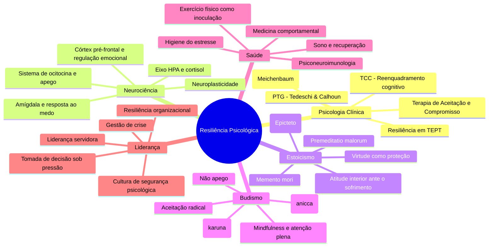

# Resiliência Psicológica

## 1. Introdução

### 1.1 O que é resiliência?

Resiliência psicológica é a capacidade humana de se adaptar, recuperar e crescer diante de adversidades, traumas, ameaças ou fontes significativas de estresse. Ao contrário do que o senso comum muitas vezes sugere, resiliência **não é ausência de dor** — não é "ser forte" ou "não sentir". Pessoas resilientes sentem medo, tristeza, raiva e angústia como qualquer outra. A diferença está na capacidade de processar essas emoções e seguir adiante com flexibilidade, aprendizado e, frequentemente, transformação.

A palavra vem do latim *resilire* — "saltar de volta" ou "recuar". Na física, resiliência é a propriedade de um corpo de retornar à sua forma original após sofrer deformação. Na psicologia, porém, o conceito é mais complexo: não se trata apenas de "voltar ao normal", mas de usar a adversidade como catalisador de desenvolvimento.

### 1.2 Resiliência ≠ Resistência ≠ Antifragilidade

Nassim Nicholas Taleb, em *Antifrágil* (2012), distingue três categorias fundamentais:

- **Resistente (robusto)**: resiste ao choque sem se alterar. Não quebra, mas também não melhora. Um copo de vidro temperado é resistente.
- **Resiliente**: absorve o choque e retorna ao estado original. Como uma fibra elástica que se estica e volta.
- **Antifrágil**: não apenas resiste ao choque, mas **se beneficia dele**. O sistema antifrágil fica mais forte quando exposto ao estresse, ao caos e à volatilidade. O sistema imunológico é antifrágil — ele precisa de exposição a patógenos para se fortalecer.

A resiliência psicológica tradicionalmente estudada pela psicologia positiva e pela psicologia do desenvolvimento situa-se entre o robusto e o antifrágil. Já o **crescimento pós-traumático** (Tedeschi & Calhoun) se aproxima mais da antifragilidade: a pessoa não apenas se recupera, mas emerge da adversidade com recursos psicológicos que não tinha antes.

### 1.3 Mitos sobre resiliência

- "Pessoas resilientes nunca sofrem" — falso. Elas sofrem, mas processam o sofrimento de forma adaptativa.
- "Resiliência é um traço inato" — falso. É um conjunto de habilidades que pode ser desenvolvido.
- "Ser resiliente é suportar tudo calado" — falso. Buscar apoio é um dos pilares da resiliência.
- "Crise sempre fortalece" — falso. Crise pode traumatizar. O crescimento depende de fatores de proteção e processamento ativo.

### 1.4 Prevalência e relevância

Estima-se que cerca de 50% a 60% das pessoas expostas a eventos potencialmente traumáticos desenvolvem respostas resilientes sem desenvolver transtorno de estresse pós-traumático (Bonanno, 2004). Isso não significa que não sofram — significa que seus sistemas de adaptação são suficientemente robustos para processar a experiência sem colapso.

---

## 2. Fatores da Resiliência

### 2.1 Otimismo Realista (Seligman — Otimismo Aprendido)

Martin Seligman, pai da psicologia positiva, demonstrou que otimismo pode ser aprendido. O otimismo realista não é a crença ingênua de que tudo vai dar certo, mas um **estilo explicativo** específico:

- **Interno vs externo**: otimistas veem falhas como causadas por fatores externos e temporários; pessimistas veem como culpa própria permanente.
- **Estável vs instável**: otimistas veem as causas de eventos ruins como temporárias ("hoje foi um dia difícil"); pessimistas as veem como permanentes ("minha vida é difícil").
- **Global vs específico**: otimistas circuncrevem o problema a uma área da vida; pessimistas generalizam.

Seligman desenvolveu o programa **ABCDE** (Adversidade → Crença → Consequência → Disputa → Energização) para reestruturar crenças pessimistas.

O otimismo realista correlaciona-se fortemente com resiliência porque:
1. Aumenta a motivação para enfrentar problemas
2. Reduz a sensação de desamparo
2. Favorece a busca ativa de soluções
4. Protege contra depressão em situações adversas

### 2.2 Locus de Controle Interno

Desenvolvido por Julian Rotter na década de 1950, o **locus de controle** refere-se à percepção do indivíduo sobre quem controla os eventos de sua vida:

- **Locus interno**: a pessoa acredita que suas ações, esforços e escolhas influenciam os resultados.
- **Locus externo**: a pessoa acredita que os resultados são determinados por sorte, destino ou forças externas incontroláveis.

Pessoas com locus de controle interno tendem a ser mais resilientes porque:
1. Buscam ativamente soluções em vez de esperar que o problema se resolva
2. Sentem-se agentes de sua própria vida (autonomia)
3. Atribuem fracassos a esforço insuficiente (variável controlável) e não a falta de capacidade
4. Apresentam menor probabilidade de desenvolver desamparo aprendido

Um estudo clássico de Lefcourt (1976) mostrou que indivíduos com locus interno lidam melhor com estressores crônicos e agudos, com níveis mais baixos de cortisol em situações desafiadoras.

### 2.3 Autoeficácia (Bandura)

Albert Bandura definiu autoeficácia como "a crença na própria capacidade de organizar e executar os cursos de ação necessários para lidar com situações futuras". A autoeficácia é situacional — uma pessoa pode ter alta autoeficácia para falar em público e baixa para aprender matemática.

As quatro fontes de autoeficácia:
1. **Experiências diretas de domínio**: sucessos passados fortalecem; fracassos repetidos enfraquecem.
2. **Experiência vicária**: observar pessoas semelhantes tendo sucesso aumenta a crença.
3. **Persuasão verbal**: encorajamento de pessoas significativas.
4. **Estados fisiológicos**: ansiedade alta é interpretada como incompetência; excitação controlada como capacidade.

A autoeficácia é preditora robusta de resiliência porque:
1. Pessoas com alta autoeficácia encaram desafios como oportunidades, não ameaças
2. Persistem mais diante de obstáculos
3. Recuperam-se mais rápido de reveses
4. Escolhem metas mais desafiadoras

### 2.4 Apoio Social (O Fator Mais Forte)

Se há um consenso na literatura sobre resiliência, é este: **o apoio social é o fator de proteção mais poderoso**. Ann Masten (2001), em sua pesquisa seminal com crianças em situação de risco, concluiu que o principal preditor de resiliência é a presença de pelo menos um adulto cuidador estável e afetivo.

O apoio social opera em três dimensões:
1. **Apoio emocional**: escuta, validação, afeto, encorajamento.
2. **Apoio instrumental**: ajuda prática, recursos materiais, informação.
3. **Apoio informacional**: orientação, conselhos, modelos de enfrentamento.

Neurobiologicamente, o apoio social regula o eixo HPA (hipotálamo-pituitária-adrenal), reduzindo a secreção de cortisol e atenuando a resposta de estresse. A presença de uma figura de apego seguro ativa a via da ocitocina, que contrapõe a resposta de luta-ou-fuga.

Cohen e Wills (1985) propuseram o **modelo de tamponamento**: o apoio social "amortece" o impacto do estresse, agindo como um colchão entre o evento adverso e a resposta psicológica.

### 2.5 Regulação Emocional

A regulação emocional é a capacidade de modular a intensidade, duração e expressão das emoções. Não se trata de suprimir emoções, mas de gerenciá-las de forma adaptativa.

Gross (1998) propõe um modelo processual com cinco famílias de estratégias:
1. **Seleção da situação**: escolher ambientes que gerem emoções desejadas.
2. **Modificação da situação**: alterar ativamente o ambiente.
3. **Redirecionamento atencional**: desviar o foco de estímulos ameaçadores.
4. **Mudança cognitiva**: reinterpretar o significado da situação (reavaliação).
5. **Modulação da resposta**: influenciar a expressão fisiológica ou comportamental.

A **reavaliação cognitiva** (reappraisal) é a estratégia mais adaptativa para resiliência. Consiste em reinterpretar o significado de um evento para alterar seu impacto emocional. Por exemplo, ver uma demissão não como fracasso pessoal mas como oportunidade de redirecionamento profissional.

A **supressão expressiva** (esconder emoções) é geralmente maladaptativa a longo prazo, associada a maior ativação simpática e pior memória social.

Pessoas resilientes não sentem menos emoções negativas — elas as regulam melhor, usando estratégias flexíveis conforme o contexto.

### 2.6 Flexibilidade Cognitiva

Flexibilidade cognitiva é a capacidade de:
1. Adaptar o pensamento a situações novas e inesperadas
2. Considerar múltiplas perspectivas sobre um problema
3. Alternar entre diferentes estratégias de enfrentamento
4. Abrir mão de crenças disfuncionais quando a evidência as contradiz

Bonanno (2021) propõe que a **flexibilidade de coping** é mais importante do que qualquer estratégia isolada. Pessoas resilientes têm um repertório variado de estratégias e sabem quando usar cada uma.

A rigidez cognitiva — insistir na mesma estratégia que falhou, ou aplicar a mesma lógica a situações fundamentalmente diferentes — é marca de baixa resiliência.

A flexibilidade cognitiva tem base neurobiológica no córtex pré-frontal dorsolateral e no córtex cingulado anterior, que regulam a alternância entre redes neurais. A prática de mindfulness e meditação aumenta a flexibilidade cognitiva ao fortalecer a atenção executiva.

---

## 3. Crescimento Pós-Traumático (PTG — Tedeschi & Calhoun)

### 3.1 O que é Crescimento Pós-Traumático

Richard Tedeschi e Lawrence Calhoun, pesquisadores da Universidade da Carolina do Norte, cunharam o termo *Post-Traumatic Growth* (PTG) no início dos anos 1990. PTG descreve a **experiência de mudança psicológica positiva que ocorre como resultado da luta com circunstâncias de vida altamente desafiadoras**.

É crucial entender: PTG **não** significa que o trauma é "bom" ou que deve ser buscado. O crescimento emerge do *processo de enfrentamento* da adversidade, não da adversidade em si. E PTG pode coexistir com sofrimento significativo — e frequentemente coexiste.

### 3.2 Os 5 Domínios do PTG

Tedeschi e Calhoun identificaram cinco áreas principais de crescimento:

1. **Apreciação da vida**: a pessoa passa a valorizar aspectos cotidianos que antes eram dados como garantidos. O simples fato de estar vivo ganha novo significado. Gratidão por coisas pequenas se intensifica.

2. **Novas possibilidades**: surgem caminhos que não existiam antes. A pessoa pode mudar de carreira, começar um projeto significativo, adotar novos hobbies ou redirecionar a vida para o que realmente importa.

3. **Força pessoal**: a pessoa desenvolve a crença "se sobrevivi a isso, posso sobreviver a qualquer coisa". Há uma sensação de maior robustez interior, mesmo que acompanhada de vulnerabilidade.

4. **Relacionamentos mais profundos**: conexões se intensificam. A pessoa pode se tornar mais compassiva, buscar relacionamentos mais autênticos e abandonar relações superficiais ou tóxicas. A intimidade emocional se aprofunda.

5. **Mudança espiritual/existencial**: a pessoa pode desenvolver uma fé mais profunda, ou questionar crenças anteriores e construir um novo sistema de sentido. Inclui também o desenvolvimento existencial — maior clareza sobre propósito e valores.

### 3.3 Diferença entre PTG e Resiliência

Resiliência e PTG são conceitos relacionados mas distintos:

| Aspecto | Resiliência | PTG |
|---------|-------------|-----|
| Resultado | Retorno ao funcionamento prévio | Funcionamento superior ao prévio |
| Processo | Manutenção da estabilidade | Transformação |
| Metáfora | Elasticidade | Metamorfose |
| Sofrimento | Moderado a alto | Alto a severo |
| Mudança | Pouca ou nenhuma | Mudança profunda em crenças e valores |
| Prevalência | 50-60% (Bonanno) | 30-70% (varia conforme trauma) |

Uma pessoa pode ser resiliente sem experimentar PTG (volta ao normal sem transformação significativa). E uma pessoa pode experienciar PTG enquanto ainda sofre intensamente — os dois não são mutuamente exclusivos.

### 3.4 O Processo de Crescimento: Da Ruptura à Reconstrução

Tedeschi e Calhoun descrevem um modelo processual do PTG:

1. **Evento sísmico**: o trauma abala as crenças fundamentais da pessoa (o mundo é benevolente, previsível, justo; eu sou invulnerável).
2. **Ruminação automática**: pensamentos intrusivos, repetitivos, involuntários. A mente tenta "digerir" o incompreensível.
3. **Ruminação deliberativa**: a pessoa começa ativamente a refletir sobre o significado do evento. Questiona crenças, busca novos significados.
4. **Desconstrução de metas e narrativas**: metas antigas perdem sentido. A identidade precisa ser renegociada.
5. **Crescimento**: emerge nova narrativa, novas crenças, nova identidade. O trauma é integrado à história de vida.
6. **Sabedoria**: a longo prazo, a pessoa desenvolve uma compreensão mais matizada da vida.

O apoio social é essencial nesse processo — especialmente a presença de pessoas que permitam narrar e renarrar a experiência sem julgamento.

### 3.5 PTG na prática clínica

Intervenções que favorecem PTG:
- **Narrativa terapêutica**: escrever sobre a experiência traumática com foco em significado e aprendizado.
- **Psicoeducação**: explicar que crescimento e sofrimento podem coexistir reduz a angústia.
- **Gratidão**: exercícios sistemáticos de gratidão amplificam a apreciação da vida.
- **Redescoberta de forças**: identificar pontos fortes usados durante a crise.
- **Grupos de apoio**: testemunhar a superação alheia inspira e normaliza.

---

## 4. Mecanismos de Enfrentamento (Coping)

### 4.1 Coping Focado no Problema vs. Focado na Emoção

Lazarus e Folkman (1984) definiram coping como "esforços cognitivos e comportamentais para gerenciar demandas internas ou externas avaliadas como sobrecarregando os recursos pessoais".

Duas grandes categorias:

**Coping focado no problema**: a pessoa age diretamente sobre a fonte do estresse.
- Exemplos: buscar informação, planejar, resolver problema, negociar, estabelecer metas.
- Indicado para situações **controláveis** (estressores sobre os quais a pessoa tem agência).
- Correlacionado com menor depressão e maior satisfação de vida a longo prazo.

**Coping focado na emoção**: a pessoa regula a resposta emocional ao estresse.
- Exemplos: distração, reavaliação, meditação, busca de apoio emocional, aceitação.
- Indicado para situações **incontroláveis** (doença terminal, luto, desastre natural).
- Pode ser adaptativo (reavaliação, aceitação) ou maladaptativo (supressão, evitação).

Pessoas resilientes são capazes de discernir quando cada tipo é apropriado e alternar entre eles — eis a flexibilidade de coping.

### 4.2 Coping Proativo, Reativo e Preventivo

- **Coping reativo**: resposta a um estressor já presente. É o coping "clássico" — lidar com o que já aconteceu.
- **Coping preventivo**: preparação para estressores futuros incertos. Inclui poupança financeira, construção de rede de apoio, desenvolvimento de habilidades.
- **Coping proativo**: esforços para construir recursos e capacidades **antes** que qualquer crise ocorra. É um investimento no "capital psicológico": autoeficácia, otimismo, esperança, resiliência.

Schwarzer e Taubert (2002) destacam que o coping proativo é a forma mais sofisticada de enfrentamento, pois não espera a crise — constrói um reservatório de recursos que amortece futuras adversidades.

### 4.3 Estratégias Adaptativas vs. Maladaptativas

| Adaptativas | Maladaptativas |
|-------------|----------------|
| Reavaliação cognitiva | Supressão emocional crônica |
| Busca de apoio | Isolamento social |
| Resolução ativa de problemas | Evitação / negação |
| Aceitação | Ruminação |
| Humor | Catastrofização |
| Exercício físico | Uso de substâncias |
| Mindfulness | Comportamentos autodestrutivos |
| Planejamento | Desamparo aprendido |

A mesma estratégia pode ser adaptativa em um contexto e maladaptativa em outro. A evitação, por exemplo, é funcional nas horas imediatamente após um trauma (período de "entorpecimento emocional" protetor), mas disfuncional se mantida por meses.

### 4.4 O Papel do Sentido (Frankl)

Viktor Frankl, psiquiatra austríaco sobrevivente de quatro campos de concentração nazistas, propôs que a **busca de sentido** é a força motivacional primária do ser humano. Em *Em Busca de Sentido* (1946), escreveu:

> "Quem tem um *porquê* para viver pode suportar quase qualquer *como*."

Frankl observou que prisioneiros que conseguiam encontrar significado em seu sofrimento — seja através de um propósito futuro, do amor por alguém, ou da dignidade em manter uma atitude interior — tinham maior probabilidade de sobreviver.

A **logoterapia** de Frankl baseia-se em três vias de sentido:
1. **Sentido no que fazemos**: trabalho, criação, realização.
2. **Sentido no que vivemos**: amor, experiência, beleza, arte.
3. **Sentido no que não podemos mudar**: a atitude diante do sofrimento inevitável.

Estudos contemporâneos confirmam: pessoas com alto senso de propósito (medido por escalas como *Purpose in Life Test*) apresentam maior resiliência, menor reatividade cardiovascular ao estresse e menor risco de mortalidade por todas as causas.

O coping baseado em sentido envolve perguntar não apenas "como resolver isso?" mas **"o que isso significa? O que posso aprender? Como isso me conecta ao que importa?"**

---

## 5. Inoculação ao Estresse

### 5.1 Estresse como Imunização (Meichenbaum)

Donald Meichenbaum desenvolveu o **Treinamento de Inoculação ao Estresse** (Stress Inoculation Training — SIT) na década de 1970. A metáfora é a vacinação: assim como uma vacina expõe o organismo a uma versão atenuada do patógeno para gerar imunidade, a inoculação ao estresse expõe a pessoa a níveis controlados de estresse para desenvolver resiliência.

O SIT tem três fases:
1. **Fase conceitual**: psicoeducação sobre estresse, identificação de padrões disfuncionais de pensamento.
2. **Fase de aquisição de habilidades**: treino de relaxamento, reestruturação cognitiva, resolução de problemas, comunicação assertiva.
3. **Fase de aplicação**: exposição gradual a situações estressantes em ambiente controlado, com prática das habilidades aprendidas.

A inoculação ao estresse é eficaz para transtornos de ansiedade, estresse ocupacional, desempenho esportivo e preparação para cirurgias.

### 5.2 Micro-falhas Deliberadas (Antifragilidade na Prática)

Se a antifragilidade é a capacidade de se beneficiar da volatilidade, como aplicá-la no desenvolvimento psicológico?

Algumas abordagens práticas:

- **Exposição controlada ao desconforto**: banhos frios, jejum intermitente, exercício físico intenso. Estes estressores controlados treinam o sistema nervoso a responder com equilíbrio.
- **Micro-falhas programadas**: colocar-se em situações com alta probabilidade de erro pequeno (aprender um instrumento novo, falar em público, iniciar uma conversa em outro idioma). O objetivo não é acertar, mas desenvolver tolerância ao erro.
- **Desafios de crescimento**: metas que estão no limite da capacidade atual (stretch goals). Atingi-las expande o senso de autoeficácia; não atingi-las, se processado corretamente, desenvolve tolerância à frustração.

Stoic practice (premeditatio malorum): visualizar adversidades futuras não para gerar ansiedade, mas para ensaiar mentalmente o enfrentamento. Sêneca escrevia: "O que é inesperado fere mais. A familiaridade com a adversidade reduz seu poder."

### 5.3 Exercícios de Exposição Gradual

A exposição gradual é o princípio central da terapia cognitivo-comportamental para ansiedade. Aplicada ao desenvolvimento de resiliência:

1. **Hierarquia de medos**: liste situações que geram desconforto, da menos à mais ameaçadora.
2. **Exposição planejada**: comece pelo item mais fácil e progrida sistematicamente.
3. **Permanência na situação**: fique na situação até que a ansiedade se reduza naturalmente (habituação), sem fuga ou esquiva.
4. **Reflexão pós-exposição**: o que aprendi? O que temi aconteceu? Como lidei?

Exemplos:
- Ansiedade social: iniciar 3 conversas curtas por dia com desconhecidos.
- Medo de fracasso: candidatar-se a uma vaga para a qual não atende a todos os requisitos.
- Medo de rejeição: pedir um feedback honesto a um colega.
- Desconforto com incerteza: planejar um fim de semana sem roteiro.

---

## 6. Exercícios Práticos

### 6.1 Reenquadramento Cognitivo (CBT)

Baseado na terapia cognitivo-comportamental de Aaron Beck e na reestruturação racional de Albert Ellis.

**Passo a passo**:

1. Identifique um pensamento automático negativo (PAN) sobre uma situação adversa.
2. Escreva: "O que estou dizendo a mim mesmo?"
3. Identifique distorções cognitivas (catastrofização, leitura mental, personalização, preto-e-branco).
4. Desafie o pensamento com evidências:
   - "Quais evidências apoiam esse pensamento?"
   - "Quais evidências contradizem?"
   - "O que eu diria a um amigo que pensasse isso?"
5. Construa um pensamento alternativo equilibrado.

**Exemplo**:
- PAN: "Fui demitido porque sou incompetente. Minha carreira acabou."
- Distorções: catastrofização, rotulação, supergeneralização.
- Reenquadramento: "Fui demitido por razões que envolvem múltiplos fatores, alguns organizacionais. Tenho um histórico de entregas bem-sucedidas. Esta é uma oportunidade de reavaliar minha trajetória e buscar algo mais alinhado aos meus valores."

### 6.2 Diário de Resiliência

Um diário estruturado com três colunas:

| Data | Adversidade | Minha Resposta | Aprendizado |
|------|-------------|----------------|-------------|
| 18/05 | Reunião difícil com chefe | Senti ansiedade, respirei fundo, pedi esclarecimentos | Posso gerenciar ansiedade no momento sem fugir |
| ... | ... | ... | ... |

**Instruções**:
- Escreva diariamente ou semanalmente.
- Seja específico sobre a adversidade (o que aconteceu, onde, quando).
- Descreva sua resposta emocional, comportamental e cognitiva.
- Extraia explicitamente o aprendizado.
- A cada mês, releia as entradas para identificar padrões.

**Variação**: adicione uma quarta coluna — "O que faria diferente?" — para planejar respostas futuras.

### 6.3 Mapa de Recursos de Apoio Social

Crie um diagrama visual ou lista estruturada:

**Categorias**:
1. **Família**: quem posso chamar em uma crise? Quem me entende sem julgar?
2. **Amigos**: quais amigos são bons para desabafar? Quais são bons para distrair?
3. **Profissionais**: terapeuta, médico, coach, mentor.
4. **Comunidade**: grupo religioso, clube, associação de bairro, grupo de apoio.
5. **Recursos digitais**: aplicativos de meditação, fóruns, linhas de crise.

**Para cada pessoa/recurso, anote**:
- Nome
- Tipo de apoio que oferece (emocional, instrumental, informacional)
- Disponibilidade (horário, frequência)
- Como ativar esse recurso (telefone, mensagem, presencial)

**Exercício complementar**: identifique lacunas — áreas onde o apoio é insuficiente — e planeje como expandir a rede.

### 6.4 Exercício das 3 Portas (Estoico)

Atribuído a Epicteto e adaptado por vários autores estoicos:

**Quando enfrentar uma dificuldade**:

1. **Porta 1 — O que está sob meu controle?**
   - Minhas reações, minhas escolhas, meus valores, minha atenção, meu esforço.
   - Liste tudo que depende exclusivamente de você.

2. **Porta 2 — O que não está sob meu controle?**
   - O que os outros fazem/pensam/dizem, o clima, a economia, o passado, resultados externos.
   - Liste tudo que não depende de você.

3. **Porta 3 — O que posso aprender com isso?**
   - Que virtude posso exercitar? (coragem, temperança, justiça, sabedoria)
   - O que esta situação me ensina sobre mim mesmo?
   - Como posso sair melhor do que entrei?

**Princípio estoico central**: "Não são as coisas em si que nos perturbam, mas os julgamentos que fazemos sobre elas." (Epicteto, *Encheiridion*)

### 6.5 Construção de Narrativa de Superação

A narrativa é uma ferramenta central de construção de sentido e identidade.

**Estrutura da narrativa de superação**:

1. **Contexto**: descreva a situação adversa de forma objetiva. "Em 2024, fui diagnosticado com..."
2. **Ruptura**: descreva o impacto inicial — emocional, físico, relacional. "Senti medo, desorientação..."
3. **Luta**: descreva o processo de enfrentamento. O que você fez? Que recursos usou? Quem te apoiou? O que pensou? "Busquei apoio, li sobre o assunto, mudei hábitos..."
4. **Aprendizado**: o que você descobriu sobre si mesmo? Que forças não sabia que tinha? Como você mudou sua perspectiva? "Descobri que sou mais resistente do que imaginava..."
5. **Nova identidade**: quem você é agora por causa dessa experiência? "Hoje vivo com mais presença e menos medo."

**Instruções**:
- Escreva em primeira pessoa.
- Seja honesto sobre o sofrimento (não pule a fase de luta).
- Leia em voz alta para si mesmo ou compartilhe com alguém de confiança.
- A cada 6 meses, revise e reescreva — a narrativa evolui com o crescimento.

### 6.6 Exercício de Gratidão Após Adversidade

Pesquisas de Robert Emmons mostram que a gratidão é um dos preditores mais fortes de bem-estar.

**Após superar uma dificuldade**:
1. Liste 3 coisas sobre a situação pelas quais você pode ser grato.
   - Não precisa ser grato *pela* adversidade, mas *apesar* dela ou *através* dela.
2. Liste 3 pessoas que ajudaram, mesmo que indiretamente.
3. Escreva uma carta curta para uma dessas pessoas (não precisa enviar).

### 6.7 Visualização de Melhor Eu Possível

Técnica desenvolvida por Laura King (2001):

1. Imagine seu "melhor eu possível" — a versão mais realizada de você mesmo em 5-10 anos.
2. Escreva sobre como você superou as adversidades que surgiram nesse caminho.
3. Descreva as qualidades que esse "eu futuro" desenvolveu.
4. Reflita: quais dessas qualidades posso cultivar hoje?

Esta técnica aumenta otimismo, esperança e autoeficácia, e é particularmente eficaz após perdas.

---

## 7. Cross-mapping Mermaid

### 7.1 Mapeamento de Sobreposições

Algumas convergências entre tradições:

| Conceito | Psicologia | Estoicismo | Budismo |
|----------|------------|------------|---------|
| Reavaliação cognitiva | TCC (Beck) | Julgamento sobre as coisas | Não apego a pensamentos |
| Aceitação | ACT (Hayes) | Amor fati | Aceitação radical |
| Mindfulness | Kabat-Zinn | Atenção ao presente | Vipassana |
| Sentido | Frankl (logoterapia) | Propósito virtuoso | Caminho óctuplo |
| Impermanência | Crescimento pós-traumático | *Memento mori* | *Anicca* |

---

## 8. Referências

- Bandura, A. (1997). *Self-efficacy: The exercise of control*. Freeman.
- Bonanno, G. A. (2004). Loss, trauma, and human resilience: Have we underestimated the human capacity to thrive after extremely aversive events? *American Psychologist*, 59(1), 20-28.
- Bonanno, G. A. (2021). *The end of trauma: How the new science of resilience is changing how we think about PTSD*. Basic Books.
- Cohen, S., & Wills, T. A. (1985). Stress, social support, and the buffering hypothesis. *Psychological Bulletin*, 98(2), 310-357.
- Emmons, R. A. (2007). *Thanks! How the new science of gratitude can make you happier*. Houghton Mifflin.
- Epicteto. (c. 125 d.C.). *Encheiridion* (Manual).
- Folkman, S., & Lazarus, R. S. (1984). *Stress, appraisal, and coping*. Springer.
- Frankl, V. E. (1946). *Em busca de sentido: Um psicólogo no campo de concentração*. Vozes.
- Gross, J. J. (1998). The emerging field of emotion regulation: An integrative review. *Review of General Psychology*, 2(3), 271-299.
- King, L. A. (2001). The health benefits of writing about life goals. *Personality and Social Psychology Bulletin*, 27(7), 798-807.
- Lazarus, R. S., & Folkman, S. (1984). *Stress, appraisal, and coping*. Springer.
- Lefcourt, H. M. (1976). *Locus of control: Current trends in theory and research*. Erlbaum.
- Masten, A. S. (2001). Ordinary magic: Resilience processes in development. *American Psychologist*, 56(3), 227-238.
- Masten, A. S. (2014). *Ordinary magic: Resilience in development*. Guilford Press.
- Meichenbaum, D. (1985). *Stress inoculation training*. Pergamon Press.
- Rotter, J. B. (1966). Generalized expectancies for internal versus external control of reinforcement. *Psychological Monographs*, 80(1), 1-28.
- Schwarzer, R., & Taubert, S. (2002). Tenacious goal pursuits and striving toward personal growth: Proactive coping. In E. Frydenberg (Ed.), *Beyond coping: Meeting goals, visions, and challenges* (pp. 19-35). Oxford University Press.
- Seligman, M. E. P. (1990). *Learned optimism: How to change your mind and your life*. Knopf.
- Sêneca, L. A. (c. 64 d.C.). *Cartas a Lucílio*.
- Taleb, N. N. (2012). *Antifrágil: Coisas que se beneficiam com o caos*. Objetiva.
- Tedeschi, R. G., & Calhoun, L. G. (1996). The Posttraumatic Growth Inventory: Measuring the positive legacy of trauma. *Journal of Traumatic Stress*, 9(3), 455-471.
- Tedeschi, R. G., & Calhoun, L. G. (2004). *Posttraumatic growth: Conceptual foundations and empirical evidence*. Lawrence Erlbaum.
- Tedeschi, R. G., Shakespeare-Finch, J., Taku, K., & Calhoun, L. G. (2018). *Posttraumatic growth: Theory, research, and applications*. Routledge.
