# Tomada de Decisão

## 1. Introdução

### 1.1 Por que decidir é difícil?

Decidir é o ato mais frequente e mais custoso da vida consciente. A cada momento somos bombardeados por microdecisões — o que comer, quando responder um e-mail, qual caminho tomar — e macrodecisões — que carreira seguir, onde morar, com quem casar, se devo iniciar um negócio. O paradoxo central é que **quanto mais opções temos, mais difícil é escolher** e **menos satisfeitos ficamos com a escolha feita**.

Barry Schwartz, em *O Paradoxo da Escolha* (2004), demonstrou que a abundância de alternativas gera paralisia e arrependimento. Num famoso experimento, consumidores diante de 24 variedades de geleia tinham menos probabilidade de comprar do que aqueles diante de apenas 6 variedades. A sobrecarga de escolha (*choice overload*) leva à:

- **Paralisia decisória**: adiamos ou evitamos decidir.
- **Ansiedade**: medo de fazer a escolha errada.
- **Arrependimento antecipado**: imaginamos o custo de oportunidade das alternativas descartadas.
- **Queda na satisfação**: mesmo após escolher, ruminamos sobre o que deixamos para trás.

Schwartz distingue dois perfis psicológicos: os *maximizadores* (que buscam a melhor opção possível, exaustivamente) e os *satisfiers* (que buscam uma opção "boa o suficiente"). Maximizadores tendem a ser menos felizes, mais deprimidos e mais propensos ao arrependimento.

### 1.2 Sistemas 1 e 2 de Kahneman

Daniel Kahneman, em *Rápido e Devagar: Duas Formas de Pensar* (2011), propõe que a mente humana opera em dois sistemas:

| Sistema | Característica | Velocidade | Esforço | Exemplo |
|---------|----------------|------------|---------|---------|
| **Sistema 1** | Automático, intuitivo, emocional | Instantâneo | Mínimo | Reconhecer um rosto, dirigir em estrada vazia |
| **Sistema 2** | Analítico, deliberado, lógico | Lento | Alto | Resolver 17×24, escolher um plano de saúde |

**Sistema 1** é nosso piloto automático. Ele funciona com heurísticas — atalhos mentais que economizam energia mas introduzem vieses sistemáticos. É excelente para situações familiares e rotineiras, mas falha catastróficamente diante de problemas novos, complexos ou que envolvem probabilidades.

**Sistema 2** é nosso processador central. Ele monitora, corrige e, idealmente, deveria supervisionar o Sistema 1. Porém, o Sistema 2 é **preguiçoso** — ele entra em ação apenas quando necessário, e mesmo assim com esforço que não sustentamos por longos períodos (fenômeno da *depleção do ego*).

O grande desafio da tomada de decisão é **saber quando confiar no Sistema 1** (decisões rotineiras, especialistas em domínios previsíveis) e **quando ativar o Sistema 2** (decisões de alto risco, ambíguas, sem feedback rápido).

---

## 2. Modelos Racionais de Decisão

### 2.1 Modelo Clássico (Racional)

O modelo clássico pressupõe um decisor perfeitamente racional que segue seis etapas lineares:

1. **Definir o problema**: qual é a pergunta central? Exemplo: "Devo trocar de emprego?"
2. **Identificar critérios**: salário, localização, cultura, crescimento, benefícios.
3. **Atribuir pesos aos critérios**: salário = 0,30; cultura = 0,25; crescimento = 0,25; localização = 0,10; benefícios = 0,10.
4. **Gerar alternativas**: empresa A, empresa B, ficar no emprego atual.
5. **Avaliar alternativas contra critérios**: pontuar cada opção em cada critério (0–10).
6. **Escolher a alternativa de maior pontuação ponderada**.

Na prática, o modelo clássico falha porque:
- Nossa racionalidade é **limitada** (*bounded rationality*, Herbert Simon): não temos acesso a todas as alternativas nem conseguimos processar todas as informações.
- Os critérios mudam durante o processo.
- Pesos são arbitrários e sensíveis a ancoragem.
- Ignora emoções, intuição e contextos sociais.

### 2.2 Árvores de Decisão

As árvores de decisão são diagramas que mapeiam sequencialmente:

- **Nós de decisão** (quadrados): pontos onde escolhemos entre alternativas.
- **Nós de chance** (círculos): eventos incertos com probabilidades conhecidas.
- **Ramos**: cada alternativa ou resultado possível.
- **Folhas**: desfechos com valores atribuídos.

```
                    ┌─────────────────────┐
                    │   Investir R$ 10k   │
                    │   (Nó de decisão)   │
                    └──────────┬──────────┘
                               │
               ┌───────────────┴───────────────┐
               ▼                               ▼
     ┌─────────────────┐            ┌─────────────────┐
     │  Mercado sobe   │            │  Mercado cai    │
     │  Prob: 60%      │            │  Prob: 40%      │
     │  Retorno: +25%  │            │  Retorno: -15%  │
     │  Valor: R$ 12,5k│            │  Valor: R$ 8,5k │
     └─────────────────┘            └─────────────────┘
               │                               │
               └───────────────┬───────────────┘
                               ▼
                    ┌─────────────────────┐
                    │  Valor esperado =   │
                    │  (0,6 × 12,5) +     │
                    │  (0,4 × 8,5)        │
                    │  = R$ 10,9k         │
                    └─────────────────────┘
```

A árvore de decisão força explicitar: alternativas, incertezas, probabilidades e valores. É uma das ferramentas mais poderosas contra o pensamento vago.

### 2.3 Teoria da Utilidade Esperada

Proposta por Von Neumann e Morgenstern (1944), a teoria da utilidade esperada afirma que um decisor racional escolhe a alternativa que maximiza o valor esperado da utilidade — não do dinheiro.

$$U(E) = \sum (p_i \times u(x_i))$$

Onde $p_i$ é a probabilidade do resultado $i$ e $u(x_i)$ é a utilidade subjetiva desse resultado.

A função utilidade é **côncava** para a maioria das pessoas: ganhar R$ 1000 traz menos utilidade do que perder R$ 1000 traz desutilidade (aversão à perda). Isso explica por que evitamos riscos mesmo quando o valor esperado é positivo.

Exemplo clássico: você prefere R$ 500 garantidos ou 50% de chance de ganhar R$ 1000? A maioria escolhe o valor garantido, mesmo que os dois tenham o mesmo valor esperado. Isso é **aversão ao risco** no domínio dos ganhos.

No domínio das perdas, inverte-se: preferimos arriscar para evitar uma perda certa, mesmo com valor esperado negativo (**busca de risco**).

### 2.4 Análise de Custo-Benefício

A análise de custo-benefício (ACB) é a ferramenta mais difundida nas organizações. Seus passos:

1. Listar todos os custos (diretos, indiretos, de oportunidade).
2. Listar todos os benefícios (tangíveis e intangíveis).
3. Atribuir valores monetários sempre que possível.
4. Calcular VPL (Valor Presente Líquido) para custos/benefícios futuros.
5. Calcular ROI (Return on Investment): (Benefício − Custo) / Custo.
6. Considerar análise de sensibilidade: "e se as premissas mudarem?"

**Limitação crítica**: a ACB é tão boa quanto seus inputs. Se ignoramos externalidades, custos intangíveis (saúde mental, reputação) ou benefícios de longo prazo, a conta fica perigosamente incompleta.

---

## 3. Vieses Cognitivos que Afetam Decisões

Vieses são desvios sistemáticos da racionalidade. Diferentemente de erros aleatórios, eles são **previsíveis** e **direcionais**. Conhecê-los é o primeiro passo para mitigá-los.

### 3.1 Viés de Confirmação (*Confirmation Bias*)

Buscamos, interpretamos e lembramos informações que confirmam nossas crenças preexistentes, ignorando evidências contrárias.

- **Decisão afetada**: ao avaliar um candidato a emprego, notamos os pontos fortes que confirmam nossa primeira impressão e minimizamos as falhas.
- **Mitigação**: buscar ativamente evidências contrárias (*considerar o oposto*); formar hipóteses e tentar refutá-las (falseacionismo popperiano).

### 3.2 Ancoragem (*Anchoring*)

Nossa estimativa numérica é desproporcionalmente influenciada por um valor de referência (âncora), mesmo que arbitrário.

- **Decisão afetada**: numa negociação salarial, quem fala primeiro ancora o valor. Se o RH oferece R$ 5.000, você negocia em torno disso. Se oferecesse R$ 4.000, a negociação seria diferente.
- **Mitigação**: conscientizar-se da âncora; gerar sua própria âncora antes de ouvir a do outro; buscar âncoras múltiplas.

### 3.3 Aversão à Perda (*Loss Aversion*)

Perder dói cerca de **duas vezes mais** do que ganhar satisfaz (Kahneman & Tversky, 1979). Perder R$ 100 exige ganhar cerca de R$ 200 para compensar psicologicamente.

- **Decisão afetada**: investidores vendem ações que sobem cedo demais (realizam lucro) e seguram ações que caem (evitam realizar perda) — o *disposition effect*.
- **Decisão afetada**: empresas evitam lançar produtos inovadores porque o medo de perder o mercado existente supera a atração do novo mercado.
- **Mitigação**: reformular o problema em termos de custo de oportunidade; usar a "regra dos 10/10/10"; perguntar "o que eu perderia se não agisse?"

### 3.4 Viés de Disponibilidade (*Availability Heuristic*)

Julgamos a probabilidade de um evento pela facilidade com que exemplos vêm à mente.

- **Decisão afetada**: após ver notícias de acidentes aéreos, superestimamos o risco de voar (evento vivido/sensacionalista) e subestimamos o risco de dirigir (evento banal).
- **Decisão afetada**: executivos superinvestem em projetos recentes de sucesso, ignorando a base estatística de fracassos.
- **Mitigação**: buscar dados estatísticos objetivos (taxa base); perguntar "quantos casos existem na população total?"

### 3.5 Excesso de Confiança (*Overconfidence Effect*)

Superestimamos nossa precisão, previsões e capacidades. 93% dos motoristas americanos se consideram acima da média.

- **Decisão afetada**: empreendedores iniciam negócios com alta confiança no sucesso, ignorando que 50% fecham em 5 anos.
- **Decisão afetada**: analistas financeiros preveem com "80% de confiança" — e acertam apenas 40% das vezes.
- **Mitigação**: calibrar previsões com feedback (estimar probabilidades e registrar acertos/erros); usar o método das "previsões de intervalo" (dar um range realista).

### 3.6 Sunk Cost Fallacy (Falácia dos Custos Irrecuperáveis)

Continuamos investindo em algo porque já investimos recursos (tempo, dinheiro, esforço), mesmo que o retorno futuro seja negativo.

- **Decisão afetada**: permanecer num relacionamento ruim "porque já são 5 anos juntos". Manter um projeto falido "porque já gastamos R$ 2 milhões".
- **Mitigação**: perguntar "se eu estivesse começando hoje, faria esta escolha?"; separar custo passado (irrecuperável) de custo futuro (relevante); accountability externa.

### 3.7 Viés do Status Quo

Preferimos manter a situação atual porque mudar envolve risco, esforço e incerteza. É uma combinação de aversão à perda, inércia e omissão.

- **Decisão afetada**: funcionários não alteram o plano de previdência mesmo quando uma opção melhor está disponível (basta não fazer nada).
- **Decisão afetada**: países mantêm políticas obsoletas porque "sempre foi assim".
- **Mitigação**: tratar o status quo como uma alternativa entre várias, não como linha de base; perguntar "se eu não estivesse nessa situação, pagaria para entrar nela?"

---

## 4. Frameworks Práticos de Decisão

### 4.1 Matriz de Eisenhower (Urgente vs Importante)

Stephen Covey popularizou esta matriz atribuída a Dwight Eisenhower. Ela classifica tarefas/ decisões em quatro quadrantes:

```
                    Urgente               Não Urgente
              ┌─────────────────┬─────────────────────┐
              │                 │                     │
   Importante │   QUADRANTE 1   │    QUADRANTE 2      │
              │   FAÇA AGORA    │    AGENDE            │
              │   Crises        │    Planejamento      │
              │   Prazos        │    Relacionamentos   │
              │   Problemas     │    Aprendizado       │
              │   urgentes      │    Prevenção         │
              ├─────────────────┼─────────────────────┤
              │                 │                     │
Não Importante │   QUADRANTE 3   │    QUADRANTE 4      │
              │   DELEGUE       │    ELIMINE           │
              │   Interrupções  │    Redes sociais     │
              │   Reuniões      │    Navegação         │
              │   triviais      │    fútil             │
              │   E-mails       │    TV               │
              └─────────────────┴─────────────────────┘
```

**Exemplo prático**: Você recebe um convite para uma reunião amanhã. Antes de aceitar, classifique: é urgente? é importante? Se não for nenhum dos dois, recuse. Se for importante mas não urgente (Q2), agende um horário dedicado. A maioria das pessoas vive no Q1 (fogo) e Q3 (interrupções) e negligencia o Q2 — onde está a verdadeira alavancagem.

### 4.2 OODA Loop (Observe, Orient, Decide, Act)

Desenvolvido pelo estrategista militar John Boyd, o OODA Loop é um ciclo de quatro etapas para decisões em ambientes dinâmicos e competitivos.

1. **Observe** (Observar): colete dados do ambiente. Evite filtros e julgamentos prematuros.
2. **Orient** (Orientar-se): analise os dados à luz de seus modelos mentais, experiências, cultura e conhecimentos. Esta é a etapa mais crítica — com a mesma observação, pessoas diferentes se orientam de forma diferente.
3. **Decide** (Decidir): escolha um curso de ação entre as hipóteses geradas.
4. **Act** (Agir): execute a decisão. A ação modifica o ambiente, gerando novas observações.

A chave do OODA é a **velocidade do ciclo**: quem completa o loop mais rapidamente — e com melhor orientação — ganha vantagem competitiva. Boyd aplicou isso a combates aéreos, mas o conceito vale para startups, concorrência de mercado e até discussões.

**Exemplo**: Uma startup percebe (Observe) que a taxa de retenção caiu. Analisa (Orient) que o onboarding é confuso. Decide criar um tutorial interativo. Age (Act) lançando o recurso. O ciclo recomeça: a retenção melhorou? Se não, nova observação.

### 4.3 Second-Order Thinking (Pensamento de Segunda Ordem)

Desenvolvido por Howard Marks, o second-order thinking pergunta: **"E depois?"**. Não basta pensar nas consequências imediatas de uma decisão; é preciso pensar nas consequências das consequências.

| Ordem | Primeira ordem | Segunda ordem |
|-------|----------------|---------------|
| Empresa corta custos | Lucro aumenta no trimestre | Qualidade cai, clientes migram, lucro despenca |
| Você estuda 1h extra por dia | Notas melhoram | Você fica exausto, performance cai depois de 2 semanas (se não houver descanso) |
| Governo congela preços | Inflação parece controlada | Desabastecimento, mercado negro, crise pior |
| Você posta algo polêmico | Ganha atenção imediata | Perde credibilidade, oportunidades futuras |

**Exemplo de carreira**: Um profissional recebe uma oferta com salário 40% maior em uma empresa de alto estresse, sem equilíbrio vida-trabalho.

- **Primeira ordem**: mais dinheiro, status, posso comprar o carro que quero.
- **Segunda ordem**: saúde deteriora, relacionamento com cônjugue sofre, tenho menos tempo para estudar e me atualizar. Em 2 anos, posso estar esgotado — e o salário maior não compensará o custo de recuperação.
- **Terceira ordem**: se eu ficar doente, posso perder o emprego. Aí fico sem o salário maior e sem saúde. O ganho de curto prazo vira perda de longo prazo.

Second-order thinking não é pessimismo — é **antifragilidade**: tomar decisões que geram benefícios assimétricos (ganho grande se der certo, perda pequena se der errado).

### 4.4 Pre-mortem (Antecipação do Fracasso)

Criado pelo psicólogo Gary Klein, o pre-mortem é um exercício de imaginação retrospectiva. Antes de iniciar um projeto, reúna a equipe e peça:

> **"Imaginem que estamos 12 meses no futuro e o projeto fracassou completamente. Escrevam a história do que deu errado."**

O pre-mortem quebra dois vieses:
- **Excesso de confiança**: a equipe normalmente só pensa no sucesso.
- **Viés de otimismo**: planos são sistematicamente otimistas.

**Exemplo prático**: Uma equipe de produto planeja lançar um novo app.

Pre-mortem:
1. O app não resolve um problema real (ninguém validou a dor).
2. O time de engenharia subestimou o esforço em 3x.
3. Marketing não foi envolvido cedo — lançamento sem audiência.
4. Concorrente lançou recurso similar 2 semanas antes.
5. O CEO mudou as prioridades no meio do caminho.

Para cada risco identificado, o time cria **planos de mitigação**:
1. Pesquisar com 50 usuários antes de codificar.
2. Dobrar as estimativas de tempo.
3. Iniciar campanha de marketing 2 meses antes do lançamento.
4. Monitorar concorrentes semanalmente.
5. Alinhar prioridades com o CEO por escrito antes de começar.

### 4.5 Inversion (Pensamento Inverso)

Em vez de perguntar "como ter sucesso?", pergunte "o que causa o fracasso?" e depois evite essas causas. É a abordagem *via negativa* — às vezes saber o que evitar é mais útil do que saber o que fazer.

**Exemplos de aplicação**:

| Objetivo | Pergunta direta | Pergunta inversa | Ação |
|----------|-----------------|------------------|------|
| Viver bem | O que me faz feliz? | O que me faz infeliz? | Evitar dívidas, relacionamentos tóxicos, trabalho excessivo |
| Investir bem | Qual ação vai subir? | O que faz um investidor perder dinheiro? | Evitar day trade, seguir manada, comprar sem pesquisar |
| Liderar bem | Como motivar a equipe? | O que desmotiva a equipe? | Evitar microgestão, falta de reconhecimento, inconsistência |
| Decidir bem | Qual é a melhor escolha? | Qual é a pior escolha que posso fazer hoje? | Não decida sob estresse extremo, sem dados, ou com conflito de interesses |

### 4.6 Occam's Razor & Hick's Law

**Occam's Razor (Navalha de Occam)**: entre duas explicações concorrentes, a mais simples — com menos suposições — é preferível. Em decisões, a alternativa com menos complicações e variáveis incertas tende a ser melhor.

> "A simplicidade é a máxima sofisticação." — Leonardo da Vinci

**Exemplo**: Você quer melhorar suas finanças. Pode criar um sistema complexo com 12 categorias de orçamento, 5 contas e planilhas semanais. Ou pode usar a regra 50/30/20 (50% necessidades, 30% desejos, 20% poupança). A mais simples tem mais chance de ser mantida.

**Hick's Law**: O tempo de decisão aumenta logaritmicamente com o número de opções. Mais opções = mais tempo e mais estresse. A solução prática:

- Limite suas opções a 3–5 alternativas sérias.
- Use critérios de eliminação rápida (triage).
- Se tiver mais de 5 opções, agrupe-as.

**Regra prática**: se você está há mais de 15 minutos decidindo algo trivial (o que comer, que filme ver), pare. Escolha qualquer opção. O custo de decidir superou o benefício da escolha ótima.

### 4.7 Regra 10-10-10

Criada por Suzy Welch, a regra 10-10-10 força a perspectiva temporal sobre qualquer decisão:

- **10 minutos**: como me sentirei sobre esta decisão daqui a 10 minutos?
- **10 meses**: como me sentirei daqui a 10 meses?
- **10 anos**: como me sentirei daqui a 10 anos?

**Exemplo**: Você está considerando terminar um relacionamento estável mas insatisfatório.

- 10 min: horrível. Tristeza, dúvida, solidão iminente.
- 10 meses: alívio. Você já processou o luto, está reconstruindo sua vida, conheceu novas pessoas.
- 10 anos: gratidão por ter tido coragem de não se acomodar. Ou arrependimento se não tentou antes.

A regra revela que a **dor aguda** de uma decisão difícil é quase sempre temporária, enquanto o **custo de não decidir** se acumula silenciosamente.

### 4.8 Decision Journal (Diário de Decisões)

Manter um registro sistemático de decisões é o antídoto mais eficaz contra o excesso de confiança e a memória seletiva.

**Estrutura de um decision journal**:

```
Data: 18/05/2026
Decisão: Contratar candidato X para vaga de analista de dados
Contexto: Setor crescendo, prazo apertado, 3 candidatos finais

Alternativas consideradas:
  1. Candidato X (interno, 2 anos de casa)
  2. Candidato Y (externo, 10 anos de experiência)
  3. Não contratar agora e usar serviço terceirizado

Critérios e pesos:
  - Fit cultural (0,30)
  - Habilidade técnica (0,30)
  - Velocidade de início (0,20)
  - Custo (0,20)

Previsão: X terá bom desempenho nos primeiros 6 meses (confiança: 70%)
Incertezas: Integração com time Y; retenção do candidato X

Vieses identificados:
  - Viés de afinidade (trabalhei com X antes)
  - Ancoragem no salário de X

Status futuro (para preenchimento): [  ] Sucesso  [  ] Fracasso  [  ] Misto
```

Benefícios comprovados do decision journal:
- **Melhora a calibração**: você vê quantas previsões de "80% de confiança" realmente se concretizam.
- **Reduz o hindsight bias**: depois que o resultado é conhecido, você tende a achar que "sabia o tempo todo". O diário mostra que você não sabia.
- **Identifica padrões**: talvez você sempre superestime prazos ou sempre contrate pessoas parecidas com você.

---

## 5. Decisões em Grupo

Decisões em grupo deveriam ser melhores que decisões individuais — mais informações, mais perspectivas. Porém, grupos introduzem distorções únicas.

### 5.1 Pensamento de Grupo (Groupthink)

Irving Janis (1972) cunhou o termo para descrever a tendência de grupos coesos a suprimirem dissidências em nome da harmonia. Sintomas clássicos:

- **Ilusão de invulnerabilidade**: "nosso time nunca erra."
- **Racionalização coletiva**: explicações convenientes para ignorar alertas.
- **Pressão sobre dissidentes**: membros que questionam são silenciados.
- **Autocensura**: ninguém expressa dúvidas.
- **Ilusão de unanimidade**: o silêncio é interpretado como concordância.
- **Mindguards**: membros protegem o líder de informações negativas.

**Exemplo histórico**: A invasão da Baía dos Porcos (1961) — conselheiros de Kennedy suprimiram dúvidas; a operação foi um desastre. Após a crise, Kennedy reformulou o processo decisório, exigindo que cada membro apresentasse sua posição por escrito antes das reuniões.

**Mitigações**:
- Designar um *advogado do diabo* oficial.
- Líder deve se abster de dar opinião primeiro.
- Votação anônima antes da discussão aberta.
- Convidar outsiders para as reuniões.
- Realizar *pre-mortem* em grupo (seção 4.4).

### 5.2 Técnica Delphi

Desenvolvida pela RAND Corporation nos anos 1950, a Delphi é um processo estruturado de consulta a especialistas:

1. **Especialistas respondem a um questionário individualmente** (anonimamente).
2. **Resultados são agregados e devolvidos ao grupo** (mediana, quartis, justificativas anônimas).
3. **Especialistas revisam suas respostas** à luz do feedback.
4. Repete-se até convergência (tipicamente 2–3 rodadas).

**Vantagens**:
- Elimina dinâmicas de hierarquia e personalidade.
- Reduz groupthink (sem pressão social).
- Aproveita sabedoria de especialistas geograficamente dispersos.

**Limitações**: processo demorado; tendência à convergência para a média (perde opiniões extremas potencialmente valiosas).

### 5.3 Média das Estimativas (Wisdom of the Crowds)

Francis Galton (1907) descobriu que a mediana dos palpites de 787 pessoas sobre o peso de um boi (1.197 libras) errou por menos de 1% do peso real (1.198 libras). A sabedoria das multidões funciona quando:

1. **Diversidade de opiniões**: cada pessoa tem informação privada diferente.
2. **Independência**: as estimativas não são influenciadas umas pelas outras.
3. **Descentralização**: conhecimento local especializado.
4. **Agregação**: existe um mecanismo para transformar julgamentos individuais em decisão coletiva.

**Aplicação prática**: em vez de discutir em reunião (onde os mais extrovertidos dominam), cada membro da equipe registra sua estimativa anonimamente; calcula-se a mediana; depois discute-se apenas os extremos (divergências).

**Cuidado**: a multidão é sábia **se** há independência. Se todos leem as mesmas notícias, seguem os mesmos líderes de opinião e frequentam as mesmas redes sociais, a "multidão" é na verdade uma câmara de eco.

### 5.4 Disagree and Commit (Discordar e Comprometer-se)

Princípio da cultura Amazon, formalizado por Jeff Bezos na carta aos acionistas de 2016:

> "Se você é o líder, 'discordar e comprometer-se' não significa 'achar que a equipe está errada e deixar que cometa um erro'. É um sinal genuíno de discordância — 'sei que não concordo com isso, mas aposto junto com você'. Todos sabem que o time concorda com isso."

**Como funciona**:
1. Todos têm oportunidade de discordar e debater.
2. Se não há consenso após debate razoável, o líder **decide** — e a equipe **se compromete** mesmo que discorde.
3. Comprometer-se não é fingir concordância. É executar a decisão como se fosse sua, com total lealdade.

**Por que funciona**:
- Evita a paralisia do consenso.
- Permite decisões rápidas em ambientes de alta incerteza.
- Mantém a coesão da equipe sem suprimir o dissenso.

**Exemplo prático**: O time de produto acha que deve lançar um recurso em 3 meses. O CTO acha que 6 meses são necessários para garantir qualidade. Após debate, o CEO decide por 4 meses. O CTO discorda publicamente mas aloca os melhores engenheiros e trabalha para cumprir o prazo.

---

## 6. Decisões Éticas

Decisões não são apenas racionais ou eficientes — são também **morais**. Três grandes frameworks éticos oferecem lentes diferentes.

### 6.1 Utilitarismo vs Deontologia vs Ética da Virtude

| Teoria | Pergunta central | Foco | Decisor | Exemplo |
|--------|-----------------|------|---------|---------|
| **Utilitarismo** (Bentham, Mill) | O que maximiza o bem-estar geral? | Consequências | Calculador de custo-benefício | Demitir 10% para salvar a empresa e os outros 90% |
| **Deontologia** (Kant) | Qual é o dever? Quais regras não podem ser violadas? | Princípios | Guardião de regras | Não mentir nunca, mesmo que uma mentira salvasse vidas |
| **Ética da Virtude** (Aristóteles) | O que uma pessoa virtuosa faria? | Caráter | Pessoa íntegra | Um líder honesto, corajoso e justo, independentemente das circunstâncias |

**Como usar na prática**:

Ao enfrentar um dilema ético:
1. **Utilitarista**: liste todas as partes afetadas e calcule o saldo líquido de bem-estar.
2. **Deontológica**: pergunte "se todos fizessem isso, o mundo seria melhor?"; "estou tratando as pessoas como fins, não como meios?"
3. **Virtude**: pergunte "que versão de mim mesmo estou me tornando com esta decisão?"

A maturidade ética está em saber que **nenhuma teoria isolada responde a todos os casos** — e que decisões éticas complexas exigem ponderar as três.

### 6.2 Teste da Primeira Página (NYT Test)

O teste mais simples de ética prática, atribuído ao *New York Times*:

> **"Como eu me sentiria se minha decisão fosse publicada na primeira página de um jornal de grande circulação?"**

Perguntas derivadas:
- "Eu explicaria confortavelmente esta decisão para minha mãe? Para meu filho?"
- "Se eu fosse um funcionário júnior e visse meu chefe tomar esta decisão, eu a consideraria correta?"
- "Daqui a 10 anos, terei orgulho ou vergonha desta escolha?"

O teste da primeira página não substitui uma análise ética profunda, mas é um **filtro rápido** eficaz. Se a resposta for "ficaria envergonhado", repense a decisão.

**Exemplo**: Uma empresa descobre que seu produto tem um bug de segurança que afeta 0,1% dos usuários. Corrigir custaria R$ 500 mil e atrasaria o lançamento. O CFO sugere não reportar — o risco é baixo. Teste da primeira página: "Empresa sabia de falha de segurança e escondeu para não atrasar lançamento." A decisão muda.

### 6.3 O Véu da Ignorância (Rawls)

John Rawls, em *Uma Teoria da Justiça* (1971), propõe um experimento mental: imagine que você vai projetar uma sociedade, mas **você não sabe que posição ocupará nela** — pode ser rico ou pobre, saudável ou doente, talentoso ou não.

Sob o véu da ignorância, você tenderia a criar regras justas porque não sabe se será beneficiado ou prejudicado por elas.

**Aplicação a decisões organizacionais**:

- Ao definir uma política de home office, o que você decidiria se não soubesse se seria gestor ou analista?
- Ao distribuir bônus, qual regra você escolheria se não soubesse se é o maior ou menor performador?
- Ao decidir uma demissão, o que seria justo se você não soubesse se está demitindo ou sendo demitido?

O véu da ignorância força a **imparcialidade** e revela quando uma decisão "racional" é na verdade egoísta ou favorece um grupo específico.

---

## 7. Exercícios Práticos

### Exercício 1: Aplique o OODA Loop a uma decisão real sua

**Cenário**: Você está considerando mudar de cidade por uma oportunidade de trabalho.

**Instrução**: Preencha cada etapa do OODA Loop.

| Etapa | Perguntas | Seu preenchimento |
|-------|-----------|-------------------|
| **Observe** | Quais são os fatos objetivos? Salário, custo de vida, clima, distância da família, qualidade de vida, oportunidades na nova cidade | Liste 8–10 fatos concretos, sem julgamento |
| **Orient** | Quais modelos mentais se aplicam? (aversão a risco, custo de oportunidade, preferência pessoal) Como sua experiência anterior influencia? | Analise os fatos à luz de seus valores e experiências |
| **Decide** | Qual hipótese você vai testar? | "Vou passar 1 semana na nova cidade antes de decidir" |
| **Act** | Qual é a ação imediata? | Comprar passagem, reservar hotel, agendar visitas a bairros e empresas |

Após agir, o ciclo recomeça: o que você observou durante a visita? Como isso reorienta sua decisão?

### Exercício 2: Conduza um Pre-mortem para um Projeto

**Cenário**: Escolha um projeto real que você está iniciando (profissional ou pessoal).

**Instrução**: Imagine que o projeto fracassou completamente. Liste 10 motivos específicos para o fracasso. Depois, para cada motivo, escreva uma ação preventiva.

| Motivo do fracasso (pre-mortem) | Ação preventiva |
|--------------------------------|-----------------|
| 1. Não validamos a demanda antes de começar | Pesquisar com 30 clientes potenciais |
| 2. Prazo irrealista (estimamos metade do tempo real) | Multiplicar estimativa por 2,5 |
| 3. Cofundador saiu no meio do caminho | Formalizar acordo com cláusulas de saída e vesting |
| 4. Concorrente lançou primeiro | Diferenciar proposta de valor claramente |
| 5. Falta de fluxo de caixa | Garantir 12 meses de runway |
| 6. Equipe desmotivada | Reuniões 1:1 semanais, feedback estruturado |
| 7. Burnout do fundador | Definir horários de descanso intocáveis |
| 8. Problema técnico subestimado | Contratar consultor técnico para revisão inicial |
| 9. Regulatório (licença não aprovada) | Contratar advogado especializado antes de começar |
| 10. Mercado mudou durante o desenvolvimento | Validar a cada 2 semanas com clientes reais |

### Exercício 3: Use Second-Order Thinking para uma Escolha de Carreira

**Cenário**: Você tem duas ofertas de emprego. Oferta A: startup de alto risco com salário baixo mas equity significativo. Oferta B: empresa grande, salário alto, estabilidade.

**Instrução**: Preencha a tabela de consequências em cascata.

| Ordem | Oferta A (Startup) | Oferta B (Empresa grande) |
|-------|--------------------|--------------------------|
| 1ª ordem | Equity potencial de R$ 1M, salário baixo, aprendizado intenso | Salário alto imediato, benefícios, estabilidade |
| 2ª ordem | Se a startup falir (80% de chance), perdi 2 anos de salário alto. Se der certo, ganhei experiência e rede | Avanço mais lento, menos aprendido, mas construo reserva financeira |
| 3ª ordem | 5 anos: se deu certo, estou financeiramente livre. Se deu errado, tenho experiência em startup (valiosa) e busco posição sênior | 5 anos: tenho estabilidade mas talvez esteja estagnado. Depende de como investi o dinheiro extra |
| 4ª ordem | 15 anos: o equity é um bilhete de loteria. O que realmente importa é o aprendizado e a rede que construí. | 15 anos: a reserva investida me dá liberdade. Mas minha curva de aprendizado foi mais plana |

**Pergunta final**: Qual cenário de 4ª ordem é mais alinhado com seus valores? Se o equity não valer nada, você ainda se arrependeria de ter escolhido a startup pelo aprendizado?

### Exercício 4: Monte um Decision Journal por 1 Semana

**Instrução**: Durante os próximos 7 dias, registre no mínimo 3 decisões significativas por dia seguindo este template:

```
Decisão #___
Data: ___/___/___
Decisão: [descreva a decisão em 1 frase]
Contexto: [circunstâncias relevantes]
Alternativas consideradas: [liste 3+]
Critérios usados: [explícitos ou implícitos]
Intuição vs Razão (0-10): [intuitiva 0 ----- 10 racional]
Nível de confiança (0-100%): [___%]
Resultado esperado: [previsão]
Vieses suspeitos: [liste]
```

Ao final da semana, analise:
- Quantas decisões você tomou no total? (estimativas variam de 35 a 200 por dia)
- Sua confiança média correspondeu à taxa de acerto?
- Que padrões você identifica? (decision fatigue à tarde? tendência a evitar riscos depois do almoço?)
- Quais vieses apareceram com mais frequência?

### Exercício 5: Compare Decisão Intuitiva vs Analítica para o Mesmo Problema

**Cenário**: Você precisa contratar uma pessoa para sua equipe. Use dois métodos diferentes para avaliar o mesmo candidato e compare os resultados.

**Método 1 — Intuitivo (Sistema 1)**:
1. Entreviste o candidato por 30 minutos.
2. 5 minutos após a entrevista, registre sua impressão geral: "contrataria?" (sim/não) e confiança (0–100%).
3. Anote o motivo principal da sua intuição.

**Método 2 — Analítico (Sistema 2)**:
1. Defina 5 critérios objetivos com pesos.
2. Peça ao candidato para responder a um case ou teste padronizado.
3. Pontue cada critério com base em evidências (não em impressão).
4. Calcule a pontuação ponderada.
5. Aplique a regra: só contrate se a nota for > 7/10.

**Comparação**:
- Os dois métodos concordaram?
- Se discordaram, qual você seguiu? Por quê?
- O método analítico revelou algo que a intuição perdeu? (ex: gaps técnicos)
- A intuição capturou algo que a análise perdeu? (ex: energia, fit cultural)

**Lições**: A pesquisa de Kahneman mostra que **algoritmos simples superam julgamento clínico** em praticamente todos os domínios onde foram testados (contratação, diagnóstico médico, reincidência criminal). Mas a intuição é insubstituível para fatores não quantificáveis. O ideal é uma abordagem híbrida.

### Exercício 6: Aplique a Inversão a uma Decisão Difícil

**Cenário**: Pense em uma decisão que você está adiando há mais de 2 semanas.

| Pergunta direta | Pergunta inversa |
|-----------------|------------------|
| "Devo começar meu próprio negócio?" | "O que me impediria de ter sucesso como empreendedor?" |
| "Devo terminar este relacionamento?" | "O que pioraria ainda mais este relacionamento?" |
| "Devo pedir uma promoção?" | "O que me faria ser a última pessoa a ser promovida?" |

**Exercício**: Liste 5 ações que **garantiriam** a pior decisão possível. Depois, para cada uma, faça o oposto — ou, no mínimo, evite-a ativamente.

### Exercício 7: Use os Três Testes Éticos

**Cenário**: Você descobre que seu melhor amigo está traindo a esposa. Ela é sua amiga também. O que você faz?

Aplique os três testes:

| Teste | Pergunta | Sua resposta |
|-------|----------|-------------|
| Utilitarista | O que gera maior bem-estar total para todos os envolvidos? | |
| Deontológico | Qual é meu dever como amigo de ambos? Mentir ou omitir viola algum princípio? | |
| Primeira página | Como me sentiria se minha decisão estampasse o jornal? | |
| Véu da ignorância | O que eu gostaria que fizessem se eu fosse a esposa traída? | |

**Meta-reflexão**: decidir sobre dilemas éticos revela seu caráter mais do que qualquer decisão de carreira ou finanças.

---

## 8. Cross-mapping: Disciplinas que Estudam Decisão

A tomada de decisão não pertence a uma única disciplina. Ela é um **objeto fronteiriço** que conecta:

### 8.1 Psicologia Cognitiva

- **Heurísticas e vieses**: Kahneman, Tversky, Gigerenzer.
- **Carga cognitiva**: a decisão se deteriora quando a memória de trabalho está sobrecarregada.
- **Personalidade e decisão**: maximizadores vs satisfiers, aversão ao risco, tolerância à ambiguidade.
- **Emoção e decisão**: Damásio mostrou que pacientes com danos na região emocional do cérebro não conseguem decidir — emoção não atrapalha a decisão, ela é necessária.

### 8.2 Economia Comportamental

- **Racionalidade limitada**: Simon, Kahneman.
- **Nudges**: Thaler e Sunstein — pequenas mudanças no ambiente que alteram o comportamento sem proibir opções.
- **Arquitetura de escolha**: como a apresentação das opções influencia a escolha (padrão, ordem, framing).
- **Contabilidade mental**: tratamos dinheiro de fontes diferentes de forma diferente (bônus, salário, presente).

### 8.3 Filosofia

- **Ética normativa**: Utilitarismo, Deontologia, Ética da Virtude.
- **Racionalidade instrumental**: escolher os melhores meios para atingir fins — sem questionar os fins (Hume).
- **Racionalidade substantiva**: questionar se os fins são os corretos (Aristóteles, Kant, Rawls).
- **Existencialismo e decisão**: Sartre — "estamos condenados a ser livres"; não escolher é uma escolha.

### 8.4 Liderança

- **Decisão e autoridade**: líderes decidem sob incerteza com informações incompletas.
- **Estilos decisórios**: autocrático, consultivo, consensual, delegativo (Vroom-Yetton).
- **Accountability**: líderes são responsáveis pelas decisões — mesmo aquelas que delegaram.
- **Coragem gerencial**: a dificuldade não é saber o que fazer, é ter coragem de fazer.

### 8.5 Gestão e Estratégia

- **Decisões estratégicas**: apostas de alto risco, irreversíveis, com consequências de longo prazo (Rumelt).
- **Planejamento de cenários**: construir futuros alternativos em vez de prever o único futuro (Shell, Schwartz).
- **Gestão de riscos**: identificar, avaliar e mitigar riscos antes que se materializem.
- **OKRs e KPIs**: transformar decisões em metas mensuráveis.

### 8.6 Probabilidade e Estatística

- **Teorema de Bayes**: como atualizar crenças com novas evidências.
- **Valor esperado**: a ferramenta mais básica e mais subutilizada.
- **Regressão à média**: performances extremas tendem a ser seguidas por performances mais próximas da média.
- **Lei dos grandes números**: amostras grandes são mais confiáveis que amostras pequenas.
- **Inferência causal**: correlação não é causalidade — e decisões baseadas em correlações espúrias são desastrosas.

### 8.7 Mapa Conceitual (Mermaid)

```mermaid
graph TD
    A[Tomada de Decisão] --> B[Psicologia Cognitiva]
    A --> C[Economia Comportamental]
    A --> D[Filosofia]
    A --> E[Liderança]
    A --> F[Gestão e Estratégia]
    A --> G[Probabilidade e Estatística]

    B --> B1[Heurísticas e Vieses]
    B --> B2[Carga Cognitiva]
    B --> B3[Personalidade]
    B --> B4[Emoção]

    C --> C1[Racionalidade Limitada]
    C --> C2[Nudges / Arquitetura de Escolha]
    C --> C3[Contabilidade Mental]
    C --> C4[Framing]

    D --> D1[Ética Normativa]
    D --> D2[Racionalidade Instrumental]
    D --> D3[Racionalidade Substantiva]
    D --> D4[Liberdade / Responsabilidade]

    E --> E1[Estilos Decisórios]
    E --> E2[Accountability]
    E --> E3[Decisão sob Incerteza]
    E --> E4[Coragem]

    F --> F1[Estratégia]
    F --> F2[Cenários]
    F --> F3[Gestão de Riscos]
    F --> F4[OKRs e KPIs]

    G --> G1[Bayes]
    G --> G2[Valor Esperado]
    G --> G3[Regressão]
    G --> G4[Lei dos Grandes Números]

    B1 --> H[Modelos Práticos]
    C1 --> H
    E1 --> H
    F3 --> H
    G1 --> H
    H --> H1[OODA Loop]
    H --> H2[Eisenhower]
    H --> H3[Pre-mortem]
    H --> H4[Second-Order Thinking]
    H --> H5[Árvores de Decisão]
    H --> H6[Decision Journal]
```



### 8.8 Matriz de Mapeamento Disciplinar

| Ferramenta / Conceito | Psicologia | Economia | Filosofia | Liderança | Gestão | Probabilidade |
|-----------------------|:----------:|:--------:|:---------:|:---------:|:------:|:-------------:|
| Sistema 1 e 2 | X | X | | | | |
| Vieses Cognitivos | X | X | | | | X |
| Teoria da Utilidade | | X | X | | | X |
| Custo-Benefício | | X | X | X | X | |
| OODA Loop | X | | | X | X | |
| Eisenhower | | | | X | X | |
| Pre-mortem | X | | | X | X | |
| Second-Order Thinking | | | X | X | X | |
| Árvore de Decisão | | X | | | X | X |
| Utilitarismo | | X | X | | | |
| Véu da Ignorância | | | X | X | | |
| Disonante Cognitivo | X | | | | | |
| Nudges | X | X | X | X | X | |
| Teorema de Bayes | | | | | | X |

---

## 9. Referências e Leituras Recomendadas

### 9.1 Obras Essenciais

| Obra | Autor | Ano | Contribuição central |
|------|-------|:----:|---------------------|
| *Rápido e Devagar: Duas Formas de Pensar* | Daniel Kahneman | 2011 | Sistemas 1 e 2; heurísticas e vieses; teoria do prospecto |
| *Nudge: Como Tomar Melhores Decisões sobre Saúde, Dinheiro e Felicidade* | Richard Thaler & Cass Sunstein | 2008 | Arquitetura de escolha; paternalismo libertário |
| *O Paradoxo da Escolha: Por Que Mais é Menos* | Barry Schwartz | 2004 | Sobrecarga de escolha; maximizadores vs satisfiers |
| *Judgment in Managerial Decision Making* | Max Bazerman & Don Moore | 2013 | Decisão gerencial; vieses em organizações |
| *Thinking in Bets: Making Smarter Decisions When You Don't Have All the Facts* | Annie Duke | 2018 | Decisão sob incerteza; resultado vs qualidade da decisão |
| *The Logic of Failure* | Dietrich Dörner | 1996 | Como a complexidade derruba decisores brilhantes |
| *Sources of Power: How People Make Decisions* | Gary Klein | 1998 | Decisão naturalística; intuição especialista; pre-mortem |
| *Essays in Positive Economics* | Milton Friedman | 1953 | Metodologia da previsão; as-if model |
| *Groupthink: Psychological Studies of Policy Decisions and Fiascoes* | Irving Janis | 1982 | Pensamento de grupo; desastres decisórios |
| *A Theory of Justice* | John Rawls | 1971 | Véu da ignorância; justiça como equidade |

### 9.2 Artigos e Papers Clássicos

- Kahneman, D., & Tversky, A. (1979). Prospect Theory: An Analysis of Decision under Risk. *Econometrica*, 47(2), 263–291.
- Tversky, A., & Kahneman, D. (1974). Judgment under Uncertainty: Heuristics and Biases. *Science*, 185(4157), 1124–1131.
- Klein, G. (2007). Performing a Project Premortem. *Harvard Business Review*, 85(9), 18–19.
- Simon, H. A. (1955). A Behavioral Model of Rational Choice. *The Quarterly Journal of Economics*, 69(1), 99–118.
- Janis, I. L. (1971). Groupthink. *Psychology Today*, 5(6), 43–46.
- Kahneman, D., & Klein, G. (2009). Conditions for Intuitive Expertise: A Failure to Disagree. *American Psychologist*, 64(6), 515–526.
- Thaler, R. H. (1999). Mental Accounting Matters. *Journal of Behavioral Decision Making*, 12(3), 183–206.
- Gigerenzer, G., & Gaissmaier, W. (2011). Heuristic Decision Making. *Annual Review of Psychology*, 62, 451–482.
- Lerner, J. S., Li, Y., Valdesolo, P., & Kassam, K. S. (2015). Emotion and Decision Making. *Annual Review of Psychology*, 66, 799–823.

### 9.3 Recursos Online e Ferramentas

- **LessWrong**: comunidade focada em racionalidade aplicada e vieses cognitivos (lesswrong.com)
- **The Decision Lab**: think tank de ciência da decisão (thedecisionlab.com)
- **ClearerThinking**: ferramentas interativas para melhorar decisões (clearerthinking.org)
- **Farnam Street Blog**: artigos sobre modelos mentais e tomada de decisão (fs.blog)
- **Superforecasters** (Tetlock & Gardner): como previsões precisas são feitas na prática
- **Guesstimate**: ferramenta de incerteza e modelagem de cenários (guesstimate.com)

### 9.4 Para Aprofundamento por Tópico

| Tópico | Livro recomendado |
|--------|-------------------|
| Probabilidade e incerteza | *The Signal and the Noise* (Nate Silver) |
| Viés de confirmação | *The Misinformation Age* (O'Connor & Weatherall) |
| Decisão em grupo | *The Wisdom of Crowds* (James Surowiecki) |
| Decisão e hábitos | *The Power of Habit* (Charles Duhigg) |
| Decisão e foco | *Essentialism* (Greg McKeown) |
| Decisão e estratégia | *Good Strategy Bad Strategy* (Richard Rumelt) |
| Decisão e finanças | *The Most Important Thing* (Howard Marks) |
| Decisão e produtividade | *Getting Things Done* (David Allen) |
| Decisão e felicidade | *Stumbling on Happiness* (Daniel Gilbert) |
| Decisão e liderança | *Leadershif* Amazon Leadership Principles |

---

## Apêndice A: Checklist Rápido para Decisões Importantes

Antes de tomar qualquer decisão de alto impacto, percorra esta lista:

- [ ] **Problema bem definido?** Qual é exatamente a pergunta?
- [ ] **Alternativas suficientes?** (mínimo 3 — inclua a opção de não fazer nada)
- [ ] **Informação adequada?** O que você não sabe? Quanto isso importa?
- [ ] **Viés identificado?** (confirmação? status quo? ancoragem?)
- [ ] **Perspectiva temporal?** (regra 10-10-10)
- [ ] **Custo do erro?** Se errar, qual o dano máximo?
- [ ] **Reversibilidade?** Jeff Bezos classifica decisões em Tipo 1 (irreversíveis — porta de mão única) e Tipo 2 (reversíveis — porta de mão dupla). Decisões Tipo 1 merecem muito mais cuidado.
- [ ] **Alinhamento ético?** (teste da primeira página, véu da ignorância)
- [ ] **Segunda opinião?** Alguém que discorda de você revisou a decisão?
- [ ] **Compromisso com a execução?** Uma boa decisão sem execução é uma não-decisão.

## Apêndice B: Glossário Rápido

| Termo | Definição |
|-------|-----------|
| Ancoragem | Dependência excessiva de uma informação inicial para julgamentos subsequentes |
| Aversão à perda | Tendência a preferir evitar perdas a obter ganhos equivalentes |
| Custo de oportunidade | O valor da melhor alternativa não escolhida |
| Custo irrecuperável | Recurso já gasto que não deve influenciar decisões futuras |
| Decision fatigue | Deterioração da qualidade das decisões após muitas decisões consecutivas |
| Depleção do ego | Esgotamento dos recursos de autocontrole e força de vontade |
| Disponibilidade | Julgar probabilidade pela facilidade de lembrar exemplos |
| Excesso de confiança | Superestimar a precisão do próprio conhecimento ou habilidades |
| Framing | A forma como uma escolha é apresentada influencia a decisão |
| Heurística | Atalho mental que economiza esforço cognitivo |
| Nudge | Mudança sutil no ambiente que altera o comportamento sem coerção |
| Racionalidade limitada | Limitações cognitivas que impedem a racionalidade perfeita |
| Status quo | Tendência a preferir a situação atual a mudanças |
| Utilidade esperada | Valor subjetivo ponderado pela probabilidade de cada resultado |
| Viés de confirmação | Buscar e interpretar informações que confirmam crenças preexistentes |
| Viés do sobrevivente | Focar nos casos de sucesso ignorando os fracassos invisíveis |
| Wisdom of the Crowds | Agregação de julgamentos independentes supera especialistas individuais |
