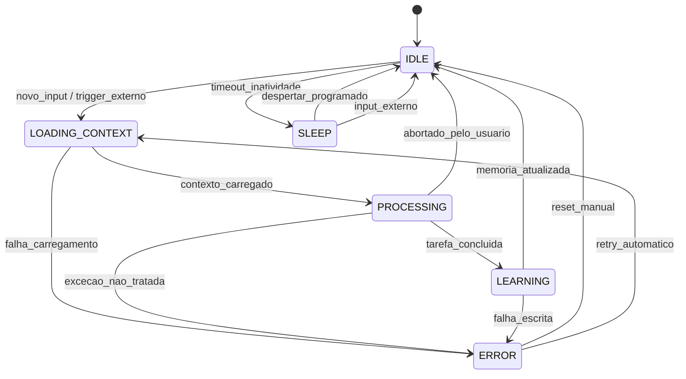

# State Machine — Blueprint do Ciclo Operacional JARVIS

Este documento define a **máquina de estados formais** que governa o ciclo de operação do agente JARVIS. Cada estado representa um modo distinto de operação com ações, triggers e transições bem definidas.

## Diagrama de Estados

## Estados

### `IDLE`
- **Descrição**: JARVIS aguardando entrada. Consumo mínimo de recursos.
- **Ações**:
  - Escuta canais de input (chat, comandos, triggers de sistema)
  - Mantém cache de contexto quente (último projeto ativo)
  - Timer de inatividade para transição → `SLEEP`
- **Trigger de saída**: novo input recebido | timeout de inatividade

### `LOADING_CONTEXT`
- **Descrição**: Carrega o estado atual do vault, projeto ativo e memórias relevantes.
- **Ações**:
  - Lê [[JARVIS/02-Operational/Contexto-Atual|Contexto-Atual]]
  - Consulta [[JARVIS/03-Memory|Memórias]] relevantes ao input
  - Verifica [[JARVIS/01-Identity|Identidade]] e regras aplicáveis
  - Monta o prompt base com contexto completo
- **Trigger de saída**: contexto carregado com sucesso | falha no carregamento
- **Tempo estimado**: < 2s (ideal) | < 5s (tolerável)

### `PROCESSING`
- **Descrição**: Execução da tarefa principal — raciocínio, geração de resposta, execução de comandos.
- **Ações**:
  - Executa o pipeline de pensamento (chain-of-thought)
  - Consulta [[JARVIS/04-Engineering|Base de Conhecimento]] se necessário
  - Interage com ferramentas externas (scripts, APIs)
  - Gera saída estruturada
- **Trigger de saída**: tarefa concluída | exceção não tratada | aborto pelo usuário
- **Tempo estimado**: variável (segundos a minutos)

### `LEARNING`
- **Descrição**: Registro dos resultados da operação — log, memória, aprendizado.
- **Ações**:
  - Escreve log estruturado da operação
  - Atualiza [[JARVIS/03-Memory|Memórias Episódicas/Semânticas]]
  - Atualiza [[JARVIS/00-Architecture|Métricas de desempenho]]
  - Consolida aprendizados no [[JARVIS/05-System/Blueprints/Template-Aprendizado|Template-Aprendizado]] (se aplicável)
- **Trigger de saída**: memória atualizada | falha na escrita
- **Tempo estimado**: < 1s

### `SLEEP`
- **Descrição**: Estado de baixa atividade — economia de recursos computacionais.
- **Ações**:
  - Mantém conexão mínima com o vault
  - Timer de despertar programado (ex: verificação diária)
  - Aguarda input externo para reativação
- **Trigger de saída**: despertar programado | input externo recebido
- **Tempo máximo**: configurável (padrão: 30 min)

### `ERROR`
- **Descrição**: Estado de exceção — algo inesperado ocorreu.
- **Ações**:
  - Loga o erro com stack trace e contexto
  - Notifica o usuário (se crítico)
  - Tenta recuperação automática (retry com backoff)
  - Se recovery falhar, aguarda reset manual
- **Trigger de saída**: reset manual do usuário | retry automático bem-sucedido

## Transições

| De | Para | Trigger | Ação na Transição |
|---|---|---|---|
| IDLE | LOADING_CONTEXT | Input do usuário | Reset timer inatividade |
| IDLE | SLEEP | 5 min sem input | Salva cache quente |
| LOADING_CONTEXT | PROCESSING | Contexto OK | Monta prompt final |
| LOADING_CONTEXT | ERROR | Falha leitura vault | Loga erro contexto |
| PROCESSING | LEARNING | Tarefa OK | Prepara dados pós-task |
| PROCESSING | ERROR | Exceção | Loga stack trace |
| PROCESSING | IDLE | Usuário abortou | Descarta saída parcial |
| LEARNING | IDLE | Memória salva | Limpa cache operacional |
| LEARNING | ERROR | Falha escrita disco | Tenta 1 retry |
| SLEEP | IDLE | Timer OR input | Carrega cache frio |
| ERROR | IDLE | Reset manual | Limpa estado erro |
| ERROR | LOADING_CONTEXT | Retry automático | Incrementa contador retry |

## Regras Globais

1. **Anti-flap**: Mínimo de 500ms entre transições para evitar oscilação
2. **Timeout por estado**: Cada estado tem timeout máximo (ex: PROCESSING = 5min). Se exceder → `ERROR`
3. **Log obrigatório**: Toda transição deve ser logada com timestamp + trigger
4. **Retry limit**: Máximo de 3 retries consecutivos de `ERROR` → `LOADING_CONTEXT`. Após 3, requer intervenção manual

## Referência aos Tiers JARVIS

- **[[JARVIS/01-Identity|Tier 01 — Identity]]**: Carregado em `LOADING_CONTEXT` para determinar alinhamento
- **[[JARVIS/02-Operational|Tier 02 — Operational]]**: Monitorado por `IDLE` e `SLEEP` (contexto ativo)
- **[[JARVIS/03-Memory|Tier 03 — Memory]]**: Consultada em `LOADING_CONTEXT`, atualizada em `LEARNING`
- **[[JARVIS/04-Engineering|Tier 04 — Engineering]]**: Acessado em `PROCESSING` para knowledge base
- **[[JARVIS/05-System|Tier 05 — System]]**: Dono desta máquina de estados + logs + evolução

## Implementação

Este blueprint é implementado via:
- `JARVIS/05-System/Comandos-JARVIS.md` — comandos que disparam transições
- `JARVIS/02-Operational/Contexto-Atual/` — estado atual monitorado
- Scripts de automação no vault que utilizam os hooks de transição

[[JARVIS/README|← Voltar ao Command Center]]
