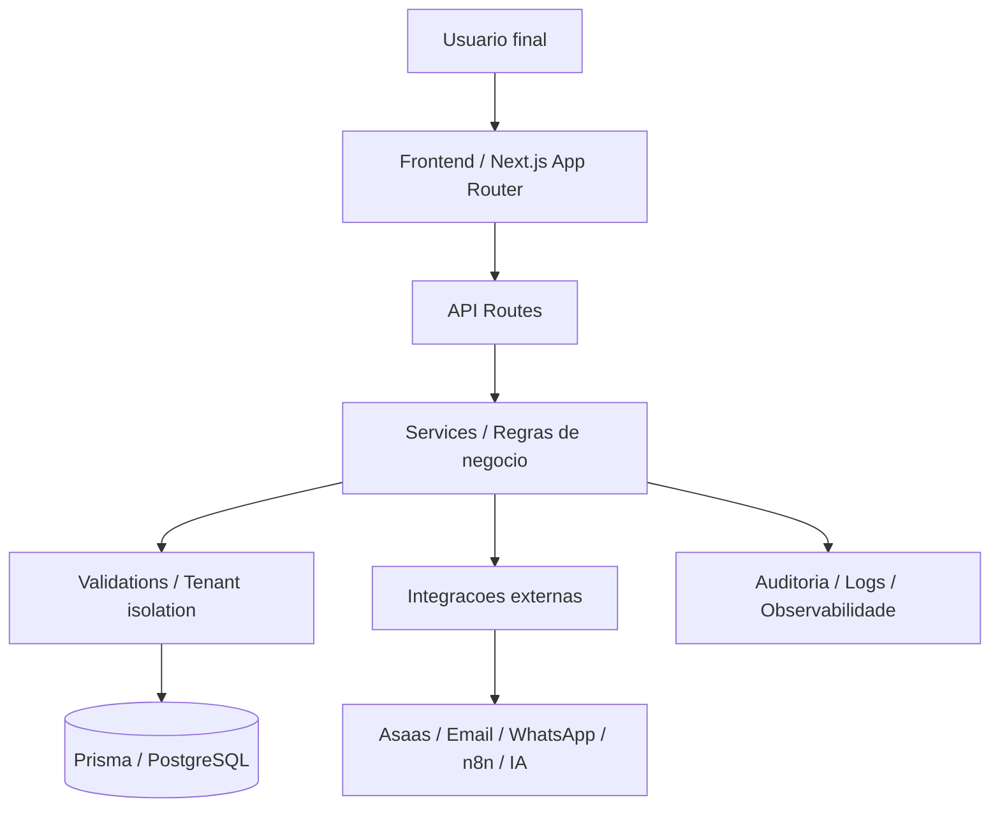
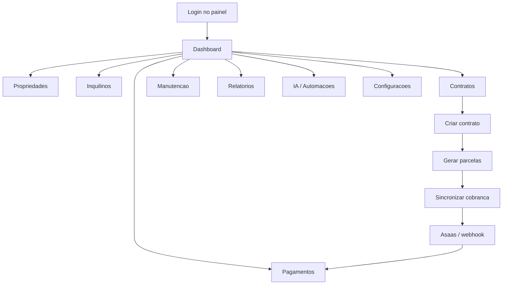
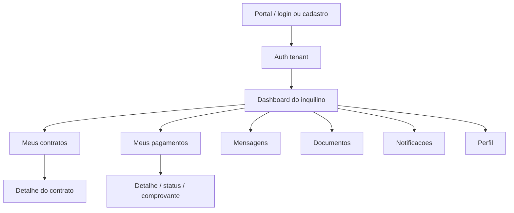

# Guia de Beta Tester - Gestor de Aluguel 2.0

> Objetivo: servir como roteiro de validacao ponta a ponta para testes manuais, com foco no uso real do usuario final e no comportamento esperado do sistema.
>
> Escopo: frontend, backend, rotas, integracoes, portal do inquilino, estabilidade, permissao, fluxos de negocio e sinais de falha.
>
> Observacao: este documento nao corrige codigo. Ele organiza o projeto para testes e para identificacao de quebra de fluxo.

---

## 1. Como usar este guia

Siga esta ordem:
1. Validar ambiente e login.
2. Testar o painel principal.
3. Testar cadastros basicos.
4. Testar contrato fim a fim.
5. Testar pagamento fim a fim.
6. Testar portal do inquilino.
7. Testar notificacoes, manutencao, IA e integracoes.
8. Repetir os fluxos com erro proposital para verificar resiliencia.

Critico para beta:
- salvar evidencias de cada caso
- testar desktop e mobile
- testar usuario novo e usuario com dados existentes
- testar com e sem tenant ligado
- testar com internet lenta, refresh, logout e reentrada

---

## 2. Visao geral do sistema

O projeto e um SaaS imobiliario para:
- cadastro de propriedades
- cadastro de inquilinos
- gestao de contratos
- geracao e acompanhamento de cobrancas
- manutencao
- notificacoes
- portal do inquilino
- integracoes externas
- suporte a IA
- monitoramento e auditoria

Leitura operacional do sistema:
- o frontend principal e o painel do administrador/proprietario
- o portal separado e o ambiente do inquilino
- o backend concentra API routes, regras, servicos e persistencia
- o banco armazena entidades multi-tenant e estados operacionais

---

## 3. Mapa macro de pastas e responsabilidades

### Raiz do projeto
- `src/` - aplicacao principal
- `prisma/` - schema, migrations, seed e banco
- `docs/` - documentacao funcional, tecnica e auditorias
- `tests/` - testes automatizados
- `infrastructure/` - microservicos e suporte operacional
- `scripts/` - automacoes e utilitarios
- `config/` - configuracoes de ambiente, testes e deploy
- `public/` - assets publicos

### Frontend e UI
- `src/app/` - rotas, pages, layouts e APIs
- `src/components/` - componentes visuais e formularios
- `src/contexts/` - estado global e providers
- `src/hooks/` - hooks de UX, dados e interacao
- `src/styles/` - CSS e camadas de responsividade

### Backend e dominio
- `src/lib/services/` - regras de negocio centrais
- `src/lib/auth/` - autenticacao de usuario e portal
- `src/lib/validations/` - schemas e validacoes
- `src/lib/tenant/` - isolamento e regras multi-tenant
- `src/lib/security/` - seguranca e protecoes
- `src/lib/websocket/` e `src/lib/socket/` - realtime
- `src/app/api/` - endpoints HTTP

### Integracoes e operacao
- `src/app/api/integrations/` - Asaas, n8n, webhooks e conexoes
- `src/app/api/ai/` - IA e automatizacoes
- `src/app/api/health/` - verificacao de saude
- `server.ts` - servidor customizado e sockets
- `next.config.js` - build, runtime e configuracoes gerais

---

## 4. Fluxo arquitetural principal

---

## 5. Perfis de usuario e expectativa de uso

### Administrador ou proprietario
- acessa o painel principal
- cadastra propriedades
- cadastra inquilinos
- cria contratos
- acompanha pagamentos
- registra manutencao
- consulta relatorios
- usa IA e automacoes

### Inquilino
- acessa o portal
- faz login ou cadastro
- ve contratos
- acompanha pagamentos
- recebe notificacoes
- acessa mensagens e documentos
- responde convites

### Beta tester
- executa fluxo normal
- tenta fluxo incompleto
- tenta fluxo repetido
- testa saida inesperada
- valida mensagens de erro
- valida estado apos refresh e logout

---

## 6. Fluxos principais em mermaid

### 6.1 Fluxo do administrador

### 6.2 Fluxo do portal do inquilino

### 6.3 Fluxo de contrato e cobranca

```mermaid
flowchart TD
  A[Form de contrato] --> B[API contratos]
  B --> C[ContractService]
  C --> D[Validar tenant / propriedade / inquilino]
  D --> E[(Banco)]
  C --> F[Gerar cronograma]
  F --> G[(Banco - payments)]
  C --> H[Opcional: Asaas]
  H --> I[Webhooks]
  I --> J[Atualizar pagamento]
  C --> K[Auditoria / email]
```

---

## 7. Lista de arquivos-chave por fluxo

### 7.1 Autenticacao principal
- `src/app/(auth)/login/page.tsx`
- `src/app/(auth)/register/page.tsx`
- `src/app/api/auth/[...nextauth]/route.ts`
- `src/lib/auth/*`
- `src/hooks/useAuth.tsx`
- `src/contexts/AuthContext.tsx` ou equivalente no projeto

### 7.2 Dashboard e navegacao
- `src/app/(dashboard)/dashboard/page.tsx`
- `src/components/ClientRoot.tsx`
- `src/config/navigation.ts`
- `src/contexts/LayoutContext.tsx`
- `src/components/ui/*`

### 7.3 Propriedades
- `src/app/api/properties/*`
- `src/components/forms/PropertyForm.tsx`
- `src/services/properties.ts`
- `src/hooks/useProperties.ts`
- `src/lib/validations/property.ts`

### 7.4 Inquilinos
- `src/app/api/tenants/*`
- `src/components/forms/TenantForm.tsx`
- `src/services/tenants.ts`
- `src/hooks/useTenants.ts`
- `src/lib/validations/tenant.ts`

### 7.5 Contratos
- `src/app/api/contracts/*`
- `src/components/forms/ContractForm.tsx`
- `src/components/contracts/ContractTemplateManager.tsx`
- `src/lib/services/contract-service.ts`
- `src/lib/services/contract-billing-service.ts`
- `src/lib/validations/contract.ts`
- `src/services/contracts.ts`

### 7.6 Pagamentos
- `src/app/api/payments/*`
- `src/components/forms/PaymentForm.tsx`
- `src/lib/services/payment-service.ts`
- `src/lib/services/asaas-service.ts`
- `src/lib/validations/payment.ts`
- `src/services/payments.ts`

### 7.7 Portal do inquilino
- `src/app/portal/page.tsx`
- `src/app/portal/layout.tsx`
- `src/components/portal/TenantAuthGuard.tsx`
- `src/components/portal/PortalHeader.tsx`
- `src/components/portal/PortalSidebar.tsx`
- `src/contexts/tenant-context.tsx`
- `src/app/portal/api/auth/*`
- `src/app/portal/api/contracts/*`

### 7.8 Manutencao
- `src/app/api/maintenance/*`
- `src/components/forms/MaintenanceForm.tsx`
- `src/services/maintenance.ts`
- `src/lib/validations/maintenance.ts`

### 7.9 IA e automacoes
- `src/app/api/ai/*`
- `src/components/AIWidgetContext.tsx`
- `src/lib/ai/*`
- `src/services/dashboard.ts` quando consumir IA/insights
- `infrastructure/microservices/ai-service/*`

### 7.10 Infra e observabilidade
- `server.ts`
- `src/middleware.ts`
- `src/middleware-tenant.ts`
- `next.config.js`
- `src/app/health/*`
- `src/lib/logger/*`
- `src/lib/monitoring/*`
- `sentry.*.config.ts`

---

## 8. Guia de teste por modulo

### 8.1 Autenticacao principal
Objetivo:
- validar login, logout, sessao e redirecionamento

O que testar:
- login com credenciais validas
- login com senha errada
- login com usuario inexistente
- logout e retorno para tela correta
- refresh apos login
- expiracao de sessao
- acesso direto a rota protegida sem sessao

Resultado esperado:
- usuario autenticado entra no painel
- usuario invalido recebe erro claro
- rota protegida redireciona corretamente

Sinais de falha:
- loop de redirect
- tela em branco
- token persistindo apos logout
- erro 500 no login

### 8.2 Dashboard
Objetivo:
- validar leitura do resumo operacional

O que testar:
- cards e contadores
- filtros e atalhos
- graficos e loading states
- recarregar pagina sem quebrar a sessao

Resultado esperado:
- dados coerentes com o banco
- skeletons e loading funcionando

Sinais de falha:
- dados zerados sem motivo
- cards inconsistentes
- erro ao renderizar componente

### 8.3 Propriedades
Objetivo:
- validar cadastro, edicao, listagem, busca e exclusao

O que testar:
- criar imovel com dados validos
- criar imovel com campo obrigatorio faltando
- editar imovel ja usado em contrato
- excluir imovel sem dependencia
- filtrar por status, tipo e localizacao

Resultado esperado:
- validacao clara
- persistencia correta
- estado atualizado apos refresh

Sinais de falha:
- duplicidade
- status inconsistente
- pagina quebrando por imagem ausente

### 8.4 Inquilinos
Objetivo:
- validar cadastro e vinculacao com contratos

O que testar:
- criar inquilino novo
- editar contato
- verificar documento e telefone
- vincular a contrato
- testar inquilino sem contrato

Resultado esperado:
- dados persistidos
- relacionamento correto

Sinais de falha:
- vinculo errado
- falta de filtros
- validacao de documento falhando

### 8.5 Contratos
Objetivo:
- validar o fluxo mais importante do sistema

O que testar:
- criar contrato novo
- preencher datas, valor, periodicidade e status
- salvar em rascunho
- salvar como ativo
- gerar parcelas
- revisar propriedade e inquilino vinculados
- editar contrato existente
- encerrar contrato
- renovar contrato

Resultado esperado:
- contrato salva sem corromper estado
- cronograma nasce corretamente
- relacao com property e tenant fica consistente

Sinais de falha:
- contrato salvo sem coerencia de datas
- propriedade ocupada quando nao deveria
- parcelas faltando ou duplicadas
- status visual diferente do status real

### 8.6 Pagamentos
Objetivo:
- validar ciclo financeiro completo

O que testar:
- listar pagamentos
- abrir detalhe do pagamento
- criar pagamento manual
- atualizar status
- simular pagamento pendente, pago, atrasado e cancelado
- anexar comprovante
- validar historico

Resultado esperado:
- valores, datas e status coerentes
- historico auditavel

Sinais de falha:
- erro ao abrir detalhe
- parse quebrado de dados antigos
- status divergente entre tela e banco

### 8.7 Manutencao
Objetivo:
- validar solicitacao, acompanhamento e fechamento

O que testar:
- abrir chamado
- anexar imagem
- alterar status
- atribuir responsavel
- encerrar manutencao

Resultado esperado:
- fluxo de vida do chamado completo

Sinais de falha:
- upload quebrado
- status travando
- nota nao salva

### 8.8 Notificacoes
Objetivo:
- validar informacao assíncrona e leitura

O que testar:
- notificacao nova
- marcar como lida
- filtrar por tipo
- persistir estado apos reload

Resultado esperado:
- notificacoes se mantem consistentes

Sinais de falha:
- contador errado
- duplicidade
- sumiço apos refresh

### 8.9 Relatorios
Objetivo:
- validar consistencia de dados agregados

O que testar:
- cards de resumo
- graficos
- exportacao
- filtros por data

Resultado esperado:
- numeros batem com os registros base

Sinais de falha:
- totais divergentes
- filtro que nao aplica

### 8.10 IA e automacoes
Objetivo:
- validar respostas, fallback e integracao

O que testar:
- abrir assistente
- enviar pergunta
- receber resposta
- usar recomendacoes
- validar analise de risco ou sugestao automatica

Resultado esperado:
- resposta coerente
- erro controlado em falha externa

Sinais de falha:
- resposta vazia
- travamento de widget
- dependencias externas derrubando a tela

### 8.11 Portal do inquilino
Objetivo:
- validar experiencia do usuario final

O que testar:
- abrir `/portal`
- registrar conta
- fazer login
- aceitar convite
- visualizar contratos
- visualizar pagamentos
- visualizar mensagens
- abrir notificacoes
- logout

Resultado esperado:
- fluxo simples e sem confusao
- guardas de rota funcionando
- token funcionando de forma estavel

Sinais de falha:
- token duplicado
- redirecionamento sem fim
- portal acessa dados de outro tenant

---

## 9. Tabela de fluxo: tela, API, service, banco e risco

| Tela | API | Service | Banco | Risco |
|---|---|---|---|---|
| Login do painel | auth routes | auth helper / session | users / sessions | autenticao falhar ou redirecionar errado |
| Dashboard | dashboard routes | dashboard service | aggregates | numeros incoerentes ou lentidao |
| Cadastro de propriedade | properties routes | properties service | properties | duplicidade, status errado |
| Cadastro de inquilino | tenants routes | tenants service | tenants | vinculo errado, dados invalidos |
| Criacao de contrato | contracts routes | contract-service + billing | contracts + payments | ocupacao incorreta, cronograma invalido |
| Listagem de pagamentos | payments routes | payment-service | payments + history | status divergente |
| Detalhe de pagamento | payments/[id] route | payment-service | payments + contract + tenant | parse quebrado ou include incompleto |
| Portal do inquilino | portal routes | tenant auth service | tenant_users + tenant_contracts | exposicao de token ou tenant errado |
| Convite do portal | invite routes | tenant auth / mail | tenant_invites | convite expirar ou ser aceito errado |
| Manutencao | maintenance routes | maintenance service | maintenance | status travar ou upload falhar |
| Webhook Asaas | webhooks route | asaas service | payments | webhook cair ou atualizar errado |
| IA | ai routes | ai service | logs / cache / knowledge base | resposta instavel ou timeout |

---

## 10. Checklist de beta tester

### Antes de comecar
- confirmar ambiente aberto
- confirmar URL correta
- confirmar banco populado
- confirmar usuario admin
- confirmar usuario inquilino
- confirmar tenant com contrato e pagamento de teste

### Durante o teste
- registrar print ou video de cada erro
- anotar horario exato
- anotar rota e acao executada
- anotar se foi desktop ou mobile
- anotar se houve reload antes da falha

### Depois do teste
- conferir se o estado salvo corresponde ao que foi visto
- validar se a tela voltou ao estado apos refresh
- validar se logout limpou tudo
- validar se o erro reaparece em nova sessao

---

## 11. Sequencia recomendada para teste real

### Fase 1 - sanidade
1. abrir app
2. logar
3. navegar pelo menu
4. sair

### Fase 2 - dados basicos
1. criar propriedade
2. criar inquilino
3. criar contrato
4. gerar cobrancas

### Fase 3 - financeiro
1. visualizar pagamentos
2. simular pagamento
3. validar webhook
4. validar historico

### Fase 4 - portal do inquilino
1. acessar portal
2. criar ou aceitar conta
3. abrir contrato
4. abrir pagamentos
5. testar logout

### Fase 5 - resiliencia
1. repetir fluxo com internet lenta
2. repetir com refresh no meio
3. repetir com token expirado
4. repetir com dados incompletos

---

## 12. Pontos de falha mais provaveis para observar no beta

- redirecionamento em loop entre portal e painel
- token salvo em mais de um lugar
- listagem que altera estado sem parecer mutacao
- detalhe de pagamento quebrando por JSON legado
- webhook externo sem tolerancia a erro de formato
- contrato ativo e propriedade ocupada sem coerencia de negocio
- valores de metadata ou URLs fixas de localhost
- build passando com alerta escondido
- include de banco incompleto causando tela sem dados
- componentes carregando sem tratamento de erro

---

## 13. Critérios de aceite por area

### Aceite minimo do painel
- login entra
- dashboard abre
- menus funcionam
- criar/editar/excluir basico funciona
- logout limpa sessao

### Aceite minimo do financeiro
- contrato gera pagamentos
- pagamento aparece na listagem
- detalhe abre
- webhook atualiza status

### Aceite minimo do portal
- login ou cadastro funciona
- contratos aparecem
- pagamentos aparecem
- logout funciona

### Aceite minimo de estabilidade
- reload nao derruba tela
- erro de API nao quebra toda a pagina
- falha externa nao deixa a UI travada
- dados multi-tenant nao vazam

---

## 14. Resumo executivo do que vale testar primeiro

Se o tempo for curto, priorizar:
1. login principal
2. criar contrato
3. gerar pagamento
4. abrir detalhe de pagamento
5. portal do inquilino
6. webhook Asaas
7. logout e refresh

Esses pontos cobrem o caminho mais sensivel do sistema e tendem a revelar a maioria dos problemas de integracao, estado e permissao.

---

## 15. Referencias internas uteis

- `D:\GitHub\Will-obsidian\Projetos\Privados\gestor_aluguel_2.0.md`
- `D:\GitHub\Will-obsidian\Projetos\EstudosFocados\gestor_aluguel_2.0.md`
- `D:\GitHub\gestor_aluguel_2.0\docs\PROJECT_STRUCTURE_COMPLETE.md`
- `D:\GitHub\gestor_aluguel_2.0\docs\PORTAL_INQUILINO.md`
- `D:\GitHub\gestor_aluguel_2.0\docs\API_MAPPING_REPORT.md`
- `D:\GitHub\gestor_aluguel_2.0\docs\analysis\ANALISE_ULTRA_COMPLETA_PROJETO.md`

---

## 16. Manual de teste numerado

### CT-01 - Abertura inicial do sistema
- Objetivo: validar carregamento basal do aplicativo.
- Pre-condicao: ambiente iniciado e usuario deslogado.
- Passos:
  1. Abrir a URL principal.
  2. Aguardar carregamento completo.
  3. Observar header, sidebar e area central.
- Resultado esperado:
  - a tela abre sem erro visual
  - o layout base aparece consistente
  - nao ha loop de carregamento

### CT-02 - Login do painel principal
- Objetivo: validar autenticacao do admin/proprietario.
- Pre-condicao: credencial valida de teste.
- Passos:
  1. Ir para a tela de login.
  2. Informar email e senha.
  3. Confirmar o acesso.
- Resultado esperado:
  - usuario entra no painel
  - sessao fica persistente ao refresh
  - redirecionamento vai para area correta

### CT-03 - Login invalido
- Objetivo: validar erro amigavel.
- Pre-condicao: usuario deslogado.
- Passos:
  1. Informar senha errada.
  2. Tentar entrar.
- Resultado esperado:
  - a aplicacao bloqueia o acesso
  - mensagem de erro clara aparece
  - nada quebra na interface

### CT-04 - Navegacao do painel
- Objetivo: validar menu, rotas e carregamento entre secoes.
- Pre-condicao: login ativo.
- Passos:
  1. Abrir dashboard.
  2. Entrar em propriedades.
  3. Entrar em inquilinos.
  4. Entrar em contratos.
  5. Entrar em pagamentos.
- Resultado esperado:
  - cada rota abre corretamente
  - menus ativos acompanham a pagina
  - nao ha tela em branco

### CT-05 - Criacao de propriedade
- Objetivo: validar cadastro inicial de imovel.
- Pre-condicao: usuario autenticado.
- Passos:
  1. Abrir formulario de propriedade.
  2. Preencher dados obrigatorios.
  3. Salvar.
  4. Reabrir a listagem.
- Resultado esperado:
  - propriedade aparece na lista
  - dados permanecem apos refresh
  - validacoes obrigatorias funcionam

### CT-06 - Criacao de inquilino
- Objetivo: validar cadastro de pessoa vinculavel a contrato.
- Pre-condicao: propriedade disponivel para uso.
- Passos:
  1. Abrir formulario de inquilino.
  2. Preencher nome, email e telefone.
  3. Salvar.
- Resultado esperado:
  - inquilino criado com sucesso
  - registro aparece na busca/lista
  - campos invalidos sao rejeitados

### CT-07 - Criacao de contrato em rascunho
- Objetivo: validar salvamento sem ativacao imediata.
- Pre-condicao: propriedade e inquilino cadastrados.
- Passos:
  1. Abrir formulario de contrato.
  2. Escolher propriedade e inquilino.
  3. Preencher valores, datas e status de rascunho.
  4. Salvar.
- Resultado esperado:
  - contrato fica visivel como rascunho
  - o estado nao se comporta como ativo
  - a pagina exibe informacoes coerentes

### CT-08 - Criacao de contrato ativo
- Objetivo: validar fluxo completo de negocio.
- Pre-condicao: dados basicos prontos.
- Passos:
  1. Abrir formulario de contrato.
  2. Preencher informacoes obrigatorias.
  3. Marcar como ativo.
  4. Salvar.
- Resultado esperado:
  - contrato e salvo
  - cronograma financeiro e gerado
  - propriedade passa a refletir o estado esperado

### CT-09 - Edicao de contrato existente
- Objetivo: validar alteracao sem perda de relacao.
- Pre-condicao: contrato criado.
- Passos:
  1. Abrir contrato salvo.
  2. Alterar valor ou data.
  3. Salvar.
- Resultado esperado:
  - alteracao persiste
  - relacao com propriedade e inquilino continua valida
  - historico nao se perde

### CT-10 - Listagem de pagamentos
- Objetivo: validar visao financeira do usuario.
- Pre-condicao: existir ao menos um contrato com parcelas.
- Passos:
  1. Abrir financeiro/pagamentos.
  2. Verificar cards e listagem.
  3. Abrir um item.
- Resultado esperado:
  - listagem carrega
  - totais batem com o banco
  - detalhe abre sem erro

### CT-11 - Pagamento manual
- Objetivo: validar atualizacao manual de status.
- Pre-condicao: pagamento pendente.
- Passos:
  1. Abrir o pagamento.
  2. Marcar como pago.
  3. Salvar.
- Resultado esperado:
  - status muda corretamente
  - data de pagamento aparece
  - historico registra a acao

### CT-12 - Detalhe de pagamento com dados antigos
- Objetivo: validar tolerancia a dados legados.
- Pre-condicao: existir pagamento com campos armazenados em JSON.
- Passos:
  1. Abrir o detalhe.
  2. Conferir imagens, termos e documentos.
- Resultado esperado:
  - tela nao quebra
  - dados legados sao tratados sem derrubar a pagina

### CT-13 - Portal do inquilino
- Objetivo: validar acesso do usuario final.
- Pre-condicao: tenant ativo e convite ou conta criada.
- Passos:
  1. Abrir `/portal`.
  2. Fazer login ou cadastro.
  3. Entrar no dashboard do portal.
- Resultado esperado:
  - usuario entra apenas no proprio escopo
  - interface do portal carrega
  - menu e guardas funcionam

### CT-14 - Contratos no portal
- Objetivo: validar visao do inquilino sobre o proprio contrato.
- Pre-condicao: portal autenticado.
- Passos:
  1. Abrir contratos.
  2. Conferir dados do contrato.
  3. Conferir mensagens e documentos vinculados.
- Resultado esperado:
  - contrato correto aparece
  - informacoes batem com o painel principal
  - nenhum dado de outro tenant aparece

### CT-15 - Pagamentos no portal
- Objetivo: validar visao do inquilino sobre a propria cobranca.
- Pre-condicao: portal autenticado e com pagamentos.
- Passos:
  1. Abrir pagamentos.
  2. Abrir o detalhe.
  3. Verificar situacao da cobranca.
- Resultado esperado:
  - status e valores corretos
  - links ou comprovantes funcionam
  - layout permanece consistente

### CT-16 - Convite do portal
- Objetivo: validar aceite de convite e criacao de conta.
- Pre-condicao: convite valido e nao expirado.
- Passos:
  1. Abrir link de convite.
  2. Criar conta ou autenticar.
  3. Aceitar convite.
- Resultado esperado:
  - convite e processado
  - conta fica vinculada ao contrato
  - redirecionamento final e correto

### CT-17 - Logout e limpeza de sessao
- Objetivo: validar encerramento correto.
- Pre-condicao: usuario logado.
- Passos:
  1. Fazer logout.
  2. Recarregar a pagina.
  3. Tentar voltar a rota protegida.
- Resultado esperado:
  - token e sessao sao limpos
  - usuario nao volta sozinho
  - acesso e bloqueado ate novo login

### CT-18 - Webhook de pagamento
- Objetivo: validar integracao externa.
- Pre-condicao: payload de teste do Asaas ou simulacao equivalente.
- Passos:
  1. Disparar o webhook.
  2. Conferir atualizacao do pagamento.
  3. Abrir a UI de pagamentos.
- Resultado esperado:
  - status local acompanha o evento
  - nenhum erro de parse ou token derruba a rota

### CT-19 - Erro proposital de rede
- Objetivo: validar resiliencia visual.
- Pre-condicao: usuario em rota funcional.
- Passos:
  1. Desligar ou degradar rede.
  2. Executar uma acao de salvar.
  3. Repetir depois de restaurar a rede.
- Resultado esperado:
  - erro e exibido de forma clara
  - pagina nao trava de forma permanente
  - acao pode ser repetida

### CT-20 - Refresh em meio ao fluxo
- Objetivo: validar recuperacao de estado.
- Pre-condicao: formulario ou pagina aberta com dados.
- Passos:
  1. Preencher parte do formulario.
  2. Dar refresh.
  3. Reabrir o fluxo.
- Resultado esperado:
  - o sistema recupera estado esperado ou limpa de forma segura
  - nao fica em estado corrompido
