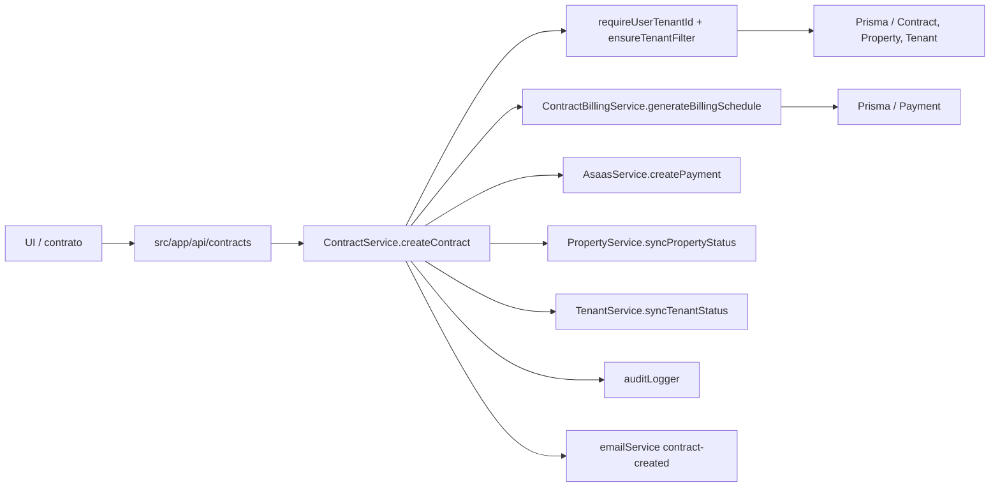
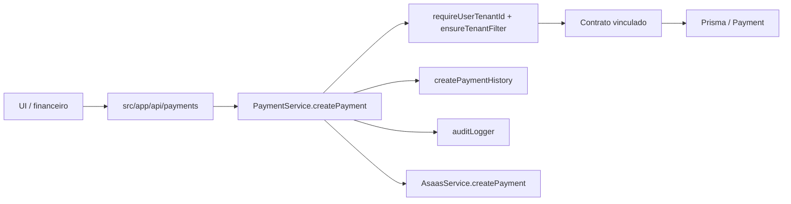
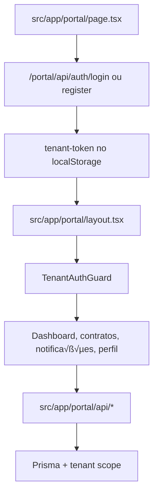

# gestor_aluguel_2.0 [[../Projetos.md|Projetos]] [[GitHub-Completo]]

**Private Clone | Next.js 15.5.6/TS | Atualizado 2026-05-10**

Plataforma SaaS de gestão imobiliária com multi-tenant por `saasTenantId`, Prisma/PostgreSQL, portal do inquilino, contratos colaborativos, financeiro, manutenção, IA e integrações operacionais.

## Mapa consolidado

- **Entrada do app**: `server.ts` + `src/app/layout.tsx` + `src/app/page.tsx`
- **Rotas principais**: `src/app/(protected)/dashboard`, `usuarios`, `perfil`, `relatorios` e o portal em `src/app/portal`
- **Autenticação**: NextAuth em `src/app/api/auth/[...nextauth]/route.ts` e fluxos auxiliares em `src/app/api/auth/*`
- **API core**: `src/app/api/properties`, `tenants`, `contracts`, `payments`, `maintenance`, `documents`, `notifications`, `webhooks`, `integrations`, `ai`, `health`
- **Serviços centrais**: `src/lib/services/*` e a camada paralela `src/services/*`
- **Banco**: `prisma/schema.prisma` com `SASTenant`, `User`, `Property`, `Tenant`, `Contract`, `Payment`, `Maintenance`, `Document`, `Notification`, `Conversation`, `Webhook`, `AIAnalysis`, `AIRiskScore`
- **Infra**: Docker Compose, Nginx, Sentry, Pino, Redis, BullMQ, Socket.io, WebSocket/Yjs, Playwright, Jest
- **Integrações**: Asaas, n8n, WAHA/WhatsApp, email via Nodemailer, Supabase Storage, Gemini, OCR com Tesseract
- **IA**: `src/lib/ai/*` + rotas em `src/app/api/ai/*` + microserviço Python em `infrastructure/microservices/ai-service`

## Leitura funcional

- O sistema é um ERP imobiliário com foco em cadastro de imóveis/inquilinos, geração e ciclo de vida de contratos, cobrança, manutenção e comunicação.
- Há um portal separado para inquilinos, com páginas próprias e APIs próprias em `src/app/portal/api`.
- O contrato é um eixo central: existe edição colaborativa, versionamento, envio de cópia, token do inquilino, ingestão RAG e exportação PDF/DOCX.
- O financeiro conversa com Asaas e com históricos próprios para recibo, fatura, PIX e boleto.
- A camada de IA cobre chat, risco, previsão de inadimplência, recomendação, NLP, BI, treinamento e monitoramento.

## Mapa Visual

```mermaid
flowchart TB
    Root["gestor_aluguel_2.0"]

    Root --> App["src/app"]
    Root --> Lib["src/lib"]
    Root --> Services["src/services"]
    Root --> Prisma["prisma"]
    Root --> Infra["infrastructure"]
    Root --> Docs["docs"]
    Root --> Scripts["scripts"]

    App --> Admin["(protected)\nAdmin UI"]
    App --> Portal["portal\nPortal do inquilino"]
    App --> Api["api\nREST + integrações"]
    App --> Auth["auth\nLogin, registro, reset"]

    Admin --> AdminDashboard["dashboard / relatórios / usuários / imóveis / contratos / financeiro / manutenção"]
    Portal --> PortalAuth["login, invite, dashboard, contracts, notifications, profile"]
    Api --> CoreApi["contracts / payments / tenants / properties / maintenance"]
    Api --> InfraApi["ai / ocr / rag / health / webhooks / integrations / backup"]

    Lib --> Domain["services/\nRegras de negócio"]
    Lib --> AI["ai/\nChat, risco, OCR, RAG, treino"]
    Lib --> Security["security/\nauth, rate limit, validação"]
    Lib --> Tenant["tenant/\nisolamento multi-tenant"]
    Lib --> Integrations["integrations/\nAsaas, n8n, WhatsApp, Supabase"]
    Lib --> Support["email, logs, cache, websocket, reports"]

    Services --> Facades["Facades do domínio\ncontracts, payments, tenants, properties"]
    Prisma --> DB["Schema + migrations + seed"]
    Infra --> MicroAI["microservices/ai-service\nFastAPI"]
    Infra --> Runtime["Docker, Nginx, monitoring"]
    Docs --> Guides["Guias, análises, correções, deploy"]
    Scripts --> Ops["data, ai, deployment, database"]

    PortalAuth --> TenantAuth["token próprio do inquilino"]
    AdminDashboard --> MainLayout["MainLayout / protected layout"]
    CoreApi --> DomainServices["services locais + lib/services"]
    InfraApi --> External["Asaas / n8n / WhatsApp / email / storage"]
```

## Observações rápidas

- O repositório tem documentação extensa em `docs/`, com mapas, guias de deploy, IA, segurança e troubleshooting.
- Existem scripts operacionais para carga massiva, banco, deploy, monitoramento e an√°lise do projeto.
- Há bastante infraestrutura pronta, então os próximos ajustes tendem a ser evolutivos, não estruturais.

## Raio-X dos Fluxos

### Contrato

- O contrato nasce na API de `contracts` e entra na camada `ContractService`.
- Antes de criar, o sistema valida propriedade, inquilino e isolamento por tenant.
- Ao criar contrato ativo, o serviço gera automaticamente o cronograma financeiro.
- Se `autoGenerateAsaas` estiver ligado, cada parcela pode virar cobrança no Asaas.
- Depois disso, a propriedade é marcada como ocupada, o tenant é sincronizado, há auditoria e o inquilino recebe e-mail.

### Pagamento

- O pagamento sempre nasce amarrado a um contrato v√°lido do mesmo tenant.
- O registro local é criado primeiro, depois o histórico e a auditoria.
- Se o status for `PENDING` e o método for compatível, a cobrança é sincronizada com o Asaas.
- Isso sugere que o banco local é a fonte operacional, e o Asaas é o canal transacional.

### Portal do Inquilino

- O portal é separado do painel admin e usa token próprio, não NextAuth.
- A p√°gina p√∫blica `/portal` faz login/registro e salva `tenant-token`.
- O layout decide entre rotas p√∫blicas e protegidas e aplica `TenantAuthGuard`.
- As páginas protegidas acessam APIs próprias do portal, com escopo do tenant.
- Isso isola bem a experiência do inquilino da área administrativa.

## Checklist Provável de Correção

- [ ] Isolamento de tenant em cada rota de API e em cada `where` do Prisma
- [ ] Sincronia entre contrato local, parcelas locais e cobrança Asaas
- [ ] Atualização de `payment.status`, `paidDate` e `asaasPaymentId` após webhook
- [ ] Consistência entre portal token, `TenantAuthGuard` e APIs do portal
- [ ] Divergência entre status de propriedade, contrato e inquilino após criar/encerrar contrato
- [ ] Histórico/auditoria sendo gravados em mudanças críticas
- [ ] E-mails e notificações disparando sem bloquear o fluxo principal
- [ ] Rotas do portal usando token no header/cookie correto
- [ ] Relação contrato -> payments -> chatRoom -> documentos no portal
- [ ] Regressões de UI nas páginas `page.tsx` e `ClientPage.tsx`
- [ ] Mapeamento de erros em `contract-service.ts`, `payment-service.ts`, `tenant-auth.ts`, `portal/api/contracts/route.ts`

## Arquivos-chave por fluxo

### Contrato

- `src/app/(protected)/contratos/page.tsx`
- `src/app/(protected)/contratos/ContractsClientPage.tsx`
- `src/components/forms/ContractForm.tsx`
- `src/app/api/contracts/route.ts`
- `src/app/api/contracts/[id]/route.ts`
- `src/app/api/contracts/[id]/payments/route.ts`
- `src/lib/services/contract-service.ts`
- `src/lib/services/contract-billing-service.ts`
- `src/lib/services/asaas-service.ts`
- `src/lib/audit-logger.ts`
- `src/lib/payment-history.ts`

### Pagamento

- `src/app/(protected)/financeiro/page.tsx`
- `src/app/(protected)/financeiro/PagamentosClientPage.tsx`
- `src/components/forms/PaymentForm.tsx`
- `src/app/api/payments/route.ts`
- `src/app/api/payments/[id]/route.ts`
- `src/app/api/payments/[id]/history/route.ts`
- `src/app/api/integrations/asaas/webhooks/route.ts`
- `src/lib/services/payment-service.ts`
- `src/lib/services/asaas-service.ts`
- `src/lib/payment-history.ts`
- `src/lib/audit-logger.ts`

### Portal do inquilino

- `src/app/portal/page.tsx`
- `src/app/portal/layout.tsx`
- `src/components/portal/TenantAuthGuard.tsx`
- `src/components/portal/PortalHeader.tsx`
- `src/components/portal/PortalSidebar.tsx`
- `src/components/portal/PortalMobileMenu.tsx`
- `src/app/portal/dashboard/page.tsx`
- `src/app/portal/contracts/page.tsx`
- `src/app/portal/contracts/[id]/page.tsx`
- `src/app/portal/contracts/[id]/payments/page.tsx`
- `src/app/portal/contracts/[id]/chat/page.tsx`
- `src/app/portal/contracts/[id]/documents/page.tsx`
- `src/app/portal/api/auth/login/route.ts`
- `src/app/portal/api/auth/register/route.ts`
- `src/app/portal/api/auth/me/route.ts`
- `src/app/portal/api/contracts/route.ts`
- `src/app/portal/api/notifications/route.ts`
- `src/lib/auth/tenant-auth.ts`
- `src/lib/auth/tenant-token.ts`
- `src/contexts/tenant-context.tsx`

## Tabela Tela / API / Service / Banco / Risco

| Fluxo | Tela | API | Service | Banco | Risco |
|---|---|---|---|---|---|
| Contrato | `src/app/(protected)/contratos/page.tsx` | `src/app/api/contracts/route.ts` | `src/lib/services/contract-service.ts` | `Contract`, `Property`, `Tenant`, `Payment`, `AuditLog` | Falha de tenant scope, cronograma financeiro incompleto, contrato duplicado |
| Contrato detalhe | `src/app/(protected)/contratos/[id]/page.tsx` | `src/app/api/contracts/[id]/route.ts` | `src/lib/services/contract-service.ts` | `Contract`, `Document`, `Payment`, `ChatRoom` | Inconsistência entre detalhe e vínculo real |
| Cobrança do contrato | `src/app/(protected)/financeiro/PagamentosClientPage.tsx` | `src/app/api/contracts/[id]/payments/route.ts` | `src/lib/services/contract-billing-service.ts` | `Payment`, histórico, contrato | Parcela não gerada ou não sincronizada |
| Pagamento | `src/app/(protected)/financeiro/page.tsx` | `src/app/api/payments/route.ts` | `src/lib/services/payment-service.ts` | `Payment`, `Contract`, `Tenant`, `PaymentHistory`, `AuditLog` | Status local divergente do Asaas |
| Webhook Asaas | n/a | `src/app/api/integrations/asaas/webhooks/route.ts` | `src/lib/services/asaas-service.ts` | `Payment` | Evento externo n√£o refletido no banco |
| Portal login | `src/app/portal/page.tsx` | `src/app/portal/api/auth/login/route.ts` | `src/lib/auth/tenant-auth.ts` | `TenantUser` | Token inv√°lido, login quebrado, cookie/localStorage inconsistente |
| Portal contratos | `src/app/portal/contracts/page.tsx` | `src/app/portal/api/contracts/route.ts` | `src/lib/auth/tenant-auth.ts` | `TenantUser`, `TenantContract`, `Contract`, `Property`, `Payment` | Vazamento de contrato entre tenants |
| Portal detalhe | `src/app/portal/contracts/[id]/page.tsx` | `src/app/api/contracts/[id]/route.ts` | `src/lib/auth/tenant-auth.ts` | `Contract`, `Property`, `Payment`, `Document`, `ChatRoom` | Acesso indevido ou payload incompleto |
| Portal pagamentos | `src/app/portal/contracts/[id]/payments/page.tsx` | `src/app/api/contracts/[id]/payments/route.ts` | `src/lib/auth/tenant-auth.ts` | `Payment` | Dados de parcela fora de sincronia |
| Portal notificações | `src/app/portal/notifications/page.tsx` | `src/app/portal/api/notifications/route.ts` | `src/lib/auth/tenant-auth.ts` | `Notification` | Leitura/estado de notificação inconsistente |

## Auditoria Técnica

### Erros que precisam entrar na fila

1. O webhook do Asaas pode quebrar com `500` quando o token recebido e o esperado têm tamanhos diferentes, porque `timingSafeEqual` lança exceção nesse caso sem proteção extra. Arquivo: `src/app/api/integrations/asaas/webhooks/route.ts`
2. O fluxo de cobrança automática do contrato está inconsistente: `ContractBillingService` cria parcelas sem `method`, e `AsaasService` converte método ausente para `UNDEFINED`, o que pode gerar cobrança inválida no Asaas. Arquivos: `src/lib/services/contract-billing-service.ts` e `src/lib/services/asaas-service.ts`
3. O contrato aceita status `DRAFT`, mas a criação ainda marca a propriedade como `OCCUPIED`, quebrando o estado do domínio. Arquivos: `src/app/api/contracts/route.ts` e `src/lib/services/contract-service.ts`
4. Existe um stub incompleto em `billingNextMonth` dentro do serviço de faturamento. Se alguém chamar esse método, nada acontece. Arquivo: `src/lib/services/contract-billing-service.ts`
5. O `GET /api/contracts` faz mutação de estado ao listar, porque chama `syncAllExpiredContracts` antes de devolver a resposta. Isso cria side effect em rota de leitura. Arquivo: `src/lib/services/contract-service.ts`
6. O `GET /api/payments/[id]` tenta ler `payment.tenant.documents`, mas o include do tenant n√£o traz esse campo. A resposta fica inconsistente nesse trecho. Arquivo: `src/app/api/payments/[id]/route.ts`
7. O mesmo `GET /api/payments/[id]` faz `JSON.parse` direto em campos persistidos como string sem proteção para dado legado corrompido. Um registro malformado pode derrubar a rota. Arquivo: `src/app/api/payments/[id]/route.ts`
8. O portal do inquilino retorna o JWT no corpo da resposta e também grava o mesmo token em cookie. Isso enfraquece o benefício do `httpOnly`, porque o token continua exposto ao JS da aplicação. Arquivos: `src/app/portal/api/auth/login/route.ts` e `src/contexts/tenant-context.tsx`
9. O build do Next está configurado para ignorar erros de TypeScript e ESLint quando `DOCKER_BUILD=true`. Isso pode permitir ship de código quebrado em container. Arquivo: `next.config.js`
10. O `openGraph.url` está hardcoded para `http://localhost:3002`, então a metadata social em produção fica errada sem override externo. Arquivo: `src/app/layout.tsx`
11. O `AsaasService` engole falhas e retorna `null` em vez de marcar retry ou propagar erro. Isso cria sucesso parcial silencioso em sincronização. Arquivo: `src/lib/services/asaas-service.ts`
12. A listagem de contratos faz sincronização de expirados durante o próprio read path. Isso é risco de performance e comportamento inesperado em telas de consulta. Arquivo: `src/lib/services/contract-service.ts`

### Melhorias que estabilizam

- Remover `ignoreBuildErrors` e `ignoreDuringBuilds` do build normal e manter isso só para exceções controladas.
- Colocar rate limit e proteção anti brute force nos endpoints públicos do portal, principalmente login e registro.
- Padronizar uma única estratégia de sessão do portal, sem expor token em JSON se o cookie `httpOnly` já existe.
- Criar helper seguro para ler blobs JSON do banco, evitando `JSON.parse` direto em rota.
- Separar side effects de leitura: sincronização de expirados, atualização de status e tarefas de manutenção devem sair do `GET`.
- Validar explicitamente `billingType` antes de chamar a API externa do Asaas.
- Tratar webhook do Asaas com comparação de token protegida contra mismatch de tamanho.
- Reduzir uso de `any` em rotas e serviços mais sensíveis, principalmente portal, pagamentos, webhooks e auth.
- Adicionar testes para contrato, cronograma, pagamento, webhook do Asaas, login do portal e isolamento de tenant.
- Rever metadata global de produção, incluindo `openGraph.url` e qualquer valor fixo de localhost.

**Run**: `npm run docker:dev`

**Links**: [[Projetos/Outros/Gestor Aluguel 2.0]] (vers√£o anterior) | [[GitHub-Completo]] #saas #prisma #gemini #nextjs

## WhatsApp + n8n

Status atual:
- O app j· tem clientes, rotas e dashboard para WAHA/n8n.
- Os clientes agora aceitam `WAHA_API_URL`/`WAHA_URL` e `N8N_WEBHOOK_URL`/`N8N_URL`.
- O repositÛrio ainda n„o contÈm todos os workflows exportados do n8n para importaÁ„o 1-clique.

O que j· existe no projeto:
- `src/lib/integrations/whatsapp-client.ts`
- `src/lib/integrations/n8n-client.ts`
- `src/lib/services/webhook-service.ts`
- `src/app/api/whatsapp/start/route.ts`
- `src/app/api/whatsapp/session/route.ts`
- `src/app/api/integrations/whatsapp/send/route.ts`
- `src/app/api/integrations/whatsapp/status/route.ts`
- `src/app/api/n8n/payments/route.ts`
- `src/app/api/n8n/contracts/route.ts`
- `src/app/api/n8n/properties/route.ts`
- `src/app/api/n8n/notify/route.ts`
- `src/app/api/webhooks/trigger/route.ts`
- `src/app/api/webhooks/receive/route.ts`
- `src/components/integrations/IntegrationDashboard.tsx`

PrÛximo passo recomendado:
1. Subir Docker com app + n8n + WAHA.
2. Configurar `N8N_API_KEY`, `N8N_WEBHOOK_SECRET`, `WAHA_API_URL`, `WAHA_API_KEY`, `WAHA_SESSION_NAME`.
3. Conectar a sess„o default no WAHA.
4. Importar/criar os workflows de lembrete no n8n.
5. Testar `/api/integrations/n8n/test` e `/api/integrations/whatsapp/status`.
