# 📐 Vault Hierarchy Map

Visualização e descrição da hierarquia de pastas e domínios do vault.

## 🧱 A Pilha Tecnológica (Cofre)
O vault é estruturado em **5 Níveis de Profundidade Semântica**:

```mermaid
graph TD
    Root[Neural Hub] --> T1[Tier 01: Core & Identity]
    Root --> T2[Tier 02: Operational]
    Root --> T3[Tier 03: Experience]
    Root --> T4[Tier 04: Engineering]
    Root --> T5[Tier 05: System]
    Root --> CG[Conhecimento-Geral]

    T1 --> JARVIS_Core[JARVIS Core]
    T1 --> Will_Prof[Will Profile]
    T1 --> Active_Proj[Active Projects]

    T2 --> Context[Current Context]
    T2 --> Decisions[Decision Log]
    T2 --> Vision[Will Goals]

    T3 --> Logs[Daily Logs]
    T3 --> Learning[Learned Patterns]
    T3 --> Studies[Deep Studies]

    T4 --> Wiki[Tech Wiki]
    T4 --> Skills[AI Skills/MCP]
    T4 --> Network[Social/Redo]

    T5 --> Archive[Legacy Projects]
    T5 --> Blueprints[Templates]
    T5 --> Tools[Scripts/Github Sync]

    CG --> Philos[Filosofia]
    CG --> Psych[Psicologia]
    CG --> Neuro[Neurociência]
    CG --> Math[Matemática]
    CG --> Ethics[Ética]
    CG --> Culture[Cultura]
    CG --> Econ[Economia Digital]
    CG --> Law[Direito Digital]
    CG --> TechSoc[Tecnologia e Sociedade]
    CG --> Ling[Linguística]
```

## 🗺️ Mapeamento de Pastas
- `01-Identity` / `01-Ativos`: Dados fundamentais.
- `02-Operational` / `02-Visao`: Estratégia e estado atual.
- `03-Memory` / `03-Estudos` / `03-Vida-Estilo`: Registro temporal e crescimento.
- `04-Engineering` / `04-Social`: Implementação e rede.
- `05-System` / `05-Arquivo`: Manutenção e legado.

## 📋 Descrição dos Componentes

| Nível | Componente | Descrição |
| :--- | :--- | :--- |
| Tier 01 | JARVIS Core, Will Profile, Active Projects | Identidade e núcleo operacional |
| Tier 02 | Current Context, Decision Log, Will Goals | Estratégia e estado atual |
| Tier 03 | Daily Logs, Learned Patterns, Deep Studies | Registro temporal e aprendizado |
| Tier 04 | Tech Wiki, AI Skills/MCP, Social/Redo | Engenharia e implementação |
| Tier 05 | Legacy Projects, Templates, Scripts | Manutenção e legado |
| Cross-tier | Conhecimento-Geral | Base de conhecimento com 10 domínios (Filosofia, Psicologia, Neurociência, Matemática, Ética, Cultura, Economia Digital, Direito Digital, Tecnologia e Sociedade, Linguística) |

---
[[Bem-vindo]] | [[Vault-Ops]] | [[Master-Glossary]]
