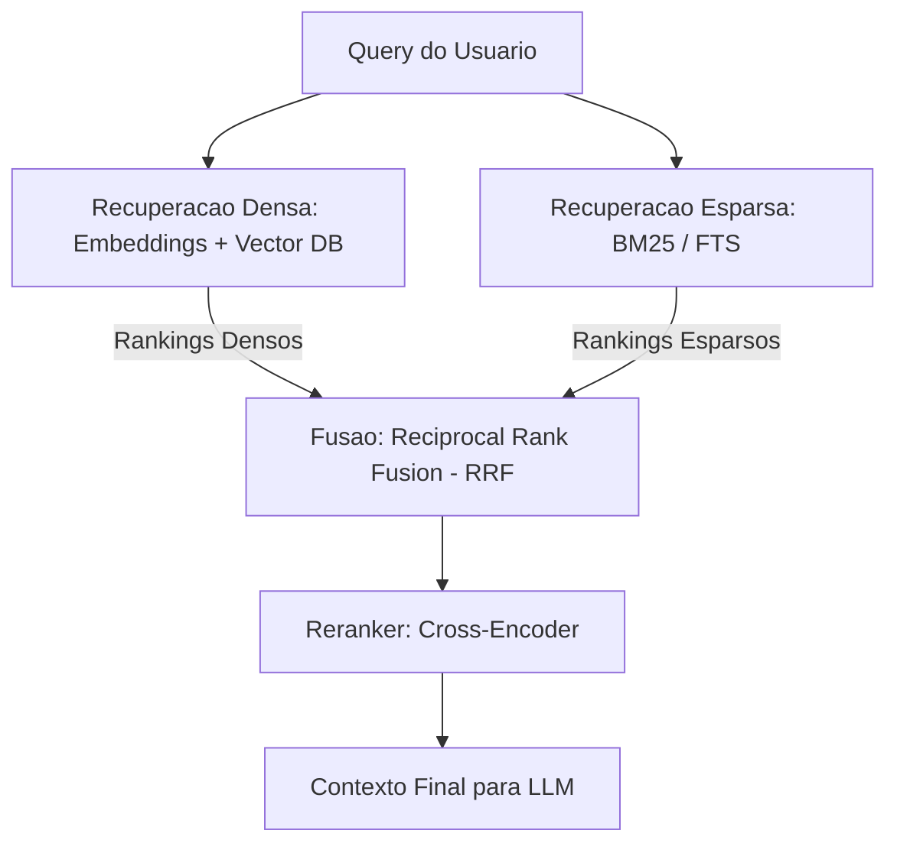
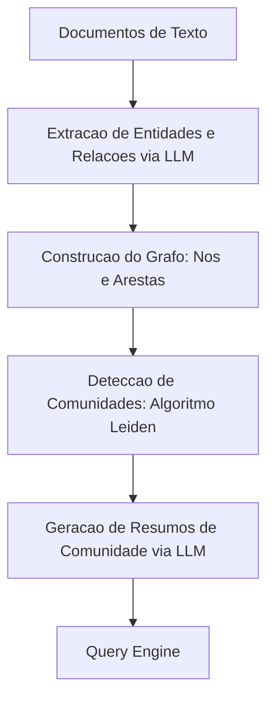

# RAG Avancado e GraphRAG: Recuperacao Hibrida e Indexacao Semantica

O RAG (Retrieval-Augmented Generation) convencional — baseado em busca vetorial direta (K-vizinhos mais proximos) sobre blocos de texto (chunks) — enfrenta barreiras criticas: perda de relacoes globais no texto, incapacidade de responder a perguntas holisticas e imprecisao na correspondencia exata de termos tecnicos ou codigos. Para superar essas limitacoes, projetam-se arquiteturas avançadas de RAG Hibrido e sistemas baseados em grafos de conhecimento (**GraphRAG**).

---

## 1. Recuperacao Hibrida (Dense + Sparse Search)

A busca hibrida combina a compreensao conceitual/semantica dos embeddings densos com a precisao de palavras-chave exatas das buscas esparsas tradicionais.



### A. Recuperacao Densa (Dense Retrieval)
* **Como funciona**: Mapeia trechos de texto em vetores de alta dimensao (ex: 1536 dimensoes usando `text-embedding-3-small`). A busca e feita calculando a similaridade de cosseno ou produto escalar entre a query e os documentos.
* **Vantagem**: Entende sinonimos, contexto implicito e intencao semantica.
* **Desvantagem**: Falha em encontrar identificadores especificos (ex: `CVE-2026-4491`, ids de banco de dados, nomes de classes muito especificos).

### B. Recuperacao Esparsa (Sparse Retrieval)
* **Como funciona**: Usa representacoes esparsas baseadas na frequencia dos termos. O algoritmo mais comum e o **BM25** (uma evolucao do TF-IDF).
* **Vantagem**: Excelente precisao para palavras exatas, codigos de erro, identificadores e nomes proprios.
* **Desvantagem**: Ignora a semantica (ex: se a query contem "automovel" e o documento contem "carro", nao ha correspondencia).

### C. Reciprocal Rank Fusion (RRF)
Para unificar os resultados obtidos pelas duas vias de busca sem distorcoes causadas pelas escalas de pontuacao diferentes (similaridade de cosseno vs score BM25), utiliza-se o algoritmo **RRF**. Ele calcula a relevancia baseando-se apenas na *posicao* (rank) do documento em cada busca.

A formula do score RRF para um documento $d$ e:
$$RRF\_Score(d) = \sum_{m \in M} \frac{1}{k + r_m(d)}$$

Onde:
* $M$ e o conjunto de sistemas de busca (neste caso, densa e esparsa).
* $r_m(d)$ e a classificacao (ranking) do documento $d$ no sistema de busca $m$ (1 para o primeiro colocado, 2 para o segundo, etc.).
* $k$ e uma constante de suavizacao (geralmente fixada em 60).

### Codigo Pratico (Python): Implementacao de RRF

```python
def reciprocal_rank_fusion(dense_results: list, sparse_results: list, k: int = 60) -> list:
    """
    Combina dois rankings de busca usando Reciprocal Rank Fusion (RRF).
    Resultados de entrada sao listas de dicionarios contendo o ID do documento.
    """
    rrf_scores = {}
    
    # Processar resultados da busca densa
    for rank, doc in enumerate(dense_results, start=1):
        doc_id = doc["id"]
        rrf_scores[doc_id] = rrf_scores.get(doc_id, 0.0) + (1.0 / (k + rank))
        
    # Processar resultados da busca esparsa
    for rank, doc in enumerate(sparse_results, start=1):
        doc_id = doc["id"]
        rrf_scores[doc_id] = rrf_scores.get(doc_id, 0.0) + (1.0 / (k + rank))
        
    # Ordenar documentos pelo score decrescente
    sorted_docs = sorted(rrf_scores.items(), key=lambda item: item[1], reverse=True)
    return sorted_docs
```

---

## 2. GraphRAG: Indexacao Baseada em Entidades e Relacionamentos

Desenvolvido comercialmente pela Microsoft, o **GraphRAG** resolve uma falha grave do RAG tradicional: perguntas que exigem agregacao global (ex: "Quais sao os temas principais deste documento de 100 paginas?"). Em vez de simplesmente fatiar o texto em chunks isolados, o GraphRAG constroi um Grafo de Conhecimento (Knowledge Graph) estruturado.



### O Pipeline do GraphRAG:
1. **Extracao de Entidades e Relacoes**: O LLM processa o texto para extrair entidades (pessoas, locais, conceitos, tecnologias) e os relacionamentos entre elas (como estao conectadas).
2. **Deteccao de Comunidades**: Algoritmos de clustering de grafos (geralmente o **Algoritmo Leiden**) agrupam entidades muito conectadas em "comunidades" em niveis hierarquicos.
3. **Resumos de Comunidade**: Um LLM e instruido a ler todas as entidades e relacoes de uma comunidade e gerar um resumo consolidado em formato Markdown.
4. **Query Engine (Busca Local vs Global)**:
   - **Busca Local**: Focada em entidades especificas. Busca entidades relacionadas a query no grafo e injeta suas fichas e relacoes no prompt.
   - **Busca Global**: Focada em perguntas abstratas ou agregadas. O sistema consulta diretamente os *Resumos de Comunidade* pré-compilados para sintetizar a resposta geral, sem precisar varrer todos os chunks individuais.

---

## 3. Traducao de Query (Query Translation)

Muitas vezes, a query original do usuario nao e ideal para busca vetorial direta. Tecnicas de traducao reescrevem ou expandem a pergunta original antes de acionar a busca:

| Tecnica | Descricao | Caso de Uso | Exemplo de Prompt/Estrutura |
| :--- | :--- | :--- | :--- |
| **Query Expansion** | Gera multiplas variantes da pergunta original ou busca sinonimos. | Superar vocabulario restrito do usuario. | "Gere 3 formas alternativas de perguntar: {query}" |
| **Query Decomposition** | Divide uma pergunta complexa (multi-hop) em varias sub-queries mais faceis. | Perguntas que exigem comparacao ou multiplas etapas. | Original: "Qual framework e mais rapido, FastAPI ou Django, e qual consome menos RAM?" -> Sub1: "FastAPI vs Django velocidade benchmark", Sub2: "FastAPI vs Django consumo RAM". |
| **HyDE** *(Hypothetical Document Embeddings)* | O LLM gera uma resposta hipotetica (mesmo com alucinacoes) para a query. O embedding dessa resposta hipotetica e usado para buscar os documentos reais. | Alinha o espaco vetorial da query (curta, interrogativa) com o espaco vetorial dos documentos (longos, afirmativos). | "Escreva uma passagem hipotetica respondendo a pergunta: {query}" |
| **Step-back Prompting** | Gera uma pergunta mais generica e conceitual baseada na query especifica. | Resolver problemas de alto nivel com principios fundamentais. | Original: "Como configuro a porta no Docker Compose do PostgreSQL?" -> Step-back: "Como gerenciar mapeamento de portas e variaveis no Docker Compose?" |

---

## 4. Rerankers (Cross-Encoders)

A busca vetorial inicial e tipicamente realizada usando **Bi-encoders**, onde a query e os documentos sao convertidos em embeddings de forma independente e comparados por cosseno. Isso e extremamente rapido, mas perde nuance semantica.

Os **Rerankers (Cross-encoders)** recebem o par `(Query, Documento)` simultaneamente e processam ambos juntos atraves do modelo de linguagem (ex: Cohere Rerank, BGE-Reranker). Isso permite atencao cruzada total entre cada palavra da query e cada palavra do documento, gerando uma nota de relevancia incrivelmente precisa.

```
Query + Doc 1  -->  [Cross-Encoder]  -->  Score: 0.98 (Altissima Relevancia)
Query + Doc 2  -->  [Cross-Encoder]  -->  Score: 0.12 (Baixa Relevancia)
```

Como os Cross-encoders sao computacionalmente caros, a arquitetura padrao e o **pipeline de funil**:
1. Busca 100 documentos usando busca hibrida (rapida e barata).
2. Reduz os 100 documentos para 5 ou 10 candidatos usando um **Reranker** (preciso e focado).
3. Envia os 5 finalistas no prompt para o LLM gerador.

---

## 5. Cache Semantico (Semantic Caching)

Para sistemas de producao, processar repetidamente queries semelhantes consome recursos financeiros e gera latencia. Diferente do cache tradicional (que exige correspondencia exata de strings), o **Cache Semantico** detecta se a nova pergunta e semanticamente equivalente a uma ja respondida.

```python
import numpy as np

class SemanticCache:
    def __init__(self, threshold: float = 0.90):
        # Armazena tuplas: (query_embedding, resposta_salva)
        self.cache = []
        self.threshold = threshold

    def _cosine_similarity(self, v1, v2):
        return np.dot(v1, v2) / (np.linalg.norm(v1) * np.linalg.norm(v2))

    def lookup(self, query_embedding):
        for saved_embedding, response in self.cache:
            similarity = self._cosine_similarity(query_embedding, saved_embedding)
            if similarity >= self.threshold:
                return response  # Cache HIT
        return None  # Cache MISS

    def store(self, query_embedding, response):
        self.cache.append((query_embedding, response))
```

### Beneficios do Cache Semantico:
* **Latencia zero**: Resposta instantanea para perguntas recorrentes de usuarios.
* **Reducao de custos**: Economiza chamadas de LLMs comerciais (GPT-4o) e consultas pesadas de grafos (GraphRAG).

---

## Conexoes do Vault
* [[skills/04-knowledge-systems/INDEX|Indice de Sistemas de Conhecimento]]
* [[skills/04-knowledge-systems/advanced-rag-strategies|Estrategias Avancadas de RAG]]
* [[skills/04-knowledge-systems/memory-management|Gestao de Memoria Long-Term]]
* [[skills/01-agentic-intelligence/crewai-autogen-langgraph|Arquiteturas Multi-Agente: CrewAI, AutoGen e LangGraph]]
* [[skills/01-agentic-intelligence/avaliacao-seguranca-de-agentes|Avaliacao e Seguranca de Agentes de IA]]
