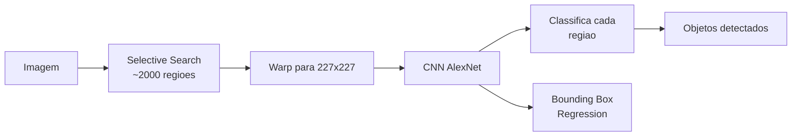

# Computer Vision

## O que e Visao Computacional?

Visao computacional e o campo da inteligencia artificial que treina computadores para interpretar e entender o mundo visual. Maquinas convertem imagens e videos em dados estruturados que podem ser usados para tomar decisoes.

### Problemas Fundamentais

| Problema | Descricao | Exemplo |
|----------|-----------|---------|
| **Classificacao** | Atribuir um rotulo a imagem inteira | "Isso e um gato ou um cachorro?" |
| **Deteccao** | Localizar e classificar objetos | "Onde estao os carros nesta imagem?" |
| **Segmentacao** | Classificar cada pixel | "Quais pixels pertencem a estrada?" |
| **Estimacao de pose** | Identificar posicao de partes do corpo | "Onde estao os joelhos desta pessoa?" |
| **Reconstrucao 3D** | Inferir estrutura 3D de imagens 2D | "Qual a forma deste objeto?" |
| **Reconhecimento facial** | Identificar ou verificar identidade | "Quem e essa pessoa?" |
| **OCR** | Extrair texto de imagens | "Quais caracteres estao escritos nesta placa?" |

## Convolucoes e CNNs

### Operacao de Convolucao

A convolucao e a operacao fundamental de uma CNN. Um kernel (filtro) desliza sobre a imagem de entrada realizando o produto elemento-a-elemento e somando os resultados.

```
Entrada (5x5)         Kernel (3x3)         Saida (3x3)
┌─────────────┐      ┌─────────┐         ┌─────────┐
│ 1 1 1 0 0   │      │ 1 0 1   │         │ 4 3 4   │
│ 0 1 1 1 0   │  *  │ 0 1 0   │    =    │ 2 4 3   │
│ 0 0 1 1 1   │      │ 1 0 1   │         │ 2 3 4   │
│ 0 0 1 1 0   │      └─────────┘         └─────────┘
│ 0 1 1 0 0   │
└─────────────┘

Calculo do pixel (0,0):
(1*1 + 1*0 + 1*1) + (0*0 + 1*1 + 1*0) + (0*1 + 0*0 + 1*1) = 1+0+1+0+1+0+0+0+1 = 4
```

```python
import numpy as np

def convolve2d(image: np.ndarray, kernel: np.ndarray) -> np.ndarray:
    """Convolucao 2D manual."""
    h, w = image.shape
    kh, kw = kernel.shape
    pad_h, pad_w = kh // 2, kw // 2
    padded = np.pad(image, ((pad_h, pad_h), (pad_w, pad_w)), mode='constant')
    output = np.zeros((h, w))
    for i in range(h):
        for j in range(w):
            output[i, j] = np.sum(padded[i:i+kh, j:j+kw] * kernel)
    return output
```

### Pooling

Reduz a dimensionalidade espacial mantendo as features mais importantes.

```python
def max_pool2d(x: np.ndarray, pool_size: int = 2) -> np.ndarray:
    """Max pooling com stride = pool_size."""
    h, w = x.shape
    return x.reshape(h // pool_size, pool_size, w // pool_size, pool_size).max(axis=(1, 3))

# Entrada (4x4) -> Max Pool 2x2 -> Saida (2x2)
# ┌─ ─ ─ ─┐         ┌─ ─ ─┐
# │ 1 2 3 4│         │ 4 8  │
# │ 5 6 7 8│  ───→  │ 12 16│
# │ 9 10 11 12│      └─ ─ ─┘
# │ 13 14 15 16│
# └─ ─ ─ ─┘
```

### Arquiteturas Classicas de CNN

#### LeNet-5 (1998)

Primeira CNN de sucesso, desenvolvida por Yann LeCun para reconhecimento de digitos manuscritos (MNIST).

```
Input: 32x32x1
  → Conv 5x5 (6 filtros) → Avg Pool 2x2
  → Conv 5x5 (16 filtros) → Avg Pool 2x2
  → FC 120 → FC 84 → Output 10 (Softmax)
```

#### AlexNet (2012)

Revolucionou a visao computacional ao vencer a ImageNet com grande margem.

```python
import torch.nn as nn

class AlexNet(nn.Module):
    def __init__(self, num_classes=1000):
        super().__init__()
        self.features = nn.Sequential(
            nn.Conv2d(3, 64, kernel_size=11, stride=4, padding=2),
            nn.ReLU(inplace=True),
            nn.MaxPool2d(kernel_size=3, stride=2),
            nn.Conv2d(64, 192, kernel_size=5, padding=2),
            nn.ReLU(inplace=True),
            nn.MaxPool2d(kernel_size=3, stride=2),
            nn.Conv2d(192, 384, kernel_size=3, padding=1),
            nn.ReLU(inplace=True),
            nn.Conv2d(384, 256, kernel_size=3, padding=1),
            nn.ReLU(inplace=True),
            nn.Conv2d(256, 256, kernel_size=3, padding=1),
            nn.ReLU(inplace=True),
            nn.MaxPool2d(kernel_size=3, stride=2),
        )
        self.classifier = nn.Sequential(
            nn.Dropout(p=0.5),
            nn.Linear(256 * 6 * 6, 4096),
            nn.ReLU(inplace=True),
            nn.Dropout(p=0.5),
            nn.Linear(4096, 4096),
            nn.ReLU(inplace=True),
            nn.Linear(4096, num_classes),
        )

    def forward(self, x):
        x = self.features(x)
        x = x.view(x.size(0), -1)
        x = self.classifier(x)
        return x
```

#### VGG (2014)

Arquitetura simples e profunda usando apenas kernels 3x3 empilhados.

```
VGG16:
  [Conv3x3 - Conv3x3 - Pool] x 2   → 64 filtros
  [Conv3x3 - Conv3x3 - Pool] x 2   → 128 filtros
  [Conv3x3 - Conv3x3 - Conv3x3 - Pool] x 3  → 256 filtros
  [Conv3x3 - Conv3x3 - Conv3x3 - Pool] x 3  → 512 filtros
  [Conv3x3 - Conv3x3 - Conv3x3 - Pool] x 3  → 512 filtros
  FC 4096 → FC 4096 → FC 1000 (Softmax)
```

#### ResNet (2015)

Introduziu skip connections (conexoes residuais) que permitem treinar redes muito profundas (152 camadas) sem degradacao.

```python
class ResidualBlock(nn.Module):
    """Bloco residual basico para ResNet-34."""
    def __init__(self, in_channels, out_channels, stride=1):
        super().__init__()
        self.conv1 = nn.Conv2d(in_channels, out_channels, 3, stride, padding=1, bias=False)
        self.bn1 = nn.BatchNorm2d(out_channels)
        self.conv2 = nn.Conv2d(out_channels, out_channels, 3, padding=1, bias=False)
        self.bn2 = nn.BatchNorm2d(out_channels)
        self.shortcut = nn.Sequential()
        if stride != 1 or in_channels != out_channels:
            self.shortcut = nn.Sequential(
                nn.Conv2d(in_channels, out_channels, 1, stride, bias=False),
                nn.BatchNorm2d(out_channels),
            )

    def forward(self, x):
        residual = self.shortcut(x)
        out = torch.relu(self.bn1(self.conv1(x)))
        out = self.bn2(self.conv2(out))
        out += residual  # Skip connection
        return torch.relu(out)
```

## Deteccao de Objetos

### R-CNN (Region-based CNN)



**Evolucao**: R-CNN → Fast R-CNN (RoI Pooling) → Faster R-CNN (RPN) → Mask R-CNN

- **R-CNN**: Lento (~40s por imagem), 2k propostas por imagem
- **Fast R-CNN**: ~2s por imagem, RoI Pooling compartilhado
- **Faster R-CNN**: ~0.2s por imagem, Region Proposal Network integrada

### YOLO (You Only Look Once)

Detector de um estagio que trata deteccao como um problema de regressao.

```python
# YOLO divide a imagem em grid SxS
# Cada celula prediz B bounding boxes + confidence + C classes
# Output tensor: S x S x (B * 5 + C)

import torch

def yolo_loss(predictions, targets, S=7, B=2, C=20, lambda_coord=5, lambda_noobj=0.5):
    """Funcao de perda do YOLOv1 simplificada."""
    pred_classes = predictions[..., :C]
    pred_conf = predictions[..., C:C+B]
    pred_boxes = predictions[..., C+B:]

    target_classes = targets[..., :C]
    target_conf = targets[..., C:C+B]
    target_boxes = targets[..., C+B:]

    # Mascara de objetos presentes
    obj_mask = target_conf.sum(dim=-1) > 0

    # Perda de classificacao
    cls_loss = nn.MSELoss()(pred_classes[obj_mask], target_classes[obj_mask])

    # Perda de coordenadas (bounding box)
    coord_loss = lambda_coord * nn.MSELoss()(
        pred_boxes[obj_mask], target_boxes[obj_mask]
    )

    # Perda de confianca
    obj_conf_loss = nn.MSELoss()(pred_conf[obj_mask], target_conf[obj_mask])
    noobj_conf_loss = lambda_noobj * nn.MSELoss()(
        pred_conf[~obj_mask], target_conf[~obj_mask]
    )

    return cls_loss + coord_loss + obj_conf_loss + noobj_conf_loss
```

**YOLO v8 (Ultralytics)** - Versao moderna mais usada:

```python
from ultralytics import YOLO

# Treinar
model = YOLO('yolov8n.pt')
results = model.train(
    data='coco128.yaml',
    epochs=50,
    imgsz=640,
    batch=16,
    augment=True,
    patience=10,
)

# Inferencia
results = model('imagem.jpg')
for r in results:
    for box in r.boxes:
        print(f"Classe: {model.names[int(box.cls)]}")
        print(f"Confianca: {float(box.conf):.3f}")
        print(f"BBox: {box.xyxytolist2}")
```

### SSD (Single Shot Detector)

Detector multi-escala que usa feature maps de diferentes profundidades.

```
Input → Conv1 → Conv2 → Conv3 → Conv4 → Conv5 → Conv6 → Conv7
         │        │        │       │       │       │       │
   Feature maps: 38x38   19x19   10x10    5x5     3x3     1x1
                  ├───────┴───────┴───────┴───────┴───────┴──
                  ↓
         Deteccoes: 8732 boxes por imagem
```

**Comparacao**:

| Modelo | mAP (COCO) | FPS (T4) | Tamanho | Caracteristica |
|--------|-----------|----------|---------|----------------|
| YOLOv8n | 37.3 | 80 | 6.3 MB | Leve, ideal edge |
| YOLOv8x | 53.9 | 8 | 136 MB | Maxima precisao |
| SSD300 | 25.1 | 46 | ~100 MB | Legado, ainda usado |
| Faster R-CNN ResNet50 | 37.4 | 5 | ~150 MB | Two-stage, preciso |
| DETR | 42.0 | 28 | ~160 MB | Transformer-based |
| RT-DETR | 53.0 | 108 | ~65 MB | Real-time transformer |

## Segmentacao Semantica e Instance

### Segmentacao Semantica vs. Instance

- **Segmentacao semantica**: rotular cada pixel com uma classe (e.g., todos os carros sao "carro")
- **Segmentacao de instancia**: rotular cada pixel e distinguir objetos individuais (e.g., "carro 1", "carro 2")
- **Segmentacao panoptica**: semantica + instance combinadas (coisas + stuff)

### U-Net

Arquitetura encoder-decoder para segmentacao biomedica.

```python
class UNet(nn.Module):
    def __init__(self, in_channels=3, out_channels=1):
        super().__init__()
        # Encoder (contraction path)
        self.enc1 = self._block(in_channels, 64)
        self.enc2 = self._block(64, 128)
        self.enc3 = self._block(128, 256)
        self.enc4 = self._block(256, 512)
        self.pool = nn.MaxPool2d(2)

        # Bridge
        self.bridge = self._block(512, 1024)

        # Decoder (expansion path)
        self.up1 = nn.ConvTranspose2d(1024, 512, 2, stride=2)
        self.dec1 = self._block(1024, 512)
        self.up2 = nn.ConvTranspose2d(512, 256, 2, stride=2)
        self.dec2 = self._block(512, 256)
        self.up3 = nn.ConvTranspose2d(256, 128, 2, stride=2)
        self.dec3 = self._block(256, 128)
        self.up4 = nn.ConvTranspose2d(128, 64, 2, stride=2)
        self.dec4 = self._block(128, 64)

        self.out = nn.Conv2d(64, out_channels, 1)

    def _block(self, in_ch, out_ch):
        return nn.Sequential(
            nn.Conv2d(in_ch, out_ch, 3, padding=1),
            nn.BatchNorm2d(out_ch),
            nn.ReLU(inplace=True),
            nn.Conv2d(out_ch, out_ch, 3, padding=1),
            nn.BatchNorm2d(out_ch),
            nn.ReLU(inplace=True),
        )

    def forward(self, x):
        # Encoder
        e1 = self.enc1(x); p1 = self.pool(e1)
        e2 = self.enc2(p1); p2 = self.pool(e2)
        e3 = self.enc3(p2); p3 = self.pool(e3)
        e4 = self.enc4(p3); p4 = self.pool(e4)

        # Bridge
        b = self.bridge(p4)

        # Decoder com skip connections
        d1 = self.up1(b); d1 = torch.cat([d1, e4], dim=1); d1 = self.dec1(d1)
        d2 = self.up2(d1); d2 = torch.cat([d2, e3], dim=1); d2 = self.dec2(d2)
        d3 = self.up3(d2); d3 = torch.cat([d3, e2], dim=1); d3 = self.dec3(d3)
        d4 = self.up4(d3); d4 = torch.cat([d4, e1], dim=1); d4 = self.dec4(d4)

        return torch.sigmoid(self.out(d4))
```

### Mask R-CNN

Extensao do Faster R-CNN que adiciona um branch de segmentacao.

```python
import torchvision
from torchvision.models.detection import maskrcnn_resnet50_fpn

model = maskrcnn_resnet50_fpn(pretrained=True)
model.eval()

# Inferencia
image = load_image('pessoas_carro.jpg')
with torch.no_grad():
    predictions = model([image])

# Resultados
for pred in predictions:
    for i, score in enumerate(pred['scores']):
        if score > 0.5:
            mask = pred['masks'][i, 0].numpy()
            box = pred['boxes'][i].numpy()
            label = pred['labels'][i].item()
            print(f"Objeto {i}: score={score:.3f}, box={box}")
            # mask e um array 2D binario
```

## Vision Transformers (ViT)

### Como Transformers Revolucionaram a Visao

O ViT (Dosovitskiy et al., 2021) aplica a arquitetura Transformer diretamente a patches da imagem, eliminando a necessidade de convolucoes.

```
Imagem 224x224x3
  → Dividir em patches 16x16
  → 196 patches de 16x16x3 = 768 cada
  → Linear projection para embedding D
  → Adicionar positional embeddings
  → Transformer Encoder (L camadas)
  → MLP Head para classificacao
```

```python
class PatchEmbedding(nn.Module):
    """Divide a imagem em patches e projeta para embeddings."""
    def __init__(self, img_size=224, patch_size=16, in_channels=3, embed_dim=768):
        super().__init__()
        self.num_patches = (img_size // patch_size) ** 2
        self.proj = nn.Conv2d(in_channels, embed_dim,
                              kernel_size=patch_size, stride=patch_size)

    def forward(self, x):
        x = self.proj(x)  # (B, D, H/P, W/P)
        x = x.flatten(2).transpose(1, 2)  # (B, num_patches, D)
        return x

class ViT(nn.Module):
    def __init__(self, img_size=224, patch_size=16, in_channels=3,
                 embed_dim=768, depth=12, num_heads=12, num_classes=1000):
        super().__init__()
        self.patch_embed = PatchEmbedding(img_size, patch_size, in_channels, embed_dim)
        self.cls_token = nn.Parameter(torch.randn(1, 1, embed_dim))
        self.pos_embed = nn.Parameter(torch.randn(1, self.patch_embed.num_patches + 1, embed_dim))
        self.blocks = nn.ModuleList([
            nn.TransformerEncoderLayer(embed_dim, num_heads, dim_feedforward=embed_dim*4)
            for _ in range(depth)
        ])
        self.norm = nn.LayerNorm(embed_dim)
        self.head = nn.Linear(embed_dim, num_classes)

    def forward(self, x):
        B = x.shape[0]
        x = self.patch_embed(x)
        cls_token = self.cls_token.expand(B, -1, -1)
        x = torch.cat([cls_token, x], dim=1)
        x = x + self.pos_embed
        for block in self.blocks:
            x = block(x)
        x = self.norm(x)
        return self.head(x[:, 0])  # Classifica usando [CLS] token
```

**Principais Modelos ViT**:

| Modelo | Parametros | ImageNet Top-1 | Diferencial |
|--------|-----------|----------------|-------------|
| ViT-B/16 | 86M | 77.9% | Pioneiro, baseline |
| ViT-L/16 | 307M | 76.5% | Maior, requer mais dados |
| DeiT-S | 22M | 79.8% | Data-efficient (distillacao) |
| Swin-T | 28M | 81.1% | Hierarquico, janelas deslocadas |
| ConvNeXt | 28M | 82.0% | CNN modernizada (conv equivalente) |
| DINOv2 | 1.1B | 86.3% | Self-supervised, features genericas |
| SAM (Meta) | 632M | — | Segment Anything Model |

**Por que ViT funciona**:
- Self-attention global captura relacoes de longo alcance desde o inicio
- Escalabilidade: ViT melhora com mais dados (JFT-300M)
- Transfer learning eficaz para tarefas downstream
- Arquitetura unificada NLP + CV permite multi-modal

## Tecnicas Avancadas

### Data Augmentation

Aumentar a diversidade do dataset de treino sem coletar novos dados.

```python
import albumentations as A
import cv2

train_transform = A.Compose([
    A.RandomResizedCrop(height=224, width=224, scale=(0.08, 1.0)),
    A.HorizontalFlip(p=0.5),
    A.ColorJitter(brightness=0.2, contrast=0.2, saturation=0.2, hue=0.1),
    A.GaussianBlur(blur_limit=(3, 7), p=0.2),
    A.RandomBrightnessContrast(p=0.2),
    A.Normalize(mean=[0.485, 0.456, 0.406], std=[0.229, 0.224, 0.225]),
    A.CoarseDropout(max_holes=8, max_height=32, max_width=32, p=0.3),
])

test_transform = A.Compose([
    A.Resize(256, 256),
    A.CenterCrop(224, 224),
    A.Normalize(mean=[0.485, 0.456, 0.406], std=[0.229, 0.224, 0.225]),
])
```

### Transfer Learning

Usar pesos pre-treinados em datasets grandes (ImageNet) e adaptar para sua tarefa.

```python
# Carregar modelo pre-treinado e substituir a cabeça de classificacao
import torchvision.models as models

model = models.resnet50(weights=models.ResNet50_Weights.IMAGENET1K_V2)

# Congelar base (feature extractor)
for param in model.parameters():
    param.requires_grad = False

# Substituir classifier para 10 classes
num_features = model.fc.in_features
model.fc = nn.Sequential(
    nn.Dropout(0.3),
    nn.Linear(num_features, 256),
    nn.ReLU(),
    nn.Linear(256, 10),
)

# Descongelar gradualmente para fine-tuning
def unfreeze_layers(model, num_layers=0):
    """Descongela as ultimas num_layers camadas."""
    layers = list(model.children())[:-1]
    for layer in layers[-num_layers:]:
        for param in layer.parameters():
            param.requires_grad = True
```

### Fine-Tuning Estrategico

```python
from torch.optim import AdamW
from torch.optim.lr_scheduler import CosineAnnealingLR

# Descongelar progressivamente (gradual unfreezing)
unfreeze_layers(model, num_layers=2)

optimizer = AdamW([
    {'params': model.fc.parameters(), 'lr': 1e-3},
    {'params': model.layer4.parameters(), 'lr': 5e-5},
], weight_decay=0.01)

scheduler = CosineAnnealingLR(optimizer, T_max=20)

# Treinar com discriminative learning rates
for epoch in range(epochs):
    for images, labels in dataloader:
        outputs = model(images)
        loss = nn.CrossEntropyLoss()(outputs, labels)
        loss.backward()
        torch.nn.utils.clip_grad_norm_(model.parameters(), max_norm=1.0)
        optimizer.step()
        scheduler.step()
```

## Ferramentas

### OpenCV

OpenCV e a biblioteca classica de visao computacional para processamento de imagens.

```python
import cv2
import numpy as np

# Leitura e exibicao
img = cv2.imread('foto.jpg')
gray = cv2.cvtColor(img, cv2.COLOR_BGR2GRAY)

# Filtros classicos
blur = cv2.GaussianBlur(gray, (5, 5), 1.5)
edges = cv2.Canny(gray, 50, 150)  # Deteccao de bordas

# Deteccao de faces (Haar Cascade)
face_cascade = cv2.CascadeClassifier(cv2.data.haarcascades + 'haarcascade_frontalface_default.xml')
faces = face_cascade.detectMultiScale(gray, 1.1, 4)
for (x, y, w, h) in faces:
    cv2.rectangle(img, (x, y), (x+w, y+h), (0, 255, 0), 2)

# Deteccao de features (SIFT)
sift = cv2.SIFT_create()
keypoints, descriptors = sift.detectAndCompute(gray, None)
img_kp = cv2.drawKeypoints(img, keypoints, None)

# Homografia / Alinhamento
def align_images(img1, img2):
    """Alinha img2 a img1 usando homografia."""
    sift = cv2.SIFT_create()
    kp1, des1 = sift.detectAndCompute(img1, None)
    kp2, des2 = sift.detectAndCompute(img2, None)
    bf = cv2.BFMatcher()
    matches = bf.knnMatch(des1, des2, k=2)
    good = [m for m, n in matches if m.distance < 0.75 * n.distance]
    src_pts = np.float32([kp1[m.queryIdx].pt for m in good]).reshape(-1, 1, 2)
    dst_pts = np.float32([kp2[m.trainIdx].pt for m in good]).reshape(-1, 1, 2)
    M, mask = cv2.findHomography(src_pts, dst_pts, cv2.RANSAC, 5.0)
    return cv2.warpPerspective(img2, M, (img1.shape[1], img1.shape[0]))

# Limiarizacao (thresholding)
_, binary = cv2.threshold(gray, 127, 255, cv2.THRESH_BINARY)
adaptive = cv2.adaptiveThreshold(gray, 255, cv2.ADAPTIVE_THRESH_GAUSSIAN_C,
                                 cv2.THRESH_BINARY, 11, 2)

# Morfologia
kernel = np.ones((5, 5), np.uint8)
erosion = cv2.erode(binary, kernel, iterations=1)
dilation = cv2.dilate(binary, kernel, iterations=1)
opening = cv2.morphologyEx(binary, cv2.MORPH_OPEN, kernel)
closing = cv2.morphologyEx(binary, cv2.MORPH_CLOSE, kernel)
```

### PyTorch + Torchvision

```python
import torch
import torchvision.transforms as T
from torch.utils.data import Dataset, DataLoader
from torchvision.datasets import ImageFolder
from PIL import Image
import os

class ImovelDataset(Dataset):
    """Dataset personalizado para classificacao de fotos de imoveis."""
    def __init__(self, root_dir, transform=None):
        self.samples = []
        self.transform = transform or T.Compose([
            T.Resize((224, 224)),
            T.ToTensor(),
            T.Normalize(mean=[0.485, 0.456, 0.406], std=[0.229, 0.224, 0.225]),
        ])
        # Estrutura: root_dir/{condominio, casa, apto}/*.jpg
        for label, class_name in enumerate(sorted(os.listdir(root_dir))):
            class_dir = os.path.join(root_dir, class_name)
            for fname in os.listdir(class_dir):
                if fname.lower().endswith(('.jpg', '.jpeg', '.png')):
                    self.samples.append((os.path.join(class_dir, fname), label))

    def __len__(self): return len(self.samples)

    def __getitem__(self, idx):
        path, label = self.samples[idx]
        image = Image.open(path).convert('RGB')
        return self.transform(image), label

# DataLoaders
train_data = ImovelDataset('data/imoveis/train')
train_loader = DataLoader(train_data, batch_size=32, shuffle=True, num_workers=4)
```

### YOLO Framework (Ultralytics)

```python
# Deteccao e segmentacao com YOLOv8
from ultralytics import YOLO

# Modelos disponiveis
# deteccao: yolov8n.pt, yolov8s.pt, yolov8m.pt, yolov8l.pt, yolov8x.pt
# segmentacao: yolov8n-seg.pt, yolov8x-seg.pt
# pose: yolov8n-pose.pt

model = YOLO('yolov8n.pt')

# Treino customizado
results = model.train(
    data='dataset.yaml',  # COCO format dataset
    epochs=100,
    imgsz=640,
    batch=16,
    optimizer='AdamW',
    lr0=0.001,
    augment=True,
    patience=20,
    project='meu_modelo',  # Logs em runs/detect/meu_modelo
    device='cuda',
    val=True,
)

# Exportacao para diferentes formatos
model.export(format='onnx')
model.export(format='tflite')
model.export(format='ncnn')  # Para dispositivos moveis

# Inferencia em producao
model = YOLO('meu_modelo/weights/best.pt')
results = model('video.mp4', stream=True)
for result in results:
    # Plot bounding boxes
    for box in result.boxes:
        x1, y1, x2, y2 = box.xyxyn.tolist()[0]
        conf, cls = box.conf[0].item(), box.cls[0].item()
        print(f"Detectado: {model.names[cls]} ({conf:.3f})")
```

## Aplicacoes Praticas

### Reconhecimento Facial

```python
import face_recognition  # Wrapper do dlib
import numpy as np

# Cadastrar faces conhecidas
known_encodings = []
known_names = []

def register_face(image_path, name):
    image = face_recognition.load_image_file(image_path)
    encodings = face_recognition.face_encodings(image)
    if encodings:
        known_encodings.append(encodings[0])
        known_names.append(name)

# Reconhecer em tempo real
def recognize_faces(frame):
    rgb = cv2.cvtColor(frame, cv2.COLOR_BGR2RGB)
    face_locations = face_recognition.face_locations(rgb)
    face_encodings = face_recognition.face_encodings(rgb, face_locations)

    for (top, right, bottom, left), encoding in zip(face_locations, face_encodings):
        matches = face_recognition.compare_faces(known_encodings, encoding, tolerance=0.5)
        distances = face_recognition.face_distance(known_encodings, encoding)

        if True in matches:
            best_match_idx = np.argmin(distances)
            name = known_names[best_match_idx]
        else:
            name = "Desconhecido"

        cv2.rectangle(frame, (left, top), (right, bottom), (0, 255, 0), 2)
        cv2.putText(frame, name, (left, top - 10),
                    cv2.FONT_HERSHEY_SIMPLEX, 0.9, (0, 255, 0), 2)
    return frame
```

### OCR com Tesseract + EasyOCR

```python
import pytesseract
import easyocr
import re

# Tesseract offline
def extract_text_tesseract(image_path):
    img = cv2.imread(image_path)
    gray = cv2.cvtColor(img, cv2.COLOR_BGR2GRAY)
    _, thresh = cv2.threshold(gray, 150, 255, cv2.THRESH_BINARY)
    text = pytesseract.image_to_string(thresh, lang='por')
    return text

# EasyOCR (deep learning)
reader = easyocr.Reader(['pt', 'en'])

def extract_text_easyocr(image_path):
    results = reader.readtext(image_path, detail=1)
    texts = []
    for (bbox, text, confidence) in results:
        if confidence > 0.5:
            texts.append({
                'text': text,
                'confidence': confidence,
                'bbox': bbox,
            })
    return texts

# Extrair CPF de documentos
def extract_cpf(text):
    cpf_pattern = r'\d{3}\.\d{3}\.\d{3}-\d{2}'
    matches = re.findall(cpf_pattern, text)
    return matches

# Pipeline para extrator de documentos
def process_document(image_path):
    ocr_results = extract_text_easyocr(image_path)
    full_text = ' '.join([r['text'] for r in ocr_results])
    return {
        'raw_text': full_text,
        'cpfs': extract_cpf(full_text),
        'phones': re.findall(r'\(\d{2}\)\s?\d{4,5}-\d{4}', full_text),
        'dates': re.findall(r'\d{2}/\d{2}/\d{4}', full_text),
    }
```

### Carros Autonomos (Pipeline Basico)

```python
class AutonomousDrivingPipeline:
    def __init__(self):
        self.detector = YOLO('yolov8n.pt')
        self.segmentor = YOLO('yolov8n-seg.pt')
        self.depth_estimator = None  # MiDaS ou Depth Anything

    def process_frame(self, frame):
        # 1. Deteccao de objetos (carros, pedestres, sinais)
        detections = self.detector(frame)[0]
        vehicles = detections.boxes[detections.boxes.cls.isin([2, 3, 5, 7])]

        # 2. Segmentacao de pista
        segments = self.segmentor(frame)[0]
        road_mask = segments.masks.data[segments.boxes.cls == 0].sum(dim=0)

        # 3. Estimacao de profundidade (monocular)
        # depth = self.depth_estimator(frame)

        # 4. Calculo de free space
        drivable_area = self._calculate_drivable_area(road_mask)

        return {
            'objects': len(vehicles),
            'drivable': drivable_area,
            'has_lane': road_mask.sum() > 1000,
        }

    def _calculate_drivable_area(self, mask):
        """Calcula porcentagem de area de pista na metade inferior da imagem."""
        h, w = mask.shape
        bottom_half = mask[h//2:, :]
        return (bottom_half.sum() / (bottom_half.size + 1e-8)) * 100
```

### Diagnostico Medico

```python
import torch.nn.functional as F

class ChestXRayClassifier(nn.Module):
    """Classificador de raio-X do torax (14 patologias)."""
    def __init__(self, num_classes=14):
        super().__init__()
        self.backbone = models.densenet121(weights=models.DenseNet121_Weights.IMAGENET1K_V1)
        in_features = self.backbone.classifier.in_features
        self.backbone.classifier = nn.Identity()
        self.classifier = nn.Linear(in_features, num_classes)

    def forward(self, x):
        features = self.backbone(x)
        return F.sigmoid(self.classifier(features))  # Multi-label

# Pipeline tipico em imagens medicas
def medical_image_pipeline(image_path):
    # Pre-processamento especifico para raio-X
    img = cv2.imread(image_path, cv2.IMREAD_GRAYSCALE)
    img = cv2.equalizeHist(img)  # Normalizar histograma
    img = cv2.addWeighted(img, 1.5, cv2.GaussianBlur(img, (0, 0), 10), -0.5, 0)  # CLAHE-like
    img = cv2.cvtColor(img, cv2.COLOR_GRAY2RGB)
    img = cv2.resize(img, (224, 224))

    # Inferencia
    tensor = T.ToTensor()(img).unsqueeze(0).cuda()
    with torch.no_grad():
        logits = model(tensor)
        probs = logits.cpu().numpy()[0]

    pathologies = [
        'Atelectasia', 'Cardiomegalia', 'Derrame', 'Edema',
        'Enfisema', 'Fratura', 'Infiltrado', 'Massa',
        'NoFinding', 'Nodulo', 'Pneumonia', 'Pneumotorax',
        'Consolidacao', 'Espessamento pleural'
    ]

    results = [
        {'pathology': p, 'probability': float(prob)}
        for p, prob in zip(pathologies, probs)
        if prob > 0.3
    ]
    return sorted(results, key=lambda x: x['probability'], reverse=True)
```

## Pipeline Completo de CV em Producao

```python
# cv_pipeline.py - Pipeline de producao para deteccao de objetos
import asyncio
from fastapi import FastAPI, UploadFile, File
from ultralytics import YOLO
import numpy as np
from redis import Redis
from prometheus_client import Counter, Histogram

app = FastAPI()
model = YOLO('best.pt')
redis_client = Redis()
inference_time = Histogram('cv_inference_seconds', 'Tempo de inferencia CV')
total_predictions = Counter('cv_predictions_total', 'Total de predicoes realizadas')

@app.post("/detect")
async def detect(file: UploadFile = File(...)):
    with inference_time.time():
        contents = await file.read()
        nparr = np.frombuffer(contents, np.uint8)
        img = cv2.imdecode(nparr, cv2.IMREAD_COLOR)

        results = model(img)[0]
        detections = []
        for box in results.boxes:
            detections.append({
                'class': model.names[int(box.cls)],
                'confidence': float(box.conf),
                'bbox': box.xyxy.tolist()[0],
            })

        total_predictions.inc()
        return {'detections': detections, 'count': len(detections)}

# Cache de resultados
async def get_cached_or_detect(image_key: str, image_bytes: bytes):
    cached = redis_client.get(f"cv:{image_key}")
    if cached:
        return json.loads(cached)
    result = await detect(image_bytes)
    redis_client.setex(f"cv:{image_key}", 3600, json.dumps(result))
    return result
```

## Conexoes com o Vault

- [[skills/ai/INDEX]] - Indice central de habilidades de IA
- [[Conhecimento-Geral/Matematica/Algebra-Linear-Essencial]] - Algebra linear para convolucoes e transformadas
- [[Conhecimento-Geral/Programacao/Arquitetura-de-Software]] - Arquitetura para pipelines de CV
- [[skills/rag]] - RAG pode usar OCR e descricao de imagens para indexar documentos visuais
